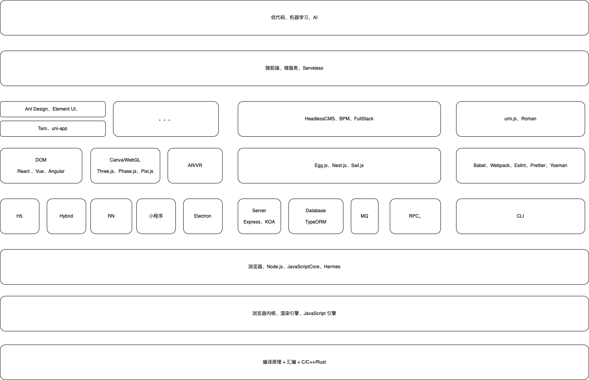
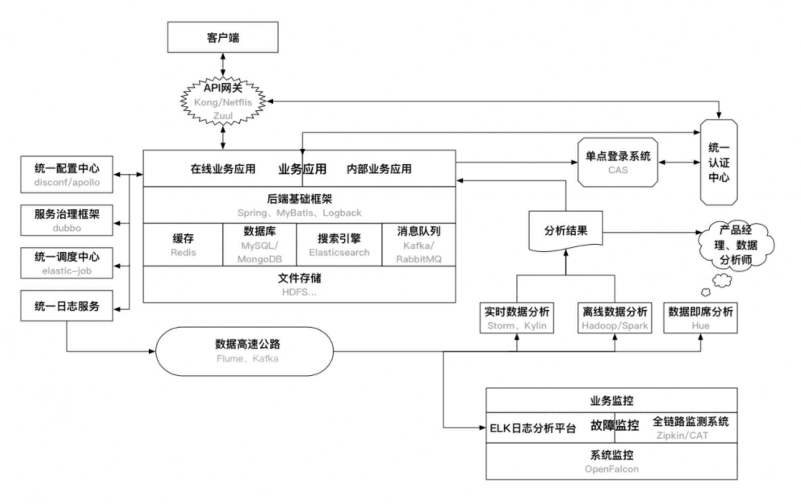
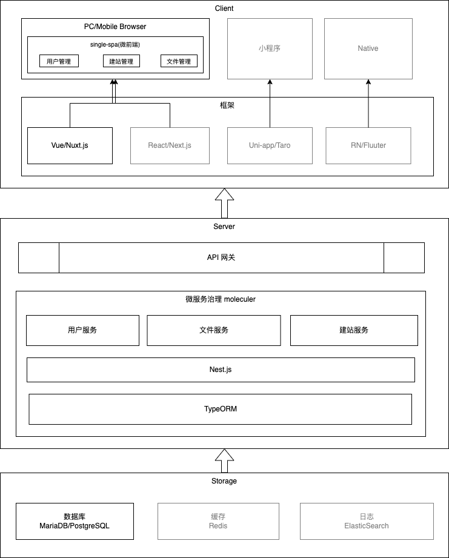

# 架构

- 技术选型
- 。。。

## 技术栈

- UI 框架：

    - DOM：React、Vue、Angular
    - Canvas / WebGL：Pixi、Three.js

- 渲染机制：Nutxt.js、Next.js、Remit、Gatsby.js

    - CSR：客户端（通常是浏览器）渲染
    - SSR：服务端渲染
    - SSG：静态网站生成
    - ISR：增量式的网站渲染；
    - DPR：分布式的持续渲染。

- 跨端开发框架：

    - Electron
    - Web App / PWA
    - Web App + JS Bridge
    - Hybrid App：Cordava、Ionic
    - React Native
    - Flutter
    - 小程序

- 工程化

    - 自动化测试：单元测试、集成测试、性能测试、兼容性测试
    - 错误兼容：收集 =》 上报 =》 存储 =》 分析 =》 报警 =》排查
    - 性能工程化管理：开发自检、性能测试、线上监控、运营分析
    - 规范化：编码规范、版本管理

## 系统架构

### 后端系统架构

ref: https://www.cnblogs.com/loren-Yang/p/11073536.html

### 前端同构

TODO: ...

## 项目架构

### @openeagle/uni-app

ref：https://developers.weixin.qq.com/miniprogram/dev/framework/quickstart/framework.html

### 前端编码规范

TODO

### JS-SDK

### @openeagle/sitebuilder

### next-app

ref：https://meiyou.gitlab.io/next-app/docs/basics/core-concepts/

### react-native

ref：https://github.com/zhbhun/frontend-learning/tree/b94e3a41db1cbd1b34214282566d89d92906f59f/framework/native/react-native/tutorial/share

## 设计模式

- 创建
- 结构
- 行为

## 参考文献

- [7 Principles of Rich Web Applications](https://rauchg.com/2014/7-principles-of-rich-web-applications)
- [聊聊移动端跨平台开发的各种技术](http://fex.baidu.com/blog/2015/05/cross-mobile/)
- [Appcelerator](https://www.appcelerator.com/)
- [百度轻应用](https://baike.baidu.com/item/%E8%BD%BB%E5%BA%94%E7%94%A8)
