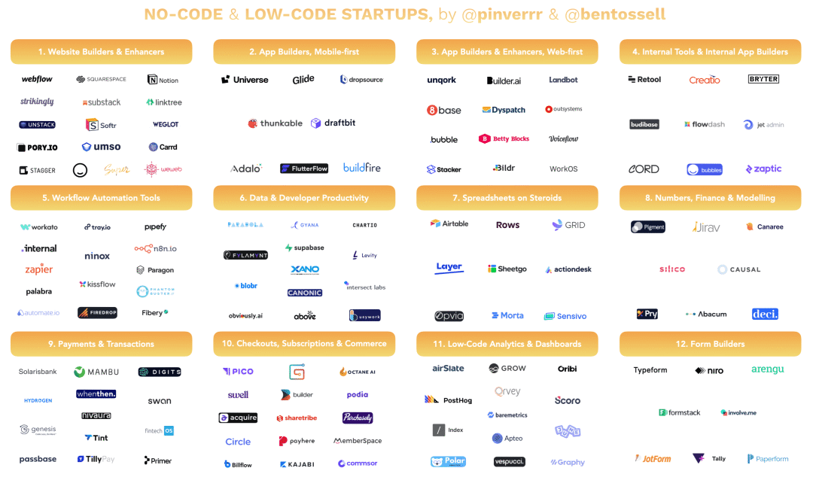

# 低代码

- [awesome-lowcode](https://github.com/taowen/awesome-lowcode)

## 定义

- [Discuz! 创始人戴志康：低代码不适合做什么？](https://mp.weixin.qq.com/s/tCE_IB-vd5jCVzwy4z6idg)
- [从 no-code 到 low-code 再到 pro-code](https://blog.csdn.net/peter7_zhang/article/details/114381474)
- [到底无代码和低代码有什么区别？](https://zhuanlan.zhihu.com/p/437162737)

### 是什么

> 只要能帮我们少写代码的技术或者产品，都称为低代码。

- 广义：低代码跟程序员使用的开发框架（如java的spring，python的django，go的gin）都是一样，抽出可复用的内容
- 狭义：低代码应该是更高层的低代码（如页面拖拉拽就能做出一个网站）

### 发展趋势

- 平台化：更强大、全面的低代码服务能力，一体化的交付平台
 
    独立的低代码厂商，比如 Airtable、伙伴云、明道云、轻流，思路是用低代码的方式直接服务于企业的数字化转型。基于这类平台，客户可以根据自己的需求随心所欲搭建内部系统，比如 CRM、售后系统、工单系统。

- 垂直化：专注于某一低代码场景、做精、深耕业务及服务能力

    型代表是 Salesforce，它们先是用开箱即用、近乎标准化的产品解决客户的某个痛点问题，比如客户管理。但你也知道，To B 领域，不同规模、不同行业的企业，需求大相径庭。所以，SaaS 类的产品在进入深水区后，都希望用低代码的能力（一般他们叫 aPaaS），更高效率地为客户交付定制化需求。

- 融合化：提供强大的适配能力及与 RPA、AI 的有机融合
- 云原生：两者目标相似，可以让低代码更关注业务应用

### 存在问题

- 平台化 VS 垂直化

    > 第一次使用伙伴云之类的低代码平台，我发现里面的热门应用模板有 CRM、进销存、OKR、人事管理。我惊呆了，这些应用，不都是有独立的 SaaS 公司在做吗？难道用低代码系统搭建出来的应用，能比外面某个垂直厂商做得好？就拿 CRM 来说，国内知名的产品有销售易、纷享销客等等。我很是好奇，什么样的客户会在低代码系统中搭建一个 CRM 系统出来。
    >
    > 一家做外贸的公司，规模不大，但对于 CRM 需求却非常个性化，它们卖皮革，每一块皮革都是一个单独的标号，SKU 特别多，销售流程也很特别。这时候，低代码平台就能很好解决他们的问题。也许某个 CRM 系统也能解决他们的问题，但这家外贸公司老板没舍得采购，因为加上定制化的需求，对于他们来说，成本太高了，并且，还有很多功能，他们压根用不上。
    >
    > 但必须也要承认，标准化的 CRM 系统，他们的价值之一是能够为客户交付一套方法论、一套理念。这类似于我们用飞书或者钉钉，表面上是为系统买单，实际上是在购买这些产品背后先进的协作理念。IT 系统，是方法论、价值观、流程的物理载体。
    >
    > 所以，对于低代码和垂直的 SaaS 产品，它们更多的是一种互补关系。举个例子，你往一个玻璃杯子里放石头，等石头塞满玻璃杯之后，你会发现其实玻璃杯中还有空隙。这时候，你还可以继续往装满石头的玻璃杯里倒入沙子。这些石头，就像是标准化的 SaaS 产品，而那些细碎的空隙，就是支持高度定制化的低代码系统。

- 低代码在和程序员抢饭碗。

    > ，低代码是可以替代一些增删改查的工作。但这不是挺好吗？难道真的有工程师就喜欢每天在那里重复写增删改查，喜欢别人叫他码农吗？不应该这样。工程师是艺术家，是有灵魂的人，大家的志向应该是写更有创造力的代码，而不是每天浪费生命在增删改查之上。少年心事当拿云。

    - [低代码平台似乎越来越成熟，前端程序员到底该往哪里深入学习才不会被替代，看完无远以及一些商城项目陷入迷茫了](https://v2ex.com/t/872578#reply33)

---

观点

> - 低代码 解决的 是交互的问题而不是抽象世界规律的问题。交互的问题 发展方向 是垂直行业和产业，大而全有点背道而驰。
>
> - 其实低代码产品是比较难做成的，特别是大而全的那种，由于考虑因素过多，导致步调很慢，也很难做到很易用，导致一边投入很大，一边又急切上线落地使用，从而出现平台方觉得投入很苦，使用方觉得不太好用还需吃狗粮的矛盾，往往需经过忍耐很长时间才可「守得云开见月明」，不过很多都在没有见月明的时候就奄奄一息了。反而专门领域的比如说表单、表格、图表低代码搭建活的很不错。还有一些 BaaS 类单领域的活得也还可以，我个人更偏向「易用的可很轻快解决对应领域问题低代码产品方案」。 —— [什么是比较好的低代码产品](https://mp.weixin.qq.com/s/si6h4uIRNDd2QGT1YsZXXQ)

#### 成本问题

- 开发成本

    - 高层抽象：越高层，它的可复用性就更低了，而开发它的成本更高，就是因为它的可复用性降低了，所以才需要找“某一个低代码场景”。
    - 灵活自由度：灵活度越低，高层低代码是可以存在的，但要找到一个复用性更高的场景（就是因为它的可复用性降低了，所以才需要找“某一个低代码场景”），带来的效果能节省更多的成本，不然得不偿失。
    - 变化：有变化之后，“高层低代码”需要做多大的改动才能适配，业务的场景是会变化的，还有流行的开发框架、开发语言都在变。

    总结，为啥高层低代码一直发展不起来呢？低代码有代价也有收益，成本包括一次性成本(设计开发)和增量成本(复用集成，维护升级)，收益有两个变量：复用度(复用的次数)和衰减率(需求变化速度及最终废弃)。抛开具体企业和行业的这两个因素非说低代码有用或没用是没意义的。

    ps：一些看法

    - 其实低代码产品是比较难做成的，特别是大而全的那种，由于考虑因素过多，导致步调很慢，也很难做到很易用，导致一边投入很大，一边又急切上线落地使用，从而出现平台方觉得投入很苦，使用方觉得不太好用还需吃狗粮的矛盾，往往需经过忍耐很长时间才可「守得云开见月明」，不过很多都在没有见月明的时候就奄奄一息了。反而专门领域的比如说表单、表格、图表低代码搭建活的很不错。还有一些 BaaS 类单领域的活得也还可以，我个人更偏向「易用的可很轻快解决对应领域问题低代码产品方案」。

- 学习成本

    - 复用和分享：不是所有人都同时精通 UI 交互、逻辑和业务，一般情况都是需要多种工种合作。能用直接使用别人的模板，在模块上修改加工，是最简单的方法。所以如何灵活的使用现有模板和模型也是重点。
    - AI 辅助：。。。

## 实现

- [Decoding the no-code / low-code startup universe and its players](https://pinver.medium.com/decoding-the-no-code-low-code-startup-universe-and-its-players-4b5e0221d58b)

    - https://airtable.com/shrTAtbFD2tG3c2xK/tblzt784s2tIaRwcr

- [简述国内几大无代码开发平台](https://zhuanlan.zhihu.com/p/141212899)
- [国内外几大无代码低代码平台评估](https://zhuanlan.zhihu.com/p/160026347)
- [开源低代码平台盘点，低代码开发真的能减少成本吗？](https://zhuanlan.zhihu.com/p/189595033)
- [Working Of Low-Code Development Platforms](https://www.softwaretestinghelp.com/low-code-development-platforms/#12_Mendix)
- [awesome-lowcode](https://github.com/HiJiangChuan/awesome-lowcode)

### 设计

#### UI

- figma
- Adobe XD
- Sketch

#### 原型

- [ProtoPie](https://www.protopie.io/) - Prototyping tool for any digital product—from mobile to IoT, from desktop to 
connected experiences. Never make wrong assumptions, convince stakeholders 
quickly, and save time & money.

#### 设计稿转代码

- [builder](https://builder.io/)

    - [Figma to HTML, CSS, React & more! | Figma](https://www.figma.com/community/plugin/747985167520967365/Figma-to-HTML%2C-CSS%2C-React-%26-more!)

- [imgcook](https://www.imgcook.com)

    - [imgcook | Figma](https://www.figma.com/community/plugin/951438743886938495/imgcook)

- [code.fun](https://code.fun/)

    - [CodeFun | Figma](https://www.figma.com/community/plugin/1061186349406580230/CodeFun)

- [figside](https://figside.com/)
- [siter](https://app.siter.io/)

    [我用 Figma/Figside/浩客 无代码搭了个人官网](https://sspai.com/post/78088)

- [deco](https://deco-preview.jd.com/)
- [BuilderX](https://builderx.io/) - BuilderX is a browser based design tool that codes React Native & React for you.
- [SuperNova](https://www.supernova.io/) - Supernova helps you build, mature, and scale your design system with ease. From powerful documentation to efficient design system management, it's the ideal end-to-end platform that grows with your design system.
- [animaapp](https://www.animaapp.com/) - Design to code, automated.
- [Picasso](https://github.com/wuba/Picasso)
- [蓝湖设计图一键生成](https://lanhuapp.com/dds?edm&utm_source=lanhu&utm_medium=mail&utm_campaign=dds&utm_term=20211129)

    - [蓝湖一键生成整页代码，帮开发留住头发](https://zhuanlan.zhihu.com/p/355970754)

- [Sketch2Code](https://sketch2code.azurewebsites.net/)
- [FigmaToCode](https://github.com/bernaferrari/FigmaToCode) - Generate responsive pages and apps on HTML, Tailwind, Flutter and SwiftUI.
- [figma-html](https://github.com/BuilderIO/figma-html)

参考文献

- [AI 助力中后台场景下的设计稿转代码](https://zhuanlan.zhihu.com/p/100806362)
- [设计稿（UI视图）自动生成代码方案的探索](https://tech.meituan.com/2021/03/25/ui2dsl-dsl2code.html)

### 图片

- [Canva](https://www.canva.cn/) —— 网站、演示文稿、图片和视频

    - [重磅功能：无代码做网站！](https://mp.weixin.qq.com/s/Yr61Ww5u_RbcdyXdHoKbjw)

- [稿定](https://www.gaoding.com/)
- [创客贴](https://www.chuangkit.com/)
- [图怪兽](https://818ps.com/)

### 网站

国外

- [No-code Gallery](https://nocode.gallery/)
- [wordpress](https://wordpress.com/)
- [dedecms](https://www.dedecms.com/)
- [discuz](https://discuz.com/)
- [plasmic](https://studio.plasmic.app/)

    - [设计系统的未来](https://www.bilibili.com/video/BV1KG4y1x75q/?spm_id_from=333.337.search-card.all.click&vd_source=2e69ba889e556e858093542d78fc08c0)

- [wix](https://zh.wix.com/) - Wix.com是一个在线网站创建服务，能让用户在其网络上网站编辑器中拖放工具创建HTML5网站。用户可在他们的网站编辑器中加入额外的功能，例如社交网络按钮、电子商务功能、联系表格、电子报及社群论坛等。
- [webflow](https://webflow.com) - Webflow, Inc.是一间美国公司，总部位于旧金山，为企业与设计师们提供网站建设, 网站设计与网站托管服务即SaaS 软件即服务。他们的可视化编辑器平台允许用户设计、建构和启动网站。
- [elementor](https://elementor.com/) - Power your vision with Elementor to build, manage and host stunning websites!
- [dhiwise](https://app.dhiwise.com)
- [framer](https://www.framer.com/) - You’ve never made a website this fast before. Really.
- [reactbricks](https://reactbricks.com/)
- [softr](https://www.softr.io/)
- [Pinegrow](https://pinegrow.com/) - Pinegrow lets you work faster with HTML, CSS / SASS, Bootstrap, Tailwind CSS, GreenSock Interactions, WordPress and WooCommerce.
- [Squarespace](https://www.squarespace.com/) - Squarespace是一个由网站创建工具、网页托管服务及博客平台所组成，并以软件即服务模式运作的网上内容管理系统。该服务让个人或公司创建及修改网站及博客。 
- [tilda](https://tilda.cc/) - Create beautiful websites without any code on Tilda
- [vev](https://www.vev.design/) - Vev is the only all-in-one design platform for professionals to create and launch unique web experiences with complete creative and technical freedom.
- [Shogun](https://getshogun.com/page-builder/) - Customize your entire Shopify store. Create an exceptional shopping experience that converts with a powerful drag-and-drop visual builder.
- [PageFly](https://pagefly.io/) - Build the site you want - with more conversion. Make your Shopify website work and look just like your idea without coding. Gain more sales and conversion in less time.
- [unbounce](https://unbounce.com/) - Unbounce is the AI-powered landing page builder with smart features that let you create beautiful, high-performing marketing campaigns in just a few minutes.
- [instapage](https://instapage.com/) - Instapage gives us the ability to tailor our landing page content and layout to tell a unique story for each geographical target. 
- [Hubspot](https://www.hubspot.com/) - Create, edit, and maintain a more secure and optimized website—with or without a developer Everything you need to build a powerful website that’s easy to update and grows with you.
- [strikingly](https://cn.strikingly.com/) - 几分钟制作一个网站
- [softr](https://www.softr.io/) - Build custom apps for your business, as easy as lego. Turn your Airtable or Google Sheets into client portals, partner apps or internal tools.

    allowing users to create sites and web apps using content from Airtable and other no-code tools.

- [pory](https://pory.io/) - Build apps visually, powered by your data. Complete projects 10x faster and at a fraction of the cost.

    allowing users to create sites and web apps using content from Airtable and other no-code tools.

- [super](https://super.so/) - Create Websites with Notion. Create a website in less than a minute that’s easy to manage and looks great, with instant page loads, SEO optimization, and no-code. All your content stays in Notion so you can focus on creating while Super handles the rest.
- [bettyblocks](https://www.bettyblocks.com/) - Build faster and innovate smarter with No-Code
- [8base](https://www.8base.com/) - Build Web Applications Fast and Limitless
- [builder]()
- [earlybird](https://earlybird.im/)

    这是个零代码制作 landing page 的产品，制作很不错的出海产品，作者正在 Twitter 上尝试 build in public，也在 V2EX 上发布了 [Product Hunt 发布心得](https://v2ex.com/t/904886#reply6)，如果有同样想要公开构建产品，或者计划应用出海的朋友，可以关注作者 [@LuoBaishun](https://twitter.com/luobaishun)。

- [Bootstrap Studio](https://bootstrapstudio.io/) - Bootstrap Studio has a beautiful and powerful interface, which is built around the simplicity of drag and drop. This makes it the perfect tool for prototyping and designing web pages and apps.
- [bricksbuilder](https://bricksbuilder.io/) - A Faster, More Customizable & Performant Tool To Visually Design Your Entire Site.

---

国内

- [钉钉宜搭](https://www.aliwork.com/)
- [微搭](https://cloud.tencent.com/product/weda)
- [爱速搭](https://suda.baidu.com/)
- [Zion](https://www.functorz.com/)
- [稿定](https://www.gaoding.com/)
- [qingzhan](https://www.qingzhan.com/)
- [易企秀](https://www.eqxiu.com/?type=home)

---

开源

- [lowcode-engine](https://github.com/alibaba/lowcode-engine) - 一套面向扩展设计的企业级低代码技术体系

    1. [前端智能化看“低代码/无代码”](https://mp.weixin.qq.com/s?__biz=Mzg4MjE5OTI4Mw==&mid=2247487655&idx=1&sn=9abd018bc7b345b3cab7b77b97b22e91&chksm=cf5b0f3bf82c862dd667bf8b7a2ebfd1cfea8d5ba03303bdd643d59bdf2fc961336d0e862e64&scene=178&cur_album_id=1806379264246644737#rd)
    2. [物联网低代码平台 IoT Studio 的思考和技术挑战](https://mp.weixin.qq.com/s?__biz=Mzg4MjE5OTI4Mw==&mid=2247487744&idx=1&sn=831b5a87f5827dc1cc606c7693d394a6&chksm=cf5b0e9cf82c878a3d4d65c96ed0f21f0f24f44dd99fe2e23636d273d42e3565be7a1b3d0040&scene=178&cur_album_id=1806379264246644737#rd)
    3. [2B 领域下的低代码探索之路](https://mp.weixin.qq.com/s?__biz=Mzg4MjE5OTI4Mw==&mid=2247487934&idx=1&sn=b9a987891e63820abc8364780d209a35&chksm=cf5b0e22f82c8734a91ad2de82dac76ac6f337b6a6fe2939d9afd7cbd396c13c972835051baf&scene=178&cur_album_id=1806379264246644737#rd)
    4. [云凤蝶低代码之路](https://mp.weixin.qq.com/s?__biz=Mzg4MjE5OTI4Mw==&mid=2247488169&idx=1&sn=2663385d8f3a3dabafa901422d19a9fc&chksm=cf5b0d35f82c84238f4a0a88acf17bcd5ef02e647b7ce3a7cea30de1a5bea5a35d5e032db964&scene=178&cur_album_id=1806379264246644737#rd)
    5. [企业级应用搭建平台是如何设计资产体系的？](https://mp.weixin.qq.com/s?__biz=Mzg4MjE5OTI4Mw==&mid=2247488740&idx=1&sn=63bd8145ebd7c69682f52f0ab42ca328&chksm=cf5b0b78f82c826e4cb4818fc2820e4c33946efdff94ea2bde04ff903186fab6b9da4a8a5128&scene=178&cur_album_id=1806379264246644737#rd)
    6. [阿里低代码引擎和生态建设实战及思考](https://mp.weixin.qq.com/s?__biz=Mzg4MjE5OTI4Mw==&mid=2247489735&idx=1&sn=c3841b1731fde2999ea6a617c91b9ed2&chksm=cf5b075bf82c8e4d7db70f86b3228a9e99db39d8a80e22f537ff903c6c40e169fa5e54bc9337&scene=178&cur_album_id=1806379264246644737#rd)
    7. [阿里低代码引擎 LowCodeEngine 正式开源！](https://mp.weixin.qq.com/s?__biz=Mzg4MjE5OTI4Mw==&mid=2247490617&idx=1&sn=996f1c1899f12bdc1b0de5436672f64b&chksm=cf5b03a5f82c8ab35a4b109ea986e2872ebf58e688fe05b8412b0b2f4915df61b5e6c10301c1&scene=178&cur_album_id=1806379264246644737#rd)
    8. [磁贴布局在钉钉宜搭报表设计引擎中的实现](https://mp.weixin.qq.com/s?__biz=Mzg4MjE5OTI4Mw==&mid=2247490761&idx=1&sn=3c8ea18a63fdd8e2f5066ce157eeada8&chksm=cf5b0355f82c8a43a9a81919b6de7b2a9546fdf1288dc16f9a827b796a3dcb6b7d6d5932989f&scene=178&cur_album_id=1806379264246644737#rd)
    9. [关于 LowCode&ProCode 混合研发的思考](https://mp.weixin.qq.com/s?__biz=Mzg4MjE5OTI4Mw==&mid=2247491552&idx=1&sn=80842e24cdf1a078dab7229ab1e18af0&chksm=cf5b007cf82c896ae14f5974667a163a2df1e762131d1720f4d407ec82593b2cc0656db96eef&scene=178&cur_album_id=1806379264246644737#rd)
    10. [低代码渲染那些事](https://mp.weixin.qq.com/s?__biz=Mzg4MjE5OTI4Mw==&mid=2247491681&idx=1&sn=387027420642ca4043f8bfd920d0badf&chksm=cf58fffdf82f76eb48fc1093a254733bfa72fb6562844a560cd7b168150dc133cc4dc6b27cc6&scene=178&cur_album_id=1806379264246644737#rd)
    11. [基于 LowCodeEngine 的调试能力建设与实践](https://mp.weixin.qq.com/s?__biz=Mzg4MjE5OTI4Mw==&mid=2247496453&idx=1&sn=a607815ef508f07b75b37f75b8e32251&chksm=cf58ec99f82f658facaf0dfd2ab0273b4c8864fd5483cea01030111c1a73750635db1403f222&scene=178&cur_album_id=1806379264246644737#rd)
    12. [低代码技术在研发团队的应用模式探讨](https://mp.weixin.qq.com/s?__biz=Mzg4MjE5OTI4Mw==&mid=2247497610&idx=1&sn=79621099a40efcee98b156eaec80c38c&chksm=cf58e816f82f6100ee39f69dcc07afb545a3aa7871654ef5f03543d4dfe78ef55b91cbb8f793&scene=178&cur_album_id=1806379264246644737#rd)
    13. [低代码多分支协同开发的建设与实践](https://mp.weixin.qq.com/s?__biz=Mzg4MjE5OTI4Mw==&mid=2247498965&idx=1&sn=666d22c4babb77647fdf36c5d6a5bb3c&chksm=cf58e349f82f6a5f4185798c8263753fcaace9180159394e3db7874ef15c81e4c8e125fa1bae&scene=178&cur_album_id=1806379264246644737#rd)
    14. [基于 LowCodeEngine 的低代码组件体系的建设和实践](https://mp.weixin.qq.com/s?__biz=Mzg4MjE5OTI4Mw==&mid=2247499841&idx=1&sn=139cb04400fd8125093dde3371e8a19f&chksm=cf58dfddf82f56cb031b674db73d489c2e3b0476168315e9032eeb82ca0c2d1cf0af259f0bab&scene=178&cur_album_id=1806379264246644737#rd)
    15. [低代码引擎 LowCodeEngine 茁壮成长的一年](https://mp.weixin.qq.com/s?__biz=Mzg4MjE5OTI4Mw%3D%3D&chksm=cf58dc6af82f557cc7d803dfa2fcc969d757231c7686f2d37403fe86fb68b64956dad05aa382&cur_album_id=1806379264246644737&idx=1&mid=2247500790&scene=178&sn=1f19767a8313c197ddb9e4e471d8a411&utm_source=pocket_reader)

- [designable](https://github.com/alibaba/designable) - Make everything designable
- [tmagic-editor](https://github.com/Tencent/tmagic-editor)
- [baidu/amis](https://github.com/baidu/amis) / [amis-editor-demo](https://github.com/aisuda/amis-editor-demo)
- [Webstudio](https://github.com/webstudio-is/webstudio) - Webstudio is an Open Source Visual Development Platform for developers, designers, and cross-functional teams.
You own the data, components, and infrastructure.

    - [Webstudio - next generation visual development](https://dev.to/oleg008/webstudio-next-generation-visual-development-4d0d)

- [grapesjs](https://github.com/GrapesJS/grapesjs) - Free and Open source Web Builder Framework. Next generation tool for building templates without coding
- [luban-h5](https://github.com/ly525/luban-h5)
- [page-pipepline/pipeline-editor](https://github.com/page-pipepline/pipeline-editor)
- [H5-Dooring](https://github.com/MrXujiang/h5-Dooring) / https://github.com/MrXujiang/pc-Dooring
- [Mometa](https://github.com/imcuttle/mometa)

    mometa 不是传统主流的低代码平台，而是面向研发的、代码可视设计编辑平台；它更像是 dreamweaver、gui 可视编辑之于程序员。它的定位更多是基于程序员本地开发的模式，新增了可视化编码的能力。

- [vite-vue3-lowcode](https://github.com/buqiyuan/vite-vue3-lowcode)

    vite-vue3-lowcode 是一个基于 Vite2.x + Vue3.x + TypeScript 的 H5 低代码平台。

- [vue-component-creater-ui](https://github.com/sahadev/vue-component-creater-ui) - 拖拽式Vue组件代码生成编辑器（VCC）
- [mall-cook](https://github.com/wangyuan389/mall-cook) - 商城低代码平台，可视化搭建H5、小程序多端商城
- [sparrow](https://github.com/sparrow-js/sparrow) - 场景化低代码（LowCode）搭建工作台，实时输出源代码
- [mometa](https://github.com/imcuttle/mometa) - 面向研发的低代码元编程，代码可视编辑，辅助编码工具
- [jeecg](https://github.com/jeecgboot/jeecg)  - JEECG 是一款基于代码生成器的 J2EE 快速开发平台，开源界“小普元”超越传统商业企业级开发平台。
- https://github.com/hlerenow/chameleon

#### 电子商务

- [Shopify](https://www.shopify.com/) - Shopify 为在线零售商提供一整套服务“包括支付、市场营销、运输和客户契合工具，以简化小型商户开设在线商店的过程”。
- [unstack](https://www.unstack.com/) - Unstack helps merchants create fast loading, personalized, eCommerce landing pages that convert up to 2x better than standard product pages.

#### 个人主页

make simple personal websites (like this one) in minutes, with your most important links at the core.

- [Linktree](https://linktr.ee/) - Help your followers discover everything you’re sharing all over the internet, in one simple place. They’ll thank you for it!
- [flooz](https://flooz.link/) - Setup your own profile in minutes and connect with your community.

#### 电子邮件

- [dyspatch](https://www.dyspatch.io/)

#### 付费订阅页

- [paywallscreens](https://www.paywallscreens.com/)

### App

drag-and-drop programming tools to allow anyone to make beautiful, native mobile apps without knowing how to code.

- [Dropsource](https://www.dropsource.com/) - Dropsource delivers custom mobile experiences, fast.
- [Thunkable](https://thunkable.com/#/) - No Code Mobile App Development Made Easy. 
- [draftbit](https://draftbit.com/) - Build the mobile app you've always wanted, without the time and cost.
- [adalo](https://www.adalo.com/) - Design And Build Custom Apps — No Code Required.
- [buildfire](https://buildfire.com/) - BuildFire’s powerful and easy to use mobile app builder makes it so you can create mobile apps for iOS & Android in a fraction of the time and cost.
- [Glide](https://www.glideapps.com/) - a tool that enables users to create mobile apps from Google Sheets. 
- [flutterflow](https://app.flutterflow.io/create-account) - No-code tool on top of Flutter (fastest growing mobile app dev framework) that enables teams to build cross-platform apps faster.
- [Universe](https://onuniverse.com/) - possibly the first mobile app that enables users to create websites using their mobile phones only.

### To B

- [BizWorks](https://help.aliyun.com/product/277044.html) - BizWorks是一体化的云原生应用的开发和运营平台，内置阿里巴巴业务中台构建的最佳技术实践。
- [nop-entropy](https://github.com/entropy-cloud/nop-entropy) - 基于可逆计算原理从零开始构建的低代码平台，支持GraalVM原生编译。 

    - [GPT驱动低代码平台生产完整应用的已验证策略](https://zhuanlan.zhihu.com/p/614745000)
    - [可逆计算：下一代软件构造理论](https://zhuanlan.zhihu.com/p/64004026)
    - [低代码平台需要什么样的ORM引擎？(1) canonical](https://zhuanlan.zhihu.com/p/543252423)
    - https://gitee.com/canonical-entropy/nop-entropy/blob/master/docs/tutorial/tutorial.md
    - [可逆计算原理和Nop平台介绍及答疑](https://www.bilibili.com/video/BV1u84y1w7kX/?vd_source=2e69ba889e556e858093542d78fc08c0)
    - [使用Nop平台开发商品列表页面的完整示例](https://www.bilibili.com/video/BV1384y1g78L/?vd_source=2e69ba889e556e858093542d78fc08c0)
    - [通过XView模型定制增删改查页面](https://www.bilibili.com/video/BV1cs4y1D7Tr/?vd_source=2e69ba889e556e858093542d78fc08c0)

#### Internal Tool

- [retool](https://retool.com/) - Stop wrestling with UI libraries, hacking together data sources, and figuring out access controls. Start shipping apps that move your business forward.

    - [低代码独角兽Retool启示录：只给程序员提升效率，每半年估值翻倍 | 全球独角兽](https://k.sina.com.cn/article_1750070171_684ff39b02001754d.html)

- [Appsmith](https://github.com/appsmithorg/appsmith)

    Appsmith 是一款开源低代码框架，主要用于构建管理面板、内部工具和仪表板等，允许拖放 UI 组件来构建页面，通过连接到任何 API、数据库或 GraphQL 源，并使用 JavaScript 语言编写逻辑，可以在短时间内创建内部应用程序。

- [mui/mui-toolpad](https://github.com/mui/mui-toolpad) - MUI Toolpad: Low-code admin builder. Open-source and powered by MUI.
- [ToolJet](https://github.com/ToolJet/ToolJet) - Extensible low-code framework for building business applications. Connect to databases, cloud storages, GraphQL, API endpoints , Airtable, etc and build apps using drag and drop application builder. Built using JavaScript/TypeScript. 
- [illa-builder](https://github.com/illacloud/illa-builder) - Retool open-source alternative, with low-code UI components and support for multiple data resources.
- [superblocks](https://www.superblocks.com/) - Superblocks is a programmable IDE for developers to build any internal app, workflow or scheduled job at a fraction of the time and cost. Ship next month's roadmap this week.
- [airplane](https://www.airplane.dev/) - Airplane is a developer-centric approach to building internal UIs and workflows.
- [YAO](https://github.com/YaoApp/yao)

    Yao 是一款支持快速创建 Web 服务和管理后台的开源低代码应用引擎。只需使用 JSON 即可创建数据库模型、编写 API 接口、描述管理后台界面的低代码引擎，使用 Yao 构建的应用可运行在云端或物联网设备上。

- [NocoBase](https://github.com/nocobase/nocobase)

    NocoBase 是一个极易扩展的开源无代码开发平台。 无需编程，使用 NocoBase 搭建自己的协作平台、管理系统，只需要几分钟时间。

- [steedos-platform](https://github.com/steedos/steedos-platform)

    华炎魔方是 Salesforce 低代码平台的开源替代方案，使用可视化工具进行模型设计, 页面设计, 流程设计, 报表设计 ， 只需点击鼠标，就能快速创建应用程序，实现敏捷开发的新高度。

- [mendix](https://www.mendix.com/) - Accelerate enterprise app development.
- [明道云](https://www.mingdao.com/home)

    - [什么是零代码开发平台，为什么企业IT应该重视？](https://blog.mingdao.com/11346.html)

- [码匠](https://majiang.co/) - 快速开发内部系统，写 SQL、配置组件，即可获得功能完善的内部应用，让您可以专注于业务发展。
- [rxeditor](https://github.com/rxdrag/rxeditor) - Design anything based on HTML. —— https://www.v2ex.com/t/920089?p=2

    - [实践，制作一个高扩展、可视化低代码前端，详实、完整](https://zhuanlan.zhihu.com/p/610182592)

---

- Retool, [BRYTER](https://bryter.com/), [Forest Admin](https://www.forestadmin.com/), [Budibase](https://budibase.com/), [Jet Admin(https://www.jetadmin.io/)] - Offering users fast ways to build internal applications and digital tools they can use for their daily work.
- [Creatio](https://www.creatio.com/): A low-code builder focused on marketing and sales-related tasks.
- [Flowdash](https://flowdash.com/): A low-code builder focused on ops teams.
- [Zaptic](https://zaptic.com/): No-code automation builder focused on frontline workers, providing users the capabilities to build multiple procedures in one application.
- [Cord](https://cord.com/), [Bubbles](https://www.usebubbles.com/): Allowing users to collaborate on any web page or SaaS tool they already use without needing to build internal tools.

#### Workflow Automation Tools

- [Workato](https://www.workato.com/), [Tray](http://tray.io/), [Pipefy](https://www.pipefy.com/), [Ninox](https://ninox.com/), [n8n](https://n8n.io/), [Zapier](https://zapier.com/): Allowing users to integrate their software applications using powerful automated workflows. Users can easily build and streamline processes using a beautifully designed visual workflow editor. Example: “When I get a new email in Gmail, copy the attachment from Gmail to Dropbox and then alert me on Slack about the new Dropbox file”. All of these companies can serve both SMEs and Enterprise customers. Another great player here is Integromat, which was recently acquired by Celonis.
- [Kissflow](https://kissflow.com/), [Process Street](https://www.process.st/), [Qatalog Workflows](https://qatalog.com/workflows/): no-code Business Process Management (BPM) tools.
- [Firedrop](https://firedrop.com/): similar to the above, but focused on creatives and creative work.
- [Internal](https://www.internal.io//): Allows anyone in a company to build powerful business solutions on top of their existing databases, APIs, and 3rd party applications.
- [Fibery](https://fibery.io/): Allows companies to bring every tool they already use under the same custom-built workspace in a matter of hours and save a lot of time in the long run.

#### BI

- [Grow](https://www.grow.com/): No-code, all-in-one business intelligence.
- [Oribi](https://oribi.io/): No-code marketing analytics.
- [Qrvey](https://qrvey.com/), [Apteo](https://www.apteo.co/), [Baremetrics](https://baremetrics.com/): SaaS-focused low-code analytics.
- [Posthog](https://posthog.com/), [June](https://june.so/): Low-code / no-code (respectively) product analytics.
- [Vespucci](https://vespuccianalytics.com/): Low-code mobile app analytics.
- [Index](https://tryindex.com/), [Graphy](https://graphyapp.com/): Dashboard builders.

#### Checkouts, Subscriptions, Memberships & Commerce

How not to address the elephant in the room, the ‘Creator Economy’, or ‘Passion Economy’: most people with access to the internet today can ‘scale themselves’ and monetise their unique skills online, or launch their own business online. Similarly, any eCommerce business today can run completely online. Who powers this? In large part, it’s low-code tools that automate the most technical or mundane parts of the job: building checkout pages, allowing someone to charge their customers via recurring payments, building membership management tools and powering commerce at large. Notable examples:

- [Commsor](https://www.commsor.com/), [Circle](https://circle.so/), [Memberstack](https://www.memberstack.com/), [Geneva](https://www.genevachat.com/): Helping community builders and creators bring together their discussions, memberships, and content. Some of these (e.g. Commsor, Memberstack) are focused on back-end, while others (e.g. Circle, Geneva) are more focused on front-end.
- [Purchasely](https://www.purchasely.com/), [Apapty](https://adapty.io/): Low-code tools for mobile app marketers and developers to build in-app subscriptions quickly and flexibly.
- [Gumroad](https://gumroad.com/), [Podia](https://www.podia.com/), [Kajabi](https://kajabi.com/): Online storefronts for online courses and digital products.
- [Pico](https://trypico.com/), [MemberSpace](https://www.memberspace.com/): audience relationship management and monetisation tools.
- [Swell](https://www.swell.is/), [Builder](https://www.builder.io/): Low-code, commerce-oriented headless Content Management Systems (CMSs) with full drag & drop no-code editing.
- [Payhere](https://payhere.co/), [Billflow](https://www.billflow.io/): Making subscription payments accessible to everyone.
- [Acquire](https://acquire.app/): Provides online merchants of varying sizes with a no-code, elevated checkout solution.

#### Payments & Transactions

One of the sectors in which we’ve seen some of the most powerful no-code and low-code applications is B2B payments and transactions: from tools to allow anyone to build a bank, to Zapier-like connectors orchestrating payments etc. Notable examples:

- [Solarisbank](https://www.solarisbank.com/), [Mambu](https://www.mambu.com/), [Swan](https://www.swan.io/): Banking as a Service (BaaS). Through these tools, pretty much any business can become a banking provider with nothing but a few lines of code.
- [Digits](https://digits.com/): a visual, ML-powered expense monitoring dashboard that analyses a business’ transactions by connecting with the tools they already use.
- [when then](https://whenthen.com/), [Primer](https://primer.io/): low-code payments orchestration software.
- [Nivaura](https://www.nivaura.com/), [Genesis](https://genesis.global/): low-code builders designed specifically for Financial Markets.
- [Passbase](https://passbase.com/): Allowing users to integrate seamless, bank-level identity verification into their website, app, or checkout with just a few lines of code.
- [Hydrogen](https://www.hydrogenplatform.com/), [Tint](https://www.tint.ai/): no-code tools to embed financial services / insurance (respectively) into a company’s products and services.

### 办公

#### PPT

- [Canva](https://www.canva.cn/) —— 网站、演示文稿、图片和视频

#### Form

- [form-generator](https://github.com/JakHuang/form-generator)

    Element UI 表单设计及代码生成器，可将生成的代码直接运行在基于Element的vue项目中；也可导出JSON表单，使用配套的解析器将JSON解析成真实的表单。

- [variant-form](https://github.com/vform666/variant-form) - A powerful form designer for Vue.
- [Typeform](https://www.typeform.com/)
- [Arengu](https://www.arengu.com/)
- [Formstack](https://www.formstack.com/)
- [Tally](https://tally.so/)
- [Niro](https://niro.co/): Allowing users to build beautifully designed, professional-looking and intelligent online forms without code.

#### Spreadsheets

- [Airtable](https://airtable.com/), [Rows](https://rows.com/), [Actiondesk](https://www.actiondesk.io/): Spreadsheets that can be used as databases, letting users build various types of automations, such as importing and refreshing data and more.
- [GRID](https://www.grid.is/), [Layer](https://golayer.io/), [Sheetgo](https://www.sheetgo.com/): Adding collaboration and workflow features on top of MS Excel and Google Sheets.
- [Opvia](https://www.opvia.bio/), [Morta](https://morta.io/), [Sensivo](https://www.sensivo.eu/): industry-specific spreadsheets providing powerful automations. Respectively, they have been called “The Airtable for Scientists”, “The Airtable for the Architecture, - Engineering & Construction industries”, and “The Airtable for Clinical Researchers”.

#### 简历

- [rxresu](https://rxresu.me/) / https://github.com/AmruthPillai/Reactive-Resume

    这是一个开源的简历制作工具网站，你可以创建任意数量的简历。也可以把简历导出为 JSON 备份到自己的设备。产品做的非常干净好看。编辑界面也很方便。

### 其他

- [powerplatform](https://powerplatform.microsoft.com/)
- [rowy](https://github.com/rowyio/rowy) - https://github.com/rowyio/rowy
- [node-red](https://github.com/node-red/node-red) - Low-code programming for event-driven applications
- [erupts/erupt](https://github.com/erupts/erupt) - 纯 Java 注解，单个类文件，快速开发 Admin 管理后台。不生成任何代码、零前端代码、零 CURD、自动建表、注解式API、自定义服务逻辑，支持所有主流数据库，支持自定义页面，支持多数据源，提供二十几类业务组件，十几种展示形式，支持逻辑删除，动态定时任务，前端后端分离等。
- https://github.com/imcuttle/mometa
- [amplication](https://github.com/amplication/amplication) - Amplication is an open‑source development tool. It helps you develop quality Node.js applications without spending time on repetitive coding tasks.

    - https://medium.com/@itsrakesh/auto-generate-your-nodejs-app-admin-ui-1e0aeaf92cd7

- [directus](https://github.com/directus/directus) - Open-Source Data Platform 🐰 — Directus wraps any SQL database with a real-time GraphQL+REST API and an intuitive app for non-technical users.
- [yao](https://github.com/YaoApp/yao) - Yao A low code engine to create web services and dashboard.
- https://github.com/tnfe/shida
- [rxeditor](https://github.com/rxdrag/rxeditor) - 基于Bootstrap实现的，HTML可视化编辑工具。

    - [rxdrag](https://rxdrag.com/) - rxDrag，一款全栈低代码平台，基于TypeScript生态构建
    - [RxDrag低代码前端解读](https://www.bilibili.com/video/BV1sX4y1R76r/?vd_source=3ce9f53a6e5affa0588763dacdb8ff15)
    - [业务编排深入交流会](https://www.bilibili.com/video/BV1ao4y1W766/?vd_source=2e69ba889e556e858093542d78fc08c0)

## 问题

- 低代码技术应用什么程度，未来会不会出现杀手级的应用，会是什么？

	- To C
	- To B

- 低代码与开源如何结合？

	> 先得百家争鸣，随后各方诸侯割据，接着群雄争霸兼并重组，然后开始三国演义，逐渐互相制衡标准趋同

	> 目的就是为了在同一标准下构建生态，那么只有标准统一了，拼装自然简，只有标准统一，才能实现我们的根本目的------自动化。

- 低代码三五年——能得到普通标准吗

## 参考文献

- [从实现原理看低代码](https://zhuanlan.zhihu.com/p/451340998)
- [云凤蝶低代码之路](https://developer.aliyun.com/article/786592#slide-6)
- [React：搞了半天，我才是低代码的最佳形态](https://zhuanlan.zhihu.com/p/561674446)
- [盘点12个 yyds 的低代码开源项目](https://zhuanlan.zhihu.com/p/554893860)
- [什么是比较好的低代码产品](https://tw93.fun/2023-01-02/low-code.html) / 什么是比较好的低代码产品

    > 其实低代码产品是比较难做成的，特别是大而全的那种，由于考虑因素过多，导致步调很慢，也很难做到很易用，导致一边投入很大，一边又急切上线落地使用，从而出现平台方觉得投入很苦，使用方觉得不太好用还需吃狗粮的矛盾，往往需经过忍耐很长时间才可「守得云开见月明」，不过很多都在没有见月明的时候就奄奄一息了。反而专门领域的比如说表单、表格、图表低代码搭建活的很不错。还有一些 BaaS 类单领域的活得也还可以，我个人更偏向「易用的可很轻快解决对应领域问题低代码产品方案」。
