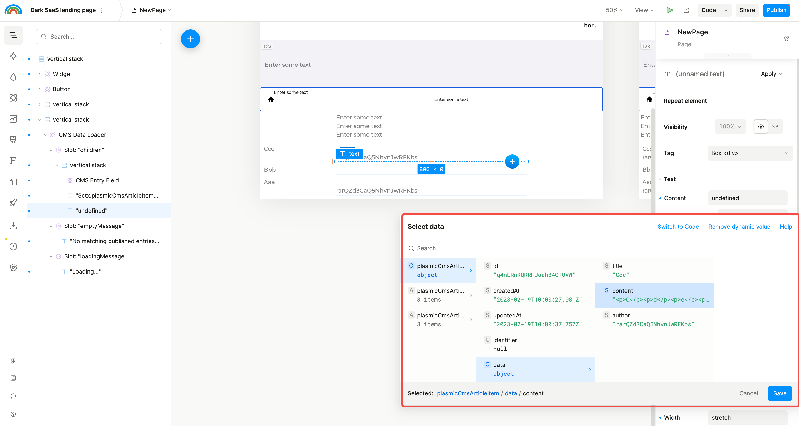

## Plasmic CMS

### Models

- 新增

    

- 编辑表

    

- 编辑表字段

    

- 编辑器表字段类型

    

### Data

### Usage

- 添加 CMS 组件

    

- 设置 CMS 数据源

    

    

- CMS 组件图层结构

    

- CMS 组件属性：可以设置表、过滤、排序、数量限制

    

- CMS 组件元素

    - 添加 CMS 组件元素

        

    - CMS 组件元素属性

        

- 普通文本组件元素

    - 右击文本元素的 content，可以选择绑定动态数据

        

    - 选择要绑定的数据字段

        

    - 再次右击文本元素的 content，可以修改或取消绑定动态数据

        

- 图片组件元素：类似文本组件，也可以右击选择绑定数据

    

## Rest API Fetcher

- 添加 Rest API Fetcher 组件

    

- Rest API Fetcher 组件结构和属性设置

    

- 普通文本元素

    - 在 children 节点添加文本元素

        

    - 开启文本元素的 repeat，并绑定到动态数据上

        

    - 右击文本元素的 content 属性，可以选择想要绑定的数据项

        

        
