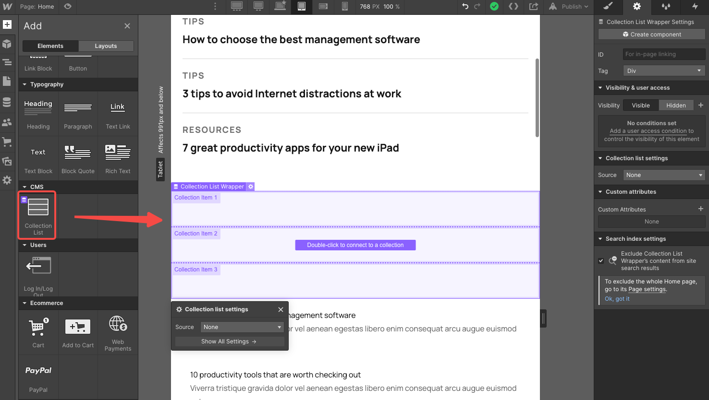

# Webflow

webflow 提供了一个 Collection List 组件，可以用来加载远程数据，这些远程数据是直接在 CMS Collection 里维护。

## Collections

CMS Collections 由一系列的 Collection 组成，每个 Collection 相当于数据库表。


### Templates

Webflow 预设提供了一些 Collection 模板，方便快速创建。

- Blog Posts
- Authors
- Categories
- Projects
- Clients
- Team Member
- Listings
- Events
- Menu Items
- Songs
- Shows
- Recipes

### Collection

- name：类似于数据库表名称，例如：blogs
- url：对应数据集合的访问路径，例如：blogs，访问路径为 `xxx.webflow.io/blogs/yyy`
- fields：类似于数据库表字段，name 和 slug 是两个自带必须的字段。

    可以添加自定义字段，类型可以是：文本、富文本、图片、多图、视频、链接、邮箱、电话，日期、开关、颜色、选项、文件和引用。

    

### Data

- List

    

- New

    

- Edit

    

## 使用组件

### 添加组件



### 关联数据源


关联后可以在元素属性设置里查看并修改，如果子元素已经绑定了数据的话，数据源是无法再修改的。


### 处理数据


- 可以切换 UI 状态：有数据和无数据
- 布局：水平两列，水平三列，水平四列，水平六列，水平一列
- 过滤：

    1. 选择过滤字段
    2. 选择判断条件：等于或不等于
    3. 判断值

- 排序

    1. 选择排序字段
    2. 排序方向

- 分页显示

    - 每页大小
    - 控制当前分页

- 限制元素数量：多少条，从第几条开始

### 图层结构

```shell
|- Collection List Wrapper
|--- Collection List # 列表插槽
|----- Collection Item # 列表项插槽
|--- Empty State # 数据库插槽
|--- Pagination # 分页插槽
|----- Previous # 上一页插槽
|----- Next # 下一页插槽
```

### 可用插槽

- 列表项
- 空数据提示
- 上一页或下一页插槽

### 数据绑定

- 文本

    

- 图片

    

### 动态样式

- 文本

    

- 图片

    
