plasmic 支持自定义组件的插槽功能。

## 自定义组件插槽

### 添加文本插槽

1. 选中要支持插槽的文本节点，右键选择 “Convert to a slot target”

    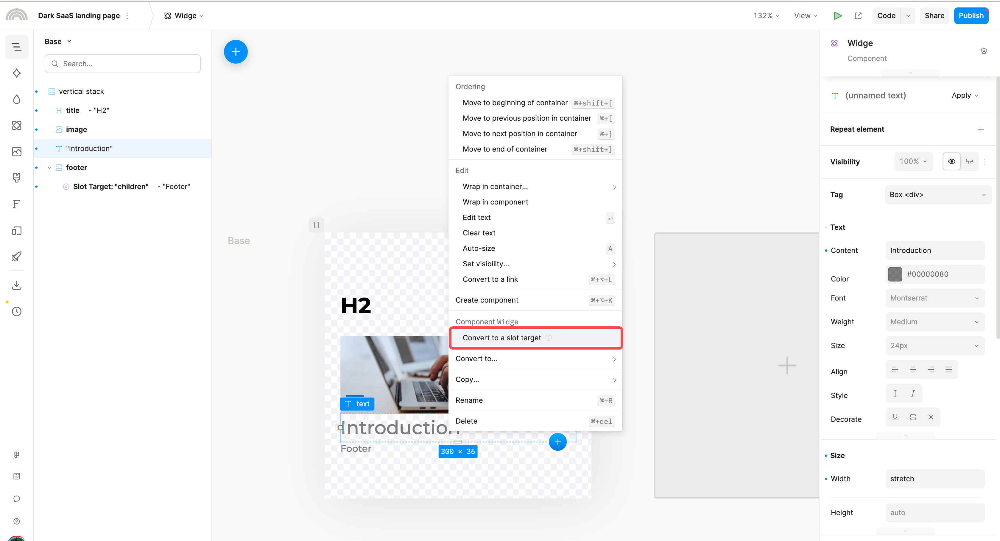

2. 转换为插槽的节点会被一个新的容器节点包裹

    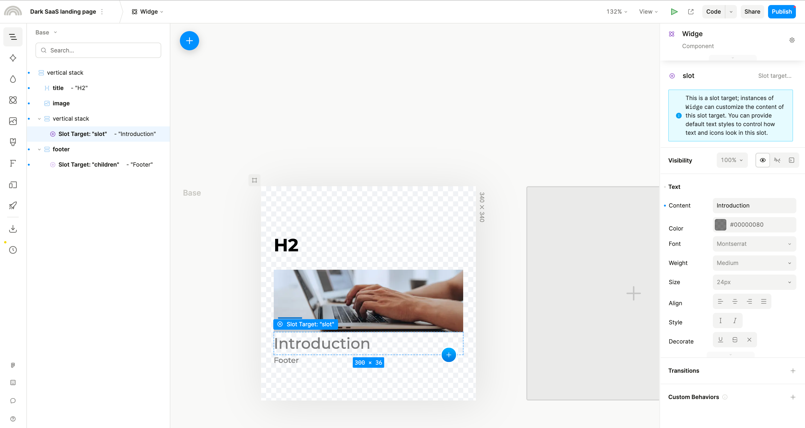

3. 这个新容器可以添加额外的子元素，并且可以设置为嵌套的插槽

    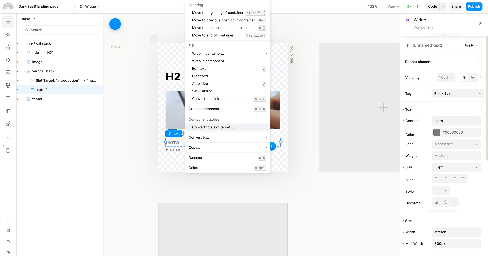

### 添加容器插槽

类似文本插槽，可以选择某个容器节点作为插槽，但是容器节点本身就是容器不会再创建额外的包装容器了。

- 无数据容器插槽

    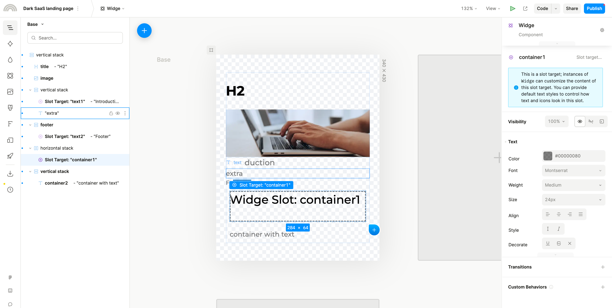

- 有数据容器插槽

    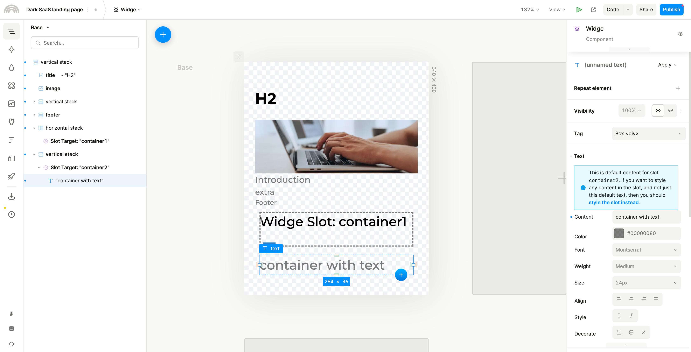

### 使用插槽组件

- 组件图层结构：图层里只会显示插槽节点，其他非插槽节点不会显示

    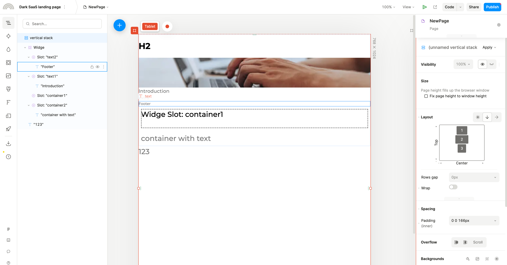

- 文本插槽节点：

    - 文本插槽节点可以直接双击编辑内容

        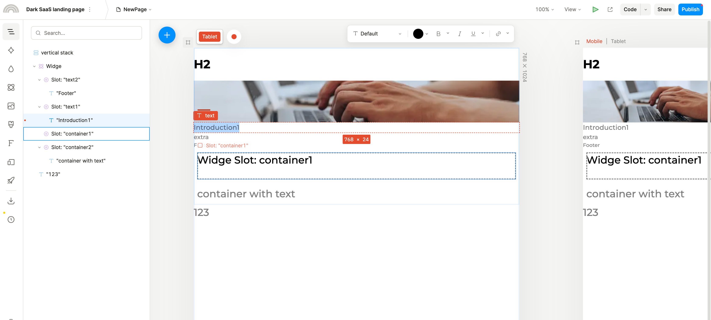

    - 可以在文本插槽节点里添加其他组件(相当于在上文提到的包装容器里添加元素)

        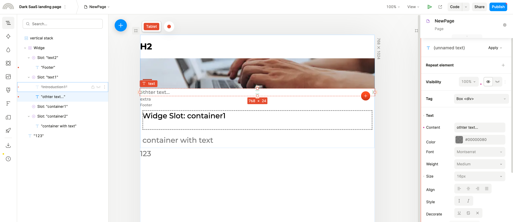

    - 无法修改文本插槽节点容器的样式

        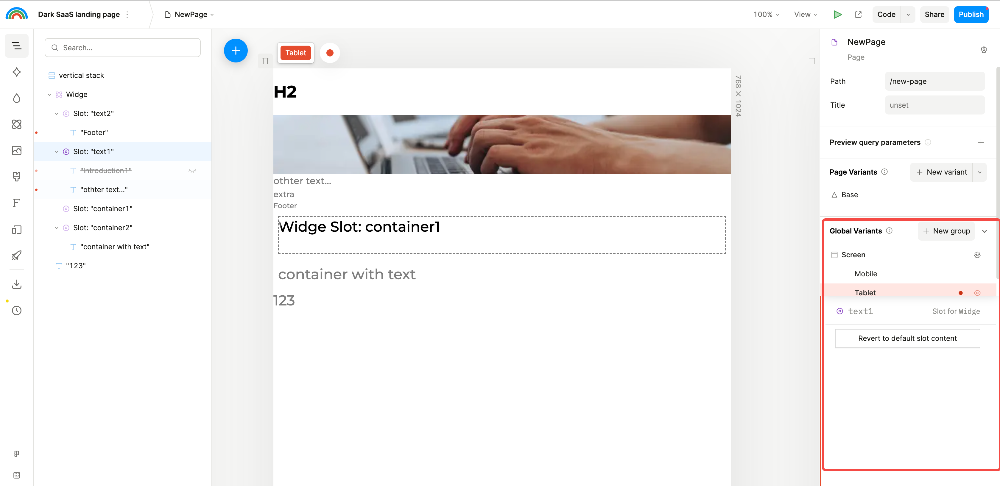

    - 可以修改文本节点的样式

        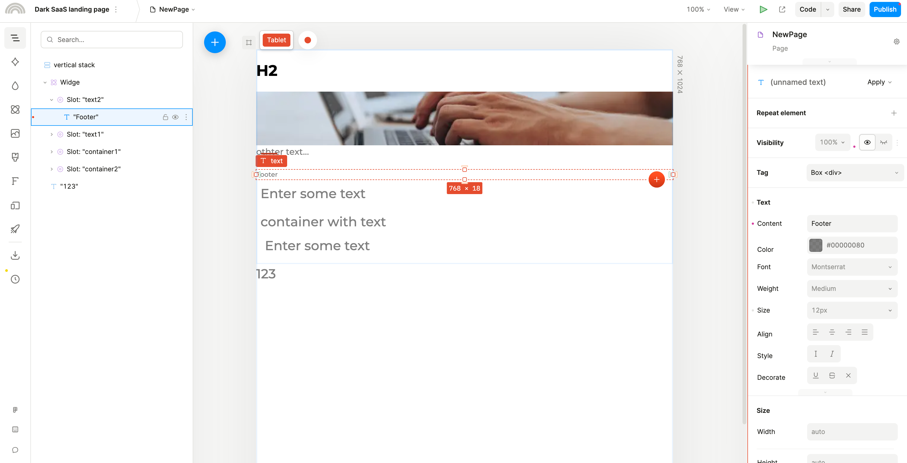

    ps：文本查查节点可以理解为非空容器插槽节点

- 空容器插槽节点：

    - 空容器插槽节点会默认显示占位内容，然后选中后可以添加其他组件

        

    - 添加其他组件后会按组件设定的布局样式进行显示

        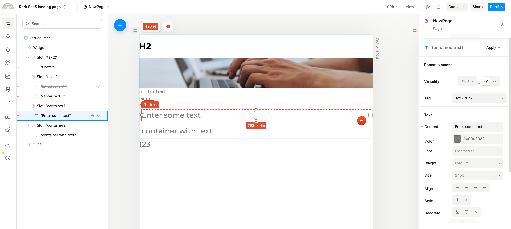

    - 类似文本插槽节点，也无法修改容器节点的布局样式

        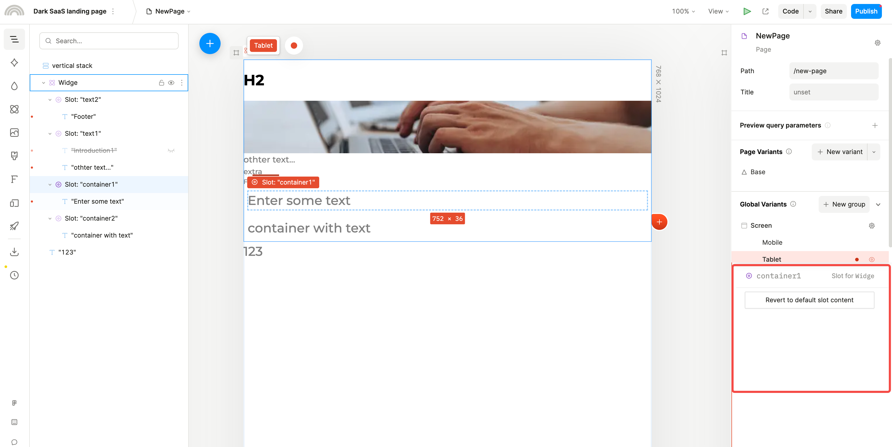

- 非空容器插槽节点

    - 非空容器插槽节点和文本查查节点基本一致
    - 插槽节点内预先添加的子容器可以自由添加子元素，并且该容器节点是可以自由定制样式的

        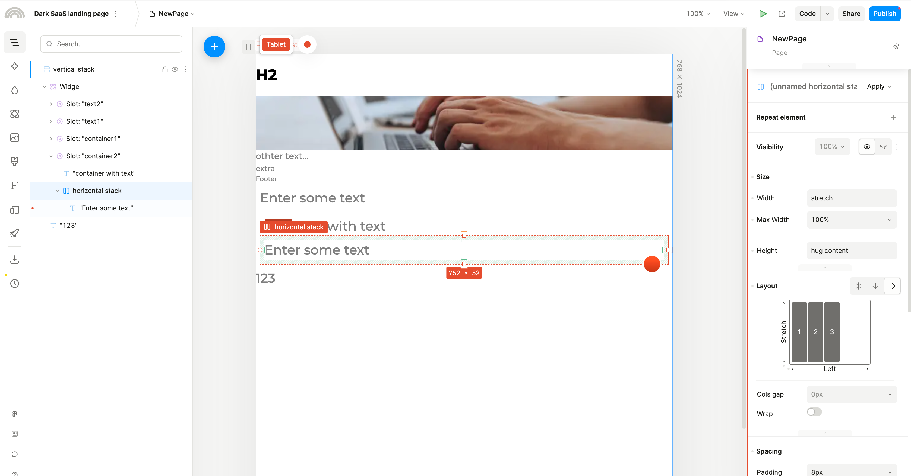

## 开发组件插槽

？？？

## 原理分析

- 容器元素设置为插槽时，会在容器里添加一个插槽，并且可以给插槽添加子组件；

    ps：可以将插槽理解成 React 的 Fragment 组件，插槽里添加的子组件是插槽提供的默认内容。

- 非容器元素设置为插槽时，会新建一个带插槽的容器元素，选中的非容器元素会作为插槽的默认内容。
- 插槽所在的容器元素可以在插槽之前或之后添加额外的组件元素。
- 插槽内的元素和插槽的兄弟元素共同在父容器里一起布局渲染。
- 使用插槽组件时，组件图层只会显示插槽节点和插槽的子元素节点，其他组件子元素不会显示在图层里。
- 空插槽默认会显示占位内容：”{组件名称} Slot: {插槽名称}“
- 非空插槽的子元素被修改后会失去和组件的同步(组件对子元素的修改不会影响使用组件修改后的子元素)。
- 插槽是一个虚拟节点，无法为其设置样式来影响子元素的布局(只能修改插槽所在的容器节点)，但可以选中，可以添加更多的子元素，也可以拖拽元素到插槽内。

    ps：插槽节点是一个 display 设为 content 的元素。

存在问题

1. 无法调整插槽节点的布局样式，但是可以在容器里添加子容器来自行实现；
2. 自由布局的插槽节点元素无法自由拖拽。
