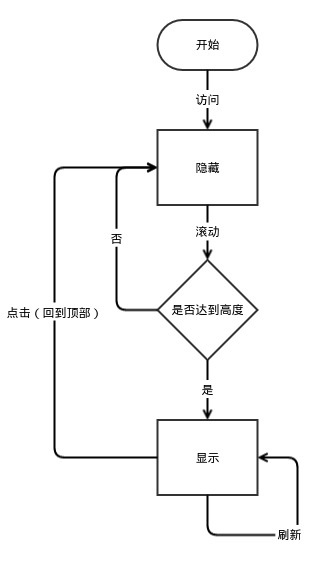

# 实现
## Bootstrap
- 

# 实际应用
## 导航条

- [有道词典](http://dict.youdao.com)
- [Github Profile](https://github.com/zhbhun)

## 回到顶部
回到顶部是在浏览器滚动到一定高度后，出现的一个固定位置的按钮（一般在屏幕下方出现），点击后可以返回到顶部。

实现

- [websiddu/backTotop](https://github.com/websiddu/backTotop) - A jquery plugin to implement the back to top button, when you have a long page and scrolled to bottom.
- [CloudflareApps/BackToTopButton](https://github.com/CloudflareApps/BackToTopButton) - A simple button to scroll the window back to the top.
- [Back To Top](https://codyhouse.co/gem/back-to-top/)

案例

- [CNode.js](https://cnodejs.org/) | `./application/backtotop/cnodejs`
- [知乎](https://www.zhihu.com/)
