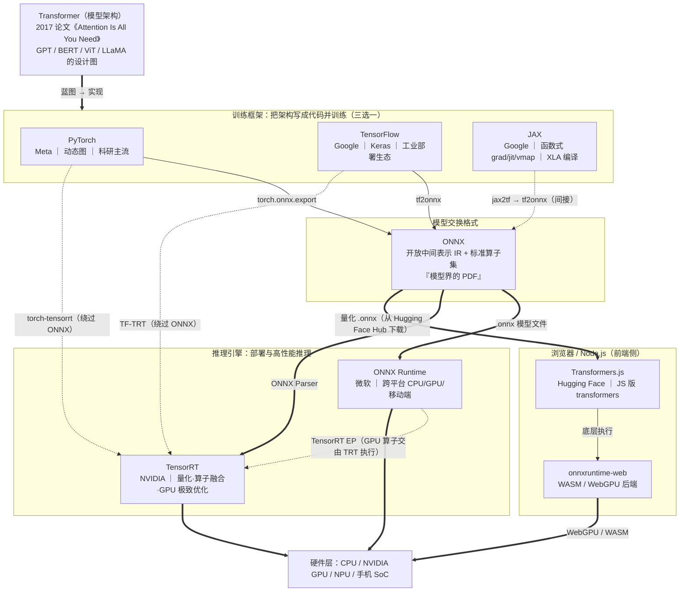

## 概念

- AI（人工智能） = 构建能做智能事情的系统
- NLP（自然语言处理）= 构建能理解语言的系统
- ML（机器学习） = 构建能从经验中学习的系统
- NLP ⋂ ML= 构建能够学习如何理解语言的系统

ps：NLP 能够解决AI中一系列的问题，机器学习（ML）也能够解决AI中一系列的问题，，这些问题的解决方案也有可能帮助解决其他AI问题。

参考文献

- [[译] ML vs AI vs NLP：人工智能核心探秘](https://toutiao.io/posts/d3hxnt/preview)
- [人工智能简介 AI ML DL CNN RNN NLP](https://zhuanlan.zhihu.com/p/86131552)
- [【AI氪堂】第1期——NLP自然语言的起源与发展](https://cn.linkedin.com/pulse/ai%E6%B0%AA%E5%A0%82%E7%AC%AC1%E6%9C%9Fnlp%E8%87%AA%E7%84%B6%E8%AF%AD%E8%A8%80%E7%9A%84%E8%B5%B7%E6%BA%90%E4%B8%8E%E5%8F%91%E5%B1%95-%E4%B8%8A%E6%B5%B7%E5%AE%9C%E6%B0%AA%E6%95%B0%E6%8D%AE%E7%A7%91%E6%8A%80%E6%9C%89%E9%99%90%E5%85%AC%E5%8F%B8)

## NLP

- [AI产品经理必修课：NLP技术原理与应用](https://www.woshipm.com/pmd/2937210.html)

## 框架

核心流水线：**算法 → 训练 → 模型交换格式 → 推理部署**。

| 名称 | 定位 | 说明 |
|---|---|---|
| Transformer | 网络架构（算法） | 唯一的非软件项，是"设计图"；其余七个都是围绕它的工程工具 |
| PyTorch | 训练框架 | 把架构写成代码、跑反向传播训练权重，科研界事实标准 |
| TensorFlow | 训练框架 | 与 PyTorch 平级竞争，Google 出品，Serving/TFLite 部署链完整 |
| JAX | 训练框架（数值计算库） | 同样平级，函数式 API + `grad/jit/vmap` 变换 + XLA 编译，PaLM/Gemma 等大模型科研常用 |
| ONNX | 模型格式标准 | 开放中间表示（类比编译器 IR / "模型界 PDF"），让训练侧与部署侧解耦 |
| ONNX Runtime | 推理引擎 | 加载 `.onnx` 做跨平台推理，通过 Execution Provider 机制接入各家硬件加速 |
| TensorRT | 推理引擎 | NVIDIA 专用，做量化（FP16/INT8）、算子融合、kernel 自动调优，GPU 上速度最快 |
| Transformers.js | 浏览器/Node.js 推理库 | Hugging Face 出的 JS 版 transformers，底层用 onnxruntime-web（WASM/WebGPU）加载量化后的 .onnx 模型 |

关键关系

1. Transformer ≠ 其余七者：它是算法层的架构，训练框架负责把它"实现 + 训练"，属于不同层次。
2. PyTorch / TensorFlow / JAX 是平级竞争关系：解决同一个问题（定义模型、自动求导、GPU 加速训练），选一个即可。
3. ONNX 是中间解耦层：训练框架导出 `.onnx`，任何推理引擎都能加载——一次导出，处处运行。
4. ONNX Runtime 与 TensorRT 可嵌套：ORT 的 TensorRT Execution Provider 能把可加速的算子委托给 TensorRT 执行，其余回落到自己的 CPU/CUDA 实现。
5. ONNX 不是必经之路：`torch-tensorrt`、`TF-TRT` 可从训练框架直连 TensorRT；JAX 的主流路径是 XLA 编译而非 ONNX。
6. Transformers.js 是前端视角的入口：它在浏览器/Node.js 里复用 ONNX 生态，模型从 Hugging Face Hub 拉取量化 `.onnx` 文件，由 onnxruntime-web 执行（WebGPU 优先，回落 WASM）。对前端工程师来说，"训练在云端（PyTorch 等），推理在本地（Transformers.js）"。

典型数据流：用 PyTorch 写 Transformer 并训练 → `torch.onnx.export` 导出 `.onnx` → 服务端用 TensorRT（或 ORT+TRT EP）在 GPU 上推理，端侧/浏览器用 ONNX Runtime（Transformers.js 底层的 onnxruntime-web）跑 CPU/移动端。

参考链接

- [TensorFlow.js](https://www.tensorflow.org/js)
- [pytorch](https://github.com/pytorch/pytorch) - Tensors and Dynamic neural networks in Python with strong GPU acceleration
- [jax](https://github.com/google/jax) - Composable transformations of Python+NumPy programs: differentiate, vectorize, JIT to GPU/TPU, and more
- [Brain.js](https://brain.js.org/#/)
- http://caza.la/synaptic/#/
- https://ml5js.org/
- [jina](https://github.com/jina-ai/jina) - Build cross-modal and multimodal applications on the cloud · Neural Search · Creative AI · Cloud Native · MLOps
- [Transformers.js](https://huggingface.co/docs/transformers.js) - Run 🤗 Transformers in the browser (ONNX Runtime Web powered)
