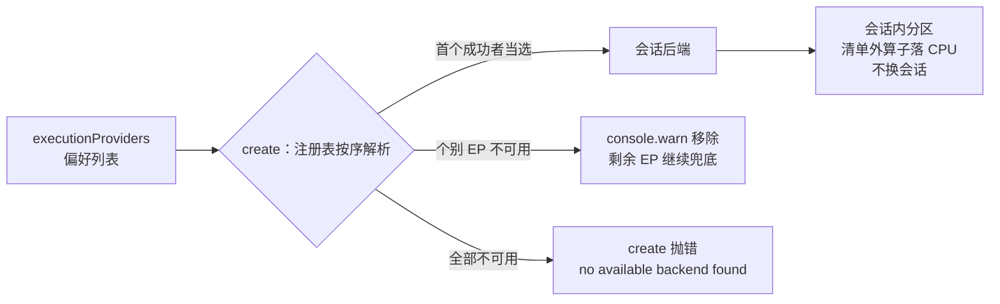

import { Canvas, Controls, Meta } from '@storybook/addon-docs/blocks';
import * as BackendSelection from './backend-selection.stories';

<Meta of={BackendSelection} name="Docs" />

# 后端选择与回退

[InferenceSession.create](?path=/docs/inference-session--docs) 的选项里有一个特别的成员：`executionProviders`。它不是「开哪个后端」的开关清单，而是一份**按序尝试的偏好列表**——create 时运行时按数组顺序逐个初始化后端，第一个成功的当选；个别 EP 不可用就警告一声继续兜底，全部不可用才抛错。本课讲清这套机制的三层事实：**数组顺序在 create 阶段怎么起作用、回退的两种形态分别发生在哪一层、能请求哪些 EP 由导入入口决定**，并给出 WebGL（维护模式）与 WebNN（实验状态）两个特殊后端的现状口径。单个后端自身的启用与边界见 [WebAssembly 后端](?path=/docs/backend-wasm--docs)与 [WebGPU 后端](?path=/docs/backend-webgpu--docs)课程。



「EP」指执行提供者（Execution Provider），即 `executionProviders` 数组里的后端名字。1.30.0 各入口实际注册的名字与优先级如下（实测自 dist 里的 `registerBackend` 调用）：

| EP 名 | 注册它的导入入口 | 注册优先级 | 状态口径 |
| --- | --- | --- | --- |
| `wasm` / `cpu` | 全部入口 | 10 | CPU 兼容基线，算子全覆盖 |
| `webgpu` | 默认入口、`/webgpu`、`/all`、`/jspi` | 5 | GPU 主力后端（Chromium 系） |
| `webnn` | 默认入口、`/webgpu`、`/all`、`/jspi` | 5 | 实验特性：仅 Windows Chromium 且需启动标志 |
| `webgl` | 仅 `/all`、`/webgl` | -10（不参与自动回退） | 维护模式，官方建议迁移 WebGPU |

`/jspi` 是 wasm 的 JSPI 变体构建，注册的 EP 名相同。优先级为负的后端不会出现在「未指定 `executionProviders`」的默认尝试顺序里，也永远不会被自动回退选中——这个规则决定了 webgl 的全部行为，见下文「WebGL：维护模式的后端」一节。

## 快速上手

选后端只涉及两段代码：能力检测决定数组怎么写，create 的结果做最终裁决：

```ts
import { env, InferenceSession } from 'onnxruntime-web';

// wasm 资源与安装版本配套，必须在第一个会话创建前设置
env.wasm.wasmPaths = 'https://cdn.jsdelivr.net/npm/onnxruntime-web@1.30.0/dist/';
env.wasm.numThreads = 1; // 无跨域隔离响应头时保持单线程

const MODEL_URL =
  'https://media.githubusercontent.com/media/onnx/models/main/validated/vision/classification/mnist/model/mnist-8.onnx';

// 能力检测只是第一道门；Safari 有 navigator.gpu 但不在 ort 支持矩阵内
const hasGpuApi = 'gpu' in navigator;

let session: InferenceSession;
try {
  session = await InferenceSession.create(MODEL_URL, {
    // 首选 GPU，wasm 兜底：清单外算子由 JSEP 分区落 CPU，EP 不可用则警告后回 wasm
    executionProviders: hasGpuApi ? ['webgpu', 'wasm'] : ['wasm'],
  });
} catch (error) {
  // 走到这里说明所有请求的 EP 都不可用（如入口不含该 EP、名字写错）
  session = await InferenceSession.create(MODEL_URL, { executionProviders: ['wasm'] });
}
```

注意一个反直觉的默认行为：**不写 `executionProviders` 时永远整图跑 CPU**，哪怕浏览器支持 WebGPU——注册表虽然会按优先级把已注册后端初始化一遍（wasm/cpu 的优先级 10 高于 webgpu/webnn 的 5），但传给会话的后端列表是空的。想用 GPU 必须显式写。

## 主要主题

### executionProviders：偏好列表的语义

数组顺序只在 create 阶段、且只在「后端对象」的粒度上起作用。1.30.0 的注册表逐项尝试数组里的每个名字：初始化成功的记为可用，**第一个成功的后端对象当选整个会话的后端**。此后数组里剩下的名字分两种命运：

```ts
// ① 未指定：按注册优先级尝试，但会话的 EP 列表为空 → 整图 CPU（即使 WebGPU 可用）
await InferenceSession.create(MODEL_URL);

// ② webgpu 与 wasm 指向同一个后端对象（JSEP 构建）：两个名字都传给会话，
//    算子级分工由 JSEP 分区决定——顺序不影响分区结果，wasm 的角色是兜底执行侧
await InferenceSession.create(MODEL_URL, { executionProviders: ['webgpu', 'wasm'] });

// ③ /all 入口下 webgl 是另一个后端对象：webgl 成功则整图跑它、wasm 被
//    静默丢弃（跨后端对象不混用，也没有警告）；webgl 失败才轮到 wasm 兜底
await InferenceSession.create(MODEL_URL, { executionProviders: ['webgl', 'wasm'] });
```

三条判断从这里推出：

- **「顺序」对 `['webgpu', 'wasm']` 这类同后端组合不起分配作用。** 把 `'wasm'` 写在前面不会让模型跑回 CPU——两个名字都进会话，谁跑哪个算子由 JSEP 的分区决定（[WebGPU 后端](?path=/docs/backend-webgpu--docs)课程的算子清单节）。顺序真正决定的是跨后端对象时谁先当选（情况③），以及报错信息里名字的排列。
- **不写数组等效于「纯 CPU 会话」。** 这是官方默认行为：默认入口按优先级顺序会先初始化 wasm 并当选，但不会把任何 EP 名传给会话去做 GPU 分区。
- **EP 名是注册表里的键，不是自由文本。** 请求一个未注册的名字（如默认入口下的 `'webgl'`）会得到 `backend not found.`；对象形态 `{ name: 'webgpu', ... }` 与字符串等价，只是携带了后端专属选项。

下方实例对同一份 MNIST 模型真实跑五种组合，把每种结局的判定、警告原文与会话结果摆在同一块画布上：

<Canvas of={BackendSelection.Matrix} />
<Controls of={BackendSelection.Matrix} />

| 读者操作 | 可观察证据 |
| --- | --- |
| 切换「executionProviders 组合」 | 画布重画每个请求 EP 的判定卡（生效/移除）与会话卡；已跑过的组合有缓存，不重复下载模型 |
| 切到 `['webnn', 'wasm']` | 「ort 警告」读数显示移除警告原文（含 `WebNN is not supported in current environment`），会话卡仍是「已建」——兜底发生在 create 内部 |
| 切到 `['webgl', 'wasm']` | 警告原因变成 `backend not found.`：默认入口根本没注册 webgl，入口决定注册表 |
| 切到 `['webgl']` 单独请求 | create 失败：`no available backend found. ERR: [webgl] backend not found.`，create 耗时接近 0（后端解析在模型下载之前） |
| 切到 `['webgpu', 'wasm']`（支持 WebGPU 的浏览器） | 无警告，两张请求卡都「生效」，生效列表读数标注「同属一个后端对象，JSEP 分区（推定）」 |
| 打开 Show code | 看到该 Canvas 实际执行的 `ep-matrix.ts`，含警告捕获与生效列表的推定逻辑 |

读数里的「生效 EP」标注了**推定**：ort 没有公开 API 查询会话实际使用的后端，实例只能用「请求列表减去被移除者」倒推，再用一次真实推理证明会话可用。不伪造判定，是这类演示的底线。

### 不可用与回退的两种形态

请求的 EP 不可用时，结局取决于还有没有兜底可用。1.30.0 实测：

```ts
// 形态一：有兜底——警告一声，移出数组，会话照常创建
await InferenceSession.create(MODEL_URL, { executionProviders: ['webnn', 'wasm'] });
// 控制台：
// removing requested execution provider "webnn" from session options
//   because it is not available: WebNN is not supported in current environment

// 形态二：全部不可用——create 的 Promise 直接 reject
await InferenceSession.create(MODEL_URL, { executionProviders: ['webgl'] });
// Error: no available backend found. ERR: [webgl] backend not found.
```

三种可观察信号各管一件事：**警告**（形态一，只在控制台，应用无感）、**抛错原文**（形态二，`ERR:` 后按请求顺序列出每个名字的失败原因）、**create 行为**（成功与否、耗时——形态二在模型下载前就失败，耗时接近 0）。由于「会话用了哪个后端」没有查询 API，这三样就是回退排查的全部证据面。

与形态一二并行的还有第三层回退，发生在**会话内部**：`['webgpu', 'wasm']` 组合下，算子清单外的节点由 JSEP 在创建期分区落回 CPU 执行——不报错、不换会话、模型不重载（官方 WebNN 教程对同款机制的原话是 "unsupported ops falling back to WASM EP"；WebGPU 侧的清单核对见 [webgpu-operators.md](https://github.com/microsoft/onnxruntime/tree/main/js/web/docs/webgpu-operators.md)）。这一层对应用完全透明，也因此最难从外部观察：MNIST 整图在清单内，本课实例观察不到它——想看现场需要构造含清单外算子的模型。

于是「回退」在 ort-web 里有两个互不替代的层次：**数组内兜底**管「首选 EP 整个不可用」（create 期、自动、可从警告观察），**算子级分区**管「后端在但个别算子缺内核」（运行期、自动、不换会话）；而**换会话的降级**（重建纯 wasm 会话、上报、提示用户）ort 一概不做，是应用层的责任——见下一节的模式。

### 能力检测与诚实降级

create 的 try/catch 是后端是否可用的**唯一权威裁决**，能力检测的意义只是提前组数组、给用户更可控的体验。检测链按后端分三级，每一级都要给出失败原因而不是布尔值：

```ts
const gpu = (navigator as { gpu?: { requestAdapter(): Promise<unknown> } }).gpu;
let webgpu = false;
if (gpu) {
  try {
    webgpu = (await gpu.requestAdapter()) !== null; // 有 API 还要拿得到适配器
  } catch {
    webgpu = false; // requestAdapter 抛错也按不可用处理
  }
}
const webnn = 'ml' in navigator; // WebNN API 的入口对象，不存在即不可用
const webgl = Boolean(document.createElement('canvas').getContext('webgl'));
```

三道门缺一不可：`navigator.gpu` 存在只说明浏览器实现了 WebGPU，`requestAdapter()` 成功才说明有可用硬件，而**两者都通过仍可能被 create 拒绝**——ort 1.30 的支持矩阵不含 Safari/Firefox，浏览器能力和运行时支持是两回事（[WebGPU 后端](?path=/docs/backend-webgpu--docs)课程已有现场）。所以工程上把 try/catch 兜在检测链之后：

```ts
async function createSession(model: string): Promise<InferenceSession> {
  const attempts: readonly (readonly string[])[] = [
    ['webgpu'], // 首选：GPU 会话（含 JSEP 算子级分区）
    ['wasm'],   // 兜底：纯 CPU 会话
  ];
  let lastError: unknown;
  for (const executionProviders of attempts) {
    try {
      return await InferenceSession.create(model, { executionProviders: [...executionProviders] });
    } catch (error) {
      lastError = error; // 记录每次失败原因，供遥测与用户提示
    }
  }
  throw lastError;
}
```

这个「逐数组尝试」模式与数组内兜底的分工是：数组内兜底（`['webgpu', 'wasm']`）管**首选 EP 不可用**与**算子缺口**，自动、不换会话、应用无感；会话级降级管**整个后端缺失**（如 `/wasm` 入口请求 webgpu 抛错），由应用重建会话，因此可以打点、提示、甚至换模型。两者叠加才是完整的降级链。

### WebGL：维护模式的后端

WebGL 后端在 1.30.0 里是个容易误判的存在，四条实测事实划清它的边界：

- **它不是 wasm 系后端。** 注册表里 `'webgl'` 名下挂的是 onnxruntime 的纯 JS 实现（onnxjs 后端），与 JSEP 的 wasm 基座是两个不同的后端对象。
- **优先级 -10，永不自动。** 注册优先级为负的后端不进入「未指定 `executionProviders`」的尝试顺序，也永远不会成为自动回退的落点；唯一的启用方式是显式请求。
- **只有 `/all` 与 `/webgl` 入口注册它。** 默认入口请求 `'webgl'` 直接得到 `backend not found.`——本课实例的 `['webgl', 'wasm']` 组合演示的正是这条未注册分支。
- **官方口径是维护模式。** js/web README 兼容矩阵脚注原文："WebGL support is in maintenance mode. It is recommended to use WebGPU for better performance."（WebGL 处于维护模式，建议改用 WebGPU 以获得更好的性能。）

还值得用它的场景只剩一个：不支持 WebGPU 的老旧环境需要 GPU 外的加速时的最后兜底——代价是纯 JS 实现的性能上限与维护模式意味着的问题只修不加。要真实跑通需要换入口（`import * as ort from 'onnxruntime-web/all'`）；本工作区课程页面基于默认入口构建，webgl 的「成功当选」分支无法在此真实运行，以上边界均为注册表与官方文档层面的核实结论，不是运行观测。

### WebNN：实验状态的后端

WebNN 的现状口径由三句话构成，全部有官方出处：

- **实验特性。** js/web README 原文："WebNN backend is still an experimental feature." 官方教程也提示该 API 与 EP 都在积极开发中，算子覆盖仍不完整，不支持的算子回退 WASM EP。
- **平台与标志门槛。** 1.30 兼容矩阵只在 Chrome/Edge（Windows）一行给了支持标记，且要求以启动标志打开：`--enable-features=WebMachineLearningNeuralNetwork`。实验状态演进很快，写死判断前先回查当时版本的矩阵。
- **默认入口即可请求。** 与 webgl 不同，`'webnn'` 在默认入口已注册（优先级 5），`['webnn', 'wasm']` 可以直接写；环境不支持时走的是[形态一](#不可用与回退的两种形态)——移除警告 + wasm 兜底，本课实例就是现场。

检测方式是 `'ml' in navigator`（WebNN API 的入口对象）；可用时的会话选项 `{ name: 'webnn', deviceType: 'gpu' }` 可指定 `'cpu' | 'gpu' | 'npu'`（官方教程标注默认 `'cpu'`），进阶的 MLContext 复用与 MLTensor 输入输出见官方教程与 [API 参考](https://onnxruntime.ai/docs/api/js/index.html)。环境不支持时走的就是前文的形态一——移除警告 + wasm 兜底，本课实例就是现场。由于需要启动标志，WebNN 不进入常规用户的默认路径——按特性检测灰度开启，别写进关键路径。

## 最佳实践

- **默认组合写 `['webgpu', 'wasm']`，别依赖「不写」。** 不写数组是整图 CPU；想用 GPU 必须显式请求。面向能力未知的环境，用上一节的检测 + 逐数组尝试；追求确定性就检测后单写一个 EP。
- **把移除警告当诊断线索，别静音。** `removing requested execution provider "X" ...` 是回退唯一的主动信号（应用无感是它的设计，不是它不存在的证明）。生产里读到这行就该核查：入口对不对、浏览器在不在矩阵里。
- **EP 名与导入入口成对验证。** 改了入口（如为减体积换 `/wasm`）之后，把每个目标 EP 重新创建一遍——注册表由入口决定，`backend not found.` 的 `[name]` 会直接告诉你缺谁。本课实例就是这套验证的现场。
- **webgl 只做老设备末路兜底，WebNN 按灰度走。** 前者是维护模式的纯 JS 实现，显式请求才生效；后者需要启动标志与特定平台，进关键路径前先确认矩阵。

## 常见问题

- create 抛 `no available backend found. ERR: [webgpu] backend not found.`
  数组里每个名字都不可用。`ERR:` 后按请求顺序列出了每个 EP 的失败原因：`backend not found.` 是当前入口没注册这个名字（如 `/wasm` 入口请求 webgpu、默认入口请求 webgl），其他文本是注册了但初始化失败（如 WebGPU is not supported…）。对症下药：换入口、改名字或修环境。
- 控制台出现 `removing requested execution provider "webgpu" from session options because it is not available: ...`
  首选 EP 不可用但兜底生效：会话已按剩余 EP 创建，功能不受影响、性能回到 CPU。想真正用上 GPU，核查浏览器版本矩阵与导入入口（必须含 JSEP 工件的入口）。
- 不写 `executionProviders`，浏览器明明支持 WebGPU，为什么还在跑 CPU？
  默认行为就是纯 CPU：注册表虽按优先级初始化后端，但不把任何 EP 传给会话做分区。想用 GPU 必须显式写数组（见快速上手）。
- `['webgpu', 'wasm']` 创建成功，怎么确认模型真的上了 GPU？
  没有直接查询 API。可靠的证据只有间接的：移除警告的缺失（webgpu 没被丢掉）、计时对比（大模型上 GPU 差距才明显，MNIST 级小模型测不出）、以及 GPU profiling（`env.webgpu.profiling.mode`，见 [WebGPU 后端](?path=/docs/backend-webgpu--docs)课程）。本课实例的「生效 EP（推定）」读数如实标注了这是推定。
- 按说明加了 WebNN 启动标志，`['webnn']` 还是失败。
  标志只是门槛之一：还要 Chrome/Edge on Windows、版本够新、且模型算子在 WebNN 清单内。逐级自查 `'ml' in navigator` → create 报错原文 → 官方教程的状态页；实验特性在任何环境都可能变。

## 总结回顾

摘要：

本课把 `executionProviders` 讲成一份按序尝试的偏好列表：create 时注册表逐个初始化数组里的 EP 名，第一个成功的后端对象当选整个会话；指向同一后端对象的多个名字（如 webgpu 与 wasm）都传给会话，由 JSEP 做算子级分区，顺序不影响分工；指向不同后端对象时只有第一个成功者留下，其余被静默丢弃。个别 EP 不可用会发出移除警告并继续兜底，全部不可用才抛 `no available backend found. ERR: ...`（发生在模型下载前）；不写数组等效整图 CPU，即使浏览器支持 WebGPU。能请求哪些 EP 由导入入口的注册表决定：webgl 只在 `/all` 与 `/webgl` 入口、优先级 -10 永不自动（官方定位维护模式，建议迁移 WebGPU），webnn 在默认入口已注册但属实验特性，仅 Windows Chromium 加启动标志可用。后端是否真可用，以能力检测链（`navigator.gpu` → `requestAdapter()`、`'ml' in navigator`、WebGL 上下文探测）加 create 的 try/catch 双重裁决；换会话的降级是应用层责任，ort 只负责数组内兜底与算子级分区。本课实例对同一份 MNIST 模型真实跑了五种组合，把判定、警告原文与会话结局摆在同一块画布上，并对无 API 可查的「生效后端」如实标注推定。

一句话：

> executionProviders 是按序尝试的偏好列表：create 选出第一个可用的后端，个别 EP 不可用就警告后兜底、全部不可用才抛错；数组内的回退是不换会话的算子分区，换会话的降级要靠能力检测自己重建。

知识要点：

- `executionProviders` 数组的顺序在哪个阶段、哪个粒度上起作用？不写它时默认行为是什么？
- 请求的 EP 不可用时有哪两种结局？移除警告与抛错原文分别长什么样、发生在模型下载之前还是之后？
- `['webgpu', 'wasm']` 与 `['webgl', 'wasm']` 的语义差别在哪？（同一后端对象 → 分区；不同后端对象 → 二选一）
- 算子级回退发生在哪一层、由谁执行？为什么应用对它无感？
- 能力检测链有哪几级？为什么 create 的 try/catch 仍是最终裁决？（Safari 有 `navigator.gpu` 但不在支持矩阵）
- WebGL 与 WebNN 的现状口径是什么？（维护模式/实验状态、注册入口、优先级、启用方式）

## 参考资料

- [microsoft/onnxruntime 仓库 js 目录](https://github.com/microsoft/onnxruntime/tree/main/js) —— js/web README 的 EP 兼容矩阵与状态脚注（WebGL 维护模式、WebNN 实验特性与启动标志），本课各后端现状口径的出处
- [env 标志与会话选项（Web 教程）](https://onnxruntime.ai/docs/tutorials/web/env-flags-and-session-options.html) —— `executionProviders` 可选取值与 `['webgpu', 'wasm']` 官方示例
- [WebGPU 执行提供者（Web 教程）](https://onnxruntime.ai/docs/tutorials/web/ep-webgpu.html) —— WebGPU 可用性表述、显式指定 EP 的官方写法
- [WebNN 执行提供者（Web 教程）](https://onnxruntime.ai/docs/tutorials/web/ep-webnn.html) —— WebNN 开发状态、启动标志、`deviceType` 选项与算子回退说明
- [onnxruntime-web API 参考](https://onnxruntime.ai/docs/api/js/index.html) —— `SessionOptions.executionProviders` 的类型（字符串名与对象形态）依据
