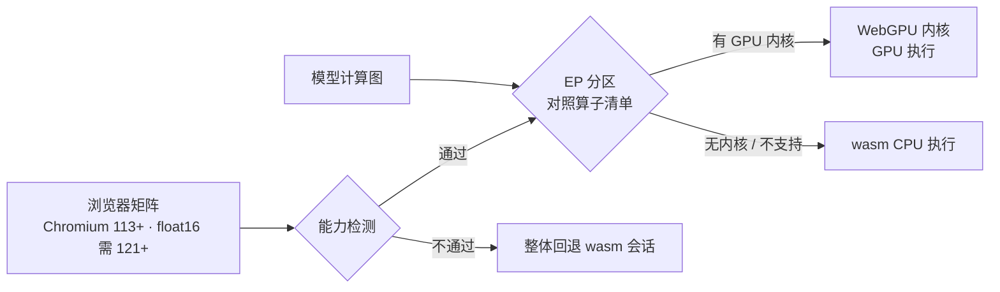

import { Canvas, Meta } from '@storybook/addon-docs/blocks';
import * as BackendWebgpu from './backend-webgpu.stories';

<Meta of={BackendWebgpu} name="Docs" />

# WebGPU 后端

WebGPU 是 onnxruntime-web 的 GPU 加速主力后端：在 Chromium 系浏览器上把算子编译成 GPU 内核执行。它的启用动作是所有后端里最短的——`executionProviders: ['webgpu']` 一行；真正的使用边界不在这行代码上，而在三份清单里：**浏览器版本矩阵、算子支持清单、float16 的版本要求**。读完本课你应当能预测：给定一个浏览器和一个模型，哪些部分会跑在 GPU 上、哪些留在 CPU、哪些环境必须降级 wasm。

一个贯穿全课的事实：**WebGPU 不是一套独立于 wasm 的运行时，它构建在 wasm 基座之上。** 默认入口加载的 JSEP 工件同时含 wasm 后端与 WebGPU 内核分发器；清单外的算子由 wasm CPU 兜底执行。「启用 WebGPU」改变的是计算图的执行方式，而不是部署形态——wasmPaths、工件伺服这些基础设施全部照旧。



| env.webgpu 标志 | 默认值 | 回查要点 |
| --- | --- | --- |
| `profiling.mode` | `'off'` | `'default'` 时收集 GPU 内核计时数据，经 `profiling.ondata` 回调交付（不设则打印到 console） |
| `device` | 未设置 | 首个 WebGPU 会话创建前可注入自建 `GPUDevice`；创建后读回的是后端实际在用的设备（`Promise<GPUDevice>`） |
| `validateInputContent` | `false` | 置 `true` 时校验输入内容，有额外开销 |
| `powerPreference` / `forceFallbackAdapter` / `adapter` | 未设置 | 1.30 已标记 `@deprecated`；需要指定适配器时改为自建 `GPUDevice` 再注入 `device` |

与 `env.wasm` 一样，这些标志是全局单例的一部分，且**只在第一个 WebGPU 会话创建之前生效**——设置时机与生效范围见 [ort.env 全局配置](?path=/docs/ort-env--docs) 课程。

## 启用方式

### 执行提供者与会话选项

```ts
import * as ort from 'onnxruntime-web';

// 启用 WebGPU 只需要写明执行提供者：
const session = await ort.InferenceSession.create('./model.onnx', {
  executionProviders: ['webgpu'],
});
```

不需要单独安装包，也不需要换成别的导入入口：默认入口加载的 JSEP 工件已经内置 WebGPU 内核。会话选项里有两个 WebGPU 专属项：`preferredOutputLocation`（WebGL 与 WebGPU EP 可用，把输出留在 GPU 侧，见下文 IO 绑定）与 `enableGraphCapture`（仅 WebGPU EP 可用，录制并重放内核提交以降低每次 run 的调度开销）；确切语义以 [API 参考](https://onnxruntime.ai/docs/api/js/index.html) 为准。

### 入口与工件

工件由导入入口在构建期决定，`wasmPaths` 只决定去哪取——这套机制在 [WebAssembly 后端](?path=/docs/backend-wasm--docs) 课程已完整展开，这里只列与 WebGPU 有关的行：

| 导入入口 | 加载的工件 | 能否跑 `['webgpu']` |
| --- | --- | --- |
| `onnxruntime-web`（默认） | `ort-wasm-simd-threaded.jsep.*` | 能——JSEP 内置 WebGPU 内核分发 |
| `onnxruntime-web/webgpu` | `ort-wasm-simd-threaded.asyncify.*` | 能（变体工件） |
| `onnxruntime-web/wasm` | `ort-wasm-simd-threaded.*` | **不能**——纯 wasm 工件没有 WebGPU 内核 |

结论：按默认入口写即可；要当心的是反过来——明确只用 CPU 时换 `/wasm` 入口减体积，之后又想加 `['webgpu']`，会因工件不含内核而创建失败（见常见问题）。

## float16 数据

### JS 侧的表示

1.30.0 的类型定义里，`float16` 张量的数据载体是 `Uint16Array`——存的是 IEEE 754 半精度**位模式**，不是可直接运算的数值，类型注释原文是 `Keep using Uint16Array until we have a concrete solution for float 16`。JS 语言本身没有半精度算术，读到 `Float16Array` 里那样的数值前需要自行解释位型；位模式的折叠规律与换算演示见 [Tensor 与数据类型](?path=/docs/tensor--docs) 课程的 float16 位模式实例。

### 浏览器要求

float16 不是所有支持 WebGPU 的浏览器都能跑：兼容矩阵脚注写明 **float16 支持需要 Chrome 121+ / Edge 122+（Windows）**——低于该版本时，用 float16 张量的模型无法按预期执行，部署上应改用 float32 模型，或把目标版本作为运行时检测项。

### GPU 缓冲区与 IO 绑定

WebGPU 后端让「数据不出 GPU」成为可选项：会话选项 `preferredOutputLocation: 'gpu-buffer'` 把输出张量留在 GPU；输入侧用 `Tensor.fromGpuBuffer(buffer, { dataType, dims })` 包装自己持有的 `GPUBuffer`。允许的数据类型由 `GpuBufferDataTypes` 定义——`'float32' | 'float16' | 'int32' | 'int64' | 'uint32' | 'uint8' | 'bool'`，float16 在列。链式推理（上一个模型的输出直接喂给下一个）或想避免中间结果 CPU↔GPU 往返时，这两个 API 是正路；一次性推理不必用它，普通 CPU 张量的拷贝开销在小模型上可以忽略。

## 算子覆盖

### 分区执行

WebGPU 后端不要求整图受支持：create 时 ORT 把计算图**分区**，清单内的算子组成 GPU 子图，清单外的节点连同它们之间的粘合逻辑落回 wasm CPU 执行。这就是「把 wasm 当兜底」机制在 WebGPU 侧的实现——模型里混进一两个不支持算子不会报错，只是那部分在 CPU 上跑。注意清单里部分算子标着 `no GPU kernel`（如 `Reshape`、`Shape`）：它们虽然出现在支持表中，实际由 CPU 处理。

### 支持清单与核对

js/web README 对 WebGPU 后端的算子覆盖只给了一句话指引：该后端仍标注为 experimental，完整清单见自动生成的 [webgpu-operators.md](https://github.com/microsoft/onnxruntime/tree/main/js/web/docs/webgpu-operators.md)——1.30 收录 109 个算子条目，覆盖 `ai.onnx` 与 `com.microsoft` 域，每行列出可用的 opset 范围，部分行带 perf/kernel 备注。核对一个模型的方法：用 Netron 打开看算子清单（获取与检查模型见 [获取与检查模型](?path=/docs/getting-models--docs) 课程），逐个对照文档表；MNIST 的 Conv、MaxPool、MatMul、Relu 都在列，而模型里的 Reshape 标注 `no GPU kernel`、留在 CPU——清单内与清单外并存，正是分区执行的常态。

多个后端写进 `executionProviders` 数组时的顺序与回退语义（如 `['webgpu', 'wasm']`）见 [后端选择与回退](?path=/docs/backend-selection--docs) 课程。

## 浏览器版本要求

### 兼容矩阵

js/web README 的兼容矩阵是版本要求的权威出处，WebGPU 行如下：

| 浏览器环境 | 1.30 支持 | 版本要求 |
| --- | --- | --- |
| Chrome/Edge（Windows） | ✔️ | Chromium 113+；float16 内核需 Chrome 121+ / Edge 122+ |
| Chrome/Edge（Android） | ✔️ | Chromium 121+ |
| Chrome/Edge（macOS） | ✔️ | 矩阵未附版本脚注 |
| Safari（macOS / iOS）、Firefox、Node.js | ❌ | 不在支持矩阵 |

一个容易踩的缝隙：新版 Safari 已经自带 `navigator.gpu`，但 ort 1.30 的支持矩阵不含 Safari——**「浏览器有 WebGPU」不等于「ort 能在这个浏览器上用 WebGPU」**。能力检测因此要过两道：先看浏览器能力，再对 create 失败做兜底。

### 能力检测与诚实降级

检测链条照着 WebGPU 规范走：`navigator.gpu` 存在 → `requestAdapter()` 拿到适配器 → 再创建会话。每一级都可能失败，实例把失败原因如实显示出来，而不是折叠成一个布尔值：

```ts
const gpu = navigator.gpu; // 未实现 WebGPU 的浏览器上为 undefined
if (!gpu) {
  // 浏览器未实现 WebGPU → 直接走 wasm 会话
}
const adapter = await gpu.requestAdapter();
if (!adapter) {
  // 有 API 但拿不到适配器 → 同样降级
}
// adapter.info（vendor/architecture）与 adapter.features.has('shader-f16')
// 是真实环境的读数：后者是 float16 内核的硬件前提
```

下方实例真实跑完了整条链路：探测 WebGPU 能力 → 创建 wasm 与 webgpu 两个会话（MNIST 模型与 jsep 工件都从 1.30.0 CDN 拉取）→ 各预热一次后计时 N 次推理。WebGPU 可用时读数给出适配器信息与两个后端的计时对比；不可用时给出确切原因，wasm 一侧照常计时。

<Canvas of={BackendWebgpu.Benchmark} />

| 读者操作 | 可观察证据 |
| --- | --- |
| 打开实例并等待 | 「WebGPU 支持」一行给出确切结论；不可用时附原因（无 `navigator.gpu` / `requestAdapter()` 返回 null） |
| 支持 WebGPU 时 | 「GPU 适配器」显示真实 vendor/architecture，`shader-f16` 反映硬件对 float16 内核的支持 |
| 看两列计时读数 | wasm 与 webgpu 各自的均值与最快值；MNIST 上差距很小、加速比可能小于 1——读数如实呈现，不加修饰 |
| 看「实际加载工件」 | 两个会话共用 `ort-wasm-simd-threaded.jsep.*`：WebGPU 内核分发在 wasm 基座之上 |
| 切换「计时次数」参数 | 只重新计时，不重建会话；次数越多均值越稳 |
| 打开 Show code | 看到该 Canvas 实际执行的 `webgpu-benchmark.ts` |

对计时读数要保持诚实：MNIST 是毫秒级小模型，GPU 的吞吐优势喂不饱——加速比接近 1 甚至低于 1 都属正常（数据拷贝与内核提交的固定开销此时占大头）。GPU 后端的收益出现在大模型与计算密集算子上；把本页读数当成「如何测」，而不是「WebGPU 提速几倍」的结论。

## 最佳实践

- **能力检测先行，降级路径写死。** `navigator.gpu` → `requestAdapter()` 逐级探测，create 包在 try/catch 里——本课实例的检测函数可以原样搬进应用。数组写法 `['webgpu', 'wasm']` 的自动回退语义不同（由 ORT 分区兜底，不换会话），两者的区别见 [后端选择与回退](?path=/docs/backend-selection--docs) 课程。
- **小模型别上 GPU。** 本课实例就是现场：毫秒级模型上 webgpu 不比 wasm 快。GPU 留给大模型、大算子的场景。
- **float16 模型先确认目标版本。** Chrome 121+ / Edge 122+（Windows）是硬门槛；面向更老的环境就发布 float32 模型，或把 `adapter.features.has('shader-f16')` 作为检测项。
- **env.webgpu 与工件配置放在任何 create 之前。** 全局单例、首个 WebGPU 会话前生效；`wasmPaths` 指向的目录必须与安装版本一致（本工作区为 onnxruntime-web@1.30.0 的 CDN），配置方法见 [ort.env 全局配置](?path=/docs/ort-env--docs) 与 [WASM 资源伺服](?path=/docs/wasm-serving--docs) 课程。

## 常见问题

- 浏览器里有 `navigator.gpu`（如新版 Safari），实例却显示不可用或创建失败。
  ort 1.30 的支持矩阵不含 Safari/Firefox/iOS，浏览器能力只是第一道门。检测要两道都做：矩阵判断 + create 的 try/catch，并把失败原因显示出来——本课实例即是这套双重检测的现场。
- 用 `onnxruntime-web/wasm` 入口导入后，请求 `['webgpu']` 的会话创建失败。
  纯 wasm 工件里没有 WebGPU 内核，这不是配置问题而是工件问题。换回默认入口（或 `onnxruntime-web/webgpu`）即可；入口与工件的对应关系见「入口与工件」。
- 模型能跑，但个别算子怎么看都在 CPU 上执行。
  分区执行的正常行为：对照 [webgpu-operators.md](https://github.com/microsoft/onnxruntime/tree/main/js/web/docs/webgpu-operators.md)，`Reshape`、`Shape` 等本就标注 `no GPU kernel`。想整图上 GPU 只能等算子支持或调整模型结构，ORT 不会因此报错。
- `env.webgpu.device`、`profiling.mode` 设置了却不生效。
  它们只在第一个 WebGPU 会话创建之前生效；env 是全局单例，同页已建过 WebGPU 会话后再设置就晚了，见 [ort.env 全局配置](?path=/docs/ort-env--docs) 课程。

## 总结回顾

摘要：

本课建立了 WebGPU 后端的边界模型：启用只有一行 `executionProviders: ['webgpu']`，默认入口的 JSEP 工件已内置 WebGPU 内核，`/wasm` 入口的纯工件则跑不了。WebGPU 构建在 wasm 基座之上——算子清单内的部分组成 GPU 子图，清单外（含标注 `no GPU kernel` 的 Reshape、Shape 等）落回 wasm CPU 执行，1.30 清单收录 109 个算子条目，以自动生成的 webgpu-operators.md 为准。float16 张量在 JS 侧是 `Uint16Array` 半精度位模式，float16 内核另有浏览器门槛（Chrome 121+ / Edge 122+，Windows）；输出留 GPU 与 `Tensor.fromGpuBuffer` 构成 IO 绑定路径。浏览器矩阵（Windows Chromium 113+、Android 121+、macOS 常青；Safari/Firefox/Node 不支持）是权威判断依据，`navigator.gpu` 存在只是第一道门。全部边界都可检测——本课实例把能力检测、降级原因与两个后端的实测计时摆在了同一块画布上，并对小模型上加速比可能小于 1 的事实保持诚实。

一句话：

> 启用 WebGPU 只有一行 `executionProviders: ['webgpu']`，真正的边界在清单里——浏览器矩阵、算子覆盖、float16 版本要求；清单之外的一切自动落回 wasm 基座。

知识要点：

- 启用 WebGPU 需要改哪些东西？为什么不需要换导入入口？
- `/wasm` 入口为什么跑不了 `['webgpu']`？工件差在哪？
- float16 张量在 JS 里怎么表示？哪些浏览器版本才能执行 float16 内核？
- 模型里出现不支持的算子会发生什么？上线前怎么核对？
- 哪些浏览器环境受支持？「有 `navigator.gpu`」意味着什么、不意味着什么？
- 实例的「加速比」读数为什么可能小于 1？该怎么向用户呈现 GPU 收益？

## 参考资料

- [microsoft/onnxruntime 仓库 js 目录](https://github.com/microsoft/onnxruntime/tree/main/js) —— js/web README 的 EP 兼容矩阵（Windows Chromium 113+、float16 Chrome 121+/Edge 122+ 脚注）与各后端算子文档入口
- [WebGPU 后端算子支持表（webgpu-operators.md）](https://github.com/microsoft/onnxruntime/tree/main/js/web/docs/webgpu-operators.md) —— 算子清单及其 opset 域、`no GPU kernel` 备注；由 def 文件自动生成
- [onnxruntime-web API 参考](https://onnxruntime.ai/docs/api/js/index.html) —— env.webgpu 各标志、`enableGraphCapture` / `preferredOutputLocation` 会话选项、`Tensor.fromGpuBuffer` 的类型与语义依据
- [onnxruntime-web npm 发布页](https://www.npmjs.com/package/onnxruntime-web) —— 版本记录；本课工件体积与文件名以 1.30.0 的 dist 实测为准
