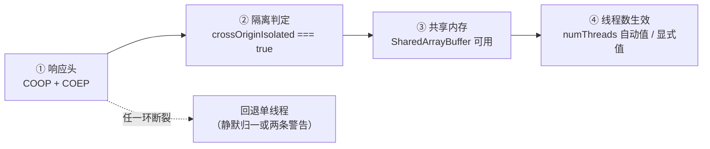

import { Canvas, Controls, Meta } from '@storybook/addon-docs/blocks';
import * as IsolationProbe from './cross-origin-isolation.stories';

<Meta of={IsolationProbe} name="Docs" />

# 多线程与跨域隔离

wasm 多线程把一次推理切分给多个线程并行执行，是 CPU 上最大的免费提速手段——但它的开关不在 ort，而在页面的 HTTP 响应头：wasm 线程靠 `SharedArrayBuffer` 共享内存，而 SAB 只在「跨域隔离」的页面上可用，跨域隔离又由 COOP 与 COEP 两个响应头开启。本课沿这条前提链讲清三件事——头怎么配、开了之后牵连哪些第三方资源、怎么验证多线程真的生效。读完你应当能预测：给定一个页面的响应头，它的 wasm 推理会用几个线程；给自己页面开隔离时，哪些跨域资源会跟着遭殃。本 Storybook 工作区没有隔离响应头，下方实例就是「未隔离分支」的现场：上行前提链四环全部亮「未满足」，显式调大 `numThreads` 会看到两条回落警告。



| 头 / 判据 | 取值（默认值加粗） | 回查要点 |
| --- | --- | --- |
| `Cross-Origin-Opener-Policy`（COOP） | **`unsafe-none`**、`same-origin` | 把页面放进独立浏览上下文组，断开跨域 opener；`same-origin-allow-popups` 保住弹窗但**不满足隔离**；`restrict-properties` 只限制 opener 属性，同样不满足 |
| `Cross-Origin-Embedder-Policy`（COEP） | **`unsafe-none`**、`require-corp`、`credentialless` | 页面声明「所有跨域子资源都已获授权」；两个头必须一起发，任缺其一都不隔离 |
| `Cross-Origin-Resource-Policy`（CORP） | `same-origin`、`same-site`、`cross-origin`（常用） | 资源方的选择加入式授权声明，不带头即不向跨页授权；`require-corp` 下跨域 no-cors 子资源（script/img）必须携带 |
| `self.crossOriginIsolated` | `true` / `false` | 全链唯一公开判据：JS 读不到响应头本体，排查永远从它开始 |
| `typeof SharedArrayBuffer` | `'function'` / `'undefined'` | 只在隔离页面暴露；非隔离页面连构造器都不可见 |
| `env.wasm.numThreads` | **`0`（系统决定）** | 隔离时自动取 min(4, ⌈硬件线程数÷2⌉)；未隔离归一化为 1，完整归一化规则见 [WebAssembly 后端](?path=/docs/backend-wasm--docs) |

## 为什么多线程需要跨域隔离

wasm 多线程的编译形态是 pthreads：主模块把线性内存标记为 shared，派生出的 worker 池与主线程共享同一块内存，靠 Atomics 原子指令同步。共享内存的前提是 `SharedArrayBuffer`——它让多个线程看到同一块字节，这是「多线程 wasm」与「多份独立内存」的本质区别；没有 SAB，工件里编译好的多线程代码路径无法工作。

浏览器为什么不给所有页面发 SAB：共享内存加高精度计时，是 Spectre 类侧信道攻击的理想材料（2018 年初各浏览器一度全面停用 SAB）。现代浏览器的折中是「跨域隔离」：只要页面用 COOP + COEP 做到「跨域文档不与本页同进程」，SAB 才恢复下发——攻击面收紧到零，能力就还给你。

所以判定链是三层因果，不是三个并列开关：响应头是原因，`crossOriginIsolated` 是浏览器的裁定结果，SAB 暴露与否是裁定的直接后果。每一环都可检测：

```ts
const isolated = self.crossOriginIsolated === true; // 响应头的最终裁定结果
const sabReady = typeof SharedArrayBuffer !== 'undefined'; // 隔离页面才有
// ort 内部还会校验 wasm 原子指令模块，探测方式见 WebAssembly 后端课程
```

worker 与页面同命运：`new Worker` 派生的工作线程继承创建它的文档的隔离状态，主线程与 worker 里的 `crossOriginIsolated` 读数一致——下方实例的两个读数可以对照。 ort 在页面里跑、还是在 worker 里跑，隔离门槛完全相同。

边界：Spectre 的攻击原理与 Site Isolation 的进程模型细节不在本课范围，本课只关心「浏览器把哪些能力锁在了隔离门后」。

## 配置响应头

### 两个头各管什么

最小可用组合是两个响应头一起发：

```http
Cross-Origin-Opener-Policy: same-origin
Cross-Origin-Embedder-Policy: require-corp
```

- **COOP 管「邻居」**：把本页放进独立的浏览上下文组。跨域页面打开本页、或本页打开跨域弹窗时，不再共享 `window.opener`，进程也隔开。
- **COEP 管「内容」**：本页声明自己加载的每个跨域子资源都已获得授权——`require-corp` 要求 no-cors 跨域资源携带 CORP 头，或以 CORS 模式请求并通过校验。

两个头都必须由**真实的 HTTP 响应**携带：`<meta http-equiv>` 的允许清单里没有它们，写进 HTML 不生效。任缺其一，`crossOriginIsolated` 都是 `false`。

### credentialless：免 CORP 的变体

`COEP: credentialless` 是 `require-corp` 的放宽变体：no-cors 跨域子资源不再需要 CORP 头，代价是这类请求不带凭证——请求省略 cookies，响应里的 cookies 也被忽略。

支持面（2026-10 查证，[MDN](https://developer.mozilla.org/en-US/docs/Web/HTTP/Headers/Cross-Origin-Embedder-Policy)）：Chromium 96+ 完整支持；Firefox 119+ 支持子资源、但 credentialless **iframe** 仍按 `require-corp` 对待；Safari 不支持。要覆盖 Safari 只能 `require-corp`，常见做法是按 UA 分叉发头，或干脆统一 `require-corp` 换取行为一致。

### 本地开发：Vite dev server

隔离在 localhost 上即可生效，不需要 https。Vite 在配置文件的 `server.headers` 里加响应头：

```ts
// vite.config.ts（概念示意——本手册共享工作区不改配置）
import { defineConfig } from 'vite';

export default defineConfig({
  server: {
    headers: {
      'Cross-Origin-Opener-Policy': 'same-origin',
      'Cross-Origin-Embedder-Policy': 'require-corp',
    },
  },
});
```

改完重启 dev server 才生效；`vite preview` 用 `preview.headers` 同理。Nginx、云平台与对象存储的生产配置，连同缓存策略一起归[部署](?path=/docs/deployment--docs)课程。

## 第三方资源牵连

开隔离不是免费午餐：COEP 改变的不只是 SAB 的可用性，还有**页面上每一个跨域子资源**的准入规则。上线前对照这张清单盘一遍：

| 资源 | `require-corp` 下的准入条件 | 典型踩坑 |
| --- | --- | --- |
| 跨域 `<script>` / ``（no-cors） | 响应带 `CORP: cross-origin` | 第三方统计、字体、图床直接被 block |
| 跨域请求走 CORS（fetch、`crossorigin` 属性） | CORS 校验通过即可，不需要 CORP | 给 `<script>` 补 `crossorigin` 属性即可救活主流 CDN |
| 跨域 `<iframe>` | 嵌入文档**自己也要发 COEP** | 第三方播放器、客服组件、支付窗集体消失 |
| ort 自己的资源拉取 | fetch 走 cors 模式 + 响应带 `ACAO` | jsDelivr 的 ort 工件、MNIST 模型实测均带 `ACAO: *` 与 `CORP: cross-origin`，隔离页面照常加载 |
| `window.opener` / 弹窗回调 | COOP: same-origin 断开 opener 关系 | OAuth 弹窗登录拿不到回调引用；`same-origin-allow-popups` 可保弹窗但不满足隔离 |

对本手册的默认姿势是个好消息：实例一律用「npm 包 + CDN 前缀」拉取工件与模型（fetch cors 模式），这些响应头已实测齐全，给应用配上隔离头后推理链路本身不需要任何改动；用 `<script>` 标签方式引入 ort 的场景，jsDelivr 与 unpkg 也都带了 `CORP: cross-origin`，同样不受牵连。

灰度手段：两个头都有 report-only 形态（`Cross-Origin-Opener-Policy-Report-Only` 与 `Cross-Origin-Embedder-Policy-Report-Only`），先只上报违反、不实际阻断，把破坏面摸清后再切正式头。

## 检测与验证

判定链每一环都有公开读数，本页实例真实运行了整条链：主线程读 window 的隔离状态；每次尝试在**全新 worker** 里按「numThreads 设置值」执行一次真实 create（MNIST 模型与 wasm 工件从 CDN 拉取），捕获回落警告并回读归一化结果。画布上行是本页的真实判定，下行是已隔离页面的概念示意——响应头无法在 Storybook 里配置，示意行不能也不应伪造成本页读数。

<Canvas of={IsolationProbe.IsolationProbe} />
<Controls of={IsolationProbe.IsolationProbe} />

| 读者操作 | 可观察证据 |
| --- | --- |
| 打开实例并等待 | 上行四环全部「未满足」，「归一化结果」读数为 1——本页单线程的完整解释 |
| 切到「显式 4」 | 「回落警告」读数给出 ort 警告原文：设置值不被尊重，回退单线程 |
| 切到「显式 1」 | 无警告——无隔离环境下唯一不产生歧义的显式值 |
| 对照两个隔离读数 | 主线程与 worker 内的 `crossOriginIsolated` 一致：worker 继承页面的隔离状态 |
| 看下行示意行 | 同一条链在已隔离页面的预期读数：自动档将得到 min(4, ⌈cores÷2⌉) |

首次运行会下载约 27MB 的 jsep 工件，命中 HTTP 缓存后复访很快。隔离分支的验证方法就是把「配置响应头」小节的头加到自己应用（或给 Storybook 加转发头）后刷新页面——同一套读数会变成：四环全绿、自动档归一化为 min(4, ⌈cores÷2⌉)、切「显式 4」不再出现警告。这正是把这段检测代码嵌进应用的理由：它同时是体检面板和生效判据。

边界：本课只验证「生效」；多线程到底快多少的定量对比归[性能测量](?path=/docs/profiling--docs)课程。

## 最佳实践

- **按推理负载决定是否开隔离。** MNIST 这类毫秒级模型，单线程 SIMD 已经足够，不值得为多线程付「逐个盘资源准入」的连带代价；大模型与计算密集推理（LLM、扩散模型）才值得全面开启。
- **开不了隔离就显式表达单线程。** `env.wasm.numThreads = 1` 消除「设了却没生效」的歧义；要防 UI 卡顿用 `proxy: true`——它是把推理移出主线程，不等于并行计算，见 [proxy 工作线程](?path=/docs/proxy-worker--docs)课程。
- **用 report-only 灰度上线。** 先发 report-only 头观测违反报告，修完第三方资源再切正式头；直接上正式头的排查成本通常远高于先观测。
- **credentialless 按 Safari 取舍。** 只有 Chromium/Firefox 用户群、又不想给每个第三方资源配 CORP 时选它；用户群含 Safari 就统一 `require-corp`。
- **隔离生效后把 numThreads 交给自动值。** 显式设大值既没必要也容易在未来核数不同的设备上失真；自动档 min(4, ⌈cores÷2⌉) 已经封顶了线程池规模。

## 常见问题

- 控制台连发两条警告：`env.wasm.numThreads is set to N, but this will not work unless you enable crossOriginIsolated mode` 与 `WebAssembly multi-threading is not supported ... Falling back to single-threading`。
  多线程没有生效，实际单线程。先读 `self.crossOriginIsolated`：false 就回「配置响应头」小节配头；暂时不配就把 `numThreads` 显式置 1，消除歧义。
- 明明配了响应头，`crossOriginIsolated` 还是 `false`。
  按顺序查：DevTools Network 里文档响应有没有这两个头（反向代理、CDN 吞头常见）→ COOP 值是否恰为 `same-origin`（`same-origin-allow-popups` 与 `unsafe-none` 都不满足）→ 头是不是写进了 `<meta>` 而不是真实响应 → 改完是否重启了 dev server、强刷了页面。
- 开隔离后第三方脚本、iframe 不见了，控制台出现 COEP/Corp 相关报错。
  「第三方资源牵连」小节的清单逐项对号：资源方加 CORP 头、或给标签补 `crossorigin` 走 CORS、或临时切 `credentialless`；第三方 iframe 必须由对方页面自带 COEP，改不了就接受该功能在隔离页面缺席。
- SharedArrayBuffer 可用了，create 后 `numThreads` 还是 1。
  三个常见原因：设置发生在第一次 create 之后（env 只在首次初始化时消费，见 [ort.env 全局配置](?path=/docs/ort-env--docs)）；显式设了 1；浏览器过老不支持隔离页面的 wasm 线程（Safari 15.2 起）——用实例同款检测读数逐环对号。
- 开隔离必须上 https 吗？
  不必须。localhost / 127.0.0.1 是安全上下文，dev server 配两个头即可验证；生产环境的 https 与响应头一起由部署课程承接。

## 总结回顾

摘要：

本课把 wasm 多线程的前提展开成一条可检测的因果链：COOP + COEP 两个响应头开启跨域隔离，`crossOriginIsolated` 是浏览器裁定的唯一公开判据，隔离门后才有 `SharedArrayBuffer`，有了共享内存 ort 的 `numThreads` 才真正生效——未隔离时自动档静默归一为 1，显式大值连发两条警告后回退。配置上，COOP 管浏览上下文分组、COEP 管子资源准入，两个头必须由真实 HTTP 响应携带；`credentialless` 免去 CORP 配置但 Safari 不支持、Firefox 的 iframe 除外。开隔离的最大代价在第三方：no-cors 跨域资源要 CORP 头、iframe 要对方自带 COEP、弹窗回调被 COOP 断开——report-only 提供了先观测后上线的灰度路径。ort 自己的工件与模型走 CORS 拉取，jsDelivr 已带齐所需响应头，推理链路不受牵连。全部状态都可检测：实例给出的前提链读数既是本页单线程的解释，也是配置后验证生效的判据。

一句话：

> wasm 多线程的开关不在 ort 而在页面响应头——COOP + COEP 开启跨域隔离，`crossOriginIsolated` 是唯一公开判据，隔离门后才有 SharedArrayBuffer，有了它 numThreads 才真正生效。

知识要点：

- 为什么 SAB 只在隔离页面可用？判定链有哪三层因果，JS 能直接读到哪一层？
- COOP 与 COEP 各管什么？最小配置组合是什么？为什么 `<meta>` 标签不行？
- `credentialless` 与 `require-corp` 的差别是什么？各浏览器支持到什么程度？
- 开隔离后会牵连哪几类第三方资源？ort 自己的工件与模型受影响吗？
- 怎样验证多线程真的生效？`numThreads` 三种设置在未隔离页面各读到什么？

## 参考资料

- [MDN: Cross-Origin-Opener-Policy](https://developer.mozilla.org/en-US/docs/Web/HTTP/Headers/Cross-Origin-Opener-Policy) —— COOP 取值语义、`same-origin-allow-popups` 与 `restrict-properties` 的边界
- [MDN: Cross-Origin-Embedder-Policy](https://developer.mozilla.org/en-US/docs/Web/HTTP/Headers/Cross-Origin-Embedder-Policy) —— `require-corp` / `credentialless` 语义、子资源准入判定与 credentialless 支持矩阵（Firefox 119+ 子资源、Safari 不支持）
- [MDN: Cross-Origin-Resource-Policy](https://developer.mozilla.org/en-US/docs/Web/HTTP/Headers/Cross-Origin-Resource-Policy) —— CORP 三个取值与嵌入准入判定
- [MDN: SharedArrayBuffer](https://developer.mozilla.org/en-US/docs/Web/JavaScript/Reference/Global_Objects/SharedArrayBuffer) —— SAB 的跨域隔离门控与 `crossOriginIsolated` 判据的官方表述
- [onnxruntime-web API 参考](https://onnxruntime.ai/docs/api/js/index.html) —— `env.wasm.numThreads` 的类型、自动值语义与回落行为；归一化结果以 1.30.0 实测为准
- [microsoft/onnxruntime 仓库 js 目录](https://github.com/microsoft/onnxruntime/tree/main/js) —— wasm 后端多线程与 worker 池的实现说明
- [Vite: server.headers](https://vite.dev/config/server-options.html#server-headers) —— dev server 响应头配置项的一手依据
