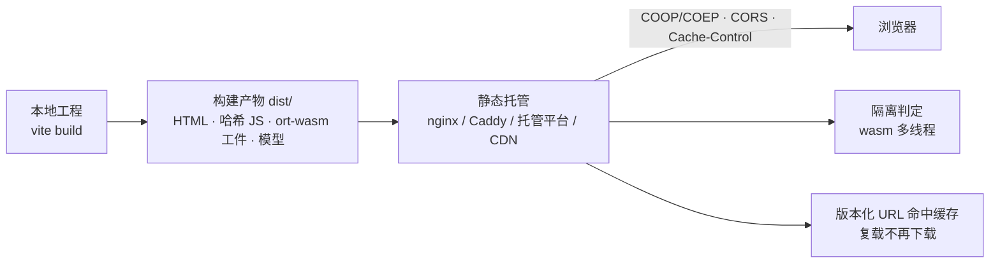

import { Canvas, Controls, Meta } from '@storybook/addon-docs/blocks';
import * as Deployment from './deployment.stories';

<Meta of={Deployment} name="Docs" />

# 部署

本地跑通之后，上线要换一个视角：onnxruntime-web 应用没有服务器端运行时，推理全部发生在浏览器里——线上站点就是一个**纯静态站点**，服务器的职责只是把几类文件发对。本课从上线清单视角收拢前面各课的散点：浏览器要下载哪三类资产、构建产物里必须有什么、nginx/Caddy/托管平台各怎么配、哪些响应头必须由生产响应携带、哪些 URL 能放心标成长缓存。读完应当能预测：部署到目标环境后打开页面，Network 面板与文末的自检面板里分别该看到什么。



| 事项 | 回查要点 |
| --- | --- |
| 资产 = 三类 | JS bundle（哈希文件名）、ort-wasm 工件（按入口一对）、模型文件（版本化 URL） |
| 产物验证 | `vite build` 后用 `vite preview` 本地伺服 dist，走一次真实加载 |
| 隔离头 | COOP + COEP 必须由生产响应携带，写进 `<meta>` 无效；语义见 [多线程与跨域隔离](?path=/docs/cross-origin-isolation--docs) |
| 跨域资产 | 工件/模型放独立域或 CDN 时需 `Access-Control-Allow-Origin`；`require-corp` 下 no-cors 跨域子资源需 CORP |
| 缓存 | 版本化 URL + `immutable` 长缓存；HTML 用 `no-cache`；大模型叠加 IndexedDB 客户端缓存 |
| 安全上下文 | WebGPU 只在安全上下文可用：线上必须 https，localhost/127.0.0.1 豁免 |

## 上线资产清单

浏览器在用户首次打开页面到首次推理之间要取齐三类资产，它们就是部署的全部对象：

| 资产 | 内容 | 从哪来 | 部署要点 |
| --- | --- | --- | --- |
| JS bundle | 应用代码 + ort JS 运行时 | `vite build` 输出，`assets/index-[hash].js` | 哈希文件名与内容绑定，可放心长缓存 |
| ort-wasm 工件 | 当前入口的一对 `.mjs` 加载器 + `.wasm` 本体 | `node_modules/onnxruntime-web/dist/` | 只部署当前入口那一对；版本必须与 JS 包一致 |
| 模型文件 | `.onnx`（外部数据模型还有 `*_data` 伴随文件） | 模型来源下载（见[获取模型](?path=/docs/getting-models--docs)） | 体积即下载量；URL 带版本；大模型再叠加客户端缓存 |

三个判断：

- **没有服务器端代码。** 推理在浏览器执行，任何静态托管都行——对象存储、CDN、VPS、Pages 平台皆可，选型只看响应头与缓存的可控程度。
- **按入口裁剪工件就是首载优化。** 默认入口配 jsep 工件（`.wasm` 约 27 MB），纯 CPU 应用换 `onnxruntime-web/wasm` 入口后只需纯工件对（约 13.6 MB）——部署目录里放哪一对，由导入入口决定（对照见 [WASM 资源伺服](?path=/docs/wasm-serving--docs)）。
- **模型不进仓库，但要进部署产物。** 与 JS 同源伺服最省事（如 `public/models/`，构建时原样拷贝进 dist）；放 CDN 或对象存储则资产跨域，要补响应头，见「跨域响应头」。

## 生产构建

`vite build` 一次产出上线所需的全部静态文件：`index.html` 文档入口、`assets/index-[hash].js`（应用与 ort JS，文件名带内容哈希），以及 public 目录原样拷贝的内容——把工件与模型放这里（如 `public/ort-wasm/`、`public/models/`），就随构建一起进入 dist。把工件送进产物的三种方法（复制命令、`?url` 资源导入、静态复制插件）见 [WASM 资源伺服](?path=/docs/wasm-serving--docs)，本课只关心产物视角：dist 里必须有当前入口的那对工件与模型文件。

**本地先验一次产物。** dev server 边改边跑，不等于产物可用——「dev 正常、build 后工件 404」是上线最常见的事故。上线前用 `vite preview`（或任意静态服务器指向 dist/）伺服构建产物，走一次完整加载：首次 `create` 成功、Network 面板无 404。失败按 URL 逐段核对：路径错多为 `base` 前缀不匹配，文件名错多为产物里没有工件。

子路径部署（GitHub Pages 项目页、网关前缀 `/app/` 等）时，`base` 配置必须与实际前缀一致，否则 index.html 引用的资产 URL 全部 404；`vite preview` 同样能暴露这类问题。

## 静态托管配置

隔离头与缓存策略最终都落在静态服务器的响应头上。以下三段配置等价（**示例配置，概念示意——本手册的共享工作区配置未做修改**），按自己的环境选一段对照：隔离头的语义见下一节，缓存值的取舍见「缓存策略」。

**nginx**（`gzip_types` 默认不含 `application/wasm`，压缩要显式加；nginx 的 `add_header` 不从上级继承——location 里一旦出现 `add_header`，上级的头对该 location 全部失效，所以每处都带全本站所需的头）：

```nginx
server {
    listen 443 ssl;
    server_name app.example.com;
    root /var/www/app;
    index index.html;

    # wasm 不在默认压缩类型里，必须显式加入
    gzip on;
    gzip_types application/wasm application/javascript text/css application/json;

    # 版本化资产（哈希 JS、工件、模型）：内容与 URL 绑定，长缓存
    location /assets/ {
        add_header Cache-Control "public, max-age=31536000, immutable" always;
        add_header Cross-Origin-Opener-Policy same-origin always;
        add_header Cross-Origin-Embedder-Policy require-corp always;
    }

    # 文档入口：每次协商，保证引用的哈希资产随发布更新
    location / {
        add_header Cache-Control "no-cache" always;
        add_header Cross-Origin-Opener-Policy same-origin always;
        add_header Cross-Origin-Embedder-Policy require-corp always;
        try_files $uri $uri/ /index.html;
    }
}
```

**Caddy**（自动 https；`header` 指令按书写顺序执行，path 匹配的那条写在后面即可覆盖前面的 `Cache-Control`）：

```caddyfile
app.example.com {
	encode zstd gzip

	header {
		Cross-Origin-Opener-Policy same-origin
		Cross-Origin-Embedder-Policy require-corp
		Cache-Control "no-cache"
	}

	# 版本化资产覆盖为长缓存
	header /assets/* Cache-Control "public, max-age=31536000, immutable"
}
```

**托管平台**（Netlify / Cloudflare Pages 通用的 `_headers` 文件，同样把更具体的规则放在后面）：

```text
/*
  Cross-Origin-Opener-Policy: same-origin
  Cross-Origin-Embedder-Policy: require-corp
  Cache-Control: no-cache

/assets/*
  Cache-Control: public, max-age=31536000, immutable
```

两个通用注意点：头要覆盖**文档与资产两类响应**——隔离判定只看文档自身的响应头，资产响应带不带 COOP/COEP 不影响隔离，示例统一带上是为了让「每处自带全站头」成为可复制的安全模式；多数 CDN 与平台会透传源站响应头，但配置层（边缘规则、反向代理）吞头并不罕见，验证方法见「部署自检」。

## 跨域响应头

### 隔离头：COOP 与 COEP

想让 wasm 多线程在线上生效，生产环境的**文档响应**必须携带：

```http
Cross-Origin-Opener-Policy: same-origin
Cross-Origin-Embedder-Policy: require-corp
```

本课把它钉进上线清单，只记三条硬规则：两个头必须由真实 HTTP 响应携带（`<meta http-equiv>` 的允许清单里没有它们）；任缺其一 `self.crossOriginIsolated` 都是 `false`；`credentialless` 变体、第三方资源牵连与 report-only 灰度的完整语义见 [多线程与跨域隔离](?path=/docs/cross-origin-isolation--docs)。生效与否用文末自检面板线上验证。

### 跨域资产：CORS 与 CORP

工件或模型放在独立资源域、对象存储或 CDN 时，ort 以 cors 模式 fetch 它们，该域的响应必须带 `Access-Control-Allow-Origin`：公共 CDN（jsDelivr 的 ort 工件实测带 `ACAO: *`）开箱即用，URL 里写死版本号即可放心引用（见[安装与导入](?path=/docs/installation--docs)）；自建对象存储/CDN 要在桶或分发配置里开 CORS。文档开了 `require-corp` 后，跨域 no-cors 子资源还必须带 `Cross-Origin-Resource-Policy: cross-origin`——把工件与模型放回自己站点同源伺服，可以绕开这层牵连（同源子资源不需要 CORP）。

### 安全上下文：https

官方部署文档明确：WebGPU 只在安全上下文可用——https，或 localhost/127.0.0.1 的 http。所以「本地能用、线上不能用」的第一排查项就是证书与 https；自检面板的「安全上下文」行给出当前页面的真实读数。

## 缓存策略

HTTP 缓存的键是 URL，`immutable` 只对「URL 与内容绑定」的资产安全——内容一变 URL 必须跟着变。JS、工件与模型都能做到这一点；HTML 是唯一例外，交给 `no-cache`：

| 资产 | URL 形态 | Cache-Control（示例） | 更新方式 |
| --- | --- | --- | --- |
| HTML | `/` | `no-cache` | 每次发布即生效（引用新哈希 JS） |
| JS bundle | `assets/index-[hash].js` | `public, max-age=31536000, immutable` | 发布自动换哈希 |
| ort-wasm 工件 | 版本化目录 `/assets/ort-wasm/<版本>/…` | 同上 | 升级包 = 换版本目录 + 改 `wasmPaths` |
| 模型文件 | 版本化 URL `/assets/models/<revision>/model.onnx` | 同上 | 换 revision = 换缓存键 |

### ort-wasm 工件

工件内容随 npm 版本不变：1.30.0 的 jsep 工件在任何用户机器上都是同一串字节——这正是 `immutable` 的安全前提。用「版本化目录 + 长缓存」：首次下载后复访不再传输；升级 onnxruntime-web 时把目录版本号与 `wasmPaths` 一起改，旧缓存自然过期，不会出现「新 JS 配旧工件」的错配。用 `?url` 让打包器生成哈希文件名时同理：哈希即版本，直接 immutable。

### 模型文件

来源侧「固定 revision」的口径在[获取模型](?path=/docs/getting-models--docs)（HuggingFace 的 `/resolve/<commit>/`、Model Zoo 带版本号的文件名）；自己伺服时等价做法是把文件放进带版本的路径——文件名即版本（`/assets/models/mnist-8.onnx`）或目录即 revision（`/assets/models/<revision>/model.onnx`）。

HTTP 缓存是被动层：由浏览器管理、可被驱逐、脚本不可控。官方部署文档建议对大模型再加一层 IndexedDB 客户端缓存，避免每次刷新重新下载。两层互补——IndexedDB 显式持久、缓存键自带版本、加载前即可判断：

```ts
// 示意：HTTP 缓存之外，用 IndexedDB 显式缓存模型字节（官方部署文档建议的做法）
const CACHE_KEY = 'mnist-8@rev2'; // 缓存键带版本，更新模型即换键

let bytes = await idbGet(CACHE_KEY);
if (!bytes) {
  bytes = new Uint8Array(await (await fetch(MODEL_URL)).arrayBuffer());
  await idbPut(CACHE_KEY, bytes);
}
const session = await InferenceSession.create(bytes); // create 接受 Uint8Array
```

`InferenceSession.create` 接受 `Uint8Array` 字节（签名见 API 参考），缓存与加载因此可以解耦在 fetch 之外；`idbGet`/`idbPut` 用任意 IndexedDB 封装实现即可。外部数据模型与生成式大模型的加载策略由后续实战课程展开，部署侧只需记住：体积预算按 `.onnx` 与 `*_data` 之和算，缓存键跟着 revision 走。

### HTML 与 JS bundle

哈希 JS 长缓存 + HTML `no-cache` 是标准组合：HTML 每次与服务器协商，拿到最新引用；哈希资产直接命中一年缓存。反过来别给 HTML 发长 `max-age`——发布后用户拿着旧 HTML 去引已被删掉的旧哈希 JS，直接白屏。

## 部署自检

把前面各节的判据收拢成一张上线检查表：

| 检查项 | 通过判据 |
| --- | --- |
| 产物完整 | dist 里有 HTML、哈希 JS、当前入口的工件对、模型文件 |
| 产物验证 | `vite preview` 本地伺服 dist，首次 `create` 成功，Network 无 404 |
| 隔离头（开多线程时） | 文档响应带 COOP/COEP，`crossOriginIsolated === true` |
| 跨域资产 | 独立域资产带 `ACAO`；`require-corp` 下 no-cors 跨域资源带 CORP |
| 安全上下文 | 线上 https（WebGPU 应用的必须项） |
| 缓存 | 版本化资产 `immutable`，HTML `no-cache`，升级 = 换版本化 URL |
| 线上自检 | 打开自检面板，目标后端的必须项全绿 |

其中「版本、隔离、安全上下文」在浏览器里有公开读数——把下面这段自检代码嵌进应用（或临时贴进控制台），部署后打开页面即可核对。本页实例真实运行了它，读数来自当前 Storybook 页面：工作区没有隔离响应头，「跨域隔离」与「SharedArrayBuffer」两行正是**未配置隔离的托管默认状态**的现场；把头配到自己的站点后，同一段代码会读到已隔离。

<Canvas of={Deployment.DeployProbe} />
<Controls of={Deployment.DeployProbe} />

| 读者操作 | 可观察证据 |
| --- | --- |
| 保持默认「目标后端 = wasm」 | 「运行条件」读数为 wasm 基线就绪：版本一致、安全上下文满足（localhost 豁免）；隔离行未满足不影响单线程 wasm |
| 切到「目标后端 = webgpu」 | 「安全上下文」与「WebGPU 适配器」升为必须项并计入综合判定；适配器读数因浏览器与设备而异 |
| 把「期望版本」改成其他号 | 「版本对齐」变红，「运行条件」转为未就绪——版本错配是工件伺服事故的第一根因 |
| 部署后在自己站点运行同款代码 | 隔离头配置生效时：跨域隔离 = 已隔离、SharedArrayBuffer = 可用 |

边界：本面板检测的是运行条件，不含资产可达性——「工件 URL 拼得对不对」要真实 fetch 才能验证，见 [WASM 资源伺服](?path=/docs/wasm-serving--docs)的现场实例；综合判定也不检查模型文件。

## 最佳实践

- **产物先 preview 后上线。** `vite preview` 本地伺服 dist 走一次真实加载，工件 404 与 `base` 前缀错误在本地暴露，比上线后排查便宜一个量级。
- **三类资产统一「版本化 URL + immutable」。** 内容与 URL 绑定后长缓存零风险，升级即换键；唯一例外是 HTML，保持 `no-cache`。
- **工件与模型优先同源伺服。** 同源避开 CORS 与 CORP 的全部牵连，缓存与版本也在自己手里；同源部署下 ort 的 worker 直接从脚本 URL 加载，CSP 受限环境也能运行（官方部署文档），跨域工件才需要 fetch + object URL 的加载路径。必须走独立域时，把 ACAO（fetch 资产）与 CORP（隔离页面）补进该域响应头。
- **按入口裁剪部署目录。** 纯 CPU 应用用 `onnxruntime-web/wasm` 入口 + 纯工件对（约 13.6 MB）；jsep 工件（约 27 MB）只在应用请求 WebGPU/WebNN 时部署。
- **多线程按负载决定，灰度上线。** 毫秒级推理不值得为多线程开隔离（取舍见 [多线程与跨域隔离](?path=/docs/cross-origin-isolation--docs)）；要开时先用 report-only 头观测第三方破坏面，再切正式头。
- **自检面板随应用发布。** 版本、隔离、安全上下文三个读数是线上环境的直接证据；排查用户反馈时，先让对方打开它对号。

## 常见问题

- dev 正常，build 或部署后首次 `create` 报 wasm 加载失败，Network 里工件 404。
  产物里没有工件，或 `base` 前缀与部署路径不匹配。用 `vite preview` 本地伺服 dist 复现，再把 404 的 URL 与 `wasmPaths`/`base` 逐段核对（「位置 + 文件名」公式见 [WASM 资源伺服](?path=/docs/wasm-serving--docs)）。
- 生产配了 COOP/COEP，线上 `crossOriginIsolated` 仍是 `false`，本地 dev 却正常。
  按序查：文档响应是否真的带头（CDN 边缘规则、反向代理吞头常见）→ nginx 的 `add_header` 继承规则——location 里出现任何 `add_header` 后，server 级的头对该 location 全部失效，须在同一 location 重复全站头 → 改完是否重新部署并强刷页面。
- 升级 onnxruntime-web 后，部分老用户 wasm 初始化失败或行为异常。
  旧缓存的工件与新 JS 版本错配：工件 URL 未随版本变化，`immutable` 长缓存把旧文件钉住。工件改版本化路径，升级时同步改 `wasmPaths`（或改用打包器哈希名），发布即换缓存键。
- 模型更新后，用户仍拿到旧模型。
  模型 URL 未版本化而缓存头很长。给模型路径加版本（revision 或带版本的文件名），或把 IndexedDB 缓存键换新——换键即失效；确需原地更新同一 URL 时，对该路径退到 `no-cache` 并接受每次协商的成本。

## 总结回顾

摘要：

onnxruntime-web 应用的部署是纯静态问题：服务器不发计算，只发文件。上线对象收敛为三类资产——哈希命名的 JS bundle、按入口裁剪的 ort-wasm 工件对、版本化 URL 的模型文件，`vite build` 产出它们，`vite preview` 在本地验证产物完整性。托管侧用 nginx/Caddy/平台配置把响应头发对：COOP + COEP 开启多线程前提（只由文档响应决定），跨域资产补 ACAO 与 CORP，WebGPU 应用必须 https。缓存按「URL 与内容绑定」分层：工件与模型用版本化路径 + `immutable` 长缓存，升级即换键；HTML 用 `no-cache` 保证引用常新；大模型在 HTTP 缓存之上叠加官方建议的 IndexedDB 客户端缓存。最后用可嵌入的自检面板把版本、隔离、安全上下文三项读数带上线——部署后的核对与用户报障的定位都从它开始。

一句话：

> ort-web 应用的部署是纯静态问题：三类资产进产物、两个响应头开多线程、版本化 URL 换取 immutable 长缓存——上线前用自检面板核对运行条件。

知识要点：

- 线上用户打开页面要下载哪三类资产？各自的版本与体积由什么决定？
- 用什么方法在本地验证构建产物？「dev 正常、build 后 404」的两个根因是什么？
- wasm 多线程与 WebGPU 各自依赖哪个部署条件？分别在哪个读数上验证？
- nginx 的 `add_header` 继承规则怎样吞掉你配的隔离头？
- 哪些资产可以放心 `immutable`？模型更新的缓存失效怎么做？

## 参考资料

- [Deploying ONNX Runtime Web（官方）](https://onnxruntime.ai/docs/tutorials/web/deploy.html) —— 需伺服的资产清单、wasmPaths 覆盖、worker 加载与 CSP、IndexedDB 缓存模型、按需裁剪与安全上下文的一手依据
- [onnxruntime-web API 参考](https://onnxruntime.ai/docs/api/js/index.html) —— `wasmPaths` 与 `InferenceSession.create`（接受 `Uint8Array`）的签名
- [microsoft/onnxruntime 仓库 js 目录](https://github.com/microsoft/onnxruntime/tree/main/js) —— dist 工件清单与 worker 加载实现
- [Vite: 构建生产版本](https://vite.dev/guide/build.html) —— `vite build`、public 目录与产物结构
- [Vite: preview 选项](https://vite.dev/config/preview-options.html) —— `vite preview` 与 `preview.headers` 的本地产物验证
- [MDN: Cache-Control](https://developer.mozilla.org/en-US/docs/Web/HTTP/Headers/Cache-Control) —— `max-age`、`no-cache`、`immutable` 的语义
- [nginx: ngx_http_headers_module](https://nginx.org/en/docs/http/ngx_http_headers_module.html#add_header) —— `add_header` 的继承规则与 `always` 参数
- [Caddy: header 指令](https://caddyserver.com/docs/caddyfile/directives/header) —— header 块与 path matcher 的写法
