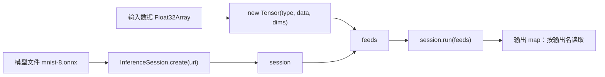

import { Canvas, Controls, Meta } from '@storybook/addon-docs/blocks';
import * as FirstInference from './first-inference.stories';

<Meta of={FirstInference} name="Docs" />

# 第一次推理

这一课跑通浏览器推理的最小闭环：加载一个 ONNX 模型创建 InferenceSession，按模型签名构造输入张量，执行 `session.run` 并读取输出。四步对应的调用是固定的——后续课程切换后端、更换模型或处理图像，都只是替换其中一步。



打开下方实例就能看到闭环在真实运行：实例打开时自动从 ONNX Model Zoo 拉取约 26KB 的 MNIST 手写数字模型并完成第一次推理，在左侧画板画一个数字，右侧 10 个类别的分数条随之变化。模型与 wasm 运行时都从 CDN 拉取，需要网络可达；任何一步失败，画布都会显示错误信息与重试入口。

| 调用 | 默认值 / 回查要点 |
| --- | --- |
| `env.wasm.wasmPaths = '...'` | 必须在第一个会话创建前设置；指向与安装版本配套的 dist 目录 |
| `env.wasm.numThreads` | 默认 0（由系统决定）；无跨域隔离响应头时只能单线程，显式置 1 |
| `InferenceSession.create(uri, options?)` | 返回 Promise；options 省略时按已注册后端解析，wasm 是兼容基线 |
| `new Tensor(type, data, dims?)` | dims 省略时按一维处理；data 用对应 TypedArray，int64 为 BigInt64Array |
| `session.run(feeds)` | 返回按输出名索引的 map；省略 fetches 时输出模型定义的全部输出 |

## 快速上手

以下代码在浏览器页面里执行（如 Vite 项目入口或 `<script type="module">`），顶层 `await` 直接可用；模型文件与 wasm 资源在运行时从 CDN 拉取。

```ts
import { InferenceSession, Tensor, env } from 'onnxruntime-web';

// 1. 指向与安装版本一致的 ort wasm 资源；必须写在创建会话之前
env.wasm.wasmPaths = 'https://cdn.jsdelivr.net/npm/onnxruntime-web@1.30.0/dist/';
env.wasm.numThreads = 1; // 无跨域隔离响应头时保持单线程

// 2. 加载 ONNX 模型，得到会话（约 26KB 的 MNIST 分类模型）
const session = await InferenceSession.create(
  'https://media.githubusercontent.com/media/onnx/models/main/validated/vision/classification/mnist/model/mnist-8.onnx',
  { executionProviders: ['wasm'] },
);

// 3. 按模型签名构造输入张量，并以输入名为键组成 feeds
const data = new Float32Array(1 * 1 * 28 * 28); // 全 0 的空画板
const feeds = {
  [session.inputNames[0]]: new Tensor('float32', data, [1, 1, 28, 28]),
};

// 4. 执行推理，按输出名读取结果
const outputs = await session.run(feeds);
const output = outputs[session.outputNames[0]] as Tensor;
const logits = output.data as Float32Array;
const predicted = logits.indexOf(Math.max(...logits));

console.log(session.inputNames, session.outputNames); // ['Input3'] ['Plus214_Output_0']
console.log('预测数字', predicted);
```

<Canvas of={FirstInference.Interactive} />

| 读者操作 | 可观察证据 |
| --- | --- |
| 打开实例并等待 | 读数从「加载模型…」变为「就绪」，右侧出现 10 个类别的分数条（空画板也有输出） |
| 在左侧画板画一个数字 | 分数条与「预测」读数随笔画即时变化 |
| 点击「清空」 | 输入归零后重新推理，分布回到空输入的形状 |
| 打开 Show code | 看到该 Canvas 实际执行的 `first-inference.ts` |

## 创建会话

`InferenceSession.create` 的第一个参数是模型来源：URL 字符串，或已读入内存的 ArrayBuffer / Uint8Array。创建是异步的——下载、解析模型和初始化后端都发生在这一步；成功后返回可复用的会话，失败则在 Promise 的 reject 阶段抛出，上方实例画布上的红色错误面板就来自这里。

```ts
const session = await InferenceSession.create(MODEL_URL, {
  executionProviders: ['wasm'], // 省略时按已注册后端解析，wasm 是兼容基线
});

// 会话自带签名信息：名字与形状以它为准，不要凭记忆硬编码
console.log(session.inputNames); // ['Input3']
console.log(session.outputNames); // ['Plus214_Output_0']
console.log(session.inputMetadata[0]);
// { name: 'Input3', isTensor: true, type: 'float32', shape: [1, 1, 28, 28] }
```

创建会话是重操作：要下载模型、解析计算图、初始化内存，毫秒到秒级。它只需做一次，之后每次交互只需要 `run`。实例左下角读数中的「模型输入 / 模型输出」就是从会话元数据实时读出的。SessionOptions 的完整配置与输入输出元数据查询见 [InferenceSession](?path=/docs/inference-session--docs) 课程，后端如何选择见「后端选择与回退」课程。

## 构造输入张量

输入张量由三要素组成，`dims` 必须与模型签名一致，`data` 用对应类型的 TypedArray：

| 要素 | 含义 | MNIST 本例 |
| --- | --- | --- |
| `type` | 元素类型，决定用哪种 TypedArray | `'float32'` → Float32Array |
| `data` | 一维平铺的数据缓冲 | 784 个 float32，黑底 0、笔画 1 |
| `dims` | 形状，逐维与模型签名对齐 | `[1, 1, 28, 28]` |

```ts
const data = new Float32Array(1 * 1 * 28 * 28); // 784 个 float32，行优先展开
// ……把笔画写进 data（黑底 0、白字 1，取值范围 [0,1]）
const tensor = new Tensor('float32', data, [1, 1, 28, 28]);
const feeds = { [session.inputNames[0]]: tensor }; // 键 = 模型输入名
```

值域与布局是模型约定而非 ort 约定：MNIST 模型约定黑底白字、像素缩放到 [0,1]；换模型时先查它的模型说明。类型不止 float32——int64 用 BigInt64Array、bool 用 Uint8Array，dims 省略时按一维处理，完整类型与转换见 [Tensor 与数据类型](?path=/docs/tensor--docs) 课程；从图像到张量的预处理见 [图像与 Tensor 互转](?path=/docs/tensor-image--docs) 课程。

下方实例不复用画板：三段循环直接写出 784 个 float32（竖线、圆环、横线），按同一签名构造张量并推理。数字形图案的分数集中在某个类别上；切到「横线」这类非数字输入，分布明显更平——输出忠实地反映输入。

<Canvas of={FirstInference.Programmatic} />
<Controls of={FirstInference.Programmatic} />

| 读者操作 | 可观察证据 |
| --- | --- |
| 切换「输入图案」 | 左侧张量内容重画，「预测」读数与右侧分布随之变化 |
| 切到「横线（非数字）」 | 分布明显更平，最高概率下降 |
| 打开 Show code | 看到该 Canvas 实际执行的 `programmatic-tensor.ts` |

## 执行推理并读取输出

`session.run` 只有一个必填参数 feeds；返回的 Promise resolve 为按输出名索引的 map，每个键对应一个输出张量。

```ts
const outputs = await session.run(feeds);
const output = outputs[session.outputNames[0]] as Tensor;
const logits = output.data as Float32Array; // wasm 后端输出在 CPU，.data 同步可读
const predicted = logits.indexOf(Math.max(...logits)); // argmax 即预测
```

先用 `output.dims` 确认形状（本例 `[1,10]`），再读 `output.data`。模型输出是 softmax 之前的原始分数：直接 argmax 就得到预测；要展示为概率需要自己做一次 softmax，两个实例的分数条都是这样画的。换用 WebGPU 等 GPU 后端时，输出可能仍在 GPU 上，读 `.data` 会抛错，此时改用 `await output.getData()`。run 的完整形态——指定 fetches、RunOptions 与并发语义——见 [InferenceSession](?path=/docs/inference-session--docs) 课程。

## 最佳实践

- **env 配置写在所有 create 之前。** wasmPaths、numThreads 等 env.wasm 标志在第一个会话创建时生效，之后再改不影响已创建的后端。把配置集中在应用启动处，避免「本地能跑、部署后找不到 wasm」。
- **会话只创建一次，复用给每次 run。** create 要下载并解析模型，是重操作；把 session 缓存进模块单例或应用状态，交互事件里只调 run。本课两个内嵌实例共享同一个会话，就是这样实现的。
- **先用单线程 wasm 跑通，再考虑加速。** wasm 是所有浏览器可用的基线；闭环跑通后再按需启用 [WebGPU 后端](?path=/docs/backend-webgpu--docs)或多线程（[多线程与跨域隔离](?path=/docs/cross-origin-isolation--docs)），排查问题时也先回到这个基线。

## 常见问题

- 控制台报 `failed to load wasm`、`no available backend found`，或页面一直卡在加载。
  检查 `env.wasm.wasmPaths` 指向的 dist 目录版本是否与安装的 onnxruntime-web 完全一致、URL 是否可直接访问。wasm 资源与 JS 包必须版本配套，路径错配或不可达时后端初始化直接失败。
- 模型 URL 浏览器能打开，`InferenceSession.create` 却报模型解析错误（如 `Parse header` 失败）。
  把响应内容取出来确认是 protobuf 二进制而不是文本。ONNX Model Zoo 的模型走 Git LFS，`raw.githubusercontent.com` 返回的是 LFS 指针文本，浏览器拉取要用 GitHub 的 media 端点或带 CORS 的镜像。
- run 报 `invalid input name`，或输出 map 里取不到值。
  feeds 的键必须逐字等于 `session.inputNames` 里的名字。不同框架导出的模型输入名差异很大（Input3、images、x 都常见），运行时打印 inputNames 核对，不要照抄教程。
- run 报形状不匹配（`Got: [784] Expected: [1,1,28,28]` 之类）。
  Tensor 的 dims 必须与模型签名完全一致：漏掉 batch 维、把 `[1,1,28,28]` 展平成 `[784]`、把 H/W 写反都会报错。用 `session.inputMetadata` 对照修正。
- 读取输出 `.data` 时抛出 gpu-buffer 相关错误。
  GPU 后端（WebGPU 等）的输出数据可能仍在 GPU 上，`.data` 只在数据位于 CPU 时可用；改用 `await output.getData()`。本课的 wasm 后端输出始终在 CPU。

## 总结回顾

摘要：

本课把浏览器里的第一次推理拆成四步：先给 ort 指定与安装版本配套的 wasm 资源路径并保持单线程；再用 `InferenceSession.create` 加载约 26KB 的 MNIST 模型，从会话元数据读出输入输出签名；然后按签名构造 float32 张量、以输入名为键组成 feeds；最后 `run` 得到按输出名索引的 map，读出 10 个类别分数并取 argmax。画板实例覆盖真实数据输入，程序构造张量实例覆盖代码造数据的兜底路径，两者共享同一个会话，加载失败时都能在画布上看到错误与重试入口。

一句话：

> 第一次推理只有一个骨架——配置 wasm 资源、create 会话、按签名构造 Tensor 组成 feeds、run 后按输出名读 map；换模型、换后端都只是替换其中一步。

知识要点：

- 第一次推理的四步分别对应哪些调用？
- 输入张量的名字、形状和值域分别由什么决定？
- run 返回什么结构？怎样从输出读出预测？
- 为什么 env.wasm 配置必须写在第一个 create 之前？
- 会话创建失败与 run 失败时，各自先检查什么？

## 参考资料

- [Get started with ONNX Runtime Web](https://onnxruntime.ai/docs/get-started/with-javascript/web.html) — 官方 Web 入门教程，本课四步闭环与其对应
- [onnxruntime-web API 参考](https://onnxruntime.ai/docs/api/js/index.html) — InferenceSession、Tensor、env.wasm 签名与默认值的依据
- [ONNX Model Zoo：MNIST](https://github.com/onnx/models/tree/main/validated/vision/classification/mnist) — 本课示例模型的下载来源、输入输出签名与预处理约定
- [microsoft/onnxruntime 仓库 js 目录](https://github.com/microsoft/onnxruntime/tree/main/js) — ort-wasm 资源文件清单与浏览器后端兼容性说明
