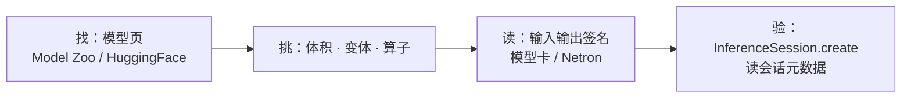

import { Canvas, Controls, Meta } from '@storybook/addon-docs/blocks';
import * as GettingModels from './getting-models.stories';

<Meta of={GettingModels} name="Docs" />

# 获取模型

前三课的模型都是"给定的"；这一课解决它从哪来：去哪里找现成的 `.onnx` 文件、怎么按浏览器的约束挑选、拿到文件后怎么确认它的输入输出签名。浏览器推理对模型有三个硬约束——**模型文件就是下载量，签名决定能否喂对输入，算子覆盖决定能否在目标后端上跑**——所以"找一个模型"始终是"按这三条筛选一个模型"。本课只讲获取现成模型；模型训练与格式转换不在手册边界内。



| 事项 | 回查要点 |
| --- | --- |
| ONNX Model Zoo 直连 URL | `https://media.githubusercontent.com/media/onnx/models/main/...`；raw 与 jsdelivr gh 返回 LFS 指针文本 |
| HuggingFace 直连 URL | `https://huggingface.co/<org>/<repo>/resolve/main/onnx/<文件>`；blob 是网页不是文件 |
| 量化变体命名 | Model Zoo 用 `-int8` 后缀；HuggingFace 用 `model_quantized.onnx`、`model_fp16.onnx` 等文件名 |
| 签名三处可查 | 模型卡/README、Netron、`session.inputMetadata`——以运行时元数据为准 |

## 模型来源

一个"模型页"由三部分组成：**模型卡**（说明任务、输入输出与预处理）、**文件列表**（同一模型的不同变体）、**可直连的原始文件 URL**（推理代码真正加载的那个地址）。两个主要来源的差别在规模与组织方式：ONNX Model Zoo 小而官方，HuggingFace 大而社区。判断口径：经典视觉模型、想要干净的文档先看 Model Zoo；新模型、社区模型、需要量化变体的，去 HuggingFace 找。

### ONNX Model Zoo

ONNX 官方维护的经典模型集合，仓库是 [github.com/onnx/models](https://github.com/onnx/models)，`validated/` 下按领域和任务分目录（如 `validated/vision/classification/mnist/`）。每个模型目录里有一份 README 和一个 `model/` 子目录：README 给出输入输出签名与预处理约定，`model/` 里放着各版本的 `.onnx` 文件。

文件名的数字后缀是导出时的 opset 版本（README 的模型表逐行标注，如 `mnist-8` 是 opset 8、`mnist-12` 是 opset 12）；不少模型还有量化变体，如 `mnist-12-int8.onnx`。

`.onnx` 文件在 GitHub 上走 Git LFS，URL 选错形态只会拿到指针文本。以 mnist-8 为例（2026-10 实测）：

| URL 形态 | 实测结果 |
| --- | --- |
| `https://raw.githubusercontent.com/onnx/models/main/validated/vision/classification/mnist/model/mnist-8.onnx` | 200，`text/plain`，130 字节的 LFS 指针文本，**不能当模型 URL** |
| `https://cdn.jsdelivr.net/gh/onnx/models@main/...`（jsdelivr gh 镜像） | 同样是指针文本 |
| `https://media.githubusercontent.com/media/onnx/models/main/validated/vision/classification/mnist/model/mnist-8.onnx` | 200，`application/octet-stream`，26,454 字节模型本体，带 `Access-Control-Allow-Origin: *` |

**浏览器拉模型一律用 media 端点**：路径在普通 GitHub 地址前面加 `https://media.githubusercontent.com/media/`。响应带 CORS 通配头，`InferenceSession.create` 可以直接加载——[第一次推理](?path=/docs/first-inference--docs)课的示例用的就是这条 URL。

### HuggingFace Models

规模最大的社区模型平台：在[模型列表](https://huggingface.co/models?library=onnx&sort=trending)加 `library=onnx` 过滤，就能看到所有提供 onnx 导出的模型；onnx-community、Xenova 等组织持续发布对 web 友好的导出。模型页里，model card 承担签名与用法说明，**Files and versions 页签**列出全部变体文件。

onnx 导出的变体命名已成惯例（以 [Xenova/yolos-tiny](https://huggingface.co/Xenova/yolos-tiny) 为例，`onnx/` 目录）：

| 文件 | 含义 |
| --- | --- |
| `model.onnx` | fp32 基线，体积最大 |
| `model_quantized.onnx` | int8 量化，体积约为 fp32 的三分之一 |
| `model_fp16.onnx` | 半精度，WebGPU 友好 |
| `model_q4.onnx` / `model_q4f16.onnx` | 4-bit 量化，最小 |

直连 URL 用 **resolve 路径**：`https://huggingface.co/<org>/<repo>/resolve/main/onnx/<文件>.onnx`。resolve 会 302 跳转到 CDN，浏览器 fetch 全程畅通——跳转响应会回显请求方的 Origin，最终响应带 `Access-Control-Allow-Origin: *`（实测）。blob 页面（`/blob/main/...`）是 HTML 网页，不能当模型 URL。

两个额外注意：

- **外部数据文件。** 大模型常拆成两个文件：`model.onnx` 只剩几十 KB 的图结构，权重在 `model.onnx_data`（如 onnx-community/all-MiniLM-L6-v2-ONNX 是 0.1 MB + 86.1 MB）。ort-web 加载时会按相对路径自动补取，但体积预算要按两个文件之和算。
- **版本会漂移。** `main` 分支上的文件可能被重新导出；在意可复现性时用固定 revision（见最佳实践）。

## 按浏览器约束挑选

拿到候选模型后，按浏览器的三个约束逐条过：

- **体积就是下载量。** 模型文件在首次 `InferenceSession.create` 时整体下载，直接成为首屏负担。量级感：mnist-8 约 26KB，yolos-tiny 量化版约 9.2MB，BERT 量级的 Transformer 模型 fp32 常见上百 MB。同一模型多变体时从量化版起步，精度损失换体积的取舍见 [量化与体积](?path=/docs/quantization--docs)。
- **签名决定预处理。** 输入是 1 通道灰度还是 3 通道 RGB、28×28 还是 224×224、float32 像素还是 int64 token id——写预处理前必须逐项与签名核对。mnist-8 的 README 就写明：输入 `1x1x28x28` float32，黑底白字、值域缩放到 [0,1]，输出是 softmax 之前的 `1x10` 分数。
- **算子覆盖决定后端。** wasm 后端覆盖全部 ai.onnx 算子，是兼容基线；WebGPU 等 GPU 后端的算子是子集，冷门算子会回退或失败。选型时先确认模型能在目标后端上跑，见 [后端选择与回退](?path=/docs/backend-selection--docs)。

## 读懂输入输出签名

签名是每个输入/输出张量的 **name、type、shape**，与推理代码一一对应：feeds 的键 = 输入 name，`new Tensor` 的 type 与 dims = type 与 shape，TypedArray 的种类由 type 决定。签名有三处可查，**以运行时元数据为权威**——模型页的默认文件、量化变体、fp16 变体的签名可能各不相同，文档也可能滞后于文件。

### Netron 可视化

[Netron](https://netron.app) 是模型可视化工具：把下载好的 `.onnx` 文件拖进 netron.app（或用桌面版打开），左栏显示模型信息（producer、opset、IR 版本），图区从输入节点到输出节点展示整张计算图，点任意节点可看算子属性。读签名时只看首尾两组节点：

```text
（示意：Netron 打开 mnist-8.onnx 时输入输出节点的读法；
 数值可在本课示例的读数里现场核对）

  inputs                            outputs
  Input3                            Plus214_Output_0
  float32[1,1,28,28]                float32[1,10]
```

Netron 适合离线读图、看算子构成、给预处理做对齐；它读到的是"拖进去的那份文件"，不能代替对"实际加载文件"的运行时核对。

### 模型卡与 README

Model Zoo 每个模型目录的 README 与 HuggingFace 的 model card 是第一手说明：任务、输入输出、预处理约定（值域、归一化、布局）通常都在，有的还带预处理代码。用法是"先读文档建立预期，再用运行时元数据确认实际文件"——多个变体共用一份模型卡时，这一步不能省。

### 运行时元数据核对

`InferenceSession.create` 成功后，会话对象自带完整签名——权威且程序化，而且**核对签名不需要执行一次推理**：

```ts
const session = await InferenceSession.create(MODEL_URL, {
  executionProviders: ['wasm'],
});

// 签名以实际加载的那份文件为准
console.log(session.inputNames); // mnist-8: ['Input3']
console.log(session.outputNames); // mnist-8: ['Plus214_Output_0']

const input = session.inputMetadata[0];
if (input.isTensor) {
  console.log(input.type, input.shape); // 'float32' [1, 1, 28, 28]
}

// 输出同理：session.outputMetadata
```

两个边界：

- `shape` 里可能出现非数字项——这是**符号维度**，表示该维的大小运行时才确定（动态 batch、动态序列长度很常见）；上方实例切到 yolos-tiny 就能看到：输入 `pixel_values` 的 shape 四维都是未知（读数显示 `?`）。构造输入张量时 dims 填本次的具体数值即可。
- 有的分类模型输出形状带多余的 1 维（如 `[1,1000,1,1]`），argmax 前先看 `dims` 再取数。

下方实例把"URL → 会话元数据"做成速查器：切换模型来源与 URL 形态，读数显示真实签名；raw 选项是刻意提供的失败对照。

<Canvas of={GettingModels.SignatureLookup} />
<Controls of={GettingModels.SignatureLookup} />

| 读者操作 | 可观察证据 |
| --- | --- |
| 打开实例并等待 | 默认加载 Model Zoo 的 mnist-8（约 26KB），读数出现 `输入 Input3 float32 [1,1,28,28]` 与 `输出 Plus214_Output_0 float32 [1,10]` |
| 切到「HuggingFace · resolve」 | 下载 yolos-tiny 量化版（约 9.2MB，首次稍慢）后显示它的真实签名：输入 `pixel_values`（shape 四维都是符号维度），输出两个张量（`logits` 与 `pred_boxes`） |
| 切到「Model Zoo · raw（失败对照）」 | 同一个小模型，URL 只返回百余字节 LFS 指针文本，画布显示模型解析失败 |
| 来回切换已加载过的来源 | 立即显示——会话按 URL 缓存，不重复下载 |
| 打开 Show code | 看到该 Canvas 实际执行的 `getting-models.ts` |

## 最佳实践

- **演示用 CDN 直连，上线用自托管。** 教程示例直接拉 media/resolve 地址最方便；生产应用把模型文件下载进自己的静态资源、同源伺服——版本可控、缓存可控，也不依赖第三方站点的可用性与限流。伺服与缓存策略见 [部署](?path=/docs/deployment--docs)，大文件配合量化变体压缩（[量化与体积](?path=/docs/quantization--docs)）。
- **URL 指向固定 revision。** `main` 分支与不锁版本的路径都可能被重新导出，模型行为会悄悄变化。HuggingFace 的 resolve 路径支持填 commit hash（`/resolve/<commit>/onnx/...`）；Model Zoo 与自托管用带版本号的文件名。
- **先用小模型验证通路。** 26KB 的 mnist-8 足以验证"URL 可达、签名可读、预处理对齐"整条链路；换目标模型时只换 URL 与预处理。本课示例的签名速查代码就是可复用的核对脚本。

## 常见问题

- URL 浏览器能打开，`InferenceSession.create` 却报模型解析错误（`Parse header` 之类）。
  取响应内容看一眼：`raw.githubusercontent.com` 与 `cdn.jsdelivr.net/gh/` 对 Git LFS 模型返回的是百余字节的指针文本（content-type 还是 `text/plain`），不是模型。改用 `media.githubusercontent.com/media/...` 端点或自托管文件本体。
- 直接把 HuggingFace 的 blob 页面链接当模型 URL 传给 `create`。
  blob 链接返回 HTML 网页。改用 `/resolve/main/<路径>` 直连地址，文件名从 Files 页签逐字复制。
- HuggingFace 模型加载远比预期慢，下载量远超 `.onnx` 文件在 Files 页签里显示的大小。
  该模型用了外部数据：`model.onnx` 只有图结构，权重在 `model.onnx_data`，ort 加载时自动补取。体积预算按两个文件之和计算；在意首屏时优先选单文件的小变体。
- `session.inputMetadata` 的 shape 里出现字符串而不是数字。
  这是符号维度（动态 batch、动态序列长度），表示该维大小由每次输入决定。构造输入张量时 dims 填本次的具体数值，`InferenceSession` 的 feeds 语义见 [InferenceSession](?path=/docs/inference-session--docs)。

## 总结回顾

摘要：

获取现成模型从两个来源开始：ONNX Model Zoo 官方而精，模型目录自带 README 签名说明；HuggingFace 大而全，用 `library=onnx` 过滤后在 Files 页签挑变体。无论哪个来源，推理代码加载的都是可直连的原始文件 URL——Model Zoo 用 media 端点拿到 LFS 真身，HuggingFace 用 resolve 路径跳转到 CDN；raw 与 jsdelivr gh 只返回指针文本，blob 是网页。挑选时按浏览器的三个约束过筛：体积即下载量（优先量化变体）、签名决定预处理（通道数、尺寸、dtype 逐项核对）、算子覆盖决定后端（wasm 全覆盖、GPU 后端是子集）。签名有三处可查——模型卡/README、Netron 可视化、会话元数据——以 `session.inputMetadata` 为权威，核对它不需要执行推理。

一句话：

> 获取模型就是按浏览器的三个约束筛选文件本体，再用会话元数据核对签名——URL 要直连 media/resolve，签名以运行时为准。

知识要点：

- 两个模型来源各自怎么找？可直连 URL 分别是什么形态？
- 为什么 raw.githubusercontent.com 与 jsdelivr gh 不能直接当模型 URL？
- HuggingFace 的 `model.onnx` 与 `model.onnx_data` 是什么关系？体积预算怎么算？
- 签名有哪三处可查？为什么以运行时元数据为准？
- `inputMetadata.shape` 里的字符串维度意味着什么？构造输入时怎么填？

## 参考资料

- [ONNX Model Zoo](https://github.com/onnx/models) —— 模型目录结构、文件命名与下载来源
- [ONNX Model Zoo：MNIST](https://github.com/onnx/models/tree/main/validated/vision/classification/mnist) —— 本课示例模型的 README：输入输出签名、预处理约定与 opset 对照表
- [HuggingFace Models（ONNX 过滤）](https://huggingface.co/models?library=onnx&sort=trending) —— 社区 onnx 模型的检索入口
- [Xenova/yolos-tiny](https://huggingface.co/Xenova/yolos-tiny) —— 本课示例 HF 模型的 model card 与 Files 变体列表
- [Netron](https://netron.app) —— 模型可视化工具：读输入输出签名与计算图
- [onnxruntime-web API 参考](https://onnxruntime.ai/docs/api/js/index.html) —— `inputMetadata` / `outputMetadata`（ValueMetadata）的类型定义
