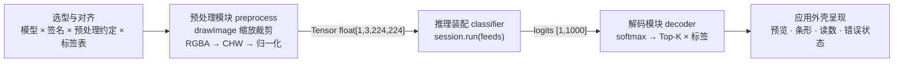

import { Canvas, Controls, Meta } from '@storybook/addon-docs/blocks';
import * as ImageClassification from './image-classification.stories';

<Meta of={ImageClassification} name="Docs" />

# 图像分类应用

这一课把前面所有部件组装成一个完整的网页应用：给一张照片，页面输出「这是什么」的前 K 个答案。推理 API 在本课没有新增任何东西——应用与教程脚本的差距在两件事：**选型核对**（模型文件 × 输入签名 × 预处理约定 × 标签表索引，四处约定逐一实测对上）和**读数设计**（预处理与解码的错都不报错，只有把输入 / 输出范围放进读数才能在应用层发现）。因此本课把管线拆成预处理、推理、解码三个有契约的模块，每个模块可以单独核对。

打开下方实例，就能看到整条管线真实运行：自动下载模型（4.96 MB）、wasm 运行时、标签表与示例照片，然后对照片完成「中心裁剪 → 归一化 → 推理 → Top-5」，左侧预览是模型实际看到的输入，右侧是解码后的类别条形。所有资源从 CDN 与 Wikimedia Commons 拉取，需要网络可达；5 分钟内重复打开走 HTTP 缓存；任何一步失败，画布会显示错误信息，点击可重试。



| 项 | 本课取值 | 回查要点 |
| --- | --- | --- |
| 模型 | squeezenet1.1-7 · 4,956,208 字节 | Model Zoo 的 Git LFS media 端点；选型核对见「选型核对清单」 |
| 输入 | `data` · `float[1,3,224,224]` · RGB | 名字与形状以 `session.inputNames` / `inputMetadata` 实测为准 |
| 归一化 | ÷255 后 `(x − mean) / std`，mean / std 取 ImageNet 常量 | 正确输入范围约 `[-2.12, 2.64]`，超出即错域 |
| 输出 | `squeezenet0_flatten0_reshape0` · `[1,1000]` · 原始 logits | Model Zoo 页写法与实测不符；softmax 要自己做 |
| 标签表 | synset.txt · 1000 行 · 31,675 字节 | 行号即类别索引，与模型取自同一仓库 |
| Top-K | softmax 后取前 K（实例默认 5） | 解码是纯函数，切 K 不必重跑推理 |

## 快速上手

以下脚本在浏览器页面里执行（Vite 项目或 `<script type="module">`），顶层 `await` 直接可用；四十行左右就是一个能对真实照片输出 Top-5 的完整分类器。env 配置、会话创建、像素转换分别来自 [ort.env 全局配置](?path=/docs/ort-env--docs)、[第一次推理](?path=/docs/first-inference--docs)与[图像与 Tensor 互转](?path=/docs/tensor-image--docs)课程，这里只按应用场景把它们串起来。

```ts
import { env, InferenceSession, Tensor } from 'onnxruntime-web';

env.wasm.wasmPaths = 'https://cdn.jsdelivr.net/npm/onnxruntime-web@1.30.0/dist/';
env.wasm.numThreads = 1; // 无跨域隔离响应头时保持单线程

const ZOO = 'https://media.githubusercontent.com/media/onnx/models/main/validated/vision/classification';
// 模型与标签表互不依赖，并行下载
const [model, labelsText] = await Promise.all([
  fetch(`${ZOO}/squeezenet/model/squeezenet1.1-7.onnx`).then((r) => r.arrayBuffer()),
  fetch(`${ZOO}/synset.txt`).then((r) => r.text()),
]);
const labels = labelsText.trim().split('\n').map((line) => line.replace(/^\S+\s+/, ''));

const session = await InferenceSession.create(model, { executionProviders: ['wasm'] });

// 几何：短边缩放 + 中心裁剪到 224×224（drawImage 完成），再取 RGBA 像素
const PHOTO =
  'https://upload.wikimedia.org/wikipedia/commons/thumb/b/bd/Golden_Retriever_Dukedestiny01_drvd.jpg/500px-Golden_Retriever_Dukedestiny01_drvd.jpg';
const bitmap = await createImageBitmap(await fetch(PHOTO).then((r) => r.blob()));
const side = Math.min(bitmap.width, bitmap.height);
const canvas = Object.assign(document.createElement('canvas'), { width: 224, height: 224 });
const context = canvas.getContext('2d', { willReadFrequently: true })!;
context.drawImage(bitmap, (bitmap.width - side) / 2, (bitmap.height - side) / 2, side, side, 0, 0, 224, 224);
const image = context.getImageData(0, 0, 224, 224);

// 像素：丢 alpha 取 RGB → HWC 改 CHW → ImageNet 归一化
const MEAN = [0.485, 0.456, 0.406];
const STD = [0.229, 0.224, 0.225];
const data = new Float32Array(3 * 224 * 224);
for (let y = 0; y < 224; y += 1) {
  for (let x = 0; x < 224; x += 1) {
    const i = (y * 224 + x) * 4;
    for (let c = 0; c < 3; c += 1) {
      data[c * 224 * 224 + y * 224 + x] = (image.data[i + c] / 255 - MEAN[c]) / STD[c];
    }
  }
}

// 推理与解码：run 后 softmax 概率化，取前 5 与标签表对齐
const outputs = await session.run({
  [session.inputNames[0]]: new Tensor('float32', data, [1, 3, 224, 224]),
});
const logits = outputs[session.outputNames[0]].data as Float32Array;
const max = Math.max(...logits);
const exps = Array.from(logits, (v) => Math.exp(v - max));
const sum = exps.reduce((a, b) => a + b, 0);
const top5 = exps
  .map((e, index) => ({ label: labels[index], prob: e / sum }))
  .sort((a, b) => b.prob - a.prob)
  .slice(0, 5);
console.log(top5); // 这张金毛照片 Top-1 为 golden retriever，置信度接近 90%
```

模型输出是原始 logits 而不是概率，softmax 必须自己做——判断方法与依据见「选模型与类别标签表」。下面的正文把这个脚本拆成有契约的模块，并让每个环节都有可核对的读数。

## 应用骨架

应用按「一段管线一个模块」拆分，模块之间只通过契约（输入类型与返回类型）耦合：

| 模块 | 职责 | 契约 |
| --- | --- | --- |
| `preprocess.ts` | 像素改写：RGBA → `[1,3,224,224]` float32 | `rgbaToTensor(image, mode)`，纯函数 |
| `decoder.ts` | 输出解读：logits → softmax → Top-K × 标签 | `softmax` / `topK` / `parseSynset`，纯函数 |
| `classifier.ts` | 装配：模型与标签表加载缓存 + 管线编排 | `loadClassifier()` → `classify(image, options)` |
| `image-classification.ts` | 界面外壳：取图、状态机、绘制 | 消费 `classify`，不碰会话细节 |

这样拆的直接红利：预处理与解码是纯函数，能脱离 DOM 单独核对；解码不依赖推理，**切换 Top-K 只重排概率，不重跑模型**；换模型或换照片只动装配层与外壳。下方实例真实运行这条管线，三组控件分别对应管线的三个问题：

<Canvas of={ImageClassification.Pipeline} />
<Controls of={ImageClassification.Pipeline} />

| 读者操作 | 可观察证据 |
| --- | --- |
| 打开实例并等待 | 「状态」读数经历 下载模型 → 推理中 → 就绪；左侧出现照片预览（即模型看到的 224×224 中心裁剪），右侧出现 Top-5 条形，Top-1 读数为 golden retriever |
| 切换「示例照片」 | Top-K 条形与 Top-1 读数跟随照片主体变化（金毛犬 / 香蕉 / 咖啡），「输入张量」范围读数随照片变化 |
| 把「归一化」切到「只 ÷255」 | 不报任何错；金毛 Top-1 翻成错误类别（写作时实测为 Great Pyrenees），香蕉 / 咖啡 Top-1 不变但置信度跌到三至四成——见「预处理」一节 |
| 把「归一化」切到「0–255 原值」 | Top-1 反而接近 100%「更自信」，「输出张量」的 logits 范围读数升到数百——置信度虚高是陷阱 |
| 把「Top-K」切到 3 / 5 | 条形行数即时变化，「本次解码」读数在微秒级而「本次推理」读数不变——解码独立于推理的现场 |
| 打开 Show code | 看到该 Canvas 实际执行的三个核心模块（画布外壳不在其中） |

## 选模型与类别标签表

### 选型核对清单

浏览器里选图像分类模型，五项核对全部通过才进项目。以本课的 squeezenet1.1-7 为例：

1. **体积与下载**：4,956,208 字节，秒级下载可接受；要更小换量化变体（[量化与体积](?path=/docs/quantization--docs)），要更准换更大模型并接受下载成本。
2. **输入签名**：`float[1,3,224,224]`——尺寸、通道、布局、类型共同决定预处理写法。签名怎么读见[获取模型](?path=/docs/getting-models--docs)，`run` 的 feeds 怎么组见 [InferenceSession](?path=/docs/inference-session--docs)。
3. **预处理约定**：Model Zoo 页写明 ÷255 后用 ImageNet mean / std 归一化。约定查模型说明，不猜。
4. **输出语义**：类别数 1000；是概率还是 logits 要实测——这条最容易翻车，见下。
5. **标签表可得性**：必须有与输出索引对应的类别名清单，否则输出只是一组数字。

第 4 项本课就有现成的翻车现场：Model Zoo 的 SqueezeNet 页面写输出为 `softmaxout_1: float[1,1000,1,1]`，而 squeezenet1.1-7 实测创建会话后——

```ts
console.log(session.inputNames); // ['data']
console.log(session.outputNames); // ['squeezenet0_flatten0_reshape0']
// 输出形状实测 [1,1000]；输出值求和可以判别语义：
const values = outputs[session.outputNames[0]].data as Float32Array;
const sum = values.reduce((total, value) => total + value, 0);
// 值和 ≈ 1      → 已含 softmax，可直接当概率用
// 值和 ≫ 1      → 原始 logits，展示前要自己 softmax
// 本模型实测值和 ≈ 9988 → logits
```

输出名、形状、是否已 softmax 三处与文档全对不上。结论与[获取模型](?path=/docs/getting-models--docs)课一致：**README 只当线索，签名与输出语义以会话元数据和实测为准**。输出形状遇到 `[1,1000,1,1]` 这类带尾维的形式时，把 `dims` 连乘展平成一维再解码，不对形状硬编码。

### 类别标签表

输出索引要变成人能读的类别名，需要一份与模型输出**按索引对齐**的标签表。本课用 Model Zoo 自带的 synset.txt（31,675 字节）：每行「wnid 类别名」，1000 行，行号即类别索引，与模型同一仓库、同一套训练配置，对齐最有保障：

```ts
/** 解析 synset.txt：'n01440764 tench, Tinca tinca' → 'tench, Tinca tinca'，行号即索引。 */
function parseSynset(text: string): string[] {
  return text.trim().split('\n').map((line) => line.replace(/^\S+\s+/, ''));
}
```

换其他来源（如 HuggingFace 模型的 `id2label`）时，先确认它的索引约定与模型输出一致。标签错位是纯静默错误——程序照常运行，只是把每个答案都贴错牌，**唯一核对方式是拿已知类别的照片对拍**：本课实例的三张照片（金毛犬、香蕉、咖啡）就是对拍用例，Top-1 与照片主体一致才说明管线与标签都对齐。

## 预处理

预处理 = 几何 + 像素两段。原理与全部变体（通道、布局、值域、`fromImage` 选项）见[图像与 Tensor 互转](?path=/docs/tensor-image--docs)课程，这里只讲应用怎么「按约定组装」。

**几何段交给 `drawImage`**：分类模型的约定输入是正方形，照片不是——标准做法是短边缩放到 224、中心裁剪，一个九参 `drawImage` 同时完成两件事：

```ts
const side = Math.min(bitmap.width, bitmap.height);
cropContext.drawImage(
  bitmap,
  (bitmap.width - side) / 2, (bitmap.height - side) / 2, side, side, // 源：中心正方形
  0, 0, INPUT_SIZE, INPUT_SIZE,                                      // 目标：224×224
);
const image = cropContext.getImageData(0, 0, INPUT_SIZE, INPUT_SIZE);
```

**像素段写成纯函数**：丢 alpha 取 RGB → HWC 交错改 CHW 分面 → 按约定归一化（完整实现见实例 Show code 的 `preprocess.ts`）。归一化公式 `(x / 255 − mean) / std` 也能用 `Tensor.fromImage` 的 `norm` 参数表达（换算表见 tensor-image 课的最佳实践）；本课手写是为了把归一化模式做成可切换、可测的模块。

组装对不对，靠**输入范围读数**核对：ImageNet 归一化的理论取值界是 `[-2.12, 2.64]`（由 mean / std 算出的常量），实例的「输入张量」读数落在这个区间附近就是按约定执行。而归一化做错的后果，是本课最重要的应用层证据——上方实例切「归一化」控件：

| 模式 | 写作时实测（同版本 wasm，同一套数学） | 读数表现 |
| --- | --- | --- |
| ImageNet mean / std | 三张照片 Top-1 全对：golden retriever 89.4% / banana 98.3% / espresso 96.1% | 输入范围 `[-2.12, 2.64]` 附近，logits 范围几十以内 |
| 只 ÷255 | 金毛 Top-1 翻成 Great Pyrenees（36.5%）；香蕉 / 咖啡 Top-1 不变但置信度跌到 30–40% | 不报错；错误表现因图而异 |
| 0–255 原值 | Top-1 看似全对且接近 100% | logits 范围升到数百；softmax 饱和，置信度虚高 |

三种表现共享同一个教训：**预处理错域不报错，结果可能错、可能对、可能「对得更自信」**——不看输入范围读数，0–255 那一档几乎一定会被当成「模型很准」放行。

## 推理与 Top-K 解码

推理一步就是 `session.run`（feeds、fetches 与并发语义见 [InferenceSession](?path=/docs/inference-session--docs) 课），本课应用层只强调两点：feeds 的键用 `session.inputNames[0]` 而不是硬编码；会话创建一次、所有交互复用。

解读输出才是本课的新内容，三步：

```ts
// 1. 展平：[1,1000] 直取；遇到 [1,1000,1,1] 就把 dims 连乘，按长度读一维数据
const logits = output.data as Float32Array;

// 2. 概率化：输出是否已含 softmax 用值和判别（见「选型核对清单」）；
//    squeezenet 输出是 logits，softmax 自己做，减最大值防 exp 溢出
const probs = softmax(logits);

// 3. Top-K：与标签表按索引对齐，取概率前 K；K 是产品参数，不是模型参数
const top = topK(probs, labels, k);
```

Top-K 的展示语义：Top-1 是应用给出的「答案」，Top-3 / Top-5 是给用户看的「候选」——分类置信度低时，正确答案常在 Top-5 里（squeezenet 的 ImageNet Top-1 精度只有 56.34%，Top-5 有 79.12%，Model Zoo 页面写明的官方数字）。这也决定了 UI：把 K 做成可切换的展示参数，而不是重新推理的理由——上方实例切「Top-K」时，「本次推理」读数不变、「本次解码」读数在微秒级，就是解码独立于推理的直接证据。计时的完整口径（预热、median、同机对比）见[性能测量](?path=/docs/profiling--docs)课。

## 应用状态与错误处理

应用与脚本在三个地方多出工程量，全部围绕「推理是重操作、网络不可靠」：

**状态机全可见。** 下载模型（秒级）→ 就绪 → 推理中 → 就绪 / 失败，每个状态都反映到界面。用户第一次打开要等 4.96 MB 模型加 wasm 运行时，没有加载状态的应用看起来像卡死：

```ts
type Status = 'loading' | 'inferring' | 'ready' | 'error';
// status 与 message 同时进读数；失败时画布显示错误信息与重试入口
```

**资源按生命周期缓存。** 会话与标签表缓存在模块级（`loadClassifier` 单例），交互期间永不重建——第一次 `create` 之后每次交互只有 `run`；照片按 URL 缓存 `ImageBitmap`，来回切换不重复下载。会话不随组件卸载释放的取舍见[内存管理](?path=/docs/memory-management--docs)课。

**并发与失败都有出口。** 快速切换照片时，旧一轮的异步结果不得覆盖新一轮状态——用自增 token 守卫每个 `await` 之后的世界；任何一步失败（下载、建会话、推理）都转成可见的错误状态并允许重试，重试前清掉失败的单例缓存让 `create` 真正重跑：

```ts
let runToken = 0;
async function ensure() {
  const token = ++runToken;
  // …… await 下载 / create ……
  if (token !== runToken) return; // 已有更新的一轮在跑，本轮结果作废
  // …… await runClassify ……
  if (token !== runToken) return; // 同上
}
```

这两件小事（token、失败清缓存）是教程脚本不变、一进应用就必需的；更系统的排错路径见[常见报错排查](?path=/docs/troubleshooting--docs)课。

## 最佳实践

- **选型五项核对全过再进项目**：体积、输入签名、预处理约定、输出语义、标签表对齐，每一项都以实测为准——本课 Model Zoo 输出说明三处与实测不符就是依据。
- **预处理与解码写成纯函数，推理装配层管缓存。** 模块边界让「切 K 不重跑推理」「错域可测」「换模型只改装配」都成为可能；判断标准是每个模块能脱离浏览器单独核对。
- **把输入 / 输出范围放进读数。** 预处理错域与输出语义错误都不报错，范围读数（输入 `[-2.12, 2.64]`、logits 几十以内）是唯一低成本暴露面；置信度接近 1 而 logits 达数百时，先查预处理再相信模型。
- **上线前用业务图片对拍。** 三张示例照片验证的是管线与标签对齐；真实业务的分布要换成业务图片跑一遍 Top-K 再下结论。
- **体积与速度的进一步优化不在本课重复**：换 int8 量化模型见[量化与体积](?path=/docs/quantization--docs)课，启用 WebGPU 见[WebGPU 后端](?path=/docs/backend-webgpu--docs)课，生产部署与模型缓存策略见[部署](?path=/docs/deployment--docs)课。

## 常见问题

- 预测结果莫名其妙：该对的不对，或所有类别的置信度都极低。
  先按顺序查三处：输入范围读数是否落在约定值域（本课 `[-2.12, 2.64]`）——超出即预处理错域（通道反了、没归一化、裁剪错位）；标签表行数与输出类别数是否一致、对拍是否通过；模型变体是否在当前 ort 版本上有效（对拍方法见[量化与体积](?path=/docs/quantization--docs)课）。
- Top-1 看着是对的，置信度却接近 100%，logits 范围高达数百。
  这是输入没归一化（0–255 原值直进模型）导致的 softmax 饱和：排名大体不变但概率完全失真。修正归一化之前不要引用这种置信度——「看着更准」恰恰是错域的标志。
- 页面打开后长时间无响应，像卡死了。
  4.96 MB 模型 + wasm 运行时首次下载是秒级操作，必须有加载状态与错误出口（见「应用状态与错误处理」）；5 分钟内重复打开走 HTTP 缓存。产品上对体积敏感就换量化变体或更小的模型。
- 画过外链图片后 `getImageData` 抛 `SecurityError`。
  画布被无 CORS 授权的图片污染了。改用 `fetch` + `createImageBitmap`，或给 `` 加 `crossOrigin='anonymous'`，并确认图源响应带 `Access-Control-Allow-Origin`——本评件的 Wikimedia Commons 照片源实测带该头才被采用。
- 从输出 map 取值得到 `undefined`，或读出的类别对不上。
  输出名不要硬编码，用 `session.outputNames` 取键；形状不是一维时先按 `dims` 连乘展平。类别对不上优先怀疑标签表与输出索引没对齐，用已知照片对拍验证。
- 换一个模型就报形状错误或「多输入多输出」不匹配。
  本课装配层按「单输入单输出、固定 224、float32」假设写成，拦截在 `create` 之后。换模型先按[获取模型](?path=/docs/getting-models--docs)课核对新签名，再把预处理尺寸、归一化常量与标签表一并换成新模型的约定——这正是把它们拆成参数与模块的原因。

## 总结回顾

摘要：

本课把前面课程的所有部件组装成一个图像分类应用，并让每个环节可核对。管线拆成预处理、推理、解码三个有契约的模块：预处理把「drawImage 短边缩放 + 中心裁剪」与「RGB → CHW → ImageNet 归一化」封装成纯函数；推理装配层持有会话与标签表的模块级单例，交互只跑 `run`；解码把 logits 经 softmax 概率化后与标签表按索引对齐取 Top-K。选型靠五项核对：体积、输入签名、预处理约定、输出语义、标签对齐——squeezenet1.1-7 的输出名、形状与 softmax 语义实测全部与 Model Zoo 文档不符，README 只当线索。应用层最重要的证据是「错而不报」：只 ÷255 会让金毛翻成大比利牛斯犬，0–255 原值反而让置信度虚高到接近 100%，两种错都只在输入 / 输出范围读数里可见。状态机、按生命周期缓存与 token 守卫，是脚本变成应用时必需的三件工程补齐。

一句话：

> 图像分类应用没有新的推理 API——把选型核对、预处理约定、输出语义和标签对齐逐一实测对上，再用读数让「错而不报」无处藏身，就是从脚本到应用的全部距离。

知识要点：

- 端到端管线由哪些模块组成？每个模块的契约与拆分红利是什么？
- 浏览器选分类模型要核对哪五项？每项各自的核对方法是什么？
- 怎样用一个求和判别模型输出是概率还是原始 logits？squeezenet1.1-7 实测是哪种？
- 标签表如何与输出索引对齐？为什么对齐错误只能靠对拍发现？
- 中心裁剪加 ImageNet 归一化后，正确的输入取值范围大约是多少？
- 为什么切换 Top-K 不需要重跑推理？这在读数上如何体现？
- 应用状态机要覆盖哪些状态？token 守卫与失败清缓存各防什么？
- 哪些错误 ort 不会报错？读数设计如何暴露它们？

## 参考资料

- [ONNX Model Zoo：SqueezeNet](https://github.com/onnx/models/tree/main/validated/vision/classification/squeezenet) —— 选型表（Top-1 56.34% / Top-5 79.12%）、输入说明与预处理约定；本课实测输出与该页描述的出入也以此页为对照
- [ONNX Model Zoo：synset.txt](https://raw.githubusercontent.com/onnx/models/main/validated/vision/classification/synset.txt) —— 本课应用直接加载的 1000 类标签表，行号即类别索引
- [Get started with ONNX Runtime Web](https://onnxruntime.ai/docs/get-started/with-javascript/web.html) —— 官方 Web 入门教程，快速上手脚本与其四步闭环对应
- [onnxruntime-web API 参考](https://onnxruntime.ai/docs/api/js/index.html) —— `InferenceSession`、`Tensor`、`env.wasm` 的签名与默认值依据
- [onnxruntime-inference-examples JS 示例集](https://github.com/microsoft/onnxruntime-inference-examples/tree/main/js) —— 官方端到端应用示例，用于对照本课的模块划分
- [MDN：CORS](https://developer.mozilla.org/en-US/docs/Web/HTTP/CORS) —— 示例照片与标签表跨域加载的依据（`Access-Control-Allow-Origin` 响应头）
