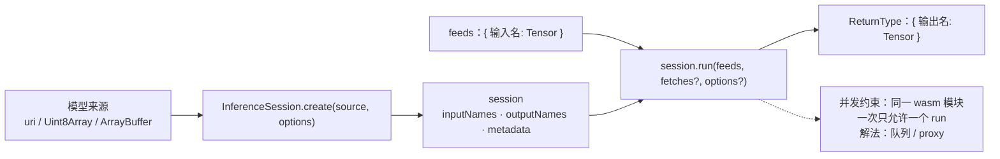

import { Canvas, Controls, Meta } from '@storybook/addon-docs/blocks';
import * as InferenceSessionCourse from './inference-session.stories';

<Meta of={InferenceSessionCourse} name="Docs" />

# InferenceSession

会话是模型在内存里的可运行实例：`InferenceSession.create` 把模型字节解析成计算图并按执行后端完成初始化，之后每次推理都是对同一个会话的 `run` 调用。[第一次推理](?path=/docs/first-inference--docs)课程用过它最简单的形态，本课把它讲全——这也是后续所有课程反复使用的对象。

先建立贯穿全课的三个判断：

- **create 是重操作，run 是唯一高频操作。** 下载、解析、初始化都发生在 create 这一步（毫秒到秒级）；应用里会话只创建一次，交互事件里只调 run。
- **签名以会话为唯一权威。** `session.inputNames` / `outputNames` / `inputMetadata` / `outputMetadata` 是 feeds 与 fetches 的键名和形状来源，硬编码名字是 `invalid input` 报错的第一来源。
- **run 一次只允许一个在飞。** 默认入口的 wasm 运行时对并发 run 有单飞保护：一批并发调用会互相破坏、整批失败，不是排队。并发要自己在应用层串行化。



| 成员 | 用途 / 默认值 / 回查要点 |
| --- | --- |
| `InferenceSession.create(source, options?)` | 异步返回 `Promise<InferenceSession>`；source 为 URL 字符串、Uint8Array 或 ArrayBuffer（可带 `byteOffset` / `byteLength`） |
| `session.run(feeds, fetches?, options?)` | 一个方法四种形态；返回按输出名索引的 map；第二参数是对象时按「是否有键等于输出名」判定 fetches / RunOptions |
| `session.inputNames` / `outputNames` | `readonly string[]`；feeds 与 fetches 的键名唯一来源 |
| `session.inputMetadata` / `outputMetadata` | `{ name, isTensor, type?, shape? }`；`shape` 元素可为符号维度字符串 |
| `session.release()` | 释放会话与底层资源；释放时机见[内存管理](?path=/docs/memory-management--docs)课程 |
| `graphOptimizationLevel` | 默认 `'all'`（1.30.0 实测）；`'disabled' \| 'basic' \| 'extended' \| 'layout' \| 'all'` |
| `executionMode` | 默认 `'sequential'`（实测）；是图内调度模式，与「run 能否并发」无关 |
| `RunOptions.logSeverityLevel` | 默认 `2`（warning，实测）；`0`–`4`，仅 wasm 后端 |

## 快速上手

以下代码在浏览器页面里执行（Vite 项目或 `<script type="module">`），顶层 `await` 直接可用；env 配置与模型下载的完整说明见[第一次推理](?path=/docs/first-inference--docs)与[获取模型](?path=/docs/getting-models--docs)课程：

```ts
import { env, InferenceSession, Tensor } from 'onnxruntime-web';

// wasm 资源与安装版本配套，必须在第一个会话创建前设置
env.wasm.wasmPaths = 'https://cdn.jsdelivr.net/npm/onnxruntime-web@1.30.0/dist/';
env.wasm.numThreads = 1; // 无跨域隔离响应头时保持单线程

// 约 26KB 的 MNIST 模型（Git LFS 走 media 端点）
const MODEL_URL =
  'https://media.githubusercontent.com/media/onnx/models/main/validated/vision/classification/mnist/model/mnist-8.onnx';

const session = await InferenceSession.create(MODEL_URL, {
  executionProviders: ['wasm'],
  graphOptimizationLevel: 'all', // 默认值，显式写出便于对照
});

// feeds：键逐字等于 inputNames 里的输入名
const feeds = {
  [session.inputNames[0]]: new Tensor('float32', new Float32Array(784), [1, 1, 28, 28]),
};

// fetches + RunOptions：只取需要的输出，并给这次 run 打 tag
const outputs = await session.run(feeds, [session.outputNames[0]], { tag: 'demo' });
```

## 创建会话

`create` 的第一个参数决定模型字节怎么进来。三种来源覆盖全部场景：

| 来源 | 形态 | 适用 |
| --- | --- | --- |
| URL | `create(uri, options?)` | 最常见；ort 内部 fetch，无自定义请求头与缓存策略 |
| 已读入内存的字节 | `create(bytes: Uint8Array, options?)` | 自己控制下载、重试与缓存（如 IndexedDB 缓存模型）后传入 |
| 缓冲区切片 | `create(buffer, byteOffset, byteLength?, options?)` | 模型嵌在更大的 ArrayBuffer 里时切出一段 |

创建是异步重操作，依次发生三件事：取到模型字节 → 解析 ONNX protobuf → 按执行后端初始化。任何一步失败都在 Promise 的 reject 阶段抛出。选项在 create 阶段就完成校验，写错取值不用等 run：

```ts
// 1.30.0 实测：非法取值在创建阶段直接抛出
await InferenceSession.create(MODEL_URL, {
  executionProviders: ['wasm'],
  graphOptimizationLevel: 'bogus',
}); // Error: unsupported graph optimization level: bogus
```

成功后返回的会话可以无限次复用，直到调用 `session.release()`。会话生命周期与大模型的分阶段加载见[内存管理](?path=/docs/memory-management--docs)课程。

### 会话选项：SessionOptions

`options` 是一个扁平对象，成员很多，但 web 下真正生效的只有一部分。下表按用途分组，「范围」列标注 1.30.0 的实际生效面：

| 选项 | 取值与作用 | 范围 / 备注 |
| --- | --- | --- |
| `executionProviders` | 后端列表，如 `['wasm']`、`['webgpu', 'wasm']` | 顺序与回退规则见[后端选择与回退](?path=/docs/backend-selection--docs)课程 |
| `graphOptimizationLevel` | 图优化级别，默认 `'all'` | wasm 与 Node/RN |
| `executionMode` | `'sequential'`（默认）/ `'parallel'`，图内算子调度 | wasm 与 Node/RN；不是 run 之间的并发开关 |
| `enableCpuMemArena` / `enableMemPattern` | CPU 内存池与内存模式开关 | wasm 与 Node/RN；排查内存时才调整 |
| `freeDimensionOverrides` | 把符号维度固定为具体值，如 `{ batch: 1 }` | wasm 与 Node/RN；配合符号维度模型使用 |
| `logId` / `logSeverityLevel` / `logVerbosityLevel` | 日志标识与级别；`logSeverityLevel` 默认 2 | wasm 侧日志，与 `ort.env.logLevel`（JS 侧）分工见 [ort.env 全局配置](?path=/docs/ort-env--docs)课程 |
| `extra` | 直通 C 配置键，如 `{ session: { set_denormal_as_zero: '1' } }` | wasm |
| `externalData` | 外部权重文件列表，权重与计算图分离的模型用 | 见[浏览器跑大模型](?path=/docs/llm-in-browser--docs)课程 |
| `preferredOutputLocation` | 输出留在 GPU（`'gpu-buffer'` / `'ml-tensor'`） | 仅 WebGL / WebGPU EP，见 [WebGPU 后端](?path=/docs/backend-webgpu--docs)课程 |
| `enableGraphCapture` | 首次 run 后重放 GPU 命令，静态形状模型的 CPU 提交优化 | 仅 WebGPU EP，见 WebGPU 后端课程 |
| `optimizedModelFilePath` | 浏览器里弹出新标签页下载优化后的模型 blob | 调试用，且需要开启对应开关的专用构建 |
| `intraOpNumThreads` / `interOpNumThreads` | 算子线程数 | 仅 Node/RN 生效；web 用 `env.wasm.numThreads` |
| `enableProfiling` / `profileFilePrefix` | 类型里标注为未来使用的占位 | 未实现，不要依赖 |

## 输入输出名与元数据

会话创建完成后，模型签名就从会话属性读出。以下为 1.30.0 加载 mnist-8 的实测值：

```ts
session.inputNames; // ['Input3']
session.outputNames; // ['Plus214_Output_0']
session.inputMetadata[0];
// { name: 'Input3', isTensor: true, type: 'float32', shape: [1, 1, 28, 28] }
session.outputMetadata[0];
// { name: 'Plus214_Output_0', isTensor: true, type: 'float32', shape: [1, 10] }
```

这些属性各自回答一个问题：

- **`inputNames` / `outputNames`**：feeds 的键、fetches 的合法取值，以它们为准。不同框架导出的输入名差异很大（`Input3`、`images`、`x` 都常见），照抄教程不如打印一次。
- **`inputMetadata` / `outputMetadata`**：每个输入输出的 `ValueMetadata`——`name`、`isTensor`；张量值还有 `type` 与 `shape`。`shape` 的元素是数字，或**符号维度的字符串**（如 `'batch'`），动态形状模型靠它识别哪个维度可变，再用 `freeDimensionOverrides` 固定。
- **`isTensor: false`** 的成员是少数非张量输入输出（如字符串），没有 `type` / `shape` 字段，读取时先判 `isTensor`。

签名元数据是写「通用推理封装」的原料：预处理按 `inputMetadata[0].shape` 对齐、校验按 `type` 选 TypedArray，换模型只换配置不改代码（[图像与 Tensor 互转](?path=/docs/tensor-image--docs)课程的转换链就从签名出发）。

## run：feeds 与 fetches

`run` 的完整签名是 `run(feeds, fetches?, options?)`，四种调用形态共用一个方法：

```ts
session.run(feeds);                        // 全部输出 + 无 run 选项
session.run(feeds, fetches);               // 指定输出
session.run(feeds, fetches, options);      // 指定输出 + run 选项
session.run(feeds, options);               // 全部输出 + run 选项
```

**feeds 的规则只有三条，违反的报错都实测过：**

```ts
// 1. 键缺失：每个 inputNames 里的名字都必须出现
session.run({});
// Error: input 'Input3' is missing in 'feeds'.

// 2. 键多余：多余的键不会被静默忽略
session.run({ Input3: tensor, wrong: tensor });
// Error: invalid input 'wrong'

// 3. 值必须是 Tensor（或字符串张量数组），普通数组不行
session.run({ Input3: [1, 2, 3] });
// Error: invalid data location: undefined for input "Input3"
```

**fetches 决定返回什么。** 省略时返回模型定义的全部输出；指定时只返回列出的输出：

```ts
// 名字数组——数组不能为空，名字必须合法（立即校验，run 不执行）
const one = await session.run(feeds, [session.outputNames[0]]);
session.run(feeds, []);
// TypeError: 'fetches' cannot be an empty array.
session.run(feeds, ['not_an_output']);
// RangeError: 'fetches' contains invalid output name: not_an_output.

// 预分配对象——键为输出名，值为预分配 Tensor 或 null
const pre = new Tensor('float32', new Float32Array(10), [1, 10]);
const out = await session.run(feeds, { [session.outputNames[0]]: pre });
out[session.outputNames[0]] === pre; // true——结果写进这块缓冲，不再新分配
```

预分配对象里传 `null` 等于让运行时分配，与数组形态等价；传 Tensor 则复用缓冲。两种形态的返回 map 都只含请求的输出名。

**第二参数是对象时有判定规则**：ort 检查对象的自有键里是否有任一个等于输出名——有就当 fetches（值为 `Tensor` 或 `null`），没有就整体当 RunOptions。`{ tag: 'x' }` 因此是 RunOptions，`{ [输出名]: tensor }` 是 fetches；判定结果与意图不符时，把参数挪到第三位并留空第二位。

下方实例对同一份全零输入逐形态真实执行 run：

<Canvas of={InferenceSessionCourse.Fetches} />
<Controls of={InferenceSessionCourse.Fetches} />

| 读者操作 | 可观察证据 |
| --- | --- |
| 切换「fetches 形态」 | 左侧高亮切换，右侧「返回的键」「输出 dims」随之更新 |
| 切到「预分配对象」 | 「预分配缓冲被复用」读数为「是（=== 同一引用）」——返回的张量就是传入的那个 |
| 切到「非法名字数组」 | run 未执行即被拒绝，面板显示 RangeError 原文 |
| 打开 Show code | 看到该 Canvas 实际执行的 `run-fetches.ts` |

fetches 的价值在多输出模型上最明显：检测类模型常有两三个输出，只需要其中一部分时用名字数组，未请求的输出不会出现在返回 map 里，也省掉从 wasm 内存拷出的开销；输出很大（高分辨率 mask 一类）时，预分配对象还能避免每次 run 重新分配缓冲。

## RunOptions 与并发

`RunOptions` 管的是「这一次 run」的行为，与会话级选项相互独立：

| 字段 | 作用 | 范围 |
| --- | --- | --- |
| `logSeverityLevel` | `0`–`4`，默认 `2`（warning） | wasm 后端 |
| `logVerbosityLevel` | 更细的日志详细度 | wasm 后端 |
| `tag` | 给这次 run 打标签 | wasm 后端 |
| `terminate` | 为 `true` 时尽快终止所有未完成的 OrtRun | 仅 wasm 后端 |
| `extra` | 直通 C 的 run 配置键，如 `memory.enable_memory_arena_shrinkage` | wasm 后端 |

`run` 返回 Promise，但**这不是并发许可**。默认入口（`onnxruntime-web`，含 WebGPU/WebNN 能力的 JSEP 构建）的 wasm 运行时同一时刻只允许一个 run 在飞，1.30.0 实测行为：

- 前一个 run 未结束就发起下一个，新调用立即抛 `Error: Session already started`——**不是排队等待**；
- 被拒调用会清掉在途标记，让在飞的那个 run 以 `Error: Session mismatch` 收场；乘虚而入的更后续调用同样以 `Session mismatch` 告终。实测同一批 5 个连发，**5 个全部失败**，两种错误交替出现；
- 多开几个会话也躲不开：保护记在 wasm 模块上而不是单个会话上，实测两个会话并发 run 时两个都失败。

解法是把推理调用串行化。一条 promise 队列就够：

```ts
let tail: Promise<unknown> = Promise.resolve();

function runQueued<T>(task: () => Promise<T>): Promise<T> {
  const result = tail.then(task);
  tail = result.then(() => undefined, () => undefined); // 失败不阻断后续
  return result;
}

// 所有交互事件里的推理都走同一条队列
const outputs = await runQueued(() => session.run(feeds));
```

另一个天然串行的选项是 `env.wasm.proxy = true`：推理移入 worker，消息逐条处理，调用天然排队——代价与部署形态见 [proxy 工作线程](?path=/docs/proxy-worker--docs)课程。

下方实例两条路径都真实运行，时间轴按每条 run 的实际起止时间绘制：

<Canvas of={InferenceSessionCourse.Concurrency} />
<Controls of={InferenceSessionCourse.Concurrency} />

| 读者操作 | 可观察证据 |
| --- | --- |
| 打开实例 | 自动跑一轮「队列串行」：5 个蓝条错峰排列，全部成功 |
| 把「触发方式」切到「同时并发」再点击画布 | 5 个 run 同时发出、全部失败：时间轴整排红条，读数交替给出 `Session already started` / `Session mismatch` |
| 切回「队列串行」再点击 | 恢复 5 个全部成功，耗时为 5 次推理之和 |
| 打开 Show code | 看到该 Canvas 实际执行的 `run-concurrency.ts`，含 fireRound 的两条发起路径 |

## 最佳实践

- **推理调用只走一条队列。** 并发触发在所难免——鼠标事件、滑杆拖动、批量请求都可能在一个事件循环里发出多个 run。把「调 run」收口到一个 `runQueued` 函数，竞态整体消失；出现 `Session already started` 就说明有调用绕过了队列。
- **多输出模型显式给 fetches。** 全部输出都 `run(feeds)` 是原型期的写法；明确只需要哪些输出后改用名字数组，模型大、输出多时再升级为预分配对象。三档按需选用，返回 map 里只会出现请求的输出。
- **签名校验写一次，到处复用。** 用 `inputMetadata` / `outputMetadata` 写通用的 feeds 组装与形状校验，键名永远取自 `inputNames`。名字硬编码散落在事件处理器里，是 `invalid input` 与 `missing in 'feeds'` 报错的常见来源。

## 常见问题

- 控制台出现 `Session already started`，有时还伴随 `Session mismatch`。
  把同一页面上的 run 调用串行化：promise 队列（见 RunOptions 与并发节）或 `env.wasm.proxy`。前一次 run 未结束就发起下一次会触发 ort 的单飞保护；多开几个会话无效——保护记在 wasm 模块上，实测两个会话并发 run 两个都失败。
- 给 run 的第二个参数传了 RunOptions 对象，却没生效（或预分配输出没被复用）。
  第二参数是对象时，ort 按「自有键中是否有任一个等于输出名」判定它是 fetches 还是 RunOptions，判定结果可能与意图相反。把参数挪到明确的位置：`run(feeds, [输出名], options)` 或 `run(feeds, { [输出名]: tensor }, options)`。
- run 报 `input 'Input3' is missing in 'feeds'`，但代码里确实传了键。
  键名必须逐字等于 `session.inputNames` 里的名字，多传的键也不会被忽略（报 `invalid input 'wrong'`）。打印 inputNames 核对，不要照抄教程里的名字。
- 设置了 `intraOpNumThreads: 4`，推理线程数没有变化。
  这两个选项只在 onnxruntime-node / onnxruntime-react-native 生效；web 上的线程数由 `env.wasm.numThreads` 控制，且必须在第一个会话创建前设置（见 [ort.env 全局配置](?path=/docs/ort-env--docs)课程）。

## 总结回顾

摘要：

本课把会话当成「一次创建、高频 run、签名可查」的长生命周期对象。create 接受 URL、Uint8Array、ArrayBuffer 切片三种模型来源，下载、解析、后端初始化与选项校验都在这一步完成，选项里 web 真正生效的是后端列表、图优化级别（默认 `'all'`）、执行模式（默认 `'sequential'`）、维度固定、日志与外部权重等十几项。创建完成后输入输出名与元数据（含符号维度）从会话属性读出，是 feeds 键名与形状校验的唯一权威。run 的四种调用形态里，feeds 要求键逐字等于输入名、值必须是 Tensor；fetches 用名字数组或预分配对象控制返回哪些输出、写进哪块缓冲，第二参数为对象时按「有无输出名键」判定 fetches 或 RunOptions；RunOptions 管单次 run 的日志与终止。并发方面，默认入口的 wasm 运行时强制一次一个 run，一批并发调用会互相破坏、整批失败，多开会话也绕不开——应用层用 promise 队列串行化，或改用 proxy 让 worker 消息天然排队。

一句话：

> InferenceSession 的正确用法是「create 一次、签名从会话读、run 走队列」：feeds 的键来自 inputNames，fetches 决定返回什么，RunOptions 只管这一次 run，而同一个 wasm 模块一次只允许一个 run 在飞。

知识要点：

- create 接受哪几种模型来源？哪些会话选项在 web 上生效、默认值是什么？
- feeds 的键名与取值规则是什么？缺名、多名、值不是 Tensor 分别报什么错？
- fetches 有哪三种形态？第二参数是对象时 ort 怎样判定 fetches 与 RunOptions？
- 预分配输出张量怎样确认被复用？对大输出模型有什么好处？
- 同一会话（乃至多个会话）并发 run 会发生什么？正确的串行化方法是什么？
- 符号维度怎么从 inputMetadata 识别、用哪个选项固定？

## 参考资料

- [Get started with ONNX Runtime Web](https://onnxruntime.ai/docs/get-started/with-javascript/web.html) —— 官方 Web 教程入口，InferenceSession 基础用法与官方示例的索引
- [env 标志与会话选项（Web 教程）](https://onnxruntime.ai/docs/tutorials/web/env-flags-and-session-options.html) —— executionProviders、freeDimensionOverrides、preferredOutputLocation、enableGraphCapture 等会话选项的官方说明
- [onnxruntime-web API 参考](https://onnxruntime.ai/docs/api/js/index.html) —— SessionOptions、RunOptions、ValueMetadata 与 run 重载签名的类型依据
- [microsoft/onnxruntime 仓库 js 目录](https://github.com/microsoft/onnxruntime/tree/main/js) —— 1.30.0 选项默认值与并发单飞保护实现的一手依据，本课实测结论的来源
