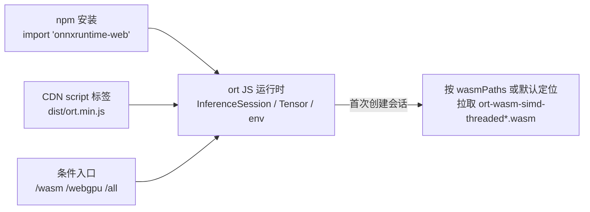

import { Canvas, Controls, Meta } from '@storybook/addon-docs/blocks';
import * as Installation from './installation.stories';

<Meta of={Installation} name="Docs" />

# 安装与导入

本课把 onnxruntime-web 接进浏览器工程：选择接入方式、确定导入入口，并补齐 import 之后、第一次推理之前还缺的一件事——wasm 工件路径。读完本课，你应当能预测：写了 `import * as ort from 'onnxruntime-web'` 之后 JS 从哪来、首次运行时还会发生什么、怎么确认装的就是你以为的版本。

三个贯穿全课的事实：

- **殊途同归。** 无论 npm、CDN 还是 script 标签，最终都得到同一个 `ort` 命名空间（`InferenceSession`、`Tensor`、`env`）。
- **JS 与工件是两份资源。** import 只加载 JS；`.wasm` 工件在首次创建会话时才被拉取，且必须与 JS 同版本。
- **入口决定后端组合。** `onnxruntime-web/webgpu`、`onnxruntime-web/wasm` 等条件导入入口打包了不同的功能组合，体积与可用后端都不同。



| 接入方式 | 写法 | 适用 |
| --- | --- | --- |
| npm + import | `import * as ort from 'onnxruntime-web'` | Vite 等打包器工程（本工作区） |
| CDN script 标签 | `<script src="…/dist/ort.min.js"></script>` | 无构建页面、快速原型 |
| CDN ESM import | `import * as ort from '…/dist/ort.bundle.min.mjs'` | 无构建但想用 ESM 的页面 |

## 快速上手

工作区已通过 npm 安装 onnxruntime-web@1.30.0（见根目录 package.json）。最小闭环是三步：导入 → 读运行时版本 → 与安装版本对齐。

```ts
import * as ort from 'onnxruntime-web';

console.log(ort.env.versions.web); // "1.30.0"，应与 package.json 中的版本一致
```

下方实例真实执行了这个自检：它按默认入口导入已安装的包，读取版本并检测当前浏览器的 WebGPU 与跨域隔离状态；刻意不创建会话、不下载 wasm 工件。

<Canvas of={Installation.EnvCheck} />
<Controls of={Installation.EnvCheck} />

| 读者操作 | 可观察证据 |
| --- | --- |
| 读取「运行时版本」读数 | 显示 `ort.env.versions.web` 的真实值 1.30.0，与安装版本一致 |
| 把「期望版本」改成其他号 | 「版本对齐」读数立即变为不一致（红色） |
| 查看 WebGPU / 跨域隔离 / 逻辑核数 | 显示当前浏览器的真实状态，因浏览器而异 |

后三项读数没有"标准答案"——它们本来就是环境探测，换成 Firefox、Safari 或带启动标志的 Chromium 会得到不同结果，这正是探测的意义。

## 三种接入方式

三种方式只回答一个问题：**JS 载体从哪来、版本由谁锁定。** 选定之后运行时行为完全一致；后端组合则由导入入口决定，见「条件导入」。

### npm 安装与 import

打包器工程的首选：版本交给 lockfile 锁定，import 经打包器解析。

```bash
npm install onnxruntime-web@1.30.0   # 锁定本手册基线版本
npm install onnxruntime-web          # 最新稳定版
npm install onnxruntime-web@dev      # nightly，不保证稳定
```

```ts
import * as ort from 'onnxruntime-web';
// ort.InferenceSession、ort.Tensor、ort.env 全部可用
```

要点：

- 浏览器 ESM 下，包的 exports 把 `onnxruntime-web` 解析到 `dist/ort.bundle.min.mjs`——一个内嵌了工件加载器的完整构建，运行时只需再取 `.wasm`。
- 同一个包在 Node.js 下会解析到另一份产物 `dist/ort.node.min.js`，那条分支见 onnxruntime-node 课程（5.1），本课只面向浏览器。
- `@dev` nightly 通过 `onnxruntime-web@dev` 安装；用它时工件也必须来自同一 nightly 构建（见「wasm 工件路径」）。

### CDN 与 script 标签

无构建页面（CodePen、静态 HTML、快速原型）用 script 标签加载 IIFE 产物，得到全局变量 `ort`：

```html
<script src="https://cdn.jsdelivr.net/npm/onnxruntime-web@1.30.0/dist/ort.min.js"></script>
<script>
  console.log(ort.env.versions.web); // "1.30.0"
</script>
```

要点：

- **URL 里锁定版本号。** 去掉 `@1.30.0` 会拿到最新版，日后工件版本可能与你的页面预期错开。
- **工件自动同目录解析。** script 方式下 ort 会从 script 的 URL 推断 `.wasm` 工件位置，jsDelivr 的 dist 目录恰好包含全部工件，因此开箱即用；自托管时把 dist 下的工件与 `ort.min.js` 放在一起即可。
- **换文件名即换组合。** 把 URL 里的 `ort.min.js` 换成 `ort.wasm.min.js`、`ort.webgpu.min.js`、`ort.all.min.js` 等，等价于 npm 侧换条件导入入口（对照见下一节表格）。
- **裸 ESM 页面** 用 `dist/ort.bundle.min.mjs`（内嵌工件加载器，只需再取 `.wasm`）：

```js
import * as ort from 'https://cdn.jsdelivr.net/npm/onnxruntime-web@1.30.0/dist/ort.bundle.min.mjs';
```

### 条件导入：按后端选入口

npm 包为不同功能组合提供子路径入口；script 标签则用 dist 里同名的 IIFE 文件。一个应用应当只使用其中一个入口。下表是 onnxruntime-web@1.30.0 的实测组合（体积为 1.30.0 dist 的 `.wasm` 工件大小）：

| npm 入口 | script 标签对应文件 | 组合 | 工件体积 |
| --- | --- | --- | --- |
| `onnxruntime-web` | `ort.min.js` | wasm 后端；JSEP 工件内含 WebGPU/WebNN 原生 EP | 约 27 MB |
| `onnxruntime-web/all` | `ort.all.min.js` | 默认组合再加 WebGL 后端 | 约 27 MB |
| `onnxruntime-web/wasm` | `ort.wasm.min.js` | 仅 wasm 后端，不能请求 WebGPU/WebNN | 约 13.6 MB |
| `onnxruntime-web/webgpu` | `ort.webgpu.min.js` | WebGPU 入口（Asyncify 工件） | 约 25.5 MB |
| `onnxruntime-web/webgl` | `ort.webgl.min.js` | WebGL 后端（维护模式） | 纯 JS 构建 |
| `onnxruntime-web/jspi` | `ort.jspi.min.js` | JSPI 实验特性 | 约 16 MB |

**WebGPU 的推荐入口**是 `onnxruntime-web/webgpu`（官方 Get started 口径）。使用前按能力检测决定是否请求该后端，WebGPU 本身有浏览器版本要求（Windows 需 Chromium 113+，Float16 需 121+）：

```ts
import * as ort from 'onnxruntime-web/webgpu';

const webgpuAvailable =
  'gpu' in navigator && (await navigator.gpu.requestAdapter()) !== null;
```

**WebNN 与旧入口 `onnxruntime-web/experimental`。** 旧版教程（包括当前官方 Get started 页）让 WebNN 走 `onnxruntime-web/experimental` 子路径；1.30.0 的包里已没有该导出，照写会让打包器直接报 import 解析失败。在 1.30.0 中，WebNN 属于默认入口的 JSEP 工件，运行环境与请求方式的后端选择策略见「后端选择与回退」（2.3.3）；它的平台限制（目前仅 Windows Chromium 且需启动标志）也一并记录在那里。

## wasm 工件路径

import 成功只说明 JS 就绪。首次调用 `InferenceSession.create` 时，ort 才去拉 `ort-wasm-simd-threaded*.wasm`（以及非 bundle 变体的 `.mjs` 加载器）——这是新手最常踩的"装好了却跑不起来"的来源。

`.wasm` 从哪来有一条默认定位规则：script 标签方式从 script URL 同目录推断；打包器方式通常推断不出可靠位置。所以打包器工程要显式设置 `ort.env.wasm.wasmPaths`：

```ts
import * as ort from 'onnxruntime-web';

ort.env.wasm.wasmPaths = 'https://cdn.jsdelivr.net/npm/onnxruntime-web@1.30.0/dist/';
```

规则与边界：

- **前缀必须与 JS 同版本**，指向 `onnxruntime-web@<同一版本号>/dist/`。JS 与工件版本错配是 wasm 初始化失败的头号原因。
- 也可以用对象形式分别指定 `{ wasm, mjs }` 两个 URL；自托管时把 dist 下的工件复制到自己站点并指向前缀即可，伺服与 Vite 打包细节见「WASM 资源伺服」（3.1.1）。
- 本工作区的课程实例约定：凡真跑 ort 的实例都显式设置该 CDN 前缀，并且只用单线程 wasm——工作区没有跨域隔离响应头，多线程会在运行时被强制回落为 1 并告警，开启条件见「多线程与跨域隔离」（3.1.2）。
- `wasmPaths` 只解决"从哪下载"；线程数、SIMD、proxy 等其余 `ort.env` 标志见「ort.env 全局配置」（2.2.2）。

## 最佳实践

- **版本三处对齐。** lockfile 里的包版本、`wasmPaths` 指向的 CDN 版本、运行时 `ort.env.versions.web` 的自检读数——升级时三处一起改，实例里的自检代码可以直接复用。
- **一个应用只用一个入口。** 同时 npm import 与 script 标签会加载两份 ort 副本，各自的 `env` 配置与后端注册互不相通，会出现"设置了却不生效"类难排查现象。切换入口时替换全部 import 或 script，而不是并存。
- **生产锁稳定版，实验跟 @dev。** nightly 用于跟进 WebGPU/WebNN 等演进特性，但工件必须与 JS 同一构建；生产工程锁定 `1.30.x` 这类稳定版本。

## 常见问题

- 按旧教程写 `import * as ort from 'onnxruntime-web/experimental'`，构建报 import 解析失败。
  该子路径在 1.30.0 已不存在。WebGPU 改用 `onnxruntime-web/webgpu`；WebNN 用默认入口请求 `webnn` 后端（策略与平台限制见 2.3.3）。
- import 正常，但创建会话时报 wasm 加载或后端初始化失败。
  先检查 `ort.env.wasm.wasmPaths` 是否已设置、指向的版本是否与 JS 一致；打包器工程不要依赖默认定位。仍失败时按「常见报错排查」（3.3.2）定位。
- 页面里 CDN script 与 npm 包并存，`ort.env` 的设置时灵时不灵。
  这是两份副本各自持有配置与注册所致。删除其中一个来源，保留单一入口。

## 总结回顾

摘要：

本课围绕"把 onnxruntime-web 接进工程"给出三条路径：npm + import 交给打包器与 lockfile，CDN script 标签服务无构建页面并获得开箱即用的工件定位，裸 ESM 页面使用 bundle 变体。入口决定后端组合与工件体积：默认入口是含 WebGPU/WebNN 原生 EP 的 JSEP 工件，`/wasm` 最小，`/webgpu` 承载 WebGPU，`/all` 叠加维护模式的 WebGL；旧入口 `onnxruntime-web/experimental` 已在 1.30.0 移除。import 只加载 JS，`.wasm` 工件在首次创建会话时才拉取，打包器工程必须用 `ort.env.wasm.wasmPaths` 指向同版本的 dist 目录，并用 `ort.env.versions.web` 在运行时自检对齐。

一句话：

> 接入方式锁定 JS 载体，条件导入锁定后端组合，wasmPaths 锁定工件版本——三者同源同版本，才算真正装好。

知识要点：

- npm、CDN script 标签、CDN ESM 三种接入各自适用什么场景？
- `onnxruntime-web`、`/wasm`、`/webgpu`、`/all` 四个入口的组合与工件体积差别是什么？
- 为什么 import 成功后仍可能运行失败？`ort.env.wasm.wasmPaths` 应指向哪里？
- 如何在运行时确认版本对齐、WebGPU 可用性与多线程条件？
- `onnxruntime-web/experimental` 在 1.30.0 中的正确替代是什么？

## 参考资料

- [Get started with ONNX Runtime Web（官方）](https://onnxruntime.ai/docs/get-started/with-javascript/web.html) —— npm 安装命令与默认、WebGPU、WebNN 导入语句的一手依据
- [Conditional importing：importing_onnxruntime-web（官方示例仓库）](https://github.com/microsoft/onnxruntime-inference-examples/tree/main/js/importing_onnxruntime-web) —— 入口与 dist 文件名对照的官方表；注意其 WebNN 行仍写旧入口 `experimental`，未随 1.30 更新
- [microsoft/onnxruntime 仓库 js/web README](https://github.com/microsoft/onnxruntime/tree/main/js/web) —— 各后端浏览器兼容矩阵与 WebGPU/WebNN 版本、启动标志要求
- [onnxruntime-web npm 发布页](https://www.npmjs.com/package/onnxruntime-web) —— 稳定版与 `@dev` nightly 的版本记录
- [onnxruntime-web API 参考（官方）](https://onnxruntime.ai/docs/api/js/index.html) —— `ort.env.versions`、`ort.env.wasm.wasmPaths` 的类型与默认值
