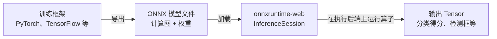
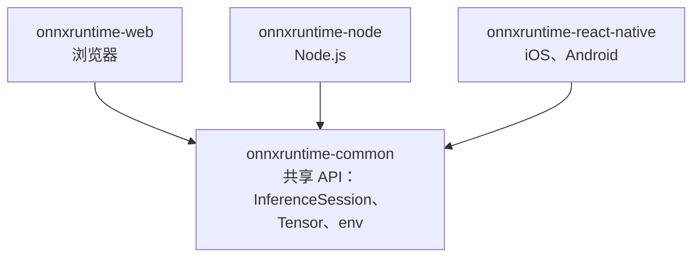

import { Meta } from '@storybook/addon-docs/blocks';

<Meta id="introduction" title="上手/认识 ONNX Runtime Web" name="Docs" />

# 认识 ONNX Runtime Web

在写下第一行推理代码之前，先建立三个能预测结果的判断：ONNX 文件里装的是什么，为什么把它放进浏览器执行，以及 onnxruntime 系列的四个 npm 包各自管什么。建立这三个判断后，任何「浏览器跑模型」的页面都能还原成同一条通路：模型文件 → InferenceSession → 执行后端 → 输出 Tensor——这正是后续课程反复出现的骨架。



三个最容易混的名词，先用一句话定位：

| 名词 | 一句话定位 |
| --- | --- |
| ONNX | 描述模型计算图与权重的开放文件格式（`.onnx`），只定义「模型长什么样」 |
| ONNX Runtime Web | 加载并执行 `.onnx` 模型的浏览器推理运行时，本手册主题，负责「让模型跑起来」 |
| onnxruntime-common | 各平台包共享的纯 JavaScript API 层，不单独安装使用 |

## ONNX 是什么

ONNX（Open Neural Network Exchange）标准化了两件事：一组标准算子（卷积、矩阵乘、注意力等图节点）和一个自包含的文件格式。训练好的模型导出为 `.onnx` 后，前向计算图和权重全部装在这一个文件里。

它解决的问题是把训练和推理解耦。一个具体例子：用 PyTorch 训练的图像分类模型导出为 `model.onnx`，此后执行它不再需要 PyTorch——浏览器里的 onnxruntime-web、服务器上的 ONNX Runtime、移动端运行时，任何支持 ONNX 的执行方都能加载同一个文件。换框架、换硬件都不必重训或重写模型。

反过来说清边界：ONNX 只是格式，它自己不能执行任何计算，也不描述训练过程——导出的推理图里只有前向计算。执行能力来自运行时（下一节的 ONNX Runtime Web），训练能力留在训练框架里。

## 为什么在浏览器里推理

以「浏览器里对摄像头画面做实时分类」为例，把推理放在浏览器端直接换来四件事：

- **隐私：** 视频帧不必离开用户设备。
- **时延与离线：** 没有服务器往返，断网也能继续推理。
- **零安装、跨平台：** 打开一个 URL 即用，桌面与移动浏览器共享同一份代码。
- **省服务器算力：** 计算发生在用户设备上，服务成本不随用户数线性增长。

代价同样明确，它们决定了什么场景不适合：

- 模型和运行时都要先下载到端侧，模型体积直接变成首屏负担。
- 端侧算力弱于服务器，大模型、长序列生成类任务仍然偏服务端。
- 算子能否执行取决于所选执行后端的能力（见下节）。

判断口径：小模型、多用户、数据敏感的场景，浏览器推理优势明显；反之把推理留在服务端。

## 执行后端

onnxruntime-web 执行一个模型时涉及三个角色：

- **InferenceSession：** 加载并解析 `.onnx` 文件，持有编译好的模型，创建后可以反复执行。
- **执行提供程序（execution provider，EP）：** 决定图里的算子真正落在什么硬件上执行。
- **Tensor：** 输入和输出的统一载体，进出的都是张量。

EP 就是本手册说的「执行后端」。onnxruntime-web 提供四个后端，能力与边界各不相同：

| 执行提供程序 | 执行位置 | 状态与关键边界 |
| --- | --- | --- |
| `wasm` | CPU（WebAssembly） | 兼容性基线；覆盖全部 ai.onnx 与 ai.onnx.ml 算子；Node.js 里只有单线程形态 |
| `webgpu` | GPU | 主力 GPU 后端；算子覆盖是子集；Windows 需 Chromium 113+（Float16 需 121+） |
| `webgl` | GPU | 维护模式，官方建议新项目改用 WebGPU |
| `webnn` | 设备原生 AI 加速 | 实验性；仅 Windows Chromium，且需浏览器启动标志 |

上表是最容易回查的一张对照：选后端先看「能不能用」（浏览器与版本），再看「算子全不全」（wasm 全覆盖，GPU 后端是子集）。各后端的启用方式、回退行为与性能取舍由「执行后端」阶段的课程逐一展开；版本演进以 js/web README 的兼容矩阵为准。

## 四个包的分工

npm 上的 onnxruntime 系列有四个包：三个平台包加上一个共享底座。三个平台包暴露同一套 API，因为它们都构建在 onnxruntime-common 之上——它提供 InferenceSession 接口、Tensor 类型与工具、`ort.env` 全局配置和后端注册，是纯 JavaScript，浏览器与 Node.js 都能运行。「执行能力」则由平台包各自补齐：



| npm 包 | 运行环境 | 执行方式 |
| --- | --- | --- |
| onnxruntime-web | 浏览器（Node.js 下仅单线程 wasm） | wasm / WebGPU / WebGL / WebNN |
| onnxruntime-node | Node.js | 原生 ONNX Runtime 动态库（.so / .dll / .dylib） |
| onnxruntime-react-native | iOS / Android 应用 | 平台原生库，经 Java / Objective-C 桥调用 |
| onnxruntime-common | 不单独使用 | 无执行能力，只提供共享 API 层 |

三个平台包的导入面完全一致（示意，按运行环境选其一）：

```ts
import * as ort from 'onnxruntime-web'; // 浏览器：本手册与示例工程的主线
import * as ort from 'onnxruntime-node'; // Node.js
import * as ort from 'onnxruntime-react-native'; // React Native
```

选包判断只有一条：代码跑在哪个环境，就安装哪个平台包；onnxruntime-common 会作为依赖自动装入，不需要也不应该单独安装。本手册的示例工程运行在浏览器，主线包是 onnxruntime-web；Node.js 与 React Native 的接入作为按需分支，由路线中的独立课程承载。

## 常见问题

- 想直接安装并从 `onnxruntime-common` 导入来完成推理。
  改从平台包导入。onnxruntime-common 只有接口、Tensor 工具和后端注册，没有任何可执行后端；平台包会把它连同 `ort.env` 等一起再导出，所以正常业务代码只需要 `onnxruntime-web` 这一个导入源。
- 在 Node.js 里安装 onnxruntime-web，期望得到完整的后端能力。
  得到的只有单线程 `wasm` 后端，WebGPU / WebGL / WebNN 都不可用；这是 js/web 兼容矩阵明确标注的边界。需要原生速度、多线程或直接从磁盘读模型文件时，换用 onnxruntime-node。

## 总结回顾

摘要：

ONNX 用标准算子集和自包含的 `.onnx` 文件把训练与推理解耦：模型在训练框架里导出一次，就能被任何 ONNX 运行时执行。onnxruntime-web 负责在浏览器里完成这次执行——InferenceSession 加载模型图，执行提供程序把算子落到 wasm、WebGPU、WebGL 或 WebNN 上，输入输出统一为 Tensor。npm 上四个包分工清晰：onnxruntime-common 是三个平台包共享的 API 底座，web、node、react-native 分别为浏览器、Node.js 和移动端补上执行能力；浏览器场景只需安装 onnxruntime-web。

一句话：

> ONNX 定义模型的统一表示，onnxruntime-web 让它在浏览器里执行；你只 import 一个平台包，背后是 onnxruntime-common 加具体后端的分工。

知识要点：

- `.onnx` 文件里装的是什么？它为什么能让 PyTorch 训练的模型脱离 PyTorch 运行？
- 浏览器推理换来哪些收益，需要付出哪些代价？
- 一次推理从模型文件到输出 Tensor 经过哪三个角色？
- 四个执行后端各自处于什么状态？选后端时先看什么、再看什么？
- 四个 npm 包各面向什么环境？为什么不需要单独安装 onnxruntime-common？

## 参考资料

- [ONNX 官网](https://onnx.ai/)
  ONNX 格式的定位：标准算子集与标准文件格式，以及框架互操作的目标。
- [Get started with JavaScript](https://onnxruntime.ai/docs/get-started/with-javascript/)
  三平台包（Web / Node.js / React Native）的官方选择入口与各自上手页。
- [microsoft/onnxruntime 仓库 js 目录](https://github.com/microsoft/onnxruntime/tree/main/js)
  js/common、js/web、js/node、js/react_native 四个子目录的 README，四包分工的一手依据。
- [js/web README：兼容矩阵与算子覆盖](https://github.com/microsoft/onnxruntime/tree/main/js/web)
  各后端的浏览器兼容矩阵、WebGPU 版本要求与各后端算子支持清单。
