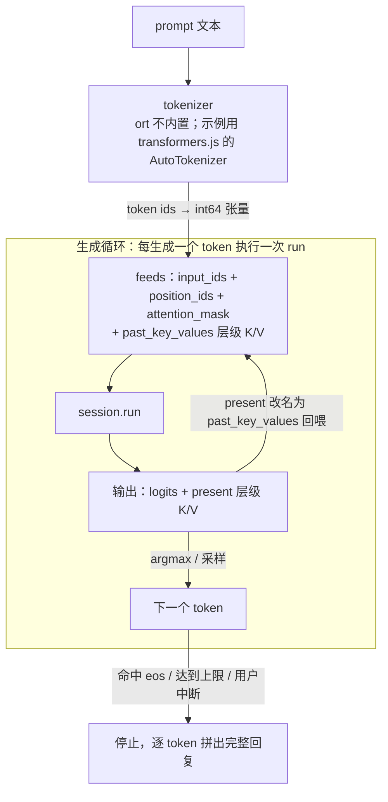

import { Canvas, Controls, Meta } from '@storybook/addon-docs/blocks';
import * as LlmInBrowser from './llm-in-browser.stories';

<Meta of={LlmInBrowser} name="Docs" />

# 浏览器跑大模型

[图像分类](?path=/docs/image-classification--docs)与[目标检测](?path=/docs/object-detection--docs)是「一次 run 出全部结果」的判别式模型；本课把同一个 `InferenceSession` 换成生成式模型，推理从一次 run 变成**逐 token 的生成循环**：每步 run 的输入由上一步的输出拼装——`logits` 经 argmax/采样选出下一个 token，KV 缓存改名回喂。运行时没有新增 API，本课的新知识都在模型签名、循环协议与资源纪律上。

全课以官方示例 [microsoft/onnxruntime-inference-examples · js/chat](https://github.com/microsoft/onnxruntime-inference-examples/tree/main/js/chat)（Phi-3-mini-4k-instruct，WebGPU）为参照架构。真实运行需要下载 GB 级权重与支持 WebGPU 的浏览器，本工作区不具备；课内两个实例是**机制示意**——打分表写死、不加载任何模型，但循环协议与官方示例同构，所有真实数字都注明来源。

看完导读你应当能预测：prefill 一步吃进整个 prompt，之后每步 `input_ids` 只有 1 个 token；每层 KV 缓存的 seq 长度每步 +1；回复是逐 token 到达的流式文本。



| 成员 | 用途 / 回查要点 |
| --- | --- |
| `input_ids` | int64 张量 `[batch, n]`；prefill 喂整个 prompt，decode 每步 1 个 token |
| `position_ids` | int64；新 token 的 0 起始位置；prefill 是 `0..n-1`，decode 只标新 token |
| `attention_mask` | int64 `[1, seq]`；长度 = KV 已缓存长度 + 本步输入长度，全 1 |
| `past_key_values.{i}.key` / `.value` | 输入：上一步的 KV 缓存；首步用 seq=0 的空张量初始化 |
| `logits` | 输出 `[batch, seq, vocab]`，float32（Web 变体保持 float32）；只取最后一个位置 |
| `present.{i}.key` / `.value` | 输出：更新后的 KV 缓存；改名为 `past_key_values.*` 回喂下一步 |
| `preferredOutputLocation` | 会话选项：按层把 `present.*` 设为 `'gpu-buffer'`，KV 缓存零拷贝驻留 GPU |
| tokenizer | ort 不内置；用模型配套分词器（示例用 transformers.js 的 AutoTokenizer） |
| `eos_token_id` | 从模型 `config.json` 读取；停止条件之一，另配 max_tokens 与用户中断 |

## 生成式模型的签名

生成式模型的输入输出由「循环」决定，与判别式模型一眼可分：

| | 判别式（4.1 / 4.2） | 生成式（本课） |
| --- | --- | --- |
| 输入 | 图像张量，一次给全 | `input_ids` 等 + `past_key_values.*`，逐 token 变化 |
| 输出 | 分类得分 / 检测框，一次拿全 | `logits` + `present.*`，每步产出 1 个 token |
| run 次数 | 1 次 | 每个生成 token 1 次 |

这些张量名不是 onnxruntime 的规定，而是模型导出时的签名约定——拿到陌生模型先用 Netron 或 `session.inputNames` / `outputNames` 核对（见[获取与检查模型](?path=/docs/getting-models--docs)）。凡按此签名导出的 decoder 类模型，都能套同一套循环。

Phi-3 的 Web 导出变体（`microsoft/Phi-3-mini-4k-instruct-onnx-web`）有三个专为浏览器做的特殊点，官方示例 README 列为第一手说明：

1. **`logits` 保持 float32**——即使是 float16 权重的模型。JS 没有半精度数值类型，保持 float32 让 JS 侧直接读数值（float16 的位模式约定见[Tensor 与数据类型](?path=/docs/tensor--docs)）。
2. **用自定义 MultiHeaded Attention 算子**替代 Grouped Query Attention——WebGPU 实现的特化导出，算子清单口径见[WebGPU 后端](?path=/docs/backend-webgpu--docs)。
3. **权重必须外置**——模型大于 2GB，`model.onnx`（计算图）与 `model.onnx_data`（权重）都切在 2GB 以下，保证能被浏览器缓存（平台上限见[内存管理](?path=/docs/memory-management--docs)）。

加载由 `config.json` 驱动：层数、KV 头数、`eos_token_id` 都从里面读。官方示例 `llm.js` 的 `load()` 关键部分（简化）：

```ts
// 简化自官方 chat 示例 llm.js：字节先经 Cache API 缓存，再交给 create
const config = JSON.parse(await fetchAndCache(`${base}/config.json`));
const modelBytes = await fetchAndCache(`${base}/onnx/model_q4f16.onnx`);
const weights = await fetchAndCache(`${base}/onnx/model_q4f16.onnx_data`);

const opt = {
  executionProviders: ['webgpu'],
  externalData: [{ data: weights, path: 'model_q4f16.onnx_data' }], // path 与 protobuf 内记录一致，不可改名
  preferredOutputLocation: {},
};
// KV 缓存按层留在 GPU：present.{i}.key/value 以 gpu-buffer 交付，下一轮回喂零拷贝
for (let i = 0; i < config.num_hidden_layers; ++i) {
  opt.preferredOutputLocation[`present.${i}.key`] = 'gpu-buffer';
  opt.preferredOutputLocation[`present.${i}.value`] = 'gpu-buffer';
}
const session = await ort.InferenceSession.create(modelBytes, opt);
```

`config.json` 还直接给出 KV 缓存的形状参数。官方示例据此算出 `kv_dims = [batch, num_key_value_heads, 0, hidden_size / num_attention_heads]`——最后一维是每步序列长度，从 0 起步。

## 分词与输入张量

onnxruntime 只吃数字张量：文本到 token id、token id 回文本，都由模型配套的 tokenizer 完成，**onnxruntime-web 没有内置 tokenizer**。官方 chat 示例借用了 transformers.js 的 `AutoTokenizer`——transformers.js 本身构建在 ort-web 之上，这里只用它的分词部分（上层库的整体取舍见[transformers.js](?path=/docs/transformers-js--docs)）：

```js
// 官方 chat 示例 main.js 的分词接入（原文摘录，有删节）
const tokenizer = await AutoTokenizer.from_pretrained('microsoft/Phi-3-mini-4k-instruct-onnx-web');

// Phi-3 的 chat template：角色标记包住用户输入，对话历史整段拼进 prompt
const prompt = `<|system|>\nYou are a friendly assistant.<|end|>\n<|user|>\n${query}<|end|>\n<|assistant|>\n`;
const { input_ids } = await tokenizer(prompt, { return_tensor: false, padding: true, truncation: true });

// 生成过程中每轮回调里流式解码：只解新增的 token，跳过特殊符号
const text = tokenizer.decode(output_tokens.slice(startIndex), { skip_special_tokens: true });
```

对话模型要求特定的提示格式（chat template），角色标记拼错会明显影响输出质量；跨轮对话把历史拼进 prompt 一起重新编码——官方示例注释里写明「续写场景复用 KV 缓存」还是 TODO，每轮问答都重建空缓存。

token id 进入循环前包成 int64 张量——`BigInt64Array` 的约定见[Tensor 与数据类型](?path=/docs/tensor--docs)。prefill 一步的三个输入张量（写法与 `llm.js` 一致）：

```ts
const inputIds = new ort.Tensor('int64', BigInt64Array.from(tokens.map(BigInt)), [1, tokens.length]);
const positionIds = new ort.Tensor(
  'int64',
  BigInt64Array.from({ length: tokens.length }, (_, i) => BigInt(i)), // 0..n-1
  [1, tokens.length],
);
const attentionMask = new ort.Tensor(
  'int64',
  BigInt64Array.from({ length: tokens.length }, () => 1n),
  [1, tokens.length],
);
```

## 生成循环

循环分两阶段：**prefill** 把整个 prompt 一次 run 进去（并行算整段序列），产出第一个 token 并装满 KV 缓存；**decode** 每步只喂 1 个 token，产出 1 个 token。官方示例 `llm.js` 的 `generate()` 是最小完整实现（greedy 搜索，摘录有删节）：

```ts
// 官方 chat 示例 llm.js generate()：greedy 搜索 + KV 缓存回喂（注释为本文所加）
while (lastToken !== this.eos && seqlen < maxTokens && !this.stop) {
  seqlen = this.outputTokens.length;                       // 已有 token 数（prompt 计入）
  feed['attention_mask'] = new ort.Tensor('int64', /* [1, seqlen] 全 1 */);
  const outputs = await this.sess.run(feed);
  lastToken = BigInt(this.argmax(outputs.logits));         // 只看 logits 最后一个位置
  this.outputTokens.push(lastToken);
  callback(this.outputTokens);                             // 每 token 回调 → 前端流式渲染
  this.updateKvCache(feed, outputs);                       // present.* 改名回喂 past_key_values.*
  feed['input_ids'] = new ort.Tensor('int64', BigInt64Array.from([lastToken]), [1, 1]);
  feed['position_ids'] = new ort.Tensor('int64', BigInt64Array.from([BigInt(seqlen)]), [1, 1]);
}
```

三个要点：

- **argmax 只扫 logits 的最后一个位置。** prefill 步 logits 是 `[1, seq, vocab]`，前面位置的打分不用——起点偏移 `vocab * (seq - 1)`；示例还顺手做了 `isFinite` 防御。
- **停止条件有三个**：`config.json` 里的 `eos_token_id`、`max_tokens` 上限、用户点 Stop 置位的 `stop` 标志（循环每步检查，`abort()` 只翻标志、不硬杀 run）。
- **流式输出靠回调。** 每个 token 到达就触发 `callback`，前端增量 decode 并渲染 markdown——「逐 token 到达」是协议自带的，不需要额外机制。

下方实例把这套协议做成可单步观察的状态机。它是**机制示意**：转移表写死、不加载模型，但 feeds 组装、argmax、present 改名回喂与官方示例同构：

<Canvas of={LlmInBrowser.TokenLoop} />
<Controls of={LlmInBrowser.TokenLoop} />

| 读者操作 | 可观察证据 |
| --- | --- |
| 打开实例 | 自动执行预填：`input_ids [1,2]` 一次装下整个 prompt，两层 KV 缓存从 seq=0 到 2，argmax 选出第一个 token「，」 |
| 切到「单步 decode」（或点击画布） | `input_ids` 只剩 `[1,1]`；`attention_mask` 与 `position_ids` 随序列增长；每层 KV seq +1；输出文本逐 token 生长 |
| 切到「自动生成」 | 循环连跑到 `<eos>`：得到「很久以前，海边有一座灯塔。它为船只指引方向。」文本定格 |
| 看 KV 面板 | 每轮输出 `present.*.key/value` 改名为 `past_key_values.*` 回喂——前文不再重算 |
| 打开 Show code | 该 Canvas 实际执行的 `token-loop-demo.ts`：写死的转移表 + 与 `llm.js` 同构的 argmax 与回喂 |

官方示例的 `main.js` 还在回调里记录两个延迟指标：**time to first token**（prefill 完成出首个 token 的耗时，秒级）与 **tokens/sec**（decode 吞吐，依设备从个位数到几十，均为量级示意）——prefill 慢、decode 快且流式，这是给用户做进度反馈的依据。

## KV 缓存传递

没有 KV 缓存的生成循环，每生成一个 token 都要把全部前文重新算一遍注意力——单步成本随序列增长，整段生成的总成本是 O(n²)。KV 缓存把每层注意力的 K、V 存下来复用：每步只算新 token 的增量，前文直接读缓存。代价是签名里多出来的那组张量，协议三步：

1. **初始化。** 首步喂 seq=0 的空张量占位，形状 `kv_dims = [batch, num_key_value_heads, 0, hidden_size / num_attention_heads]`（后两维从 `config.json` 算出）；float16 模型的空数据用 `Uint16Array`（位模式约定）。
2. **改名回喂。** 每轮 run 的输出 `present.{i}.key/value` 就是更新后的缓存，改名 `past_key_values.{i}.key/value` 塞回 feeds——官方示例的实现是一行 `name.replace('present', 'past_key_values')`。
3. **释放上一轮。** KV 张量驻留 GPU 时（`preferredOutputLocation: 'gpu-buffer'`，IO 绑定见[WebGPU 后端](?path=/docs/backend-webgpu--docs)），回喂前必须 dispose 上一轮——[内存管理](?path=/docs/memory-management--docs)的 GPU 释放纪律在这里变成逐 token 节奏：

```ts
// 官方 chat 示例 llm.js update_kv_cache()（原文摘录）：改名 + 释放上一轮 + 回喂
const newName = name.replace('present', 'past_key_values');
if (feed[newName]?.location === 'gpu-buffer') {
  feed[newName].dispose();      // 上一轮 KV 用完即释放——显存纪律的逐 token 版本
}
feed[newName] = outputs[name];  // 零拷贝：GPU 缓冲引用直接进下一轮 feeds
```

重置对话（新问题、不续写）就是重建空缓存：官方示例的 `initialize_feed()` 先把 feeds 里所有 `gpu-buffer` 张量 dispose，再重新生成空张量。中断生成后也要走同样的清理，否则逐轮替换中最后一组 GPU 缓冲会驻留到页面卸载。

## 采样策略

模型每步输出的只是 `logits`——「怎么选出下一个 token」完全在 JS 应用层。官方 chat 示例用最简单的 greedy（argmax，注释原话 "greedy search only"），输出确定。常见策略一览：

| 策略 | 做法 | 效果 |
| --- | --- | --- |
| greedy / argmax | 取最大 logit | 确定性；复读风险最高 |
| temperature | logits ÷ T 后 softmax 再抽样 | T 小分布尖（保守），T 大分布平（发散）；T→0 逼近 greedy |
| top-k | 只在分数前 k 名内按概率抽样 | 截断长尾 |
| top-p（nucleus） | 取累计概率达到 p 的最小候选集，集内抽样 | 截断范围随分布形状自适应 |
| 重复惩罚 | 给已出现的 token 扣分 | 抑制循环复读 |

这些策略的原料只有一份 `logits`，可以叠加使用（先温度缩放、再截断、再抽样）。原生侧的 Generate API 把 greedy、beam search、top-p / top-k、重复惩罚列为内置能力；浏览器侧没有这层库，要么手写（都是十几行的算术），要么用上层封装。

实例用一份写死的示意打分演示各策略对同一段 logits 的不同选择：

<Canvas of={LlmInBrowser.Sampling} />
<Controls of={LlmInBrowser.Sampling} />

| 读者操作 | 可观察证据 |
| --- | --- |
| 保持 greedy | 「。」每次都被选中——确定性基线，与官方示例的 argmax 一致 |
| 切到 temperature，参数拉到 2.0 | 分布变平：低分候选也会被抽中；点击画布多次抽样对比 |
| 切到 top-k、k=1 | 等价 greedy：只有「。」的条不是灰色 |
| 切到 top-p、p 从 0.5 拉到 1.0 | 核从头部候选扩展到全部；p 很小时逼近 greedy |
| 打开 Show code | 该 Canvas 实际执行的 `sampling-demo.ts`：softmax / 截断 / 抽样的真实计算 |

beam search（多候选并行扩展）在浏览器逐 token 循环里成本翻倍，示例与多数浏览器实现都不用它；需要更强的「生成质量」控制时，优先调采样参数或换模型。

## 加载与显存

生成式模型的字节账比判别式模型重两个数量级，三项构成要分开算：

- **下载与解析（一次性）。** Phi-3-mini Web 变体的实测体积（HuggingFace 仓库页）：

| 变体 | 计算图 | 外置权重 | 合计 |
| --- | --- | --- | --- |
| q4f16（WebGPU 主线） | 838 MB | 1.45 GB | ≈ 2.3 GB |
| q4（float32 计算） | 1.06 GB | 1.66 GB | ≈ 2.7 GB |

  首次加载 ≈ 下载（带宽支配，20 MB/s 带宽下约 2 分钟——量级示意）+ 解析编译（数秒到数十秒，依设备）；再次访问从缓存取字节，只付解析成本。官方示例的 `fetchAndCache()` 用 Cache API 缓存两份文件；OPFS / 流式写法见[内存管理](?path=/docs/memory-management--docs)。这也解释了 Web 变体为什么把两份文件都切在 2GB 以下：Cache API 与 ArrayBuffer 上限都卡 2GB。
- **权重驻留（常量）。** 会话创建后权重驻留（wasm 堆或 GPU 显存，量级 ≈ 权重文件大小）；换模型先 `await session.release()`。
- **KV 缓存（随上下文线性增长）。** 每 token 字节数 = 2（K、V 两份）× 层数 × KV 头数 × head_dim × 每元素字节数 × batch。按 `config.json`（32 层 × 32 KV 头 × head_dim 96）与 float16 计 ≈ 0.4 MB/token——4k 上下文打满 ≈ 1.5 GB。**长对话的显存代价线性走高**，这就是对话轮次要有限度、重置要释放旧缓存的原因。

平台侧的硬上限（Chrome ArrayBuffer 约 2GB、protobuf 2GB、wasm 线性内存 4GB）与 `env.wasm.proxy` 的互斥结论在[内存管理](?path=/docs/memory-management--docs)已完整展开，本课直接承接。运行基座照旧：WebGPU 会话构建在 jsep 工件上（[WebGPU 后端](?path=/docs/backend-webgpu--docs)），示例把 `env.wasm.numThreads` 固定为 1——主计算在 GPU，wasm 只做粘合与兜底，单线程还免去跨域隔离响应头要求（[多线程与跨域隔离](?path=/docs/cross-origin-isolation--docs)）。

## 应用骨架与生态

官方 chat 示例的分工就是一个可抄的参考架构：

| 文件 | 职责 |
| --- | --- |
| `llm.js` | LLM 类：`load` / `generate` / `update_kv_cache` / `argmax` / `abort`——本课全部机制的约 200 行实现 |
| `main.js` | UI 层：AutoTokenizer 接入、chat template 拼接、每 token 回调流式渲染、Stop 按钮 |

仓库 README 提供 [live demo](https://guschmue.github.io/ort-webgpu/chat/index.html) 与本地 `npm run dev` 入口。在此之上，生态有两条现成的路：

- **transformers.js（浏览器上层封装）。** pipeline 式文本生成，分词、采样、流式解码都封装好；它构建在 ort-web 之上。需要直接控制 KV 协议、自定义循环与调度时绕过它，用本课的原语——两条路的取舍由[transformers.js](?path=/docs/transformers-js--docs)展开。
- **onnxruntime-genai / Generate API（原生侧）。** 官方生成式运行时，把 tokenization、logits 处理、采样、KV 管理封装成库（Python / C# / C / C++ / Java，preview）；**目前没有官方浏览器 JS 版**——浏览器里的等价物就是本课手写的循环。它附带的 Olive 与 genai model builder 工具链，是把自训模型导出成 Web 变体（q4f16 + MHA）的官方路径。

本课不覆盖语音与图像生成：官方示例集里的 Whisper、Stable Diffusion Turbo 各有独立的预处理 / 解码链路，生成循环只是它们的一部分。

## 最佳实践

- **循环里每步做两件事：dispose 上一轮 GPU KV、检查停止标志。** 释放与回喂写在同一段代码里（`update_kv_cache` 的三行结构）；abort 只翻标志，循环在下一步安全退出，不硬杀进行中的 run。
- **字节先行：缓存 + 进度条。** 自己 fetch 模型文件（可出进度）再交给 create，别让 ort 内部下载；Cache API / OPFS 缓存让第二次访问只付解析成本；`externalData` 的 path 与 protobuf 内记录一致，不可改名。
- **UI 按 prefill / decode 分阶段反馈。** prefill 慢（整段 prompt 一次算）给「思考中」，decode 快且流式逐 token 上屏；记录 time to first token 与 tokens/sec，作为体验回归的指标。
- **长对话管理显存。** KV 随上下文线性增长：设轮次上限、到限重置（重建空缓存并 dispose 旧 GPU 张量）；显存紧张的设备优先 q4f16 变体。
- **能力检测与诚实等待前置。** WebGPU 检测链（`navigator.gpu` → `requestAdapter` → create 兜底）见[WebGPU 后端](?path=/docs/backend-webgpu--docs)；大模型页保持 `env.wasm.proxy` 关闭，进入页面前告知体积与预计等待。

## 常见问题

- 页面打开很久一个字都没出。
  先看 Network 面板：GB 级下载加解析是常态，不是卡死。没有进度条通常是因为让 ort 内部下载模型——改成自己 fetch 字节（`fetchAndCache` / OPFS）才能出进度；第二次访问应命中缓存。
- 生成越到后面越慢。
  先确认 KV 缓存真的在传递：`present.*` 没改名回喂、或每步仍喂整个 prompt，都会让每步成本随序列线性上涨（输出还会前言不搭后语）。排除了协议错误，长上下文本身注意力变慢属于固有成本——缩短上下文或分轮重置。
- 输出复读同一句话。
  greedy 的固有风险：换 temperature / top-p 采样或加重复惩罚；多轮之后复读加重时先重置会话——塞满重复前文的 KV 缓存会进一步放大复读。
- 显存不足、页面被浏览器终止。
  权重与 KV 缓存都在显存：换 q4f16 变体、缩短上下文、重置时释放旧缓存；再检查每步是否 dispose 了上一轮 GPU KV 张量——显存泄漏不报错，只见占用上涨。
- 读 KV 缓存张量拿到的是 `Uint16Array` 位模式。
  float16 张量的数据载体是位模式不是数值（见[Tensor 与数据类型](?path=/docs/tensor--docs)）；但 `logits` 在 Web 变体里保持 float32——读到位模式的应是 KV 缓存，采样逻辑永远作用在 float32 的 logits 上。

## 总结回顾

摘要：

本课把判别式模型的「一次 run」换成生成式模型的逐 token 循环：模型签名多出 `past_key_values.*`（输入）与 `logits`、`present.*`（输出），Web 变体为浏览器做了三处特化——logits 保持 float32、自定义 MHA 算子、权重外置并切到 2GB 以下。onnxruntime-web 没有内置 tokenizer，官方示例借 transformers.js 的 AutoTokenizer 完成文本与 id 的互转并按 chat template 拼接提示。循环分 prefill（整段 prompt 一次 run）与 decode（每步 1 个 token）：attention_mask 与 position_ids 随序列增长，argmax 只看 logits 最后一个位置，停止条件是 eos、max_tokens 与用户中断，输出经回调流式上屏。KV 缓存按 present 改名回喂的协议传递，GPU 驻留时每步 dispose 上一轮；下一个 token 的选择（greedy / temperature / top-k / top-p）全在 JS 侧。资源上下载与权重驻留按 GB 计，KV 缓存随上下文线性增长（约 0.4 MB/token），官方 chat 示例的 LLM 类是可抄的参考架构，浏览器之外的上层生态由 transformers.js 与原生 Generate API 分担。

一句话：

> 浏览器跑大模型没有新 API——它把「一次 run」变成「逐 token 循环」：你手写 logits → 采样 → 下一个 token 的接力，把 present 改名为 past_key_values 逐 token 回喂，真正的约束是 GB 级字节与显存。

知识要点：

- 生成式模型的会话签名与判别式模型差在哪？Web 导出变体做了哪三处特化、为什么？
- tokenizer 为什么不在 onnxruntime-web 里？官方示例怎么接入分词、chat template 与流式解码？
- prefill 与 decode 两阶段的 feeds 有什么不同？attention_mask / position_ids 怎么随序列变化？
- KV 缓存传递的协议是哪三步？为什么首步喂 seq=0 的空张量、GPU 驻留时每步要 dispose 上一轮？
- KV 缓存省了多少计算？每 token 的显存代价怎么估算、随什么增长？
- greedy 与 temperature / top-k / top-p 各怎么选 token？采样逻辑跑在哪一侧？
- 加载 GB 级模型要过哪些平台上限？官方示例怎么缓存字节、为什么两份文件都切在 2GB 以下？
- 官方 chat 示例的文件分工是什么？transformers.js 与 onnxruntime-genai 各处在生态的什么位置？

## 参考资料

- [microsoft/onnxruntime-inference-examples · js/chat](https://github.com/microsoft/onnxruntime-inference-examples/tree/main/js/chat) —— 本课参照架构：llm.js 的加载 / token 循环 / KV 回喂 / argmax、main.js 的分词接入与流式渲染、README 的 Web 变体三特点均为一手依据
- [microsoft/Phi-3-mini-4k-instruct-onnx-web（Hugging Face）](https://huggingface.co/microsoft/Phi-3-mini-4k-instruct-onnx-web) —— Web 变体模型仓库：q4 / q4f16 文件体积与 config.json（层数、KV 头数、eos）的实测来源
- [官方 Web 大模型教程（Working with Large Models）](https://onnxruntime.ai/docs/tutorials/web/large-models) —— 平台上限、externalData 用法与字节缓存策略（与[内存管理](?path=/docs/memory-management--docs)同一依据）
- [onnxruntime-web API 参考](https://onnxruntime.ai/docs/api/js/index.html) —— `preferredOutputLocation` / `externalData` / Tensor 与 int64 约定的类型与语义
- [ONNX Runtime Generate() API（preview）](https://onnxruntime.ai/docs/genai/) —— 原生侧生成式运行时的职责清单（tokenization、采样、KV 管理）与语言支持边界（无浏览器 JS 版）的依据
- [transformers.js](https://github.com/huggingface/transformers.js) —— 官方 chat 示例分词器的来源；构建在 ort-web 上的上层封装生态入口
