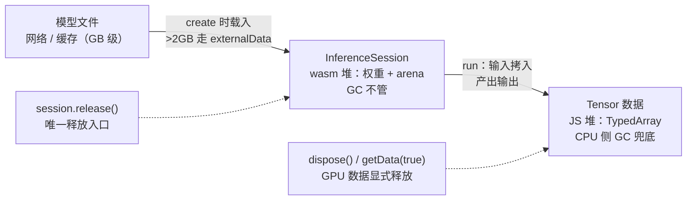
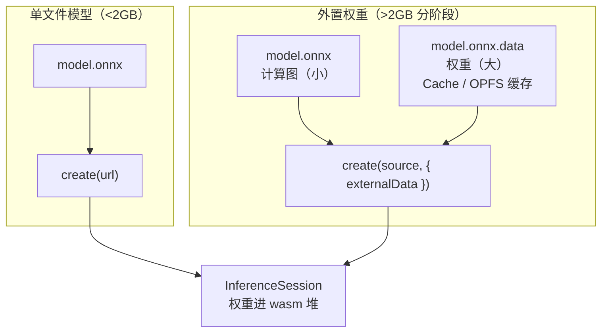

import { Canvas, Controls, Meta } from '@storybook/addon-docs/blocks';
import * as MemoryManagement from './memory-management.stories';

<Meta of={MemoryManagement} name="Docs" />

# 内存管理

[InferenceSession](?path=/docs/inference-session--docs) 课给了 `release()` 的入口，[Tensor](?path=/docs/tensor--docs) 课给了 `location` 的概念；本课把两条线索合成一个完整答案：**哪些内存要自己释放、大模型的字节怎么分阶段进来。**

先建立贯穿全课的判断——浏览器里 ort 的内存分三层，GC 只管其中一层：

- **JS 堆上的张量数据**（TypedArray）：GC 兜底，失去全部引用后自动回收。`tensor.dispose()` 是显式失效——防止误用已过期数据，不是提前回收。
- **wasm 堆里的会话**（权重与内存池）：GC 完全不管。`session.release()` 是唯一释放入口；不调它，权重就驻留到页面卸载——1.30 的构建里没有任何 FinalizationRegistry 之类的兜底（实测 dist 源码）。
- **模型文件本身**（网络上的字节）：受浏览器平台上限制约——Chrome 的 ArrayBuffer 约 2GB、ONNX protobuf 上限 2GB、wasm 线性内存 4GB。GB 级模型撞上限时，用 external data 分阶段加载。

看完导读你应当能预测：release 之后再 run 会立即失败；dispose 之后 location 变 `'none'`、读 `data` 报错；大于 2GB 的模型不能一次 `response.arrayBuffer()` 读进来。



| 成员 | 用途 / 默认值 / 回查要点 |
| --- | --- |
| `session.release()` | `Promise<void>`；释放权重与内存池的唯一入口；之后 run 直接失败 |
| `tensor.dispose()` | CPU 侧丢弃内部引用（数据交 GC）；GPU 侧真正释放；之后 location 变 `'none'` |
| `tensor.location` | `'cpu'` / `'cpu-pinned'` / `'texture'` / `'gpu-buffer'` / `'ml-tensor'`；`'none'` = 已释放 |
| `tensor.getData(releaseData?)` | 把 GPU 数据拉回 CPU；`releaseData: true` 拉回后同时释放 GPU 数据；CPU 张量忽略该参数 |
| `preferredOutputLocation` | 会话选项：让输出留在 GPU；仅 WebGL / WebGPU EP；不设时输出数据拉回 CPU |
| `enableCpuMemArena` / `enableMemPattern` | 会话选项：CPU 内存池与内存模式；排查内存问题时才调整 |
| `externalData` | create 选项：外部权重文件列表；>2GB 模型必用 |
| 平台上限 | Chrome ArrayBuffer 约 2GB（`0x7fe00000` 字节）；protobuf 2GB；wasm 线性内存 4GB |

## 会话释放

`release()` 做的事：把 wasm 侧的会话句柄、模型权重与内存池一起交还。返回 `Promise<void>`——释放是异步的，后续动作（比如紧跟着 create 新会话）应当 `await` 它完成。三个典型时机：换模型（旧的确认不用再建新的）、SPA 路由离开推理页、内存压力下换更小的模型。

**丢弃引用不等于释放。** 把 session 变量置 `null` 或让作用域结束，wasm 侧的会话照旧驻留——`activeSessions` 表里的句柄只能由 `release()` 移除。这是会话与普通 JS 对象最大的差别：JS 包装对象可以被 GC，它背后的 wasm 资源不会。

释放之后能观察到什么？下方实例按「create → run → release → 释放后再 run → 重新 create」真实执行：JS 包装对象在 release 后还活着——`inputNames` 照常可读；但 `run` 立即失败；对同一会话再次 `release` 同样报错。实例不预检状态、直接调用 ort API，错误原文就是证据：

<Canvas of={MemoryManagement.SessionLifecycle} />
<Controls of={MemoryManagement.SessionLifecycle} />

| 读者操作 | 可观察证据 |
| --- | --- |
| 打开实例 | 自动 create 并 run 一次：读数给出 `Input3` 与输出 `[1,10]` |
| 切到「释放 release」 | release 毫秒级完成；`inputNames` 读数不变——JS 包装对象还在 |
| 切到「推理 run」 | run 立即失败，读数显示 ort 的错误原文 `cannot run inference. invalid session id: …` |
| 点击画布再触发一次 release | 二次 release 报 `cannot release session. invalid session id: …` |
| 切到「创建 create」 | 新会话替换旧引用，run 恢复正常 |
| 打开 Show code | 看到该 Canvas 实际执行的 `session-lifecycle.ts`（不预检状态，错误即证据） |

两个紧贴 release 的边界：

- **wasm 线性内存只增不减。** `WebAssembly.Memory` 会增长但不会自动缩回；release 释放的是 ORT 层面的权重与 arena，线性内存里的空隙留给同一页面的下一次分配复用。所以释放的价值是「这块权重字节能被复用了」，而不是浏览器进程的内存读数立刻回落。
- **内存池开关与收缩。** `enableCpuMemArena`（CPU arena）让算子间临时缓冲在池里复用，`enableMemPattern` 让同形状的 run 复用分配方案；两者只在 wasm 与 Node/RN 生效，排查内存问题时才动。想在一次大 run 之后立刻收缩池，可以在 RunOptions 的 `extra` 里传 `memory.enable_memory_arena_shrinkage: '1'`（wasm 后端）。

## 张量生命周期

张量怎么释放，由 location 决定。location 的完整取值：CPU 侧的 `'cpu'` / `'cpu-pinned'`，GPU 侧的 `'texture'`（WebGL）/ `'gpu-buffer'`（WebGPU）/ `'ml-tensor'`（WebNN），以及 `'none'`——已释放。规则只有两条：

- **CPU 侧数据：GC 兜底。** `dispose()` 只是「移除内部引用」（API 参考原话）；TypedArray 在失去全部引用后由 GC 回收，持有外部引用时数据还在。run 的输出张量默认数据已拷回 CPU，用完不 dispose 也不会泄漏。
- **GPU 侧数据：必须显式释放。** `dispose()` 调用底层释放器归还 GPU 资源；或 `getData(true)` 把数据拉回 CPU 的同时释放 GPU 侧。GPU 资源的回收时机没有保证，显式调用是唯一的确定性释放点。

### CPU 张量：GC 兜底

最小表达只有一句：run 的输出用完不再引用即可，GC 负责。`dispose()` 在 CPU 侧的意义是「立即失效」——防止误用过期数据：

```ts
const outputs = await session.run(feeds);
// 输出张量是 CPU 侧（location 'cpu'）：用完不再引用，由 GC 回收。
// dispose() 的意义是让张量立即失效，不是提前回收内存。
```

dispose 之后的三个事实：location 变 `'none'`；再读 `.data` 抛 `The tensor is disposed.`；dispose 幂等，重复调用无副作用。实例里还有第四行最容易被误解的读数——**外部持有的 TypedArray 在 dispose 后仍然可读**：dispose 断开的是张量与数据的内部联系，不回收数据本身。

<Canvas of={MemoryManagement.TensorLifecycle} />
<Controls of={MemoryManagement.TensorLifecycle} />

| 读者操作 | 可观察证据 |
| --- | --- |
| 打开实例 | 构造 [2,3] 的 float32 张量：location `'cpu'`，data 可读 |
| 切到「释放 dispose」 | location 变 `'none'`；`.data` 读取报 `Error: The tensor is disposed.`；外部引用照常可读 |
| 切到「读取 getData(true)」 | 已释放的张量上同样报 `The tensor is disposed.`（getData 第一步就校验有效性） |
| 切回「构造 construct」再「读取 getData(true)」 | 照常返回数据——`releaseData=true` 在 CPU 张量上被忽略 |
| 打开 Show code | 看到该 Canvas 实际执行的 `tensor-lifecycle.ts` |

CPU 侧减少内存压力的第一工具不是 dispose，而是复用：用预分配输出缓冲让每轮 run 写进同一块内存（fetches 的预分配对象形态），分配次数从「每轮一次」降为零——见 [InferenceSession](?path=/docs/inference-session--docs) 课的 fetches 一节。

### GPU 张量：显式释放

GPU 输出从哪来：WebGPU 会话用 `preferredOutputLocation: 'gpu-buffer'` 让输出留在 GPU，供下一轮 run 直接消费（选项用法与浏览器要求见 [WebGPU 后端](?path=/docs/backend-webgpu--docs) 课）；或用 `Tensor.fromGpuBuffer` / `fromMLTensor` 把自己的 GPU 缓冲包成张量。这类张量的数据不在 JS 堆上——读 `.data` 会抛 `The data is not on CPU`，释放也只有两条路：

```ts
// 用完即释放，二选一：
await output.getData(true); // 需要数据：拉回 CPU，同时释放 GPU 侧
output.dispose();           // 不需要数据：直接释放 GPU 侧
```

漏掉这一步的后果不直观：不报错、不崩溃，只有显存占用随 run 次数静默累积——到页面被浏览器终止时，已经很难定位是哪一行漏的。把释放和消费写在同一段代码里（用完即释放），是唯一可靠的纪律；显存不进 JS 堆统计，靠事后观测定位非常低效（观测手段与边界见下文）。

## 观察内存占用

想验证「释放有没有生效」，先认清两个读数各自能看到哪一层：

- **`performance.measureUserAgentSpecificMemory()`** 是标准 API，但要求页面处于跨域隔离状态（COOP/COEP 响应头，见[多线程与跨域隔离](?path=/docs/cross-origin-isolation--docs) 课）——没有响应头的普通页面调用会直接失败。
- **`performance.memory`** 是 Chrome-only 的非标准 API，只有 `jsHeapSizeLimit` / `totalJSHeapSize` / `usedJSHeapSize` 三个粗粒度字段，Firefox / Safari 没有；只能当前后对比的粗略参考：

```ts
// Chrome-only、非标准；数值粗粒度且受 GC 时机影响，只做前后相对比较。
const heap = (performance as unknown as { memory?: { usedJSHeapSize: number } }).memory;
console.log(heap ? `${(heap.usedJSHeapSize / 1048576).toFixed(1)} MB` : '当前浏览器不提供');
```

两层读数都看不到 **wasm 堆**：线性内存不进 JS 堆统计，权重与 arena 的占用在 `performance.memory` 里不存在。要看它，用 DevTools 的 Memory 面板做堆快照（wasm 相关对象会出现在快照里）与 Performance 面板观察分配曲线。

结论与[性能测量](?path=/docs/profiling--docs) 课同一口径：内存读数只做**同机、同页、改一个变量的前后比较**（release 前后、dispose 前后、换模型前后），不追求绝对值，也不跨浏览器比较。

## 大模型的分阶段加载

小模型（几十 KB 到几十 MB）一条 URL 交给 create 就完事。GB 级模型会先撞上平台上限——官方大模型教程给出三道硬约束：

| 上限 | 数值 | 影响 |
| --- | --- | --- |
| Chrome 的 ArrayBuffer | `0x7fe00000` 字节（约 2GB） | `response.arrayBuffer()` 一次读入整个模型会失败 |
| ONNX protobuf | 2GB | 单文件 .onnx 装不下，大模型必须把权重放进外部文件 |
| wasm 线性内存 | 4GB（32 位寻址） | ort-web 跑不了 >4GB 的模型（官方教程明写的边界） |

对应地，分阶段加载策略分三步：

1. **权重外置（external data）。** 导出模型时权重放在独立文件（`model.onnx` + `model.onnx.data`），create 时用 `externalData` 声明。`path` 必须与 protobuf 内记录的权重 location 一致——所以**不能重命名外部数据文件**；`data` 接受 URL、Blob 或 Uint8Array。
2. **缓存模型字节。** 用 Cache API 或 OPFS（Origin Private File System）把模型文件存下来，刷新页面不再重新下载；从缓存取回 Blob 直接传给 create。
3. **让 ort 处理超大缓冲。** >2GB 的字节由 ort 内部用 `WebAssembly.Memory` 构造超大缓冲来绕过 ArrayBuffer 上限——代价是这类缓冲不可 transferable，因此 **`env.wasm.proxy` 与大模型互斥**（proxy 靠消息传递搬运缓冲）。

官方教程给出的两种加载形态（原文示例）：

```js
// 从 URL 加载：计算图与外部权重各一个地址
const mySession = await ort.InferenceSession.create(modelUrl, {
  externalData: [{ path: './model_a.data', data: externalDataUrl }],
});

// 从缓存加载：IndexedDB / OPFS 取回 Blob 直接传入
const mySession = await ort.InferenceSession.create(modelBlob, {
  externalData: [{ path: './model_a.data', data: externalDataBlob }],
});
```



本课只管「字节怎么进来、驻留在哪、怎么释放」；生成式大模型跑起来之后的逐 token 循环、KV 缓存与显存约束，见[浏览器跑大模型](?path=/docs/llm-in-browser--docs) 课。

## 最佳实践

- **会话的释放纪律：换模型先 `await release()`，再 create 新的。** 同时驻留两份权重是最容易写出来的内存峰值；SPA 卸载推理页时补一次 release。任何情况下都不要指望「丢弃引用」——wasm 侧没有兜底。
- **CPU 张量不逐个 dispose，GPU 张量用完必释放。** CPU 侧 GC 兜底，dispose 只用于防误用；GPU 侧（`gpu-buffer` / `ml-tensor` / `texture`）把 dispose 或 `getData(true)` 与消费写在同一段代码里。CPU 侧减压优先用预分配输出复用，而不是反复分配。
- **大模型三件套一起上：externalData + Cache/OPFS + 自管下载。** 自己 fetch 计算图文件（可出进度条）再把字节交给 create，比让 ort 内部下载多一层控制；`env.wasm.proxy` 与 >2GB 模型互斥，大模型页面保持 proxy 关闭。

## 常见问题

- 释放会话后再 run，报 `cannot run inference. invalid session id: …`。
  这是释放的正常语义，不是 bug：资源已交还，需要继续推理就重新 create。日志里意外出现时，说明有代码持着旧引用调用 run——把会话的创建与释放收口到同一个模块，避免旧引用散落在事件处理器里。
- 读输出张量报 `The tensor is disposed.`。
  张量已被 dispose（location 变 `'none'`），dispose 之后的 `.data`、`getData`、`reshape` 都会被拒绝。需要数据就在 dispose 前取。dispose 本身幂等、重复调用无副作用，要避免的只是释放后再读。
- WebGPU 会话的显存随推理次数持续上涨。
  输出留在了 GPU（`preferredOutputLocation: 'gpu-buffer'` 或 `fromGpuBuffer` 构造的输入）而没有释放。每轮输出消费完立即 `dispose()` 或 `getData(true)`；这个现象不报错、只见占用上涨，显存又不在 JS 堆统计里，靠观测定位低效——直接检查「GPU 张量的消费与释放是否在同一段代码」。
- fetch 大模型时 `response.arrayBuffer()` 抛错或页面崩溃。
  撞上 Chrome 约 2GB 的 ArrayBuffer 上限（`0x7fe00000` 字节）。改用 externalData 分阶段加载，或把下载流式写入 OPFS 后以 Blob 引用交给 create。
- 开了 `env.wasm.proxy` 后大模型加载失败。
  proxy 通过消息传递搬运缓冲，缓冲必须可 transferable；ort 为 >2GB 字节构造的 WebAssembly.Memory 缓冲不满足。大模型页面保持 proxy 关闭，推理阻塞主线程的问题用应用层队列缓解（见 [InferenceSession](?path=/docs/inference-session--docs) 课的并发一节）。

## 总结回顾

摘要：

本课把 ort 在浏览器里的内存分成三层，并给出各自的释放机制：JS 堆上的 CPU 张量数据由 GC 兜底，dispose() 只是让张量立即失效（location 变 'none'，此后 .data、getData、reshape 都报 The tensor is disposed.），外部持有的 TypedArray 不受影响；wasm 堆里的会话——权重与内存池——不受 GC 管，session.release() 是唯一释放入口，释放后 JS 包装对象仍可查询签名、但 run 立即失败（cannot run inference. invalid session id），丢弃引用不会释放；GPU 侧张量（texture / gpu-buffer / ml-tensor）必须显式 dispose 或 getData(true)，漏掉的代价是显存静默累积。模型文件本身受平台上限制约：Chrome ArrayBuffer 约 2GB、protobuf 2GB、wasm 4GB，大模型因此走「externalData 权重外置 + Cache/OPFS 缓存」的分阶段加载，且与 env.wasm.proxy 互斥。观测上 performance.memory 仅 Chrome 可用且不含 wasm 堆，内存结论只做同机同页的前后比较。

一句话：

> GC 只管 JS 堆上的张量数据；会话的唯一释放入口是 session.release()，GPU 张量必须显式 dispose 或 getData(true)，大模型的字节靠 externalData 分阶段进来。

知识要点：

- ort 在浏览器里的内存分哪三层？各由什么机制释放？
- 丢弃 session 引用为什么不释放资源？release() 之后哪些操作还能用、哪些立即失败？
- dispose() 在 CPU 张量与 GPU 张量上分别做什么？dispose 后读 .data 会怎样？
- getData(releaseData) 的参数什么时候生效？在 CPU 张量与已释放张量上调用各是什么结果？
- GPU 输出张量从哪来（preferredOutputLocation / fromGpuBuffer）？漏释放的后果是什么？
- 大模型撞上的三道平台上限是什么？externalData 的 path 为什么不能改名？
- 为什么 env.wasm.proxy 与 >2GB 模型互斥？观察内存用什么工具、什么口径？

## 参考资料

- [官方 Web 大模型教程（Large Models）](https://onnxruntime.ai/docs/tutorials/web/large-models) —— 平台上限（ArrayBuffer / protobuf / wasm 4GB）、externalData 用法、Cache API 与 OPFS 缓存策略的一手依据
- [onnxruntime-web API 参考](https://onnxruntime.ai/docs/api/js/index.html) —— release / dispose / getData / location / preferredOutputLocation / externalData 的类型签名与 `memory.enable_memory_arena_shrinkage` 配置键
- [env 标志与会话选项（Web 教程）](https://onnxruntime.ai/docs/tutorials/web/env-flags-and-session-options.html) —— preferredOutputLocation 与 env.wasm.proxy 的适用范围和限制
- [MDN: Origin Private File System](https://developer.mozilla.org/en-US/docs/Web/API/File_System_API/Origin_private_file_system) —— 大模型缓存策略中 OPFS 的浏览器侧依据
- [MDN: Performance.memory（非标准）](https://developer.mozilla.org/en-US/docs/Web/API/Performance/memory) —— Chrome-only 内存读数的字段构成与局限
- [MDN: performance.measureUserAgentSpecificMemory()](https://developer.mozilla.org/en-US/docs/Web/API/Performance/measureUserAgentSpecificMemory) —— 标准内存测量 API 的跨域隔离要求
- [microsoft/onnxruntime 仓库 js 目录](https://github.com/microsoft/onnxruntime/tree/main/js) —— 1.30.0 release / dispose 实现与「无 FinalizationRegistry 兜底」结论的一手依据（本课示例实测）
