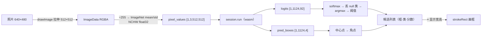

import { Canvas, Controls, Meta } from '@storybook/addon-docs/blocks';
import * as ObjectDetection from './object-detection.stories';

<Meta of={ObjectDetection} name="Docs" />

# 目标检测

分类模型回答「这是什么」，检测模型回答「哪里有什么」。本课用 9.2MB 的 yolos-tiny 量化版跑通检测的完整链路：照片 → 预处理 → `session.run` → 把 `logits` 与 `pred_boxes` 两个输出张量解码成（框、类别、分数）→ 画到画布上。核心判断只有一句：**检测输出不是「一个答案」，而是「一列候选」**——解码是固定语义的纯后处理，置信度阈值决定保留几个。预处理与推理骨架直接复用[图像与 Tensor 互转](?path=/docs/tensor-image--docs)、[第一次推理](?path=/docs/first-inference--docs)两课的结论，本课只讲检测特有的部分：候选集输出、解码五步、坐标换算与画框。

三个贯穿全课的事实：

- **输出是候选集，长度运行时才定。** 输入签名 `[?, 3, ?, ?]` 的符号维度让候选数 N 随输入尺寸变化：本例 512×512 → 1124 个候选，每个候选带 92 个类分数和 1 个框。
- **解码是纯后处理。** softmax → 丢 null 类 → argmax 加阈值 → 中心点换角点，五步全在张量之外完成；原始输出缓存后，换阈值只是瞬间重算，不碰推理。
- **框坐标是归一化中心点。** `(cx, cy, w, h)` 全在 [0,1]，乘显示宽高即像素；因为坐标是「比例值」，拉伸预处理不破坏框与画面的对齐。



| 张量 / 参数 | 值与回查要点 |
| --- | --- |
| `logits [1, N, 92]` | 每候选 92 类原始分数（softmax 之前）；92 = 91 类（含 N/A 占位）+ 1 个 null 类 |
| `pred_boxes [1, N, 4]` | 中心点格式 `(cx, cy, w, h)`，全部归一化到 [0,1]，没有像素单位 |
| null 类 | 索引 91（「无对象」）；先在全体 92 类上 softmax，再丢弃它做 argmax |
| 置信度阈值 | 解码过滤线，没有官方默认值；本课示例默认 0.5 |
| 输入尺寸 | 签名全符号维；取 patch（16）的倍数，模型卡预处理短边为 512 |

本课示例模型是 [Xenova/yolos-tiny](https://huggingface.co/Xenova/yolos-tiny) 的 `model_quantized.onnx`（9,661,148 字节，约 9.2MB，URL 锁 revision），示例图是 transformers.js 官方检测示例所用的 `cats.jpg`（640×480，画面为两只猫和两个遥控器），两者的响应都带 CORS 头（2026-10 实测）。首次打开要下载模型与 wasm 工件；推理在单线程 wasm 上是秒级，读数机器相关。

## 快速上手

以下代码在浏览器页面里执行（Vite 项目或 `<script type="module">`），顶层 `await` 直接可用；模型、wasm 工件与示例图都从 CDN 拉取，需要网络可达。

```ts
import { env, InferenceSession, Tensor } from 'onnxruntime-web';

// 0. wasm 资源指向与安装版本配套的 CDN；无跨域隔离头，保持单线程
env.wasm.wasmPaths = 'https://cdn.jsdelivr.net/npm/onnxruntime-web@1.30.0/dist/';
env.wasm.numThreads = 1;

// 1. 加载模型（yolos-tiny 量化版，约 9.2MB，URL 锁 revision）与一张 CORS 授权的图片
const session = await InferenceSession.create(
  'https://huggingface.co/Xenova/yolos-tiny/resolve/e2f9c7673f0fa61849efe2b56a0d7774779ebb9d/onnx/model_quantized.onnx',
  { executionProviders: ['wasm'] },
);
const image = new Image();
image.crossOrigin = 'anonymous'; // 稍后要 getImageData 读像素，必须先授权
await new Promise((resolve, reject) => {
  image.onload = resolve;
  image.onerror = reject;
  image.src =
    'https://huggingface.co/datasets/Xenova/transformers.js-docs/resolve/fbe92bd97d48f3ec17779d8d8f2964e1c6bc7634/cats.jpg';
});

// 2. 预处理：拉伸到 512×512（16 的倍数），÷255 后按 ImageNet mean/std 归一化，NCHW
const S = 512;
const work = document.createElement('canvas');
work.width = S;
work.height = S;
const ctx2d = work.getContext('2d')!;
ctx2d.drawImage(image, 0, 0, S, S);
const rgba = ctx2d.getImageData(0, 0, S, S).data;
const plane = S * S;
const data = new Float32Array(3 * plane);
for (let p = 0; p < plane; p += 1) {
  data[p] = (rgba[p * 4] / 255 - 0.485) / 0.229; // R
  data[plane + p] = (rgba[p * 4 + 1] / 255 - 0.456) / 0.224; // G
  data[plane * 2 + p] = (rgba[p * 4 + 2] / 255 - 0.406) / 0.225; // B
}

// 3. 推理：输入签名 [?,3,?,?]，dims 填本次的具体数值
const outputs = await session.run({
  [session.inputNames[0]]: new Tensor('float32', data, [1, 3, S, S]),
});

// 4. 解码：softmax → 丢 null 类（索引 91）→ argmax → 阈值 → 中心点换角点
const logitsTensor = outputs.logits as Tensor; // [1, N, 92]
const boxesTensor = outputs.pred_boxes as Tensor; // [1, N, 4]
const logits = logitsTensor.data as Float32Array; // [N × 92]
const boxes = boxesTensor.data as Float32Array; // [N × 4] cx,cy,w,h
const N = logitsTensor.dims[1]; // 512² → 1124 个候选，运行时读出
// LABELS：91 项 COCO 类别表，逐项取自模型 config.json 的 id2label（本课示例的 coco-labels.ts）
const detections: { label: string; score: number; x1: number; y1: number; x2: number; y2: number }[] = [];
for (let i = 0; i < N; i += 1) {
  const row = i * 92;
  let max = -Infinity;
  for (let c = 0; c < 92; c += 1) max = Math.max(max, logits[row + c]);
  let sum = 0;
  const probs = new Float32Array(92);
  for (let c = 0; c < 92; c += 1) sum += (probs[c] = Math.exp(logits[row + c] - max));
  let bestId = 0;
  let bestProb = 0;
  for (let c = 0; c < 91; c += 1) {
    const prob = probs[c] / sum; // 索引 91 是 null 类，循环只到 90
    if (prob > bestProb) {
      bestProb = prob;
      bestId = c;
    }
  }
  if (bestProb < 0.5) continue; // 置信度阈值
  const cx = boxes[i * 4];
  const cy = boxes[i * 4 + 1];
  const w = boxes[i * 4 + 2];
  const h = boxes[i * 4 + 3];
  detections.push({
    label: LABELS[bestId],
    score: bestProb,
    x1: cx - w / 2,
    y1: cy - h / 2,
    x2: cx + w / 2,
    y2: cy + h / 2,
  });
}
detections.sort((a, b) => b.score - a.score);
console.log(detections); // 归一化角点 × 显示宽高 = 像素坐标（画法见「画框」一节）
```

下方实例真实运行了这条链路：打开时自动下载模型与示例图、完成推理，左画面画出检测框与标签，右列表是解码保留的候选（按分数排序）。

<Canvas of={ObjectDetection.Pipeline} />
<Controls of={ObjectDetection.Pipeline} />

| 读者操作 | 可观察证据 |
| --- | --- |
| 打开实例并等待 | 读数从「加载模型…」走到「就绪」，左画面出现带类别标签的检测框（模型约 9.2MB，首次还需拉取 wasm 工件；单线程 wasm 推理秒级，读数机器相关） |
| 把「置信度阈值」升到 0.90 | 「保留框数」下降、弱框消失——原始输出已缓存，换阈值只重新解码，读数立即刷新 |
| 把「置信度阈值」降到 0.10 左右 | 更多候选过线、低分框出现——候选集的长尾如实呈现，可能伴随背景误检 |
| 看「候选集」与「模型输出」读数 | `1124 = 32² patch + 100 检测 token`，与 `logits [1,1124,92]` 的第二维一致 |
| 打开 Show code | 看到该 Canvas 实际执行的 `yolos-detect.ts` |

## 检测输出是候选集

分类模型的输出是「每类一个分数」，一次推理只有一个答案；检测模型输出的是**一列候选**，每个候选两样东西：92 个类分数（`logits`）和 1 个框（`pred_boxes`）。解码的全部工作，就是从这列候选里把「过线」的挑出来。

候选数 N 由输入尺寸决定——这就是输入签名 `[?, 3, ?, ?]` 中符号维度的另一面：YOLOS 把图片切成 16×16 的 patch，每个 patch 一个视觉 token，另有 100 个专职报框的检测 token，N = patch 数 + 100。512×512 → 32² + 100 = 1124；输入改小，N 同步变小。符号维度的读法见[获取模型](?path=/docs/getting-models--docs)课程；代码里 N 永远从输出 `dims` 运行时读出，不写死：

```ts
const outputs = await session.run(feeds);
const logits = outputs['logits'] as Tensor; // [1, N, 92]
const boxes = outputs['pred_boxes'] as Tensor; // [1, N, 4]
const N = logits.dims[1]; // 运行时读出：512×512 输入 → 1124
console.log(session.outputNames); // ['logits', 'pred_boxes']
```

92 这个数由模型头决定：91 个 COCO 类别（其中若干编号是「N/A」占位——COCO 原始编号不连续）加 1 个 null 类「无对象」，合计 92。类别表逐项取自模型 `config.json` 的 `id2label`（本课示例的 `coco-labels.ts`）。1124 个候选里绝大多数是背景，它们的高分落在 null 类上——这正是解码第二步要处理的事。

## 输出解码

解码五步，每一步语义固定（核心实现 `decodeDetections` 见 Show code，此处是讲解用的最小片段）：

```ts
for (let i = 0; i < N; i += 1) {
  const row = i * NUM_CLASSES; // 每候选 92 个分数

  // ① softmax：减最大值防溢出；先在全体 92 类上算，再丢 null 类
  let max = -Infinity;
  for (let c = 0; c < NUM_CLASSES; c += 1) max = Math.max(max, logits[row + c]);
  let sum = 0;
  for (let c = 0; c < NUM_CLASSES; c += 1) sum += Math.exp(logits[row + c] - max);

  // ② ③ 丢 null 类（索引 91）后 argmax + 阈值：背景候选几乎都过不了线
  let bestId = 0;
  let bestProb = 0;
  for (let c = 0; c < NULL_CLASS_ID; c += 1) {
    const prob = Math.exp(logits[row + c] - max) / sum;
    if (prob > bestProb) {
      bestProb = prob;
      bestId = c;
    }
  }
  if (bestProb < threshold) continue;

  // ④ 中心点 (cx,cy,w,h) → 角点 (x1,y1,x2,y2)，仍是归一化坐标
  const cx = boxes[i * 4];
  const cy = boxes[i * 4 + 1];
  const w = boxes[i * 4 + 2];
  const h = boxes[i * 4 + 3];
  detections.push({ label: LABELS[bestId], score: bestProb,
    x1: cx - w / 2, y1: cy - h / 2, x2: cx + w / 2, y2: cy + h / 2 });
}
detections.sort((a, b) => b.score - a.score); // ⑤ 按分数降序展示
```

- **① softmax。** 把原始分数变成「概率」——阈值过滤需要真概率做标尺；argmax 本身不需要它（softmax 不改变大小次序）。
- **② 丢 null 类。** DET 系把「没有物体」也当一类训练，背景候选的最高分几乎都落在索引 91 上。顺序是先在全体 92 类上 softmax、再丢弃——若先在 91 类上归一，null 类占有的概率质量会被重新摊给真类别，分数整体略偏高。语义与 transformers 官方的 `post_process_object_detection` 一致。
- **③ argmax + 阈值。** 每个候选取（丢 null 后的）最大类概率，达到阈值的才保留。transformers 的实现还会做 top-100 截断；本例候选过线数远小于 100，全保留后按分数排序即可。
- **④ 中心点换角点。** `(cx − w/2, cy − h/2)` 到 `(cx + w/2, cy + h/2)`，注意这一步之后坐标仍是归一化的，像素换算留给「画框」。
- **⑤ 排序。** 按分数降序，让「最可信的框」最先被看到。

快速上手实例的「置信度阈值」控件就是这五步的现场：调阈值只重跑 `decodeDetections`（原始输出已缓存），不重新推理——解码是纯后处理，读数立即刷新就是证据。

## 画框：坐标换算与绘制

解码给的是归一化角点，画框只差一乘：坐标乘「显示矩形」的宽高。

```ts
// rect：源图 contain 进画布后实际占据的显示矩形
const px = (v: number) => rect.x + v * rect.width;
const py = (v: number) => rect.y + v * rect.height;
for (const d of detections) {
  ctx.strokeStyle = color(d.labelId); // 按类别配色
  ctx.lineWidth = 2;
  ctx.strokeRect(px(d.x1), py(d.y1), (d.x2 - d.x1) * rect.width, (d.y2 - d.y1) * rect.height);
  // 标签牌：`${label} ${score.toFixed(2)}` 画在框上沿
}
```

三条边界决定框画得对不对：

- **一个坐标系原则。** 归一化坐标只乘显示矩形的宽高；`canvas.width`（位图像素）与 `clientWidth`（CSS 尺寸）不是一回事，混用必错位。实例的画法是先把源图 contain 出 `rect`，框与图共用这一个坐标系。
- **拉伸预处理不破坏对齐。** 本例把 640×480 拉伸到 512×512 推理，再把框画回保持原比例的显示矩形——归一化坐标是「占宽高的比例」，与纵横比无关：图横向压了多少，坐标比例就跟着缩多少，两边天然抵消。改用 letterbox（补边）预处理时坐标才需要减去 pad 偏移。
- **标签让结果可读。** 类别取自 `COCO_LABELS[bestId]`，配色按类别 id 循环取色板；「N/A」占位类若在低阈值长尾中胜出，会如实显示。

## YOLO 变体的解码差异

「YOLO 类」不是一种输出格式。换检测模型时，先看输出形状，再选解码路数：

| 模型族 | 输出形态 | 解码 | 去重 |
| --- | --- | --- | --- |
| DET 系（DETR / YOLOS / RT-DETR） | 候选集 `[1, N, 类数]` + `[1, N, 4]` | softmax → 丢 null 类 → 阈值（本课这套） | 不需要 NMS：一对一匹配训练，输出即最终框 |
| 经典 anchor 系（YOLOv2–v7） | dense 网格，每个 anchor 一组（objectness、类别、框偏移） | 按分数过滤，框偏移按该模型的框格式还原 | 必须 NMS |
| anchor-free 新系（YOLOv8+ / YOLO11） | dense 网格，框用 DFL 分布回归 | 先把分布积分成框边，再过滤 | 必须 NMS |

拿到新检测模型先问三个问题，答案都在模型卡与 Netron 签名里（读法见[获取模型](?path=/docs/getting-models--docs)课程）：输出是候选集还是 dense 网格？框是中心点还是角点、归一化还是像素？要不要 NMS？本课深讲的 yolos-tiny 属于 DET 系——「YOLOS」名字像 YOLO，解码却是 DET 的一套，正是「以签名为准、不以名字为准」的例证。

## 最佳实践

- **会话建一次，原始输出缓存，解码随便调。** `InferenceSession` 复用（[第一次推理](?path=/docs/first-inference--docs)课的口径）之外，把 `logits` / `pred_boxes` 也缓存下来：阈值、排序、top-k、展示过滤全是纯后处理，交互时只重算解码，不重新推理。上方实例的阈值控件就是按这个结构写的。
- **输入尺寸是性能旋钮。** N = (边长 ÷ 16)² + 100：512×512 给 1124 个候选，384×384 降到 676，注意力开销按 N 的平方下降，推理明显更快；代价是小目标变差。相机、视频等实时场景常用 384 甚至 320；静态图片用模型卡推荐的短边 512。
- **拉伸够用，高要求再上 letterbox。** 拉伸到方形（本课）零换算成本，纵横比失真温和时精度损失可忽略；纵横比悬殊（如全景图）或追求极限精度时，用模型卡的「短边 512 + 补边到 16 的倍数」，画框时把坐标先减 pad 偏移、再除有效区域。
- **阈值按场景调。** 展示型应用取 0.6–0.9（宁缺毋滥），统计与召回场景取 0.2–0.3（宁可多报）。没有万能值——用实例的「保留框数」读数在自己的图上现场定。
- **预处理抄模型卡，不抄教程。** 本例的约定（÷255、ImageNet mean/std、RGB、NCHW）来自模型的 `preprocessor_config.json`；换模型先查它的 config。`Tensor.fromImage` 的 `norm` 选项可以表达这组公式（换算表见[图像与 Tensor 互转](?path=/docs/tensor-image--docs)课程），不需要为归一化放弃官方辅助。

## 常见问题

- 框画出来了，但和物体对不上（偏移、大小不对）。
  按顺序核对三处：坐标乘的是不是同一个坐标系（显示矩形的宽高，而不是时而 `canvas.width` 时而 `clientWidth`）；中心点有没有被当成左上角用；预处理与显示之间有没有没还原的 letterbox 偏移。核对技巧：画一个固定框 `(0.5, 0.5, 0.4, 0.4)`，它应当正好套住画面正中央 40%×40% 的区域。
- 推理成功，但一个框都没有。
  先把阈值降到 0.05：有框说明原阈值过高或预处理有偏差；仍无框则逐项查预处理——通道、值域、mean/std 弄反都不报错但分数崩塌（核对方法见[图像与 Tensor 互转](?path=/docs/tensor-image--docs)课程的常见问题）；再确认 softmax 是在全体 92 类上做的、N 取自 `logits.dims[1]` 而不是 `dims[0]`。
- 画面上出现「#91」或「N/A」标签。
  「#91」是解码忘了在 argmax 前丢弃 null 类——背景候选在这一类上分数最高，会以高「置信度」胜出；按解码第②步补上即可。「N/A」是 COCO 类别表里真实存在的占位类，低阈值长尾中偶尔胜出属正常行为，可在展示层过滤。
- `getImageData` 抛 `SecurityError`，或画面只出框不出图。
  跨域图片污染了 canvas：图片必须带 `crossOrigin='anonymous'` 且响应带 CORS 头——本例模型、图片所在的两条 HuggingFace CDN 均实测返回 `Access-Control-Allow-Origin: *`。判定与修复的完整讨论见[图像与 Tensor 互转](?path=/docs/tensor-image--docs)课程的常见问题。
- 同一个物体上叠着好几个高度重叠的框。
  阈值放得很低时，DET 系也会给同一物体输出多个相邻高分候选——提高阈值，或在解码后加一道轻量 NMS。经典 YOLO 系（v2–v7、v8+）的输出本来就要求 NMS 去重，直接用 ort 跑这类模型需要自己实现（差异见「YOLO 变体的解码差异」）。

## 总结回顾

摘要：

本课沿着「照片 → 预处理 → 推理 → 解码 → 画框」走通了浏览器里的目标检测。检测模型输出的不是单答案而是一列候选：yolos-tiny 的 `logits [1, N, 92]` 与 `pred_boxes [1, N, 4]`，N = patch 数 + 100 个检测 token，随输入尺寸变化、运行时从输出 dims 读出。解码五步语义固定——全体 92 类上 softmax、丢掉索引 91 的 null 类再 argmax、最大类概率过阈值、中心点换角点、按分数排序——全部是纯后处理，原始输出缓存后换阈值只重跑解码。框坐标是归一化中心点格式，乘显示矩形宽高即像素；比例值与纵横比无关，拉伸预处理不破坏对齐，letterbox 才需要 pad 换算。YOLO 各族的解码并不通用：DET 系（本课）不需要 NMS，经典 YOLO 系要按各自的框格式解码并做 NMS——换模型先读签名与模型卡。

一句话：

> 检测输出是一列候选——解码五步（softmax、丢 null 类、argmax 加阈值、中心点换角点、排序）是固定语义的纯后处理，画框只是归一化坐标乘显示宽高。

知识要点：

- 检测输出与分类输出差在哪？候选数 N 由什么决定、代码从哪里读？
- 92 这个数怎么构成？null 类为什么必须丢弃、在哪一步丢、顺序错了会怎样？
- `pred_boxes` 的框格式是什么？为什么拉伸预处理不会让框错位？
- 阈值改变时实例里什么变了、什么没变？为什么换阈值不需要重新推理？
- 输入尺寸怎样影响候选数与推理耗时？取值受什么约束？
- DET 系与经典 YOLO 系的解码差异是什么？拿到新检测模型先问哪三个问题？

## 参考资料

- [onnxruntime-web API 参考](https://onnxruntime.ai/docs/api/js/index.html) —— `InferenceSession.run` 输出 map、`Tensor.dims` / `data` 的读取依据
- [Xenova/yolos-tiny](https://huggingface.co/Xenova/yolos-tiny) —— 本课示例模型；`config.json` 的 `id2label` 是类别表来源、`preprocessor_config.json` 是预处理约定（÷255、ImageNet mean/std、短边 512）的来源
- [transformers 图像处理器文档（post_process_object_detection）](https://huggingface.co/docs/transformers/main_classes/image_processor) —— DET 系解码语义（全体类 softmax 后去末类、top-100、阈值）的官方实现口径
- [transformers YOLOS 文档](https://huggingface.co/docs/transformers/model_doc/yolos) —— patch + 100 检测 token 的模型结构与 YolosImageProcessor 说明
- [HuggingFace Models（ONNX 过滤）](https://huggingface.co/models?library=onnx&sort=trending) —— 找其他检测模型（`library=onnx`）的入口
- [Xenova/transformers.js-docs 数据集](https://huggingface.co/datasets/Xenova/transformers.js-docs) —— 实例示例图 `cats.jpg` 的来源（transformers.js 官方检测示例所用）
- [Ultralytics 文档：预测模式](https://docs.ultralytics.com/modes/predict/) —— 经典 YOLO 系 predict 管线（置信度阈值 + NMS）的说明，「YOLO 变体的解码差异」的对照入口
