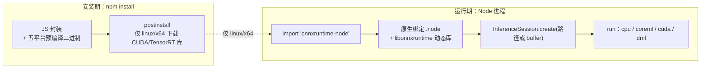

import { Meta } from '@storybook/addon-docs/blocks';

<Meta id="onnxruntime-node" title="按需分支/onnxruntime-node" name="Docs" />

# onnxruntime-node

当模型要从浏览器搬到 Node.js——命令行脚本、服务端接口、桌面应用——就换用 onnxruntime-node。它与 onnxruntime-web 共享同一套 API（`InferenceSession`、`Tensor`、`ort.env` 全部来自 onnxruntime-common），变的只是「执行来源」：原生 ONNX Runtime 动态库替代 wasm。这一个变化带来三件 web 包做不到的事：直接从文件路径加载模型、使用平台原生执行提供程序（CoreML、CUDA、DirectML）、摆脱 wasm 工件的版本伺服负担。代价是安装期绑定了平台二进制，代码不能跨进浏览器。

三个贯穿全课的事实：

- **API 面完全一致。** 包入口 `export * from 'onnxruntime-common'`，学过的会话、张量、env 用法原样适用；差异集中在模型来源、EP 清单和会话选项。
- **原生库在安装时落地。** npm 包自带各平台预编译二进制；只有 linux/x64 会在安装后额外下载 CUDA/TensorRT 库。
- **run 期间阻塞所在线程。** 原生推理是同步调用，把它放进脚本无感，放进服务就要考虑 worker 线程。

本课代码均为 Node 脚本风格，需在 Node 环境运行。关键结论的「实测记录」来自在 Node v24.13.0（macOS arm64）上对 onnxruntime-node@1.30.0 的真实运行，换平台会得到不同结果。



| 回查项 | 值 |
| --- | --- |
| npm 包 | `onnxruntime-node`（nightly：`onnxruntime-node@dev`） |
| 本手册版本基线 | 1.30.0（与 onnxruntime-web 同版本号发布） |
| 环境要求 | Node.js 16.x+（推荐 20.x+）或 Electron 15.x+（推荐 28.x+） |
| 模型来源 | 本地文件路径或内存 buffer（无 URL 加载） |
| 版本读数 | `ort.env.versions.node`（对照 web 侧的 `ort.env.versions.web`） |
| 后端查询 | `ort.listSupportedBackends()` |

## 快速上手

最小闭环：安装 → 从文件路径创建会话 → 打印模型签名 → 跑一次推理。

```bash
npm install onnxruntime-node@1.30.0
```

```mjs
// quick-start.mjs —— 需在 Node 环境运行：node quick-start.mjs /path/to/model.onnx
// 工程需为 ESM（package.json 写 "type": "module"，或把文件存为 .mjs）
import * as ort from 'onnxruntime-node';

const session = await ort.InferenceSession.create(process.argv[2]);
console.log('inputs:', session.inputNames);
console.log('outputs:', session.outputNames);
console.log('签名:', JSON.stringify(session.inputMetadata));

// 输入按模型签名构造。下面以 float32 [1,3,224,224] 的图像分类模型为例；
// 签名里是字符串（如 "height"）的维度，运行时自行取定数值。
const feeds = {
  [session.inputNames[0]]:
    new ort.Tensor('float32', new Float32Array(1 * 3 * 224 * 224).fill(0.5), [1, 3, 224, 224]),
};
const results = await session.run(feeds);
console.log('outputs:', results[session.outputNames[0]].dims);

await session.release();
```

实测记录（Node v24.13.0，macOS arm64，onnxruntime-node@1.30.0，模型为 HuggingFace 一款深度估计模型，输入 `pixel_values`，签名 shape 为 `["batch_size",3,"height","width"]`）：创建会话约 83 ms，打印出上述签名；按 `[1,3,518,518]` 构造输入后 `run` 约 218 ms，输出 `predicted_depth` 的 dims 为 `[1,518,518]`。加载耗时随模型体积变化，签名与维度读法是这段脚本最可复用的部分。官方维护的同款 Node.js quick start 示例在 onnxruntime-inference-examples 仓库的 js 目录下，可作对照实现。

## 与 web 包的关系

两个包是「同一套 API、两种执行来源」的关系。入口源码只有两行实质内容：`export * from 'onnxruntime-common'`（共享 API 全量再导出），随后把原生后端注册进 onnxruntime-common 的后端表，并定义 `ort.env.versions.node`。所以浏览器课里学的创建会话、feeds/fetches、RunOptions、Tensor 三要素在 Node 里逐字适用；学的是哪一课，回查入口就在哪一课（「InferenceSession」2.2.1、「Tensor 与数据类型」2.1.1）。

| 维度 | onnxruntime-web | onnxruntime-node |
| --- | --- | --- |
| 执行来源 | WebAssembly（及 JSEP 桥接的 GPU EP） | 原生动态库（.so / .dll / .dylib） |
| 模型来源 | URL 或内存 buffer | 文件路径或内存 buffer |
| EP 清单 | wasm、webgpu、webgl、webnn | cpu、coreml、cuda、dml、webgpu（实验） |
| 工件伺服 | 需要 `ort.env.wasm.wasmPaths` 对齐版本 | 无此负担，二进制随包安装 |
| 事件循环 | wasm 异步返回，可用 proxy 移出主线程 | run 为同步原生调用，阻塞所在线程 |

版本读数是确认「装的是谁」的最快方式：web 课用 `ort.env.versions.web`，这里读 `ort.env.versions.node`（1.30.0 实测返回 `"1.30.0"`）。两个包不要装进同一个工程互相 import——按运行环境二选一，切换方式见「跨环境代码复用」。

## 安装与平台二进制

### 安装命令与环境要求

```bash
npm install onnxruntime-node        # 最新稳定版
npm install onnxruntime-node@1.30.0 # 锁定本手册基线
npm install onnxruntime-node@dev    # nightly，不保证稳定
```

官方要求 Node.js v16.x+（推荐 v20.x+）或 Electron v15.x+（推荐 v28.x+）。包以 `main: dist/index.js` 提供 CommonJS 入口，同时可用 ESM 的 `import * as ort from 'onnxruntime-node'`（官方文档并列给出两种写法）。

### 安装期发生了什么

1.30.0 的 npm 包把 JS 封装和预编译二进制一起分发。包内 `bin/napi-v6/` 实测只含五个平台目录：

| 平台 | 随包文件 |
| --- | --- |
| darwin/arm64 | `onnxruntime_binding.node` + `libonnxruntime.*.dylib` |
| linux/x64、linux/arm64 | `onnxruntime_binding.node` + `libonnxruntime.so.1` |
| win32/x64、win32/arm64 | `onnxruntime_binding.node` + `onnxruntime.dll`、`DirectML.dll` 等 |

两处细节直接影响安装体验：

- **只有 linux/x64 有安装后下载。** `postinstall` 脚本按平台查清单，仅 linux/x64 会从 NuGet 下载 CUDA 12 的三个库（`libonnxruntime_providers_cuda.so` 等，来自 `Microsoft.ML.OnnxRuntime.Gpu.Linux`）。不需要 CUDA 时用 `npm install onnxruntime-node --onnxruntime-node-install=skip` 跳过；需要代理时该脚本经 global-agent 读取 `GLOBAL_AGENT_HTTPS_PROXY` 环境变量。
- **darwin/x64 无预编译二进制。** README 兼容矩阵仍列出 MacOS x64 支持 CPU，但 1.30.0 包内实测没有 darwin/x64 目录。Intel Mac 安装前先核验 `node_modules/onnxruntime-node/bin/napi-v6/darwin/` 下是否存在 `x64/`；缺失时只能从源码构建（js/node README 提供的方式）。此类「表格与包内容不一致」以实际安装结果为准。

## 执行提供程序

Node 侧的 EP 清单与 web 完全不同：没有 webgl/webnn，换成了各平台的原生加速。1.30.0 包内 README 的预编译支持矩阵：

| EP | Windows x64/arm64 | Linux x64 | Linux arm64 | macOS x64/arm64 |
| --- | --- | --- | --- | --- |
| `cpu` | ✔ | ✔ | ✔ | ✔ |
| `webgpu` | ✔（实验） | ✔（实验） | ✘ | ✔（实验） |
| `dml` | ✔ | ✘ | ✘ | ✘ |
| `cuda` | ✘ | ✔（CUDA 12） | ✘ | ✘ |
| `coreml` | ✘ | ✘ | ✘ | ✔ |

运行时查询比记表可靠——`listSupportedBackends()` 是 onnxruntime-node 独有的导出（web 包没有），返回当前平台的可用后端与是否随包捆绑。1.30.0 在 macOS arm64 实测返回：

```json
[{"name":"cpu","bundled":true},{"name":"webgpu","bundled":true},{"name":"coreml","bundled":true}]
```

请求写法与 web 一致，通过 `executionProviders` 数组声明：

```mjs
// macOS 上用 CoreML 加速，CPU 兜底
const session = await ort.InferenceSession.create('./model.onnx', {
  executionProviders: ['coreml', 'cpu'],
});
```

边界有三条。不写 `executionProviders` 时默认落在 CPU EP，想吃到原生加速必须显式声明。原生 EP 通常只覆盖图的一部分——CoreML 实测加载上述深度估计模型时，运行时打印告警：751 个节点中 535 个由 CoreML 承接，其余回落 CPU EP，这是分区执行的正常行为而不是错误。`cuda` 依赖安装期下载的那三个库，`--onnxruntime-node-install=skip` 装出的包请求 CUDA 会失败。EP 数组顺序、回退语义与 web 侧同源，取舍见「后端选择与回退」（2.3.3）。

## 文件系统模型加载

`InferenceSession.create` 的第一个参数类型不变（`string | Uint8Array | ArrayBufferLike`），但语义随包切换：common 的类型注释写明「The URI or file path」——web 里 string 是 URL，node 里 string 是**文件系统路径**。

```mjs
import * as ort from 'onnxruntime-node';
import { readFile } from 'node:fs/promises';

// 来源一：文件路径。相对路径相对进程工作目录（process.cwd()）解析
const session = await ort.InferenceSession.create('./models/model.onnx');

// 来源二：内存 buffer。模型不在本地磁盘（数据库、网络）时先读进内存
const buffer = await readFile('./models/model.onnx');
const session2 = await ort.InferenceSession.create(new Uint8Array(buffer));
```

两个来源都有真实报错文案可对照判断。路径不存在时 1.30.0 实测报错：

```text
Load model from /path/to/missing.onnx failed:Load model /path/to/missing.onnx failed. File doesn't exist
```

关键差异是一条迁移纪律：**web 课里「URL 即模型地址」的习惯在 Node 失效**。`create('https://example.com/model.onnx')` 会被当作本地相对路径，报的正是上面那种 File doesn't exist。远程模型先自行下载（`fetch` + `arrayBuffer()`）再以 buffer 传入。

## 会话选项与运行语义

### Node 专属会话选项

`SessionOptions` 里有两组选项的注释明确标注「available only in ONNXRuntime (Node.js binding and react-native)」——web 的 wasm 后端不接受它们：

| 选项 | 作用 |
| --- | --- |
| `intraOpNumThreads` | 单个算子内部的并行线程数 |
| `interOpNumThreads` | 算子之间的并行线程数（`executionMode: 'parallel'` 时相关） |
| `executionMode` | `'sequential'`（默认）或 `'parallel'` |
| `enableMemPattern`、`enableCpuMemArena` | 内存模式与 CPU 内存池开关 |
| `optimizedModelFilePath` | 把图优化后的模型落盘 |

```mjs
const session = await ort.InferenceSession.create('./model.onnx', {
  executionProviders: ['cpu'],
  intraOpNumThreads: 4,
});
```

### 阻塞语义与线程

`run()` 返回 Promise，但包源码里 Promise 内部是对原生绑定的一次**同步**调用（经 `setImmediate` 挪出当前微任务）。推论：推理计算期间，所在线程的事件循环整体停摆。实测佐证：在 220 ms 的 `run` 旁边挂一个 10 ms 间隔的计数器，整个过程只走了 1 跳。

据此分场景决策：脚本和 CLI 无感；服务端里一次长推理会冻结同进程内的所有其他请求——把会话与推理整体搬进 `worker_threads`（或子进程），主线程保持响应，结果经消息传回。原生绑定是线程感知的（加载时读取 `worker_threads` 的 `isMainThread`），在 worker 里创建和使用会话没有额外开关。这是浏览器侧 `proxy` 选项（3.1.3）的 Node 对应物，但这里要自己搭线程，ort 不代劳。

会话用完释放：`await session.release()`（1.30.0 实测可用）。服务端长驻进程复用一个会话即可，无需反复创建销毁。

## 典型场景

### 一次性脚本

预处理 → 推理 → 写文件的最小链路。Node 侧预处理没有 canvas，用纯 JS 或图像库把输入变成 `Float32Array`，之后与浏览器完全同构：

```mjs
// preprocess-run.mjs —— 读 JSON 输入、推理、把输出写成 JSON
import { readFile, writeFile } from 'node:fs/promises';
import * as ort from 'onnxruntime-node';

const session = await ort.InferenceSession.create('./models/model.onnx');
const raw = JSON.parse(await readFile('./input.json', 'utf8')); // 已归一化的像素数组
const feeds = { pixel_values: new ort.Tensor('float32', raw.data, raw.dims) };

const results = await session.run(feeds);
await writeFile('./output.json', JSON.stringify({
  dims: results.predicted_depth.dims,
  data: Array.from(results.predicted_depth.data),
}));
```

### 服务端接口中的推理

骨架只有两条纪律：**会话在启动时创建一次**，**推理不阻塞事件循环**（上一节的 worker 方案）。以 Node 内置 http 为例：

```mjs
// server.mjs —— 骨架示例：启动时建会话，每个请求只做 run
import { createServer } from 'node:http';
import * as ort from 'onnxruntime-node';

const session = await ort.InferenceSession.create('./models/model.onnx');

createServer(async (req, res) => {
  const body = await readBody(req);            // 自行实现：读取并解析请求体
  const input = preprocess(body);              // 预处理为 Float32Array（与浏览器同构）
  const results = await session.run({ pixel_values: new ort.Tensor('float32', input.data, input.dims) });
  res.end(JSON.stringify({ dims: results.predicted_depth.dims }));
}).listen(3000);
```

长推理、并发排队、进程模型等属于服务端部署话题，本手册不展开；这里的边界是：ort 自己不提供队列与并发调度，`run` 的并发语义（同一会话可并发调用）与 web 一致，见「InferenceSession」2.2.1。

### Electron 适配概述

Electron 应用可以装 onnxruntime-node：官方环境要求明确覆盖 Electron v15.x+（推荐 v28.x+），原生绑定随主进程的 Node 环境加载。适配要点是「谁持有会话」：会话和推理放在主进程会拖慢界面事件，惯例是把模型与会话交给一个专用进程或 `worker_threads`，界面进程只收发消息；模型文件则放在应用可读的本地路径，正好用上文件路径加载。具体工程配置（打包原生模块、重签名等）属于 Electron 主题，不在本课展开。

## 跨环境代码复用

一份推理逻辑要同时跑浏览器和 Node 时，复用的单位是「预处理 + run + 后处理」这段与环境无关的内核。推荐结构：内核从 onnxruntime-common 取 `Tensor` 与类型（它是纯 JS 实现，实测可在 Node 直接构造张量），会话由环境侧创建后注入：

```ts
// shared/infer-kernel.ts —— 浏览器与 Node 共用；只 import common，不 import 平台包
import { Tensor, type InferenceSession } from 'onnxruntime-common';

export async function runKernel(session: InferenceSession, data: Float32Array, dims: number[]) {
  const feeds = { [session.inputNames[0]]: new Tensor('float32', data, dims) };
  const results = await session.run(feeds);
  return results[session.outputNames[0]];
}
```

```ts
// 环境侧各自建会话，内核原样注入
import * as ort from 'onnxruntime-node'; // 浏览器侧换成 'onnxruntime-web'
import { runKernel } from './shared/infer-kernel.js';

const session = await ort.InferenceSession.create('./models/model.onnx'); // 浏览器侧传 URL
const output = await runKernel(session, data, dims);
```

要在同一份入口代码里按环境选包，用动态 import 探测：

```ts
const ort = await (typeof process !== 'undefined' && process.versions?.node
  ? import('onnxruntime-node')
  : import('onnxruntime-web'));
```

注意这条写法的隐藏成本：浏览器打包器会在构建期尝试解析两个分支，`onnxruntime-node` 里的原生模块引用会让构建直接失败——需要在打包器里把 Node 分支标记为 external 或用别名排除。更省事的替代是不换包：onnxruntime-web 的 exports 为 Node 环境准备了 `node` 条件（1.30.0 实测解析到 `dist/ort.node.min.mjs`），同一句 `import * as ort from 'onnxruntime-web'` 在 Node 里也能工作——但拿到的只有单线程 wasm EP，等于放弃文件路径加载与原生加速。取舍：**要原生能力就换包并管好构建器，只求「能跑」就让 web 包的 node 条件兜底**。

共享内核里还有一条纪律：不要引用 `document`、`navigator`、`canvas` 等浏览器全局（图像预处理用纯 JS 或跨端图像库替代），`ort.env.wasm.*` 配置属于 web 包独有，也不要写进共享代码（`ort.env` 的分界见 2.2.2）。

## 最佳实践

- **会话生命周期与进程对齐。** 启动时创建一次、整个进程复用；模型更新或配置变更时重建。每请求创建会话在 Node 里同样成立但纯属浪费——会话创建本身要解析并编译整张图。
- **EP 显式声明并留 cpu 兜底。** 写 `executionProviders: ['coreml', 'cpu']` 这类数组，让不支持的分区自然回落；跨平台部署时用 `listSupportedBackends()` 在运行时决定请求哪几个，而不是写死平台专属 EP。
- **离线与 CI 安装走 skip。** 非 linux/x64 平台装包没有网络动作；linux/x64 的 NuGet 下载在离线 CI 会卡死，不需要 CUDA 就 `--onnxruntime-node-install=skip`，需要就把库预置进镜像并跳过在线下载。
- **升级只锁一个版本。** 与 web 包「JS、wasmPaths、运行时读数三处对齐」不同，node 包没有外部工件：锁好 package.json 版本，用 `ort.env.versions.node` 自检即可。

## 常见问题

- 安装成功，运行时报 `Cannot find module '.../bin/napi-v6/<platform>/<arch>/onnxruntime_binding.node'`。
  当前平台的预编译二进制不在包内（1.30.0 实测清单见「安装期发生了什么」，例如 darwin/x64 缺失）。先确认 `process.platform` 与 `process.arch` 组合是否在包内存在；不存在时从源码构建 Node.js binding，或改用有预编译的 Node 版本平台。
- linux 服务器上 `npm install` 长时间停在 postinstall 或报下载失败。
  这是 linux/x64 特有的 CUDA 库 NuGet 下载在网络受限环境的必然表现。不需要 CUDA 时加 `--onnxruntime-node-install=skip` 重装；需要 CUDA 时为安装脚本配置代理环境变量 `GLOBAL_AGENT_HTTPS_PROXY`，或预置库文件后跳过在线下载。
- 服务进程在推理期间完全无响应，推理结束才恢复。
  `run` 是同步原生调用，阻塞所在线程的事件循环（实测证据见「阻塞语义与线程」）。把会话创建与推理移进 `worker_threads` 或子进程，主线程只收发消息；不要试图用「更多 `intraOpNumThreads`」解决——那是算子内并行，不改变事件循环被占用的事实。
- 把浏览器代码连着 `import 'onnxruntime-web'` 一起搬进 Node，发现只有单线程 wasm，WebGPU 全不可用。
  这是 web 包在 Node 下的既定边界（js/web 兼容矩阵），不是配置问题。需要文件路径加载、CoreML/CUDA 等原生 EP 时，安装并改 import 为 `onnxruntime-node`；包的分工见「认识 ONNX Runtime Web」。

## 总结回顾

摘要：

onnxruntime-node 把 onnxruntime-common 的同一套 API 接到原生 ONNX Runtime 动态库上：入口 `export * from 'onnxruntime-common'`，会话、张量与 env 用法与浏览器逐字相同，`ort.env.versions.node` 换掉了 web 读数。安装即落地平台二进制，1.30.0 随包带五个平台目录、无 darwin/x64，仅 linux/x64 在 postinstall 从 NuGet 下载 CUDA 12 库并可用 skip 跳过。EP 清单换成原生阵容——cpu、coreml、cuda、dml 与实验性 webgpu，`listSupportedBackends()` 提供运行时查询。`create` 的 string 参数从 URL 变成文件路径，远程模型走 buffer。原生推理是同步调用，会阻塞所在线程的事件循环，脚本无感、服务要配 worker；`intraOpNumThreads` 等线程选项是 Node 侧独有的会话配置。跨环境复用的落点是把内核绑在 onnxruntime-common 上、会话由环境注入，或退而求其次让 web 包的 node 条件提供单线程 wasm 兜底。

一句话：

> API 一套、来源两种：换 import 就是换执行来源——文件路径加载与原生 EP 是收益，平台二进制与阻塞事件循环是代价。

知识要点：

- onnxruntime-node 与 onnxruntime-web 共享哪些 API？差异的来源是什么？
- 1.30.0 安装期会发生什么？哪些平台有预编译二进制？CUDA 库何时下载、如何跳过？
- Node 侧有哪些执行提供程序？如何在运行时查询当前平台可用后端？
- `InferenceSession.create` 的 string 参数在 Node 里的语义与 web 有何不同？buffer 加载怎么写？
- 哪些会话选项只在 Node 生效？`run` 对事件循环意味着什么，服务端如何应对？
- 同一份推理代码如何在 web 与 Node 之间复用？两种 import 策略各付出什么代价？

## 参考资料

- [Get started with ONNX Runtime Node.js（官方）](https://onnxruntime.ai/docs/get-started/with-javascript/node.html) —— 安装命令与 `import` / `require` 两种导入写法的一手依据
- [microsoft/onnxruntime 仓库 js/node README](https://github.com/microsoft/onnxruntime/tree/main/js/node) —— 环境要求、EP 支持矩阵、CUDA EP 安装与 skip 标志、从源码构建的入口
- [onnxruntime-node npm 发布页](https://www.npmjs.com/package/onnxruntime-node) —— 稳定版与 `@dev` nightly 的版本记录
- [onnxruntime-web API 参考（官方）](https://onnxruntime.ai/docs/api/js/index.html) —— `InferenceSession.create` 重载、`SessionOptions` 各项「仅 Node.js binding」注释、`Tensor` 类型的共享真源
- [onnxruntime-inference-examples JS 示例集](https://github.com/microsoft/onnxruntime-inference-examples/tree/main/js) —— 官方 Node.js binding quick start 所在位置
