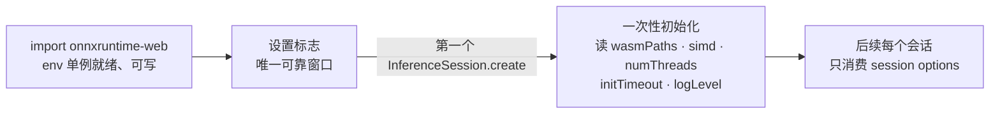

import { Canvas, Controls, Meta } from '@storybook/addon-docs/blocks';
import * as OrtEnv from './ort-env.stories';

<Meta of={OrtEnv} name="Docs" />

# ort.env 全局配置

`ort.env` 是 onnxruntime-web 的全局配置单例：wasm 工件路径、线程数、SIMD、proxy、日志级别……全部挂在它身上，对页面里的所有会话生效。[InferenceSession](?path=/docs/inference-session--docs)课程讲过 session options 如何描述「单个会话怎么跑」；本课的 env 回答另一层问题——「整个运行时怎么装、怎么打日志」，两层配置互不替代。

先建立贯穿全课的核心判断：**env 的大多数标志只在第一次 `InferenceSession.create` 触发后端初始化时被读取一次**。import 之后、创建第一个会话之前，是唯一可靠的设置窗口；此后修改不生效，而初始化一旦失败，后续所有会话创建都会失败，直到刷新页面。

还有一条容易被文档默认值误导的运行时事实：未设置的标志读取出来是 `undefined`，文档默认值要等首次初始化才落盘，部分标志（如 `env.wasm.numThreads`）还会把解析结果回写进 env。看完导读你应当能预测下方实例的结果：创建会话前 `env.wasm.numThreads` 读作「未设置」，创建后变成 ort 替你决定的数字。



| 标志 | 默认值 | 生效时机 | 用途 |
| --- | --- | --- | --- |
| `env.logLevel` | `'warning'` | 首次后端初始化时定格 | 日志级别，五级取值 |
| `env.debug` | `false` | 对应后端初始化 | 额外诊断日志 |
| `env.trace` | `false` | 后端初始化 | 跟踪事件开关（取代已废弃的 `env.wasm.trace`） |
| `env.versions` | 只读 | 任意时刻可读 | 版本自检，见[安装与导入](?path=/docs/installation--docs) |
| `env.wasm.numThreads` | `0`（自动） | 首次 wasm 初始化 | 推理线程数，自动值按环境解析 |
| `env.wasm.simd` | `true` | 首次 wasm 初始化 | SIMD 能力检测，不切换工件 |
| `env.wasm.proxy` | `false` | 首次会话初始化起逐步判断 | 推理移入工作线程，见[proxy 工作线程](?path=/docs/proxy-worker--docs) |
| `env.wasm.initTimeout` | `0`（不超时） | 首次 wasm 初始化 | wasm 初始化超时毫秒数 |
| `env.wasm.wasmPaths` | 无 | 首次 wasm 初始化 | 工件路径，配置见[安装与导入](?path=/docs/installation--docs)与[WASM 资源伺服](?path=/docs/wasm-serving--docs) |
| `env.wasm.wasmBinary` | 无 | 首次 wasm 初始化，设置时忽略 `wasmPaths` | 直接提供 wasm 二进制 |
| `env.webgl.*` / `env.webgpu.*` | — | 首次对应后端初始化 | 后端专属标志，见[后端选择与回退](?path=/docs/backend-selection--docs)与[性能测量](?path=/docs/profiling--docs) |

表中「默认值」是类型注释里的语义默认值；运行时未设置的标志读出来是 `undefined`（`logLevel` 是唯一自带初始值的例外），实际生效值由首次初始化决定。

## 全局单例

`env` 是模块级的普通对象：同一次加载里，所有模块 import 到的是同一个实例，页面上创建的每个会话都读它。由此有两个直接推论：

- **全局对会话。** 工件从哪来、用几个线程、日志打多细——这些「运行时级别」的决定放在 env；EP 顺序、维度覆盖、输出位置——这些「会话级别」的决定放在 `InferenceSession.create` 的 options。拿不准归属时问一句：这个设置会改变另一个会话吗？会，就属于 env。
- **一份加载一套 env。** CDN script 与 npm 包并存时，页面上有两份 ort 副本、两套互不相通的 env，表现为「设置了时灵时不灵」，处理方式见[安装与导入](?path=/docs/installation--docs)的常见问题。

回查时还有一条实用判据：**想知道初始化是否发生过，读 `env.wasm.numThreads`**——未设置时它是 `undefined`，首次初始化时被 ort 写回具体数字。下方实例在创建任何会话之前逐一读取全部公开标志，参考表中的默认值是否「落盘」以这里的读数为准：

<Canvas of={OrtEnv.FlagSnapshot} />

| 读者操作 | 可观察证据 |
| --- | --- |
| 打开实例 | 面板显示全部标志的当前值：`logLevel` 为 `'warning'`，其余全部「未设置」 |
| 对照底部环境行 | `crossOriginIsolated` 与逻辑核数是当前浏览器的真实状态，决定 `numThreads` 自动解析的结果 |
| 打开 Show code | 看到该 Canvas 实际执行的 `env-snapshot.ts` |

## 设置时机：第一次创建会话之前

wasm 后端的生命周期分四步（`backend-wasm.ts` 顶部注释即官方说明）：

1. **注册。** import 完成时后端只登记名字，几乎零开销，不读任何标志。
2. **后端初始化（一次性）。** 第一次对 wasm 系后端调用 `InferenceSession.create` 时触发：先跑 `initializeFlags()` 把自动值落盘（非隔离页面 `numThreads` 解析为 1），再执行 wasm 初始化——此时才读取 `wasmPaths` / `wasmBinary`、做 `simd` 能力检测、按 `numThreads` 决定是否创建线程池；最后 `_OrtInit` 把 `logLevel` 与线程数传进原生运行时。
3. **会话创建（每个会话）。** 下载模型、应用 session options，env 不再参与。
4. 此后每次 `create` 直接复用第 2 步的成果——`initializeWebAssembly` 开头就有 `if (initialized) return`。

第 2 步的一次性带来两条硬规则：

- **初始化之后修改 env 不生效。** `wasmPaths`、`numThreads`、`simd`、`initTimeout`、`logLevel` 都在第 2 步被消费完毕，之后怎么改都只是改了一个普通对象的属性。
- **初始化失败不可重试。** 失败会置 `aborted` 标志，之后的每次 `create` 都直接抛 `previous call to 'initializeWebAssembly()' failed.`——修好网络或 `wasmPaths` 后必须刷新页面。

下方实例真实执行一次首次创建，并在前后各采样一次 env，连 ort 的回落警告都捕获进读数：

<Canvas of={OrtEnv.InitTimeline} />
<Controls of={OrtEnv.InitTimeline} />

| 读者操作 | 可观察证据 |
| --- | --- |
| 打开实例 | 自动完成首次 `create`：左栏是设置的输入，右栏是 ort 实际生效并回写的值 |
| 「numThreads 设置值」选 auto 或 1 | 非隔离页面的实际值回写为 1 |
| 选 2 | 读数出现 ort 自己的两条回落警告原文，实际值仍是 1 |
| 查看「create 耗时」 | 首次显著较长——含 wasm 工件（约 28MB）下载与初始化 |
| 切换选项 | 不会重演初始化——这正是一次性语义本身，刷新页面可重做实验 |
| 打开 Show code | 看到该 Canvas 实际执行的 `init-timeline.ts` |

## wasm 标志

`env.wasm` 下的六个标志共享同一个生效点：首次 wasm 初始化。除 `wasmPaths` 的配置细节归[WASM 资源伺服](?path=/docs/wasm-serving--docs)（3.1.1）外，每个标志的本体都在本节。

### numThreads：自动解析与回落

线程数把主线程计算在内；`0` 或未设置表示交给 ort 决定，解析规则来自 `initializeFlags()` 源码：

- 页面没有跨域隔离（`self.crossOriginIsolated` 为 `false`，`SharedArrayBuffer` 不可用）→ **1**；
- 有跨域隔离 → `min(4, ceil(逻辑核数 / 2))`。

显式设置的值会被尊重，但大于 1 而环境不支持时，ort 会连发两条 `console.warn` 并把线程数强制改回 1——「初始化前后对照」实例里可以读到这两条警告的原文。跨域隔离的开启条件见[多线程与跨域隔离](?path=/docs/cross-origin-isolation--docs)（3.1.2）；Node.js 仅支持单线程 wasm，见[onnxruntime-node](?path=/docs/onnxruntime-node--docs)（5.1）。

```ts
ort.env.wasm.numThreads = 1; // 无跨域隔离头时唯一稳妥的显式值
```

### simd：能力检测，不切换工件

`simd` 决定初始化时要不要做 SIMD 能力检测：`true`、`undefined` 或 `'fixed'` 检测 fixed-width SIMD；`'relaxed'` 检测 Relaxed SIMD，不支持直接抛错；`false` 跳过检测。设了无法识别的值会被警告并按 `false` 处理。

一个随版本变化的边界：旧教程里 SIMD 与线程数共同决定加载哪个工件文件；1.30 的 dist 只有一套 `ort-wasm-simd-threaded*` 工件，**这个标志已经不选择文件**，只控制检测行为——指望 `simd = false` 省下载是无效的。

### proxy：推理移入工作线程

`proxy = true` 时，wasm 初始化与后续推理都发生在专职 worker 里，主线程只收发消息。它是 env 标志而非 session option，因为它改变的是整个运行时的宿主，对所有会话生效。必须在第一个会话前设置；运行中翻转会让后续调用直接抛 worker 未就绪错误。与 WebGPU 后端不兼容（GPU 缓冲无法跨线程转移），CSP 受限页面可能禁止 blob worker，机制与取舍见[proxy 工作线程](?path=/docs/proxy-worker--docs)（3.1.3）。

### initTimeout：初始化超时

wasm 初始化的看门狗，毫秒，`0` 表示不限时。超时抛 `WebAssembly backend initializing failed due to timeout: ${timeout}ms`。大工件加慢网络时可设一个兜底值，把「无限等待」变成可捕获的错误。

### wasmPaths 与 wasmBinary：工件定位

首次 wasm 初始化时一次性读取；`wasmBinary` 直接内联二进制，设置后 `wasmPaths` 被忽略。`wasmPaths` 的写法（前缀与对象形式）和自托管细节见[安装与导入](?path=/docs/installation--docs)（1.2）与[WASM 资源伺服](?path=/docs/wasm-serving--docs)（3.1.1）；本课只记时序：它的设置窗口同样是第一个会话之前。

## 日志与诊断

### logLevel：日志级别

取值 `'verbose' | 'info' | 'warning' | 'error' | 'fatal'`，默认 `'warning'`——正常运行时 ort 安静，只报 warning 以上。它也是唯一自带运行时初始值的标志，其余未设置的标志读出来都是 `undefined`。

生效时机与其他 wasm 标志一致：原生侧在 `_OrtInit` 时把级别定格传给 C 运行时，JSEP 后端在各自的 EP 初始化里同样定格一次。排障时把级别开到 `'verbose'`，并且要在第一个会话之前开：

```ts
ort.env.logLevel = 'verbose'; // 排障期；生产环境保持默认 'warning'
```

报错定位的系统方法见[常见报错排查](?path=/docs/troubleshooting--docs)（3.3.2）。

### debug 与 trace：诊断开关

- `env.debug = true` 让 JSEP 与 WebGL 后端输出额外诊断日志（内部以 `LOG_DEBUG` 门控）。
- `env.trace = true` 开启跟踪事件；它取代了已废弃的 `env.wasm.trace`——两者同时设置时后者被忽略。

两者与 `logLevel` 一样在初始化阶段被消费，同样遵守「第一个会话之前设置」的窗口。WebGPU 的性能分析走 `env.webgpu.profiling`，见[性能测量](?path=/docs/profiling--docs)（3.2.1）。

## 最佳实践

- **集中单点设置。** env 标志散落各处是「时灵时不灵」的根源——在应用入口写一个 `setupOrt()`，保证它在任何 `InferenceSession.create` 之前执行：

```ts
import * as ort from 'onnxruntime-web';

/** 应用入口调用一次；必须在第一个 InferenceSession.create 之前。 */
export function setupOrt(): void {
  ort.env.wasm.wasmPaths =
    'https://cdn.jsdelivr.net/npm/onnxruntime-web@1.30.0/dist/';
  // 没有跨域隔离头时多线程必然回落，显式设 1 免去告警。
  ort.env.wasm.numThreads = self.crossOriginIsolated ? 0 : 1;
  ort.env.logLevel = import.meta.env.DEV ? 'info' : 'warning';
}
```

- **按隔离状态决定线程数。** 能部署 COOP/COEP 就交给 `0` 自动解析；不能就显式设 1——两者在非隔离页面结果相同，后者不产生告警（见 3.1.2）。
- **调试标志分环境收敛。** `logLevel: 'verbose'`、`debug: true` 只在开发构建开启；逐 kernel 的日志有可观开销，生产环境保持 `'warning'` 并关闭诊断。
- **初始化失败不要原地重试。** 捕获 `previous call to 'initializeWebAssembly()' failed.` 后提示用户刷新页面；重试 `create` 只会得到同样的错误。

## 常见问题

- 修改了 `env` 标志，行为没有任何变化。
  先确认修改发生在第一个 `InferenceSession.create` 之前——大多数标志只被读取一次；再确认页面只有一份 ort 副本（CDN script 与 npm 并存时是两套 env，见[安装与导入](?path=/docs/installation--docs)的常见问题）。
- 修好配置后重试，仍然报 `previous call to 'initializeWebAssembly()' failed.`。
  初始化失败会把后端永久置为失败状态，重试无效。处理完 `wasmPaths` 版本或网络问题后刷新页面，让初始化重新开始。
- 控制台出现 `env.wasm.numThreads is set to 2, but this will not work unless you enable crossOriginIsolated mode`。
  页面缺少 COOP/COEP 响应头，ort 已把线程数回落为 1，并会追加一条多线程不支持的警告。真要开多线程见[多线程与跨域隔离](?path=/docs/cross-origin-isolation--docs)（3.1.2）；不打算开就显式设 1 消除告警。
- 设 `env.wasm.simd = false` 想减少下载体积，但没有任何变化。
  1.30 只发行一套 `ort-wasm-simd-threaded*` 工件，该标志只控制能力检测、不选择文件。体积优化见[量化与体积](?path=/docs/quantization--docs)（3.2.2）。
- 创建会话之后再改 `ort.env.logLevel`，日志详细程度没有变化。
  原生运行时的日志级别在 `_OrtInit` 时定格，JSEP 在 EP 初始化时同样定格。把级别设置移到第一个会话之前。

## 总结回顾

摘要：

本课把 ort.env 讲成一个「读一次」的全局配置单例：import 之后它是可写的普通对象；第一次 `InferenceSession.create` 触发后端初始化时，`wasmPaths`、`simd`、`numThreads`、`initTimeout` 被 wasm 初始化消费，`logLevel` 与线程数被 `_OrtInit` 定格，此后修改一律无效，失败则卡死到刷新页面。文档默认值与运行时不同：未设置的标志读 `undefined`，`logLevel` 是唯一自带初始值的例外，`numThreads` 的解析结果会回写成可见数字——它也是判断初始化是否发生的公开判据。六个 wasm 标志各有分工：`numThreads` 管线程与回落告警，`simd` 只管能力检测、不再选工件，`proxy` 把整个运行时搬进 worker，`initTimeout` 提供看门狗，`wasmPaths` / `wasmBinary` 定位工件；webgl 与 webgpu 的专属标志归后端与性能课程。

一句话：

> env 是全局单例，大多数标志只在第一次 InferenceSession.create 时被读取——import 之后、第一个会话之前，是唯一可靠的设置窗口。

知识要点：

- env 与 session options 的分界判据是什么？
- 哪些标志在首次 wasm 初始化时被消费？此后修改会怎样？失败后为什么必须刷新？
- `numThreads` 未设置时如何解析？无跨域隔离时显式设 2 会发生什么？
- 怎样从 env 的读数判断初始化是否已经发生？
- `simd` 标志在 1.30 中实际控制什么、不再控制什么？
- `logLevel` 的五级取值、默认值与生效时机是什么？
- `proxy` 改变的是什么？它为什么必须是 env 标志而不是 session option？

## 参考资料

- [The 'env' Flags and Session Options（官方）](https://onnxruntime.ai/docs/tutorials/web/env-flags-and-session-options.html) —— env 与 session options 的分界、「在创建任何推理会话之前设置」时机口径的一手依据
- [onnxruntime-web API 参考（官方）](https://onnxruntime.ai/docs/api/js/index.html) —— `Env` 与 `Env.WebAssemblyFlags` 各标志的类型与语义默认值（`@defaultValue`）
- [microsoft/onnxruntime 仓库 js 目录](https://github.com/microsoft/onnxruntime/tree/main/js) —— `initializeFlags`、`initializeWebAssembly`、`_OrtInit` 的源码，本课关于一次性初始化、自动解析与回落警告的断言依据
