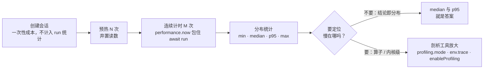

import { Canvas, Controls, Meta } from '@storybook/addon-docs/blocks';
import * as Profiling from './profiling.stories';

<Meta of={Profiling} name="Docs" />

# 性能测量

本课回答一个问题：**怎么把「一次 run 的耗时」变成可信的性能结论，并在结论之上定位瓶颈。** 核心判断是：浏览器里的单次计时是噪声——首次初始化、GC、任务调度都会写进单个读数；可信的结论来自一个测量闭环：**预热挡掉一次性成本 → 多次取样 → 看分布（min / median / p95）**；「慢在哪」再交给官方诊断工具从整体计时放大到内核。

本课的两个实例全程真实运行：计时读数全部来自 `performance.now()` 的真实测量。这类读数**机器相关**——只承诺「同机、同页、同参数下的相对比较」，不承诺绝对值。



诊断工具的入口先列成一张表，各工具的开启时机、数据去向与边界在后文展开：

| 诊断工具 | 开启方式 | 默认值 | 数据去向 |
| --- | --- | --- | --- |
| 手动计时 | `performance.now()` 包住 `await session.run()` | — | 自己的统计代码 |
| WebGPU 内核计时 | `env.webgpu.profiling.mode = 'default'`（可配 `profiling.ondata`） | `'off'` | `ondata` 回调；不设则 console 打印 `[profiling]` 前缀行 |
| 执行时间轴 | `env.trace = true` | `false` | `console.timeStamp` → DevTools Performance 面板 |
| 图级剖析 | create 时 `enableProfiling: true` + `session.endProfiling()` | 关闭 | ORT 标准 JSON 追踪文件（1.30 类型注释标注 placeholder） |
| 详细日志 | `env.logLevel = 'verbose'`；`env.debug = true` | `'warning'` / `false` | console |

## 计时一次 run

最小表达只有三行：

```ts
const start = performance.now();
await session.run(feeds);
const elapsedMs = performance.now() - start;
```

三个要点决定这个数有没有意义：

- **计时窗口必须包住 `await`。** `run` 返回 Promise，WebGPU 等后端的执行是异步提交的；丢掉 `await`，计的只是任务调度时间，读数会小得离谱。
- **选对时钟。** `performance.now()` 是浏览器提供的单调、亚毫秒精度时钟，适合测量；`Date.now()` 只有整毫秒精度，还可能被系统时间回拨。
- **分清两种口径。** `create` 的耗时（模型下载 + 图优化，往往远大于单次 run）与 run 的稳态耗时是两个数；本课只测后者。

一个绕不开的边界：同一会话的 `run` 不能并发，第二个并发 run 会直接失败。测量循环天生串行；需要并发调度时的语义与队列写法见 [InferenceSession](?path=/docs/inference-session--docs) 课程。

## warmup 与稳态

首次（或前几次）run 显著慢于后续，因为一次性成本只在开头发生：wasm 工件首次执行要分配内存竞技场、驻留权重；WebGPU 后端还要编译并缓存 GPU 内核（内核编译机制见 [WebGPU 后端](?path=/docs/backend-webgpu--docs) 课程）。

**预热（warmup）= 计时前先跑若干次并弃置读数**，让统计只反映稳态。两个口径因此都要会读：

- **冷启动口径**（不预热）：回答「用户第一次推理等多久」，首帧体验问题用这个数。
- **稳态口径**（预热后）：回答「优化做没做成效」，性能对比必须用这个数。

混淆两个口径是性能测量最常见的错误来源——本课主范例把「预热次数」做成显式参数，就是为了把这条分界线摆在眼前。

## 多次取样与分布统计

单次读数无意义，N 次样本的分布才有结论。每个统计量回答不同的问题：

| 统计量 | 回答的问题 |
| --- | --- |
| `min` | 理想下限：无干扰时的最好成绩 |
| `median` | 典型体验：一半样本不慢于它 |
| `p95` | 尾部体验：最差的 5% 慢到什么程度，GC 与热节流都暴露在这里 |
| `max` | 异常尖峰：一个离群点就能顶到这里 |
| 均值 | 仅当分布对称才有代表性；单个离群点就能拉偏它，只当参考 |

采样次数越多，`median` 与 `p95` 越稳：毫秒级的小模型要更多次才能压过计时噪声，几十毫秒的模型 30 次通常够用。同时把测量环境一并报告——本课实例运行在无跨域隔离的页面里，wasm 以单线程执行；开启多线程的环境（多线程与跨域隔离课程，见路线 3.1.2）读数会系统性更快，跨环境比较没有意义。

下方实例真实跑完整个闭环：从 `session.inputNames` / `inputMetadata` 读出模型签名并构造输入，预热 N 次后连续计时 M 次，画布把每次取样画成条形，读数给出完整分布。

<Canvas of={Profiling.TimingLoop} />
<Controls of={Profiling.TimingLoop} />

| 读者操作 | 可观察证据 |
| --- | --- |
| 打开实例并等待 | squeezenet 默认预热 0 次：琥珀色首个样本（冷启动）明显高于 median 参考线 |
| 把「预热次数」切到 1 | 重新计时后离群点消失，首个样本与稳态同色同量级 |
| 把「模型」切到 mnist-8 | 输入签名变为 `float32[1,1,28,28]`，耗时刻度明显下降（具体倍数依机器而定） |
| 对比「median」与「p95」「max」 | 尾部读数高于典型值：偶发 GC 与调度抖动都记在尾部 |
| 打开 Show code | 看到该 Canvas 实际执行的 `run-timing.ts` |

输入签名不是手写常量，而是从会话元数据读出来的——喂错形状，测的就不是同一个模型（签名解读见 [获取模型](?path=/docs/getting-models--docs) 课程）。

## 官方诊断工具

整体计时告诉你「慢」，这一节回答「慢在哪」。官方性能诊断教程把 Web 侧的手段分成几层：通用建议（选对模型与后端——分别归属量化与体积、后端选择课程）、诊断特性（本节展开）、CPU 与 WebGPU 各自的调优项（多线程、proxy、graph capture、IO 绑定等已由对应课程承载）。诊断特性共三个入口，按放大倍数从小到大排列。

### WebGPU 内核计时（profiling.mode）

`env.webgpu.profiling.mode = 'default'` 打开 GPU 时间戳查询。每条内核记录含算子类型、内核名、输入输出形状与起止时间（纳秒，相对时间基），经 `env.webgpu.profiling.ondata` 回调交付；不设回调时以 `[profiling]` 前缀打印到 console。

生效有三个条件，任何一个不满足就收不到数据：

1. **设置时机**：`env` 是页面级全局单例，按既有口径应在第一个 WebGPU 会话创建之前设置（见 [ort.env 全局配置](?path=/docs/ort-env--docs) 课程）。
2. **设备特性**：需要适配器支持时间戳查询（`timestamp-query` 或 `chromium-experimental-timestamp-query-inside-passes`）。ort 创建设备时会自动请求这两个特性——适配器没有，数据就没有。
3. **异步到达**：记录随查询回读异步交付，`run` 的 Promise 结束后要稍等片刻才收齐。

下方实例真实执行这条链路：逐级能力检测 → 设置 `profiling.mode` 与 `ondata` → 创建 `['webgpu']` 会话（mnist-8）→ 串行执行 4 次 run → 按算子类型汇总收到的记录。

<Canvas of={Profiling.KernelProfiling} />

| 读者操作 | 可观察证据 |
| --- | --- |
| 打开实例并等待 | 逐级给出能力检测结论；支持时出现按算子类型汇总的内核耗时排行（真实算子名与毫秒读数） |
| 看「Top 1 内核」读数 | 耗时最高的算子类型——这就是「慢在哪」的第一层答案 |
| 换到不支持时间戳查询或无 WebGPU 的浏览器 | 读数给出确切原因，画布说明无数据——诊断工具的边界本身也是证据 |
| 打开 Show code | 看到该 Canvas 实际执行的 `kernel-profiling.ts` |

### 时间轴与日志

- **`env.trace = true`**：运行时在关键节点打 `console.timeStamp`。打开 DevTools 的 Performance 面板录制一段推理，就能看到 ort 各阶段的时间轴标记，与页面其他活动对齐观察。注意它还会顺带激活 WebGPU 时间戳查询——只想开日志时留意这一耦合。
- **`env.logLevel = 'verbose'`**：输出执行细节日志；**`env.debug = true`** 追加额外校验。排查「模型为什么这样执行」时先开这两项；同样是全局单例，注意设置时机。

### 图级剖析（enableProfiling）

wasm 后端保留着 ORT 的传统剖析入口：create 时 `enableProfiling: true`，推理后调用 `session.endProfiling()`。产物是 ORT 标准的 JSON 追踪文件——含每个计算图节点的耗时，可用 chrome://tracing 或 Perfetto 打开。但在浏览器里有两个要如实知道的边界：

- 1.30 的类型注释把 `enableProfiling` 标注为 **placeholder for a future use**；
- 官方教程写「数据输出到 console」，但 1.30 的 JS 层只把剖析文件写进 wasm 虚拟文件系统（工件内可见 `onnxruntime_profile_` 前缀），并未回读打印——浏览器里没有拿到这份文件的官方通路。

结论：浏览器里做算子 / 内核级剖析，优先用 WebGPU 的 `profiling.mode` 与 `env.trace`，把 `enableProfiling` 当实验性入口。另注：一些旧教程提到的 `env.webgl.profilingMode` 在 1.30 已不存在（实测包内无此标志）——WebGL 处于维护模式（见 [后端选择与回退](?path=/docs/backend-selection--docs) 课程），内核计时以 WebGPU 为准。

## 最佳实践

- **预热不只在测量时做。** 线上用户的「第一次慢」同样是冷启动成本：会话创建与预热完成前，不要把「就绪」展示给用户。
- **一次只改一个变量。** 对比前后端、对比量化模型、调整会话选项，都必须同机、同页、同口径（同一组预热与采样配置）。本课实例的对照读数都在同一画布上产生，就是这个目的。
- **别让测量代码影响测量。** 计时窗口只包 `run` 本身；feeds 在循环外构造好；循环里不做打印与 DOM 更新；采样时保持页面前台——后台标签页的定时器节流会污染样本。
- **报告分布，连同环境一起。** 单独一个「平均 XX ms」没有信息量。报 `median` + `p95`、样本数、后端、线程形态与设备，读数才可复现。

## 常见问题

- 读数小得离谱（比如 0.0x ms）且每次刷新都不一样。
  先检查计时窗口是否漏了 `await`——`session.run` 返回 Promise，不 `await` 计的只是调度时间。再检查采样次数：毫秒级小模型至少 30 次起，否则分布压不过噪声。
- 两次测量差好几倍，不知道哪个对。
  大概率口径不同：一次预热过、一次没有。冷启动含一次性初始化成本，稳态才是优化对象；比较时固定口径，或像本课实例一样把「预热次数」做成显式参数。
- 均值不错，用户却说「偶尔卡一下」。
  均值会被多数样本掩盖尾部。看 `p95` 与 `max`：GC、热节流、调度抖动都落在尾部；`median` 与 `p95` 的差距就是「典型体验」与「最差体验」的差距。
- `profiling.mode = 'default'` 设了，`ondata` 却收不到数据。
  逐项核对三个生效条件：是否在任何 WebGPU 会话创建之前设置（全局单例，必要时刷新页面重试）；适配器是否支持 `timestamp-query`（本课实例读数有这一行）；数据是否在 run 之后异步到达（本课实例预留 600ms 窗口期）。设备不支持时间戳查询时收不到数据是正常边界，不是 bug。
- 想在 wasm 上做算子级剖析，`enableProfiling` + `endProfiling()` 却没看到 console 输出。
  1.30 类型注释标注该项为 placeholder，JS 层也没有实现教程所述的「输出到 console」——产物是写进 wasm 虚拟文件系统的 JSON 文件，浏览器里没有官方通路读取。算子级定位改用 WebGPU `profiling.mode`（GPU 模型）或 `env.trace` 时间轴。

## 总结回顾

摘要：

本课把「性能好不好」变成一套可重复的测量闭环：用 `performance.now()` 包住 `await session.run()` 计时，用预热把一次性初始化成本挡在统计之外，用多次取样的 `min` / `median` / `p95` / `max` 分布代替单点读数，并连同线程形态与设备一起报告环境。需要定位「慢在哪」时按官方诊断入口放大：WebGPU 的 `profiling.mode` 加 `ondata` 给出内核级耗时排行（需在会话创建前设置、设备支持时间戳查询、数据异步到达），`env.trace` 把 ort 各阶段投进 DevTools Performance 时间轴，`enableProfiling` + `endProfiling()` 是 wasm 侧的实验性图级剖析入口（1.30 类型标注 placeholder，产物留在 wasm 虚拟文件系统）。两个真实运行实例分别演示了完整计时闭环与内核计时现场，所有读数来自真实测量、机器相关。

一句话：

> 单次耗时是噪声；可信的性能结论来自「预热 + 多次取样 + 看分布」，定位瓶颈再用官方剖析工具从整体计时放大到内核。

知识要点：

- 怎么测一次 run 的耗时？为什么计时窗口必须包住 `await`？
- 首次 run 为什么慢？冷启动口径与稳态口径各回答什么问题？
- `min`、`median`、`p95`、`max`、均值各自回答什么？为什么均值会骗人？
- WebGPU 内核计时怎么打开？哪三个条件缺一不可？收不到数据时按什么顺序排查？
- `env.trace`、`env.logLevel`、`env.debug` 各自提供什么信息？`env.trace` 有什么耦合？
- `enableProfiling` 在 1.30 是什么状态？浏览器里算子级剖析的正确入口是什么？

## 参考资料

- [官方 Web 性能诊断教程（Performance Diagnosis）](https://onnxruntime.ai/docs/tutorials/web/performance-diagnosis) —— 诊断特性总入口：`enableProfiling` / `endProfiling`、`env.webgpu.profiling`、`env.trace`、`logLevel` verbose 与 `debug` 的官方口径
- [onnxruntime-web API 参考](https://onnxruntime.ai/docs/api/js/index.html) —— `env.webgpu.profiling`（mode / ondata）、`enableProfiling`、`session.inputNames` / `inputMetadata`、`endProfiling` 的类型与签名依据
- [ONNX Runtime 性能剖析工具（Profiling Tools）](https://onnxruntime.ai/docs/performance/tune-performance/profiling-tools.html) —— ORT 剖析 JSON 追踪文件的格式与 chrome://tracing / Perfetto 查看方式
- [ONNX Model Zoo](https://github.com/onnx/models) —— 实例所用 mnist-8 与 squeezenet1.1-7 模型的来源（Git LFS media 端点）
