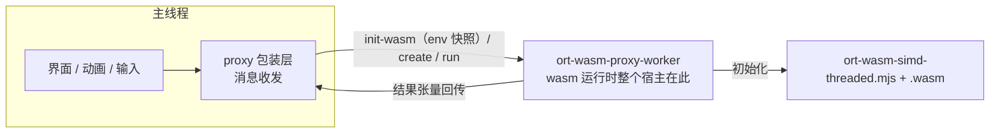

import { Canvas, Controls, Meta } from '@storybook/addon-docs/blocks';
import * as ProxyWorker from './proxy-worker.stories';

<Meta of={ProxyWorker} name="Docs" />

# proxy 工作线程

`env.wasm.proxy = true` 是 onnxruntime-web 内置的「推理搬进 worker」开关：开启后，wasm 后端的初始化、会话与 run 全部宿主到 ort 自管理的工作线程里，主线程只剩消息收发。[WebAssembly 后端](?path=/docs/backend-wasm--docs)讲过，wasm 的 `run` 虽然返回 Promise，计算本身却在 JS 主线程上同步执行——模型一大、批次一多，推理期间页面就不响应输入、动画掉帧。本课回答四个问题：proxy 把什么搬到了哪里、怎么启用与何时定档、哪些张量与环境不适配，以及同思想的 DIY 形态——自建推理 worker——如何取舍。读完应能预测：开了 proxy 之后，推理期间动画是否还走帧、单次 run 耗时与输出会不会变化。



| 项目 | 要点 |
| --- | --- |
| 默认值 | `false`——推理在主线程执行 |
| 设置时机 | 必须在第一个 `InferenceSession.create` 之前；首次初始化定档，运行中翻转不可靠 |
| 生效范围 | wasm 后端的会话；GPU 驻留张量与部分输出选项不适配（见「proxy 的边界」） |
| worker 诞生 | ort 的 ESM 入口模块自身兼任 worker 脚本：同源直接以入口 URL 创建；跨域先 fetch 再以 blob URL 创建 |
| 排队 | worker 是单线程消息循环，run 按调用顺序天然串行 |
| 与多线程 | 正交可叠加：proxy worker 里再按 `numThreads` 派生 pthread 嵌套 worker（需跨域隔离，见[多线程与跨域隔离](?path=/docs/cross-origin-isolation--docs)） |

## proxy 怎么工作

proxy 不是「把 run 函数搬走」，而是把整个 wasm 运行时的宿主换掉。首次创建会话时，ort 检查 `env.wasm.proxy`：为 true 时主线程不再初始化 wasm，而是创建一个名为 `ort-wasm-proxy-worker` 的 worker。这个 worker 里跑的脚本就是 ort 自己的入口模块——同一份代码按启动方式扮演两个角色：在主线程里它是 API 与消息客户端；被以 `ort-wasm-proxy-worker` 命名启动时（worker 的 `self.name`），它切换为 worker 协议端，监听消息并执行真正的 wasm 调用。此后主线程侧的 create / run / release 全部变成协议消息。

### worker 的诞生与脚本来源

worker 脚本的 URL 就是你在主线程 import 的那个 ort 入口模块的 URL。官方部署文档据此给出两种加载路径：

- **同源**（打包器 dev / build 产物）：直接以入口 URL 创建 module worker，无额外步骤。
- **跨域**（CDN script 标签或运行时从 CDN import）：同源策略不允许直接跨域建 worker，ort 先 fetch 入口脚本，用 `URL.createObjectURL` 以 blob URL 创建，并在初始化消息里把推断出的工件路径带给 worker——路径信息不丢失。

环境边界：CSP 受限页面需要允许 `worker-src`（blob 方案还要允许 `blob:`）；1.19 起 wasm 文件与 worker 都可在 CSP 受限环境加载，前提是工件被正常伺服（见[部署](?path=/docs/deployment--docs)）。脚本来源与工件伺服的关系见[WASM 资源伺服](?path=/docs/wasm-serving--docs)。

### 消息协议与天然排队

主线程与 proxy worker 之间只有几种消息：

| 消息 | 作用 |
| --- | --- |
| `init-wasm` | 携带整个 `env` 的快照，触发 worker 内的 wasm 初始化与运行时就绪 |
| `create` / `release` | 会话生命周期；模型以 URL 或缓冲传入 |
| `run` | 输入张量缓冲随消息转移（transfer），worker 内同步计算后回传输出 |
| `copy-from` | 外部缓冲拷入 worker |
| `init-ep` | 初始化执行提供者 |

- **run 天然串行。** worker 是单线程事件循环，上一条 run 的同步计算不结束，下一条消息不会被处理——[InferenceSession](?path=/docs/inference-session--docs)课提到的并发单飞保护，在 proxy 下由消息队列天然满足，应用层不必再写 promise 队列。
- **每次 run 有固定开销。** 消息往返加输入缓冲转移，让单次 run 的墙钟耗时略高于主线程直跑；输入越大、单次推理越短，这个开销占比越明显（下方实例的读数可以直接比较）。

### env 快照与配置时机

- `init-wasm` 携带的是主线程 `env` 的快照：worker 内不再读主线程的 env。所有 wasm 标志（`wasmPaths`、`numThreads`、`proxy`、日志级别……）都必须在第一个会话前、在主线程设置好。[ort.env 全局配置](?path=/docs/ort-env--docs)课的「读一次」语义在 proxy 下同样成立，只是定格点跨了线程。
- **运行中翻转不可靠。** 初始化已按非 proxy 定档、之后再开 proxy，新会话会因 worker 从未创建而抛 `worker not ready`；反向翻转（先 proxy 后关掉）则抛 `WebAssembly is not initialized yet.`——主线程的 wasm 从未初始化过，初始化只发生在 worker 里。换档只能刷新页面。
- **proxy 不能叠加。** 判定条件是 `env.wasm.proxy` 为 true 且当前在主线程（存在 `document`）；在自建 worker 里再开 proxy 无效。

## 推理期间的界面响应性

下方实例用同一输入（28×28 合成图案）、同一模型（mnist-8）、同一后端（wasm 单线程）连续执行 N 次 run，同时用一个旋转标记和帧间隔时间线记录主线程的渲染状况。三档线程形态可切换：主线程直跑是问题现场，ort proxy 与自建 worker 是两种解法。首次运行会下载约 13.6MB 的 wasm 工件，命中 HTTP 缓存后复跑很快；读数全部是页面真实计时，具体数值随设备不同。

<Canvas of={ProxyWorker.Responsiveness} />
<Controls of={ProxyWorker.Responsiveness} />

| 读者操作 | 可观察证据 |
| --- | --- |
| 保持默认「主线程直跑」 | 旋转标记停住，时间线出现一根贯穿推理时段的红色长条；读数里「推理期间最大帧间隔」接近整轮推理总耗时，估算掉帧数十计 |
| 切到「ort proxy」 | 标记持续旋转，帧间隔贴着 16.7ms 参考线；单次推理读数比主线程档略高——消息往返与缓冲转移的开销 |
| 切到「自建 worker」 | 帧间隔与 proxy 档相当；三档的输出类别与置信度一致——同一输入、同一模型的同一结果 |
| 增大「连续推理次数」 | 主线程档的红色长条随次数变长，proxy / 自建档的帧间隔几乎不变 |
| 打开 Show code | 看到该 Canvas 实际执行的 `ort-attempts.ts`——三档分发、proxy 设置与真实计时 |

主线程档整段冻结的机理：`await run()` 之间的衔接发生在微任务里，不把事件循环让给渲染，N 次连跑近似一个 N 倍时长的长任务——这正是 proxy 要消灭的现场。另有一处演示专用技巧需要说明：`env` 是页面级单例且初始化粘滞到刷新，同一个 JS 环境里无法在「主线程直跑」与「proxy」间切换，所以每次尝试都从 CDN 取一份全新的 ort 模块（自建档则派生全新 worker）；真实应用直接 import 包、在首个会话前设好 `env.wasm.proxy` 即可。

## proxy 的边界

- **GPU 驻留张量不可用。** run 的输入若是 GPU 缓冲（gpu-buffer）张量，直接抛 `input tensor on GPU is not supported for proxy`——GPU 缓冲无法跨线程转移。
- **部分会话选项被禁用。** `preferredOutputLocation` 在 create 时抛错；预分配输出的 fetches 同样抛错（输出必须由 worker 新建后回传）。
- **输入缓冲 run 后分离。** 输入张量的 ArrayBuffer 按 transfer 语义随消息进入 worker，发送即从主线程分离——复用同一个输入 Tensor 连续 run 会失败。处理：每次 run 用输入数据新建 Tensor（小输入的构造成本可忽略，上方实例正是这样写的）。
- **脚本来源决定加载方式。** 跨域入口走 blob worker，CSP 需放行；打包器同源入口没有这一层。
- **随 wasm 后端提供。** proxy 属于 wasm 后端的机制；WebGPU 因 GPU 张量限制实际不可用（见第一条）。

## 自建推理 worker

自建 worker 是同一思想的 DIY 形态：应用自己创建 worker，把会话与 run 宿主进去，主线程只发协议消息。与 proxy 的差别只在「谁拥有这个 worker」——下面的骨架展示了需要自己定义的最小协议（请求编号、张量以普通对象传输、Promise 回传）：

```ts
// inference.worker.ts——会话与 run 的宿主
import * as ort from 'onnxruntime-web/wasm';

ort.env.wasm.numThreads = 1;
ort.env.wasm.wasmPaths = 'https://cdn.jsdelivr.net/npm/onnxruntime-web@1.30.0/dist/';

let session: ort.InferenceSession | null = null;

self.addEventListener('message', async (event: MessageEvent<WorkerRequest>) => {
  const { type, id } = event.data;
  try {
    if (type === 'create' && !session) {
      session = await ort.InferenceSession.create(event.data.modelUrl, {
        executionProviders: ['wasm'],
      });
      self.postMessage({ type: 'created', id });
    } else if (type === 'run' && session) {
      // 主线程发来普通对象（dims/type/data），worker 端重建 Tensor
      const feeds = decodeFeeds(event.data.feeds);
      const results = await session.run(feeds);
      self.postMessage({ type: 'result', id, outputs: encodeOutputs(results) });
    }
  } catch (error) {
    self.postMessage({ type: 'error', id, message: String(error) });
  }
});
```

```ts
// 推理客户端——主线程侧的 Promise 封装
export function createInferenceClient() {
  const worker = new Worker(new URL('./inference.worker.ts', import.meta.url), {
    type: 'module',
  });
  const pending = new Map<number, (message: WorkerResponse) => void>();
  let seq = 0;

  worker.addEventListener('message', (event: MessageEvent<WorkerResponse>) => {
    pending.get(event.data.id)?.(event.data);
    pending.delete(event.data.id);
  });

  return {
    run(feeds: FeedInput[]): Promise<WorkerResponse> {
      seq += 1;
      return new Promise((resolve) => {
        pending.set(seq, resolve);
        worker.postMessage({ type: 'run', id: seq, feeds });
      });
    },
    dispose() {
      worker.terminate();
    },
  };
}
```

两种落地的取舍：

| 维度 | `env.wasm.proxy` | 自建 worker |
| --- | --- | --- |
| 代码量 | 一行开关 | 自写协议（编号、队列、序列化、错误回传） |
| worker 归属 | ort 创建与管理 | 应用创建与持有 |
| 排队 | 消息循环天然串行 | 自己实现，也可做成可取消、可合并 |
| 张量传输 | 固定语义：输入 transfer、输出新建 | 自己决定拷贝或转移 |
| GPU 数据 | gpu-buffer 张量抛错 | 同样不能转移 GPU 缓冲；但可把整条 GPU 管线放进 worker |
| 生命周期 | 跟随页面，首次初始化定档 | 随时重建 worker，可多实例 |

上方实例的第三档就是这样的骨架：worker 端在 `inference-attempt.worker.ts`，主线程的派生与协议在 `ort-attempts.ts`（Show code）。

## 最佳实践

- **先用数据决定要不要搬。** 单次 run 只有几毫秒、或推理节奏稀疏时，消息往返与缓冲转移的固定开销可能比省下的卡顿更贵。用[性能测量](?path=/docs/profiling--docs)课的方法量出单次耗时；经验起点是单次 run 超过一帧（约 16ms）就该考虑移出主线程。
- **默认 proxy 起步，需要控制权再自建。** proxy 零协议代码、天然排队；出现可取消请求、请求合并、多会话多模型或自定义张量传输的需求时，再写自建 worker。
- **proxy 下的输入 Tensor 每次新建。** 输入缓冲按 transfer 语义发送，run 之后主线程侧已分离；复用 Tensor 省下的是一次小分配，换来的是下一次 run 直接报错。
- **WebGPU 想下沉，搬整条管线而不是搬张量。** GPU 缓冲无法跨线程；可行形态是让 WebGPU 设备与会话都在自建 worker 内创建，主线程只收发输入输出（[浏览器跑大模型](?path=/docs/llm-in-browser--docs)的 worker 形态与此同源）。
- **proxy 与多线程是两个独立收益。** 无跨域隔离头的环境里，proxy 单线程依然有效——先移出主线程拿到响应性，隔离头就绪后再叠加 `numThreads`。

## 常见问题

- 设了 `env.wasm.proxy = true` 后 create 抛 `worker not ready`。
  proxy 在首次初始化时定档；此前页面已按非 proxy 初始化过 wasm（或翻转过标志），worker 从未创建。把 proxy 设置移到一切会话创建之前，或刷新页面。
- 开了 proxy 反而变慢。
  每次 run 多了消息往返与输入缓冲转移；输入很大或单次推理很短时开销占比高。对照上方实例读数比较两档的单次耗时，小输入小模型保持主线程直跑。
- 第二次 run 报错，提示缓冲已分离（detached）。
  输入张量的缓冲已随上一次 run 转移进 worker。每次 run 用输入数据新建 Tensor（见「proxy 的边界」）。
- 打包器或 Storybook 环境里 worker 起不来，或报 CSP 错误。
  proxy worker 的脚本就是 ort 入口模块的 URL：打包器下确认入口 chunk 与页面同源；入口跨域时 ort 改走 blob URL，需要 CSP 允许 `worker-src blob:`。若报错指向 ort-wasm 工件本身，按[WASM 资源伺服](?path=/docs/wasm-serving--docs)的「位置 + 文件名」公式排查。

## 总结回顾

摘要：

本课把「推理阻塞界面」的出路落到了线程宿主上：`env.wasm.proxy = true` 让 ort 把整个 wasm 运行时搬进自管理的 `ort-wasm-proxy-worker`——worker 脚本就是 ort 入口模块自身，同源直用、跨域走 blob；主线程与 worker 之间只剩 `init-wasm`（env 快照）、`create`、`run`、`release` 几种消息，run 靠消息循环天然串行，代价是每次 run 的往返与转移开销。启用必须在第一个会话前，翻转的两种方向分别以 `worker not ready` 与 `WebAssembly is not initialized yet.` 告终。边界清晰：GPU 驻留张量、`preferredOutputLocation`、预分配输出、输入 Tensor 复用都不适配。自建 worker 用协议代码换来 worker 的所有权，是同一思想的 DIY 形态；三档对比实例用帧间隔时间线与真实计时呈现了「移出主线程」的直观证据。

一句话：

> proxy 的本质是换宿主：ort 把 wasm 运行时整个搬进自管理的 worker，主线程只剩消息收发——界面响应性从此与推理耗时解耦。

知识要点：

- proxy 把什么搬进了 worker？worker 脚本是谁，同源与跨域两种来源各怎么创建？
- 为什么必须在第一个会话前设置 proxy？运行中翻转的两种方向分别报什么错？
- run 的消息语义里输入缓冲发生了什么？对复用输入 Tensor 意味着什么？
- 哪些张量与 session 选项不适配 proxy？
- 自建 worker 与 proxy 在代码量、控制权、张量传输与生命周期上如何取舍？
- WebGPU 场景要利用 worker，正确的下沉方式是什么？

## 参考资料

- [Deploying ONNX Runtime Web](https://onnxruntime.ai/docs/tutorials/web/deploy.html) — 官方部署指南：proxy worker 与多线程 worker 的加载方式（同源直用 / 跨域 object URL）与 CSP 说明
- [onnxruntime-web API 参考](https://onnxruntime.ai/docs/api/js/index.html) — `env.wasm.proxy` 的类型、默认值与语义依据
- [microsoft/onnxruntime 仓库 js 目录](https://github.com/microsoft/onnxruntime/tree/main/js) — proxy-wrapper / proxy-worker 源码：消息协议、env 快照转发与各处抛错文案的依据
