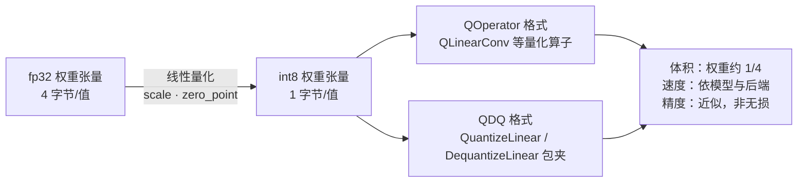

import { Canvas, Controls, Meta } from '@storybook/addon-docs/blocks';
import * as Quantization from './quantization.stories';

<Meta of={Quantization} name="Docs" />

# 量化与体积

把 float32 模型换成现成的 int8 量化变体，是浏览器里最便宜的一刀优化：**权重从 4 字节/值压到 1 字节/值**。但三条收益的可靠程度完全不同——本课的核心判断是：**体积是确定的收益（看字节数就行），速度依模型与后端而定（同机实测才作数），精度是必须验证的假设（双会话对拍）**。怎么做量化（Python 端工具链）不在手册边界内；本课讲怎么挑现成的量化模型、在浏览器里量出它的真实收益。两个实例全程真实运行：字节数、耗时与模型输出全部来自真实执行，计时与输出机器相关，只承诺同机同页同口径下的相对比较。



本课用两对「同一网络的两份权重」做对照，字节数为 2026-10 对 media 端点响应头 `content-length` 的实测：

| 对照对 | fp32 文件 | int8 变体 | 实测字节 | 体积比 |
| --- | --- | --- | --- | --- |
| SqueezeNet 1.0 | squeezenet1.0-9.onnx | squeezenet1.0-12-int8.onnx | 4,952,222 → 1,293,388 | 26% |
| MNIST | mnist-12.onnx | mnist-12-int8.onnx | 26,143 → 10,969 | 42% |

HuggingFace 上的 `model_quantized.onnx`、`model_fp16.onnx`、`model_q4.onnx` 等变体命名规律见[获取模型](?path=/docs/getting-models--docs)课程；核对方法本课全部适用。

## 量化模型是什么

int8 线性量化用一个仿射映射把连续的 float32 值搬到 256 级整数网格上：

```text
w_fp32 ≈ scale × (q − zero_point)      q ∈ int8
```

`scale` 决定网格间距，`zero_point` 平移零点；量化后文件里存的是 int8 整数，外加每层一份量化参数。误差来自 256 级网格的舍入——官方量化文档明确：**量化不是无损变换**。换量化模型不是换格式，而是换一份「近似等价的权重」。

落地到模型文件，有两条格式路线：

- **QOperator**：量化算子有独立的 ONNX 定义（`QLinearConv`、`QLinearMatMul`、`MatMulInteger` 等），图里直接执行 int8 计算。本课 MNIST 对照对就是这种：主要计算由 `QLinearConv` ×2、`QLinearMatMul`、`QLinearAdd` 承担。
- **QDQ**：保留原浮点算子，在算子前后插 `QuantizeLinear` / `DequantizeLinear` 对模拟量化。SqueezeNet 还有同一权重的 QDQ 变体 `squeezenet1.0-13-qdq.onnx`（1,345,213 字节），体积与 QOperator 版相近。

两个贴着选型的边界：

- **不是整张图都被量化。** mnist-12-int8 里的 MaxPool 与 Reshape 仍是浮点算子，靠 Quantize/Dequantize 与量化段衔接；覆盖不到的算子留在浮点区，这既是精度来源也是体积稀释来源。
- **输入签名通常不变。** 量化发生在图内，本课两对模型的输入输出都还是 float32——预处理代码不用改（fp16、q4 等其他变体以会话元数据实测为准）。

## 体积收益

体积是量化唯一「写进文件、必然兑现」的收益——但兑现的是**权重**，文件比例要看权重占比。mnist-12 的权重初始器共 23,992 字节，量化后（含 scale / zero_point）6,284 字节，约 1/4；可文件只从 26,143 缩到 10,969 字节（42%），因为图结构、量化参数这些部分不随权重缩小——模型越小，稀释越明显。权重主导的 SqueezeNet 文件比例（26%）就贴近 1/4。

浏览器里量真实体积有两种方法：

```ts
// 方法一：读响应头的 content-length，读到就中止——不用下载完整文件
const controller = new AbortController();
const response = await fetch(MODEL_URL, { signal: controller.signal });
const bytes = Number(response.headers.get('content-length'));
controller.abort();
```

`content-length` 属于 CORS 安全列表响应头，media 端点 GET 实测返回，普通 fetch 无需预检。两个坑：`HEAD` 请求 media 端点不回 content-length；`Range` 请求头会触发 CORS 预检，而 media 端点未放行该头——浏览器里用 Range 量体积行不通。真要下载时，`buffer.byteLength` 就是文件字节数（方法二）。

下方实例真实跑完两条对照链路：下载两份文件计字节数 → 创建两个会话 → 各预热 1 次、连续计时 M 次。默认 SqueezeNet 对照对约 6.2MB，首次加载需等待；5 分钟内重复打开走 HTTP 缓存。

<Canvas of={Quantization.SizeSpeed} />
<Controls of={Quantization.SizeSpeed} />

| 读者操作 | 可观察证据 |
| --- | --- |
| 打开实例并等待 | 「下载体积」组出现两根条形：int8 文件 1,293,388 字节，读数给出体积比 26% |
| 把「对照对」切到 MNIST | 体积比变为 42%——权重占比小的模型，文件被图结构稀释（上文「为什么不是精确 1/4」的现场版） |
| 看「稳态 run 耗时」组 | 同口预热与采样下的 median 对照（读数机器相关） |
| 打开 Show code | 看到该 Canvas 实际执行的 `size-speed.ts` |

## 速度收益

int8 把权重与激活的搬运量降到 1/4，理论上最受益的是**带宽受限**的场景；实际上能不能快，取决于模型规模、运行时的 int8 内核与后端能力三层：

- **能更快的条件**：模型大到权重搬运占主导；运行时有 int8 GEMM 内核（ORT 的 CPU 实现为 int8 矩阵乘走了专门的整数路径）；后端本身有 int8 加速（如 WebNN 背后的 NPU）。官方在 Xeon CPU 上的对照数据是 SqueezeNet int8 比 fp32 快 1.31x。
- **持平甚至略慢的条件**：小模型的单次 run 由算子调度、内存管理等固定开销主导，省下的带宽排不上号——wasm 单线程基线上尤其如此。本评件在这台机器上的读数接近持平，这就是正常结果，不是测错了。

测量口径完整继承[性能测量](?path=/docs/profiling--docs)课程：预热挡一次性成本 → 多次取样 → 看 median；对比两个模型**必须同机、同页、同口径**，本评件把两份权重放进同一画布就是为了这个。读数环境是无跨域隔离的单线程 wasm（[多线程与跨域隔离](?path=/docs/cross-origin-isolation--docs)），换多线程或 WebGPU 后端，读数会系统性不同，结论要重新实测。

## 精度验证

「几乎无损」是真实数据上的统计结论，不是每个变体的保证。官方对照：SqueezeNet 1.0 int8 的 Top-1 只降 0.65%、Top-5 降 0.14%——这是在 ImageNet 验证集上测出来的；而量化模型的正确性绑定**「模型文件 × 运行时 × 后端」**三元组，变体发布时验证过，不等于在你今天的 ort 版本上可用。

本课的实测反例：mnist-12-int8 是 Model Zoo 官方变体（README 标称错误率 1.1%），但在本课运行环境（ort-web 1.30，wasm）实测**输出恒为全零**——任何输入都一样。写课时用同版本原生 CPU（python onnxruntime 1.30）复核，现象相同：不是 wasm 独有的问题，是这对「量化图 × 当前运行时」的组合已经失效。**加载成功 ≠ 算得对**。

对拍方法：把同一份输入喂给 fp32 与 int8 两个会话，比较 top1、softmax 置信度与 logit 最大绝对差。下方实例把这条链路做成现场：合成一个「0」（黑底白字圆环，MNIST 的同分布输入），fp32 会判对，int8 的输出是否可用读数自会说话；结论一行按实际输出实时计算，不预设。

<Canvas of={Quantization.AccuracyCheck} />
<Controls of={Quantization.AccuracyCheck} />

| 读者操作 | 可观察证据 |
| --- | --- |
| 打开实例并等待 | 合成数字 0：fp32 判为类别 0、置信度接近 1.0；int8 输出恒为 0，置信度 0.1 |
| 把「对拍输入」切到随机噪声 | fp32 的判断随输入变化，int8 仍是恒零——「恒零」与输入无关，是变体失效的探针 |
| 看「结论」读数 | 按实际输出计算：int8 输出最大绝对值为 0 → 该变体在当前运行时已失效 |
| 打开 Show code | 看到该 Canvas 实际执行的 `accuracy-check.ts` |

合成输入只能证明方法与暴露失效；量化变体对真实分布的影响（官方那 0.65%）要靠真实数据——上线前用业务数据把对拍跑一遍，才算验证完。

## 最佳实践

- **按四步顺序选型**：① 用 `content-length` 定体积预算；② 用会话元数据核对签名（int8 变体通常不变，其他变体逐项核对）；③ 同机同口径实测速度；④ 双会话对拍验证精度。四步都有真实读数再进项目。
- **任何量化变体进项目前先对拍，哪怕来自官方 Model Zoo。** 本课的恒零反例就是官方变体；失效可能是变体过旧与运行时演进不兼容，升级 ort 版本后也要重验。
- **找现代量化变体优先 HuggingFace 社区导出**（`model_quantized` 等），命名与来源见[获取模型](?path=/docs/getting-models--docs)课程；旧量化变体当候选不当默认。
- **量化不是唯一一刀。** WebGPU 上 fp16 变体常更合适（[WebGPU 后端](?path=/docs/backend-webgpu--docs)）；q4 更小但失真更大；换一个更小的架构往往比量化收益更大，两者不冲突。

## 常见问题

- int8 模型 `InferenceSession.create` 成功，输出却恒为 0（或明显乱值）。
  先跑本课的对拍流程确认是变体失效而不是预处理写错：同一输入喂 fp32 与 int8 两个会话，int8 输出恒定而 fp32 正常，即可定位为变体在当前运行时上失效。处理：换该模型的其他量化变体（如 QDQ 版）或先用 fp32；并到模型来源处确认变体的维护状态。本评件就是现场。
- 换了 int8 却没变快，是不是哪里错了。
  不是错，小模型在单线程 wasm 上持平是常见结果。先固定口径（预热、median、线程形态）重测排除测量误差；速度收益看大模型、带宽受限场景与有 int8 加速的后端，没有就接受「用速度换体积」。
- 量化后文件不是精确的 1/4。
  1/4 兑现在权重上；文件里还有图结构、量化参数等不缩小的部分。权重占比越小（模型越小），文件比例越偏离 1/4——本课两对实测 26% 与 42% 就是两端。

## 总结回顾

摘要：

本课围绕「换现成 int8 量化模型」建立了三条核对线。量化用仿射映射把 fp32 权重压到 256 级 int8 网格（`scale` 定间距、`zero_point` 定零点），落地为 QOperator 与 QDQ 两种图格式，输入签名通常不变；它不是无损变换。体积是确定的收益：权重确实缩到约 1/4，文件比例由权重占比决定——SqueezeNet 实测 26%，MNIST 被图结构稀释到 42%，浏览器里用 `content-length` 或下载计数就能量出真实字节数。速度依模型与后端而定：带宽受限的大模型、有 int8 内核的运行时与专用后端才受益，小模型在单线程 wasm 上实测持平是正常结果，对比必须同机同口径。精度必须实测验证：官方对照只掉 0.65% Top-1 是统计结论，本课实测官方 mnist-12-int8 在 ort 1.30 上输出恒为全零——对拍方法（同一输入、双会话、比 top1 / 置信度 / 最大绝对差）加上线前的真实数据验证，才能把「加载成功」变成「算得对」。

一句话：

> 量化把体积变成确定的收益、把速度变成要实测的问题、把精度变成必须验证的假设——选型就是三件事各用各的核对方法。

知识要点：

- int8 线性量化的映射公式是什么？`scale` 与 `zero_point` 各管什么？
- QOperator 与 QDQ 两种格式差在哪？本课对照对用的是哪种？
- 为什么权重缩小到 1/4，文件却不一定是 1/4？什么决定文件级比例？
- 浏览器里怎么量模型文件的真实体积？为什么 `Range` 请求在这个场景不可用？
- int8 什么时候更快、什么时候持平？对比两个模型必须固定什么口径？
- 量化模型的精度为什么必须实测？本课的恒零反例说明了什么？
- 对拍方法的步骤是什么？合成输入与真实数据各验证什么？

## 参考资料

- [ONNX Runtime 官方量化文档（Quantize ONNX models）](https://onnxruntime.ai/docs/performance/model-optimizations/quantization.html) —— QDQ / QOperator 格式、scale 与 zero_point、「量化不是无损变换」的官方口径
- [ONNX Model Zoo：SqueezeNet](https://github.com/onnx/models/tree/main/validated/vision/classification/squeezenet) —— fp32 / int8 / QDQ 变体表与官方精度对照（Top-1 −0.65%、CPU 1.31x）
- [ONNX Model Zoo：MNIST](https://github.com/onnx/models/tree/main/validated/vision/classification/mnist) —— mnist-12-int8 的量化方式（Intel Neural Compressor + onnxruntime backend）与标称错误率
- [onnxruntime-web API 参考](https://onnxruntime.ai/docs/api/js/index.html) —— `InferenceSession.create` 接受 `ArrayBuffer`、会话输入输出元数据的类型
- [HuggingFace Models（ONNX 过滤）](https://huggingface.co/models?library=onnx&sort=trending) —— 找 `model_quantized` 等社区量化变体的入口
