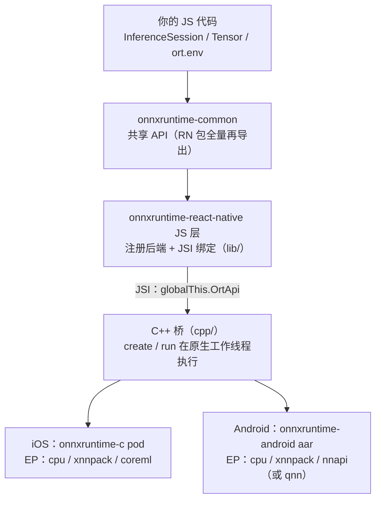

import { Meta } from '@storybook/addon-docs/blocks';

<Meta id="react-native" title="按需分支/React Native" name="Docs" />

# React Native

当推理要从浏览器搬进 iOS / Android 原生应用，就换用 onnxruntime-react-native。它与 onnxruntime-node 是同一思路的两个分支：共享 onnxruntime-common 的同一套 API（`InferenceSession`、`Tensor`、`ort.env`），把「执行来源」换成移动平台的原生 ONNX Runtime 库，经 JSI 桥调用。本课是概览：讲清这个包装了什么、装进工程时发生什么、移动端砍掉了哪些 Web 能力又用哪些原生加速替代，以及在既有浏览器知识上迁移要注意什么；React Native 工程搭建本身不属于本课。

三个贯穿全课的事实：

- **API 面与 web 同源。** 包入口 `export * from 'onnxruntime-common'`，会话、张量、env 用法原样适用；差异集中在模型来源、EP 清单和版本线。
- **npm 版本线已与 web 分叉。** onnxruntime-react-native 的 npm 最新稳定版是 1.24.3（2026-10 查证），而 onnxruntime-web 稳定版已到 1.30.0——对照教程与跨端共享代码时先对版本。
- **没有 WebGPU，加速靠原生 EP。** 移动端不存在 WebGPU/WebGL/WebNN，性能路径由 CoreML（iOS）、NNAPI 或 QNN（Android）承担。

本课断言来自 2026-10 的三方核对：npm dist-tags 与版本列表、onnxruntime-react-native@1.24.3 npm 包解包核对（package.json、`lib/*.ts`、`cpp/` 源码、podspec 与 build.gradle）、官方 Get started 页面与 js/react_native README 原文。本工作区是浏览器示例工程，未安装本包，课程不提供 RN 运行输出；无法核实的细节均已标注。



| 回查项 | 值（2026-10 查证） |
| --- | --- |
| npm 包 | `onnxruntime-react-native` |
| npm 最新稳定版 | 1.24.3（onnxruntime-web 已到 1.30.0，两条版本线分叉） |
| JS API 底座 | onnxruntime-common@1.24.3（精确锁定） |
| 支持平台 | iOS 15.1+（podspec）；Android（minSdk 随宿主工程；ABI 默认 armeabi-v7a / arm64-v8a / x86 / x86_64） |
| 可用 EP | `cpu`、`xnnpack`（全平台）+ `coreml`（iOS）+ `nnapi`（Android 默认）/ `qnn`（Android 可选）；无 webgpu / webgl / webnn |
| 模型来源 | 设备文件路径（README 明列不支持 ArrayBuffer 加载） |
| 版本读数 | `ort.env.versions['react-native']` |
| 后端查询 | `listSupportedBackends()` |

## 快速上手

最小闭环：安装 → 原生侧注册（autolinking 或 Expo 插件）→ 从文件路径建会话 → run 一次。

```bash
npm install onnxruntime-react-native
```

bare RN 项目由 autolinking 自动注册原生模块，无需手动改 settings.gradle、build.gradle 或 MainApplication。Expo 托管 / prebuild 工作流在 app.json / app.config.js 里加插件，然后执行 `npx expo prebuild`：

```json
{
  "plugins": ["onnxruntime-react-native"]
}
```

```ts
// 运行环境：React Native 工程（真机或模拟器）。本工作区未安装本包，
// 以下为官方用法形态，不是本工作区的运行输出。
import * as ort from 'onnxruntime-react-native';

console.log(ort.env.versions['react-native']); // 读数等于所装包版本（version.ts）

// create 的 string 参数是设备上的文件路径（app bundle 或沙盒内），不是 URL
const session = await ort.InferenceSession.create(
  '/absolute/path/on/device/model.onnx',
  { executionProviders: ['nnapi', 'cpu'] }, // Android；iOS 换 ['coreml', 'cpu']
);

const results = await session.run({
  [session.inputNames[0]]: new ort.Tensor('float32', inputData, dims),
});
console.log(results[session.outputNames[0]].dims);
```

这段代码与浏览器课的第一次推理（1.3）逐行同构，只有两处换血：import 的包名，以及 `create` 的路径语义。其余差异（EP 名单、env 缩水、限制清单）在后面三节展开。

## 包结构与安装

### 包内结构与入口

npm 包（1.24.3 解包核对）同时携带三层东西：TypeScript 源码与编译产物、C++ JSI 桥、两端原生模块源码：

| 包内路径 | 内容 |
| --- | --- |
| `lib/` | TypeScript 源码（index、backend、binding、api、version） |
| `dist/commonjs`、`dist/module`、`dist/typescript` | 编译产物（`main` / `module` / `types` 入口） |
| `cpp/` | JSI 绑定：InferenceSessionHostObject、SessionUtils、AsyncWorker 等 |
| `ios/` + `onnxruntime-react-native.podspec` | iOS 原生模块与 CocoaPods 描述（依赖 onnxruntime-c，`-DUSE_COREML`） |
| `android/` | Android 原生模块（Java + CMake）；build.gradle 从 Maven 拉 onnxruntime-android aar |
| `app.plugin.js` + `unimodule.json` | Expo config plugin 与 Expo modules 清单 |

package.json 的入口字段决定各环境拿到哪份代码：`"react-native": "lib/index"`——Metro 直接消费 TypeScript 源码；`main` / `module` / `types` 指向 `dist/`。

JS 与原生的接线只有一条：`lib/binding.ts` 取 `NativeModules.Onnxruntime` 并调用 `Module.install()`，原生侧经 JSI 把 `OrtApi` 挂到 `globalThis`；install 没成功时，后续任何调用都踩到兜底 Proxy 抛出的 `OrtApi is not initialized...`。`create` 与 `run` 在原生侧的 AsyncWorker（`std::thread`）执行，返回 Promise 再回 JS 线程回调（1.24.3 `AsyncWorker.h` 源码）——推理不占 JS 线程，这是与浏览器 `proxy` 选项（3.1.3）不同的实现位置。

两个写在**应用根 package.json** 的标志位改变原生构建：

- `"onnxruntimeExtensionsEnabled": "true"`：链接 onnxruntime-extensions（iOS 落 onnxruntime-extensions-c，Android 落 onnxruntime-extensions-android），JS 层自动把会话选项 `ortExtLibPath` 指向扩展库路径；这是官方 Get started 页列出的唯一配置开关。
- `"onnxruntimeUseQnn": "true"`：Android 构建改拉 onnxruntime-android-qnn aar 并编译 QNN EP，替换默认的 NNAPI（build.gradle 源码）。

### 原生库的来源与版本

关键判断：**npm 包版本只锁 JS 层，原生 ORT 版本在构建期单独解析。**

- iOS：podspec 依赖 `onnxruntime-c` 且未写版本约束，CocoaPods 解析当时最新可用版本，结果固化在 Podfile.lock。
- Android：build.gradle 写的是 `com.microsoft.onnxruntime:onnxruntime-android:latest.integration@aar`，构建期从 Maven Central 取最新。

后果与纪律：同一个 npm 版本在不同时间重装依赖、重新构建，可能链接到不同的原生 ORT。升级或重装后先核对实际链接的原生版本（iOS 看 Podfile.lock，Android 从构建依赖解析确认）再发版。这与 web 包「JS、wasmPaths、读数三处对齐」的工件伺服负担（3.1.1）不同：RN 没有工件伺服，但有构建期版本漂移。

## 与 onnxruntime-common 的关系

包入口源码只有三行实质内容（`lib/index.ts`）：`export * from 'onnxruntime-common'` 全量再导出共享 API；把编译进本包的后端以优先级 1 注册进 common 的后端表；定义版本读数 `env.versions['react-native']`。所以本手册已讲过的能力在 RN 的落点是：

| 本手册已讲过的能力 | 在 RN 的落点 |
| --- | --- |
| `InferenceSession.create` / `run` / `inputNames`（2.2.1） | 原样适用；string 参数语义是设备文件路径 |
| `Tensor` 三要素 dims/type/data（2.1.1） | 原样适用（common 的 Tensor 是纯 JS） |
| `session.inputMetadata` / `outputMetadata` 签名 | 原样可用（经 ValueMetadata 映射） |
| `ort.env.logLevel` | 生效：首次 `create` 时读取并经 `initOrtOnce` 传给原生（backend.ts） |
| `ort.env.versions` | 键为 `'react-native'`（对照 web 的 `'web'`、node 的 `'node'`） |
| `ort.env.wasm.*`（wasmPaths、numThreads、proxy） | 整组无效——RN 没有 wasm 工件，也没有 proxy 选项 |
| `executionProviders` 数组顺序与回退（2.3.3） | 语义一致；可用名单见下一节 |

SessionOptions 在 common 基础上扩展了一个 RN 专属字段 `ortExtLibPath`（自动注入，不需手写）。原生侧实际解析的会话选项包括 `intraOpNumThreads`、`interOpNumThreads`、`freeDimensionOverrides`、`optimizedModelFilePath`、`enableProfiling` 等（1.24.3 SessionUtils.cpp，清单以源码为准）——与 Node 侧共用的那组原生会话选项（5.1）大体同源。

## 移动端平台限制

共同模型：RN 桥背后的原生 ORT 与 web 的 wasm/JSEP 完全不同——能挂哪些 EP 由**构建期条件编译**决定，而不是浏览器运行时能力检测。Web 系后端（`webgpu`、`webgl`、`webnn`）整体缺席：它们依赖的 API 在移动原生环境不存在。

### 执行提供程序

1.24.3 包源码（SessionUtils.cpp 的 supportedBackends 常量与构建脚本的条件编译）编入的 EP：

| EP | 平台 | 编入条件 | 选项对象（原生解析） |
| --- | --- | --- | --- |
| `cpu` | 全平台 | 恒有 | `{ useArena }` |
| `xnnpack` | 全平台 | 恒有 | 无专属选项 |
| `coreml` | iOS | 恒有（podspec `-DUSE_COREML`） | `{ coreMlFlags }` |
| `nnapi` | Android | 默认编入 | `{ useFP16, useNCHW, cpuDisabled, cpuOnly }` |
| `qnn` | Android | `"onnxruntimeUseQnn": "true"` | `{ backendType, backendPath, enableFp16Precision }` |

运行时查询（元素结构 `SupportedBackend { name }` 来自包内 api.ts；具体名单按构建条件编译推断，未实测）：

```ts
// 运行环境：React Native 工程
const backends = ort.listSupportedBackends();
// Android 形如 [{ name: 'cpu' }, { name: 'xnnpack' }, { name: 'nnapi' }]
```

两条使用规则：`executionProviders` 数组顺序与回退语义与 web 一致（2.3.3），原生加速分区落不下的算子自动回 CPU——显式带上 `'cpu'` 兜底照旧成立。请求了未编入的 EP（比如照搬 web 侧写 `'webgpu'`）会在建会话时抛 `Unsupported execution provider: <名字>`（SessionUtils.cpp 的 throw JSError），报错本身就是判断「编没编入」的依据。

线程与内存：`run` 在原生工作线程执行、不占 JS 线程（见「包内结构与入口」），算子内并行经 `intraOpNumThreads` 配置。内存侧没有 RN 专属官方文档；可依据的事实是会话常驻持有编译后的模型，而移动设备内存配额紧张、后台应用更易被系统回收——模型选型按「能常驻的大小」而不是「能加载的大小」评估，量化模型（3.2.2）在移动端是默认起点。

### 文档明列的不支持项

js/react_native README（main 与 1.24.3 一致）明确列出当前不支持：

- **无符号数据类型的张量**——Android 设备上的 uint8 是唯一例外。
- **用 ArrayBuffer 加载模型。**

一条核对记录：1.24.3 包内 `lib/backend.ts` 已出现 Uint8Array 分支（转 buffer + byteOffset/byteLength 传给原生），但官方 README 仍把 ArrayBuffer 加载列为不支持。以 README 与真机实测为准：关键链路用文件路径，不要押注 buffer 路径。

算子覆盖按 README：1.13 起同时支持 ONNX 与 ORT format 模型，且包含全部算子与类型（更早的包走 ORT Mobile 的 MobileOps 子集）；npm 最新 1.24.3 在此线之上。

## 从浏览器迁移

import 换成 `'onnxruntime-react-native'` 之后，推理代码的变化集中在五处：

1. **模型来源：URL → 设备文件路径。** 浏览器课「URL 直连」的习惯失效——`create` 的 string 参数被当作本地路径。模型要么打进 app bundle，要么首启下载到沙盒目录再传路径（下载用项目选定的文件系统方案，本课不展开）；`create` 之前路径必须真实存在。
2. **EP 清单换血。** webgpu / webgl / webnn 不存在，性能路径换成 `coreml`（iOS）、`nnapi` / `qnn`（Android）；声明方式与回退语义不变。
3. **ort.env 大幅缩水。** `wasm.*`（wasmPaths、numThreads、SIMD、proxy）整组无意义，跨域隔离（3.1.2）问题整体消失；`logLevel` 与 `versions` 仍然可用。
4. **预处理没有 DOM。** 没有 canvas / Image / ImageData，像素解码与布局转换用纯 JS 或 RN 图像库——纪律与 Node 侧（5.1）相同：共享内核只 import common，不触碰宿主全局。
5. **调试手段变化。** 没有浏览器 DevTools；用 `ort.env.logLevel` 配合真机日志观察建会话与 EP 分区告警。

## 最佳实践

- **共享内核绑 common，环境差异隔离在两端。** 与 5.1 的跨环境纪律同源：预处理 + run + 后处理只 import onnxruntime-common。RN 侧额外注意：不要让 onnxruntime-web 与 onnxruntime-react-native 混装互传张量——两者锁定的 common 版本不同（1.30.0 对 1.24.3），两份 common 就是两份 Tensor 构造器。
- **EP 显式声明 + cpu 兜底。** iOS 写 `['coreml', 'cpu']`，Android 写 `['nnapi', 'cpu']`，让分区落不下的算子自然回落；跨平台复用同一份会话代码时按平台选择数组，并用 `listSupportedBackends()` 做运行时校验。
- **把原生版本当独立变量管理。** npm 版本不等于原生 ORT 版本：升级 npm 包或重装依赖后核对 Podfile.lock（iOS）与 Android 依赖解析；发版固化一次构建结果。
- **模型按移动端约束选型。** 优先 int8 量化变体（3.2.2）；体积在「打进 app bundle（免下载、首包大）」与「运行时下载到沙盒（首包小、依赖网络）」之间取舍；估算常驻内存而不是磁盘体积。

## 常见问题

- 建会话报 `OrtApi is not initialized. Please make sure Onnxruntime installation is successful.`。
  原生模块的 `install()` 没有执行——autolinking 未生效或原生依赖没装上。bare RN 核对 autolinking 后重新构建；Expo 核对 plugins 里是否含 `'onnxruntime-react-native'` 并重新 prebuild；iOS 确认 pods 安装完成。
- 建会话抛 `Unsupported execution provider: <名字>`。
  请求了没编入本包的 EP，常见原因是照搬 web 侧清单（如 `'webgpu'`）。改用本课 EP 表里的名单；注意 Android 启用 QNN 后 `nnapi` 不再编入。
- 装到的版本和 web 教程对不上（1.24.3 对 1.30.0）。
  不是装错：RN 包的 npm 发布线本身落后于 web（dist-tags 的 dev 也停在 2025-03 的旧快照）。跨端共享代码只依赖 common 的稳定 API 面，版本敏感特性留给平台侧；升级决策以 npm dist-tags 为准。
- 模型里有 uint16 / uint32 / uint64 张量，真机行为异常。
  README 明列 RN 不支持无符号数据类型张量（Android 的 uint8 除外）。让模型导出侧改用有符号整型或浮点，而不是在端侧绕。

## 总结回顾

摘要：

onnxruntime-react-native 把 onnxruntime-common 的同一套 API 桥接到 iOS / Android 原生 ONNX Runtime：npm 包同时携带 TypeScript 源码（Metro 直接消费）、C++ JSI 桥与两端原生模块，autolinking 或 Expo config plugin 完成原生注册。npm 版本线与 web 已分叉（1.24.3 对 1.30.0），且 npm 版本只锁 JS 层——iOS 的 onnxruntime-c pod 与 Android 的 onnxruntime-android aar 在构建期单独解析，Podfile.lock 与依赖核对是版本纪律的一部分。移动端没有 WebGPU/WebGL/WebNN，加速 EP 由构建期条件编译决定：cpu、xnnpack 恒有，iOS 加 coreml，Android 默认 nnapi、启用 QNN 后替换；请求未编入的 EP 会直接抛错。README 明列不支持无符号张量（Android uint8 例外）与 ArrayBuffer 加载；`create` 只认设备文件路径。JSI 实现下 create/run 在原生工作线程执行、不占 JS 线程，`ort.env` 缩水为 logLevel 与 versions。

一句话：

> 同一套 API 桥进原生 app：npm 版本只锁 JS 层，EP 由构建期决定——文件路径替代 URL，CoreML/NNAPI 替代 WebGPU，env 配置缩水到 logLevel。

知识要点：

- onnxruntime-react-native 与 web / node 包共享什么？包入口的三行实质内容是什么？
- npm 包里装了哪三层东西？Metro 消费哪份代码？JS 与原生靠什么接线？
- 为什么 npm 版本不能代表原生 ORT 版本？iOS 与 Android 的原生库各自从哪里来？
- 当前编入的 EP 有哪些？哪些条件下变化？请求未编入的 EP 会发生什么？
- README 明列的不支持项有哪两条？`create` 的 string 参数在 RN 里是什么语义？
- 从浏览器迁移要换掉哪些假设（模型来源、env、预处理、线程）？

## 参考资料

- [Get started with ONNX Runtime React Native（官方）](https://onnxruntime.ai/docs/get-started/with-javascript/react-native.html) —— 安装、import 写法与 `onnxruntimeExtensionsEnabled` 开关的一手依据
- [microsoft/onnxruntime 仓库 js/react_native README](https://github.com/microsoft/onnxruntime/tree/main/js/react_native) —— autolinking 与 Expo 插件说明、不支持清单、算子与格式支持的官方声明
- [onnxruntime-react-native npm 发布页](https://www.npmjs.com/package/onnxruntime-react-native) —— 版本记录（2026-10 查证 latest = 1.24.3）
- [onnxruntime-web API 参考（官方）](https://onnxruntime.ai/docs/api/js/index.html) —— `InferenceSession`、`SessionOptions`、`Tensor`、`ort.env` 的共享真源（onnxruntime-common 文档）
