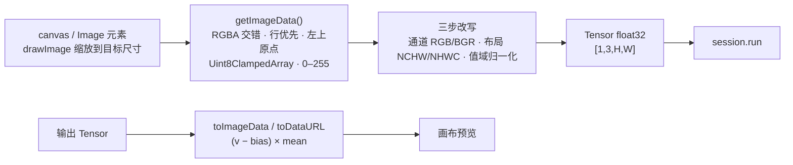

import { Canvas, Controls, Meta } from '@storybook/addon-docs/blocks';
import * as TensorImage from './tensor-image.stories';

<Meta of={TensorImage} name="Docs" />

# 图像与 Tensor 互转

模型不吃 `` 也不吃 canvas——它吃按签名排布的数字。本课讲清浏览器像素与模型张量之间的全部距离：ImageData 是 RGBA 交错、行优先、0–255 的字节缓冲，模型输入是按 dims 平铺的 float32；从一侧到另一侧只有四件事——**缩放、通道、布局、值域**。读完本课，你应当能预测：给定任意图像模型的输入签名与归一化约定，能立刻写出或选出正确的转换，也能判断「不报错但结果很差」的转换错在哪一步。

三个贯穿全课的事实：

- **转换可以打包，也可以手写。** `Tensor.fromImage` 用一组默认值覆盖最常见组合（RGB、NCHW、÷255）；一个 15 行的循环给出全部自由度（NHWC、batch、自定义归一化）。两者数值可以完全对齐。
- **缩放不在转换里。** 官方辅助的 `resizedWidth/resizedHeight` 在 1.30.0 只改变读回区域（裁剪/补边），不做插值缩放；缩放的正确位置是 `drawImage` 到目标尺寸的 canvas。
- **反向同样存在。** 输出张量经 `toImageData` / `toDataURL` 回到像素，`norm` 参数是正向归一化的逆运算，值域不匹配时失真而不报错。



| 调用 / 选项 | 默认值 / 回查要点 |
| --- | --- |
| `Tensor.fromImage(image, options?)` | 异步返回 `Promise<Tensor>`；输入接受 ImageData、HTMLImageElement、ImageBitmap、URL 字符串 |
| `tensorFormat` / `tensorLayout` | 默认 `'RGB'` / `'NCHW'`；输出恒为 `[1, C, H, W]`，传 `'NHWC'` 直接抛错 |
| `norm` | 默认 `{ mean: 255, bias: 0 }`（像素 ÷ 255）；公式 `(像素 + bias) ÷ mean`，支持按通道数组 |
| `tensor.toImageData(options?)` | 同步返回 ImageData；默认 `format: 'RGB'`、`tensorLayout: 'NCHW'`；逆公式 `(值 − bias) × mean` |
| `tensor.toDataURL(options?)` | 与 `toImageData` 同参，返回 data URL 字符串；逐像素绘制，只适合调试预览 |

本课实例不创建会话、不加载模型：`fromImage`、`toImageData` 都是纯 JS 实现，转换不需要初始化任何后端。张量本身的 `dims/type/data` 三要素与类型映射见 [Tensor 与数据类型](?path=/docs/tensor--docs) 课程。

## 快速上手

以下代码在浏览器页面里执行（Vite 项目或 `<script type="module">`），顶层 `await` 直接可用：

```ts
import { Tensor } from 'onnxruntime-web';

// canvas → ImageData：RGBA 交错、0–255 的字节缓冲
const context = canvas.getContext('2d')!;
const imageData = context.getImageData(0, 0, 32, 24);

// ImageData → Tensor：默认 [1,3,H,W] float32，像素 ÷ 255
const tensor = await Tensor.fromImage(imageData, { tensorFormat: 'RGB' });

console.log(tensor.dims); // [1, 3, 24, 32]
console.log(tensor.type); // 'float32'
```

得到的 `tensor` 就是 [第一次推理](?path=/docs/first-inference--docs) 课程里 feeds 的值：`{ [session.inputNames[0]]: tensor }`。

下方实例真实运行了这个调用，并对照 `fromImage` 的三种输入形态。左面板是 32×24 的页面内图案，右面板是每次转换产物经 `toImageData` 的还原画面——转换对不对，眼睛就能核对。

<Canvas of={TensorImage.FromImage} />
<Controls of={TensorImage.FromImage} />

| 读者操作 | 可观察证据 |
| --- | --- |
| 选择「ImageData（先缩放）」 | 「与手写基准最大差」读数为 0——`fromImage` 与手写循环完全等价 |
| 切到「HTMLImageElement」 | 输出形状变为 `[1, 4, 24, 32]`：img 输入强制 4 通道 RGBA |
| 切到「ImageData + resized 参数」 | 右面板只剩左上角内容：resized 参数在 1.30.0 是裁剪，不是缩放 |
| 打开 Show code | 看到该 Canvas 实际执行的 `from-image.ts` |

后两种形态的差异正是官方辅助的边界所在，完整清单见「Tensor.fromImage 的选项与边界」。这条转换链放进完整应用（选模型、预处理、推理、展示）的样子，见 [图像分类应用](?path=/docs/image-classification--docs) 课程。

## 手写转换

`fromImage` 藏起了三步改写；理解它们，才能在模型签名不配合时自己动手。先建立两侧的模型——ImageData 有四个事实：

1. **通道交错（HWC）**：每像素 4 字节按 R、G、B、A 排列，同一个像素的通道在内存里相邻。
2. **行优先、左上原点**：像素 `(x, y)` 在 `y × W + x` 处，y 向下增长。
3. **0–255 整数**：Uint8ClampedArray，写入时自动钳位与四舍五入。
4. **尺寸即像素数**：`getImageData(w, h)` 给出的缓冲正好是 `w × h × 4` 字节，与 CSS 显示尺寸无关。

模型输入张量则是按签名平铺的一维 float32。两者之间只有三步改写：

1. **缩放**（可选前置）：`drawImage` 到目标尺寸的 canvas，浏览器负责插值；
2. **通道**：取 RGB 丢 alpha；按模型约定排 RGB 或 BGR；
3. **布局 + 值域**：HWC 交错改写成 CHW 分面（NHWC 模型则保持交错），再除以 255 或按 mean/std 归一。

核心循环（实例运行的完整版本见下方 Show code）：

```ts
const { width: W, height: H } = image; // ImageData
const plane = H * W;
const data = new Float32Array(3 * plane); // [1,3,H,W] 的平铺缓冲

for (let y = 0; y < H; y += 1) {
  for (let x = 0; x < W; x += 1) {
    const i = (y * W + x) * 4; // RGBA 交错：通道相邻
    for (let c = 0; c < 3; c += 1) {
      const v = image.data[i + c] / 255; // 0–255 → [0,1]，丢弃 alpha
      data[c * plane + y * W + x] = v; // HWC → CHW：通道分面
    }
  }
}
const tensor = new Tensor('float32', data, [1, 3, H, W]);
```

下方实例用页面内生成的图案（红色圆盘、绿色斜带、蓝色渐变，三个通道特征分明）运行这段转换，并把张量按通道画回画面。三个控件分别对应三步改写：

<Canvas of={TensorImage.Handwritten} />
<Controls of={TensorImage.Handwritten} />

| 读者操作 | 可观察证据 |
| --- | --- |
| 把「通道顺序」切到 BGR | 通道 0 与通道 2 的平面内容互换（红盘与蓝渐变对调） |
| 把「目标布局」切到 NHWC | 平面画面不变，读数「索引公式」变为像素交错——布局改的是内存排布，不是画面；NHWC 只有手写能给 |
| 把「归一化」切到 ImageNet | 「值域」读数出现负值（`(v − μ) / σ`）；平面亮度分布不变（线性变换被极值拉伸抵消） |
| 打开 Show code | 看到该 Canvas 实际执行的 `image-to-tensor.ts` |

边界一句话：需要 NHWC、batch 大于 1 或自定义值域逻辑时，改写点都在这个循环里——NHWC 换写入行为 `data[(y * W + x) * 3 + c]`，batch 是外层再套一层循环并把 dims 改成 `[N, 3, H, W]`。反过来，模型签名是 `[1, 3, H, W]` 的常见分类模型，`fromImage` 的默认输出直接可用。

## Tensor.fromImage 的选项与边界

`fromImage(image, options?)` 按输入类型分派，行为差异都来自「像素怎么读回来」：

| 输入类型 | 行为与限制 |
| --- | --- |
| ImageData | 最可控：输入恒按 RGBA 读取，`tensorFormat` 可选 RGB / BGR / RGBA；不带 resized 参数时直接读 `image.data`，最快 |
| HTMLImageElement | 内部先画到 canvas 再取像素；`tensorFormat` 不可指定（传了抛错），输出恒为 RGBA 4 通道 |
| ImageBitmap | 必须传 options（至少空对象）；经 canvas 读回 |
| URL / data URL 字符串 | 内部 `new Image()` 并自动带 `crossOrigin='anonymous'`；按图像原始尺寸转换 |

选项默认值见开场参考表。1.30.0 实测的行为边界：

- **输出恒为 `[1, C, H, W]`。** batch 固定 1，没有批处理选项；多张图要么逐张转换后手写拼接，要么整体手写。
- **`tensorLayout` 只支持 `'NCHW'`。** 传 `'NHWC'` 直接抛错 `NHWC Tensor layout is not supported yet`。
- **`dataType: 'uint8'` 未实现。** 选项类型里声明了 `'float32' | 'uint8'`，但实现固定返回 float32；需要 uint8 输入的模型自己用 `Uint8Array` 装 0–255 原值。
- **norm 是一个公式：`(像素 + bias) ÷ mean`。** 支持数值（全通道）或 3–4 元数组（逐通道），常见预处理约定都能换算（见最佳实践）。
- **纯 JS，不碰后端。** 不创建会话、不加载 wasm 工件，可以在任何时机调用，也不依赖 `env.wasm` 配置。

这些边界决定了选择：快速原型、单张图、RGB/BGR + NCHW 的组合，用 `fromImage`；签名或预处理不标准时，回到上面的手写循环。

## 张量还原成图像

反方向同样是一组固定改写：`tensor.toImageData()` 把 float32 张量还原成 ImageData，`putImageData` 即可上屏；`tensor.toDataURL()` 同参返回 data URL 字符串（内部逐像素 `fillRect`，只适合调试预览）。`norm` 在这里是逆公式 `(值 − bias) × mean`，默认（mean 255、bias 0）假定值域 `[0,1]`：

```ts
// 值域 [0,1] 的输出：默认 norm 即可，(v − 0) × 255
const image = tensor.toImageData();
ctx.putImageData(image, 0, 0);

// 值域 [-1,1] 的输出（GAN / 扩散类模型常见）：指定逆 norm
const restored = tensor.toImageData({ norm: { mean: 127.5, bias: -1 } }); // (v + 1) × 127.5
```

值域与 norm 不匹配时不报错：ImageData 写入 Uint8ClampedArray 会自动钳位，表现为压黑与饱和。下方实例用同一张图案构造 `[1,3,12,16]` 张量，左面板用与值域匹配的 norm 还原，右面板固定用默认 norm：

<Canvas of={TensorImage.TensorToImage} />
<Controls of={TensorImage.TensorToImage} />

| 读者操作 | 可观察证据 |
| --- | --- |
| 把「张量值域」切到 `[-1, 1]` | 右面板明显失真（负值钳到 0、高位饱和到 255），左面板正常，读数给出匹配的 norm 参数 |
| 读「还原抽样」 | 显示同一数值经逆公式映射回的字节值，可手工验算 `(v − bias) × mean` |
| 打开 Show code | 看到该 Canvas 实际执行的 `tensor-to-image.ts` |

两个补充：`toImageData` 支持 `tensorLayout: 'NHWC'` 读取——与 `fromImage` 只写 NCHW 不对称；不想依赖实例方法时，逆变换手写同样只有几行：

```ts
const image = new ImageData(W, H);
for (let y = 0; y < H; y += 1) {
  for (let x = 0; x < W; x += 1) {
    const i = (y * W + x) * 4;
    image.data[i] = chw[0 * H * W + y * W + x] * 255; // Uint8ClampedArray 自动钳位
    image.data[i + 1] = chw[1 * H * W + y * W + x] * 255;
    image.data[i + 2] = chw[2 * H * W + y * W + x] * 255;
    image.data[i + 3] = 255;
  }
}
```

## 最佳实践

- **缩放交给 `drawImage`，别指望 resized 参数。** 先 `drawImage` 到目标尺寸的离屏 canvas 再 `getImageData`；需要更平滑的缩放可设 `ctx.imageSmoothingQuality = 'high'`。`fromImage` 的 `resizedWidth/resizedHeight` 在 1.30.0 只裁剪/补边，快速上手实例的第三形态就是证据。
- **norm 换算记一个公式。** 模型文档常写 `(x / 255 − mean) / std`；对照 `(像素 + bias) ÷ mean`，换算为 `mean = 255 × std`、`bias = −255 × mean`（逐通道数组）。ImageNet 的 mean `[0.485, 0.456, 0.406]`、std `[0.229, 0.224, 0.225]` 即 `norm: { mean: [58.395, 57.12, 57.375], bias: [-123.675, -116.28, -103.53] }`。
- **原型用 `fromImage`，生产路径常手写。** 出现以下任一条件时回到手写循环：模型要 NHWC、需要 batch 大于 1、要做 letterbox/填充等几何处理、输入是 `` 但模型只要 3 通道、或想把预处理与解码合成一遍遍历。两者数值可以对齐（最大差 0），切换时用这个读数做回归核对。

## 常见问题

- 传了 `resizedWidth/resizedHeight`，dims 变了，但内容不是缩放后的图。
  1.30.0 的实现只改变读回区域：变小是取左上角裁剪，变大是右侧与下方补透明黑，全程无插值。真正缩放先用 `drawImage` 到目标尺寸的 canvas，再取 ImageData 传入 `fromImage`。
- `Tensor.fromImage(img)` 得到 `[1, 4, H, W]`，模型却要 3 通道。
  HTMLImageElement 输入的 `tensorFormat` 不可指定（传了直接抛错），输出恒为 RGBA 四通道。先把图画到 canvas，`getImageData` 后用 ImageData 输入并指定 `tensorFormat: 'RGB'`。
- 画过跨域图片后，`getImageData` 抛 `SecurityError`。
  没有 CORS 授权的图片会污染 canvas，此后取像素全部被拒。给 `` 加 `crossOrigin='anonymous'` 并确保图片响应带 CORS 头，或改用 `fetch` + `createImageBitmap`。注意 `fromImage` 的 URL 字符串输入内部自动带 `crossOrigin='anonymous'`，污染只发生在自己 `drawImage` 的路径上。
- 推理不报错，但精度远低于预期。
  优先怀疑通道顺序或值域弄反：BGR 模型喂了 RGB、该 ÷255 没除，运行一切正常但结果崩塌。用一张通道特征分明的图案跑一次手写转换实例那样的读数核对，再对照模型文档的 mean/std 与通道约定。
- 传 `tensorLayout: 'NHWC'` 直接抛错 `NHWC Tensor layout is not supported yet`。
  `fromImage` 只会输出 NCHW。需要 NHWC 输入的模型（TFLite 转换系常见）：按手写循环的交错写入，或转出 NCHW 后自行转置。反向的 `toImageData` 反而支持 `tensorLayout: 'NHWC'` 读取。

## 总结回顾

摘要：

本课把浏览器像素与模型张量之间的距离拆成四件事：缩放、通道、布局、值域。ImageData 是 RGBA 交错、行优先、0–255 的字节缓冲；手写循环用十几行完成「丢 alpha、重排 CHW（或保持 NHWC）、归一化」的改写，全部自由度可控。`Tensor.fromImage` 用默认值（RGB、NCHW、÷255）打包同一条链，与手写实现数值完全一致，但 1.30.0 有硬边界：输出恒为 `[1,C,H,W]`、不支持 NHWC、`` 输入强制 4 通道、resized 参数是裁剪不是缩放、uint8 未实现——缩放的正确位置始终是 `drawImage`。反方向用 `toImageData` / `toDataURL` 还原，norm 是正向的逆运算 `(v − bias) × mean`，值域不匹配时钳位失真而不报错。快速上手实例对照了 `fromImage` 的三种输入形态，手写实例让三步改写逐项可见，还原实例展示了 norm 匹配与失真的对照。

一句话：

> 图像与张量之间只有缩放、通道、布局、值域四件事——`fromImage` 用默认值打包它们，手写循环给你全部自由度。

知识要点：

- ImageData 的内存布局是什么？转成 NCHW 张量要经过哪几步？
- `Tensor.fromImage` 的默认值是什么？四种输入形态各有什么行为差异？
- 为什么 `resizedWidth/resizedHeight` 不能当缩放用？正确的缩放怎么做？
- `(像素 + bias) ÷ mean` 怎样换算 ImageNet 的 mean/std 约定？
- 输出张量怎样用 `toImageData` 还原？值域不是 `[0,1]` 时要注意什么？

## 参考资料

- [onnxruntime-web API 参考](https://onnxruntime.ai/docs/api/js/index.html) —— `Tensor.fromImage`、`toImageData`、`toDataURL` 的签名、选项类型与默认值依据
- [microsoft/onnxruntime 仓库 js 目录](https://github.com/microsoft/onnxruntime/tree/main/js) —— `tensor-factory-impl`（bufferToTensor / tensorFromImage）实现源码，本课行为边界（NHWC 抛错、resized 裁剪、norm 公式）的一手依据
- [MDN：ImageData](https://developer.mozilla.org/en-US/docs/Web/API/ImageData) —— RGBA 交错、Uint8ClampedArray、行优先与左上原点的像素模型依据
- [MDN：CanvasRenderingContext2D.getImageData](https://developer.mozilla.org/en-US/docs/Web/API/CanvasRenderingContext2D/getImageData) —— 取像素 API 与 canvas 污染（SecurityError）行为
