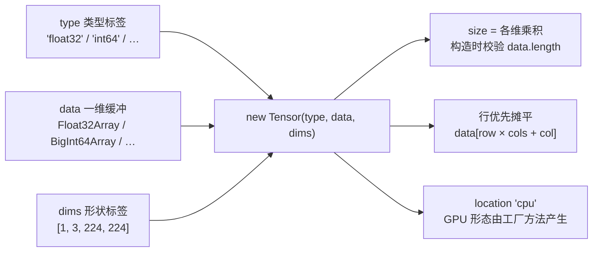

import { Canvas, Controls, Meta } from '@storybook/addon-docs/blocks';
import * as TensorCourse from './tensor.stories';

<Meta of={TensorCourse} name="Docs" />

# Tensor 与数据类型

数据进出模型都必须以 Tensor 的形态出现：[第一次推理](?path=/docs/first-inference--docs)已经按模型签名构造过 [1, 1, 28, 28] 的 float32 输入，本课把这个对象本身讲透，让「造一个张量、读一个张量」不再靠猜。

先建立贯穿全课的核心判断：Tensor 是一个纯 JS 对象，只有三个状态——`type`（类型标签）、`data`（一维缓冲）、`dims`（形状标签）。`type` 决定 `data` 用哪种 TypedArray 承载；`dims` 的各维乘积在构造时与 `data.length` 互相校验；数据本身永远按行优先摊平成一条，`reshape` 只是给同一份缓冲换标签。15 种类型里只有两个反直觉：float16 存的是 16 位位模式，int64 存的是 bigint。

构造 Tensor 不需要模型、不初始化后端、也不下载 wasm——本课三个实例都是纯前端真实构造。看完导读你应当能预测：把实例切到 float16，`data` 载体会变成 Uint16Array、内容变成位模式整数；切到 int64，元素变成带 `n` 后缀的 bigint。



`type` 与 `data` 载体的完整对照如下，构造入口统一是 `new Tensor(type, data, dims?)`：

| `type` | `data` 载体 | 元素读写 | 说明 |
| --- | --- | --- | --- |
| `float32` | `Float32Array` | `number` | 默认主力类型，约 7 位十进制有效数字 |
| `int32` / `uint32` | `Int32Array` / `Uint32Array` | `number` | 索引、形状类张量常见 |
| `int64` / `uint64` | `BigInt64Array` / `BigUint64Array` | `bigint` | 构造可直接传 `number[]`，内部自动转 `BigInt` |
| `float16` | `Uint16Array`（位模式） | 编解码后是 `number` | 不能从普通数组构造；WebGPU 的 float16 模型用 |
| `int8` / `uint8` | `Int8Array` / `Uint8Array` | `number` | 量化模型与图像字节常见 |
| `int16` / `uint16` | `Int16Array` / `Uint16Array` | `number` | 较少遇到 |
| `bool` | `Uint8Array` | `0` / `1`，构造可传 `boolean[]` | 掩码类输入 |
| `float64` | `Float64Array` | `number` | 对应 ONNX 的 DOUBLE |
| `uint4` / `int4` | `Uint8Array` / `Int8Array` | 两位打包进一个字节 | 4 位量化，不能从普通数组构造 |
| `string` | `string[]` | `string` | 唯一的非数值类型 |

表中是 `new Tensor` 构造 CPU 张量的完整清单。另有几个从已有资源构造的工厂方法，它们改变的正是下文的 `location`：`Tensor.fromImage`（图像 → 张量，见[图像与 Tensor 互转](?path=/docs/tensor-image--docs)课程）、`Tensor.fromTexture` / `fromGpuBuffer` / `fromMLTensor`（GPU 形态，见 [WebGPU 后端](?path=/docs/backend-webgpu--docs)课程）、`Tensor.fromPinnedBuffer`（把已有缓冲标记为 `cpu-pinned`，属高级用法，签名见 API 参考）。

## 三要素：dims、type、data

三要素各自回答一个问题：`type` 回答「每个元素按什么格式解释」，`data` 回答「字节在哪」，`dims` 回答「这条数据按什么形状折叠」。`dims` 省略时按一维处理：

```ts
import { Tensor } from 'onnxruntime-web';

const a = new Tensor('float32', [1, 2, 3, 4, 5, 6], [2, 3]);
a.type; // 'float32'
a.dims; // [2, 3]
a.size; // 6 —— 各维乘积
a.data; // Float32Array(6) [1, 2, 3, 4, 5, 6] —— 一维，行优先

// dims 省略：按一维处理，自动取 [data.length]
new Tensor('float32', [1, 2, 3]).dims; // [3]
```

构造即校验：`dims` 乘积不等于 `data.length` 时立即抛错，不用等到 `run` 才发现。错误信息同时给出两个数字，是排查形状问题的第一现场：

```ts
new Tensor('float32', [1, 2, 3, 4, 5], [2, 3]);
// Error: Tensor's size(6) does not match data length(5).
```

下方实例对上表中的六个代表类型逐一真实构造，并从实例读回 `data` 的实际载体与内容——表上的每个「载体」都是运行时事实，不是文档约定：

<Canvas of={TensorCourse.TypeMap} />
<Controls of={TensorCourse.TypeMap} />

| 读者操作 | 可观察证据 |
| --- | --- |
| 切换「数据类型」 | 构造表达式、data 载体与内容同步更新 |
| 切到 `int64` | 元素显示为带 `n` 的 bigint；`Number(data[0])` 读回 9007199254740992，末位已失真 |
| 切到 `float16` | 载体显示 Uint16Array（有原生 Float16Array 的浏览器显示 Float16Array），内容是 0x3c00 一类的位模式整数 |
| 打开 Show code | 看到该 Canvas 实际执行的 `type-map.ts` |

`location` 不在构造参数里，而是构造方式的结果：`new Tensor` 得到的张量 location 恒为 `'cpu'`，`.data` 同步可读。由 `fromGpuBuffer`、`fromMLTensor` 等工厂方法或 GPU 后端产生的张量，数据可能在 GPU 上，读 `.data` 会抛「The data is not on CPU」，要改用 `await tensor.getData()`（见常见问题）；张量的释放与生命周期见[内存管理](?path=/docs/memory-management--docs)课程。

### dims：行优先布局与 reshape

`dims` 不只是「乘积等于长度」的约束，还决定下标的折叠方式：行优先（row-major）。`[rows, cols]` 的张量里，第 row 行第 col 列的元素是 `data[row * cols + col]`；反过来说，`data` 里没有任何形状信息——同一个缓冲可以被解读成任何乘积相同的形状：

```ts
const t = new Tensor('float32', [1, 2, 3, 4, 5, 6], [2, 3]);
t.data[1 * 3 + 2]; // 6 —— 第 1 行第 2 列（0 起）

// reshape 返回新 Tensor：dims 换了，data 还是同一个 TypedArray
const reshaped = t.reshape([3, 2]);
reshaped.dims; // [3, 2]
reshaped.data === t.data; // true —— 没有复制
```

`reshape` 同样校验乘积：`t.reshape([4, 2])` 会抛与构造相同的 size 错误。这也解释了为什么形状不该手工维护第二份事实：让 dims 与 data 共同进退，错误在构造现场暴露，而不是在 run 时离原因更远的地方。

下方实例把同一份序列同时按 `[rows, cols]` 与转置形状铺开，单元格里的小号数字是一维下标——它们连续不断，证明两张网格共享同一条 data：

<Canvas of={TensorCourse.DimsReshape} />
<Controls of={TensorCourse.DimsReshape} />

| 读者操作 | 可观察证据 |
| --- | --- |
| 调整「行数」「列数」 | 左右网格重排：A 按 [rows, cols] 折叠、B 按 [cols, rows] 折叠，一维下标始终连续 |
| 观察读数 | `A.data === B.data` 恒为 true——reshape 没有复制数据 |
| 打开 Show code | 看到该 Canvas 实际执行的 `dims-reshape.ts` |

## float16：Uint16Array 位模式

float16 是 WebGPU 时代最常见的「第二个浮点类型」：半精度权重与激活只有 float32 一半的体积。它的特殊之处在于 JavaScript 的 TypedArray 家族里没有 16 位浮点数组，ort 用 Uint16Array 存放 IEEE 754 binary16 的位模式——`data` 里每个元素是一个 0 到 65535 的整数，不是浮点数值。新版引擎开始提供原生 Float16Array 后，ort 会优先用它，但位模式布局不变，读写方式一致。

由此有两条硬规则：

- **不能用普通数组构造。** `new Tensor('float16', [1, 2, 3])` 直接抛错——普通数组的意思是「数值」，位模式的意思是「编码」，ort 拒绝猜测（1.30.0 实测报 `Creating a float16 tensor from number array is not supported. Please use Uint16Array as data.`）。
- **写和读都要自己转。** ort 没有内置 half 与 float 的转换，写入前编码、读出后解码都要自己做，下方实例的 Show code 给出完整的位运算实现。

```ts
// 写入：number → 16 位位模式 → Uint16Array（float32ToHalf 见实例源码）
const bits = Uint16Array.from([1, 0.5, 0.1, 65504].map(float32ToHalf));
const t = new Tensor('float16', bits, [2, 2]);
t.data; // Uint16Array(4) [15360, 14336, 11878, 31743] —— 位模式整数

// 读出：位模式 → number
halfToFloat32(t.data[2]); // 0.0999755859375 —— 不是 0.1
```

代价是精度：binary16 只有 10 位尾数，约 3 位十进制有效数字（float32 是 23 位、约 7 位）；范围也小得多，±65504 之外溢出为 Infinity，约 6e-8 以下下溢为 0。实例把同一个值在两种类型下的存储并排给出，拖动即可看到 float16 的偏差：

<Canvas of={TensorCourse.Float16Bits} />
<Controls of={TensorCourse.Float16Bits} />

| 读者操作 | 可观察证据 |
| --- | --- |
| 拖动「输入值」 | float32 存储值与 float16 解回值同步更新，偏差行实时给出差值 |
| 输入 0.1 | float32 存 0.10000000149011612，float16 只能存 0.0999755859375（位模式 0x2e66） |
| 打开 Show code | 看到该 Canvas 实际执行的 `float16-bits.ts`，含位模式转换实现 |

float16 的输入输出主要出现在 WebGPU 上运行 float16 模型时，浏览器版本要求（如 Float16 需 Chromium 121+）与数据进出 GPU 的方式见 [WebGPU 后端](?path=/docs/backend-webgpu--docs)课程。

## int64：BigInt64Array 与 bigint

int64 与 uint64 是另一类映射不到 JS 原生数值的类型：64 位整数会超出 `Number` 的 53 位安全整数范围，ort 用 BigInt64Array / BigUint64Array 承载，元素是真正的 bigint。构造时可以直接传 `number[]`，ort 内部逐个 `BigInt()` 转换；`data` 里读出来的永远是 bigint：

```ts
// 构造：number[] 与 bigint[] 都可以直接传
const ids = new Tensor('int64', [101, 2003, 102], [1, 3]);

ids.data; // BigInt64Array(3) [101n, 2003n, 102n]
ids.data[1] + 1; // TypeError: Cannot mix BigInt —— bigint 不与 number 混算
ids.data[1] + 1n; // 2004n

// 读回 number：超过 Number.MAX_SAFE_INTEGER 时静默失真
Number(9007199254740993n); // 9007199254740992
```

失真是静默的：没有报错、没有告警。「类型映射」实例的 int64 选项里可以看到这个现象——张量里保存着 9007199254740993n，一行 `Number()` 之后末位已经变了。tokenizer 的 input_ids、注意力掩码等输入常以 int64 出现，处理规则只有一句：**全程 bigint，只在最终消费处转 number**。

## 最佳实践

- **类型转换放在读写边界，一次到位。** float16 的编解码与 int64 的 `Number()` 都是有损操作：在张量读写处各做一次，数据管道内部停留在 Float32Array / bigint 的原生表示；中途反复往返会累积舍入误差。
- **float16 只为 float16 模型服务。** 模型签名要求 float16 输入、或在 WebGPU 上加载 float16 权重时才用它；能保持 float32 就保持 float32，精度和工具链成本都更低。
- **让构造器替你校验形状。** dims 乘积与 data.length 的核对是免费且即时的；不要为了「不再报错」而省略 dims 把形状压扁成 `[data.length]`——形状错了 run 才会拒绝，报错离出错原因更远。

## 常见问题

- `new Tensor('float16', [1, 2, 3])` 报 `Creating a float16 tensor from number array is not supported`。
  改用 Uint16Array 位模式构造：先用 `float32ToHalf` 一类的转换把数值编码成 16 位整数（实现见本课示例源码）。普通数组无法表达「这两个字节是一个半精度浮点」，ort 拒绝猜测。
- 构造或 reshape 报 `Tensor's size(6) does not match data length(5)`。
  dims 各维乘积与 data.length 不一致。常见原因：漏写 batch 维、H/W 写反、预处理产出数量与 dims 没对上。打印 dims 与 data.length 对照修正即可，错误发生在构造现场。
- 对 tensor.data 的元素做加减报 `Cannot mix BigInt and other types`。
  int64 / uint64 张量的元素是 bigint，不能直接与 number 混算。用 `Number(v)` 转回普通数再参与计算；值可能超过 2 的 53 次方时改用 BigInt 运算，`Number()` 会静默失真。
- 读取输出张量的 `.data` 抛 `The data is not on CPU`。
  该张量的数据还在 GPU 上（由 GPU 后端的输出或工厂方法产生），改用 `await tensor.getData()`。本课用 `new Tensor` 构造的张量 location 恒为 `'cpu'`，不会遇到；GPU 数据的来龙去脉见 [WebGPU 后端](?path=/docs/backend-webgpu--docs)与[内存管理](?path=/docs/memory-management--docs)课程。

## 总结回顾

摘要：

本课把 Tensor 拆成三个状态：type 决定 data 用哪种 TypedArray 承载，dims 是与 data.length 在构造时互相校验的形状标签，数据本身永远按行优先摊平成一条一维缓冲——reshape 换标签不换数据，全部校验都在构造现场完成。15 种类型里绝大多数是直给的 TypedArray；float16 特殊在 JS 没有对应类型，ort 用 Uint16Array 存位模式、拒绝普通数组构造、读写都要自己编解码，代价是约 3 位十进制精度和 ±65504 的范围；int64 特殊在元素是 bigint，构造可以直接喂 number 数组，读回要 Number() 且超过 2 的 53 次方会静默失真。location 由构造方式决定：new Tensor 恒为 'cpu'，GPU 形态的张量要用 getData() 读。

一句话：

> Tensor 只有「type 标签 + dims 标签 + 一维行优先缓冲」三个状态：type 挑对载体，dims 与长度互相校验；float16 记位模式，int64 记 bigint。

知识要点：

- Tensor 的三要素分别决定什么？构造时发生哪些校验？
- 15 种 type 各对应哪种 TypedArray？哪几种不能从普通数组构造？
- 行优先布局下，[rows, cols] 张量第 row 行第 col 列对应 data 的哪个下标？
- reshape 是否复制数据？用什么证据证明？
- float16 为什么存位模式？精度与范围代价是多少？
- int64 张量构造和读回各要注意什么？
- 什么时候 `.data` 不可用，应该用什么替代？

## 参考资料

- [onnxruntime-web API 参考（官方）](https://onnxruntime.ai/docs/api/js/index.html) —— Tensor 构造签名、`Tensor.DataTypeMap` 的 type 与载体映射、`reshape` / `getData` 行为的一手依据
- [microsoft/onnxruntime 仓库 js/web README](https://github.com/microsoft/onnxruntime/tree/main/js/web) —— float16 数据与 WebGPU 后端的浏览器版本要求（Float16 需 Chromium 121+）
