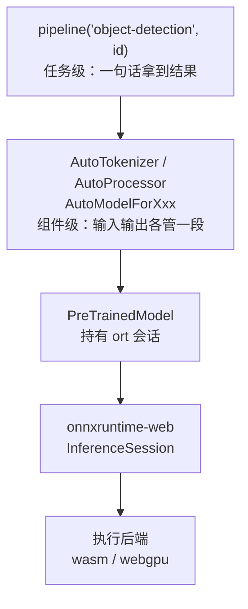

import { Meta } from '@storybook/addon-docs/blocks';

<Meta id="transformers-js" title="按需分支/transformers.js" name="Docs" />

# transformers.js

前四个阶段的手册内容都是同一个姿态：找模型 URL、写预处理、组装 feeds、解码输出——每一步亲手做。transformers.js（npm 包 `@huggingface/transformers`）是压在这条链路上面的封装层：它把**模型仓库解析、tokenizer/processor 预处理、会话管理、输出后处理**四件事自动化掉，一行 `pipeline()` 直接拿到最终结果。它与 onnxruntime-web 不是竞争关系，而是分层关系——`from_pretrained` 底层创建的仍然是 ort-web 的 `InferenceSession`，仍然走本手册讲过的 wasm/WebGPU 后端。本课回答两个问题：它替你做了什么（什么时候值得用它），什么时候绕过它直接用 ort。它自身的 API 全表不是本课内容，需要时从文末官方入口查。



| 选项 / 配置 | 默认值（2026-10 对照官方文档与源码查证） |
| --- | --- |
| npm 包名 | `@huggingface/transformers`（v3 起更名；旧包 `@xenova/transformers` 停在 v2） |
| 当前版本 | v4.3.0（依赖 `onnxruntime-web` 的 dev 快照，精确锁定版本） |
| `device` | 浏览器默认 `wasm`，Node.js 默认 `cpu` |
| `dtype` | 未指定时按 device 取：`wasm` → `q8`，其余（含 `webgpu`）→ `fp32` |
| `subfolder` | `'onnx'`——模型仓库里 onnx 文件所在的子目录 |
| `revision` | `'main'`——可传 commit hash 锁定版本 |
| `session_options` | `{}`——类型就是 ort 的 `InferenceSession.SessionOptions` |
| `env.allowRemoteModels` | `true`（从 Hugging Face Hub 下载） |
| `env.useBrowserCache` | `true`（用浏览器 Cache API 缓存模型文件） |

## 快速上手

以下代码在浏览器页面执行（Vite 项目或 `<script type="module">`）。需要先安装 `@huggingface/transformers`——本工作区示例工程未安装它，代码是官方用法形态，不是本工作区的运行输出；首次运行会从 Hugging Face Hub 下载模型文件，需要网络可达。

```ts
import { pipeline } from '@huggingface/transformers';

// 任务 + 仓库 ID：文件定位、预处理、后处理全部自动
const detector = await pipeline('object-detection', 'Xenova/yolos-tiny');
const cats = await detector(
  'https://huggingface.co/datasets/Xenova/transformers.js-docs/resolve/main/cats.jpg',
);
console.log(cats);
// [{ score, label, box: { xmin, ymin, xmax, ymax } }, ...] —— 已解码的像素坐标框
```

对照[目标检测](?path=/docs/object-detection--docs)课：同一个 `Xenova/yolos-tiny`、同一张 `cats.jpg`，手工链路要写预处理循环、组装 feeds、五步解码；这里只有两次 `await`。差价就是本课要讲清的东西。

## 它替你做了什么

用 ort-web 直接推理有四段手工劳动，transformers.js 一一对应地自动化了它们。这张对照表是本课的共同模型，后面三小节逐段展开：

| ort-web 手工链路（本手册已逐课讲过） | transformers.js 的自动化 |
| --- | --- |
| 拼直连 URL、核对签名（[获取模型](?path=/docs/getting-models--docs)） | 仓库 ID + `subfolder: 'onnx'` + dtype 文件名约定自动定位文件，并读取 `config.json` |
| 手写预处理：像素 → 归一化 → NCHW（[图像与 Tensor 互转](?path=/docs/tensor-image--docs)） | tokenizer / processor 按模型仓库里的配置文件自动完成 |
| 创建 session、组装 feeds、`run`（[第一次推理](?path=/docs/first-inference--docs)） | `from_pretrained` 一次完成建会话；`model(inputs)` 自动组装 feeds |
| 解码输出张量（[目标检测](?path=/docs/object-detection--docs)的五步解码） | pipeline 内置后处理，直接返回 `label` / `score` / `box` |

### 模型仓库解析

`from_pretrained('Xenova/yolos-tiny')` 不需要 URL：它按「仓库 ID → `subfolder`（默认 `'onnx'`）→ dtype 文件名」定位文件。dtype 与文件名的映射是库内约定（源码 `DEFAULT_DTYPE_SUFFIX_MAPPING`）：

| dtype | 文件名 | 说明 |
| --- | --- | --- |
| `fp32` | `model.onnx` | fp32 基线（空后缀） |
| `fp16` | `model_fp16.onnx` | 半精度，WebGPU 友好 |
| `q8` | `model_quantized.onnx` | 8-bit 量化，wasm 默认 |
| `q4` / `q4f16` | `model_q4.onnx` / `model_q4f16.onnx` | 4-bit 系列，最小 |

这正是[获取模型](?path=/docs/getting-models--docs)课实测过的 [Xenova/yolos-tiny](https://huggingface.co/Xenova/yolos-tiny) 的 `onnx/` 目录布局——那批文件名不是巧合，它们就是按这套约定为 transformers.js 生态导出的。所以判断一个仓库「能不能直接喂给 transformers.js」，先看它有没有 `onnx/` 子目录和这套命名的文件；[HuggingFace Models（transformers.js 过滤）](https://huggingface.co/models?library=transformers.js&sort=trending)列出的仓库都符合。

三个配套机制：

- **dtype 未指定时按 device 自动选**：`wasm` 取 `q8`（体积小），`webgpu` 取 `fp32`——这对默认值本身就是「哪种后端配哪种精度」的经验答案（见最佳实践）。
- **多会话模型按模块选 dtype**：encoder-decoder 类模型（Whisper、Florence-2 等）一个仓库里有多份 onnx 文件，`dtype` 可以传对象按模块指定；`model_file_name` 选项可覆盖单会话模型的文件名。
- **缓存与版本**：模型文件经浏览器 Cache API 缓存（`env.useBrowserCache`）；仓库内容会漂移，在意可复现性时传 `revision` 锁 commit——口径与[获取模型](?path=/docs/getting-models--docs)课一致。

### tokenizer 与 processor

文本、图像、音频三种输入各有对应的自动化层，约定来源全部是模型仓库里的配置文件——也就是你在手工链路里逐项人工核对过的那份信息（[目标检测](?path=/docs/object-detection--docs)课的 `preprocessor_config.json`、`config.json`）：

- **文本 → `AutoTokenizer`**：读仓库的 `tokenizer.json`，把字符串变成 `input_ids`、`attention_mask` 等张量；`tokenizer.decode()` 反向还原。手工链路里「int64 token id」一类坑由它内部消化。
- **图像/音频 → `AutoProcessor`**：读 `preprocessor_config.json`，完成缩放、归一化、布局转换；`RawImage` 承担图片加载。手工链路里的 ÷255、ImageNet mean/std、NCHW 循环（[图像与 Tensor 互转](?path=/docs/tensor-image--docs)课的手写代码）就是它做的事。
- **生成类模型的 chat template**：对话格式拼接与 `generate()` 的 token 循环、KV 缓存传递也由库内承担（生成配置来自仓库的 `generation_config.json`）。

```ts
// 运行环境：浏览器页面，需安装 @huggingface/transformers（本工作区未安装）
import { AutoTokenizer, AutoModel } from '@huggingface/transformers';

const tokenizer = await AutoTokenizer.from_pretrained('Xenova/bert-base-uncased');
const model = await AutoModel.from_pretrained('Xenova/bert-base-uncased');

const inputs = await tokenizer('I love transformers!');
const { logits } = await model(inputs); // feeds 组装自动完成，输出仍是张量对象
```

中层 API 的输出仍然是张量（`dims` / `data` / `type`）——越过 pipeline 直接用 Auto 层时，解码又回到你自己手里，[目标检测](?path=/docs/object-detection--docs)课的解码知识在这一层仍然适用。

### 会话与后处理

`from_pretrained` 内部完成 `InferenceSession.create`：`PreTrainedModel` 构造时持有的 `sessions` 就是 ort-web 会话，`dispose()` 逐一释放它们（对应手工链路里的 `session.release()`，见[内存管理](?path=/docs/memory-management--docs)）。后处理则按任务内建：`pipeline('object-detection')` 返回的每项 `{ score, label, box }`，内部就是把原始输出张量做 softmax、阈值过滤、坐标换算——语义与官方 `post_process_object_detection` 一致，也正是[目标检测](?path=/docs/object-detection--docs)课手工实现的那五步。任务名即选择入口：`text-classification`、`image-classification`、`object-detection`、`feature-extraction`、`automatic-speech-recognition`、`text-generation`、`zero-shot-image-classification` 等 20 余个，全表见官方 pipelines 文档（文末入口）。

## 用 ort 的眼睛读它

本手册的概念体系可以直接映射到 transformers.js 的选项上——理解了这层映射，它的文档就变成「换了一套参数名的 ort」：

| 手册概念 | transformers.js 里的落点 |
| --- | --- |
| `executionProviders`（[后端选择与回退](?path=/docs/backend-selection--docs)） | `device` 选项；`'webgpu'` 最终就是给底层会话传 WebGPU EP，浏览器默认 `wasm` |
| `InferenceSession.SessionOptions`（[InferenceSession](?path=/docs/inference-session--docs)） | `from_pretrained(id, { session_options })` 直通 ort 会话选项 |
| `ort.env` 的 `wasm.wasmPaths` 等（[ort.env 全局配置](?path=/docs/ort-env--docs)） | `env.backends.onnx.wasm.*`——库把 ort 的 env 挂在 `env.backends.onnx` 上供你改 |
| fp16 与 WebGPU、量化变体（[WebGPU 后端](?path=/docs/backend-webgpu--docs)、[量化与体积](?path=/docs/quantization--docs)） | `dtype` 选项选择仓库里的对应 onnx 变体文件 |

一个必须分清的事实：**它内置的 ort 与你手动安装的 onnxruntime-web 不是同一份**。v4.3.0 精确锁定 `onnxruntime-web` 的一个 dev 快照（2026-10 查证其 package.json：`1.31.0-dev` 系列），而本工作区安装的是 stable 1.30.0。同一页面里 `import { env } from 'onnxruntime-web'` 的配置不会作用到 transformers.js 创建的会话上——要影响它，用 `env.backends.onnx`（它的）或 `session_options`（每次加载时传）。WebGPU 一节官方的原话是「多亏与 ONNX Runtime Web 的协作，启用 GPU 加速只需设 `device: 'webgpu'`」——协作关系是双向的：ort 的 EP 能力边界（算子覆盖、浏览器版本要求，见[WebGPU 后端](?path=/docs/backend-webgpu--docs)）同样约束着 transformers.js。

## 什么时候绕过它

核心判断只有一条：**模型在不在 HF 的 onnx 约定布局里、任务标不标准**。在，它省掉的全部是胶水；不在，胶水反而要按它的约定重新写。

| 场景 | 选择 |
| --- | --- |
| 仓库符合约定布局（`onnx/` 子目录 + dtype 变体 + config 文件），任务是标准任务 | 用它——文件定位、预处理、解码全部白得 |
| 快速验证一个想法能不能在浏览器跑通 | 用它——三行 `pipeline` 的原型成本无可替代 |
| 模型来自 ONNX Model Zoo、自己导出，或仓库没有 `onnx/` 布局 | 直接用 ort——手工四步就是本手册主线，不给它写适配 |
| 需要精确控制预处理/后处理（对齐签名、特殊解码、阈值语义） | 直接用 ort——越过 pipeline 后它给的辅助有限，手写更可控（[目标检测](?path=/docs/object-detection--docs)课的解码就是现成范本） |
| 需要精细控制 EP 顺序、会话选项、wasm 资源伺服 | 直接用 ort；或经 `session_options` / `env.backends.onnx` 穿透 |
| 只跑一个小模型、一个任务，在意包体积与依赖 | 直接用 ort——整库加上它锁定的那份 ort，比单一 `onnxruntime-web` 重 |
| 已有按本手册写好的、调优过的链路 | 直接用 ort——没有理由为了「用上它」推倒重写 |

## 最佳实践

- **层级递降，不一步到底。** 原型用 `pipeline()`；要控制输入输出时降到 `AutoTokenizer` + `AutoModelForXxx`；要控制会话时用 `session_options` / `env.backends.onnx`；都不够时绕过它直接用 ort。每一层降级只多写一点胶水，下层知识完全复用。
- **device/dtype 按默认组合起步。** wasm + `q8`（兼容基线、体积小）与 webgpu + `fp32`（GPU 精度路径）是库自己的默认答案；WebGPU 上要更快再试 `fp16`。`q8` 一类整型变体不是 WebGPU 的默认路径，遇到问题先回到默认组合再排查。
- **锁定 revision。** `from_pretrained(id, { revision: '<commit-hash>' })`，与[获取模型](?path=/docs/getting-models--docs)课「URL 指向固定 revision」同一条纪律。
- **生产自托管。** `env.allowRemoteModels = false` 加 `env.localModelPath` 指向自己的静态资源，模型文件与缓存策略收回自己手里（与[部署](?path=/docs/deployment--docs)课的自托管口径一致）；开发期保持默认远端加载最省事。
- **把它当加速器，不当基础设施。** 它的确定性价值是「标准任务 + 标准布局」的零胶水；项目长期演进的关键控制点（EP、env、预处理对齐、缓存策略）应留在你直接掌控的 ort 层。

## 常见问题

- `from_pretrained` 报 404 或找不到 onnx 文件。
  仓库没有 `onnx/` 子目录，或所选 dtype 变体不存在。先到仓库 Files 页签核对文件（读法见[获取模型](?path=/docs/getting-models--docs)课）；版本较新时可用 `ModelRegistry.get_available_dtypes(id)` 探测可用变体。布局不符的仓库只能换模型、自行导出，或绕过它直接用 ort。
- 设了 `device: 'webgpu'` 却报错，或行为与预期不符。
  先换回 wasm 验证模型本身没问题——官方明确 WebGPU 路径仍是实验性、非 Chromium 浏览器问题更多（浏览器版本与开关要求见[WebGPU 后端](?path=/docs/backend-webgpu--docs)课）。再检查 dtype：WebGPU 默认走 `fp32`，`q8`/`q4` 等整型变体不在默认路径上，与 `fp16` 一样可能受算子覆盖限制。
- 页面同时装了 onnxruntime-web 和 transformers.js，两边 env 配置互不生效。
  它们是两份独立的 ort 运行时：transformers.js 用它锁定的内部版本。要影响它的会话，用 `env.backends.onnx`（它的 env）或 `session_options`（加载时传入）；自己那份 `onnxruntime-web` 的 `ort.env` 管不到它。没有特殊理由时，用它的项目不要再单独装一份 ort。
- 旧教程写着 `import { pipeline } from '@xenova/transformers'` 或 `quantized: true`。
  那是 v2 的包名与选项。v3 起迁移到 `@huggingface/transformers`，布尔 `quantized` 换成了 `dtype`（`true`≈`'q8'`，`false`≈`'fp32'`）；照抄旧包名会装到停在 v2 的旧库。

## 总结回顾

摘要：

transformers.js 是构建在 onnxruntime-web 之上的任务级封装层：`pipeline()` 与 Auto 类把 ort-web 手工链路的四段劳动自动化——按「仓库 ID + `onnx/` 子目录 + dtype 文件名」解析模型仓库（Xenova/yolos-tiny 的 `onnx/` 目录就是这套布局），按仓库配置文件完成 tokenizer/processor 预处理，`from_pretrained` 内部建好 ort 会话并自动组装 feeds，按任务内建后处理直接返回可用结果。它的选项可以映射回手册概念：`device` 对应执行后端选择、`session_options` 直通 ort 会话选项、`env.backends.onnx` 直通 ort 全局配置；它内置的 ort 是精确锁定的内部版本，与自己安装的 onnxruntime-web 互不相通。选型判断只有一条：模型在 HF 的 onnx 约定布局里、任务是标准任务时用它省掉全部胶水；布局不标准或需要精细控制时，绕过它直接用 ort——那正是本手册前四个阶段教过的全部内容。

一句话：

> transformers.js 替你做的是胶水，不是推理——模型在 HF onnx 约定布局里时四段手工劳动全白得，底层仍是 InferenceSession；布局或控制权不标准时，绕过它回到 ort 手工链路。

知识要点：

- transformers.js 与 ort-web 是什么关系？它自动化的四件事分别对应本手册哪些课？
- `dtype` 怎样映射到模型仓库里的文件名？浏览器默认的 `device` 与 `dtype` 组合是什么？
- `device`、`session_options`、`env.backends.onnx` 分别落到 ort 的哪个概念上？为什么自己装的 ort 与它内置的 ort 互不相通？
- 哪些场景应该绕过它直接用 ort？
- v2 与 v3+ 的包名、量化选项有什么差异？遇到旧教程怎么换算？

## 参考资料

- [transformers.js 仓库](https://github.com/huggingface/transformers.js)
  README（安装、`device: 'webgpu'` 用法、`env` 设置）与源码（dtype→文件名后缀映射、默认 device/dtype 表）的一手依据。
- [transformers.js 文档站](https://huggingface.co/docs/transformers.js)
  pipeline 任务全表、教程与 API 参考的官方总入口。
- [Using quantized models (dtypes)](https://huggingface.co/docs/transformers.js/en/guides/dtypes)
  `dtype` 取值、按模块 dtype、`ModelRegistry.get_available_dtypes`，以及旧 `quantized` 选项的迁移说明。
- [Running on WebGPU](https://huggingface.co/docs/transformers.js/en/guides/webgpu)
  `device: 'webgpu'` 的官方用法、与 ONNX Runtime Web 协作的表述、实验性声明与浏览器覆盖度。
- [env API](https://huggingface.co/docs/transformers.js/en/api/env)
  `env.backends.onnx`、`allowRemoteModels`、`allowLocalModels`、`useBrowserCache` 等全局配置的权威定义。
- [Models API](https://huggingface.co/docs/transformers.js/en/api/models)
  `AutoModelForXxx` 家族、`PreTrainedModel` 的会话持有与 `dispose()`、中层 `model(inputs)` 用法。
- [Hub 工具 API（PretrainedModelOptions）](https://huggingface.co/docs/transformers.js/en/api/utils/hub)
  `subfolder`（默认 `'onnx'`）、`dtype`、`session_options`、`revision`、`model_file_name` 的权威定义。
- [HuggingFace Models（transformers.js 过滤）](https://huggingface.co/models?library=transformers.js&sort=trending)
  符合本课模型布局的仓库检索入口。
- [Xenova/yolos-tiny](https://huggingface.co/Xenova/yolos-tiny)
  本课贯穿示例模型；其 `onnx/` 目录与 config 文件即 transformers.js 生态的仓库布局（文件列表已在本手册获取模型课实测）。
