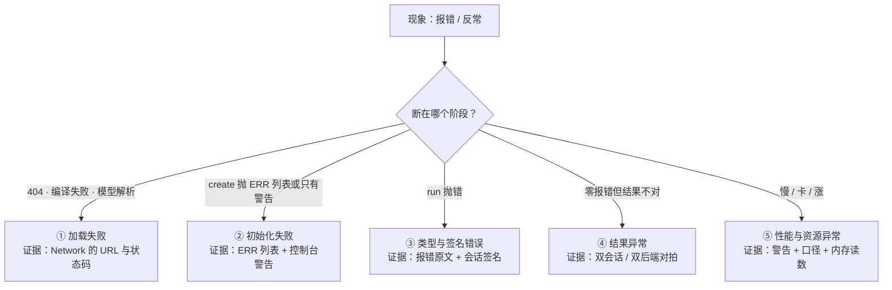

import { Canvas, Controls, Meta } from '@storybook/addon-docs/blocks';
import * as Troubleshooting from './troubleshooting.stories';

<Meta of={Troubleshooting} name="Docs" />

# 常见报错排查

手册其余课程按概念组织，本课按症状组织：你手里只有一个报错或一个反常现象，要在最短路径内找到原因与去处。本课的核心判断有两条：**定位不靠背 API，靠三样证据加一个阶段判断**——报错原文、控制台警告、Network 面板，加「断在哪个阶段」（加载 → 初始化 → run → 结果），绝大多数故障就能唯一定位；**报错原文本身就是最好的检索词**——ort 的文案跨浏览器、跨设备高度稳定，官方 Web 排错教程截至 2026-10 仍是「under construction」占位页（本课查证），真实案例库在 GitHub Discussions，检索时直接贴原文关键句。读完导读你应当能预测：拿到一个报错，先看哪三样、怎么判断阶段、到下表哪一行继续查。



| 症状族 | 典型现象 / 报错关键字 | 首选证据 | 小节 |
| --- | --- | --- | --- |
| 加载失败 | 动态 import 失败、`.wasm` 404、`CompileError`、模型 `Parse header` 失败 | Network 面板的 URL 与状态码 | [加载失败](#加载失败工件与模型没取到) |
| 初始化失败 | `no available backend found. ERR:`、`removing requested execution provider`、`NOT_IMPLEMENTED` | 报错原文的 ERR 列表 + 控制台警告 | [初始化失败](#初始化失败后端与算子) |
| 结果异常 | 输出恒零、恒定、乱值、NaN——全程零报错 | fp32 / wasm 基线对拍 | [结果异常](#结果异常跑通了但输出不对) |
| 性能与资源异常 | 推理慢、页面卡顿、内存上涨、标志不生效 | 移除警告 + 计时口径 + 释放纪律 | [性能与资源异常](#性能与资源异常) |
| 类型与签名错误 | `missing in 'feeds'`、`invalid input`、`contains invalid output name`、`Invalid rank` | 报错原文 + `session.inputNames` | [类型与签名错误](#类型与签名错误) |

## 定位方法

三样证据的分工，按稳定程度排序：

- **报错原文**：Promise reject 或 throw 的 message。ort 侧的文案（`ERR:` 列表、`missing in 'feeds'` 这类句子）不随浏览器变化，是精确定位词；浏览器侧的文案（fetch 失败、`CompileError`）措辞各异，只取其中的 URL 和类型名。
- **控制台警告**：回退与降级不抛错，唯一主动信号是 console.warn——EP 移除警告（`removing requested execution provider ...`）与多线程回退警告都属此类。应用无感是回退的设计，不是它不存在的证明。
- **Network 面板**：加载类故障的一等证据——哪个 URL、什么状态码、响应内容是什么。404 的 URL 按「前缀 + 文件名」拆开，哪段不对改哪段（公式见 [WASM 资源伺服](?path=/docs/wasm-serving--docs)）。

阶段判断把证据归到时点上。一条推理链依次是：**加载**（取 `.mjs`/`.wasm` 工件与模型文件）→ **初始化**（后端解析与图加载）→ **run**（输入输出校验与执行）→ **结果**（数值正确性）。create 抛错先分「下载/编译层」还是「后端/算子层」（失败耗时接近 0 说明在模型下载之前，是后端解析层）；run 抛错都在校验层；全程零报错的问题才进结果层与性能层。

报错原文可以在包内核验，不必依赖搜索：JS 侧的文案直接 grep `node_modules/onnxruntime-web/dist/ort.mjs`（如 `is missing in 'feeds'`）；wasm 侧的文案在二进制里，`strings ort-wasm-simd-threaded.jsep.wasm | grep 'Could not find an implementation'` 也能验到。本课引用的全部报错关键字都按这个办法在 1.30.0 上核验过。

复现纪律来自两个运行时事实：**env 是页面级单例**（[ort.env 全局配置](?path=/docs/ort-env--docs)），**wasm 初始化失败粘滞到刷新**——修好配置后原页面重试，报的还是第一次的错。所以「改了再试」只在刷新后或全新 worker 里可靠。本课的复现器按后者实现：十档故障每档都在全新 worker 里注入，真实执行一遍推理链路，回传报错原文、控制台警告与中断阶段。

<Canvas of={Troubleshooting.FaultLab} />
<Controls of={Troubleshooting.FaultLab} />

| 读者操作 | 可观察证据 |
| --- | --- |
| 保持默认「加载 · .mjs 404」 | 第①阶段标红：报错原文含按前缀拼出的完整 `.mjs` URL——原文即定位线索 |
| 切到「加载 · .wasm 404 / 编译失败」 | 中断仍在第①阶段：`.mjs` 已取到，报错与「实际拉取 .wasm」读数指向 404 的 URL——与上一档是两种失败面 |
| 切到「初始化 · 请求未注册的 EP」 | 第②阶段标红：`no available backend found. ERR: [webgl] backend not found.`，耗时接近 0（后端解析在模型下载之前） |
| 切到「初始化 · EP 回退」 | 四阶段全过、第②阶段 ⚠：控制台警告读数给出移除警告原文，会话照建——无报错的回退现场 |
| 切到 run 的四档 | 第③阶段标红：缺输入名 / 多余键 / 值不是 Tensor / 非法输出名的原文逐字对应[类型与签名错误](#类型与签名错误)一节 |
| 切到「结果 · int8 变体输出恒零」 | 四阶段全绿、第④阶段标橙：输出最大绝对值 0——不抛错的故障，三样证据全都看不到它 |
| 打开 Show code | 看到该 Canvas 实际执行的 `fault-lab.worker.ts`：十档注入与真实执行 |

## 加载失败：工件与模型没取到

这一层是 create 的下载与编译阶段，reject 的第一种来源；证据以 Network 面板为主。工件侧只有「位置 + 文件名」两个变量，模型侧只有「URL 可达」与「内容是 protobuf」两个判断。

### .mjs 404：动态 import 失败

报错原文含拼出的 `.mjs` 完整 URL（Chrome 形如 `Failed to fetch dynamically imported module: …/ort-wasm-simd-threaded.jsep.mjs`）。按「前缀 + 入口内嵌文件名」拆开核对：目录是否存在、前缀是否以 `/` 结尾、版本号与安装的包是否一致。处理是修 `env.wasm.wasmPaths`，改完刷新（失败粘滞）。五档配置的完整现场见 [WASM 资源伺服](?path=/docs/wasm-serving--docs)。

### .wasm 404 与 CompileError

`.mjs` 取到了、create 仍失败，是另一个失败面：Network 里 `.wasm` 请求 404（工件没部署全、路径错），或报 `CompileError`——常见根因是静态服务器把 404 回退成了 index.html，编译器拿到的是 HTML 而不是 wasm 二进制。处理：工件成对部署，检查服务器的 SPA 回退规则。报错文案各浏览器措辞不同，以 `.wasm` 请求的状态码与响应内容为准。

### 模型文件：404 与「拿到的是 HTML」

模型 URL 浏览器能打开，create 却报解析错误（`Parse header` 之类）。先把响应字节取出来确认内容：Git LFS 仓库的 `raw` 链接返回的是 LFS 指针文本，不是 protobuf——浏览器里要用 GitHub media 端点或带 `/resolve/` 的链接（选链方法见[获取模型](?path=/docs/getting-models--docs)）。HuggingFace 的 blob 页面链接同理，不是模型地址。

### 修好了还报旧错：失败粘滞

配置明明改对了，create 还报第一次的那个错，或出现 `previous call to 'initializeWebAssembly()' failed.`——wasm 后端一次性初始化，失败结果粘滞到刷新，原页面改 env 不会原地重试。处理：刷新页面（或重启应用）再验；交互式排查放全新 worker，本课复现器就是这么做的。同源的第二种报错 `multiple calls to 'initializeWebAssembly()' detected.` 说明有两条代码路径并发触发首次初始化，把 env 配置收口到启动处。

## 初始化失败：后端与算子

工件就位后，create 先按 `executionProviders` 数组解析后端，再按当选后端加载计算图。这一层有两种信号：抛错（全不可用、算子缺失）与警告（有兜底的静默回退）——后者功能不受影响、性能回到 CPU，是「突然变慢」最常见的根因。

### no available backend found. ERR: ...

数组里每个 EP 都不可用时 create reject，原文按请求顺序列出每个名字的失败原因：

```text
no available backend found. ERR: [webgl] backend not found.
```

`backend not found.` 是当前导入入口没注册该 EP 名（`/wasm` 入口请求 webgpu、默认入口请求 webgl 都是这种）；其他文本是注册了但初始化失败（如 WebGPU 的 `... is not supported ...`）。失败发生在模型下载之前，耗时接近 0 也是判据。对症下药：换入口、改 EP 名或修环境。注册表与入口的关系见[后端选择与回退](?path=/docs/backend-selection--docs)。

### EP 静默回退：警告 + 会话照建

现象是「没有错，但慢」：有兜底时（如 `['webnn', 'wasm']` 里 webnn 不可用）ort 只发一条 console.warn，会话按剩余 EP 照建：

```text
removing requested execution provider "webnn" from session options
  because it is not available: WebNN is not supported in current environment
```

这是回退唯一的主动信号。定位：控制台里搜 `removing requested execution provider`，`"X"` 告诉你哪个 EP 被丢掉，原因文本告诉你为什么。处理：想真正用上 GPU，核查浏览器版本矩阵与导入入口；生产里把这行警告当监控点而不是噪音。确认证据的边界：ort 没有查询会话实际后端的 API，可靠的只有「警告缺失 + 计时差 + GPU profiling」。本课复现器的「EP 回退」档是现场。

### 算子不支持：NOT_IMPLEMENTED

create 或 run 报含 `NOT_IMPLEMENTED` 与 `Could not find an implementation for <节点名:算子>` 的错误（句式核验自 1.30.0 的 wasm 二进制；具体算子取决于模型——本工作区的 mnist-8 算子在清单内，无法现场复现这条）。定位三步：

1. 从原文读出算子名、节点名与输入类型；
2. 用 [Netron](https://netron.app) 打开模型，定位该节点在图里的位置与输入 dtype；
3. 对照当前 EP 的算子清单（WebGPU 见仓库 `js/web/docs/webgpu-operators.md`）确认缺口。

处理三选一：换有该内核的 EP（如量化算子退回 wasm）、换等价图改写的模型变体、或对缺的算子做图改写。注意区分两种「不支持」：清单外算子被 JSEP 分区落 CPU 时**不报错**（会话内自动分区，见[后端选择与回退](?path=/docs/backend-selection--docs)）；报 `NOT_IMPLEMENTED` 说明连分区也救不了（如纯 webgpu 会话撞上无 GPU 内核的算子），才会走到这里。

## 结果异常：跑通了但输出不对

这一层没有异常可看——报错原文、警告、Network 全都干净，证据要从「报错」换成「对照」：fp32 对照 int8（变体失效）、wasm 基线对照目标后端（后端/类型问题）、已知标注对照输出（预处理问题）。核心判断是**加载成功 ≠ 算得对**。

### 输出恒零或恒定

任何输入输出都一样（全零、常数分布）。定位：同一份输入喂两个会话对拍——fp32 正常而量化变体恒零，即可判为变体在当前运行时上失效（换输入仍恒零可排除预处理）。处理：换该模型的其他量化变体（如 QDQ 版）或先用 fp32，升级 ort 后重验。本课复现器的 int8 档与[量化与体积](?path=/docs/quantization--docs)课（mnist-12-int8 实测反例，含原生 CPU 复核）都是现场。

### 精度低或乱值：预处理对拍

top1 总是错、置信度低、输出数值明显不合理。按发生率排：① 预处理与签名不对齐——归一化（`[0,1]` vs `[-1,1]` vs mean/std）、通道顺序（RGB/BGR）、布局（NCHW/NHWC）、值域（0–255 vs 0–1）；② dims 顺序（H/W 写反、漏 batch 维）；③ 多输入模型只喂了一个输入。处理：以 `session.inputMetadata` 为准写校验与转换链（[图像与 Tensor 互转](?path=/docs/tensor-image--docs)课有完整清单与现场），再打印输入张量的 min/max/mean 与预期分布对照。

### 输出全 NaN

输出全是 NaN 或 Inf。定位顺序：先排除输入——打印输入的 NaN 计数与值域；输入正常时，常见原因是数值溢出（如 float16 权重在大激活值下溢出，WebGPU 上多见）或模型自身的数值缺陷。处理：退回 wasm fp32 基线对拍，把问题归到「输入 / 后端 / 模型」三层之一；确认溢出后换 float32 变体或调整输入缩放。边界：本工作区无该现象的可复现模型，此条是通用定位路径而非 ort 官方结论。

## 性能与资源异常

这一层的「故障」不抛错，证据是计时、警告与内存读数；先固定测量口径再下结论（[性能测量](?path=/docs/profiling--docs)）。

### 推理慢：先排除假慢

按序核查四项：① 控制台有没有 `removing requested execution provider`——性能回 CPU 的第一解释（[后端选择与回退](?path=/docs/backend-selection--docs)）；② 测量口径——首次 run 含初始化成本，对比要预热加 median（[性能测量](?path=/docs/profiling--docs)）；③ 线程形态——没配隔离头时多线程静默退回单线程，伴随 `numThreads is set to N, but this will not work ...` 警告（[多线程与跨域隔离](?path=/docs/cross-origin-isolation--docs)）；④ 加载慢——首载 27MB 级工件与模型是下载问题不是推理问题，缓存策略见[部署](?path=/docs/deployment--docs)。

### 页面卡顿

推理期间点击、动画掉帧：长推理在主线程执行是设计内行为。处理：`env.wasm.proxy = true` 把推理移入 worker（代价与部署形态见[proxy 工作线程](?path=/docs/proxy-worker--docs)），或应用层把 run 收口到队列、按帧让出主线程。

### 内存持续上涨

随 run 次数或换模型次数单调上涨。两个高频根因，都在[内存管理](?path=/docs/memory-management--docs)课：换模型前没 `await session.release()`（旧权重驻留 wasm 堆）；GPU 输出张量没释放——显存不在 JS 堆统计里，只有占用上涨没有报错，把释放与消费写在同一段代码里。

### env 标志设了不生效

`numThreads`、`wasmPaths`、`logLevel` 改了没反应：env 只在第一个会话创建（或首次初始化）前生效，设晚了只影响下一次初始化；worker 里的推理用的是 worker 自己的 env。处理：配置集中在应用启动处、第一个 create 之前；worker 内的推理在 worker 里配置。生效时机与生命周期的完整规则见 [ort.env 全局配置](?path=/docs/ort-env--docs)。

## 类型与签名错误

这一层是 run 之前的静态校验：名字、形状、类型不对时 ort 直接拒绝执行。报错原文逐字对应违规点，签名唯一来源是 `session.inputNames` / `outputNames` / `inputMetadata` / `outputMetadata`——对照签名修正即可自愈。以下 ort 侧原文核验自 1.30.0 dist 源码（引擎通用报错除外），复现器 run 四档是现场。

### feeds 与 fetches 的名字类报错

```ts
// 1.30.0 实测
session.run({});
// Error: input 'Input3' is missing in 'feeds'.          —— 缺输入名
session.run({ Input3: tensor, wrong: tensor });
// Error: invalid input 'wrong'                          —— 多余的键不会被静默忽略
session.run({ Input3: [1, 2, 3] });
// Error: invalid data location: undefined for input "Input3"   —— 值不是 Tensor
session.run(feeds, ['not_an_output']);
// RangeError: 'fetches' contains invalid output name: not_an_output.
session.run(feeds, []);
// TypeError: 'fetches' cannot be an empty array.
```

处理：打印 `inputNames` / `outputNames` 对照键名（名字硬编码是这类报错的第一来源），值一律 `new Tensor(...)`；空数组不合法，取部分输出至少给一个名字。并发触发的 `Session already started` / `Session mismatch` 也是 run 层报错，处理见 [InferenceSession](?path=/docs/inference-session--docs) 课。

### 形状与大小不匹配

两类报错发生在不同时点，分清即可定位：

- **构造即抛**：`Tensor's size(756) does not match data length(784).`——dims 乘积与 TypedArray 长度不一致，`new Tensor` 时就失败，与模型无关。
- **run 时抛**：dims 与模型签名不符，wasm 侧校验拒绝——秩不同报 `Invalid rank for input: Input3 ...`，维度值不同报 `Got invalid dimensions for input: Input3 ...`（含 `Got: ...` 与 `Expected: ...` 两段）。句式核验自 1.30.0 的 wasm 二进制，完整原文以运行读数为准。

处理：用 `inputMetadata[0].shape` 对照 dims——漏 batch 维、把 `[1,1,28,28]` 展平成 `[784]`、H/W 写反是三大来源。现场见[第一次推理](?path=/docs/first-inference--docs)。

### 类型与生命周期：float16、BigInt 与 disposed

- `new Tensor('float16', [1, 2, 3])` 报 `Creating a float16 tensor from number array is not supported`——float16 没有 number 载体，必须 `Uint16Array` 加位模式换算（[Tensor 与数据类型](?path=/docs/tensor--docs)课）。
- int64 输入输出是 `BigInt64Array`，与 number 混算抛 `Cannot mix BigInt and other types`——转换规则见 Tensor 课。
- `The tensor is disposed.`（dispose 后读 `.data`）与 `The data is not on CPU.`（GPU 张量读 `.data`，改 `await getData()`）是生命周期报错——释放规则见[内存管理](?path=/docs/memory-management--docs)课。

## 最佳实践

- **报错原文当检索词，三要素随行。** 检索和提问都贴原文关键句（去掉变量部分）；附上「onnxruntime-web 版本、导入入口、executionProviders 数组 + 完整报错原文」三要素——官方排错页仍是占位（2026-10 查证），[GitHub Discussions](https://github.com/microsoft/onnxruntime/discussions) 是真实案例库。
- **一次只改一处，改完刷新。** env 单例加失败粘滞，「顺手多改几个再一起试」不可靠：多变量改动后成功了，你不知道哪个改动起效、哪个问题没修。交互式排查放全新 worker（复现器的做法）。
- **先回基线再逐项加回。** 未知问题先退到「单线程 wasm + 已验证模型 + 最小 feeds」（[第一次推理](?path=/docs/first-inference--docs)的骨架）确认链路，再逐项加回 WebGPU、多线程、量化变体——每加一项都可能引入新的故障面，加到哪项出问题，定位就到哪项。
- **最小复现 = 一个 worker + 一段 try/catch + 原样回传。** 复现器的 `fault-lab.worker.ts` 就是模板：报错不加工、警告顺带收集、资源 URL 一并回传；这段代码稍加裁剪就能随 bug 报告发出。
- **把警告当监控点。** 移除警告与多线程回退警告在生产控制台出现就该告警——它们是静默降级的唯一信号，等用户报「变慢了」就已经晚了。

## 常见问题

- 同样的代码有时报 `Session already started`，有时好好的。
  时序竞态：前一个 run 未结束就发起了下一个——点击连点、滑杆拖动都会触发，「时好时坏」正说明与事件到达顺序有关。把 run 收口到 promise 队列或开启 `env.wasm.proxy`，方法见 [InferenceSession](?path=/docs/inference-session--docs) 课。
- 本地 dev 一切正常，部署后出问题。
  按部署差异清单逐项核对：工件 404（`base` 前缀、复制遗漏）、隔离头缺失（多线程退回单线程）、https 缺失（WebGPU 不可用）、旧缓存工件与新 JS 错配——四项的定位与处理都在[部署](?path=/docs/deployment--docs)课。
- 报错文案跟教程或社区案例对不上，搜不到一模一样的。
  浏览器措辞不同是常态，抓稳定部分检索：URL、EP 名、`missing in 'feeds'` 这类 ort 侧固定句式；也可以直接在包内 grep 原文确认措辞来自哪一侧（见定位方法）。
- 升级 onnxruntime-web 后冒出新报错。
  先查版本三处对齐（lockfile、伺服的工件副本、CDN 前缀写死的版本号）；对齐后仍复现，用版本回退二分定位引入版本，再到该版本的 release notes 与 Discussions 找行为变化。量化变体升级后还要重验精度（[量化与体积](?path=/docs/quantization--docs)课的反例）。

## 总结回顾

摘要：

本课把散在各课的报错收拢成一张按症状组织的索引：定位靠三样证据（报错原文、控制台警告、Network 面板）加一个阶段判断（加载 → 初始化 → run → 结果）。加载层的两种失败面（`.mjs` 动态导入、`.wasm` 拉取编译）与模型层的「拿到的是 HTML」都从 Network 的 URL 与状态码入手；初始化层要分清两种信号——ERR 列表（全不可用，失败在模型下载之前）与移除警告（有兜底的静默回退，会话照建），算子缺口另有 NOT_IMPLEMENTED 与「原文读算子 → Netron 定位 → 对照清单」三步法；结果层没有异常可看，靠 fp32 / wasm 基线对拍把问题归到变体失效、预处理错位或数值溢出；性能层按「回退 → 口径 → 线程 → 加载」四项排除；类型与签名层的报错逐字对应违规点，对照会话签名即可自愈。复现纪律贯穿全课：env 单例与失败粘滞要求一次只改一处、改完刷新，可靠的故障复现放全新 worker——本课复现器的十档现场全部真实执行，报错关键字核验自 1.30.0 的 dist 源码与 wasm 二进制。

一句话：

> 排查 ort-web 故障只有一条主线：用报错原文、控制台警告与 Network 面板判断断在哪个阶段，再到对应课程拿处理方法——报错原文本身就是最好的检索词。

知识要点：

- 三样证据各回答什么问题？哪部分文案跨浏览器稳定、哪部分只取 URL？
- 一条推理链分哪四个阶段？create 抛错怎么区分下载层与后端层？
- `no available backend found. ERR:` 的 ERR 列表怎么读？静默回退的唯一主动信号是什么？
- 算子不支持的定位三步是什么？它和「不报错的算子分区」差在哪？
- 「输出恒零」这类全程零报错的故障用什么方法定位？
- 为什么改 env 配置后必须刷新？可靠的故障复现怎么做？
- feeds / fetches 的五条名字类报错分别对应什么违规？两类形状报错发生在哪个时点？

## 参考资料

- [Troubleshooting（Web 教程）](https://onnxruntime.ai/docs/tutorials/web/trouble-shooting.html) —— 官方排错页；截至 2026-10 为 under construction 占位页（本课查证），本课即按症状组织的实践替代
- [onnxruntime Discussions](https://github.com/microsoft/onnxruntime/discussions) —— 真实报错案例库；检索用报错原文关键句，提问附三要素
- [microsoft/onnxruntime 仓库 js 目录](https://github.com/microsoft/onnxruntime/tree/main/js) —— dist 源码与 wasm 二进制（本课全部报错原文的核验来源）、WebGPU 算子清单 webgpu-operators.md
- [onnxruntime-web API 参考](https://onnxruntime.ai/docs/api/js/index.html) —— InferenceSession / Tensor / env 的类型签名；名字与形状校验的依据
- [Netron](https://netron.app) —— 打开模型定位报错中的节点、算子与输入输出签名
- [ONNX Model Zoo：MNIST](https://github.com/onnx/models/tree/main/validated/vision/classification/mnist) —— 复现器所用 mnist-8 与 int8 反例 mnist-12-int8 的来源
