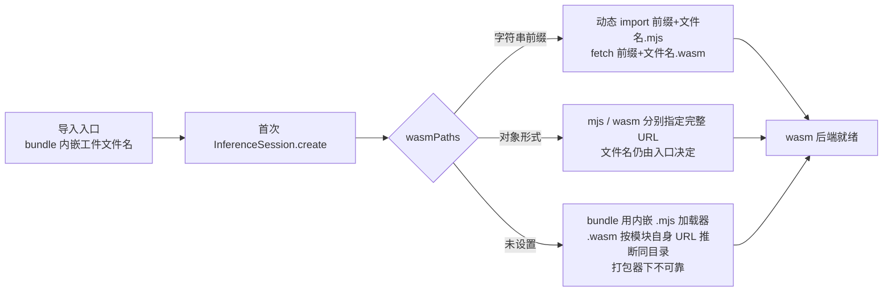

import { Canvas, Controls, Meta } from '@storybook/addon-docs/blocks';
import * as WasmServing from './wasm-serving.stories';

<Meta of={WasmServing} name="Docs" />

# WASM 资源伺服

`import * as ort from 'onnxruntime-web'` 成功只说明 JS 运行时就位。首次创建会话时，ort 还要按需取到一两份 ort-wasm 系列文件：几十 KB 的 `.mjs` 加载器，加十几到二十几 MB 的 `.wasm` 本体。本课回答伺服的三个问题——文件有哪些、URL 怎么拼出来、在 Vite 工程里放到哪。读完应能预测：给定导入入口与 `wasmPaths`，运行时会请求哪些 URL；请求失败时，Network 面板和报错原文里该看什么。

伺服的解析规则只有一句公式：**实际请求的 URL = 你配置的位置 + 入口内嵌的文件名**。位置由 `wasmPaths` 决定，文件名由导入入口在构建期内嵌进 bundle，二者缺一不可。安装课的 CDN 前缀写法（见[安装与接入](?path=/docs/installation--docs)）就是这条公式的一个特例；本课聚焦自托管与打包器场景。



| 配置 | 要点 |
| --- | --- |
| 不设置 | bundle 内嵌 `.mjs` 加载器；`.wasm` 按模块自身 URL 推断同目录——脚本标签场景成立，打包器产物旁没有工件，须显式配置 |
| `'…/dist/'` | 字符串前缀，建议以 `/` 结尾的完整 URL；`.mjs` 动态 import 与 `.wasm` 拉取都用「前缀 + 内嵌文件名」 |
| `{ mjs, wasm }` | 对象形式，两个文件分别指定完整 URL（`URL` 对象也可，取 `.href`）；哈希文件名、双源部署时用 |
| 设置时机 | 只对下一次的首次初始化生效；`env` 是页面级单例，详见 [env 标志与生命周期](?path=/docs/ort-env--docs) |

## 工件清单

onnxruntime-web@1.30.0 的 `dist` 目录（实测）里，与浏览器推理相关的工件是四对同主名文件：每对 = 一个 `.mjs` 加载器（Emscripten 生成，负责取回并实例化本体）+ 一个 `.wasm` 本体。另有训练用的 `ort-training-wasm-simd-threaded.wasm`，与浏览器推理无关。工件的运行形态语义（SIMD、线程、JSEP）见 [WebAssembly 后端](?path=/docs/backend-wasm--docs)，这里只关心「文件是什么、放哪、怎么取」。

| 工件对（`.mjs` + `.wasm` 同主名） | `.mjs` / `.wasm` 体积 | 服务哪个导入入口 |
| --- | --- | --- |
| `ort-wasm-simd-threaded.jsep.*` | 46 KB / 约 27 MB | `onnxruntime-web`（默认） |
| `ort-wasm-simd-threaded.*` | 24 KB / 约 13.6 MB | `onnxruntime-web/wasm` |
| `ort-wasm-simd-threaded.asyncify.*` | 52 KB / 约 25.5 MB | `onnxruntime-web/webgpu` |
| `ort-wasm-simd-threaded.jspi.*` | 50 KB / 约 16 MB | `onnxruntime-web/jspi` |

- **成对伺服，缺一不可。** `.mjs` 加载器取不到、或 `.wasm` 本体取不到，初始化都会失败——而且是两个不同阶段的失败（现场见下方实例）。
- **文件名由入口决定。** 入口 bundle 在构建期内嵌了它需要的工件文件名；伺服目录里必须至少包含当前入口那一对，换了入口就要换工件对。
- **只伺服需要的工件对就是体积优化。** 纯 CPU 应用改用 `onnxruntime-web/wasm` 入口并只部署纯工件对，首载工件从约 27 MB 降到约 13.6 MB；官方部署文档同样建议「只伺服必要的 wasm 二进制」。
- **版本配套。** 工件版本必须与 JS 包同版本（1.30.0 配 1.30.0），否则初始化可能直接失败。

## wasmPaths 配置

`wasmPaths` 有两种写法，共同语义就是开头的公式。 ort-env 课讲过它的生效时机——只在第一次 create 之前有效；本课补全「值怎么写」。

### 字符串前缀

```ts
ort.env.wasm.wasmPaths = 'https://cdn.jsdelivr.net/npm/onnxruntime-web@1.30.0/dist/';
```

- 前缀逐字拼接：`.mjs` 用 `import(前缀 + 'ort-wasm-simd-threaded.jsep.mjs')` 动态导入，`.wasm` 用同一前缀拼文件名拉取，两份文件落在同一目录。
- 用以 `/` 结尾的完整 URL（或以 `/` 开头的站点绝对路径）。相对写法会以页面 URL 为基准解析，部署到子路径时容易漂移。
- 官方 d.ts 同时标注：对象形式的两个路径「应为绝对路径」。

### 对象形式

```ts
ort.env.wasm.wasmPaths = {
  mjs: 'https://cdn.jsdelivr.net/npm/onnxruntime-web@1.30.0/dist/ort-wasm-simd-threaded.jsep.mjs',
  wasm: 'https://cdn.jsdelivr.net/npm/onnxruntime-web@1.30.0/dist/ort-wasm-simd-threaded.jsep.wasm',
};
```

- 何时需要：两个文件不在同一前缀下（例如 `.mjs` 来自打包器产物、`.wasm` 在静态目录，见下文 `?url` 做法），或文件名被构建管线改成哈希名、字符串前缀拼不出来时。
- 位置变了，文件名没变：对象形式仍必须给出与入口配套的那一对，把默认入口配上 `ort-wasm-simd-threaded.mjs`（纯 CPU 工件）照样失败。

### 正确与错误的现场

下方实例把 create 拆成三段流水线：取 `.mjs` 加载器 → 取并编译 `.wasm` → 会话就绪。五个档位都在**全新 worker** 里真实执行一次 create（`env` 是页面级单例、失败粘滞到刷新，worker 让正确与错误档位可以反复运行，也不影响本页其他课程的实例；把 ort 放进 worker 本身是 [proxy 工作线程](?path=/docs/proxy-worker--docs)的主题，这里只借它做隔离容器）。正确档位首次会真实下载约 27 MB 的 `.wasm`，命中 HTTP 缓存后复访很快。

<Canvas of={WasmServing.PathProbe} />
<Controls of={WasmServing.PathProbe} />

| 读者操作 | 可观察证据 |
| --- | --- |
| 保持默认「CDN 前缀」或切到「对象形式」 | 画布三阶段全绿；读数列出实际拉取的 `.mjs` 与 `.wasm` 完整 URL——正是「前缀 + 入口内嵌文件名」 |
| 切到「不设置（打包器默认）」 | 中断在第②阶段：`.mjs` 是 bundle 内嵌的（读数显示「bundle 内嵌」），`.wasm` 按模块自身 URL 推断到产物目录旁——那里没有工件 |
| 切到「前缀不存在（.mjs 404）」 | 中断在第①阶段：报错原文是动态 import 失败，并包含按前缀拼出的完整 `.mjs` URL |
| 切到「仅 .wasm 路径错误」 | 中断在第②阶段：加载器已取到，`.wasm` 拉取/编译失败——与上一档是两种失败面 |
| 打开 DevTools 的 Network 面板 | 能看到对应请求的 404；报错文案各浏览器措辞不同，URL 才是稳定线索 |
| 打开 Show code | 看到该 Canvas 实际执行的 `path-attempt.worker.ts`——五档配置与真实 create |

中断阶段按报错原文与 worker 内资源记录判定；个别浏览器不为动态 import 记录资源条目时，以读数里的报错原文为准。

## Vite 工程伺服

前缀的值取决于工件最终随哪个 URL 伺服。Vite 下三种主流做法解决的是同一件事：把 `node_modules/onnxruntime-web/dist` 里的工件变成可访问的 URL。本节代码是工程配置的概念示意——本手册的 Storybook 工作区不修改共享 Vite 配置，实例里也无法复现构建产物部署，所以不出 Canvas。顺带一提：这个工作区本身就是 Vite 项目，既有课程实例全部只靠「npm 依赖 + CDN 前缀」运行，没有任何自定义 Vite 配置；起步时显式给 `wasmPaths` 指向 CDN 最省事，要自托管再选下面一种做法落地。

### 复制到 public 目录

思路：构建时把工件复制进 `public/`（原样伺服、文件名不变），`wasmPaths` 指向前缀。最小做法是一条复制命令；注意只复制当前入口那一对。

```json
// package.json——默认入口是 jsep 工件对
{
  "scripts": {
    "copy:ort-wasm": "cp node_modules/onnxruntime-web/dist/ort-wasm-simd-threaded.jsep.* public/ort-wasm/"
  }
}
```

```ts
// 应用入口
import * as ort from 'onnxruntime-web';

ort.env.wasm.wasmPaths = `${import.meta.env.BASE_URL}ort-wasm/`;
```

- `import.meta.env.BASE_URL` 会带上 Vite 的 `base` 配置，子路径部署时前缀不漂移。
- 升级 onnxruntime-web 后必须重新复制，否则 JS 与工件版本错配（这是手工复制最容易翻车的点）。

### 用 ?url 让打包器接管工件

思路：`?url` 后缀让 Vite 把文件当资源处理——dev 下可直接访问，build 下发射成带内容哈希的资产 URL；工件随包版本走，不需要手工复制。onnxruntime-web 的 `exports` 把八个工件文件逐个导出为子路径，所以不必写 `dist` 深路径：

```ts
// 应用入口（默认入口 → jsep 工件对）
import * as ort from 'onnxruntime-web';
import ortWasmMjs from 'onnxruntime-web/ort-wasm-simd-threaded.jsep.mjs?url';
import ortWasmBinary from 'onnxruntime-web/ort-wasm-simd-threaded.jsep.wasm?url';

ort.env.wasm.wasmPaths = { mjs: ortWasmMjs, wasm: ortWasmBinary };
```

- build 后文件名带哈希，字符串前缀拼不出来——所以 `?url` 必须搭配对象形式，这正是对象形式存在的场景。
- 要的是「位置」：`?url` 返回 URL 字符串。不要用 `?init`——那会把工件当作独立 wasm 模块实例化，而 ort 需要自己控制实例化流程。
- 反过来也不要不加后缀直接 `import` 工件：`.wasm`/`.mjs` 会被当作 JS 模块解析，dev 或 build 直接报错。

### 用插件自动复制

思路：把「复制到 public」变成构建配置的一部分，避免手工命令漂移。社区常用 `vite-plugin-static-copy`：

```ts
// vite.config.ts（概念示意——本工作区的共享配置未做此修改）
import { defineConfig } from 'vite';
import { viteStaticCopy } from 'vite-plugin-static-copy';

export default defineConfig({
  plugins: [
    viteStaticCopy({
      targets: [
        {
          src: 'node_modules/onnxruntime-web/dist/ort-wasm-simd-threaded.jsep.*',
          dest: 'ort-wasm',
        },
      ],
    }),
  ],
});
```

三种做法的取舍：快速验证选 public + 复制命令；要可重复构建选静态复制插件；要哈希文件名与缓存一致性选 `?url` + 对象形式。它们解决的都是「工件在哪」，选型差异只在自动化程度与缓存语义。

## 最佳实践

- **排查从 Network 面板开始，对照那句公式。** 404 请求的 URL 直接暴露两段信息：路径部分对应你设的前缀，文件名部分对应入口内嵌的名字。哪一段不对，就修哪一段。
- **版本三处对齐。** lockfile 里的 onnxruntime-web、被伺服的工件副本、CDN 写法里写死的版本号必须是同一版本；升级包之后工件要同步更新，CDN 前缀要同步改版本号。
- **只伺服当前入口那一对。** 纯 CPU 应用用 `onnxruntime-web/wasm` 入口，把首载工件从约 27 MB 降到约 13.6 MB；用不到的后端入口不必部署。
- **自托管与 CDN 按需取舍。** CDN（jsDelivr/unpkg，锁定版本号）零运维、有边缘缓存，适合原型与公网应用；自托管同源可用性可控、天然与包版本一致，也适合内网、离线与严格 CSP 环境——官方部署文档说明 1.19 起 wasm 文件与 worker 可以在受限 CSP 下加载，前提是工件被正常伺服。
- **给工件配稳定的缓存策略。** 自托管时工件内容随版本不变，适合长缓存 + 版本化路径；缓存头与部署响应头的整体策略（含多线程所需响应头）见[部署](?path=/docs/deployment--docs)课程。

## 常见问题

- create 报 `Failed to fetch dynamically imported module: …/ort-wasm-simd-threaded.jsep.mjs`（或类似的模块加载失败）。
  前缀下取不到 `.mjs` 加载器。报错里的 URL 就是「你设的前缀 + 入口内嵌文件名」：逐段核对目录是否存在、是否以 `/` 结尾、版本是否一致。
- `.mjs` 取到了，报错发生在 `.wasm` 阶段：Network 里 `.wasm` 是 404，或出现 `CompileError` 之类的编译错误。
  工件只部署了一半，或 404 后拿到的是 HTML 错误页——编译器读到的不是 wasm 二进制。工件必须成对伺服。
- 换了导入入口（如 `onnxruntime-web` → `onnxruntime-web/wasm`）后开始 404。
  入口决定工件文件名（bundle 内嵌），伺服目录里没有新入口那一对。对照上方工件清单补齐，或按入口裁剪。
- 修正路径后再 create，报 `previous call to 'initializeWebAssembly()' failed.` 或 `multiple calls to 'initializeWebAssembly()' detected.`。
  wasm 后端一次性初始化且失败粘滞，改配置不会原地重试——刷新页面或重启应用。本课实例因为每次尝试都在全新 worker 里执行，才能反复切换档位。
- dev 正常，build 后 404。
  工件没进构建产物：public 未复制、`base` 前缀不匹配，或 `?url` 写法被改动。用 build 产物本地起服务，在 Network 面板里把 404 的 URL 与配置逐段核对。

## 总结回顾

摘要：

本课补上了「JS 就位」到「wasm 就绪」之间的最后一公里：1.30.0 的 dist 里有四对 `ort-wasm-simd-threaded*` 工件（`.mjs` 加载器 + `.wasm` 本体），入口 bundle 内嵌文件名，`wasmPaths` 只决定位置——字符串前缀拼两个文件，对象形式分别指定；配置错误在两个不同阶段暴露（`.mjs` 动态导入失败、`.wasm` 拉取编译失败），worker 实例给出了五档配置的真实现场；Vite 工程用 public 复制、`?url` 资源导入或静态复制插件把工件变成可访问 URL，`?url` 的哈希文件名必须搭配对象形式。上线前用 Network 面板验证「位置 + 文件名」与版本配套。

一句话：

> 伺服 ort-wasm 只有一句公式——实际请求的 URL = 你配置的位置 + 入口内嵌的文件名；保证这个 URL 成对、同版本、可访问，伺服就完成了。

知识要点：

- 四对工件分别服务哪个导入入口？`.mjs` 与 `.wasm` 各承担什么角色？
- 「位置 + 文件名」公式里，哪一半由入口决定、哪一半由 `wasmPaths` 决定？
- 字符串前缀与对象形式各自适合什么场景？
- `.mjs` 阶段与 `.wasm` 阶段的失败，在报错原文和 Network 面板里分别长什么样？
- Vite 下三种伺服做法（public 复制、`?url`、静态复制插件）如何取舍？

## 参考资料

- [Deploying ONNX Runtime Web](https://onnxruntime.ai/docs/tutorials/web/deploy.html) — 官方部署指南：需伺服的资产清单、覆盖 wasm 路径、worker 加载与 CSP、按需裁剪工件
- [onnxruntime-web API 参考](https://onnxruntime.ai/docs/api/js/index.html) — `wasmPaths`（字符串前缀 | `{ mjs, wasm }`）与 `wasmBinary` 的权威签名
- [microsoft/onnxruntime 仓库 js 目录](https://github.com/microsoft/onnxruntime/tree/main/js) — dist 工件清单，以及 wasm-factory / wasm-utils-import 里「前缀 + 内嵌文件名」的解析实现
- [importing_onnxruntime-web 示例](https://github.com/microsoft/onnxruntime-inference-examples/tree/main/importing_onnxruntime-web) — 各导入入口与所需工件文件的对照
