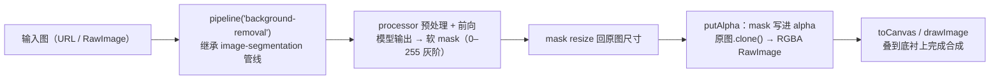

import { Canvas, Controls, Meta } from '@storybook/addon-docs/blocks';
import * as BackgroundRemoval from './background-removal.stories';

<Meta of={BackgroundRemoval} name="Docs" />

# 背景移除

视觉管线里大多数任务给你标签、框或 mask，`background-removal` 给的是**成品**：一张抠好前景、带透明通道的图——`RawImage`（`channels: 4`，RGBA），背景像素 alpha 为 0，前景边缘保留 0–255 的软过渡。管线内部只有两步：复用 image-segmentation 管线产出灰阶软 mask，再把 mask 逐像素写进原图克隆的 alpha 通道。与 [3.2.2 分割与深度估计](?path=/docs/segmentation-depth--docs) 的边界一句话：分割回答「每个像素属于哪一类」，背景移除只回答「前景在哪」——不要类别、只要主体抠图时用本课的管线。输入与 RawImage 的完整机制见 [2.1.3 processor 与多模态输入](?path=/docs/processor--docs)，本课聚焦输出侧与合成实践。

读完本页你应该能预测实例的行为：切换「示例图片」，右侧抠图与「输出尺寸」「推理用时」读数同步更新；把「合成底衬」从棋盘格换成纯色，透明区域直接显出该颜色而前景不变；「软边界像素」读数把 mask 的软过渡变成可核对的数字——它统计 alpha 处于 0 与 255 之间的像素占比，证明输出不是二值黑白。



| 项 | 默认值 / 取值 | 回查要点 |
| --- | --- | --- |
| `task` | `'background-removal'` | 返回 `BackgroundRemovalPipeline`（v4.3.0） |
| 模型 ID（第二参） | `Xenova/modnet`（任务默认） | 人像 matting 模型；仓库 config 固定 fp32，WASM 默认下载约 25.9 MB |
| 输出（单图输入） | `RawImage`，`channels: 4`（RGBA） | mask 已写进 alpha；输出尺寸 = 原图尺寸 |
| 输出（数组输入） | `RawImage[]` | 数组长度必须为 1（继承分割管线的 batch 1 限制） |
| 专属参数 | 无 | 分割的 `threshold` / `mask_threshold` / `subtask` 对本管线默认路径无效果（v4.3.0 源码） |
| alpha 语义 | 0 透明 / 255 不透明 / 中间为软边界 | 软 mask 直接写进 alpha，不是二值 |
| 消费出口 | `toCanvas()` / `toBlob()` / `save()` | PNG 保留 alpha；方法清单见 [2.1.3 课](?path=/docs/processor--docs) |

## 快速上手

最小闭环是一次调用（官方文档示例，输出值取自该页）：

```js
import { pipeline } from '@huggingface/transformers';

const remover = await pipeline('background-removal', 'Xenova/modnet');
const url =
  'https://huggingface.co/datasets/Xenova/transformers.js-docs/resolve/main/portrait-of-woman_small.jpg';
const output = await remover(url);
// RawImage { data: Uint8ClampedArray(648000), width: 360, height: 450, channels: 4 }
// channels 4 = RGBA：mask 已写进 alpha，背景透明
```

拿到 `RawImage` 后按用途三选一（实例方法的行为见 [2.1.3 课](?path=/docs/processor--docs)）：

```js
const canvas = output.toCanvas(); // 透明画布：可直接 drawImage 合成或插入页面
const blob = await output.toBlob('image/png'); // PNG 保留 alpha（JPEG 会丢透明）
await output.save('cutout.png'); // 浏览器里触发下载
```

图层合成只有两步：先画底，再把抠图叠上去（canvas 默认 source-over 规则自动按 alpha 混合）：

```js
const target = document.createElement('canvas');
target.width = output.width;
target.height = output.height;
const ctx = target.getContext('2d');
ctx.fillStyle = '#22c55e'; // 任意底色，或先铺棋盘格
ctx.fillRect(0, 0, target.width, target.height);
ctx.drawImage(output.toCanvas(), 0, 0); // alpha < 255 的像素与底色混合
```

首次运行需下载库本体（约 1.1 MB）与 fp32 模型（约 25.9 MB），下载与缓存行为见 [1.2 第一个 pipeline](?path=/docs/first-pipeline--docs)；下面的内嵌实例用同一模型与同一调用方式。

## 抠图输出：带透明通道的 RawImage

输出的全部机制就是两条源码事实（v4.3.0）：

- **软 mask 的产生**在父类 image-segmentation 管线里完成：模型输出若超出 `[0, 1]` 自动补 sigmoid，再 `×255` 转 uint8、resize 回原图尺寸——得到一张 0–255 灰阶、与原图同尺寸的 mask。
- **mask → alpha**在子类里完成：对每张输入图执行 `img.clone()` + `putAlpha(mask)`，mask 的每个灰度值直接成为对应像素的 alpha。`putAlpha` 要求 mask 与图像同尺寸、单通道（`utils/image.js` 源码）。

所以输出有三条恒成立的性质：**背景透明**（alpha 0）、**前景不透明**（alpha 255）、**边界是软的**（中间灰度原样保留——发丝、虚化边缘不会被切成锯齿）。输出尺寸与原图一致，`label` / `score` 一概没有。

<Canvas of={BackgroundRemoval.Interactive} />
<Controls of={BackgroundRemoval.Interactive} />

| 读者操作 | 可观察证据 |
| --- | --- |
| 等待首次加载 | 「状态」从 加载中 变为 就绪（附带加载用时），画布显示下载百分比 |
| 切换「示例图片」 | 左侧原图与右侧抠图同步更新，「输出尺寸」「推理用时」「软边界像素」刷新 |
| 把「合成底衬」换成纯色 | 抠图中透明区域直接显出该颜色，前景像素不变——换底衬只重绘、不重新推理 |
| 对比左右两列 | 抠图内容与原图逐像素对齐（同尺寸等比缩放），背景处露出底衬 |
| 打开 Show code | 查看实例实际执行的 `cutout-composite.ts` |

三个贴着输出的边界：

- **专属参数不存在。** 官方文档把 `BackgroundRemovalPipelineOptions` 定义为空类型；分割管线的 `threshold` 等选项只用于 panoptic / instance / semantic 后处理路径，modnet 与 RMBG 这类单 mask 模型走「标准路径」，传了也不会被读取（v4.3.0 源码核实）。
- **批量只有形式。** 数组输入返回 `RawImage[]`，但长度必须为 1，超过直接抛错（继承自分割管线）。
- **透明只存在于能表达 alpha 的介质里。** `toBlob('image/png')`、canvas 合成、支持透明的图像软件都保留；导出 JPEG 或贴到不支持透明的底上，透明区域会被填充色替代。

## 与 image-segmentation 的边界

两个管线同源（本课管线是分割管线的子类），输出契约完全不同：

| 维度 | `background-removal`（本课） | `image-segmentation`（[3.2.2](?path=/docs/segmentation-depth--docs)） |
| --- | --- | --- |
| 输出形态 | `RawImage`（RGBA），alpha 即 mask | `[{ label, score, mask }]`：mask 是独立的灰度图 |
| 语义 | 只有「前景 / 背景」二元 | 每个分段有类别与分数 |
| 典型问题 | 把主体抠出来换底、导出透明素材 | 图里有哪些区域、各属于什么类、每类多大 |
| 配套模型 | modnet、RMBG-1.4（单 mask 输出） | DETR-panoptic、Segformer、SAM 等（多段输出） |

选择规则：**只要主体、不要类别**（换背景、加透明通道、人像框）→ 本课管线，输出拿来即用；**要按类别区分区域**（逐类选区、面积统计）→ `image-segmentation`；要**点选式交互分割** → SAM（入口与用法见 [3.2.2](?path=/docs/segmentation-depth--docs)）。两点补充判断依据：其一，对 modnet 这类模型，`image-segmentation` 返回 `[{ label: null, score: null, mask }]`——拿到 mask 自己调 `putAlpha` 也能得到同样的抠图，`background-removal` 只是把这最后一步内置了；其二，本课模型不认识类别，输出里自然也没有类别信息，想知道「抠出来的是什么」得另请分类或检测（[3.2.1](?path=/docs/image-classification-detection--docs)）。

## 换模型：modnet 与 RMBG-1.4

两个常用模型共用同一管线入口，定位与成本不同（体积为本课核实的仓库实际文件大小）：

| | `Xenova/modnet`（任务默认） | `briaai/RMBG-1.4` |
| --- | --- | --- |
| 定位 | 人像 matting（trimap-free） | 通用显著目标抠图，主体不限人像 |
| 许可证 | Apache-2.0 | `bria-rmbg-1.4`：仅限非商业，商业使用需与 BRIA 签约 |
| WASM 默认下载 | fp32 约 25.9 MB（仓库 config 固定） | q8 约 44.4 MB（仓库未固定，走设备默认） |
| 其他档位 | q8 约 6.6 MB、fp16 约 13 MB | fp16 约 88.2 MB、fp32 约 176.2 MB |
| 预处理输入 | 短边 512（`size_divisibility: 32`） | 固定 1024×1024 |

调用上只差模型 ID：`await pipeline('background-removal', 'briaai/RMBG-1.4')`。默认下载体积的差异来自 v4.3.0 的 dtype 决策顺序：**显式传入 `dtype` > 仓库 config.json 的 `transformers.js_config.dtype` > 设备默认（wasm → q8）**（源码 `session.js`）。所以即使不传参数也下载 25.9 MB 的 fp32（想用 6.6 MB 的 q8 必须显式传 `dtype`，质量需自评）；RMBG-1.4 没有固定，落到 wasm 默认的 q8。RMBG-1.4 的 fp32 达 176 MB，已接近 `device-dtype` 课讨论的「加载前先看体积」量级，1024×1024 输入在 WASM 上也明显慢于 modnet 的短边 512——换档与设备的完整取舍见 [2.3.1 device 与 dtype](?path=/docs/device-dtype--docs)。

## 最佳实践

- **按主体类型选模型，而不是按精度评分。** 人像场景（会议虚拟背景、证件照、直播抠像）用默认 `Xenova/modnet`：小、快、Apache-2.0；主体是商品、动物或人像之外的目标 → `briaai/RMBG-1.4`（显著目标分割），但注意它的非商业许可。两者都不需要（也不支持）指定类别——这正是选它们而非分割模型的理由。
- **软边界的合成取舍先看读数再动手。** 底衬与前景差异越大，软边界像素的中间色越显眼（实例里换底衬即可观察）：浅色或近似底色上过渡自然；要硬边（绿幕工作流、逐像素后期）再对 `output.data` 的 alpha 做阈值二值化——先用「软边界像素」读数确认软像素占比，避免无谓处理。
- **提速按顺序尝试。** 先确认默认档位（modnet 是 fp32 25.9 MB，显式 `dtype: 'q8'` 可降到 6.6 MB，质量需自评）；WASM 单张数秒仍不够，再上 WebGPU——官方 `remove-background-webgpu` 示例用 `AutoModel` + `AutoProcessor` 并传 `device: 'webgpu'` 直接前向，管线也可传同款参数；WebGPU 兼容现状以 [2.3.1 课](?path=/docs/device-dtype--docs) 的说明为准。

## 常见问题

- 抠的是商品、动物之类非人像主体，`modnet` 效果很差甚至整图错乱
  模型定位使然：modnet 的训练目标是人像 matting，对非人像主体不保证效果。换 `briaai/RMBG-1.4`（通用显著目标抠图），调用方式不变、只换模型 ID；人像场景则反过来优先 modnet。
- 传入多张图的数组直接抛错
  继承了分割管线的 batch 1 限制：数组长度必须为 1，超过 1 张抛 `Image segmentation pipeline currently only supports a batch size of 1.`。批量就逐张串行调用，模型只加载一次。
- 下载的模型体积和预期对不上（比如文档说 q8 很小，实际下了 25.9 MB）
  按 v4.3.0 的 dtype 决策顺序核对：显式 `dtype` 参数 > 仓库 config 的 `transformers.js_config.dtype` > 设备默认（wasm 为 q8）。modnet 被仓库固定为 fp32，不显式传 `dtype: 'q8'` 就不会下载 6.6 MB 的量化档；RMBG-1.4 反之未固定，wasm 下默认就是 q8。
- 抠图边缘有一圈中间色或发灰，叠在深色底上尤其明显
  这是软边界的正常表现而非 bug（实例「软边界像素」读数就是这类像素的占比）：alpha 处于中间值的像素会与底衬混合出过渡色。处理顺序：换与前景协调的底色观察；要保留发丝级过渡就导出 PNG 软 alpha（图像软件里继续调）；确定要硬边才对 `output.data` 的 alpha 做阈值二值化。

## 总结回顾

摘要：

`background-removal` 是输出即成品的视觉管线：继承 image-segmentation 完成预处理与前向，把模型输出变成 0–255 的灰阶软 mask（超出 [0,1] 自动补 sigmoid、×255、resize 回原图尺寸），再用 `putAlpha` 把 mask 逐像素写进原图克隆的 alpha 通道，得到 `channels: 4` 的 RGBA `RawImage`——背景透明、软边界保留、尺寸与原图一致；单图输入返回单个 RawImage，数组输入返回数组但长度必须为 1，管线没有专属参数（分割的 `threshold` 等选项在默认路径不生效）。与 `image-segmentation` 的分工：分割给「类别 mask」（label / score + 独立 mask），本课给「前景抠图」（无类别）；只要主体不要类别时选本课。模型上默认 `Xenova/modnet`（人像 matting，fp32 约 25.9 MB，Apache-2.0），通用主体用 `briaai/RMBG-1.4`（wasm 默认 q8 约 44.4 MB，非商业许可，输入 1024×1024），默认档位由「显式 dtype > 仓库 config > 设备默认 q8」的顺序决定。合成的固定套路是「先画底衬、再 `drawImage` 抠图」，消费走 `toCanvas` / `toBlob` / `save` 三个出口。

一句话：

> 背景移除就是「分割产出的软 mask 写进 alpha 通道」——输出一张带透明通道的 RawImage 拿来即合；要类别找分割管线，要抠图找本课。

知识要点：

- `background-removal` 的输出类型是什么？单图与数组输入各返回什么？输出尺寸和通道数如何确定？
- mask 如何变成透明？alpha 为 0、255 和中间值各对应什么？「软边界像素」读数证明了什么？
- 与 `image-segmentation` 在输出形态和适用场景上有什么差异？同源关系体现在哪？
- modnet 与 RMBG-1.4 在定位、许可证、默认下载体积和预处理输入上的差异？v4.3.0 的 dtype 默认值按什么顺序决定？
- `threshold` 对本管线有效吗？批量输入的限制是什么？抠图的三种消费出口和图层合成两步怎么写？

## 参考资料

- [Transformers.js 官方文档 · pipelines API](https://huggingface.co/docs/transformers.js/en/api/pipelines)
  `background-removal` 的官方示例与输出值（快速上手代码与 `RawImage { …, channels: 4 }` 输出取自该页）。
- [background-removal pipeline 源码（main，v4.3.0）](https://github.com/huggingface/transformers.js/blob/main/packages/transformers/src/pipelines/background-removal.js)
  输出组装：`img.clone()` + `putAlpha(mask)`，单图 / 数组的返回形态。
- [image-segmentation pipeline 源码（main，v4.3.0）](https://github.com/huggingface/transformers.js/blob/main/packages/transformers/src/pipelines/image-segmentation.js)
  软 mask 生成（sigmoid → ×255 → resize 回原图）、batch 1 限制与分割选项的作用范围。
- [utils/image.js 源码（main，v4.3.0）](https://github.com/huggingface/transformers.js/blob/main/packages/transformers/src/utils/image.js)
  `putAlpha` 的尺寸 / 通道校验与写入实现；`toCanvas` / `toBlob` / `save` 消费出口。
- [pipelines/index.js 源码（main，v4.3.0）](https://github.com/huggingface/transformers.js/blob/main/packages/transformers/src/pipelines/index.js)
  `SUPPORTED_TASKS` 中 `background-removal` 的默认模型 `Xenova/modnet`。
- [models/session.js 源码（main，v4.3.0）](https://github.com/huggingface/transformers.js/blob/main/packages/transformers/src/models/session.js)
  dtype 决策顺序：`options.dtype ?? custom_config.dtype`，未固定时回落设备默认（wasm → q8）。
- [Xenova/modnet](https://huggingface.co/Xenova/modnet)
  任务默认模型：config 固定 `dtype: fp32`，`preprocessor_config.json` 短边 512，Apache-2.0，fp32 约 25.9 MB / q8 约 6.6 MB。
- [briaai/RMBG-1.4](https://huggingface.co/briaai/RMBG-1.4)
  通用抠图模型：`bria-rmbg-1.4` 许可证（非商业），预处理固定 1024×1024，q8 约 44.4 MB / fp16 约 88.2 MB / fp32 约 176.2 MB。
- [transformers.js-examples · remove-background-webgpu](https://github.com/huggingface/transformers.js-examples/tree/main/remove-background-webgpu)
  官方 WebGPU 抠图示例：`AutoModel` + `AutoProcessor` + `device: 'webgpu'`，`Xenova/modnet`。
- [Xenova/transformers.js-docs 数据集](https://huggingface.co/datasets/Xenova/transformers.js-docs)
  实例三张预置人像图的来源（官方文档示例所用图片，允许跨域访问）。
