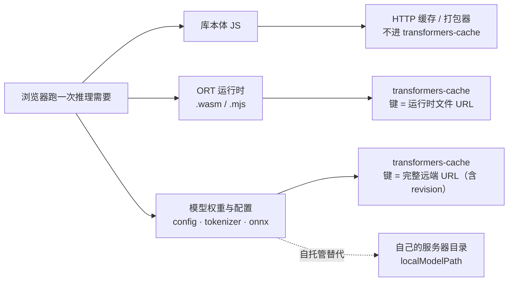

import { Canvas, Controls, Meta } from '@storybook/addon-docs/blocks';
import * as CacheOffline from './cache-offline.stories';

<Meta of={CacheOffline} name="Docs" />

# 缓存与离线

浏览器里跑一次模型推理，需要三类文件就位：**库本体 JS**、**ONNX Runtime 的运行时文件**（`.wasm` / `.mjs`）、**模型权重与配置**（config.json、tokenizer、onnx 权重）。库本体由打包器或 HTTP 缓存负责；后两类都经 `env.fetch` 加载，默认写进同一个 Cache API 缓存桶——`transformers-cache`（`env.cacheKey`）。所谓「离线」，就是让每次文件查找在前两步（缓存、本地）命中而不是落到远端。[1.2 第一个 pipeline](?path=/docs/first-pipeline--docs) 见过的「首次慢、二次快」是现象，本课给出这套缓存体系的全景：条目以什么为键、怎么判定命中、什么会失效，以及三种离线策略分别适合什么场景。

读完本页你应该能预测实例的行为：画布不加载任何模型、不发网络请求，直接读出本浏览器 `transformers-cache` 的真实条目（URL 键与 Content-Length 体积）；切换「观察对象」查看不同模型的条目；把「revision 探针」切到新版本，命中数从全中变成 0——revision 是缓存键的一部分。



三层缓存地图（键形态均经 v4.3.0 源码核实）：

| 层 | 存什么 | 条目键 | 开关（默认值见 2.3.2） | 离线意义 |
| --- | --- | --- | --- | --- |
| 模型权重缓存 | config、tokenizer / processor、onnx 权重，逐文件存取 | 完整远端 URL：`huggingface.co/<模型ID>/resolve/<revision>/<文件>` | `env.useBrowserCache`（浏览器默认 `true`） | 二次访问零网络；受配额驱逐影响 |
| WASM 运行时缓存 | `ort-wasm-simd-threaded.asyncify.wasm/.mjs` | 运行时文件的 CDN URL（含 ORT 版本号） | `env.useWasmCache`（默认 `true`） | 首次会话后不再依赖 CDN |
| 本地模型（自托管） | 与 Hub 仓库同构的目录 | 本地路径：`localModelPath/<模型ID>/<文件>` | `env.allowLocalModels`（浏览器默认 `false`）+ `env.localModelPath` | 完全可控，内网 / 合规场景 |

表里没有「库本体」一行：ES 模块 JS 不进 transformers-cache——npm 安装时进打包产物，CDN 动态导入时走 HTTP 缓存（2.3.2 课的请求清单可印证：CDN 导入不计入 `env.fetch` 记账）。

## 快速上手

最小闭环是启动时问一句：「这个模型现在离线可用吗」——缓存命中是纯本地判定，三行就能回答：

```js
import { ModelRegistry, pipeline } from '@huggingface/transformers';

const MODEL_ID = 'Xenova/distilbert-base-uncased-finetuned-sst-2-english';

// 纯本地检查：读 env 指向的缓存（浏览器里就是 transformers-cache），不发网络请求
const offlineReady = await ModelRegistry.is_pipeline_cached(
  'text-classification',
  MODEL_ID,
  { dtype: 'q8' },
);

// 能离线就直接加载；不能就先给用户「需下载约 67.6 MB」的预期（完整工作流见 2.3.3 课）
const classifier = await pipeline('text-classification', MODEL_ID, { dtype: 'q8' });
```

这一问判的是什么、为什么可靠，下一节拆开看。

## 模型权重缓存

库把模型侧的每个文件独立地「下载 → 写入 → 命中」，全部发生在同一个 Cache API 缓存桶：`caches.open(env.cacheKey)`，默认名 `transformers-cache`。注意它是 Cache Storage 而不是 HTTP 缓存——DevTools 的 Application → Cache Storage 面板里能直接看到条目（1.2 课删缓存就是在这里）。缓存后端的优先级（`useCustomCache → crossOriginStorage → useBrowserCache → useFSCache`）与各开关机制在 [2.3.2 env 配置](?path=/docs/env-config--docs)已讲，本节聚焦键与命中。

### 条目键：完整远端 URL

浏览器缓存里，一个文件的键就是它的**完整远端 URL**（源码 `buildResourcePaths`：非文件缓存时 `proposedCacheKey = remoteURL`）。按默认 `remoteHost` 与 `remotePathTemplate`（`{model}/resolve/{revision}/`）拼出来：

```text
https://huggingface.co/<模型ID>/resolve/<revision>/<文件名>

https://huggingface.co/Xenova/distilbert-base-uncased-finetuned-sst-2-english/resolve/main/onnx/model_quantized.onnx
```

三个直接推论：

- **revision 参与键。** revision 默认 `'main'`（`options.revision ?? 'main'`）；显式传别的 revision 就是另一批键、另一批条目。1.2 课「生产代码固定版本」的建议，在缓存层面的含义就是键稳定。
- **dtype 参与键。** dtype 决定 onnx 文件名（`model_quantized.onnx` 等，映射见 [2.3.1 device 与 dtype](?path=/docs/device-dtype--docs)），所以（模型, revision, dtype）每个组合独立占条目——2.3.1 课「切一下 dtype 就重新下载几十 MB」的根源在这里。
- **remoteHost 参与键。** 换镜像（改 `remoteHost`）会让所有键失配、全部重新下载，哪怕文件一个字节没变。

Node 边界一句话：文件系统缓存的键不带主机名——revision 为 `main` 时键是 `<模型ID>/<文件>` 相对路径，其他 revision 才在模型 ID 后插入 revision 段（同出 `buildResourcePaths`）。

### 命中判定

每个文件的查找顺序是「缓存 → 本地 → 远端」（流程图见 2.3.2 课）；缓存这一步是**纯本地**的 URL 匹配：`cache.match(<远端 URL>)`，命中直接返回，`env.fetch` 一次都不调用（浏览器缓存会先试 localPath 再试远端 URL 两个键，源码 `tryCache`）。官方检查入口是 `ModelRegistry.is_pipeline_cached`（逐文件明细用 `is_pipeline_cached_files`，见 [2.3.3 ModelRegistry](?path=/docs/model-registry--docs)）。

下面的实例把这件事拆开给你看：不导入库，直接用 Cache API 读取本浏览器 transformers-cache 的真实条目，再按同样的 URL 规则构造键逐文件 match——与库的查找同构。条目来自运行过的兄弟课程；全新浏览器显示 0 条也是有效观察。

<Canvas of={CacheOffline.Interactive} />
<Controls of={CacheOffline.Interactive} />

| 读者操作 | 可观察证据 |
| --- | --- |
| 保持 distilbert 视图（main 探针） | 运行过 1.2 课的浏览器列出该模型的 config / tokenizer / onnx 条目与体积；「命中判定」全部命中——不联网也能加载 |
| 切「观察对象」到其他模型 | 条目清单换成该模型的真实文件（whisper 视图能看到 encoder 与 decoder 两个 onnx 会话文件）；没跑过对应课程则为 0 条 |
| 切「观察对象」到 WASM 运行时 | 青色行列出 `ort-wasm-*.wasm` / `.mjs`——它们与模型权重在同一个桶里 |
| 切「revision 探针」到新版本 | 命中数变为 0/N：revision 变了键就变，全部失配 |
| 打开 Show code | 查看实例实际执行的 `cache-inventory.ts`（`caches.open` → `keys` → `match`） |

### 驱逐、配额与隔离

「缓存过」不是持久承诺，三个边界决定离线策略要不要加固：

- **按 origin 隔离。** 缓存跟着站点走：换端口、换域名互不可见；非 https / localhost 环境 Cache API 不可用（`caches` 不存在，库退化为每次全量下载）。开发时 localhost:6006 的缓存带不到生产域名。
- **可能被驱逐。** Cache Storage 属于「最佳努力」存储：磁盘压力大或用户清除站点数据时条目会消失；`navigator.storage.persist()` 可申请持久化降低驱逐概率。
- **写失败不致命。** 存储配额耗尽时 `cache.put` 抛 `QuotaExceededError`，库只打一条 warn（"Unable to add response to browser cache"）继续运行——表面一切正常，实际每次都在重新下载。控制台里这条 warn 是排查「怎么老在下载」的第一线索。

## WASM 运行时缓存

开关与配置机制见 [2.3.2 env 配置](?path=/docs/env-config--docs)，本节讲它在离线里的位置。ONNX Runtime 的运行时文件——`ort-wasm-simd-threaded.asyncify.mjs/.wasm`，默认从 jsdelivr 的 `onnxruntime-web@<版本>/dist/` 拉取——在首次创建推理会话时经 `env.fetch` 加载，并在 `useWasmCache` 开启时写进**同一个 transformers-cache**，键就是运行时文件自己的 URL（源码 `loadAndCacheFile`：`cache.match(url)` → `cache.put(url, …)`）。

对离线的意义：**首次运行之后，运行时文件与模型权重一样不再依赖网络**——离线缺口只剩第一次。两个回查点：

- **失效跟随 ORT 版本。** 运行时 URL 里带着 `onnxruntime-web@<版本>`：库升级 → ORT 版本变 → URL 变 → 新条目，旧条目留存（见下文失效一节）。模型权重的键不含 ORT 版本，不受库升级影响。
- **两个已知限制**（2.3.2 课核实过）：`wasmPaths` 用字符串形式时不走库缓存（对象形式才走）；Service Worker / Chrome 扩展环境不缓存 `.mjs`（blob URL 限制）——SW 场景改用 SW 自己的预缓存拦截，见下文。

在上方实例切「观察对象」到 WASM 运行时即可核对：这些文件确实与模型权重同桶共存。清空整个 transformers-cache 会把它们一并清掉，下次创建会话要重新拉 CDN。

## 自托管本地模型

自托管把「远端」换成自己的服务器或目录：`env.localModelPath` 指向模型根目录，`env.allowRemoteModels = false` 断掉 Hub。开关默认值与 404 探测行为见 2.3.2 课；这里给出**目录布局**——库按 `<localModelPath>/<模型ID>/<文件>` 查找（源码 `localPath = pathJoin(env.localModelPath, 模型ID, 文件名)`），文件结构与 Hub 仓库完全同构：

```text
<localModelPath>/
└─ Xenova/distilbert-base-uncased-finetuned-sst-2-english/
   ├─ config.json                 # 仓库根：配置与分词器文件
   ├─ tokenizer.json
   ├─ tokenizer_config.json
   └─ onnx/
      └─ model_quantized.onnx     # onnx/ 子目录 + dtype 命名（映射见 2.3.1）
```

布局对了，报错就有对照：`allowRemoteModels = false` 且文件缺失时抛 `ModelFileNotFoundError`，报错里的路径就是它找过的 localPath（处理见 2.3.2 常见问题）。浏览器下 `<localModelPath>` 是 URL 路径——把目录用任意静态服务器托管在同源路径下即可（跨源要带 CORS 头）；Node 下是文件系统路径。

与缓存叠加的细节（源码核实）：自托管只是换了文件来源，缓存行为照旧——第一次从本地源 200 拿到的文件同样写进 transformers-cache（键为 localPath），第二次加载命中缓存，**连本地请求都不发**。所以「自托管」与「缓存」不是二选一：自托管解决从哪拿，缓存解决拿几次。

## 离线策略怎么选

三条路线是「首访网络依赖 → 长期可控性」的取舍：

| 策略 | 首次访问 | 离线能力 | 适用场景 | 代价 |
| --- | --- | --- | --- | --- |
| 纯 CDN + 浏览器缓存（默认） | 需在线，边下边用 | 二次访问可离线（缓存未被驱逐时） | demo、内部工具、轻量产品 | 零配置；缓存随时可能被清 |
| PWA / Service Worker 预缓存 | 可控：安装期或用户确认后批量下载 | 强：SW 按 URL 拦截，库无感知 | 正式 Web 应用，要给用户确定的离线承诺 | 要维护预缓存清单与更新逻辑；大模型占配额 |
| 自托管（`localModelPath`，可加 `wasmPaths`） | 从自己的源下载 | 强且完全可控；不依赖 Hub 与 jsdelivr | 内网、合规、钉死版本的生产部署 | 要自己托管与更新文件；组合拳配置见 2.3.2 |

两个动手要点：

- **SW 预缓存的键必须与库构造的 URL 完全一致。** 预缓存本质是「往缓存里放条目」，而库按 `https://huggingface.co/<模型ID>/resolve/main/<文件>` 查——键差一个字符就白存。权威清单用 `ModelRegistry.get_pipeline_files(task, modelId, { dtype })` 拿（2.3.3 课），逐文件拼 URL 后 `cache.put`；更省心的做法是运行时拦截：SW 的 `fetch` 事件放行库的下载请求，回源后顺手 `cache.put`，键天然一致。SW 环境里库自己不缓存 `.mjs`（上文限制），但 SW 拦截按 URL 生效，两种机制正交。
- **给离线可用性一个显式判断。** 启动时 `is_pipeline_cached`（快速上手的三行）决定展示「直接进入」还是「需下载 X MB」，比离线时才报 `Failed to fetch` 体验好得多。

需要更强保证时再加持久化：`navigator.storage.persist()` 申请把站点存储标记为持久（降低被驱逐概率）；或用 `useCustomCache` 把文件落到 IndexedDB 等自管实现（接口形状见 2.3.2 课）。

## 缓存失效与升级

失效的统一原因只有一个：**键变了**。实例的 revision 探针是最小重演——其他失效源都是同一机制的不同入口：

| 变化 | 键的哪部分变 | 结果 | 处理 |
| --- | --- | --- | --- |
| 模型升级（revision 变化） | URL 中段 | 该模型全部重新下载；旧条目留存 | 生产固定 revision；升级后清理旧条目 |
| 换档位（dtype） | onnx 文件名 | 新档位独立下载（2.3.1 实测） | 换档前先看体积 |
| 换镜像（remoteHost） | URL 主机名 | 所有模型重新下载 | 镜像在首访用户出现前定好 |
| 库升级（ORT 版本变） | 仅 WASM 条目 | 运行时文件重新拉取；权重不受影响 | 无需处理，一次性 |
| 用户清站点数据 / 删桶 | 全部 | 全部重来（1.2 课的清缓存入口） | 无法防范，只能自愈 |

两个补充判断：

- **旧条目不会自动清理。** 升级 revision 或 dtype 后，旧键的条目一直占着配额——多次升级后存储里躺着几代权重。用 `ModelRegistry.clear_pipeline_cache` / `clear_cache`（2.3.3 课）按模型清理，或在 DevTools 删整个桶。
- **`env.cacheKey` 改名等于换空桶**（2.3.2 课）：演示页与生产页隔离、排查缓存污染时用它，代价是全量重下。

## 常见问题

- 明明下载成功过，下次打开又要重新下载
  先查控制台有没有 "Unable to add response to browser cache"——配额耗尽时 `cache.put` 静默失败（只 warn 不报错），表面正常实际没存上。释放存储空间、换更小的档位，或用 `useCustomCache` 换自管存储。没有这条 warn 时，核对本次加载的模型 ID / revision / dtype / remoteHost 是否与上次一致——任何一项变化都是新键。
- 用 Service Worker 预缓存了模型文件，库却还是对 huggingface.co 发起请求
  预缓存的键与库构造的 URL 不一致（常见于漏掉 `/resolve/main/` 段或 onnx 文件名写错）。用 `get_pipeline_files` 拿权威清单重新拼 URL；同时确认 SW 的 fetch 拦截作用域覆盖了模型请求路径。
- 隐私窗口或内嵌 iframe 里，控制台出现 "An error occurred while opening the browser cache: DOMException…"
  浏览器安全策略拒绝了 `caches.open`（隐私模式的 iframe 中常见）。库会捕获这条错误并退化为无缓存运行——功能正常，但每次都全量下载；给这类用户保留「首次需在线」的预期即可，不是代码 bug。
- 离线打开页面，加载模型报 Failed to fetch
  逐层核对：这个浏览器是否在在线状态下加载过该模型（缓存为空则无从命中）；页面是否 https 或 localhost（否则 Cache API 不可用）；本次加载的 revision / dtype 是否与当时一致。自托管场景检查 `allowRemoteModels = false` 时本地目录是否有对应文件——报错里的路径就是线索。

## 总结回顾

摘要：

浏览器跑一次推理需要库本体、ORT 运行时文件与模型权重三类文件；后两类默认写进同一个 Cache API 缓存桶 `transformers-cache`（`env.cacheKey`），库本体由打包器或 HTTP 缓存负责。模型权重缓存的条目键是完整远端 URL——`huggingface.co/<模型ID>/resolve/<revision>/<文件>`，因此 revision、dtype、remoteHost 任何一个变化都是新键、都会重新下载；命中判定是纯本地的 URL 匹配（`cache.match`），官方入口 `ModelRegistry.is_pipeline_cached`。`useWasmCache` 让运行时文件（键含 ORT 版本）随首次会话入桶，首次运行后离线缺口只剩第一次。自托管用 `localModelPath` 按 Hub 仓库同构布局摆放文件，与缓存叠加后第二次加载连本地请求都不发。离线策略按可控性递进：默认 CDN+缓存零配置但可被驱逐；SW 预缓存给确定承诺但键必须与库一致；自托管完全可控。失效的统一原因是键变化，旧条目不自动清理，用 `clear` 系列方法或删桶回收。

一句话：

> 缓存键就是文件的完整远端 URL——revision、dtype、主机名变任何一个都会重新下载；离线策略的本质是决定键背后的文件从哪来、存多久。

知识要点：

- 浏览器跑一次推理需要哪三类文件？各自由哪一层缓存负责？
- transformers-cache 的条目键长什么样？revision、dtype、remoteHost 如何参与键？
- 缓存命中判定是怎么做的？为什么说是纯本地的？官方检查入口是什么？
- WASM 运行时文件何时进缓存、键是什么？为什么库升级只影响它们？
- 自托管本地模型的目录布局要求是什么？与缓存叠加后第二次加载发生什么？
- 三种离线策略各自适合什么场景？SW 预缓存最关键的约束是什么？
- 哪些变化会导致缓存失效？旧条目如何清理？缓存条目可能因为什么消失？

## 参考资料

- [utils/hub.js（v4.3.0 源码）](https://github.com/huggingface/transformers.js/blob/4.3.0/packages/transformers/src/utils/hub.js)
  `buildResourcePaths`：浏览器缓存键 = remoteURL（revision 参与）、FileCache 键规则、localPath 布局、QuotaExceededError 只 warn。
- [utils/cache.js（v4.3.0 源码）](https://github.com/huggingface/transformers.js/blob/4.3.0/packages/transformers/src/utils/cache.js)
  缓存后端优先级与 `caches.open(env.cacheKey)` 的实现。
- [backends/utils/cacheWasm.js（v4.3.0 源码）](https://github.com/huggingface/transformers.js/blob/4.3.0/packages/transformers/src/backends/utils/cacheWasm.js)
  运行时文件的缓存读写与键、Service Worker / 扩展环境的 `.mjs` 限制。
- [backends/onnx.js（v4.3.0 源码）](https://github.com/huggingface/transformers.js/blob/4.3.0/packages/transformers/src/backends/onnx.js)
  `shouldUseWasmCache`（wasmPaths 对象形式前提）、默认 jsdelivr 前缀与 ORT 版本号。
- [env.js（v4.3.0 源码）](https://github.com/huggingface/transformers.js/blob/4.3.0/packages/transformers/src/env.js)
  `useBrowserCache` / `useWasmCache` / `cacheKey` / `allowLocalModels` / `localModelPath` 默认值。
- [env API · 官方文档](https://huggingface.co/docs/transformers.js/en/api/env)
  缓存相关字段的官方定义。
- [ModelRegistry API · 官方文档](https://huggingface.co/docs/transformers.js/en/api/utils/model_registry)
  `is_pipeline_cached` / `get_pipeline_files` / `clear_pipeline_cache` 的参数与返回。
- [MDN · CacheStorage](https://developer.mozilla.org/en-US/docs/Web/API/CacheStorage)
  Cache API 的 secure context 要求与按 origin 隔离。
- [MDN · Storage quotas and eviction](https://developer.mozilla.org/en-US/docs/Web/API/Storage_API/Storage_quotas_and_eviction)
  配额与驱逐机制、`navigator.storage.persist()`。
- [2.3.2 env 配置](?path=/docs/env-config--docs)
  缓存开关与优先级、`useWasmCache` 配置、`allowLocalModels` 默认值与 404 探测的机制细节。
- [2.3.3 ModelRegistry](?path=/docs/model-registry--docs)
  检查与清理缓存的官方方法全集与「检查 → 确认 → 加载」工作流。
- [2.3.1 device 与 dtype](?path=/docs/device-dtype--docs)
  dtype → onnx 文件名映射与各档位实测体积。
