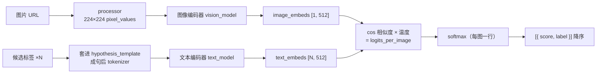

import { Canvas, Controls, Meta } from '@storybook/addon-docs/blocks';
import * as ClipImageMatching from './clip-image-matching.stories';

<Meta of={ClipImageMatching} name="Docs" />

# CLIP 图文匹配

CLIP（Contrastive Language-Image Pre-training）在 4 亿图文对上对比训练了两座编码器，把图像和文本压进**同一个 512 维向量空间**——配对的图文向量彼此靠近，无关的相互远离。于是「图里有没有 X」不再需要训练分类头：把候选标签编码成文本向量，逐个与图像向量比余弦相似度，就得到零样本图像分类；跳过概率直接读相似度，就是图文打分与以图搜文的底座。本课覆盖这条机制的管线入口（`zero-shot-image-classification`）、组件化手工链路和概率的正确读法；图像与音频的预处理机制见 [2.1.3 processor 与多模态输入](?path=/docs/processor--docs)，余弦相似度的定义见 [3.1.4 embedding](?path=/docs/embeddings--docs)。

读完本页你应该能预测实例的行为：保持「候选标签」不变切换「示例图片」，概率条整体翻转——老虎图上 `tiger` 拿到约 99.9%（官方示例值 0.9994），切到柯基图后 `dog` 跃居 top-1；编辑标签，所有概率立即在新的候选集内重新分配。



| 关键项 | 默认值 | 回查要点 |
| --- | --- | --- |
| 任务 ID 与默认模型 | `zero-shot-image-classification` → `Xenova/clip-vit-base-patch32` | 注册表写死（4.3.0 源码核实）；变体与拆分加载见「模型选择」 |
| `classifier(images, candidate_labels)` | `candidate_labels` 必填 | 字符串数组；返回 `[{ score, label }]` 已按 score 降序；批量传图数组才嵌套 |
| `hypothesis_template` | `'This is a photo of {}'` | 标签填入模板成句再编码；非照片域换模板，见「最佳实践」 |
| 概率归一化 | softmax，候选集内和为 1 | SigLIP 模型走 sigmoid（4.3.0 源码核实）；增删标签会重排全部概率 |
| 图文向量 | 512 维 | `image_embeds` / `text_embeds`；不保证归一化，比较用 `cos_sim` |
| 文本上限 | 77 token | 管线固定 `truncation: true`，超长标签静默截断 |
| 本课示例模型 | `Xenova/clip-vit-base-patch32` + `dtype: 'q8'` | q8 组合图约 154 MB；文本塔 64.5 MB / 视觉塔 89 MB 可拆开加载 |

## 快速上手

最小闭环是一次加载加一次调用：候选标签数组进、概率数组出。

```js
import { pipeline } from '@huggingface/transformers';

// 显式写全模型 ID 与 dtype: 'q8'（onnx/model_quantized.onnx，约 154 MB），体积与行为可复现；
// 不指定模型时注册表默认也是它
const classifier = await pipeline(
  'zero-shot-image-classification',
  'Xenova/clip-vit-base-patch32',
  { dtype: 'q8' },
);

const url = 'https://huggingface.co/datasets/Xenova/transformers.js-docs/resolve/main/tiger.jpg';

// 每个标签套进模板 'This is a photo of {}' 编码，与图像向量比相似度后 softmax
const output = await classifier(url, ['tiger', 'horse', 'dog']);
// [
//   { score: 0.9993917942047119, label: 'tiger' },
//   { score: 0.0003519294841680676, label: 'horse' },
//   { score: 0.0002562698791734874, label: 'dog' }
// ]（官方文档示例输出；实例在 q8 下数值可能略有出入，排序一致）
```

下面的内嵌实例执行的就是这条管线。**首次打开会下载约 154 MB 的 q8 模型文件（另有 config、tokenizer 等小文件），需要数十秒**，期间画布显示下载进度与用时。实例为免安装依赖改用官方 CDN 版本加载库（模式与 [1.2 第一个 pipeline](?path=/docs/first-pipeline--docs) 相同），管线代码与本节一致。

<Canvas of={ClipImageMatching.Interactive} />
<Controls of={ClipImageMatching.Interactive} />

| 读者操作 | 可观察证据 |
| --- | --- |
| 等待首次加载 | 「状态」从 加载中 变为 就绪（附带加载用时），画布显示下载百分比 |
| 保持标签不变，切换「示例图片」 | 左侧换图，右侧概率条整体翻转：老虎图 tiger ≈ 99.9%，柯基图 dog 跃居 top-1 |
| 编辑「候选标签」 | 所有概率立即重排；删掉最强标签后，其余标签分走它留下的概率 |
| 打开 Show code | 查看实例实际执行的 `clip-zero-shot.ts` |

三个输出边界值得先记住。**排序由管线负责**：返回值已按 `score` 降序排好，top-1 就是第 0 个元素。**批量按输入条数嵌套**：单图返回扁平数组，传图片数组才返回「每图一个数组」（[1.3 任务全景](?path=/docs/task-overview--docs) 的批量判断规则适用）。**概率在候选集内归一化**：softmax 只作用在这组候选标签上，增删任何标签都会重新分配全部概率——某个标签分数低，未必是「图里没有它」，可能是「别的标签分走了概率」。

## 双塔原理：图和文进同一个向量空间

CLIP 用两座独立的塔编码两种模态：视觉塔（ViT）吃 224×224 的图，文本塔（Transformer）吃最多 77 个 token 的句子，两座塔顶端各接一个投影层，把各自的表示投进同一个 512 维空间。关键在**对齐训练**：4 亿图文对上，配对图文的向量被拉近、错配的被推远——语义相近直接体现在向量夹角上，任何一张图和任何一句话都能比。

本课两个模型变体的差异只在视觉塔（`config.json` 核实）：

- `Xenova/clip-vit-base-patch32`：图切成 32×32 的 patch（7×7 = 49 个视觉 token），推理快；投影维度 512，文本上限 77 token。
- `Xenova/clip-vit-base-patch16`：同样 224×224 输入，但 patch 是 16×16（14×14 = 196 个视觉 token），视觉细节建模更细；投影维度同为 512。

两座塔可以拆开用：库为 CLIP 导出了 `CLIPVisionModelWithProjection` 与 `CLIPTextModelWithProjection`，分别加载 `vision_model*.onnx` 与 `text_model*.onnx`（4.3.0 源码核实），输出 `image_embeds` 与 `text_embeds`。只做单侧特征（如图像检索的入库）可以只加载一座塔，省一半下载（体积见「模型选择」）。

一个必记边界：`text_embeds` / `image_embeds` 是投影层的直接输出，**不保证是单位向量**（归一化发生在模型内部计算 logits 的那一步）。所以图文相似度一律用 `cos_sim` 比较——它自带模长修正，对是否归一化不敏感；只有先显式 L2 归一化，才可以用 `dot` 代替（结论与 [3.1.4 embedding](?path=/docs/embeddings--docs) 一致）。

## 手工图文相似度

管线一行调用背后是这条组件化链路。需要在**同一批编码结果上反复比对**（一张图反复比多段文本、一批图与一批文本两两打分）时，直接用它：

```js
import {
  AutoTokenizer, AutoProcessor, RawImage,
  CLIPTextModelWithProjection, CLIPVisionModelWithProjection,
  cos_sim,
} from '@huggingface/transformers';

const MODEL_ID = 'Xenova/clip-vit-base-patch32';
const tokenizer = await AutoTokenizer.from_pretrained(MODEL_ID);
const processor = await AutoProcessor.from_pretrained(MODEL_ID);
// 两座塔各自加载：text_model*.onnx 与 vision_model*.onnx（q8 分别约 64.5 / 89 MB）
const text_model = await CLIPTextModelWithProjection.from_pretrained(MODEL_ID, { dtype: 'q8' });
const vision_model = await CLIPVisionModelWithProjection.from_pretrained(MODEL_ID, { dtype: 'q8' });

// 图像侧：一张图编码一次，向量可反复与任何文本比较
const imageUrl = 'https://huggingface.co/datasets/Xenova/transformers.js-docs/resolve/main/tiger.jpg';
const image = await RawImage.read(imageUrl);        // URL / Blob / canvas → RawImage（见 2.1.3）
const { pixel_values } = await processor(image);    // → 224×224 模型输入
const { image_embeds } = await vision_model({ pixel_values });
image_embeds.dims;                                  // [1, 512]

// 文本侧：一批候选句各编码一条向量
const texts = ['a photo of a tiger', 'a photo of a dog', 'a diagram of a network'];
const text_inputs = tokenizer(texts, { padding: true, truncation: true });
const { text_embeds } = await text_model(text_inputs);
text_embeds.dims;                                   // [3, 512]

// 同一个 512 维空间：cos_sim 逐对比分，排序即匹配结果
const imgVec = image_embeds.tolist()[0];
const scores = text_embeds.tolist().map((t) => cos_sim(imgVec, t));
```

可核对证据（取自 4.3.0 源码文档的 `CLIPModel` 示例）：对 `football-match.jpg` 编码 `['a photo of a car', 'a photo of a football match']`，模型同时返回 `logits_per_image: [18.5797, 24.3183]`、`text_embeds: [2, 512]`、`image_embeds: [1, 512]`——匹配句的分数明显更高。上面代码里第三条文本故意写成 `a diagram of a network`：对老虎照片，两条 photo 句的 `cos_sim` 会明显高于 diagram 句；把图换成流程图，结论反转。这个「换图翻转」与实例中概率条的翻转同源——管线内部就是这条链路，只是把 `cos_sim` 的输出乘上温度后做了 softmax。

## 概率怎么来的：温度与 softmax

管线输出的概率在模型内部经过三步：

1. **归一化**：`image_embeds` 与每条 `text_embeds` 各自除以模长，点积变成余弦相似度（`[-1, 1]`）。
2. **乘温度**：相似度统一乘上训练学到的 `logit_scale`。CLIP 论文把它初始化为 1/0.07 ≈ 14.3 并截断在 100 以内——温度把 0.1 量级的相似度差距放大成几十分的 logits 差距，但**不改变排序**。
3. **softmax**：对一行 logits（一张图 × 全部候选标签）做 softmax，得到和为 1 的概率分布。

用官方 logits 算一遍：`softmax([18.5797, 24.3183])`，两项差 5.7386，`e^-5.7386 ≈ 0.0032`，概率约 `[0.32%, 99.68%]`——几十分的 logits 差距对应几乎赢家通吃的分布。这解释了实例中概率条为什么总是一骑绝尘：**不是模型对 top-1 有 99% 的绝对把握，而是温度放大后的 softmax 把相对优势变成了悬殊比例**。判断匹配质量看排序与相对差距，绝对概率值只在同一候选集内有意义。

同族的 SigLIP 换了归一方式：`model_type: 'siglip'` 时，管线对每个图文对独立做 sigmoid，概率不在候选集内归一化（4.3.0 源码核实）。多标签场景（图里可以同时有几个候选）用它更合适——同一管线入口，直接换模型 ID 即可。

## 同族的 zero-shot 任务

- **`zero-shot-audio-classification`**：同一套「编码器 × 候选标签」机制搬到音频——CLAP 模型的音频塔替换视觉塔，调用同样是 `(audio, candidate_labels)`，输出同为 `[{ score, label }]`；注册表默认模型 `Xenova/clap-htsat-unfused`（4.3.0 源码核实）。任务入口见 [1.3 任务全景](?path=/docs/task-overview--docs)。
- **`zero-shot-object-detection`**：图文相似度不止打整图分——OWL-ViT 把候选标签与检测框区域逐一比对，输出带边界框的 `[{ label, score, box }]`。它属于视觉任务线，实战见 [3.2.1 图像分类与目标检测](?path=/docs/image-classification-detection--docs)。

## 模型选择

| 模型 | q8 体积 | 说明 |
| --- | --- | --- |
| `Xenova/clip-vit-base-patch32` | 组合图约 154 MB | v4.3.0 注册表默认；视觉 token 少（49 个），推理快；本课示例 |
| `Xenova/clip-vit-base-patch16` | 组合图约 152 MB | 视觉 token 翻倍（196 个），文字、密集物体等细节类图像更准 |
| 拆分加载（两变体皆可） | 文本塔约 64.5 MB + 视觉塔约 87.5–89 MB | `CLIPTextModelWithProjection` / `CLIPVisionModelWithProjection` 自动加载对应文件；单侧任务只装一座塔 |

体积说明（Hub `onnx/` 文件列表核实）：fp32 约 599–606 MB、fp16 约 300 MB，浏览器场景一律避开；patch32 仓库的 q4 档约 189 MB，反而比 q8 大，不要为省体积选它；同仓库更小的 q4f16（约 126 MB）通常配合 WebGPU 使用（官方指南示例即如此），档位取舍见 [2.3.1 device 与 dtype](?path=/docs/device-dtype--docs)。示例统一显式 `dtype: 'q8'`，保证 WASM 环境可复现。

## 最佳实践

- **把标签措辞当超参数调。** 管线把每个标签套进 `hypothesis_template` 后编码，模板与措辞共同决定文本向量落在空间里的位置：照片域用默认模板即可，图表、插画、截图换成 `'a diagram of {}'` / `'an illustration of {}'` 一类贴域模板；孤立名词与完整短句的分数同样可观。调优方法就是实例的做法——固定图像，变换措辞看分数变化。
- **高频比对走组件化，别反复调管线。** 管线每次调用都重新编码图像与文本两侧；「一张图反复比一批标签」或「多图多标签两两打分」时，用「手工图文相似度」的链路把两侧 embeds 各算一次，之后只剩 `cos_sim` 数组运算——这也是以图搜文、图文检索的入库 / 查询分工。
- **候选集设计决定概率分布。** softmax 在候选集内归一化：候选要互斥（别同时放 `dog` 与 `corgi dog` 两个都对的标签互相稀释）、数量适中、措辞风格统一；需要「都不属于」的兜底时，显式加一个 `other` 类候选，而不是指望低概率自动表达拒绝。

## 常见问题

- 概率与预期不符：top-1 只有 60%，或图里明明有的东西分数很低
  先看排序再看数值。zero-shot 概率受候选集构成与措辞影响，不是校准过的置信度。依次检查三处：候选标签措辞是否风格一致（混用名词与句子会失衡）、`hypothesis_template` 是否贴合图像域、候选集里是否有更强的干扰标签分走了概率。绝对值只用于同一候选集内的相对比较。
- 中文标签的匹配效果很差
  CLIP 文本塔的词表是 49408 的英文 BPE（`config.json` 核实），中文字符被拆成字节级 token，语义在编码前就丢了。候选标签一律用英文，界面展示层自己做中英映射；需要中图文匹配时换多语言模型，在[兼容模型目录](https://huggingface.co/models?library=transformers.js)筛选。
- 标签写了一大段描述，分数却和短标签几乎一样
  文本塔上限 77 token，管线固定 `truncation: true`——超长标签被静默截断（4.3.0 源码核实）。标签写成短句即可，长描述不会带来更多信息；模板替换后的整句同样受 77 token 上限约束。

## 总结回顾

摘要：

CLIP 用两座独立的编码器把图和文投进同一个 512 维向量空间，语义匹配因此变成向量夹角问题。`zero-shot-image-classification` 管线把「图像 + 候选标签」变成按分数降序的 `[{ score, label }]`：标签套进 `hypothesis_template`（默认 `'This is a photo of {}'`）编码，与图像向量比相似度、乘温度后对每张图一行做 softmax——概率在候选集内归一化，增删标签会重新分配全部概率。组件化的 `CLIPVisionModelWithProjection` / `CLIPTextModelWithProjection` 输出 `image_embeds` / `text_embeds`（不保证归一化，比较用 `cos_sim`），编码结果可复用，是图文打分与以图搜文的底座。温度把细小的相似度差距放大成悬殊的概率分布，绝对概率值意义有限，判断看排序与相对差距。默认模型 `Xenova/clip-vit-base-patch32` 的 q8 组合图约 154 MB，两座塔可拆开按需加载；同族的 `zero-shot-audio-classification`（CLAP）与 `zero-shot-object-detection`（OWL-ViT）复用同一套匹配机制。

一句话：

> CLIP 把「图里有没有 X」变成「图的向量离 X 的句子有多近」——候选标签是测量基准，概率分布只在这组基准内有效。

知识要点：

- `zero-shot-image-classification` 的调用形态与输出结构是什么？单图与批量输入的差异？
- CLIP 双塔如何把图和文放进同一个向量空间？embeds 用什么函数比较、为什么？
- 管线输出的概率经过哪三步？温度放大了什么？为什么绝对概率值意义有限？
- 标签措辞、`hypothesis_template` 与候选集构成如何影响分数？怎么调？
- 什么时候绕过管线走组件化？两座塔各自输出什么、加载体积多少？
- 同族的 `zero-shot-audio-classification` 与 `zero-shot-object-detection` 各自换了什么？

## 参考资料

- [Transformers.js 官方文档 · pipelines API](https://huggingface.co/docs/transformers.js/en/api/pipelines)
  `zero-shot-image-classification` 的调用示例与 `hypothesis_template` 说明。
- [zero-shot-image-classification pipeline 源码（v4.3.0）](https://github.com/huggingface/transformers.js/blob/main/packages/transformers/src/pipelines/zero-shot-image-classification.js)
  输出结构（softmax / 降序排序 / 批量嵌套）、SigLIP 分支与官方示例输出值（tiger 0.9994 等）的一手出处。
- [CLIP 模型源码（v4.3.0）](https://github.com/huggingface/transformers.js/blob/main/packages/transformers/src/models/clip/modeling_clip.js)
  `CLIPModel` / `CLIPTextModelWithProjection` / `CLIPVisionModelWithProjection` 的用法示例与输出键（`text_embeds`、`image_embeds`、`logits_per_image`）。
- [任务注册表源码 · SUPPORTED_TASKS（v4.3.0）](https://github.com/huggingface/transformers.js/blob/main/packages/transformers/src/pipelines/index.js)
  `zero-shot-image-classification` 默认模型 `Xenova/clip-vit-base-patch32`、`zero-shot-audio-classification` 默认 `Xenova/clap-htsat-unfused` 的出处。
- [utils/maths 源码（v4.3.0）](https://github.com/huggingface/transformers.js/blob/main/packages/transformers/src/utils/maths.js)
  公开导出的 `cos_sim` 与 `softmax` 实现。
- [官方指南 · Using quantized models (dtypes)](https://huggingface.co/docs/transformers.js/en/guides/dtypes)
  `dtype` 参数的取值族（fp32 / fp16 / q8 / q4 / q4f16 等）与 WebGPU 示例用法。
- [CLIP 论文 · Learning Transferable Visual Models From Natural Language Supervision](https://arxiv.org/abs/2103.00020)
  双塔结构、4 亿图文对对比训练的原始设定与温度参数（初始化 1/0.07 ≈ 14.3、截断 100）。
- [Xenova/clip-vit-base-patch32（Hugging Face Hub）](https://huggingface.co/Xenova/clip-vit-base-patch32)
  本课示例模型：`config.json`（projection_dim 512、文本 77 token、视觉 224/32）与 `onnx/` 各档位体积（q8 约 154 MB、文本塔 64.5 MB、视觉塔 89 MB）。
- [Xenova/clip-vit-base-patch16（Hugging Face Hub）](https://huggingface.co/Xenova/clip-vit-base-patch16)
  patch16 变体的配置（视觉 224/16）与体积（q8 约 152 MB）。
- [Xenova/transformers.js-docs 数据集](https://huggingface.co/datasets/Xenova/transformers.js-docs)
  本课示例图片的来源（官方文档示例所用图片，允许跨域访问）。
- [兼容模型目录 · library=transformers.js](https://huggingface.co/models?library=transformers.js)
  需要多语言图文模型或更小变体时的筛选入口。
