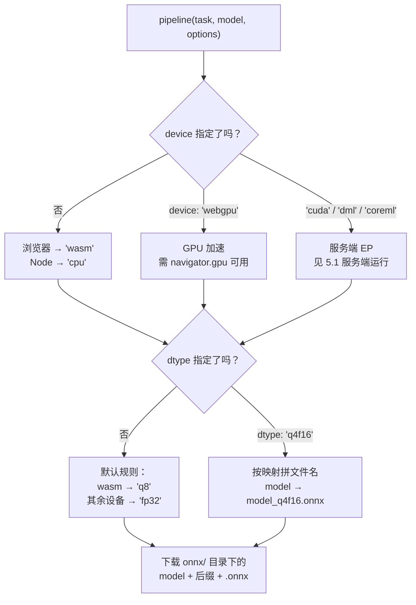

import { Canvas, Controls, Meta } from '@storybook/addon-docs/blocks';
import * as DeviceDtype from './device-dtype.stories';

<Meta of={DeviceDtype} name="Docs" />

# device 与 dtype

`pipeline()` 与 `AutoModel.from_pretrained()` 的 `options.device` 和 `options.dtype` 是模型加载时的一对运行配置：**device 决定模型在哪里算**——CPU 的 WASM 后端还是 GPU 的 WebGPU（服务端另有 CUDA / DirectML / CoreML）；**dtype 决定下载 `onnx/` 目录下的哪一份权重文件**——全精度 fp32、半精度 fp16，还是量化到 8-bit、4-bit 的变体。两者都不指定时库按环境取默认值：浏览器落在 WASM + q8（本课模型约 67.6 MB），指定 `device: 'webgpu'` 则默认 fp32（约 268 MB）——同一模型不同档位，体积差 4 倍。

读完本页你应该能预测实例的行为：画布顶部读数给出本机 WebGPU 可用性、适配器信息与 shader-f16 支持；切换 Controls 的「dtype 档位」，读数显示对应 ONNX 文件名与实测体积（比例条以 fp32 为基准伸缩）；选到 q1 / q2 这类新档位时显示「未提供」——档位是否存在由模型仓库决定。



| 关键选项 | 默认值 | 回查要点 |
| --- | --- | --- |
| `options.device` | `null`：浏览器 `'wasm'`，Node `'cpu'` | GPU 加速传 `'webgpu'`；完整取值见下文设备表 |
| `options.dtype` | `null`：`'wasm'` 下 `'q8'`，其余设备 `'fp32'` | 决定下载哪份 ONNX 文件，映射见 dtype 小节 |
| `'auto'`（两者均可） | — | device：把当前环境支持的 EP 列表交给 ONNX Runtime 逐个尝试；dtype：落到设备默认档 |
| 按文件对象写法 | — | 多会话模型逐文件指定：`{ encoder_model: 'fp16', decoder_model_merged: 'q8' }` |

## device：模型在哪里算

device 不改变模型输出，只改变执行位置与速度：它被库解析成 ONNX Runtime 的 execution provider（EP）。不指定时浏览器默认 `'wasm'`（WASM 后端在 CPU 上执行，兼容一切现代浏览器），Node 默认 `'cpu'`。指定方式就是加载选项里的一个字符串：

```js
// 浏览器 GPU 加速；可用性检测见下一小节
const extractor = await pipeline(
  'feature-extraction',
  'Xenova/distilbert-base-uncased-finetuned-sst-2-english',
  { device: 'webgpu' },
);
```

设备取值全集（源码 `DEVICE_TYPES`）：

| 取值 | 环境 | 行为与时机 |
| --- | --- | --- |
| `'wasm'` | 浏览器默认 | WASM 后端、CPU 执行；兼容性最好，q8 默认档的搭档 |
| `'webgpu'` | 浏览器 | GPU 加速；需可用性检测，见下一小节 |
| `'cpu'` | Node 默认 | onnxruntime-node 的 CPU EP |
| `'cuda'` | 服务端（Linux x64） | NVIDIA GPU；细节见 [5.1 服务端运行](?path=/docs/server-side--docs) |
| `'dml'` | 服务端（Windows） | DirectML |
| `'coreml'` | 服务端（macOS） | CoreML |
| `'auto'` | 任意 | 返回当前环境支持的 EP 列表（浏览器按 WebNN → WebGPU → WASM 的可用性裁剪），交给 ONNX Runtime 挑选 |
| `'gpu'` | 任意 | 只在 GPU 类 EP（webgpu / cuda / dml / webnn-gpu）中挑选 |
| `'webnn'` 系列 | 浏览器 | WebNN 及 webnn-npu / webnn-gpu / webnn-cpu；需 `navigator.ml`，生态尚早，知道入口即可 |

必要边界：库在创建会话前校验设备——当前环境不支持的 device 直接抛 `Unsupported device: "..."`（错误信息列出该环境可用的 EP），**不会静默回退**。所以"用 webgpu 还是 wasm"要由你检测后决定，见下一小节。

### webgpu 与可用性检测

检测代码与库内部判断同源（`'gpu' in navigator`，源码 `env.js` 的 `IS_WEBGPU_AVAILABLE`）：

```js
if (navigator.gpu) {
  const adapter = await navigator.gpu.requestAdapter();
  if (adapter) {
    // adapter.info：vendor / architecture / description 等适配器信息
    // adapter.features.has('shader-f16')：fp16 档位在 WebGPU 上的硬前提，见下文 fp16 一节
  }
}
```

三个必须知道的边界：

- **`navigator.gpu` 存在 ≠ 一定能跑。** 官方 WebGPU 指南明确其 experimental 性质（尤其非 Chromium 浏览器）：截至 2026-03 全球支持约 85%（caniuse）；Firefox 老版本需 `dom.webgpu.enabled` 开关，Safari 按版本逐步支持。
- **Safari 26+ 自 v4.3.0 起启用**（Release notes #1700）；更早的 Safari 传 `device: 'webgpu'` 会落到上一段说的 `Unsupported device` 报错。
- **生产写法是检测后降级**，而不是赌用户的浏览器：

```js
const device = navigator.gpu ? 'webgpu' : 'wasm';
```

下方实例画布顶部的「WebGPU」「shader-f16」两行读数就是这段检测的实时输出，可以对照本机情况核读。

## dtype：加载哪一份权重文件

dtype 决定从模型仓库 `onnx/` 子目录（`subfolder` 默认 `'onnx'`）下载哪个文件：库给基础文件名 `model`（可用 `model_file_name` 覆盖）按固定映射拼后缀。不指定（或写 `'auto'`、或写非法值）时按设备取默认——源码规则只有一条：**`'wasm'` 映射到 `'q8'`，其余设备（含 webgpu、cuda）全部默认 `'fp32'`**。[1.2 第一个 pipeline](?path=/docs/first-pipeline--docs) 提过一句的"浏览器 WASM 下默认 q8、WebGPU 下默认 fp32"就出自这条规则。

完整映射，以及本课示例模型（`Xenova/distilbert-base-uncased-finetuned-sst-2-english`）的实测体积：

| dtype | 对应文件 | 本课模型实测体积 | 说明 |
| --- | --- | --- | --- |
| `fp32` | `model.onnx` | 268.0 MB | 全精度基准，无后缀；非 wasm 设备的默认档 |
| `fp16` | `model_fp16.onnx` | 134.1 MB | 体积约减半；WebGPU 下需适配器支持 shader-f16 |
| `q8` | `model_quantized.onnx` | 67.6 MB | **后缀是 `_quantized` 不是 `_q8`**；浏览器 WASM 默认档 |
| `int8` | `model_int8.onnx` | 67.4 MB | 8-bit 整数导出变体，与 q8 体积相近 |
| `uint8` | `model_uint8.onnx` | 67.4 MB | 同上 |
| `q4` | `model_q4.onnx` | 124.6 MB | 4-bit 块量化；本模型上反而大于 q8，见下文 |
| `q4f16` | `model_q4f16.onnx` | 73.0 MB | fp16 基础上的 4-bit 块量化（源码注释）；低比特家族实际最小，WebGPU 跑 LLM 的常用档 |
| `q2` | `model_q2.onnx` | 仓库未提供 | v4.1（2026-04）新增 |
| `q2f16` | `model_q2f16.onnx` | 仓库未提供 | v4.1 新增 |
| `q1` | `model_q1.onnx` | 仓库未提供 | v4.1 新增，随 BitNET 类 1-bit LLM 而来 |
| `q1f16` | `model_q1f16.onnx` | 仓库未提供 | 同上 |
| `bnb4` | `model_bnb4.onnx` | 122.0 MB | bitsandbytes 风格 4-bit |

体积是 2026-10 用 HEAD 请求实测的十进制 MB（本课示例演示的就是这个做法）；换一个模型请重新实测。

多会话模型（如 whisper 的 encoder / decoder）可以逐文件指定档位，这是 `dtype` 的另一种形态：

```js
// 值可以是字符串（全部会话共用一档），也可以按会话文件名分别指定
await AutoModel.from_pretrained('onnx-community/whisper-tiny.en', {
  dtype: { encoder_model: 'fp16', decoder_model_merged: 'q8' },
});
```

补充一句模型作者侧的入口：仓库 `config.json` 的 `transformers.js_config` 里可以预置 device 与 dtype 配置，`dtype: 'auto'` 会优先读它，读不到再落到设备默认（源码 `session.js`）。

下面的内嵌实例不加载任何权重：对 Hub 的 resolve URL 发 HEAD 请求读 Content-Length（秒级返回），WebGPU 检测只读 `navigator.gpu` 与适配器信息。为了免安装依赖，库的加载模式与兄弟课相同（本课实例甚至不导入库，只用它的加载规则）；批量检查多个模型的生产工作流由 [2.3.3 ModelRegistry](?path=/docs/model-registry--docs) 承载。

<Canvas of={DeviceDtype.Interactive} />
<Controls of={DeviceDtype.Interactive} />

| 读者操作 | 可观察证据 |
| --- | --- |
| 看「WebGPU」与「shader-f16」读数 | 本机可用性、适配器信息与 shader-f16 支持；不可用时体积读数仍可查询 |
| 切换「dtype 档位」 | 「对应文件」「文件体积」读数变化，比例条相对 fp32 基准伸缩 |
| 选到 q1 / q1f16 / q2 / q2f16 | 显示「未提供（HEAD 404）」——本课模型没有导出这些档位 |
| 打开 Show code | 查看实例实际执行的 `device-dtype-probe.ts`（内含完整后缀映射表） |

### fp32 与 fp16

`fp32` 是基准精度，对应无后缀的 `model.onnx`，也是所有非 wasm 设备的默认档。`fp16` 把权重存成 16 位浮点，体积约减半，GPU 上通常还有速度收益。浏览器上有个硬校验：**`device: 'webgpu'` 配 `dtype: 'fp16'` 时，库会请求适配器并检查 `features` 是否含 `shader-f16`，不支持就直接抛** `The device (webgpu) does not support fp16.`（源码 `session.js`；Node 侧跳过该检查）。处理动作是改回 fp32，或用 q8 + wasm。实例画布的「shader-f16」读数就是这个 feature 的本机检测结果，可以提前预判。

### q8 与 int8 / uint8

`q8`（动态 8-bit 量化导出）体积约为 fp32 的 1/4，质量损失对多数任务可忽略——浏览器默认选它正是为了首次体验，1.2 课下载的"约 68 MB"就是本模型的 q8 档。两个回查点：文件名是 `model_quantized.onnx`（历史命名，不是 `model_q8.onnx`）；`int8` / `uint8` 是另外两种 8-bit 导出变体，本课模型上三者体积几乎一致（67.4 与 67.6 MB），浏览器默认永远是 q8，其余两个只在模型卡片特别说明时才需要动。

### q4、q4f16 与更低比特

`q4` / `q4f16` / `bnb4`，加上 v4.1 新增的 `q1` / `q1f16` / `q2` / `q2f16`，属于低比特块量化家族，设计目标是把 LLM 权重压到极限（q1 / q2 随 BitNET 类 1-bit LLM 加入，官方 issue #790）。两个实测事实值得记住：

- **档位名字里的位数不是体积承诺。** 本课模型 q4（124.6 MB）比 q8（67.6 MB）还大；LLM 仓库 SmolLM2-135M 同样 q4 180.6 MB > q8 135.7 MB。实际大小取决于导出时哪些算子被量化、块缩放因子占多少开销——**体积必须实测**，本课示例演示的 HEAD 请求就是这个用途。
- **`q4f16` 通常是低比特家族里实际最小的**（本课模型 73.0 MB），官方 WebGPU 示例（如 deepseek-r1-webgpu）用的正是 `device: 'webgpu'` + `dtype: 'q4f16'` 组合。

`bnb4` 与 q1 / q2 系列是否可用完全取决于仓库有没有导出对应文件：没有的档位（如本课模型的 q1 / q2 系列）请求直接 404，见上文实例读数。

三个成员小节合起来看，档位家族的取舍方向是一张横向选择表（具体快多少属于基准问题，方法见 [4.3 性能调优](?path=/docs/performance--docs)）：

| 档位家族 | 体积（相对 fp32） | 速度与设备 | 质量 | 典型组合 |
| --- | --- | --- | --- | --- |
| `fp32` | 1× | 基准 | 无损 | WebGPU 默认档；精度基线对比 |
| `fp16` | ~1/2 | 权重访存减半，偏向 WebGPU；wasm 下无收益 | 接近无损 | webgpu + fp16（需 shader-f16） |
| `q8` / `int8` / `uint8` | ~1/4 | CPU（WASM）上的常用档 | 多数任务可忽略 | 浏览器默认（wasm + q8） |
| `q4` / `q4f16` / 更低比特 | 仓库相关，可能大于 q8 | 降低显存与带宽，偏向 WebGPU LLM | 有损，需按任务评估 | webgpu + q4f16（官方 LLM 示例组合） |

## 最佳实践

- **默认组合先跑通，再上 GPU。** 什么都不传（wasm + q8）兼容性最好、下载最小，先用它验证任务正确性；再换 `device: 'webgpu'`（默认 fp32）对比速度，速度对比方法见 [4.3 性能调优](?path=/docs/performance--docs)。LLM 上 WebGPU 的常用组合是 `device: 'webgpu'` + `dtype: 'q4f16'`。
- **检测后使用 WebGPU，保留降级路径。** `device: navigator.gpu ? 'webgpu' : 'wasm'`。WebGPU 仍是 experimental 性质、支持率约 85%，约七分之一的用户需要 wasm 兜底。
- **生产代码显式写全 device 与 dtype。** 默认值跨设备差 4 倍体积（wasm→q8、webgpu→fp32），隐式默认会让不同用户下载不同文件；显式指定才能保证行为与流量可预期。
- **档位的体积与可用性以实测为准。** 位数 ≠ 体积（q4 可能大于 q8），档位是否提供取决于仓库导出。上线前用实例的 HEAD 请求方式核对所用仓库的实际文件。

## 常见问题

- `device: 'webgpu'` 报 `Unsupported device: "webgpu"`
  当前浏览器没有可用的 WebGPU（`navigator.gpu` 不存在或版本过旧），库不做静默回退。加载前先检测 `navigator.gpu` 并降级 wasm；Safari 需要 26+（v4.3.0 起启用），旧 Firefox 需 `dom.webgpu.enabled` 开关。
- 报错 `The device (webgpu) does not support fp16.`
  GPU 适配器缺少 `shader-f16` feature，库在 webgpu + fp16 组合时硬校验拒绝。改用 fp32（WebGPU 默认档）或 q8 + wasm；实例画布的「shader-f16」读数可提前预判。
- 指定某档位后加载报 404 / 找不到文件
  该仓库没有导出这一档（本课模型就没有 q1 / q2 系列）。先用 HEAD 请求确认对应后缀的文件（如 `model_q4.onnx`）是否存在（实例演示了这个做法），或换档位、换模型，或自行导出（见 [5.2 自定义模型转换](?path=/docs/model-conversion--docs)）。
- 只切了一下 dtype，浏览器又重新下载了几十 MB
  缓存按文件 URL 键控：每个（模型, dtype）组合是独立文件、独立缓存条目，来回切换不是复用而是各下各的。选档位前先看体积（实例读数）；缓存与离线策略见 [4.2 缓存与离线](?path=/docs/cache-offline--docs)。
- 想加载 q8 却找不到 `model_q8.onnx`
  q8 的后缀是 `_quantized`（历史命名），实际文件是 `model_quantized.onnx`；完整映射见上文表格，或直接看 Show code 里的 `SUFFIX_BY_DTYPE`。

## 总结回顾

摘要：

device 与 dtype 是模型加载时的一对运行配置。device 被解析为 ONNX Runtime 的 execution provider：不指定时浏览器 wasm、Node cpu；`'webgpu'` 开启浏览器 GPU 加速，需要先用 `navigator.gpu` 检测（存在 ≠ 可用，Safari 26+ 自 v4.3.0 起启用，整体仍是 experimental 性质）；`'auto'` 把环境支持的 EP 列表交给运行时挑选；服务端的 cuda / dml / coreml 由服务端课程展开。dtype 决定从 `onnx/` 子目录下载哪份权重：库按固定映射拼后缀（fp32→`model.onnx`、q8→`model_quantized.onnx`、q4f16→`model_q4f16.onnx`……），默认规则只有一条——wasm 映射 q8，其余设备默认 fp32。取舍方向：fp16 偏 WebGPU、q8 偏 CPU，低比特家族（q4 / q4f16 / bnb4 与 v4.1 的 q1 / q2 系列）面向 WebGPU LLM；体积上 fp32 : fp16 : q8 约为 4 : 2 : 1，而低比特档位的实际体积取决于导出实现——本课模型上 q4 反而比 q8 大，必须实测。fp16 在 WebGPU 下需要适配器支持 shader-f16，库会硬校验拒绝。

一句话：

> device 决定在哪里算、dtype 决定下载哪份权重文件；什么都不传时浏览器落在 wasm + q8，指定 webgpu 则默认 fp32。

知识要点：

- 不指定 device 与 dtype 时，浏览器和 Node 各落在什么默认组合？这条规则出自源码哪里？
- device 的完整取值有哪些？`'auto'` 与 `'gpu'` 如何解析？不支持的设备会怎样？
- 怎样检测 WebGPU 可用性？`navigator.gpu` 存在就一定能用吗？Safari 的兼容现状如何？
- 每个 dtype 对应哪个 ONNX 文件名？q8 的后缀是什么？
- fp16 在 WebGPU 上的额外条件是什么？报错信息长什么样？
- q4 一定比 q8 小吗？为什么档位体积必须实测？
- fp16、q8、低比特三个档位家族各偏向哪种设备与场景？
- q1 / q1f16 / q2 / q2f16 是哪个版本新增的？面向什么模型？

## 参考资料

- [Transformers.js 官方文档 · WebGPU 指南](https://huggingface.co/docs/transformers.js/en/guides/webgpu)
  `device: 'webgpu'` 用法、experimental 性质说明与浏览器兼容现状（85% 支持率、Firefox 开关）。
- [utils/hub API · PretrainedModelOptions](https://huggingface.co/docs/transformers.js/en/api/utils/hub)
  `device`、`dtype`、`subfolder`（默认 `'onnx'`）、`model_file_name` 等加载选项的官方定义。
- [transformers API · DeviceType / DataType](https://huggingface.co/docs/transformers.js/en/api/transformers)
  两个配置项的类型入口（取值全集的稳定 API 面）。
- [v4.3.0 Release notes](https://github.com/huggingface/transformers.js/releases/tag/4.3.0)
  "Enable WebGPU for Safari 26 and above"（#1700）。
- [v4.1.0 Release notes](https://github.com/huggingface/transformers.js/releases/tag/4.1.0)
  "Add support for q1, q1f16, q2, and q2f16 data types"（#1647）。
- [utils/dtypes.js（v4.3.0 源码）](https://github.com/huggingface/transformers.js/blob/4.3.0/packages/transformers/src/utils/dtypes.js)
  `DATA_TYPES` 全集、`DEFAULT_DTYPE_SUFFIX_MAPPING`、wasm→q8 / 默认 fp32 的规则与 `isWebGpuFp16Supported` 校验。
- [models/session.js（v4.3.0 源码）](https://github.com/huggingface/transformers.js/blob/4.3.0/packages/transformers/src/models/session.js)
  device → EP 解析入口、文件名拼接（基础名 + 后缀）与 webgpu + fp16 的硬校验报错。
- [utils/devices.js 与 backends/onnx.js（v4.3.0 源码）](https://github.com/huggingface/transformers.js/blob/4.3.0/packages/transformers/src/utils/devices.js)
  `DEVICE_TYPES`、浏览器/Node 默认设备，以及 `deviceToExecutionProviders` 对 auto / gpu 的解析。
- [Xenova/distilbert-base-uncased-finetuned-sst-2-english](https://huggingface.co/Xenova/distilbert-base-uncased-finetuned-sst-2-english)
  本课示例模型；`onnx/` 目录 8 个档位文件的实测体积来源。
- [transformers.js-examples · deepseek-r1-webgpu](https://github.com/huggingface/transformers.js-examples/tree/main/deepseek-r1-webgpu)
  官方 WebGPU 示例的 `device: 'webgpu'` + `dtype: 'q4f16'` 组合出处。
- [caniuse · WebGPU](https://caniuse.com/webgpu)
  WebGPU 浏览器兼容现状数据源（官方指南引用）。
