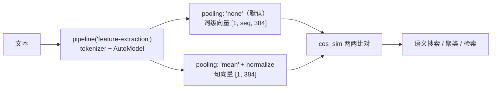

import { Canvas, Controls, Meta } from '@storybook/addon-docs/blocks';
import * as Embeddings from './embeddings.stories';

<Meta of={Embeddings} name="Docs" />

# embedding

`feature-extraction` 是把文本变成向量的管线：输入一句话（或一批句子），输出的不是标签而是 `Tensor`——每个向量把文本的语义压进固定长度的浮点数组里。向量之间可以算余弦相似度，于是「意思相近」变成了可计算的数字，语义搜索、相似句查找、聚类、检索增强（RAG）的召回环节都从这条管线开始。

读完本页你应该能预测实例的行为：切换「pooling」为 `cls`，同一组句子的相似度矩阵整体变浅、区分度下降；切到 `none`，「输出维度」从 `[5, 384]` 变回词级形状 `[5, seq, 384]`，矩阵随之消失。



| 关键项 | 默认值 | 回查要点 |
| --- | --- | --- |
| `extractor(text, { pooling })` | `'none'` | 取值：`'none'` / `'mean'` / `'cls'`（别名 `'first_token'`）/ `'eos'`（别名 `'last_token'`）；`none` 输出词级 `[batch, seq, dim]`（4.3.0 源码核实） |
| `normalize` | `false` | 沿最后一维做 L2 归一化；配合余弦相似度建议开启 |
| `quantize` / `precision` | `false` / `'binary'` | 二值量化输出 int8、维度除以 8；`'ubinary'` 为无符号版 |
| 返回值 | `Tensor` | 不是标签数组；`dims` / `tolist()` / `data` 的读取见 [2.1.2 model 前向推理](?path=/docs/model-inference--docs) |
| 任务 ID | `feature-extraction` | 别名 `embeddings` 等价（写哪个都进同一注册表项） |
| 默认模型 | `onnx-community/all-MiniLM-L6-v2-ONNX` | 注册表固定 `dtype: 'fp32'`，约 90 MB；省流需显式指定模型与档位 |
| 本课示例模型 | `Xenova/all-MiniLM-L6-v2` | 384 维、6 层 BERT、512 token 上限；q8 权重约 23 MB |
| 相似度函数 | 库导出 `cos_sim` / `dot` | 4.3.0 公开 API（`utils/maths.js`），接收普通数组；本文同时给手写版 |

## 快速上手

最小闭环是一次加载加两次调用：`pooling: 'mean'` + `normalize: true` 拿句向量，不传 `pooling` 拿词级向量。

```js
import { pipeline } from '@huggingface/transformers';

// 显式指定模型与 dtype：q8 量化权重约 23 MB；
// 不指定模型时注册表默认 onnx-community/all-MiniLM-L6-v2-ONNX 且固定 fp32（约 90 MB）
const extractor = await pipeline('feature-extraction', 'Xenova/all-MiniLM-L6-v2', {
  dtype: 'q8',
});

// 句向量的标准形态：mean 池化 + L2 归一化，输出 [1, 384]
const sentence = await extractor('This is a simple test.', {
  pooling: 'mean',
  normalize: true,
});
sentence.dims; // [1, 384]

// 默认行为（不传 pooling）：不聚合，输出每个 token 的上下文向量
const tokens = await extractor('This is a simple test.');
tokens.dims; // [1, 8, 384] —— 8 个 token 各一条 384 维向量
```

下面的内嵌实例执行的就是这条管线（批量版）：把 5 句话一起编码成句向量，两两计算余弦相似度并渲染成着色矩阵。**首次打开会下载约 23 MB 的 q8 模型文件，需要数秒到数十秒**，期间画布显示下载进度与用时。实例为了免安装依赖，改用官方 CDN 版本加载库（模式与 [1.2 第一个 pipeline](?path=/docs/first-pipeline--docs) 相同），管线代码与本节一致。

<Canvas of={Embeddings.Interactive} />
<Controls of={Embeddings.Interactive} />

| 读者操作 | 可观察证据 |
| --- | --- |
| 等待首次加载 | 「状态」从 加载中 变为 就绪（附带加载用时），画布显示下载百分比 |
| 看 mean 的矩阵 | 同主题 3 句两两之间明显偏蓝，与无关两句的交叉格接近 0；「最相似句对」读数与矩阵中深色描边的格子一致 |
| 切换「pooling」为 cls | 矩阵用同一组句子重算：同主题与跨主题的差距缩小，区分度下降 |
| 切换「pooling」为 none | 矩阵区域换成提示，「输出维度」变为词级 `[5, seq, 384]`，「最相似句对」变 — |
| 切换「句子组」 | 新的一组句子重新编码：依然是同主题聚在一起、无关句被推开的格局 |
| 打开 Show code | 查看实例实际执行的 `similarity-matrix.ts` |

## 句向量与词向量

`feature-extraction` 只做一件事：跑一遍模型、把隐藏状态交给你。所以它的输出形状由「要不要聚合」决定，而不是由任务头决定——这个管线没有任务头。

```js
const output = await extractor('This is a simple test.');
// Tensor {
//   dims: [1, 8, 384],        // batch × token 位置 × 特征维度
//   type: 'float32',
//   data: Float32Array(3072)  // 8 × 384 个浮点数，扁平存放
// }
```

三段式维度 `[batch, seq, dim]`：第 0 维是 batch（单句输入恒为 1，批量输入才大于 1），第 1 维是 token 位置（含 `[CLS]` / `[SEP]`），第 2 维是模型 hidden_size（本模型 384）。这就是词级向量——每个 token 一条，编码了它在上下文中的含义。批量编码时形状相应放大：

```js
const batch = await extractor(['first sentence', 'second one'], { pooling: 'mean', normalize: true });
batch.dims; // [2, 384] —— 每句聚合出一条句向量

const raw = await extractor(['first sentence', 'second one']); // 不传 pooling
raw.dims; // [2, seq, 384] —— 先按最长句 padding，再逐 token 输出
```

词级向量的用途：token 级任务的特征源、按自己的策略做池化（比如只平均实词位置）、或接自训练的下游层。什么时候用什么，见下一节 pooling；张量读取（`dims` / `data` / `tolist()` / `item()`）的完整说明在 [2.1.2 model 前向推理](?path=/docs/model-inference--docs)。

特征从哪来：管线从模型输出对象里依次找 `last_hidden_state`、`logits`、`token_embeddings` 作为特征源（4.3.0 源码核实）。常见编码器模型（BERT 系）导出的图输出 `last_hidden_state`，所以 `feature-extraction` 与 [2.1.2](?path=/docs/model-inference--docs) 课用 `AutoModel` 直接前向拿到的是同一份隐藏状态——pipeline 只是封装。

## pooling 策略

pooling 回答「怎么把 `[seq, dim]` 的词级张量压成一条向量」。它是在调用时传的选项，不是模型属性；同一份权重配不同 pooling，得到的东西完全不同。全部取值（4.3.0 源码核实，写其他值会抛 `Pooling method 'xxx' not supported`）：

| 取值 | 行为 | 单句输出形状 | 说明 |
| --- | --- | --- | --- |
| `'none'`（默认） | 不聚合 | `[1, seq, dim]` | 词级向量，交给调用方处理 |
| `'mean'` | 按 `attention_mask` 对真实 token 求平均 | `[1, dim]` | sentence-transformers 句向量的标配 |
| `'cls'` / `'first_token'` | 取第 0 个 token 的隐藏状态 | `[1, dim]` | BERT 的 `[CLS]` 聚合位；两者是同一个行为的别名 |
| `'eos'` / `'last_token'` | 取最后一个 token 的隐藏状态 | `[1, dim]` | 部分 LLM 系 embedding 模型按末 token 聚合 |

### mean：句向量的标准选择

`mean` 按编码时的 `attention_mask` 求平均——只平均真实 token，padding 位置不参与（4.3.0 的 `mean_pooling` 实现：mask 为 0 的位置不计入分子也不计入分母）。批量编码长短不齐的句子时，每句仍得到质量相同的句向量。

关键判断：**pooling 要与模型训练时的用法一致。** `all-MiniLM-L6-v2` 是 sentence-transformers 风格模型，训练时就按「mean 池化 + 归一化 + 余弦相似度」优化，`mean` 是它的正确姿势；换成 `cls` 只是取 `[CLS]` 位的原始隐藏状态，模型没按这种方式调过，相似度的区分度通常明显下降——实例中切换 pooling 对比同一组句子的矩阵即可看到。

### normalize 与 quantize：两个输出开关

| 选项 | 默认 | 开启后 |
| --- | --- | --- |
| `normalize` | `false` | 沿最后一维做 L2 归一化：向量模长变为 1，方向不变 |
| `quantize` | `false` | 把向量压成 int8：`'binary'` 每维压成 1 bit（维度除以 8），`'ubinary'` 为无符号版 |

`normalize: true` 是余弦相似度的最佳拍档：归一化后模长为 1，点积即余弦相似度，检索时省一次模长计算。`quantize` 服务大规模存储——384 维 float32 占 1.5 KB，压成 binary 只有 48 字节，适合百万级向量库，代价是精度损失，通常「binary 粗筛 + 原始向量精排」配合使用。

## 余弦相似度

句向量的核心用法是把「语义是否相近」变成数字。余弦相似度度量两个向量的夹角：点积除以两个模长之积，取值 `[-1, 1]`——1 表示方向相同（语义相近），0 表示正交（无关），负值表示方向相反。

```js
// 手写余弦相似度：一轮循环同时算点积与两个模长
function cosineSimilarity(a, b) {
  let dot = 0;
  let normA = 0;
  let normB = 0;
  for (let i = 0; i < a.length; ++i) {
    dot += a[i] * b[i];
    normA += a[i] * a[i];
    normB += b[i] * b[i];
  }
  return dot / (Math.sqrt(normA) * Math.sqrt(normB));
}
```

不手写也行：库公开导出了现成函数（4.3.0 源码核实，`@xenova/transformers` 时代即有），接收普通数组：

```js
import { cos_sim, dot } from '@huggingface/transformers';

cos_sim(vectorA, vectorB); // 余弦相似度，与手写版等价
dot(vectorA, vectorB);     // 点积；两个向量都 normalize 过时与 cos_sim 数值相同
```

在实例中核对：矩阵第 `i` 行第 `j` 列就是第 `i`、`j` 两句的余弦相似度；「最相似句对」读数（除对角线外最大值）与矩阵里深色描边的两个格子一致；对角线恒为 1.00（自己和自己方向相同）。同主题句对普遍在 0.5 以上，跨主题格多在 0.2 以下——语义远近在数值上拉开了档次。

## 语义搜索：向量怎么用

有了句向量，检索就是「编码 + 排序」两步普通数组操作：文档离线各编码一次存起来，查询在线编码一次，按相似度排序取 top-k。

```js
import { cos_sim } from '@huggingface/transformers';

const extractor = await pipeline('feature-extraction', 'Xenova/all-MiniLM-L6-v2', { dtype: 'q8' });

// ① 离线入库：文档各编码一次，向量存进自己的存储（内存数组 / IndexedDB / 向量库）
const docs = [
  'How do I reset my password?',
  'Refund policy for damaged items',
  'Enable two-factor authentication',
];
const docVectors = (await extractor(docs, { pooling: 'mean', normalize: true })).tolist();

// ② 在线查询：只编码一次查询，与全部文档向量比相似度，排序取最靠前的
const query = (
  await extractor('I forgot my login password', { pooling: 'mean', normalize: true })
).tolist()[0];
const ranked = docVectors
  .map((vector, index) => ({ index, score: cos_sim(query, vector) }))
  .sort((a, b) => b.score - a.score);
// ranked[0] 命中「重置密码」——查询里没有任何文档原词，靠的是语义
```

两个延伸方向，思路大于代码：**聚类**——对一批句向量跑 K-means / 层次聚类即可按语义分组（向量已归一化时，欧氏距离与余弦距离的排序一致，普通聚类库直接可用）；**RAG**——把检索到的文档塞进提示词再交给生成模型回答，编码与检索都在本库边界内，生成环节见 [2.2.1 生成参数](?path=/docs/generation-options--docs)，完整应用形态参考官方 transformers.js-examples 仓库。

## 模型选择

浏览器场景的选型预算主要看两件事：体积（决定首次加载等待）与维度（决定向量存储与计算量）。本课示例 `Xenova/all-MiniLM-L6-v2` 是最常用的入门档：

| 模型 | 维度 | 体积 | 说明 |
| --- | --- | --- | --- |
| `Xenova/all-MiniLM-L6-v2` | 384 | q8 约 23 MB | 本课示例；6 层 BERT，英文，sentence-transformers 风格（mean + normalize + 余弦） |
| `onnx-community/all-MiniLM-L6-v2-ONNX` | 384 | fp32 约 90 MB | v4.3.0 `feature-extraction` 的注册表默认模型，固定 `dtype: 'fp32'`；显式指定模型 ID 与 `dtype: 'q8'` 即可避开 |

选型判断：**语言匹配优先**——MiniLM-L6 的词表是英文 wordpiece，处理中文会在词表层丢语义；中文或跨语言场景在[兼容模型目录](https://huggingface.co/models?library=transformers.js)按 `feature-extraction` / `sentence-transformers` 筛选 multilingual 或 e5 系列的 ONNX 转换版。**精度与预算权衡**——同一仓库通常提供 fp32 / fp16 / q8 等多档（本模型 fp16 约 45 MB），q8 是体积与精度的常用折中，档位取舍见 [2.3.1 device 与 dtype](?path=/docs/device-dtype--docs)。

## 最佳实践

- **同一批向量必须出自同一个模型。** 余弦相似度只在同一向量空间内有意义：文档用 A 模型编码、查询用 B 模型编码，数值再高也不可比。模型 ID（必要时加 `revision`）与向量一起存，迁移模型时全量重编码。
- **`normalize: true` 与 `cos_sim` / `dot` 配套。** 归一化后点积即余弦，检索热路径少两次模长计算；`quantize: true` 的二值向量只用于大规模粗筛，精排回到原始向量。
- **显式指定模型 ID 与 dtype。** 不指定模型时注册表默认 fp32（约 90 MB）；写全 `'Xenova/all-MiniLM-L6-v2'` + `dtype: 'q8'` 才能保证体积与行为可复现。
- **实例加载一次，批量编码。** `extractor` 可反复调用，换输入只触发编码；多句一起传数组（管线内部自动 padding），比逐句循环快。

## 常见问题

- 拿默认输出直接算相似度，得到荒谬数值或形状对不上
  不传 `pooling` 时输出是词级 `[batch, seq, dim]`，不是句向量。加 `{ pooling: 'mean', normalize: true }` 聚合成 `[batch, dim]` 再算；或先 `.tolist()[0]` 取出单条向量，确认是一维再喂给 `cos_sim`。
- 不指定模型时首次下载远超预期（约 90 MB）
  `feature-extraction` 的注册表默认模型是 `onnx-community/all-MiniLM-L6-v2-ONNX`，且固定 `dtype: 'fp32'`（4.3.0 源码核实）。显式传模型 ID 并配 `dtype: 'q8'`，降到约 23 MB。
- 中文句子的相似度接近随机
  all-MiniLM-L6-v2 的词表基本不含 CJK 字符，汉字大量落入 `[UNK]`、语义在编码前就丢了（判断方法见 [2.1.1 tokenizer](?path=/docs/tokenizer--docs) 的 `[UNK]` 一节）。换用含中文词表的多语言模型，在[兼容模型目录](https://huggingface.co/models?library=transformers.js)筛选。
- 相似度的绝对值没有别人博客里那么高（或更低）
  句向量相似度只有「同模型、同空间」内的相对意义：跨主题句对 0.2~0.4、同主题 0.5~0.8 都属正常，具体数值随模型而变。比较用排序或按自己的语料实测校准阈值，不要照搬其他模型的绝对分数。

## 总结回顾

摘要：

`feature-extraction` 把文本编码成 `Tensor`，默认 `pooling: 'none'` 输出词级向量 `[batch, seq, dim]`（三段维度分别是 batch、token 位置、hidden_size），传 `mean` / `cls`（`first_token`）/ `eos`（`last_token`）则聚合出句向量 `[batch, dim]`。`all-MiniLM-L6-v2` 是 sentence-transformers 风格的 384 维英文模型，按「mean 池化 + L2 归一化 + 余弦相似度」使用，q8 档约 23 MB；pooling 必须与模型训练时的用法一致。余弦相似度是点积除以模长之积，库公开导出 `cos_sim` / `dot`，向量归一化后点积即余弦。句向量的应用入口是语义搜索——文档离线编码入库、查询在线编码一次、按相似度排序——聚类与 RAG 的召回环节都在同一条向量链路上；`quantize` 的二值量化服务大规模存储。注册表默认模型固定 fp32 约 90 MB，显式指定模型 ID 与 dtype 才能控制体积。

一句话：

> feature-extraction 输出的是张量不是标签——pooling 决定你拿到词向量还是句向量，normalize 与余弦相似度配套，剩下的检索只是普通数组排序。

知识要点：

- `feature-extraction` 的输出 `Tensor` 形状怎么读？默认为什么是 `[1, seq, 384]`？
- `pooling` 有哪些取值与别名？`mean` 与 `cls` 的差异为什么要在实例里对比？
- `normalize` 与 `quantize` 各自改变输出的什么？为什么归一化后点积等于余弦相似度？
- 库是否提供相似度函数？手写版与 `cos_sim` 的关系是什么？
- 语义搜索的最小链路有哪几步？哪一步在线、哪一步离线？
- 注册表默认模型是什么、体积为何偏大？本课示例为什么显式指定模型 ID 与 `dtype: 'q8'`？

## 参考资料

- [Transformers.js 官方文档 · pipelines API](https://huggingface.co/docs/transformers.js/en/api/pipelines)
  `feature-extraction` 的调用示例（含 `pooling` / `normalize` 输出形态）与各任务管线选项。
- [feature-extraction pipeline 源码（v4.3.0）](https://github.com/huggingface/transformers.js/blob/main/packages/transformers/src/pipelines/feature-extraction.js)
  `pooling` 六个取值与默认 `'none'`、`normalize` / `quantize` 默认值、特征源选择（`last_hidden_state ?? logits ?? token_embeddings`）的一手出处。
- [utils/maths 源码（v4.3.0）](https://github.com/huggingface/transformers.js/blob/main/packages/transformers/src/utils/maths.js)
  公开导出的 `cos_sim` 与 `dot` 的实现（接收普通数组），「库是否提供相似度函数」的核实依据。
- [任务注册表源码 · SUPPORTED_TASKS / TASK_ALIASES（v4.3.0）](https://github.com/huggingface/transformers.js/blob/main/packages/transformers/src/pipelines/index.js)
  `feature-extraction` 默认模型与固定 `dtype: 'fp32'`、`embeddings` 别名的出处。
- [sentence-transformers/all-MiniLM-L6-v2 模型卡](https://huggingface.co/sentence-transformers/all-MiniLM-L6-v2)
  384 维句向量模型的标准用法（mean 池化、余弦相似度）与训练定位。
- [Xenova/all-MiniLM-L6-v2（Hugging Face Hub）](https://huggingface.co/Xenova/all-MiniLM-L6-v2)
  本课示例模型的浏览器转换版：`config.json` 的 `hidden_size: 384`，`onnx/` 目录各档位体积（q8 的 `model_quantized.onnx` 约 23 MB）。
- [onnx-community/all-MiniLM-L6-v2-ONNX（Hugging Face Hub）](https://huggingface.co/onnx-community/all-MiniLM-L6-v2-ONNX)
  注册表默认模型：fp32 权重约 90 MB 的核实依据。
- [兼容模型目录 · library=transformers.js](https://huggingface.co/models?library=transformers.js)
  需要中文或多语言句向量模型时，按 `feature-extraction` / `sentence-transformers` 筛选的入口。
- [@huggingface/transformers（npm）](https://www.npmjs.com/package/@huggingface/transformers)
  CDN 引入的官方写法（本课实例经 jsdelivr 加载 4.3.0 版本）。
