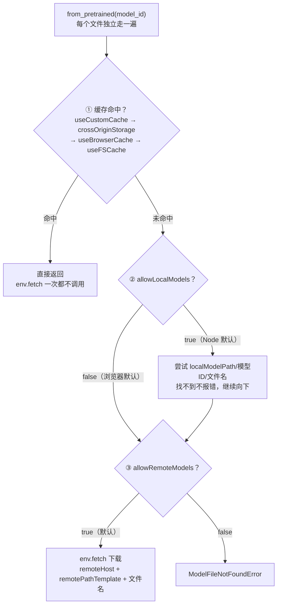

import { Canvas, Controls, Meta } from '@storybook/addon-docs/blocks';
import * as EnvConfig from './env-config.stories';

<Meta of={EnvConfig} name="Docs" />

# env 配置

`env` 是库的全局配置对象：**模型从哪里来、文件缓存到哪、网络请求怎么走、日志打多吵、ONNX Runtime 怎么跑**，所有 `from_pretrained` / `pipeline` 在加载每个文件之前都会先问它。它是一个普通的可变单例——`import` 之后直接改字段即可，改动对之后的每次加载生效（已经创建好的 pipeline / tokenizer 实例不受影响），所以约定是在**第一次加载之前**一次性配好。模块公开导出只有两个：`env` 对象和 `LogLevel` 枚举（`env.version` 是当前库版本字符串）。

本课按「解决什么问题」把 env 字段分成五组：模型来源、缓存、网络、日志、后端。浏览器与 Node 的默认值不同是本课最常踩的坑，下面的默认值表以 v4.3.0 源码 `packages/transformers/src/env.js` 为准逐项核实：

| 字段（按问题分组） | 浏览器默认 | Node 默认 | 回查要点 |
| --- | --- | --- | --- |
| `allowRemoteModels` | `true` | `true` | `false` 等效于全局禁网：本地没有文件就直接抛错 |
| `remoteHost` / `remotePathTemplate` | `'https://huggingface.co/'` / `'{model}/resolve/{revision}/'` | 同左 | 镜像与自建反代改这两个字段 |
| `allowLocalModels` | **`false`** | **`true`** | Web Worker 同浏览器；误开会让每个文件先探测一次本地路径 |
| `localModelPath` | `'/models/'`（页面 URL 路径） | `<库安装位置>/models/` | 本地模型根目录，按 Hub 仓库结构镜像 |
| `useFS` | `false` | `true` | 是否允许用文件系统直读文件 |
| `useBrowserCache` | `true`（有 Cache API 时） | `false` | 浏览器缓存总开关，见 [1.2 第一个 pipeline](?path=/docs/first-pipeline--docs) |
| `useFSCache` / `cacheDir` | `false` / `null` | `true` / `<库安装位置>/.cache/` | Node 文件缓存及其目录 |
| `useCustomCache` / `customCache` | `false` / `null` | 同左 | 自定义缓存：实现 `match` / `put` 的对象 |
| `useWasmCache` | `true` | `true` | v4 新增：ORT 运行时文件（.wasm/.mjs）也进缓存 |
| `cacheKey` | `'transformers-cache'` | 同左 | 缓存桶名字，模型文件与 WASM 文件共用 |
| `experimental_useCrossOriginStorage` | `false` | `false` | 实验性：跨源共享缓存，需配套浏览器扩展 |
| `fetch` | 绑定后的全局 `fetch` | 同左 | v4 起可整体替换：鉴权 / 超时 / 中断的唯一切入点 |
| `logLevel` | `LogLevel.WARNING`（30） | 同左 | v4 新增；只影响库的 logger 与 ORT 日志 |
| `backends.onnx` | ORT 环境对象 + `setLogLevel` | 同左 | `wasmPaths` / `numThreads` / `proxy` 住在这里 |

## 快速上手

最小闭环是「改 env → 加载 → 生效」三步。以官方文档的标准场景——只用本地自托管模型、断掉 Hub 下载——为例：

```js
import { env, AutoTokenizer } from '@huggingface/transformers';

// env 是全局可变对象：第一次加载之前设置，对之后的每次 from_pretrained / pipeline 生效
env.localModelPath = '/models/'; // 本地模型根目录（Node 下是文件路径，浏览器下是 URL 路径）
env.allowRemoteModels = false; // 断掉 Hub 下载：只用本地文件

// 之后的一切加载都按 env 行事：本地找不到文件直接抛错，不再访问 huggingface.co
const tokenizer = await AutoTokenizer.from_pretrained(
  'Xenova/distilbert-base-uncased-finetuned-sst-2-english',
);
```

自托管时把模型目录按 Hub 仓库结构摆好（`/models/Xenova/distilbert-base-uncased-finetuned-sst-2-english/tokenizer.json`、`…/onnx/model_quantized.onnx`）。其余四组（缓存、fetch、日志、后端）在下面各节展开。

## 模型从哪里来

`allowRemoteModels` / `allowLocalModels` / `localModelPath` / `remoteHost` / `remotePathTemplate` 五个字段共同回答「文件从哪来」。关键模型是：**查找按文件逐个进行，每个文件独立走一遍「缓存 → 本地 → 远端」三步**，任何一步命中即返回：



- **`allowLocalModels` 的两个默认值是刻意的。** Node 里默认 `true`：先找本地目录再上网，是合理的省流量策略。浏览器里默认 `false`：`localModelPath` 指向的 `/models/…` 通常什么都没有，先探测只会让每个文件多一次 404 请求。把 Node 示例代码原样搬进浏览器（或反之）是最常见的 env 踩坑方式。
- **远端地址可整体改写。** `remoteHost` + `remotePathTemplate`（`{model}` / `{revision}` 占位符）拼出最终 URL；公司内网镜像 Hub 时改这两个字段即可，模型 ID 不用动。
- **`allowRemoteModels: false` 是硬失败。** 本地缺文件时抛 `ModelFileNotFoundError`："`local_files_only=true` or `env.allowRemoteModels=false` and file was not found locally at …"——按报错里的路径核对目录结构。
- 想按某一次加载临时启用「只用本地」，用加载选项 `local_files_only: true` 而不是改全局 env；批量核对缓存与文件存在性的生产工作流由 [2.3.3 ModelRegistry](?path=/docs/model-registry--docs) 承载。

下面的实例把 env 配置做成了可开关的实验台（默认参数就是浏览器默认值）。首次打开会动态加载库本体（约 1.1 MB）与分词器文件（约 0.7 MB）；学过 [1.2](?path=/docs/first-pipeline--docs) 或 [2.1.1](?path=/docs/tokenizer--docs) 课时文件已在本浏览器缓存里，直接秒级就绪。

<Canvas of={EnvConfig.Interactive} />
<Controls of={EnvConfig.Interactive} />

| 读者操作 | 可观察证据 |
| --- | --- |
| 等待首次加载 | 「状态」变为 就绪；「env.fetch 调用」给出本次请求数（命中兄弟课缓存时为 0 次） |
| 再切一次「重新加载」 | 0 次请求、秒级就绪——缓存命中时 `env.fetch` 根本不被调用 |
| 关「浏览器缓存」再切「重新加载」 | 清单出现 3 次远端请求：1 次 Range 元数据探测 + 2 次文件下载 |
| 保持缓存关闭，开「本地模型」再切「重新加载」 | 变成 6 条：每个文件先一条红色「本地探测 /models/… → 404」再走远端 |
| 切「日志级别」到 ERROR 或 NONE | 「捕获日志行」变 0 行；回到 WARNING 恢复 1 行 |
| 打开 Show code | 查看实例实际执行的 `env-config-lab.ts` |

## 缓存开关与选路

缓存字段决定「下载过的文件第二次还要不要走网络」。同一时刻只用一个缓存后端，库按 `useCustomCache → experimental_useCrossOriginStorage → useBrowserCache → useFSCache` 的顺序取**第一个可用**的（源码 `utils/cache.js`）。[1.2 课](?path=/docs/first-pipeline--docs) 讲过浏览器 Cache API 与「二次加载变快」的现象，本课补齐开关面：

- **`useBrowserCache`（浏览器主开关）。** 关掉后不读也不写：每次加载都全量请求网络，下载的文件也不入库。在实例中核对：关闭并重载 → 每次 3 次请求；换回开启并重载 → 0 次（之前缓存开启时存过）。
- **`useFSCache` / `cacheDir`（Node）。** 浏览器缓存对应物是文件系统缓存，默认目录是库安装位置旁的 `.cache/`；用 `env.cacheDir = '/path/to/cache/'` 换目录。
- **`cacheKey`。** 缓存桶的名字（默认 `'transformers-cache'`）。改名等于换一个全新的空缓存桶——想让演示页与生产页各用各的缓存时有用，排查缓存污染时也可以用它隔离。
- **`useCustomCache` / `customCache`。** 给缓存彻底换实现：`customCache` 是实现 Web Cache API 形状 `match` / `put` 的对象（可接 IndexedDB、内存 Map 等），`useCustomCache` 打开后优先于其他所有后端。

### useWasmCache：运行时文件的离线缓存

v4 新增。除了模型文件，**ONNX Runtime 自己的运行时文件**——`.wasm` 二进制和 `.mjs` 工厂（默认从 jsdelivr CDN 拉取 `ort-wasm-simd-threaded.asyncify.mjs/.wasm`）——在首次创建推理会话前也会经 `env.fetch` 预取，并写进同一个 `transformers-cache`。这就是 `useWasmCache`（默认 `true`）：首次运行后，运行时文件不再请求 CDN，浏览器端离线运行的第一半就有了（另一半是模型文件本身的缓存策略，见 [4.2 缓存与离线](?path=/docs/cache-offline--docs)）。

三个边界：生效前提是 `wasmPaths` 处于 `{ mjs, wasm }` 对象形式（库的默认值就是，见下一节）；Service Worker 与 Chrome 扩展环境因 blob URL 限制不缓存 `.mjs`；本课示例只加载分词器、不创建会话，所以实例清单里看不到 `.wasm` / `.mjs` 请求——想观察它们，跑一次任意带推理的兄弟课即可。

## 自定义 fetch

`env.fetch` 是库**所有**网络请求的唯一入口：模型文件下载（`utils/hub.js` 的 `getFile`）、只取响应头的 Range 元数据探测、WASM 运行时文件预取，全部经过它；默认值是绑定好的全局 `fetch`。v4 起可以整体替换，改请求方式不需要碰库内部：

```js
const realFetch = env.fetch; // 先留底，便于层层包装或恢复

env.fetch = async (input, init) => {
  const url = String(input);
  if (url.startsWith('https://huggingface.co/')) {
    const headers = new Headers(init?.headers);
    // 浏览器默认不带鉴权头（库源码明确不在浏览器注入 token），gated 模型在这里补
    headers.set('Authorization', `Bearer ${TOKEN}`);
    // 超时也要自己接：库不会透传 AbortSignal
    init = { ...init, headers, signal: AbortSignal.timeout(30_000) };
  }
  return realFetch(input, init);
};
```

三个要点：

- **鉴权只在浏览器需要自己动手。** Node 下库自动从 `HF_TOKEN`（或 `HF_ACCESS_TOKEN`）环境变量给 huggingface.co 请求注入 `Authorization: Bearer …` 并附上 User-Agent；浏览器下源码明确不注入——「把 token 暴露给客户端」是安全红线，库替你守住了。访问 gated / 私有模型时用上面的包装注入；生产环境更稳的做法是自建反代（改 `remoteHost`）在服务端注入 token。
- **超时与中断都是自定义 fetch 的职责。** 库从不传 `AbortSignal`——在自己的实现里对同一批请求共享一个 `AbortController`，用户点「取消」时 `abort()`，加载 Promise 立即 reject，整个加载链随之中断。
- **实例的清单就是证据。** 上方画布的「env.fetch 请求清单」逐条记录了库的每次调用——包括那条带 `Range: bytes=0-0` 头的元数据探测。给 `env.fetch` 加包装做统计、改写、重试，看到的入口与实例完全相同。

## 日志级别

`env.logLevel` 配 `LogLevel` 枚举控制库的话痨程度（v4 新增——v3 的 env 既没有 `logLevel` 字段也没有 `LogLevel` 导出，迁移时按新取值改写）。数值越大越安静，**默认 `WARNING`（30）**，这就是 [1.2 课](?path=/docs/first-pipeline--docs) 里「首次下载完全静默」的原因：

| 级别 | 值 | error | warn | info / log | debug |
| --- | --- | --- | --- | --- | --- |
| `DEBUG` | 10 | ✓ | ✓ | ✓ | ✓ |
| `INFO` | 20 | ✓ | ✓ | ✓ | — |
| `WARNING`（默认） | 30 | ✓ | ✓ | — | — |
| `ERROR` | 40 | ✓ | — | — | — |
| `NONE` | 50 | — | — | — | — |

两个源码核实的事实，避免对它期待过高：

- **库自己没有 debug 级别的调用点**（v4.3.0 全部源码仅有少量 info 与大量 warn / error）。所以本课这类纯加载路径上，INFO、DEBUG 与 WARNING 的输出完全相同——增量在 ORT 侧。
- **改 `logLevel` 会联动 ONNX Runtime**：setter 自动调用 `env.backends.onnx.setLogLevel`，按固定映射抬高（ORT 日志极其冗长，尤其创建会话时）：`DEBUG → 'verbose'`、`INFO → 'warning'`、`WARNING / ERROR → 'error'`、`NONE → 'fatal'`；每次创建会话时也会按当前 `logLevel` 设定 `logSeverityLevel`。个别直连 `console` 的警告（如多线程回落提示）不受 `logLevel` 门控。

在实例中核对：切「日志级别」到 `ERROR` 或 `NONE`，重放的调用捕获到 0 行——那条「`max_length` 不带 `truncation`」的 warn 在库内部就被拦下，根本不会到达 console；回到 `WARNING`，首行读数显示这条英文警告原文。

一个 v3 → v4 的静默陷阱：`env.backends.onnx` 是 ORT 环境对象的**快照展开**（附带 `setLogLevel`），直接改 `env.backends.onnx.logLevel = 'verbose'` 只是改副本，不会到达 ONNX Runtime。要动日志级别，用 `env.logLevel` 或显式调 `env.backends.onnx.setLogLevel()`。

## backends：ONNX Runtime 运行时

`env.backends.onnx` 暴露 ONNX Runtime 的环境对象，本课讲它最常用的三个 WASM 开关（设备与精度选择由 [2.3.1 device 与 dtype](?path=/docs/device-dtype--docs) 承载；`webgpu.powerPreference` 库已默认设为 `'high-performance'`）：

**`wasmPaths`：运行时文件从哪加载。** 默认由库设为 jsdelivr CDN 上 `onnxruntime-web@<版本>/dist/` 下的 `ort-wasm-simd-threaded.asyncify.mjs/.wasm`（老 Safari 回落非 asyncify 变体）。自托管（内网、离线、钉死版本）时覆盖它——支持字符串前缀，也支持精确到文件的 `{ mjs, wasm }` 对象形式（后者是 `useWasmCache` 生效的前提）：

```js
// 前缀形式：库会在其后拼接 ort-wasm-simd-threaded… 文件名
env.backends.onnx.wasm.wasmPaths = '/onnxruntime/dist/';
// 对象形式：精确指定两个文件（自托管 + 想让 useWasmCache 继续生效时用这个）
env.backends.onnx.wasm.wasmPaths = {
  mjs: '/onnxruntime/dist/ort-wasm-simd-threaded.asyncify.mjs',
  wasm: '/onnxruntime/dist/ort-wasm-simd-threaded.asyncify.wasm',
};
```

**`numThreads`：WASM 多线程。** 默认行为（onnxruntime-web 侧）：页面未开启 `crossOriginIsolated` 时是 `1`；隔离后取 `min(4, ceil(核数 / 2))`。设了大于 1 的值但环境不满足时，ORT 会在控制台警告 "env.wasm.numThreads is set to N, but this will not work unless you enable crossOriginIsolated mode…" 并回落单线程。想真正吃到多线程：页面响应头加 COOP/COEP 实现跨源隔离，再设值：

```js
env.backends.onnx.wasm.numThreads = 4; // 前提：页面已带 COOP/COEP 头
```

**`proxy`：把 WASM 推理挪进 Worker。** 库默认显式设为 `false`。设 `true` 后 WASM 后端的推理在 Web Worker 里执行，主线程不阻塞、UI 不掉帧；代价是输入输出多一层消息传递。WebGPU 会话不走 WASM 后端，不需要它。

| 场景 | 设置 |
| --- | --- |
| 内网 / 离线部署，不想依赖 jsdelivr | `wasmPaths` 指向自托管目录（对象形式 + `useWasmCache` 保持 `true`） |
| 页面已做跨源隔离，想压榨 CPU | `wasm.numThreads = N`（否则默认 1） |
| 纯 WASM 推理重、主线程掉帧 | `wasm.proxy = true`（WebGPU 不需要） |
| 想调整 ORT 的日志量 | 不要改 `backends.onnx.logLevel`（快照副本，无效）；用 `env.logLevel` |

这些开关都在**第一次创建推理会话之前**设置——运行时文件在首个会话创建时加载一次，之后改动不影响已建立的会话。

## 最佳实践

- **启动时一次性配好。** `env` 是全局单例：`import` 之后、第一次 `from_pretrained` 之前集中设置；加载中途改它不影响已创建的实例，也不会回滚已开始的下载。
- **生产自托管用组合拳。** `allowRemoteModels: false` + `localModelPath` 指向自托管目录 + `wasmPaths`（对象形式）指向自托管 ORT 文件 + 保持 `useWasmCache: true`——整条加载链路不再依赖任何外部 CDN，且二次加载全部命中缓存。
- **跨环境搬代码先查 `allowLocalModels`。** 它是 env 里唯一浏览器 / Node 默认值相反且行为可感知的字段：浏览器误开的症状是每个文件多一次 404 本地探测，Node 误关的症状是明明有本地文件却全走网络。
- **日志按阶段分级。** 开发排查加载链路用 `INFO` / `DEBUG`（配合 `progress_callback`），生产保持默认 `WARNING`，纯生产页面要彻底静音用 `NONE`。

## 常见问题

- 浏览器加载每个模型文件前都多一次 404 请求，Network 面板里出现 `/models/…`
  `env.allowLocalModels` 被误开成了 `true`（Node 默认值被搬进了浏览器）。确认不需要本地自托管就设回 `false`；确实要自托管，就按 Hub 仓库结构把文件摆进 `localModelPath` 对应目录，让探测返回 200。
- 报错 "`local_files_only=true` or `env.allowRemoteModels=false` and file was not found locally at …"
  `allowRemoteModels: false` 后库只找本地，而报错里的路径下没有对应文件。核对三件事：`localModelPath` 是否指向模型目录的**父**目录、目录内是否保留了 `模型ID/文件名` 的仓库结构、文件名与 dtype 档位（`model_quantized.onnx` 等）是否真的存在。
- 设置了 `numThreads` 却没变快，控制台还提示 crossOriginIsolated
  WASM 多线程需要跨源隔离：页面响应头必须带 `Cross-Origin-Opener-Policy: same-origin` 与 `Cross-Origin-Embedder-Policy: require-corp`。没有隔离时 ORT 直接回落单线程（默认值本来就是 1）；无法加响应头时接受单线程，或把重推理交给 WebGPU。
- 浏览器里设置了 `HF_TOKEN`，访问 gated 模型还是 401 / 403
  `HF_TOKEN` 是 Node 侧机制（读 `process.env`），浏览器里库刻意不注入鉴权头。用自定义 `env.fetch` 给 huggingface.co 请求补 `Authorization`（见上文片段）；注意 token 会暴露在前端代码中，生产环境建议自建反代在服务端注入。
- 改了 `env.backends.onnx.logLevel`，ONNX Runtime 的日志毫无变化
  `env.backends.onnx` 是 ORT 环境对象的快照展开，`logLevel` 只是副本，写它不会到达运行时（v3 的老写法在 v4 静默失效）。改 `env.logLevel`（setter 会联动 ORT），或显式调用 `env.backends.onnx.setLogLevel(level)`。
- 每次打开页面都要重新下载 `.mjs` / `.wasm` 运行时文件
  三种可能：`env.useWasmCache` 被关了；`wasmPaths` 被设成了字符串形式（对象形式才走库缓存）；页面运行在 Service Worker / Chrome 扩展环境（blob URL 限制，`.mjs` 不缓存）。逐一核对后仍重复下载时，清一次 `transformers-cache` 缓存再观察。

## 总结回顾

摘要：

`env` 是库的全局可变配置单例，所有 `from_pretrained` / `pipeline` 加载文件前都读它，约定在第一次加载前一次性配好。模型来源由 `allowRemoteModels` / `remoteHost` / `remotePathTemplate` / `allowLocalModels` / `localModelPath` 决定，每个文件独立走「缓存 → 本地 → 远端」，其中 `allowLocalModels` 是唯一浏览器（`false`）与 Node（`true`）默认相反且行为可感知的字段。缓存按 `useCustomCache → experimental_useCrossOriginStorage → useBrowserCache → useFSCache` 取第一个可用后端，`cacheKey` 是共用的缓存桶名；v4 新增的 `useWasmCache` 把 ORT 的 `.wasm/.mjs` 运行时文件也纳入同一缓存，是浏览器离线运行的前提之一。`env.fetch` 可整体替换，是浏览器注入鉴权、实现超时与中断的唯一入口（库不透传 AbortSignal，Node 侧默认从 `HF_TOKEN` 注入）。`logLevel` + `LogLevel`（10/20/30/40/50，默认 WARNING）是 v4 新增的门控机制，会联动映射到 ONNX Runtime 的日志级别；`env.backends.onnx.wasm` 的 `wasmPaths`（自托管运行时）、`numThreads`（需跨源隔离）、`proxy`（Worker 化推理）在首个会话创建前设置。

一句话：

> env 是一次配置、全局生效的加载行为总开关——模型从哪来、缓存到哪、请求怎么走、日志多吵、ORT 怎么跑，都在 import 之后、第一次 from_pretrained 之前定好。

知识要点：

- env 什么时候改、改了管到什么范围？为什么已经创建的实例不受影响？
- 每个模型文件的查找顺序是什么？`allowLocalModels` 在浏览器和 Node 的默认值为何不同，误开的症状是什么？
- 缓存后端的优先级怎样？`cacheKey` 改名意味着什么？`useCustomCache` 需要什么接口？
- `useWasmCache` 缓存的是什么文件？它的离线意义和生效条件（`wasmPaths` 对象形式）是什么？
- 为什么浏览器下 `HF_TOKEN` 不生效？给 Hub 请求注入鉴权、超时、中断的正确位置在哪里？
- `LogLevel` 五档的取值与默认值？`ERROR` 与 `NONE` 的差别？库自身消息与 ORT 联动的映射是什么？
- 为什么直接改 `env.backends.onnx.logLevel` 无效？正确的做法是什么？
- `wasmPaths` / `numThreads` / `proxy` 各解决什么问题、分别什么时候设置？

## 参考资料

- [Transformers.js 官方文档 · env API](https://huggingface.co/docs/transformers.js/en/api/env)
  `env` 字段全集、`LogLevel` 枚举取值与默认值、`fetch` 字段的官方定义。
- [Transformers.js 官方文档 · Use custom models](https://huggingface.co/docs/transformers.js/en/custom_usage)
  `localModelPath`、`allowRemoteModels`、`env.backends.onnx.wasm.wasmPaths` 的官方配置示例。
- [env.js（v4.3.0 源码）](https://github.com/huggingface/transformers.js/blob/4.3.0/packages/transformers/src/env.js)
  浏览器 / Node 两套默认值、`LogLevel` 枚举、`logLevel` setter 联动 ORT 的唯一真源。
- [utils/hub.js（v4.3.0 源码）](https://github.com/huggingface/transformers.js/blob/4.3.0/packages/transformers/src/utils/hub.js)
  「缓存 → 本地 → 远端」查找顺序、`env.fetch` 调用形态、浏览器不注入鉴权头的源码注释。
- [backends/onnx.js（v4.3.0 源码）](https://github.com/huggingface/transformers.js/blob/4.3.0/packages/transformers/src/backends/onnx.js)
  `wasmPaths` 默认值（jsdelivr + asyncify 变体）、`proxy = false`、`logLevel → ORT` 映射。
- [utils/logger.js（v4.3.0 源码）](https://github.com/huggingface/transformers.js/blob/4.3.0/packages/transformers/src/utils/logger.js)
  各日志级别的门控规则（error / warn / info / debug 的显示条件）。
- [utils/cache.js（v4.3.0 源码）](https://github.com/huggingface/transformers.js/blob/4.3.0/packages/transformers/src/utils/cache.js)
  缓存后端优先级、`customCache` 的 `match` / `put` 接口要求。
- [get_file_metadata.js（v4.3.0 源码）](https://github.com/huggingface/transformers.js/blob/4.3.0/packages/transformers/src/utils/model_registry/get_file_metadata.js)
  Range 元数据探测（`Range: bytes=0-0` + `cache: 'no-store'`）的实现。
- [backends/utils/cacheWasm.js（v4.3.0 源码）](https://github.com/huggingface/transformers.js/blob/4.3.0/packages/transformers/src/backends/utils/cacheWasm.js)
  `useWasmCache` 的缓存写入与 Service Worker / 扩展环境的 `.mjs` 限制。
- [onnxruntime-web · Web 文档](https://onnxruntime.ai/docs/get-started/with-javascript/web)
  `env.wasm.numThreads` / `proxy` 等 ORT 侧配置的官方说明。
- [4.2 缓存与离线](?path=/docs/cache-offline--docs)
  完整的离线策略（本地模型、缓存治理）与清缓存操作。
- [2.3.1 device 与 dtype](?path=/docs/device-dtype--docs)
  设备与精度选择：`env.backends.onnx` 之外的另一半运行配置。
