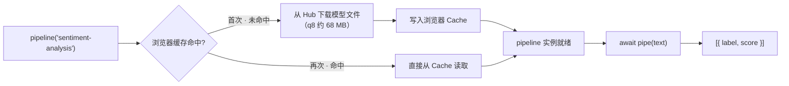

import { Canvas, Controls, Meta } from '@storybook/addon-docs/blocks';
import * as FirstPipeline from './first-pipeline.stories';

<Meta of={FirstPipeline} name="Docs" />

# 第一个 pipeline

`pipeline()` 把「分词器 + 模型 + 输出后处理」打包成一个函数：一次调用完成加载，一次调用完成推理。本课用情感分类任务跑通「加载 → 推理 → 输出」的最小闭环，并回答初学时最容易困惑的问题——首次运行时浏览器里发生了什么：模型文件从 Hub 下载、按运行环境选择量化档位、写入浏览器缓存；第二次打开时，加载显著变快。

读完本页你应该能预测实例的行为：切换示例文本后，`label` 与 `score` 读数随之变化；首次等待的是一次约 68 MB 的下载，之后这个等待基本消失。



| 关键输入 / 输出 | 必填 | 默认值 | 回查要点 |
| --- | --- | --- | --- |
| `task` | 是 | — | 任务名；`'sentiment-analysis'` 是 `'text-classification'` 的别名 |
| `model` | 否 | `null`：用任务的默认模型 | 情感分类默认 `Xenova/distilbert-base-uncased-finetuned-sst-2-english` |
| `options.dtype` | 否 | `null`：随环境选择 | 浏览器 WASM 下默认 `'q8'`；WebGPU 下默认 `'fp32'` |
| `options.device` | 否 | `null`：随环境选择 | 浏览器默认 WASM（CPU）；可选 `'webgpu'` |
| `options.progress_callback` | 否 | `null` | 接收加载进度事件，事件顺序见下文 |
| 推理输入 `pipe(text)` | — | — | 字符串；字符串数组可批量推理 |
| 推理输出 | — | — | `[{ label, score }]`；`top_k` 默认 `1`，`null` 返回全部类别 |

## 快速上手

最小闭环只有两行 `await`：第一行创建实例（整个页面只做一次），第二行推理（可反复调用）。

```js
import { pipeline } from '@huggingface/transformers';

// 创建情感分类 pipeline：首次运行先从 Hub 下载默认模型（q8 约 68 MB），之后走浏览器缓存
const classifier = await pipeline('sentiment-analysis');

// 推理：传入一句话，得到标签与置信度
const output = await classifier('I love transformers!');
// [{ label: 'POSITIVE', score: 0.999817686 }]
```

下面的内嵌实例执行的就是这段逻辑。**首次打开会下载约 68 MB 模型文件，需要数秒到数十秒**（取决于带宽），期间画布显示下载进度；完成后模型进入浏览器缓存，刷新或重开本页时加载显著变快。实例为了免安装依赖，改用官方 CDN 版本加载库，推理代码与本节完全一致。

<Canvas of={FirstPipeline.Interactive} />
<Controls of={FirstPipeline.Interactive} />

| 读者操作 | 可观察证据 |
| --- | --- |
| 等待首次加载 | 「状态」从 加载中 变为 就绪，画布显示下载百分比与加载用时 |
| 切换「示例文本」 | 「label」「score」读数变化；中英文都能得到分类结果 |
| 刷新页面或离开后重进 | 加载用时大幅缩短——模型来自浏览器 Cache 而非网络 |
| 打开 Show code | 查看实例实际执行的 `sentiment-pipeline.ts` |

## 首次运行发生了什么

`pipeline('sentiment-analysis')` 在返回实例之前依次做三件事：确定模型 → 下载文件 → 实例化。理解这条链路，就能解释首次慢、二次快，以及不同量化档位的体积差异。

### 模型从哪里来

不传 `model` 时按任务名使用库内置的默认模型：`'sentiment-analysis'` 先解析为 `'text-classification'`，其默认模型是 `Xenova/distilbert-base-uncased-finetuned-sst-2-english`（DistilBERT 二分类情感模型）。显式传入模型 ID 即可换模型，模型 ID 就是 Hub 上的仓库名：

```js
// 任务名 + 模型 ID；在 Hub 上用 library=transformers.js 过滤可用的模型
const classifier = await pipeline(
  'sentiment-analysis',
  'Xenova/distilbert-base-uncased-finetuned-sst-2-english',
);
```

生产代码建议显式写全模型 ID：默认模型可能随库版本调整，显式指定才能保证行为可复现。

确定模型后，库从 Hub（默认 `https://huggingface.co`，可用 `env.remoteHost` 更换）下载一组文件。本课模型在 q8 档位下实际下载：

| 文件 | 作用 | 体积 |
| --- | --- | --- |
| `config.json` | 模型结构配置 | < 1 KB |
| `tokenizer.json` 等 | 分词器 | < 1 MB |
| `onnx/model_quantized.onnx` | q8 量化权重，下载大头 | 约 67.6 MB |

### 默认 dtype：WASM 下是 q8

`options.dtype` 决定加载哪一档量化权重；不指定时按运行环境选择：浏览器默认用 WASM 在 CPU 上跑，取 `'q8'`；`device: 'webgpu'` 时默认 `'fp32'`。档位直接决定下载体积——同一模型的 fp32 版本约 268 MB，q8 只有约 67.6 MB。对情感分类这类任务，q8 的精度损失通常可以忽略，这正是浏览器端默认 q8 的原因：用几十 MB 的下载换来可用的首次体验。

更多档位（`fp16` / `q4` / `q4f16` 等）与设备选择的完整取舍见 [2.3.1 device 与 dtype](?path=/docs/device-dtype--docs)。

### 浏览器缓存：第二次为什么快

下载完成的文件默认写入浏览器的 Cache API：`env.useBrowserCache` 默认 `true`，缓存名为 `transformers-cache`（`env.cacheKey`）。第二次加载同一模型时不再走网络，直接从缓存读取；WASM 运行时二进制另有独立缓存（`env.useWasmCache` 默认 `true`），所以二次加载显著变快——在本页实例上刷新或重开即可对比加载用时。

缓存的完整策略属于工程化主题：Node.js 走文件系统缓存（`env.useFSCache`，默认目录 `.cache`）；离线运行、自托管模型与清缓存见 [4.2 缓存与离线](?path=/docs/cache-offline--docs)。

## 输出数据结构

推理返回 `[{ label, score }]` 数组，每个元素是一个类别的预测：

- `label`：类别名，由模型决定。本课模型输出 `POSITIVE` / `NEGATIVE`（全大写）。
- `score`：该类别的置信度，范围 0 到 1；多个结果时按 `score` 从高到低排序。

```js
const output = await classifier('I love transformers!');
// [{ label: 'POSITIVE', score: 0.999817686 }]
```

默认只返回分数最高的一个结果（`top_k` 默认 `1`）。想拿到全部类别，把 `top_k` 设为 `null`：

```js
const all = await classifier('I love transformers!', { top_k: null });
// [{ label: 'POSITIVE', score: 0.999817686 }, { label: 'NEGATIVE', score: 0.000182314 }]
```

`score` 不是准确率，只是模型内部的概率读数：同一句话在不同量化档位（q8 与 fp32）下可能给出略有差异的数值，比较结果时不必在意小数点后几位的出入。

## progress_callback：让下载可见

下载过程默认是静默的（日志级别默认 WARNING，只打印错误），首次运行时页面像「卡住」。给 `pipeline()` 传 `options.progress_callback`，就能接到加载全程的事件流：

```js
const classifier = await pipeline(
  'sentiment-analysis',
  'Xenova/distilbert-base-uncased-finetuned-sst-2-english',
  {
    progress_callback: (info) => {
      if (info.status === 'progress') {
        // 单个文件的字节进度：info.file / info.loaded / info.total / info.progress（0~100）
        console.log(`${info.file}: ${info.progress}%`);
      } else if (info.status === 'ready') {
        // 全部文件就绪：info.task / info.model
        console.log(`pipeline 就绪：${info.model}`);
      }
    },
  },
);
```

事件顺序：每个文件经历 `'initiate'`（即将加载）→ `'download'`（开始下载）→ `'progress'`（字节进度）→ `'done'`（完成）；v4 起另有聚合所有文件的 `'progress_total'` 事件；全部文件就绪后触发一次 `'ready'`，pipeline 随即可用。

本课点到为止：能在控制台看到「在下载什么、下到多少」就够了。把进度做成正式 UI（进度条、去抖、取消）通常要配合 Web Worker，见 [4.1 Web Worker 加载](?path=/docs/web-worker--docs)。

## 最佳实践

- **显式指定模型，必要时固定版本。** 默认模型可能随库版本调整；演示、原型用默认模型即可，生产代码写全模型 ID，并用 `options.revision` 固定模型版本，保证多次部署行为一致。
- **提前预热，别让用户等下载。** pipeline 实例创建一次即可反复使用；把 `await pipeline(...)` 放在页面空闲时执行（或至少给出明确的加载提示），避免用户第一次点击按钮时面对数十秒的静默等待。切换输入只触发推理，不需要重建实例。

## 常见问题

- 首次运行长时间无响应，像卡死了
  这是首次下载在正常进行：q8 档位约 68 MB，日志默认只打印 WARNING，所以过程静默。打开 DevTools 的 Network 面板确认下载在进行，或临时加 `progress_callback` 观察进度；二次访问命中浏览器缓存后加载显著变快。
- 报错 `TypeError: classifier is not a function`
  `pipeline()` 与 `pipe(text)` 都返回 Promise，漏写 `await` 时拿到的是 Promise 而不是实例或结果。两处都补上 `await`；顶层 `await` 需要 ESM 环境（`<script type="module">` 或打包器）。
- 加载报 `Failed to fetch` 或类似网络错误
  模型文件从 huggingface.co 下载，公司代理或网络受限会直接失败。先在 Network 面板确认失败请求；恢复访问后重试，或改用自托管模型文件与离线方案（见 [4.2 缓存与离线](?path=/docs/cache-offline--docs)）。
- 怀疑缓存了损坏的模型文件，想强制重新下载
  打开 DevTools → Application → Cache Storage，删除 `transformers-cache` 缓存后刷新页面即可重新下载；换用不同的 `options.revision` 也会触发新的下载。

## 总结回顾

摘要：

`pipeline()` 用一次 `await` 完成加载、一次 `await` 完成推理：`await pipeline('sentiment-analysis')` 就跑通了情感分类的最小闭环，输出 `[{ label, score }]`。首次运行时，库把任务名解析为 `text-classification` 并选定默认模型 `Xenova/distilbert-base-uncased-finetuned-sst-2-english`，从 Hub 下载配置、分词器与 q8 权重（约 68 MB，浏览器 WASM 环境的默认档位），随后写入浏览器 Cache；二次加载直接命中缓存，显著变快。`progress_callback` 能接到 `'initiate' → 'download' → 'progress' → 'done' → 'ready'` 的事件流，让静默的下载过程可见。

一句话：

> pipeline 实例只创建一次，推理可以反复调用；首次的成本是下载，之后的成本只是推理。

知识要点：

- `pipeline()` 的三种调用形态分别怎么写？任务别名如何解析、默认模型是什么？
- 首次运行会下载哪些文件？下载体积由哪个参数决定？
- 浏览器缓存的开关与缓存名是什么？为什么第二次加载明显变快？
- 推理输出的结构是什么？怎样拿到全部类别？
- `progress_callback` 的事件顺序是什么？本课讲到哪一步为止？

## 参考资料

- [Transformers.js 官方文档 · Quickstart](https://huggingface.co/docs/transformers.js/index)
  pipeline 最小示例、默认 dtype（WASM 下 q8、WebGPU 下 fp32）与量化说明。
- [pipeline API](https://huggingface.co/docs/transformers.js/en/api/pipelines)
  `pipeline(task, model, options)` 参数、`top_k` 默认值与文本分类输出结构。
- [utils/hub API · PretrainedModelOptions](https://huggingface.co/docs/transformers.js/en/api/utils/hub)
  `dtype`、`device`、`progress_callback`、`revision` 等加载选项及其默认值。
- [utils/core API · ProgressInfo](https://huggingface.co/docs/transformers.js/en/api/utils/core)
  `progress_callback` 各事件（initiate / download / progress / done / ready）的类型定义。
- [env API](https://huggingface.co/docs/transformers.js/en/api/env)
  `useBrowserCache`、`useWasmCache`、`cacheKey` 等缓存与环境默认值。
- [Xenova/distilbert-base-uncased-finetuned-sst-2-english](https://huggingface.co/Xenova/distilbert-base-uncased-finetuned-sst-2-english)
  本课示例模型；`onnx/` 目录可核对各量化档位体积（q8 为 `model_quantized.onnx`，约 67.6 MB）。
- [@huggingface/transformers（npm）](https://www.npmjs.com/package/@huggingface/transformers)
  npm 安装与 CDN 引入的官方写法，版本发布记录。
