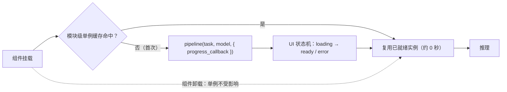

import { Canvas, Controls, Meta } from '@storybook/addon-docs/blocks';
import * as FrameworkIntegration from './framework-integration.stories';

<Meta of={FrameworkIntegration} name="Docs" />

# 框架集成

前面各课的示例都活在「一个页面」里；放进 React、Vue、SvelteKit 这类框架应用后，新问题只来自框架做的两件事——**组件会反复挂载、卸载，页面还会先在服务器上渲染一遍**。本课讲库在框架应用中的使用模式：pipeline 实例如何在组件生命周期之外持有（单例）、加载过程如何接到框架 UI（状态机与 `progress_callback`）、SSR 与打包如何各归其位；框架本身的细节点到为止，所有写法都以官方示例仓库 transformers.js-examples 的真实代码为准。读完你应该能预测实例的行为：切换「持有方式」并「模拟卸载并重新挂载」，模块级单例的第二次挂载约 0 秒就绪；每次挂载重建虽命中浏览器缓存，但仍要重新初始化会话、实例数累加。



持有方式是本课的核心决策，官方示例给出三种写法，回查入口如下：

| 持有方式 | 写法要点 | 实例存活范围 | 官方出处（transformers.js-examples） |
| --- | --- | --- | --- |
| 组件内持有 | `useRef` + `ref.current ??= pipeline(...)` | 复渲染间存活，卸载即丢失 | next-client `app/classifier.js` |
| 模块级单例 | `instancePromise ??= pipeline(...)`，worker 内常包成单例类 | 整个页面会话一份，与组件生死无关 | react-translator `src/worker.js` |
| 服务端全局单例 | `globalThis.classifier ??= await pipeline(...)` | 跨模块重载存活（开发热更新） | next-server 路由、SvelteKit `+server.ts` |

## 单例：pipeline 实例放在哪里

pipeline 的成本结构是「加载贵、推理便宜」：一次加载 = 下载模型文件 + 反序列化 + 创建推理会话，此后每次推理只是重复调用。而组件的挂载/卸载是高频事件——路由切换、条件渲染、列表复用都会触发。**让高频事件驱动昂贵操作，就是框架应用里最典型的误用**。官方三个示例的共同点因此非常一致：pipeline 的创建都脱离组件生命周期，组件只向某个更长寿的位置「要」实例。

三种持有方式中，模块级单例是纯客户端应用的默认答案：

```ts
// 模块级单例：缓存的是 Promise 而不是实例——并发调用共用同一次加载，
// 第二个调用者 await 到的是正在进行的加载，而不是再排一次队
let instancePromise: Promise<SentimentPipe> | null = null;

function getInstance(progress_callback = null) {
  instancePromise ??= pipeline('sentiment-analysis', MODEL_ID, {
    progress_callback,
  });
  return instancePromise;
}
```

放进 Web Worker 时，官方把它包成一个单例类（react-translator `src/worker.js` 原文节选）：

```js
class MyTranslationPipeline {
  static task = 'translation';
  static model = 'Xenova/nllb-200-distilled-600M';
  static instance = null;

  static async getInstance(progress_callback = null) {
    this.instance ??= pipeline(this.task, this.model, {
      progress_callback,
      dtype: 'q8',
    });
    return this.instance;
  }
}
```

下面的实例用手写的挂载/卸载函数对模拟组件生命周期（不引入 JSX）：每次「挂载」真实执行一次库加载与 `pipeline()` 创建，「卸载」按持有方式处理实例。**首次打开会下载约 68 MB 模型文件（打开过兄弟课时直接命中缓存）**。

<Canvas of={FrameworkIntegration.Interactive} />
<Controls of={FrameworkIntegration.Interactive} />

| 读者操作 | 可观察证据 |
| --- | --- |
| 等待首次挂载 | 「状态」从 加载中 变为 就绪，进度条走完；记录表出现「挂载 #1」 |
| 切换「模拟卸载并重新挂载」 | 单例模式：「最近两次挂载用时对照」读数变为 `X 秒 → 0.0 秒`，挂载 #2 来源「复用单例」，实例数保持 1 个 |
| 切换「持有方式」到 每次挂载重建，再挂载一次 | 挂载 #2 来源「新建实例」：文件命中缓存但仍花数百毫秒到数秒重建会话，实例数累加 |
| 打开 Show code | 查看实例实际执行的 `singleton-vs-rebuild.ts` |

两条边界把结论说准：

- **重建模式第二次挂载并不慢——这不是单例的功劳。** 模型文件早就写进了浏览器 Cache（[1.2 课](?path=/docs/first-pipeline--docs)讲过的缓存行为，完整策略见 [4.2 缓存与离线](?path=/docs/cache-offline--docs)），重建时文件不再走网络。所以「单例省下载」是错觉；真实差异在记录表的用时读数里：重建要重新付出会话初始化（数百毫秒到数秒）与一份模型内存。
- **单例的真正收益是「只初始化一次、只占一份内存」。** 两个组件同时挂载、各持一份 pipeline 时，内存直接翻倍——这是组件持有方式在「同时挂载」场景下的隐藏代价；单例下所有组件共享同一实例，谁卸载都不影响它。缓存 Promise 还带来并发安全：多个组件同一帧请求实例，共用同一次加载。

## 加载状态与进度接线

框架里不需要新概念：加载状态机与 [1.2 课](?path=/docs/first-pipeline--docs)完全同构——`loading → ready / error`（推理频繁的页面再加一个 `running`），它们就是组件 state 的一组取值。接线的关键只有一条：**状态变化全部由库的事件驱动**，组件不自己猜测加载进度。

```jsx
// 状态机的 React 投影：库事件 → setState（骨架自官方 next-client 模板）
const [status, setStatus] = useState('loading');
const [progress, setProgress] = useState(0);
const pipe = useRef(null);

useEffect(() => {
  pipe.current ??= pipeline('sentiment-analysis', MODEL_ID, {
    progress_callback: (info) => {
      if (info.status === 'progress_total') {
        setProgress(Math.round(info.progress)); // v4 聚合事件：0~100
      }
    },
  });
  pipe.current.then(
    () => setStatus('ready'),
    () => setStatus('error'),
  );
}, []);
```

进度 UI 靠 `progress_callback` 的事件流（`initiate → download → progress → done`，v4 另有聚合全部文件的 `progress_total`，全部就绪后 `ready`）。官方 react-translator 把这套事件映射成一列进度条：

| 事件（worker 模式下经消息转发） | 组件状态动作（官方 `App.jsx`） |
| --- | --- |
| `initiate` | 标记未就绪；进度列表新增一项 |
| `progress` | 更新对应文件的百分比 |
| `done` | 从进度列表移除该项 |
| `ready` | 标记就绪，解锁输入 |

边界：worker 模式下这些事件在 worker 线程触发，`setState` 之前要先 `postMessage` 转发——协议设计见 [4.1 Web Worker 加载](?path=/docs/web-worker--docs)。上方实例的「状态」「最近一次挂载用时」读数与进度条，就是这条接线驱动的。

## SSR 与双构建

SSR/SSG 时，组件模块在 Node 里也会被求值一次。错位有两种：创建 pipeline 的调用在服务器执行（碰到浏览器 API 报错），原生模块被塞进打包产物（构建失败）。处理各归一层：创建代码交给浏览器生命周期，打包行为交给双构建分发与打包配置。

### 创建调用放进浏览器生命周期

先分清两件事：**静态 `import` 是安全的，危险的只是「创建 pipeline 的调用」在模块顶层执行**。静态 import 不执行任何加载逻辑，包的 `exports` 字段按 `node` / `default`（web）双构建分发（[1.1 安装](?path=/docs/installation--docs)的分发表），打包器按目标环境自动选对构建。

创建调用要放进只在浏览器执行的生命周期。官方 next-client 模板（`app/classifier.js`）的实际写法：`'use client'` + 顶层静态 import + `useEffect` 里创建：

```jsx
'use client';

import { useEffect, useRef } from 'react';
import { pipeline } from '@huggingface/transformers';

export default function Classifier() {
  const ref = useRef(null);

  useEffect(() => {
    // 创建只发生在浏览器：useEffect 不在服务器执行
    ref.current ??= pipeline(
      'text-classification',
      'Xenova/distilbert-base-uncased-finetuned-sst-2-english',
    );
  }, []);
  // …
}
```

各框架的对应物本质相同——都指向「只在客户端执行」的钩子：

- **Vue：** `onMounted`（Vue SSR 文档明确：`onMounted` 等生命周期钩子不在 SSR 期间调用，只在客户端执行）；Nuxt 下还可给组件加 `.client` 后缀强制仅客户端。
- **Svelte：** `onMount`（Svelte 文档原文："onMount does not run inside a component that is rendered on the server"）。
- **SvelteKit 官方模板选了另一条路：** 推理整个放到服务端端点 `src/routes/api/classify/+server.ts`，页面组件（Svelte 5 的 `$state` / `$effect`）只 fetch 结果——浏览器根本不加载库。

### 服务端不打包库（serverExternalPackages）

`onnxruntime-node` 是按平台分发的原生模块（[1.1 安装](?path=/docs/installation--docs)），原生二进制无法被打包器处理；而 Next.js 默认会把 Route Handler 与 Server Components 用到的依赖打进服务端 bundle——撞上原生模块就会构建失败。官方两个 Next 模板的 `next.config.mjs` 用同一份配置把库排除在服务端打包之外：

```js
/** @type {import('next').NextConfig} */
const nextConfig = {
  output: 'standalone',
  serverExternalPackages: ['@huggingface/transformers'],
};
```

`serverExternalPackages` 让这些依赖改用原生 `require` 在运行时直接从 node_modules 加载。版本边界：该字段 Next 15 起为稳定配置（v15.0.0 由 experimental 的 `serverComponentsExternalPackages` 改名而来）；Next 15+ 的内置自动排除列表已经包含 `@huggingface/transformers` 与 `onnxruntime-node`，新版即使不写这行也已生效，官方模板显式写出是为兼容旧版与保持意图明确。浏览器侧不需要类似配置——打包器为浏览器 bundle 自动选 default（web）构建，`onnxruntime-web` 是纯 WASM/JS，正常打包。

本节是构建期行为，浏览器 Canvas 无法复现，以上代码即结论。

## 框架 + Web Worker 组合

要不要 worker 的判断与框架无关（[4.1 课](?path=/docs/web-worker--docs)：频繁推理 + 交互丰富的页面才搬）；框架改变的只是 worker 挂在哪个生命周期上。官方 react-translator 的接线（`src/App.jsx` 节选）三步：

```jsx
const worker = useRef(null);

useEffect(() => {
  // 创建一次：ref 的 ??= 保证同一组件实例只 new 一个 worker
  worker.current ??= new Worker(new URL('./worker.js', import.meta.url), {
    type: 'module',
  });

  const onMessageReceived = (e) => {
    switch (e.data.status) {
      case 'progress': /* 更新进度条状态 */ break;
      case 'ready': setReady(true); break;
      case 'complete': /* 推理完成，解锁按钮 */ break;
      // initiate / done / update 各对应一个 setState 分支
    }
  };
  worker.current.addEventListener('message', onMessageReceived);

  // 卸载清理：官方只解绑监听，不 terminate
  return () => worker.current.removeEventListener('message', onMessageReceived);
});
```

要点四条：

- **创建一次，靠 `??=` 幂等保护。** worker 常驻跨路由复用；放进不随路由卸载的布局层更稳。
- **每条消息对应一个 setState 分支。** 协议本身（`load` / `progress` / `ready` / `result` / `error`、`id` 配对）与 4.1 课完全一致，框架只是把「更新 DOM」换成「更新状态」。
- **卸载分两档。** 只解绑监听（官方做法）：worker 连同模型留在内存，适合单页应用常驻；`terminate()` + 把引用置 `null`：真正释放内存，适合 worker 随组件反复生灭的场景。terminate 后必须置 `null`——否则下次挂载的 `??=` 会复用已死 worker，`postMessage` 静默无响应。
- **worker 文件保持纯计算。** 组件天然是「主线程 UI」一侧，`progress_callback` 在 worker 内触发后转发消息，别在 worker 里碰 DOM（4.1 课已讲）。

## 官方模板清单

| 仓库目录 | 形态 | 关键文件 | 备注 |
| --- | --- | --- | --- |
| `next-server/` | Next.js（App Router）+ 服务端 Route Handler | `app/api/classify/route.js` | README 模板表收录，Demo Space `next-server-template` |
| `sveltekit/` | SvelteKit（Svelte 5）+ 服务端端点 | `src/routes/api/classify/+server.ts`、`src/lib/Classifier.svelte` | README 模板表收录，Demo Space `sveltekit-server-template` |
| `next-client/` | Next.js 纯客户端（`'use client'`） | `app/classifier.js` | 仓库内示例（README 模板表未收录） |
| `react-translator/` | Vite + React + Web Worker | `src/worker.js`、`src/App.jsx` | worker 组合与单例类的参照 |

启动方式（各目录 README 核实）：克隆仓库后进入对应目录安装并启动开发服务器：

```bash
git clone https://github.com/huggingface/transformers.js-examples.git
cd transformers.js-examples/sveltekit # 或 next-server / next-client / react-translator
npm install
npm run dev
```

SvelteKit 开发地址为 `http://localhost:5173`，Next.js 默认 `http://localhost:3000`。想要零配置起点，README 还提供 Hugging Face 上的一键 Space 模板（`huggingface.co/new-space?template=static-templates/transformers.js`）。

版本注意：模板锁定 `@huggingface/transformers` 3.7.1（写作时核实）；本课的模式——单例、状态机、worker 协议、`'use client'`——在 v3/v4 之间一致，升级 4.x 时按 transformers.js 仓库的 Release notes 核对差异。

## 最佳实践

- **持有位置跟应用形态走。** 纯客户端页面用模块级单例（worker 场景用官方单例类写法）；SSR 应用在 `'use client'` / `onMounted` 等生命周期内创建并复用模块单例，或像官方 SvelteKit、next-server 模板那样把推理整个放服务端端点；多组件共用时杜绝「每组件一份」——同时挂载的两个组件各持一份 pipeline 是组件持有方式的隐藏代价。
- **预热放进不随路由卸载的层。** 布局组件的 `useEffect` 或 worker 启动消息（4.1 课的 `{ type: 'load' }`）里预热，用户点击时实例已就绪；官方示例两种时机都有——react-translator 收到首条请求才懒加载，text-to-speech-webgpu 在 worker 启动即加载。
- **把库代码收敛成独立模块。** pipeline 工厂、状态类型、worker 协议放进一个 lib 模块，组件只消费状态——三个官方模板的关键文件（`classifier.js` / `worker.js` / `+server.ts`）都把 Transformers.js 代码隔离在单文件里，组件层零污染。

## 常见问题

- React 开发模式下组件挂载了两次，pipeline 或 worker 表现异常
  StrictMode 在开发模式有意执行「挂载 → 卸载 → 再挂载」来暴露副作用问题（React 官方文档），生产构建不会。用 `??=` 幂等工厂的写法天然扛住双挂载——同一 Promise / 同一 worker 不会重复创建；但 cleanup 里 `terminate` worker 时必须把引用同步置 `null`，只 terminate 不置 null 的话，第二次挂载的 `??=` 会复用已死 worker，`postMessage` 静默无响应。
- Next.js 构建失败，报错指向 onnxruntime-node 或出现 "Module parse failed"
  服务端依赖被默认打进 bundle，撞上 `onnxruntime-node` 的原生二进制。在 `next.config.mjs` 加 `serverExternalPackages: ['@huggingface/transformers']`（官方模板写法；Next 14 及更早的字段名为 `experimental.serverComponentsExternalPackages`）。Next 15+ 的内置排除列表已包含该包，升级后通常无需手动处理。
- SSR 时报 `window is not defined` / `document is not defined` / `navigator is not defined`
  创建 pipeline 的调用被放进了模块顶层或 SSR 也会执行的位置。把创建移进 `useEffect` / `onMounted` / `onMount` 等只在客户端执行的生命周期；静态 import 不需要动，双构建分发会兜底。
- 切换路由再回来，模型又要加载一遍
  pipeline 挂在组件状态里，随组件卸载一起丢失。把单例提升到模块作用域（或用 Context / store 持有同一个 Promise），路由切换只影响组件，不影响模块。
- 开发热更新后 pipeline 反复重建，越来越慢
  dev 模式每次模块重载都会重新执行模块代码，模块级单例也随旧模块一起被丢弃。官方服务端模板的写法是把单例挂到全局对象：`globalThis.classifier ??= await pipeline(...)`——跨模块重载存活，源码注释写明目的就是避免开发期不必要的重复加载。

## 总结回顾

摘要：

框架应用给库带来的新问题只有两个来源：组件生命周期与服务器渲染。持有上，pipeline 的创建要脱离组件生命周期——组件内 `useRef ??=`、模块级 `instancePromise ??=`、服务端 `globalThis ??=` 三种官方写法分别覆盖「复渲染」「整页会话」「热更新」三种存活范围，缓存 Promise 让并发请求共用同一次加载；单例的真正收益是跳过会话初始化与只占一份内存，而不是省下载——文件缓存本来就让重建不慢。接线时，`loading → ready / error` 状态机与 1.2 课同构，`progress_callback`（worker 场景先经消息转发）驱动进度 UI，react-translator 的 initiate / progress / done / ready 消息各对应一个 setState 分支。SSR 下，静态 import 交给包的双构建分发兜底，创建调用放进 `useEffect` / `onMounted` / `onMount` 等只在浏览器执行的生命周期；`serverExternalPackages` 把 onnxruntime-node 原生模块排除出服务端 bundle，Next 15+ 的内置排除列表已含此包。框架里挂 worker 沿用 4.1 的协议与判断：`useEffect` 幂等创建一次、消息驱动状态、卸载按需解绑监听或 terminate。官方模板 next-server / sveltekit / next-client / react-translator 给出四种形态的完整参照。

一句话：

> 让 pipeline 活在组件生命周期之外——模块级单例持有实例，生命周期钩子只负责把加载状态接进 UI。

知识要点：

- 为什么创建 pipeline 不能跟着组件挂载走？三种持有方式各自覆盖什么存活范围？
- 单例缓存 Promise 而非实例解决了什么问题？第二次挂载重建为什么不慢？单例的真正收益是什么？
- loading / ready / error 状态机怎样映射到框架状态？`progress_callback` 的事件如何驱动进度 UI？worker 场景多了一步什么？
- 静态 import 为什么在 SSR 下安全？危险的写法是什么？`'use client'` / `onMounted` / `onMount` 的共同本质是什么？
- `serverExternalPackages` 解决什么问题？为什么 onnxruntime-node 不能被打包？Next 15+ 有什么兜底？
- 框架中挂 worker 的要点有哪些？卸载时「只解绑监听」与「terminate + 置 null」各放弃什么？
- 官方四个示例 / 模板各自演示什么形态？从哪里克隆、怎么启动？

## 参考资料

- [transformers.js-examples（官方示例仓库）](https://github.com/huggingface/transformers.js-examples)
  README 模板表（Next.js / SvelteKit）与一键 Space 模板入口；本课官方写法的总出处。
- [next-client（官方客户端 Next.js 示例）](https://github.com/huggingface/transformers.js-examples/tree/main/next-client)
  `app/classifier.js` 的 `'use client'` + `useRef ??=` 写法；`next.config.mjs` 的 `serverExternalPackages`。
- [next-server（官方服务端 Next.js 模板）](https://github.com/huggingface/transformers.js-examples/tree/main/next-server)
  `app/api/classify/route.js` 的 `globalThis ??=` 单例与 Route Handler 组织。
- [sveltekit（官方 SvelteKit 模板）](https://github.com/huggingface/transformers.js-examples/tree/main/sveltekit)
  `src/routes/api/classify/+server.ts` 服务端端点与 `src/lib/Classifier.svelte`（Svelte 5 `$state` / `$effect`）。
- [react-translator（官方 worker 组合示例）](https://github.com/huggingface/transformers.js-examples/tree/main/react-translator)
  `src/worker.js` 的单例类与 `src/App.jsx` 的消息 → setState 接线。
- [Next.js · serverExternalPackages](https://nextjs.org/docs/app/api-reference/config/next-config-js/serverExternalPackages)
  配置语义（排除服务端打包、原生 require）、v15 改名记录、内置自动排除列表（含 `@huggingface/transformers` 与 `onnxruntime-node`）。
- [React · StrictMode](https://react.dev/reference/react/StrictMode)
  开发模式双挂载（挂载 → 卸载 → 再挂载）行为的依据。
- [Vue · SSR 指南](https://vuejs.org/guide/scaling-up/ssr.html)
  「`onMounted` 等生命周期钩子不在 SSR 期间调用，只在客户端执行」的原文出处。
- [Svelte · lifecycle hooks](https://svelte.dev/docs/svelte/lifecycle-hooks)
  「onMount does not run inside a component that is rendered on the server」的原文出处。
- [1.2 第一个 pipeline](?path=/docs/first-pipeline--docs)
  加载状态机、`progress_callback` 事件流与浏览器缓存行为的来源课。
- [1.1 安装](?path=/docs/installation--docs)
  包的 exports 双构建分发表（node / default-web）与 onnxruntime-node 原生模块说明。
- [4.1 Web Worker 加载](?path=/docs/web-worker--docs)
  worker 消息协议、`new URL` 模式与 terminate 语义的来源课。
- [4.2 缓存与离线](?path=/docs/cache-offline--docs)
  缓存完整策略（离线、自托管、清理）的承载课。
