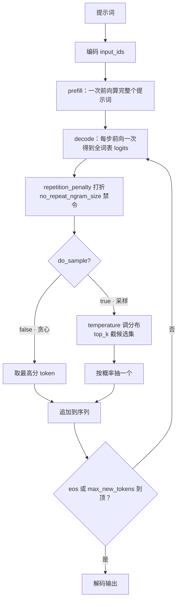

import { Canvas, Controls, Meta } from '@storybook/addon-docs/blocks';
import * as GenerationOptions from './generation-options.stories';

<Meta of={GenerationOptions} name="Docs" />

# 生成参数

`generate()` 的每一步都在回答同一个问题：读完全部上文，词表里每个 token 各得一个分数，选哪一个续上去？生成参数控制的就是这个选择——`max_new_tokens` 决定选多少步（长度控制），`do_sample` 决定每步是照抄最高分还是按概率抽签（贪心与采样），`repetition_penalty` 与 `no_repeat_ngram_size` 让已经写过的内容更难再次被选中（重复惩罚）。参数全部从调用处传入：`generator(输入, { 参数 })`，不传时按默认值——贪心解码，pipeline 调用下最多生成 256 个新 token。

本课用 135 MB 的 SmolLM2-135M-Instruct 搭一个参数试验场：同一提示词下调节长度、采样与惩罚参数，观察输出文本与生成用时的变化。读完本页你应该能预测实例的行为：关闭采样后反复生成结果一字不差；开启采样后每次运行都不一样；把 max_new_tokens 拖大，「状态」读数里的生成用时随之变长。



| 参数 | 库默认（GenerationConfig） | 生效条件 | 调大 / 调小会看到什么 |
| --- | --- | --- | --- |
| `max_new_tokens` | `null`（两个文本生成 pipeline 调用时补 `256`） | 总是生效；设了它就换算覆盖 `max_length` | 调大：生成更长、用时近似线性增长；调小：更早停 |
| `min_new_tokens` | `null` | 需模型有 `eos_token_id`，且 > 0 | 调大：结束符被压制，至少生成满 N 个新 token |
| `do_sample` | `false`（贪心） | 选择解码方式，总是生效 | 开启：同样输入每次运行的结果开始不同 |
| `temperature` | `1.0` | 仅 `do_sample: true` 且 ≠ 1.0 | 调小：输出更稳更可预测；调大：更发散更易跑偏；贪心下无效 |
| `top_k` | `50` | 仅采样路径 | 调小：候选集中在高分 token（`1` 等价贪心）；`0`：不截断，整词表抽签 |
| `top_p` | `1.0` | **4.3.0 未接线**，设置暂无效果 | ——（升级后以所用版本源码为准） |
| `repetition_penalty` | `1.0` | ≠ 1.0 时生效，贪心与采样都适用 | 调大：已出现的 token 被抑制，复读减少；过大文本破碎 |
| `no_repeat_ngram_size` | `0` | > 0 时生效，贪心与采样都适用 | 调大：更长的片段不许复现；`1` 禁止一切重复词，慎用 |

## 快速上手

最小闭环是一次带参数的生成调用：模型加载一次（整页只做一次），每次调用换一组参数。

```js
import { pipeline } from '@huggingface/transformers';

// 加载一次；首次下载约 135 MB，之后走浏览器缓存
const generator = await pipeline(
  'text-generation',
  'onnx-community/SmolLM2-135M-Instruct-ONNX',
);

const messages = [{ role: 'user', content: 'What is the capital of France?' }];

// 不加采样参数：默认贪心解码，每步取最高分，结果确定
const out = await generator(messages, { max_new_tokens: 48 });
// [{ generated_text: [消息数组..., { role: 'assistant', content: 'The capital of France is Paris.' }] }]

// 打开采样：temperature 与 top_k 从这一刻起才参与每步的抽签
const sampled = await generator(messages, {
  do_sample: true,
  temperature: 0.7,
  top_k: 50,
  max_new_tokens: 48,
});
```

对话输入（消息数组）时，`generated_text` 是完整的消息列表，最后一条 `assistant` 就是新生成的内容（`return_full_text` 默认 `false`）；传纯字符串时输出含提示词本身（`return_full_text` 默认 `true`）。

下面的内嵌实例执行的就是这段逻辑。**首次打开会下载约 135 MB 的模型文件（q8 档位），需要数秒到数十秒**；实例为了免安装依赖，改用官方 CDN 版本加载库（模式与 [1.2 第一个 pipeline](?path=/docs/first-pipeline--docs) 相同），生成代码与本节一致。调整任一参数后实例会自动重新生成：连续拖动滑块会合并为一次生成（约 0.7 秒去抖），生成进行中再调整，则本轮结束后按最新参数补跑一次。

<Canvas of={GenerationOptions.Interactive} />
<Controls of={GenerationOptions.Interactive} />

| 读者操作 | 可观察证据 |
| --- | --- |
| 等待首次加载 | 「状态」从 加载中 变为 就绪，画布显示下载百分比与加载用时 |
| 关闭「do_sample」 | 贪心生成；此后每次触发生成输出都一字不差，「当前参数」提示温度与 top_k 不生效 |
| 开启「do_sample」连续生成几次 | 每次运行文本都不同——同一输入在采样下没有标准答案 |
| 把「temperature」拖到 0.2 再拖到 1.5 | 0.2 时输出趋于固定套路；1.5 时更多低分词入选，句子开始发散甚至跑题 |
| 把「top_k」拖到 1，再拖到 0 | 1 时输出与贪心几乎一致（候选只剩最高分）；0 时整词表抽签，最发散 |
| 「提示词」换到「开放续写」+ 把「repetition_penalty」从 1.0 拖到 1.3 | 输出里反复出现的短语减少——惩罚在贪心与采样下都生效 |
| 拖大「max_new_tokens」 | 「状态」读数里的生成用时近似线性变长 |
| 打开 Show code | 查看实例实际执行的 `generation-params.ts` |

## 参数怎么传

生成参数是普通对象键，沿着调用链原样透传：pipeline 调用的第二个参数会被展开进 `model.generate()`（v4 源码），与组件化链路（[2.1.2 model 前向推理](?path=/docs/model-inference--docs)）里手工调用 `generate()` 的写法同源：

```js
// 入口一：pipeline 调用的第二个参数
const output = await generator(messages, { do_sample: true, temperature: 0.7 });

// 入口二：组件化链路里直接调 generate，同名键写进参数对象
const ids = await model.generate({ ...inputs, do_sample: true, temperature: 0.7 });
```

同名键的最终取值按三级优先（源码核实）：

1. **调用时给的参数**——最高优先，本课示例都走这一级；
2. **模型仓库的 `generation_config.json`**——模型作者发布的生成默认值（本课模型只设了 bos / eos / pad 的 token id，不含采样参数）；
3. **库内 `GenerationConfig` 默认值**——开场参考表「库默认」列的来源。

两个管道专属参数与生成参数并列出现在第二个参数里：`return_full_text` 控制字符串输入时输出是否含提示词；`streamer` 传入 `TextStreamer` 让 token 边生成边可见，属于 [2.2.2 流式输出](?path=/docs/streaming--docs) 的主题。`GenerationConfig` 其余成员（`bad_words_ids`、`suppress_tokens`、`forced_eos_token_id` 等）服务特殊场景，完整清单见 [GenerationConfig API](https://huggingface.co/docs/transformers.js/en/api/generation/configuration_utils)。

## 长度控制：max_new_tokens 与 min_new_tokens

生成长度由两个上限共同描述：`max_length` 是「提示词 + 生成」的总长上限（库默认 `20`），`max_new_tokens` 是新 token 数上限（库默认 `null`）。设了 `max_new_tokens` 时，库直接把总长换算为「提示词长度 + max_new_tokens」（源码核实），后者实际覆盖前者。生成循环的节奏是：第一步前向把整个提示词一次算完（prefill），产出第一个新 token；之后每步只前向一个位置（decode）——`max_new_tokens` 数的就是 decode 的步数上限，直接决定等待时间。KV 缓存与生成性能的深入讨论见 [4.3 性能调优](?path=/docs/performance--docs)。

### max_new_tokens

最多生成多少个新 token，与提示词长度无关；生成中撞上结束符（eos）会提前停止，所以它是上限而不是目标长度。

- **常见取值**：交互演示 32~128；摘要、翻译 128~256。上限受模型上下文长度约束（本课模型 8192）。
- **调大 / 调小会看到什么**：调大生成更长、等待时间近似线性增长（每步一次前向）；调小更早停。
- **必要边界**：绕过 pipeline 直接调用 `model.generate()` 且不传 `max_new_tokens` 时，生效的是库默认 `max_length: 20`——总长 20 **包含提示词**，提示词一长，生成可能只剩几个词。两个文本生成 pipeline 调用时默认补 `max_new_tokens: 256`，所以这个坑只在组件化链路里出现（v4 源码核实）。

### min_new_tokens

最少生成多少个新 token。实现方式是硬压分数：生成满之前，每步把结束符的 logit 设成 `-Infinity`（源码核实），模型想停也停不下来。

- **常见取值**：1~16，用于摘要开头就结束、生成空串这类「提前出场」的兜底。
- **调大 / 调小会看到什么**：调大后输出至少有 N 个新 token，哪怕模型早就想结束。
- **必要边界**：需要模型有 `eos_token_id` 且参数 > 0 才会生效（本课模型 eos id 为 2）；它保证下限，与 `max_new_tokens` 的上限配合使用。

## 贪心与采样：do_sample、temperature 与 top_k

每一步生成都是「打分 + 选词」：本课模型的词表有 49152 个 token，每步前向输出它们各自的分数。选法有两种——贪心取最高分（确定性），采样按概率抽签（随机性）。`do_sample` 是两种选法的总开关，也决定了 `temperature`、`top_k` 有没有资格上场：这些参数只在采样路径生效，贪心下全部被忽略（源码核实）。顺序上，分数先经过惩罚项与温度调整，再由采样器截出候选集抽签。

### do_sample

- **这是做什么的**：`false`（默认）走贪心——每步取最高分 token，同一输入永远得到同一输出；`true` 走采样——每步在候选内按概率抽签，同一输入多次运行结果不同，这不是 bug 而是采样本性。
- **常见取值**：事实问答、信息抽取、代码补全保持默认（稳定优先）；创意写作、头脑风暴、候选生成开 `true`（多样性优先）。
- **可观察证据**：实例里关闭「do_sample」反复生成，输出一字不差；开启后每次都不同。

### temperature

把每步 logits 除以 temperature 再去抽样（仅 `do_sample: true` 且 ≠ 1.0 时注入，源码核实）：小于 1 拉大分数差距，分布变尖，高频词更稳；大于 1 缩小差距，分布变平，冷门词更容易被抽中。

- **常见取值**：0.2~0.5 保守（改写、抽取类）；0.7~1.0 均衡（创意的常用起点）；大于 1.0 发散，小模型容易语法崩坏。
- **调大 / 调小会看到什么**：调小输出趋于固定套路、更可预测；调大词汇更多样、也更容易跑题。
- **必要边界**：贪心下调 temperature 没有任何效果；`temperature: 0` 不是「最稳」而是非法值——库会警告并把 `do_sample` 改回 `false`（等价贪心，源码核实）。想要稳定输出，直接用默认贪心即可。

### top_k

每步先取分数最高的 k 个 token 作为候选，再在候选内按概率抽签（默认 `50`）。与 Python transformers 用 logits warper 实现不同，transformers.js 把截断放在采样器内部（源码核实），效果一致。

- **常见取值**：默认 50 覆盖大多数场景；想要更稳的采样可给 10~20。
- **调大 / 调小会看到什么**：调小候选收窄、输出更稳；`top_k: 1` 候选只剩最高分，等价贪心；调大或给 `0`（不截断）则整个词表都是候选，最发散。
- **必要边界**：只在采样路径生效，贪心下无效——「top_k 调了没反应」十有八九是 `do_sample` 没开。

### top_p

核采样（nucleus sampling）：取概率累计到 p 的最小候选集——`top_p: 0.9` 表示只留贡献前 90% 概率的词，再在集合内抽签。

**4.3.0 现状（源码核实）：`TopPLogitsWarper` 类已存在，但 `generate()` 没有把它接进处理链——设置 `top_p` 目前没有任何可观察效果。** 参数与默认值（`1.0`）在 `GenerationConfig` 上有文档位置，升级版本后先查所用版本的源码或 Release notes 再依赖它。同理未接线的还有 `typical_p`、`renormalize_logits` 等，以 `modeling_utils.js` 的处理链清单为准。

### 复现采样结果：random.seed

采样路径每步抽签消费一个全局随机源。v4.3.0 起库内置可播种的 MT19937 随机数（与 Python `random` 对齐，源码核实）：

```js
import { random } from '@huggingface/transformers';

random.seed(42); // 重置全局随机源
const out = await generator(messages, { do_sample: true, temperature: 0.7 });
// 相同 seed + 相同输入 + 相同参数 → 相同输出
```

每次生成前重置同一 seed，就能让采样结果可复现——调试、对比单参数影响、写快照测试时都用得上。

解码策略家族还有几个成员，本课给入口不展开：

| 成员 | 库默认 | 一句话用途 |
| --- | --- | --- |
| `num_beams` | `1` | >1 时改走 beam search，维护多条候选按累计分择优；4.3.0 实现不完整（生成循环不支持扩束），关键场景先实测再依赖 |
| `num_return_sequences` | `1` | 一次返回多条候选；4.3.0 中仅用于贪心模式校验（>1 直接报错），采样路径的多条返回尚未接线 |
| `streamer` | `null` | 传入 `TextStreamer` 边生成边渲染，见 [2.2.2 流式输出](?path=/docs/streaming--docs) |

## 重复惩罚：repetition_penalty 与 no_repeat_ngram_size

两个成员都在改写「已出现内容」的分数，且贪心与采样都生效（作用对象是提示词与已生成 token 的完整序列，源码核实）。思路不同：`repetition_penalty` 对出现过的 token **软性打折**，`no_repeat_ngram_size` 对重复的 n-gram **硬性禁止**。小模型长输出容易陷入复读循环，这是它们的主战场。

### repetition_penalty

对已经出现过的 token（含提示词里的）：正分数除以 penalty、负分数乘以 penalty（源码核实）——总体压制它们再次被选中的机会。

- **常见取值**：1.1~1.3；默认 1.0 表示不惩罚。
- **调大 / 调小会看到什么**：调大后复读片段减少、用词更丰富；调过头（1.5 以上）会把必要的重复（冠词、代词、固定搭配）也压掉，文本开始破碎。小于 1 反而鼓励重复。
- **必要边界**：它是概率意义上的「打折」不是「禁选」——被打折的 token 仍可能被选中，所以循环被削弱但不保证根除。

### no_repeat_ngram_size

长度为 n 的 token 片段（n-gram）在整个序列里只能出现一次：每步把会复现已有 n-gram 的候选分数设为 `-Infinity`（源码核实）。

- **常见取值**：2~4；默认 0 表示不启用。
- **调大 / 调小会看到什么**：调大后更长的短语不许复现；`2` 拦住「词组复读」，`3~4` 拦住「整句复读」。
- **必要边界**：`1` 意味着任何出现过的 token 都不能再出现——常见虚词（the、of）全被封杀，输出直接破碎，别用。它是硬禁止，与 `repetition_penalty` 二选一起步，叠加过多会让模型失去自然表达。

## 最佳实践

- **按任务选解码方式。** 要稳定、可复现的输出（问答、抽取、代码）：保持默认贪心，一个参数都不用加。要多样性（创意、头脑风暴、候选列表）：`do_sample: true` + `temperature` 0.7~1.0，`top_k` 保持默认 50。小模型再配 `repetition_penalty: 1.1` 左右兜底。
- **用 max_new_tokens 控制等待时间。** 浏览器端生成是逐 token 前向，等待时间随 `max_new_tokens` 近似线性增长。交互场景先给小值（32~64）确认输出质量，再按需放大；长文本要边生成边看，交给流式输出（[2.2.2](?path=/docs/streaming--docs)）。
- **参数从默认出发、一次只动一个。** temperature、top_k、repetition_penalty 的效果相互叠加，同时大调会说不清谁在起作用；从库默认逐项微调，配合 `random.seed` 固定采样，才能隔离出单个参数的贡献。

## 常见问题

- 调了 `temperature` / `top_k`，输出纹丝不动
  先查 `do_sample`：默认 `false` 是贪心解码，这两个参数只在采样路径生效。给调用加 `do_sample: true` 后再试；另外 `temperature: 1.0` 等于不处理，`temperature: 0` 会被库警告并强制退回贪心——想要稳定输出，用默认贪心即可，不必调温度。
- 小模型输出陷入复读循环（同一短语反复出现）
  依次尝试：开 `do_sample: true` + `temperature` 0.7~1.0；仍有循环加 `repetition_penalty` 1.1~1.3；还循环加 `no_repeat_ngram_size` 2~3。从默认值逐个加，全部拉大反而让文本破碎；惩罚是缓解手段，模型本身太弱时换更大的模型更有效。

## 总结回顾

摘要：

生成参数随调用透传给 `model.generate()`，同名配置的优先级是调用参数 > 模型仓库 `generation_config.json` > 库默认。长度控制里，`max_new_tokens` 是新 token 上限（pipeline 调用默认补 256；设了它就换算覆盖总长上限 `max_length`），`min_new_tokens` 在生成满之前压制结束符。`do_sample` 决定贪心还是采样：贪心（默认）每步取最高分、结果确定；采样按概率抽签、每次运行不同——`temperature` 缩放分布、`top_k` 截候选集，都只在采样路径生效，`top_p` 在 4.3.0 尚未接线。`repetition_penalty` 对已出现 token 打折、`no_repeat_ngram_size` 禁止 n-gram 复现，两者贪心与采样都生效。采样下的随机性可用 `random.seed` 固定复现。

一句话：

> 生成参数控制每一步「怎么选下一个 token」；`do_sample` 决定走贪心还是采样，而 temperature、top_k 的效力都以它为前提。

知识要点：

- 生成参数从哪里传入？同名配置的优先级顺序是什么？
- `max_new_tokens` 与 `max_length` 什么关系？不传时 pipeline 与裸 `generate()` 各生成多长？
- `min_new_tokens` 用什么机制保证不满就不提前停？什么条件下才生效？
- `do_sample` 关闭时哪些参数失效？`temperature: 0` 会发生什么？
- `top_k: 1` 与 `top_k: 0` 各等价什么行为？`top_p` 在 4.3.0 的现状是什么？
- `repetition_penalty` 如何惩罚已出现的 token？`no_repeat_ngram_size: 1` 为什么慎用？
- 想让采样结果可复现，v4 提供了什么工具？

## 参考资料

- [GenerationConfig API](https://huggingface.co/docs/transformers.js/en/api/generation/configuration_utils)
  全部生成参数的文档说明与库默认值（本课开场参考表的核对来源）。
- [generation/parameters API](https://huggingface.co/docs/transformers.js/en/api/generation/parameters)
  `generate()` 参数对象（GenerationFunctionParameters）与 generation_config 的加载优先级说明。
- [pipelines API](https://huggingface.co/docs/transformers.js/en/api/pipelines)
  `text-generation` 的调用形态、`return_full_text` 与生成参数透传。
- [modeling_utils.js（v4.3.0 源码）](https://github.com/huggingface/transformers.js/blob/4.3.0/packages/transformers/src/models/modeling_utils.js)
  `_prepare_generation_config` 的合并顺序、`max_new_tokens` → `max_length` 换算，以及 `_get_logits_processor` 的接线清单（repetition_penalty / no_repeat_ngram_size / min_new_tokens / temperature 生效条件，top_p 的 TODO 占位）。
- [logits_sampler.js（v4.3.0 源码）](https://github.com/huggingface/transformers.js/blob/4.3.0/packages/transformers/src/generation/logits_sampler.js)
  贪心 / 采样 / beam 的选择逻辑，top_k 候选截断在 MultinomialSampler 内的实现。
- [utils/random.js（v4.3.0 源码）](https://github.com/huggingface/transformers.js/blob/4.3.0/packages/transformers/src/utils/random.js)
  `random.seed` 的 MT19937 实现与采样路径消费的全局随机源。
- [onnx-community/SmolLM2-135M-Instruct-ONNX](https://huggingface.co/onnx-community/SmolLM2-135M-Instruct-ONNX)
  本课示例模型：q8 的 `model_quantized.onnx` 约 129.4 MB；`generation_config.json` 只设 bos / eos / pad。
- [@huggingface/transformers（npm）](https://www.npmjs.com/package/@huggingface/transformers)
  npm 安装与 CDN 引入的官方写法，版本发布记录。
