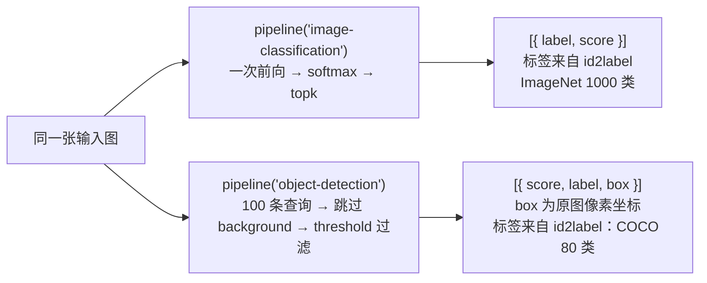

import { Canvas, Controls, Meta } from '@storybook/addon-docs/blocks';
import * as ImageClassificationDetection from './image-classification-detection.stories';

<Meta of={ImageClassificationDetection} name="Docs" />

# 图像分类与目标检测

把一张图交给视觉管线，最常用的两个任务给出两种完全不同的输出契约：`image-classification` 对**整图**给出一个「标签 + 分数」列表——一次前向、一个概率分布；`object-detection` 给出**一组**「分数 + 标签 + 边界框」——每个图上目标对应一个框。预处理与前向的完整链路已在 [2.1.3 processor 与多模态输入](?path=/docs/processor--docs) 走通，任务清单与各任务输出形态的总表在 [1.3 任务全景](?path=/docs/task-overview--docs)；本课从任务输出视角展开：分类管线的 `top_k` 与 `score` 解读，检测管线的 `box` 坐标语义、`threshold` 阈值过滤与模型族，两条线索是本课的主线——**选任务先看问题形状（一个标签还是一组框），再看标签空间（模型认识哪些类）**。

读完本页你应该能预测实例的行为：切换「示例图片」，画布左侧的 top-3 分数条与右侧图上的边界框同步更新；把「检测阈值」从 0.90 拖到 0.50，框变多，拖到 0.95 只剩最高分的框；切到「老虎」那张图，分类轻松命中而检测往往一个框都给不出——这两类任务的标签空间完全不同。



| 参数 / 输入 | 所属任务 | 默认值 | 回查要点 |
| --- | --- | --- | --- |
| `task` | 两者 | — | `'image-classification'` 与 `'object-detection'` |
| 模型 ID（第二参） | 两者 | `null`：用任务默认模型 | 分类默认 `Xenova/vit-base-patch16-224`；检测默认 `Xenova/detr-resnet-50`（[1.3 任务全景](?path=/docs/task-overview--docs)） |
| `top_k` | image-classification | `5` | `null` 返回全部；超出类别数截断；只裁剪条数，不改变分数 |
| `threshold` | object-detection | `0.9` | 保留 `score ≥ threshold` 的框（v4.3.0 源码） |
| `percentage` | object-detection | `false` | `false`：原图像素坐标（整数）；`true`：0–1 归一化坐标 |
| 输出形态（单条输入） | 两者 | — | `[{ label, score }]` / `[{ score, label, box: { xmin, ymin, xmax, ymax } }]` |
| 批量输入 | 两者 | — | 分类支持数组（输出按条数嵌套）；检测仅支持 batch size 1（v4.3.0 源码核实） |

## 快速上手

两个任务各一段最小代码，注意输出形状的差异（输出值取自官方文档示例）：

```js
import { pipeline } from '@huggingface/transformers';

// 图像分类：整图 → 标签分数列表，恒按 score 降序；top_k 默认 5
const classifier = await pipeline('image-classification', 'Xenova/vit-base-patch16-224');
const output = await classifier(
  'https://huggingface.co/datasets/Xenova/transformers.js-docs/resolve/main/tiger.jpg',
  { top_k: 3 },
);
// [
//   { label: 'tiger, Panthera tigris', score: 0.632695734500885 },
//   { label: 'tiger cat', score: 0.3634825646877289 },
//   { label: 'lion, king of beasts, Panthera leo', score: 0.00045060308184474707 },
// ]
```

```js
// 目标检测：整图 → 边界框数组；box 默认为原图像素坐标（percentage: false）
const detector = await pipeline('object-detection', 'Xenova/detr-resnet-50');
const objects = await detector(
  'https://huggingface.co/datasets/Xenova/transformers.js-docs/resolve/main/cats.jpg',
  { threshold: 0.9 },
);
// [
//   { score: 0.9976370930671692, label: 'remote', box: { xmin: 31,  ymin: 68, xmax: 190, ymax: 118 } },
//   { score: 0.9984092116355896, label: 'cat',    box: { xmin: 331, ymin: 19, xmax: 649, ymax: 371 } },
//   …
// ]
```

首次运行会下载所选模型的 q8 权重（这两段官方示例约 88 MB + 43 MB），下载与缓存行为见 [1.2 第一个 pipeline](?path=/docs/first-pipeline--docs)；下面的对照实例改用小体积组合（合计约 16 MB），API 用法与本节一致。不指定模型 ID 时两个任务都会使用各自默认模型，任务与默认模型的对应表见 [1.3 任务全景](?path=/docs/task-overview--docs)。

## 同一张图的两种输出

下面的内嵌实例把两个任务并排放在一起跑同一张图：左列是 `image-classification` 的 top-3 分数条（`Xenova/mobilevit-small`，ImageNet 1000 类），右列是 `object-detection` 在原图上叠加渲染的边界框（`Xenova/yolos-tiny`，COCO 80 类）。「检测阈值」滑块对应检测管线的 `threshold` 参数。

**首次打开会依次下载两个模型（q8 合计约 16 MB），需要数秒**，期间画布显示下载进度与用时；分类模型与 [2.1.3 课](?path=/docs/processor--docs) 共用同一份文件，在本浏览器打开过那门课时缓存直接命中。检测模型的输入分辨率更高（短边 512），单张推理比分类慢数秒，属正常量级。

<Canvas of={ImageClassificationDetection.Interactive} />
<Controls of={ImageClassificationDetection.Interactive} />

| 读者操作 | 可观察证据 |
| --- | --- |
| 等待首次加载 | 「状态」从 加载中 变为 就绪（附带加载用时），画布显示下载百分比 |
| 切换「示例图片」 | 左侧 top-3 分数条与右侧边界框同步更新，「分类 top-1」「检测框数」「首个 box」读数刷新 |
| 把「检测阈值」从 0.90 拖到 0.50 | 分数更低的框进入画面，「检测框数」变大；拖到 0.95 通常只剩一两个最高分的框 |
| 切到「老虎」 | 分类命中 `tiger` 相关标签，检测常常零框——COCO 80 类里没有 tiger，见下文标签空间差异 |
| 打开 Show code | 查看实例实际执行的 `classify-vs-detect.ts` |

一个实现说明：实例的检测只按滑块下限（0.25）调用一次管线，拖动滑块时用**同一规则**（保留 `score ≥ threshold`，v4.3.0 源码）即时过滤已拿到的候选框——与每次重新调用 `detector(image, { threshold })` 的结果一致，但不必为每一档阈值重跑数秒的推理。自己写代码时直接把阈值传给管线即可。

两个任务在相同输入下给出不同形状的答案，三条差异决定怎么选、怎么消费：

- **标签空间不同。** 分类模型标签多而细——ImageNet 1000 类里有 `tiger`、有多个犬种细类；检测模型标签少而粗——COCO 80 类只有常见物体，犬类统称 `dog`。标签空间没有的类永远不会出现在输出里：老虎图分类命中、检测零框，不是模型坏了，是它没学过这个类（实例里切换「柯基犬」还能看到粒度差异：分类给具体犬种，检测只给 `dog`）。
- **score 语义不同。** 分类的 `score` 来自整图唯一的概率分布（top-3 加起来只是分布的头部）；检测的 `score` 是**每个框各自**的类别置信度，跨框不可加总、不构成分布，只有同框级别的相对排序有意义。
- **消费方式不同。** 分类直接取 `output[0]` 就是答案；检测要按 `threshold` 过滤（管线已做）、逐框换算位置、再叠加渲染——输出是数组，长度 = 检出的目标数，可以为 0。

## image-classification：整图分类

输出契约 `[{ label, score }]` 的三个成分各有来源：**标签**来自模型 `config.json` 的 `id2label`（缺失时回退 `LABEL_0`、`LABEL_1`…，v4.3.0 源码核实）；**分数**是对全部类别 logits 做 softmax 的概率；**排序与条数**由 `topk` 完成，结果恒按 `score` 降序。管线内部执行的就是 [2.1.3 课](?path=/docs/processor--docs)「与 pipeline 的对应关系」一节给出的那条链路——本课不再重复预处理，聚焦输出侧的两个参数。

### top_k：返回条数

```js
const output = await classifier(url);          // 默认 top_k = 5：前 5 条
const top3 = await classifier(url, { top_k: 3 }); // 前 3 条
const all = await classifier(url, { top_k: null }); // 全部类别（1000 条）
```

三条规则（与 [3.1.1 文本分类与零样本](?path=/docs/text-classification--docs) 同一套 `topk` 机制，但**默认值不同**——文本分类默认 1，图像分类默认 5，写代码时别照搬记忆）：

- `top_k` 传 `null` 返回全部类别；数值 `k` 返回前 `k` 个，`k` 先与类别数取小，超出类别数会被截断。
- 截断发生在 softmax **之后**：分数本身不随 `top_k` 变化，`top_k: 1` 只是看不见第二名。
- 单条输入恒返回扁平数组；数组批量输入返回按输入条数嵌套的数组（[1.3 课](?path=/docs/task-overview--docs)的 `Array.isArray(output[0])` 判断通用）。

### score 怎么读

- `score` 是 softmax 概率（0–1），`[0]` 就是整图的预测结果；`top_k: null` 时全部概率合计为 1。快速上手官方示例里 `tiger cat` 拿到 0.3635——softmax 把概率质量分给相近类，头名不一定过半。
- `score` 不是准确率，跨模型、跨标签集比较没有意义；同一模型的标签集之内**排序**才有意义（详见 [3.1.1 课](?path=/docs/text-classification--docs)的同名小节，规则一致）。
- 边界：该管线对 logits **恒做 softmax**（v4.3.0 源码中无 `problem_type` 分支）——文本分类那种 sigmoid 多标签输出在图像分类管线里没有对应物。需要多标签图像打分，绕过管线手工解读（做法见 [2.1.2 model 前向推理](?path=/docs/model-inference--docs)，预处理复用 [2.1.3 课](?path=/docs/processor--docs)）。

## object-detection：目标检测

输出契约 `[{ score, label, box }]`。DETR/YOLOS 族模型对每张图输出 100 条「查询」，每条查询给出一个类别 logits 和一个 0–1 归一化的框；后处理按 v4.3.0 源码顺序执行：取每条查询的 argmax 类 → 背景类（最后一个下标）直接丢弃 → softmax → `score < threshold` 的丢弃 → 框转角点、乘回原图尺寸 → 取整。所以拿到手的每条结果都是**过了阈值、落在原图像素系**的框，`label` 同样来自 `id2label`。批量调用只支持 batch size 1，传多张的数组会直接抛错（v4.3.0 源码核实）。

### box：像素坐标还是归一化

默认（`percentage: false`）返回**原图像素坐标**，且是整数：`xmin` / `ymin` 是左上角，`xmax` / `ymax` 是右下角。内部换算链路（v4.3.0 源码）：模型输出的归一化 `(center_x, center_y, width, height)` → 转角点 → 乘原图宽 / 高 → 按位或截断为整数——管线已经替你完成了「模型空间 → 原图像素」的还原，画框时拿来即用：

```js
const objects = await detector(url, { threshold: 0.9 });
for (const { label, score, box } of objects) {
  // box 即原图像素坐标：宽 = xmax − xmin，高 = ymax − ymin
  ctx.strokeRect(box.xmin, box.ymin, box.xmax - box.xmin, box.ymax - box.ymin);
  ctx.fillText(`${label} ${(score * 100).toFixed(0)}%`, box.xmin, box.ymin - 4);
}
```

`percentage: true` 时返回 0–1 归一化坐标（不乘回原图，v4.3.0 源码核实）：适合做与图片显示尺寸无关的响应式叠加，画框前自己乘回当前显示宽高。实例的「首个 box」读数展示的就是默认模式下拿到的原始整数值。

两个贴着本点的边界：

- 框可能略微越界：后处理不做裁边，官方示例输出（cats.jpg，本课核实宽 640 px）里就有 `xmax: 649` 的框。要贴边渲染时用 `Math.max(0, Math.min(imageWidth, x))` 自行收拢。
- 换算宽高用 `xmax − xmin`，不要把 `xmax` / `ymax` 当宽高用；用 `original_sizes` 还原尺寸时注意它是 `[height, width]` 元组（[2.1.3 课](?path=/docs/processor--docs)的坑，这里同样适用）。

### threshold：分数过滤

`threshold` 默认 `0.9`，规则是保留 `score ≥ threshold` 的框（v4.3.0 源码）。0.9 相当苛刻：只留下模型很有把握的目标。调低框变多、噪声框混入；调高框变少、可能漏掉真实目标——实例的「检测阈值」滑块可以直接观察这个增减。

实用判断：告警类场景（宁漏勿错）从默认 0.9 起步甚至更高；盘点、展示类场景（宁多勿漏）降到 0.3–0.5，并在自己的后处理里按分数排序、按类别白名单再过滤一次。对照实例「一次低阈值推理 + 本地按同规则过滤」的写法，也是需要多档阈值时的省时做法。

### 模型族：DETR 与 YOLOS

两个模型族共用 `pipeline('object-detection')` 与 `AutoModelForObjectDetection` 入口，输出结构一致（类别 logits + 归一化框），差别在骨干与体积：

| 模型族 | 代表模型 | 机制 | 体积（q8） |
| --- | --- | --- | --- |
| DETR 类 | `Xenova/detr-resnet-50`（任务默认） | 卷积骨干（ResNet-50）+ transformer 查询头，精度高 | 约 43 MB |
| YOLOS 类 | `Xenova/yolos-tiny` | 把查询头装进纯 ViT 骨干（无卷积），小而快 | 约 9.7 MB |

两个族在 Hub 上的转化版标签集都是 COCO（91 个 `id2label` 槽位、80 个真实类，其余为 N/A 占位）——**换检测模型基本不换标签空间，变化的是精度与速度**；这与分类模型「换一个模型就换一套标签」的规则相反。YOLOS 的输入分辨率更高（`preprocessor_config.json`：短边 512、长边 1333），单帧速度受此影响，选型时把分辨率算进成本。标签空间覆盖不到的类别，出路是零样本检测：`zero-shot-object-detection` 管线（第二参传 `candidate_labels`，输出结构与本课一致），入口与默认模型见 [1.3 任务全景](?path=/docs/task-overview--docs)。

## 最佳实践

- **按「问题形状」选任务。** 整图一个问题（这是什么、什么场景）选分类：一次前向、一个概率分布，消费最简单；空间问题（有什么、在哪、有几个）选检测：计数、定位、区域触发只有检测给得出。两者输出不能互相替代——分类答不了「在哪」，检测答不出「这张图整体是什么」。
- **换模型先查标签空间，再谈精度。** 分类看模型 `config.json` 的 `id2label`（换模型即换标签集）；检测确认是否 COCO 标签集（换模型基本不变）。输出里永远不会出现标签空间之外的类——先确认目标类在不在 `id2label` 里，再考虑调 `threshold` 或换模型。
- **`threshold` 与业务对齐，不要默认值一把梭。** 宁漏勿错（告警、计数计费）用 0.9 或更高；宁多勿漏（检索、人工复核前置）降到 0.3–0.5，并叠加自己的排序与白名单过滤。
- **需要自定义类别做检测时走零样本。** `zero-shot-object-detection` 在调用时给 `candidate_labels`，输出形态与 `object-detection` 完全一致，下游代码可以复用；代价是模型更大、速度更慢（默认 `Xenova/owlvit-base-patch32`）。

## 常见问题

- 图里明明有目标，检测却一个框都没给
  先把 `threshold` 降到 0.3–0.5 再看（默认 0.9 很苛刻）；仍然没有就查标签空间——COCO 80 类里没有的目标（tiger、butterfly 这类）任何阈值都检不出来，换覆盖该类的检测模型，或改用 `zero-shot-object-detection` 传 `candidate_labels`。
- 自己画的框位置不对，或整体偏移、缩放不对
  按顺序核对三点：①是否传了 `percentage: true`（拿到 0–1 归一化坐标）而画的时候忘了乘显示宽高；②还原用的原图宽高是否把 `[height, width]` 元组当成了 `[width, height]`（`original_sizes` 的坑，见 [2.1.3 课](?path=/docs/processor--docs)）；③`xmin` / `ymin` 是左上角、`xmax` / `ymax` 是右下角，宽高要用 `xmax − xmin` 计算。
- 检测比分类慢好几秒，是不是代码写错了
  正常现象：检测输入分辨率高（YOLOS 短边 512 起，像素量是分类 256×256 输入的数倍），每张图还要解码 100 条查询；WASM 上单张数秒属常见量级。提速路径：换更小的模型（`yolos-tiny` 已属小体积）、或上 WebGPU——设备与量化取舍见 [2.3.1 device 与 dtype](?path=/docs/device-dtype--docs)（WebGPU 兼容现状以该课说明为准）。
- 想一次传多张图批量检测
  目前不支持：`object-detection` 仅支持 batch size 1，数组超过 1 张直接抛错（v4.3.0 源码核实），逐张串行调用即可。分类支持数组批量，输出按输入条数嵌套，处理方式见 [1.3 任务全景](?path=/docs/task-overview--docs)。

## 总结回顾

摘要：

本课把两个视觉任务放在同一张图上对照。`image-classification` 对整图输出 `[{ label, score }]`：标签来自模型 `id2label`（缺失回退 `LABEL_x`），分数是全类 softmax 概率，`topk` 只在归一化之后裁剪条数（默认 5，`null` 取全部，超出截断）；管线恒做 softmax，没有文本分类那种多标签分支。`object-detection` 输出 `[{ score, label, box }]`：每张图 100 条查询经「跳过背景类 → softmax → threshold 过滤 → 乘回原图尺寸 → 取整」拿到手；`box` 默认是原图像素坐标（`percentage: true` 时 0–1 归一化），`threshold` 默认 0.9、保留 `score ≥ threshold` 的框，DETR 与 YOLOS 两族共用这一套输出（q8 约 43 MB 对 9.7 MB），标签集都是 COCO 80 类。两类任务的根本差异在标签空间与分数语义：分类标签多而细、score 是整图唯一的分布，检测标签少而粗、score 是每框独立的置信度——选任务先看问题形状，再看标签空间。

一句话：

> 分类回答「这张图是什么」，检测回答「图里哪里有什么」——前者的输出是一个标签分数列表，后者是一组带原图像素坐标的框，选任务先看问题形状，再核对标签空间。

知识要点：

- 两个任务的单条输出结构分别是什么？`top_k`、`threshold`、`percentage` 的默认值与作用各是什么？
- `box` 坐标默认是什么坐标系？`percentage: true` 时变成什么？画框时宽高怎么算？
- `threshold` 的过滤规则是什么？调高调低各适合什么场景？
- 为什么老虎图分类命中而检测无框？换分类模型与换检测模型时标签空间分别怎么变？
- 分类的 `score` 与检测的 `score` 语义有何不同？批量输入的行为差异是什么？

## 参考资料

- [Transformers.js 官方文档 · pipelines API](https://huggingface.co/docs/transformers.js/en/api/pipelines)
  `image-classification` 的 `top_k`、`object-detection` 的 `threshold` / `percentage` 选项说明与官方示例输出值（快速上手两段代码的输出均取自该页）。
- [image-classification pipeline 源码（main，v4.3.0）](https://github.com/huggingface/transformers.js/blob/main/packages/transformers/src/pipelines/image-classification.js)
  `top_k` 默认 5、softmax + topk + id2label（含 `LABEL_x` 回退）与恒做 softmax 的实现。
- [object-detection pipeline 源码（main，v4.3.0）](https://github.com/huggingface/transformers.js/blob/main/packages/transformers/src/pipelines/object-detection.js)
  `threshold` / `percentage` 默认值、batch size 1 限制与输出条目的组装。
- [image_processors_utils.js 源码（main，v4.3.0）](https://github.com/huggingface/transformers.js/blob/main/packages/transformers/src/image_processors_utils.js)
  `post_process_object_detection` 的过滤与缩放规则：跳过背景类、softmax、`score ≥ threshold` 保留、乘回原图尺寸。
- [pipelines/_base.js 源码（main，v4.3.0）](https://github.com/huggingface/transformers.js/blob/main/packages/transformers/src/pipelines/_base.js)
  `get_bounding_box` 的整数化与 `BoundingBox` 定义（`xmin` / `ymin` / `xmax` / `ymax`）。
- [yolos 模型源码（main，v4.3.0）](https://github.com/huggingface/transformers.js/blob/main/packages/transformers/src/models/yolos/modeling_yolos.js)
  `YolosForObjectDetection` 的 `logits` / `pred_boxes` 输出定义（归一化中心格式框）。
- [Xenova/mobilevit-small](https://huggingface.co/Xenova/mobilevit-small)
  实例分类模型：ImageNet 1000 类，q8 约 6.3 MB，与 [2.1.3 课](?path=/docs/processor--docs)共享缓存。
- [Xenova/yolos-tiny](https://huggingface.co/Xenova/yolos-tiny)
  实例检测模型：COCO 标签集（91 槽 80 类），q8 约 9.7 MB，`preprocessor_config.json` 短边 512、长边 1333。
- [Xenova/detr-resnet-50](https://huggingface.co/Xenova/detr-resnet-50)
  `object-detection` 任务默认模型（q8 约 43 MB），官方检测文档示例所用模型。
- [Xenova/vit-base-patch16-224](https://huggingface.co/Xenova/vit-base-patch16-224)
  `image-classification` 任务默认模型（q8 约 88 MB），快速上手分类示例输出值的来源。
- [Xenova/transformers.js-docs 数据集](https://huggingface.co/datasets/Xenova/transformers.js-docs)
  实例三张预置图片的来源（官方文档示例所用图片，允许跨域访问）。
