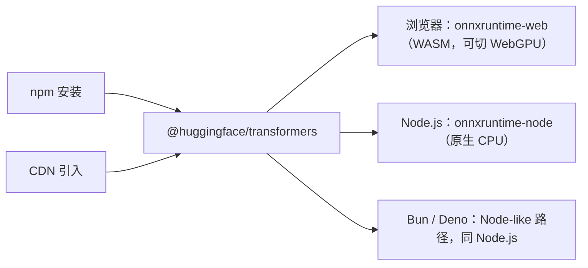

import { Meta } from '@storybook/addon-docs/blocks';

<Meta id="installation" title="上手/安装" name="Docs" />

# 安装

安装只做一件事：把 `@huggingface/transformers` 引进你的运行环境。接入走两条路之一——npm 安装（有包管理器和构建流程的项目）或 CDN 直接引入（无打包器的静态页、快速原型）；库本身只有一套 API，装好后可在浏览器、Node.js、Bun、Deno 四种环境运行，包会按运行环境自动选择 ONNX Runtime 后端。本课给出可复制的安装命令、环境与后端对照，以及一段最小验证代码；`pipeline` 的参数与输出细节由「第一个 pipeline」课承载。



接入回查表：

| 目标 | 直接可用 | 适用条件 |
| --- | --- | --- |
| 项目内安装 | `npm i @huggingface/transformers` | 有包管理器与构建流程的项目 |
| 页面直接引入 | `<script type="module">` 内 `import { pipeline } from 'https://cdn.jsdelivr.net/npm/@huggingface/transformers@4.3.0'` | 无打包器的静态页或快速原型 |
| 验证安装 | `await pipeline('sentiment-analysis')` 后对一句话分类 | 任意环境，完整步骤见下方快速上手 |

## 快速上手

最小闭环：初始化项目 → 安装 → 一行调用 → 观察输出。

```bash
mkdir transformersjs-demo && cd transformersjs-demo
npm init -y
npm i @huggingface/transformers
```

新建 `verify.mjs`（用 `.mjs` 后缀，`npm init -y` 生成的 `package.json` 不必改 `type` 字段）：

```js
import { pipeline } from '@huggingface/transformers';

// 'sentiment-analysis' 是 'text-classification' 的任务别名；
// 不指定模型时使用默认的英文情感分类模型
const classifier = await pipeline('sentiment-analysis');
const output = await classifier('I love transformers!');

console.log(output);
// [{ label: 'POSITIVE', score: 0.999817686 }]
```

```bash
node verify.mjs
```

可观察结果：控制台输出 `[{ label: 'POSITIVE', score: 0.999817686 }]`——`label` 是分类结果，`score` 是接近 1 的置信度，与官方文档示例一致。

边界：第一次运行等待时间明显更长，不是安装出了问题——模型是在首次调用 `pipeline` 时才从 Hugging Face Hub 下载的，耗时取决于网络；下载进度与缓存行为见[第一个 pipeline](?path=/docs/first-pipeline--docs)。

## 两种接入方式

两种方式只决定「库的代码怎样到达运行环境」，不影响 API：`import` 的都是同一个包，接口、参数、行为完全一致。选择判断只有一条——项目里有没有包管理器和打包流程：有就走 npm，没有（纯静态页、快速原型）就走 CDN。

### npm 安装

```bash
npm i @huggingface/transformers
```

包名对任何包管理器一致，`pnpm add` / `yarn add` / `bun add` 同样可用。装完的包内部自带两套构建，由 `package.json` 的 `exports` 字段分发，运行时和打包器自动选择，代码里不需要手写路径：

| `exports` 条件 | 产物 | 谁在使用 |
| --- | --- | --- |
| `node` | `dist/transformers.node.mjs`（`import`）/ `dist/transformers.node.cjs`（`require`） | Node.js、Bun、Deno |
| `default`（web） | `dist/transformers.web.js` | 浏览器与打包器 |

边界：包的依赖同时包含 `onnxruntime-web` 与 `onnxruntime-node`，后者是按平台分发的原生模块——纯浏览器项目里也会一并安装它，属正常现象。

### CDN 直接引入

不需要任何构建步骤，在 HTML 里用 ES Module 引入：

```html
<!doctype html>
<html lang="zh-CN">
  <head>
    <meta charset="utf-8" />
    <title>Transformers.js 安装验证</title>
  </head>
  <body>
    <script type="module">
      import { pipeline } from 'https://cdn.jsdelivr.net/npm/@huggingface/transformers@4.3.0';

      const classifier = await pipeline('sentiment-analysis');
      const output = await classifier('I love transformers!');
      console.log(output);
      // [{ label: 'POSITIVE', score: 0.999817686 }]
    </script>
  </body>
</html>
```

用任意静态服务器打开页面（如 `npx serve`），控制台即可看到同样的输出。两个要点：

- **版本锁定**：官方示例固定写 `@4.3.0`。地址里省略版本号时 jsDelivr 会返回最新发布版（核实本课时同为 4.3.0），但升级时机不再受你控制，正式页面建议锁定版本。CDN 返回的是包内的单文件浏览器构建 `dist/transformers.min.js`。
- **适用边界**：CDN 适合原型演示和无构建静态页；需要版本管理、打包优化或离线部署时，回到 npm 方式。

## 运行环境

一套 API 覆盖四种环境，后端差异由包自动处理：Node.js 构建加载 `onnxruntime-node`（本机原生执行），web 构建加载 `onnxruntime-web`（WASM 执行）；源码中该选择逻辑集中在 `packages/transformers/src/backends/onnx.js`，运行时可通过 `env.backends.onnx` 查看实际后端。

| 环境 | 后端 | 默认执行 | 关键说明 |
| --- | --- | --- | --- |
| 浏览器 | `onnxruntime-web` | WASM（CPU） | `device: 'webgpu'` 切 GPU；WebGPU 在官方文档中标注 experimental |
| Node.js | `onnxruntime-node` | 原生 CPU | 原生模块声明支持 win32 / darwin / linux；v4 起也可用 `device: 'webgpu'` |
| Bun | `onnxruntime-node`（Node-like 路径） | 原生 CPU | 官方支持；v4 起可跑服务端 WebGPU |
| Deno | `onnxruntime-node`（Node-like 路径） | 原生 CPU | 官方支持；无文件系统的 web 运行时（如 Deno Deploy）按 web 环境处理 |

### 浏览器

浏览器是库的主场环境：默认经 `onnxruntime-web` 用 WASM 在 CPU 上执行，把 `device` 设为 `'webgpu'` 即可切到 GPU：

```js
const pipe = await pipeline('sentiment-analysis', 'Xenova/distilbert-base-uncased-finetuned-sst-2-english', {
  device: 'webgpu',
});
```

WebGPU 在官方文档中长期标注 experimental，浏览器兼容现状以官方说明为准。设备与 dtype 的完整取舍见[device 与 dtype](?path=/docs/device-dtype--docs)。模型文件与 WASM 默认从 Hub 和 CDN 在线拉取，页面需联网；本地化与离线方案见[缓存与离线](?path=/docs/cache-offline--docs)。

### Node.js

npm 安装后直接 `import`（或 `require`）使用，代码与浏览器完全一致，只是底层换成了 `onnxruntime-node` 的原生执行。v4 起服务端也能用 `device: 'webgpu'` 跑 GPU 加速，属于正式能力。图像类任务的预处理依赖 `sharp`（4.3.0 起为直接依赖），随包一并安装。

### Bun

官方支持环境。用 Bun 自己的包管理器装同一个包：

```bash
bun add @huggingface/transformers
```

运行时走 Node-like 检测路径（源码把 node / deno / bun 归为同一分支），后端与 Node.js 一致；服务端 WebGPU 与加载路径的细节见[服务端运行](?path=/docs/server-side--docs)。

### Deno

官方支持环境。用 npm: 前缀引入同一个包：

```bash
deno add npm:@huggingface/transformers
```

本地 Deno 运行时同样走 Node-like 路径；无文件系统访问的 web 运行时（如 Deno Deploy）按 web 环境处理。细节见[服务端运行](?path=/docs/server-side--docs)。

## 版本与包名

- **版本基线**：v4.x，写作时最新为 4.3.0（2026-10 经 npm registry 核实），本手册所有课程以此为准。
- **包名变迁**：v3 起包名为 `@huggingface/transformers`；v2 及更早叫 `@xenova/transformers`——搜到的老教程若在 import 这个包名，就是 v2 代码，写法不适用于 v4。
- **锁定策略**：npm 项目的版本由 `package.json` 管理，升级前看 [GitHub Releases](https://github.com/huggingface/transformers.js/releases) 的破坏性变更说明；CDN 方式靠地址里的版本号锁定，省略即最新发布版。

## 常见问题

- 页面里直接写 `import`，控制台报 `SyntaxError: Cannot use import statement outside a module` 一类的语法错误。
  把代码放进 `<script type="module">` 标签内。浏览器只有 module 类型脚本才解析 `import` 语句，CDN 方式必须配合 ES Module。
- `npm i` 过程中或 Node 首次运行时报 `onnxruntime-node` 原生绑定相关错误。
  先确认操作系统在支持列表内（onnxruntime-node 声明 win32 / darwin / linux），删除 `node_modules` 重新安装一次；仍失败再进[服务端运行](?path=/docs/server-side--docs)排查加载路径与运行时差异。

## 总结回顾

摘要：

安装 `@huggingface/transformers` 只有两条路：npm 把包装进项目，CDN 把构建产物直接引进页面，两者暴露同一套 API。包内自带 Node 构建与 web 构建，由 `exports` 字段按运行环境自动分发：Node.js、Bun、Deno 走 `onnxruntime-node` 原生执行，浏览器走 `onnxruntime-web` 的 WASM（可切 WebGPU），代码无需区分环境。版本基线是 v4.x（写作时 4.3.0），v2 时代的 `@xenova/transformers` 已由新包名取代；CDN 地址锁定版本号、npm 交给 `package.json`。装完用一行 `pipeline('sentiment-analysis')` 调用即可验证——首次运行真正在等的是模型下载，而不是安装。

一句话：

> 接入方式只决定库怎样到达运行环境——npm 进项目、CDN 进页面，后端差异由包按环境自动选择，代码保持同一套。

知识要点：

- 两种接入方式的最小写法分别是什么？依据什么选择？
- 为什么代码里不需要手写 web / node 构建路径？
- 四个环境各自默认用哪个 ONNX Runtime 后端？浏览器怎么切 WebGPU？
- 当前版本基线与 v2 时代的包名分别是什么？
- CDN 地址省略版本号意味着什么？
- 第一次运行迟迟不出结果，最可能是在等什么？

## 参考资料

- [Installation · Transformers.js 官方文档](https://huggingface.co/docs/transformers.js/installation)
  npm 安装命令与 CDN 示例的直接出处。
- [Transformers.js 官方文档](https://huggingface.co/docs/transformers.js)
  Quick tour 的最小验证代码、浏览器默认 WASM 与 `device: 'webgpu'` 说明。
- [@huggingface/transformers · npm](https://www.npmjs.com/package/@huggingface/transformers)
  最新版本、`exports` 构建分发与 `onnxruntime-web` / `onnxruntime-node` 依赖信息。
- [huggingface/transformers.js · GitHub](https://github.com/huggingface/transformers.js)
  Releases（服务端 WebGPU 等版本行为）与后端选择、环境检测的源码（`packages/transformers/src/backends/onnx.js`、`src/env.js`）。
