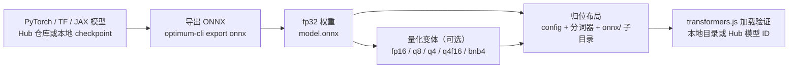

import { Meta } from '@storybook/addon-docs/blocks';

<Meta id="model-conversion" title="进阶/自定义模型转换" name="Docs" />

# 自定义模型转换

Hub 上每个带 transformers.js 标签的模型——包括兄弟课程里加载的所有模型——都是别人用同一条链路转换好的：PyTorch / TensorFlow / JAX 权重经 Optimum 导出为 ONNX，派生各档量化变体，再按 `config.json + 分词器文件 + onnx/ 子目录` 的布局组织成仓库。本课把这条链路完整走一遍，把「自己的模型」变成 transformers.js 能加载的仓库。关键判断先给出：转换是 Python 工具链在本机（或 CI）里跑的过程，浏览器不参与；产物是一个纯静态目录，JS 侧只负责加载它。

工具版本基线（2026-10 核实）：Optimum 的 ONNX 导出器自 2025 年底拆分为独立包 `optimum-onnx`（PyPI 0.1.0，2025-12-23 首发），CLI 入口不变，仍是 `optimum-cli`；加载侧基线为 transformers.js 4.3.0（捆绑 onnxruntime-web 1.31.0-dev / onnxruntime-node 1.30.0）。官方无代码转换工具（Convert-to-ONNX Space）当前锁定 optimum 2.1.0 + transformers 4.57.6。

| 事项 | 命令 / 入口 | 说明 |
| --- | --- | --- |
| 安装导出工具 | `pip install "optimum-onnx[onnxruntime]"` | Python 侧执行；导出基于 PyTorch |
| 导出 fp32 | `optimum-cli export onnx --model <model_id> <output_dir>` | Hub 模型可省略 `--task`，自动推断 |
| 生成量化变体 | Convert-to-ONNX Space（无代码）、仓库转换脚本或手动量化 | 三条路径见「量化变体」 |
| 加载验证 | `pipeline(task, './模型目录')` | Node 指向本地目录；上传 Hub 后换模型 ID |

## 快速上手

最小闭环：导出 fp32 → 归位 → 本地加载验证。fp32 先跑通任务，量化变体是之后的增量步骤。

```bash
# 1. 安装导出工具（Python 虚拟环境内执行）
pip install "optimum-onnx[onnxruntime]"

# 2. 导出：--task 从 Hub 元数据自动推断为 text-classification
optimum-cli export onnx \
  --model distilbert/distilbert-base-uncased-finetuned-sst-2-english \
  distilbert-sst2-onnx/

# 3. 归位：导出产物平铺在输出目录根，transformers.js 到 onnx/ 子目录找权重
mkdir distilbert-sst2-onnx/onnx
mv distilbert-sst2-onnx/*.onnx distilbert-sst2-onnx/onnx/
```

导出结束时的日志是第一层验证——导出器自动用原模型对齐 ONNX 输出（节选，官方文档示例同构）：

```text
Automatic task detection to text-classification.
Validating ONNX model...
-[✓] ONNX model output names match reference model (logits)
-[✓] all values close (atol: 0.0001)
All good, model saved at: distilbert-sst2-onnx/model.onnx
```

新建 `verify.mjs`（`@huggingface/transformers` 的安装见 [安装](?path=/docs/installation--docs)）：

```js
import { pipeline } from '@huggingface/transformers';

// Node 下直接指向本地目录：不是合法模型 ID 的路径按本地路径处理，
// 库自动到其 onnx/ 子目录读取权重（dtype fp32 对应无后缀的 model.onnx）
const classifier = await pipeline(
  'text-classification',
  './distilbert-sst2-onnx',
  { dtype: 'fp32' },
);

const output = await classifier('I love transformers!');
console.log(output);
// [{ label: 'POSITIVE', score: 0.9998... }] —— 与第一个 pipeline 课加载 Hub 模型的输出一致
```

```bash
node verify.mjs
```

可观察结果：输出与 [第一个 pipeline](?path=/docs/first-pipeline--docs) 加载 `Xenova/distilbert-...` 的结果一致——那个仓库正是别人用这条链路转换好的成品。两个边界：fp32 约 268 MB（[device 与 dtype](?path=/docs/device-dtype--docs) 实测），浏览器首载偏大；本地 checkpoint 不在 Hub 上、没有元数据可推断，必须显式传 `--task`。

## 转换链路

整条链路四个阶段，只有前两个需要 Python：



| 阶段 | 工具 | 产物 | 本课落点 |
| --- | --- | --- | --- |
| 导出 | `optimum-cli export onnx`（`optimum-onnx` 包） | fp32 `model.onnx` + config + 分词器文件 | 快速上手 / 导出 ONNX |
| 量化变体 | onnxruntime 量化器，由官方 Space 或仓库脚本代劳 | `model_quantized.onnx` 等带后缀文件 | 量化变体 |
| 归位布局 | 手动移动（脚本与 Space 自动完成） | `onnx/` 子目录 + 根目录配置 | 仓库布局与验证 |
| 验证 | `pipeline()` / `AutoModel.from_pretrained()` | 任务输出与原模型对齐 | 快速上手 |

官方文档的演变值得知道：transformers.js 文档 main 版的「Convert your models to ONNX」章节现在只有一句推荐——用 Optimum 一条命令转换；稳定版（v3.8.1）文档引用的则是仓库转换脚本 `python -m scripts.convert`（该脚本在 v4 主分支已移除，保留在 v3 分支）。两条线索背后是同一套工具：Optimum 导出 + onnxruntime 量化。

## 导出 ONNX

安装与最小命令见快速上手，本节补齐命令的结构与参数。命令骨架：

```bash
optimum-cli export onnx --model <model_id或本地路径> [--task <task>] <output_dir>
```

导出器做的事：加载模型 → 按任务选导出配置 → 走 `torch.onnx.export` 出图 → 默认后处理（生成类模型合并 decoder 与 decoder-with-past）→ 用原模型校验输出 → 写盘。产物平铺在输出目录根：`model.onnx`（超过 2 GB 的大模型另带外部数据文件 `model.onnx_data`）、`config.json`、分词器 / 处理器配置文件，生成类模型还有 `generation_config.json`。

### task：导出任务怎么选

`--task` 决定沿哪个输出头切图、暴露哪些输入输出——选错等于换了模型语义，不是名字装饰。判断规则：

- **Hub 模型可省略**：导出器从模型元数据自动推断（日志 `Automatic task detection to ...`）。
- **本地模型必须显式指定**：没有元数据可推断。
- **生成类任务默认带 past**：`text-generation` / `text2text-generation` / `automatic-speech-recognition` 默认复用 past key/value（等价于 `-with-past` 后缀任务），并把 decoder 与 decoder-with-past 合并成单个 `decoder_model_merged.onnx`——正是 transformers.js 期望的文件名（[device 与 dtype](?path=/docs/device-dtype--docs) 逐文件 dtype 表里的名字）。显式传非 with-past 任务会关闭这一行为。

与 pipeline 任务名的对应（大多数同名，三处不同）：

| transformers.js pipeline 任务 | `--task` 取值 | 说明 |
| --- | --- | --- |
| `text-classification`（别名 `sentiment-analysis`） | `text-classification` | 零样本分类（NLI 模型）也用它；pipeline 的别名不出现在导出任务清单 |
| `token-classification`（别名 `ner`） | `token-classification` | 同上 |
| `question-answering` | `question-answering` | 同名 |
| `feature-extraction` | `feature-extraction` | embedding 用 |
| `fill-mask` | `fill-mask` | 同名 |
| `text-generation` | `text-generation` | 默认已带 past |
| `summarization` / `translation` | `text2text-generation` | 名字不同；T5 / BART 等 seq2seq 家族 |
| `automatic-speech-recognition`（别名 `speech-recognition`） | `automatic-speech-recognition` | whisper 类；默认已带 past |
| `image-classification` / `object-detection` / `image-segmentation` / `depth-estimation` 等 | 与 pipeline 同名 | 视觉任务绝大多数同名 |

`zero-shot-classification` 没有对应导出任务：NLI 模型本质是序列分类头，用 `text-classification` 导出。完整清单以 `optimum-cli export onnx --help` 为准（当前 33 个）；老教程里的 `causal-lm` / `seq2seq-lm` / `speech2seq-lm` 是旧命名，已换成 `text-generation` / `text2text-generation` / `automatic-speech-recognition`。

### 常用参数

| 参数 | 默认 | 作用与时机 |
| --- | --- | --- |
| `--task` | 自动推断 | 见上节；本地模型必传 |
| `--opset` | 按架构默认 | ONNX opset 版本；与运行时的 opset 上限不匹配时创建会话失败，见常见问题 |
| `--device` | `cpu` | 导出时的执行设备；大模型可传 `cuda` 加速导出 |
| `--dtype` | `fp32` | 导出侧浮点精度（fp32 / fp16 / bf16）——这是导出精度，不是 transformers.js 的 dtype 变体体系，注意区分 |
| `--no-post-process` | 关闭 | 禁用默认后处理（decoder 合并等）；transformers.js 需要合并文件，一般不动 |
| `--slim` | 关闭 | 启用 onnxslim 图优化；官方转换脚本默认做同等操作 |
| `--dynamo` | 关闭 | 改用 dynamo 导出器：opset 18 及以上时官方推荐；opset 低于 18 用默认 TorchScript 导出器 |
| `--trust-remote-code` | 关闭 | 仓库自带自定义建模代码时才需要；只对信任的仓库使用 |

## 量化变体

共同模型：变体是同一张计算图配上不同精度的权重存储，文件名 = 基础名 + dtype 后缀（完整映射与体积见 [device 与 dtype](?path=/docs/device-dtype--docs)）。生成变体不重新跑导出——对 fp32 的图做权重重写，所以每个变体都应单独验证。

各变体的生成方式（与官方工具实现逐一对应）：

| 变体 | 文件 | 生成方式 | 说明 |
| --- | --- | --- | --- |
| `fp32` | `model.onnx` | 导出原始产物 | 基准 |
| `fp16` | `model_fp16.onnx` | onnxconverter-common 的 float16 权重转换（IO 保持 fp32） | 体积约减半 |
| `q8` | `model_quantized.onnx` | onnxruntime 动态量化；权重符号按图选择：含 Conv 层用 uint8，其余 int8 | 后缀是历史命名 `_quantized`；选 uint8 为绕开浏览器不支持的 ConvInteger |
| `int8` / `uint8` | `model_int8.onnx` / `model_uint8.onnx` | 同上，固定权重符号类型 | 与 q8 同源 |
| `q4` | `model_q4.onnx` | MatMulNBits 4-bit 块量化（block_size 32） | 依赖 contrib 算子 |
| `q4f16` | `model_q4f16.onnx` | 先 q4 再 fp16 | 低比特家族常用档 |
| `bnb4` | `model_bnb4.onnx` | MatMulBnb4 块量化（NF4，block_size 64） | bitsandbytes 风格 |
| `q1` / `q1f16` / `q2` / `q2f16` | — | 官方转换工具暂不生成 | 运行时支持（v4.1 起），转换侧官方工具清单没有它们 |

三条官方路径：

1. **无代码：Convert-to-ONNX Space。** onnx-community 官方转换工具（社区模型的卡片普遍注明由它自动转换上传）：填入模型 ID，Space 内部执行 `optimum-cli export onnx`，再自动派生 fp16 / int8 / uint8 / quantized / q4 / q4f16 / bnb4 全部变体，逐文件过 ONNX checker，失败变体丢弃并写进日志，最后上传到你的 Hub 账号。
2. **脚本：transformers.js 仓库转换脚本。** 稳定版文档（v3.8.1）引用的官方脚本（v3 分支），一条命令完成导出 + 全变体量化 + onnxslim + 归位。脚本依赖 transformers、optimum、onnxruntime、onnxconverter-common、onnxslim 等 Python 包（导入清单即依赖清单），装好后执行：

```bash
git clone https://github.com/huggingface/transformers.js
cd transformers.js
git switch v3
python -m scripts.convert --quantize --model_id <model_id>
# 输出到 ./models/<model_id>/：config + 分词器 + onnx/ 子目录里的各档变体
```

3. **手动：onnxruntime 量化器。** 官方工具的内部实现，适合只要单个变体的场景：

```python
from onnxruntime.quantization import quantize_dynamic, QuantType

# fp32 → q8 动态量化。权重符号规则与官方脚本一致：
# 多数模型用 QInt8（多数 CPU 上更快）；含 Conv 层的模型换 QUInt8（浏览器无 ConvInteger 实现）
quantize_dynamic("onnx/model.onnx", "onnx/model_quantized.onnx", weight_type=QuantType.QInt8)
```

fp16 / q4 / q4f16 / bnb4 分别走 `onnxconverter_common.float16.convert_float_to_float16`、`MatMulNBitsQuantizer`、`MatMulBnb4Quantizer`（q4f16 = q4 之后接 fp16 转换）。

## 仓库布局与验证

转换完成的仓库长这样（onnx-community/TinyStories-33M-ONNX 的实测文件清单，按通用命名整理）：

```text
my-model-onnx/
├─ config.json                # 模型结构配置（必需）
├─ generation_config.json     # 生成类模型：默认生成参数
├─ tokenizer.json             # fast 分词器（分词核心文件）
├─ tokenizer_config.json      # 分词器配置与 chat template
├─ special_tokens_map.json    # 特殊 token 映射
├─ vocab.json / merges.txt    # 词表类文件，按分词器而定
└─ onnx/
   ├─ model.onnx              # fp32 基准
   ├─ model_quantized.onnx    # q8
   └─ model_q4.onnx …         # 其余变体，各自独立文件
```

与已有课程的对应关系：

- **[缓存与离线](?path=/docs/cache-offline--docs)** 的自托管目录与本布局完全同构——那课讲「放哪里、怎么被命中」，本课讲「怎么造出来」。
- 多会话模型的 `onnx/` 下是多个基础名文件：whisper 是 `encoder_model.onnx` + `decoder_model_merged.onnx`（with-past 导出的合并产物），dtype 可逐文件指定。
- `config.json` 可加 `transformers.js_config` 字段预置 device / dtype（[device 与 dtype](?path=/docs/device-dtype--docs)）。

验证的定位：导出日志已经证明「图与原模型输出对齐」（atol 校验）；JS 加载验证的是集成面——会话能否创建、分词器是否齐、dtype 对应文件是否存在。最小代码即快速上手的 `verify.mjs`；从 Hub 验证只需把本地路径换成你上传后的模型 ID：

```js
// 上传 Hub 后，transformers.js 自动在 onnx/ 子目录找文件
const classifier = await pipeline('text-classification', 'your-name/distilbert-sst2-onnx', {
  dtype: 'q8',
});
```

浏览器侧加载自托管目录（`env.allowLocalModels` / `env.localModelPath`、CORS）见[缓存与离线](?path=/docs/cache-offline--docs)。

## 最佳实践

- **先 fp32 跑通，再派生变体。** fp32 验证任务输出正确后，变体只是权重重写；但低比特变体引入 contrib 算子，未必在每个运行时可用——每个变体都要在目标环境加载一次。官方 Space 的做法可以照搬：逐文件过 ONNX checker，失败的变体不上传。
- **生成类模型保持任务默认。** 用自动推断或 `-with-past` 任务，别显式传非 with-past 任务——合并文件 `decoder_model_merged.onnx` 只在带 past 的导出里出现。
- **把版本组合当成排查的第一变量。** 转换侧 torch / transformers / optimum-onnx 的组合决定图与算子集，加载侧 transformers.js 4.3.0 捆绑 ort-web 1.31.0-dev / ort-node 1.30.0——报错先核对两侧版本，再怀疑模型。
- **小模型先走全链路。** 用同架构的小参数模型（如 TinyStories-33M，几十 MB）验证导出—量化—加载整条链路，再换正式模型，避免在大文件上试错。

## 常见问题

- 加载时报 opset / IR 版本相关错误（如 `Unsupported model IR version`）
  图的 opset 超出运行时支持范围。显式传更低的 `--opset` 重新导出（opset 低于 18 用默认 TorchScript 导出器，18 及以上加 `--dynamo`）；ONNX Runtime 各版本支持的 opset 上限见官方兼容表（上限随版本递增，如 ORT 1.20 支持 opset 21）。
- Node 能跑，浏览器报 `Could not find an implementation for X`（如 ConvInteger）
  onnxruntime-web 的算子实现少于服务端，典型的浏览器 / 服务端差异。q8 对含 Conv 模型自动选 uint8 权重就是为了绕开 ConvInteger；处理动作：换变体（fp16 / q4）、显式用 QUInt8 权重量化，或把推理挪到服务端（[服务端运行](?path=/docs/server-side--docs)）。
- transformers.js 报找不到 `decoder_model_merged.onnx`
  导出时显式传了非 with-past 的生成任务，没有产出合并文件。改回自动推断或 `-with-past` 任务重导。
- 报错提示缺分词器文件（如 `Missing tokenizer.json`）
  导出会自动复制 Hub 模型的分词器文件，但个别架构（marian、esm、vits、wav2vec2、speecht5 等）需要专门生成分词器，官方脚本与 Space 已内置处理；手动转换时从原模型仓库补齐 `tokenizer.json` / `tokenizer_config.json`。
- 加载成功但输出异常
  `--task` 与模型头不匹配（常见于本地模型没传 task、或拿 NLI 模型导成了别的任务）。对照 task 映射表重导，用导出日志里的 output names 与原模型 forward 输出核对。

## 总结回顾

摘要：转换自定义模型的链路只有四段：Optimum 导出（`optimum-cli export onnx`，Hub 模型自动推断任务、本地模型必须显式 `--task`）产出 fp32 `model.onnx` 并自带输出对齐校验；量化变体由 onnxruntime 量化器派生（q8 动态量化、q4 块量化、bnb4、fp16 转换），官方的 Convert-to-ONNX Space 与 v3 分支转换脚本把导出、变体、校验、归位自动化；归位布局是 `config.json + 分词器文件 + onnx/ 子目录`，与自托管目录同构；最后用 `pipeline()` 从本地目录或 Hub 加载验证。生成类模型默认带 past 导出并合并出 `decoder_model_merged.onnx`；浏览器与服务端的算子差异（如 ConvInteger）和 opset 上限是转换后最常见的两类故障。

一句话：

> 链路里只有导出与量化需要 Python——产物是一个静态的 config + 分词器 + onnx/ 仓库，transformers.js 侧只是加载它。

知识要点：

- 快速上手的四步各做了什么？为什么必须有「归位」一步？
- `--task` 何时可省略、何时必须显式？与 pipeline 任务名在哪几处不同？
- 生成类任务的 with-past 默认为什么重要？对应的合并文件名是什么？
- q8 / fp16 / q4 / q4f16 / bnb4 各自怎么生成？q8 为什么对 Conv 模型用 uint8 权重？
- 生成变体的三条官方路径是什么？各自怎么校验？
- 转换完成的仓库需要哪些文件？与缓存离线课的自托管布局是什么关系？
- opset 上限与浏览器算子差异如何排查？典型报错长什么样？

## 参考资料

- [Transformers.js 官方文档 · Use custom models（main）](https://huggingface.co/docs/transformers.js/en/custom_usage)
  「Convert your models to ONNX」章节当前形态：直接推荐用 Optimum（v4 时代不再给具体命令）。
- [Transformers.js v3.8.1 文档 · Use custom models](https://huggingface.co/docs/transformers.js/v3.8.1/en/custom_usage)
  稳定版引用的仓库转换脚本命令与输出布局（`python -m scripts.convert`）。
- [Optimum ONNX · Export a model to ONNX](https://huggingface.co/docs/optimum-onnx/onnx/usage_guides/export_a_model)
  `optimum-cli export onnx --help` 全文、task 清单、with-past 默认行为、opset 与 dynamo 导出器、导出校验日志。
- [huggingface/optimum-onnx（GitHub README）](https://github.com/huggingface/optimum-onnx)
  安装命令 `pip install "optimum-onnx[onnxruntime]"` 与 GPU 版说明。
- [optimum-onnx · PyPI](https://pypi.org/project/optimum-onnx/)
  版本与首发时间（0.1.0，2025-12-23）。
- [onnx-community · Convert to ONNX Space](https://huggingface.co/spaces/onnx-community/convert-to-onnx)
  官方无代码转换工具：变体清单、ONNX checker 校验、失败丢弃策略（README）。
- [Convert-to-ONNX Space · converter.py](https://huggingface.co/spaces/onnx-community/convert-to-onnx/blob/main/converter.py)
  `optimum-cli` 子进程调用、onnx/ 归位、quantize_dynamic / MatMulNBits / MatMulBnb4 / float16 的现役实现与版本锁定。
- [transformers.js v3 分支 · scripts/convert.py](https://github.com/huggingface/transformers.js/blob/v3/scripts/convert.py)
  官方脚本：Optimum 导出 + onnxslim + onnx/ 归位 + whisper alignment_heads 处理。
- [transformers.js v3 分支 · scripts/quantize.py](https://github.com/huggingface/transformers.js/blob/v3/scripts/quantize.py)
  各变体生成方式、q8 → `_quantized` 后缀、Conv 模型选 uint8 权重的 ConvInteger 注释。
- [transformers.js 4.3.0 · package.json](https://github.com/huggingface/transformers.js/blob/4.3.0/packages/transformers/package.json)
  捆绑的 onnxruntime-web 1.31.0-dev / onnxruntime-node 1.30.0。
- [transformers.js 4.3.0 · utils/hub.js](https://github.com/huggingface/transformers.js/blob/4.3.0/packages/transformers/src/utils/hub.js)
  本地路径与合法模型 ID 的判定（`isValidHfModelId`）、`onnx/` 子目录查找的加载入口。
- [onnx-community/TinyStories-33M-ONNX](https://huggingface.co/onnx-community/TinyStories-33M-ONNX)
  转换完成仓库的实测文件清单（本课布局树来源）。
- [ONNX Runtime · Compatibility](https://onnxruntime.ai/docs/reference/compatibility.html)
  ONNX opset 支持范围表（各 ORT 版本的上限）。
- [device 与 dtype](?path=/docs/device-dtype--docs)
  dtype → onnx 文件名映射与各档位实测体积。
- [缓存与离线](?path=/docs/cache-offline--docs)
  自托管目录布局与浏览器本地加载配置。
