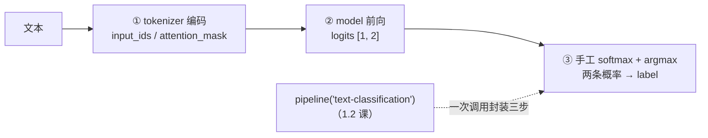

import { Canvas, Controls, Meta } from '@storybook/addon-docs/blocks';
import * as ModelInference from './model-inference.stories';

<Meta of={ModelInference} name="Docs" />

# model 前向推理

`pipeline()` 是封装，这条手工链路才是库的真实形状：`tokenizer` 把文本编码成张量，`model` 前向一次给出 `logits`，剩下的解读——softmax、取最大、映射标签——由你自己完成。本课绕过 pipeline，用 `AutoTokenizer` + `AutoModelForSequenceClassification` 亲手走完情感分类的每一步，并讲清 AutoModel 家族、任务头与 ONNX 计算图的对应关系。

读完本页你应该能预测实例的行为：切换示例文本后，读数依次给出 2 维 logits → softmax 后两条概率 → 最终预测 label；数值上与 [1.2 第一个 pipeline](?path=/docs/first-pipeline--docs) 的 `score` 一致——那条链正是本课三步的封装。



| 步骤 / 对象 | 写法 | 输出 | 回查要点 |
| --- | --- | --- | --- |
| ① 编码 | `await tokenizer(text)` | `{ input_ids, attention_mask, ... }`，值都是 Tensor | `input_ids.dims` 为 `[1, 序列长度]`；编码细节见 [2.1.1 tokenizer](?path=/docs/tokenizer--docs) |
| ② 前向 | `await model(inputs)` | `{ logits }` 等输出对象，值都是 Tensor | 模型实例可像函数一样调用；编码对象里多余的键会被忽略 |
| ③ 解读 | `logits.tolist()` + 手工 softmax | 两条概率（和为 1） | logits 是 softmax 之前的原始分数，可为负 |
| 标签映射 | `config.json` 的 `id2label` | `{ '0': 'NEGATIVE', '1': 'POSITIVE' }` | 索引顺序即 logits 的类别顺序 |

## 快速上手

最小闭环是两次 `from_pretrained`（整个页面只做一次）加三步调用：

```js
import { AutoTokenizer, AutoModelForSequenceClassification } from '@huggingface/transformers';

const MODEL_ID = 'Xenova/distilbert-base-uncased-finetuned-sst-2-english';

// 分别加载分词器与模型；加载选项（progress_callback、dtype、device 等）与 pipeline 一致
const tokenizer = await AutoTokenizer.from_pretrained(MODEL_ID);
const model = await AutoModelForSequenceClassification.from_pretrained(MODEL_ID);

// ① 编码：文本 → 张量
const inputs = await tokenizer('I love transformers!');

// ② 前向：编码对象直接传入，从输出对象里取出 logits
const { logits } = await model(inputs);

// ③ 解读：原始分数 → 概率 → 标签
const scores = logits.tolist()[0]; // dims 是 [1, 2]：先去掉 batch 维
const probs = softmax(scores);     // [P(NEGATIVE), P(POSITIVE)]，和为 1
const label = ['NEGATIVE', 'POSITIVE'][probs.indexOf(Math.max(...probs))];
// 'POSITIVE'，P(POSITIVE) 约 0.9998 —— 与 1.2 课 pipeline 输出的 score 一致
```

```js
// 数值稳定写法：先减去最大值再取指数，logits 量级大时也不会溢出
function softmax(values) {
  const max = Math.max(...values);
  const exps = values.map((v) => Math.exp(v - max));
  const sum = exps.reduce((total, v) => total + v, 0);
  return exps.map((e) => e / sum);
}
```

下面的内嵌实例执行的就是这段逻辑。**首次打开会下载约 67.6 MB 的 q8 模型文件，需要数秒到数十秒**，期间画布显示下载进度与用时；本课模型与 1.2 课是同一份文件，若你在本浏览器打开过那课的实例，缓存直接命中。实例为了免安装依赖，改用官方 CDN 版本加载库，推理代码与本节完全一致。

<Canvas of={ModelInference.Interactive} />
<Controls of={ModelInference.Interactive} />

| 读者操作 | 可观察证据 |
| --- | --- |
| 等待首次加载 | 「状态」从 加载中 变为 就绪（附带加载用时），画布显示下载百分比 |
| 切换「示例文本」 | 「logits」「softmax 概率」「预测 label」读数同步变化；「英文中性」一句能看到概率差距远小于极端句 |
| 打开 Show code | 查看实例实际执行的 `forward-inference.ts` |

## AutoModel 家族与任务头

v4 提供三十多个 `AutoModelFor*` 类，全部通过 `from_pretrained` 加载。它们与 `AutoModel` 的关系是「骨干」与「骨干 + 任务头」：

- `AutoModel` 是基础骨干入口：加载后即可跑前向，拿到计算图的原始输出。
- `AutoModelForSequenceClassification`、`AutoModelForCausalLM` 等带任务头的类：语义指向带对应任务头的模型，并把输出包装成该任务的形态（分类任务给 `logits`）。

加载时真正实例化哪个类由两层信息共同决定：仓库 `config.json` 的 `model_type` 给出架构家族（本课模型是 `distilbert`），你选用的 Auto 类给出任务视角，查映射表得到具体类——`AutoModel` 得到 `DistilBertModel`，`AutoModelForSequenceClassification` 得到 `DistilBertForSequenceClassification`。两者的行为差异（v4 源码核实）：`AutoModel` 在映射表查不到时会回退到基类 `PreTrainedModel` 继续加载（打一条警告）；任务类查不到则直接抛出 `Unsupported model type` 错误——用对任务类是第一道保险。

| Auto 类 | 任务 | 主要输出 | 单条输入的形状 |
| --- | --- | --- | --- |
| `AutoModel` | 基础骨干 | 会话原始输出（取决于仓库导出的图） | 骨干图是 `[1, seq, hidden]` 一类 |
| `AutoModelForSequenceClassification` | 序列分类 | `logits` | `[1, 类别数]` |
| `AutoModelForTokenClassification` | token 分类 | `logits` | `[1, seq, 类别数]` |
| `AutoModelForMaskedLM` | 完形填空 | `logits` | `[1, seq, 词表大小]` |
| `AutoModelForQuestionAnswering` | 抽取式问答 | `start_logits` / `end_logits` | 各 `[1, seq]` |
| `AutoModelForCausalLM` | 文本生成 | `logits`，带 `.generate()` | `[1, seq, 词表大小]` |
| `AutoModelForSeq2SeqLM` | 翻译、摘要 | 带 `.generate()`，加载两张子图 | — |
| `AutoModelForImageClassification` | 图像分类 | `logits` | `[1, 类别数]` |

形状里的 `seq` 是序列长度，`词表大小` 即 `vocab_size`（本课模型 30522）；生成类家族（CausalLM / Seq2SeqLM 等）额外挂 `.generate()` 方法，见 [2.2.1 生成参数](?path=/docs/generation-options--docs)。

### ONNX 计算图：任务头固化在图里

Transformers.js 不在运行时拼装任务头——`onnx/` 目录里的每张计算图在导出时就已定型。本课仓库只有一张图，导出自 `DistilBertForSequenceClassification`，图末尾就是分类头，输出名直接叫 `logits`。三条判断据此展开：

- **加载哪张图由架构类型决定，与用哪个 Auto 类无关。** 单图骨干模型只加载 `model.onnx`（按 dtype 加后缀，q8 即 `model_quantized.onnx`）；编码器-解码器模型（Seq2Seq）加载 `encoder_model.onnx` + `decoder_model_merged.onnx` 两张子图。所以对本课仓库，`AutoModel` 与 `AutoModelForSequenceClassification` 下载的是同一个文件；类的区别在输出包装（前者返回会话原始输出，后者包装成带 `logits` 字段的 `SequenceClassifierOutput`）与语义，不在下载内容。
- **同一仓库的不同 dtype 是同一张图的量化副本。** 本课仓库 fp32 的 `model.onnx` 约 268 MB，fp16 的 `model_fp16.onnx` 约 134 MB，q8 的 `model_quantized.onnx` 约 67.6 MB；dtype 档位的完整取舍见 [2.3.1 device 与 dtype](?path=/docs/device-dtype--docs)。
- **图里没有的任务头补不出来。** 导出自纯骨干架构的仓库，图里只有隐藏状态，输出对象中不会有 `logits`。判断方法看 `config.json` 的 `architectures` 字段（本课模型是 `DistilBertForSequenceClassification`）。

## 手工链路：编码 → 前向 → 输出对象

拆开 pipeline 后每一步的对象类型都是确定的：编码产出张量对象，前向吃张量、吐张量，解读在 JS 侧完成。

### tokenizer 编码：文本变张量

```js
const inputs = await tokenizer('I love transformers!');
// {
//   input_ids:      Tensor { dims: [1, 6], type: 'int64', data: BigInt64Array(6) },
//   attention_mask: Tensor { dims: [1, 6], type: 'int64', ... },
//   ...
// }
```

`input_ids` 是词表索引序列（`'I love transformers!'` 编码为 6 个 token，含 `[CLS]` / `[SEP]`），`attention_mask` 标记哪些位置是真实 token；`dims` 第 0 维是 batch、第 1 维是序列长度。返回值默认就是 Tensor（传 `return_tensor: false` 可拿普通数组）；`padding`、`truncation` 等编码选项默认关闭——pipeline 会固定开启它们，手工链路由你决定。编码与解码的完整规则见 [2.1.1 tokenizer](?path=/docs/tokenizer--docs)。

### model 前向：模型实例可调用

模型实例本身可像函数一样调用（等价于执行 `forward`），`await` 拿到输出对象：

```js
const output = await model(inputs); // 或 await model.forward(inputs)
// SequenceClassifierOutput { logits: Tensor { dims: [1, 2], type: 'float32', ... } }
```

两个实用边界：

- **多余的输入键会被忽略。** 库只把 ONNX 计算图声明需要的输入喂给会话，所以把 `tokenizer` 返回的整个对象传进去是安全的（官方文档示例正是这么写的）。
- **输出对象的键由计算图决定。** 本课模型输出 `logits`；其他架构可能输出 `last_hidden_state`、`start_logits` 等，每个值都是 Tensor。

### 读输出张量：dims、data、tolist

Tensor 的常用读取面（以本课 2 维 logits 为例）：

| 成员 | 含义 | 本课 logits 上的取值 |
| --- | --- | --- |
| `dims` | 形状 | `[1, 2]`：第 0 维是 batch，第 1 维是类别 |
| `type` | 数据类型 | `'float32'` |
| `data` | 扁平的 TypedArray 原始数据 | `Float32Array(2)` |
| `size` | 元素总数 | `2` |
| `tolist()` | 转成嵌套 JS 数组 | `[[-3.85, 3.52]]`（数值示意） |
| `item()` | 单元素张量转 JS 数值 | 仅 1 个元素时可用 |

`dims` 第 0 维是 batch——单条输入恒为 1，批量推理时才大于 1，所以解读前先用 `tolist()[0]` 去掉 batch 维，得到各类别的原始分数。

## 手工 softmax：从 logits 到 label

logits 是 softmax 之前的原始分数：可为负、量级任意、直接相加不等于 1。分类的解读只需三步：

1. **softmax 把分数变概率。** 指数归一化，两条概率和为 1；分数差距越大，概率差距越悬殊——切换实例里的「英文中性」与「英文好评」对比：logits 差距小的句子，概率不会一边倒。
2. **用数值稳定写法。** 先减去最大值再取指数：logits 量级大时（绝对值几十以上），不减会让 `Math.exp` 溢出成 `Infinity` / `NaN`；减掉之后概率结果不变。
3. **argmax + id2label 得到标签。** 概率最大的索引就是预测类别，索引到类别名的映射查 `config.json` 的 `id2label`（本课模型：`0 → NEGATIVE`，`1 → POSITIVE`）。

```js
// id2label 来自模型 config.json：{ '0': 'NEGATIVE', '1': 'POSITIVE' }
const ID2LABEL = { 0: 'NEGATIVE', 1: 'POSITIVE' };

const scores = logits.tolist()[0];  // [NEGATIVE 分数, POSITIVE 分数]，顺序即 id2label 的索引顺序
const probs = softmax(scores);      // 和为 1 的两条概率
const label = ID2LABEL[probs.indexOf(Math.max(...probs))]; // 'POSITIVE'
```

顺序提醒：`scores` 的类别顺序由 `id2label` 决定，本课模型固定为 `[NEGATIVE, POSITIVE]`——别凭直觉假设「第 0 个是正类」。

## 与 pipeline 的对应关系

`text-classification` pipeline 内部执行的就是本课这条链（v4 源码中的顺序）：

| pipeline 内部 | 本课对应 | 说明 |
| --- | --- | --- |
| `tokenizer(texts, { padding: true, truncation: true })` | ① 编码 | pipeline 固定开启 padding 与截断 |
| `this.model(model_inputs)` | ② 前向 | 同一个模型调用 |
| `softmax(batch.data)` | ③ 解读 | 问题类型为 multi-label 时改用 sigmoid |
| `topk(output, top_k)` + `id2label[x]` | ③ 解读 | `top_k` 默认 `1`，只留最大的一项 |

所以 1.2 课看到的 `[{ label: 'POSITIVE', score: 0.9998 }]` 里，`score` 就是本课手工 softmax 后的最大概率——两条链数值一致，pipeline 没有额外的模型魔法。什么时候值得绕过 pipeline：

- 需要 pipeline 不透出的中间量：logits 本身、隐藏状态等输出对象。
- 需要自定义解读：温度、自定义标签映射，或把 logits 接进自己的打分逻辑。
- 需要精确控制编码：关闭 pipeline 固定的 padding / 截断，或改用批量输入。

## 最佳实践

- **类名与模型架构匹配。** 加载前看一眼仓库 `config.json` 的 `architectures` 与 `onnx/` 目录：分类模型配 `AutoModelForSequenceClassification`，生成模型配 `AutoModelForCausalLM`；架构对不上时输出对象里不会有期望的键（用错任务类比报错更难排查的是「静默拿到错误形状」）。
- **实例只加载一次，反复前向。** `from_pretrained` 返回的 tokenizer 与 model 可反复调用；换输入只触发编码 + 前向（本课实例即如此），重建实例不会更快，反而丢掉已就绪的会话。
- **生产代码显式指定模型 ID。** 与 1.2 课同样的理由：写全模型 ID（必要时用 `options.revision` 固定版本）才能保证行为可复现。

## 常见问题

- 把 `logits` 直接当概率用，出现了负数，或几条相加不是 1
  logits 是 softmax 之前的原始分数，先过一遍 softmax 再用；要「全部类别的概率」就自己算，或用 pipeline 的 `top_k: null`（它内部同样先 softmax）。
- softmax 算出了 `NaN` 或 `Infinity`
  没有先减最大值：logits 量级大时 `Math.exp` 溢出。改用上文的数值稳定写法（先减 `Math.max(...values)`），概率结果不变。
- 调用 `model` 报错，提示缺少输入，或拿到的是 Promise 而非结果
  两个常见原因：直接把字符串传给了 `model`——必须先经 `tokenizer` 编码，计算图只认 `input_ids` 等张量输入；或漏写 `await`——`tokenizer(text)` 与 `model(inputs)` 都返回 Promise，顶层 `await` 需要 ESM 环境。
- 输出对象里没有 `logits`，或形状和预期不一样
  图里固化的输出和你选的类不匹配：看仓库 `config.json` 的 `architectures` 判断这个仓库导出的是什么——纯骨干图只有隐藏状态，没有 `logits`。另注意形状第 0 维是 batch（单条输入是 1），别把它当成类别数。

## 总结回顾

摘要：

本课把 pipeline 拆开：`AutoTokenizer.from_pretrained` 与 `AutoModelForSequenceClassification.from_pretrained` 各加载一次实例；`tokenizer(text)` 把文本编码成张量（`input_ids` / `attention_mask`），`model(inputs)` 前向一次返回带 `logits` 的输出对象；`logits.dims` 为 `[1, 2]`（batch × 类别），`tolist()` 转成 JS 数组后用先减最大值的稳定 softmax 得到两条概率，argmax 后查 `config.json` 的 `id2label` 得到最终 label。AutoModel 家族里，`AutoModel` 是骨干入口、查不到架构会回退基类，`AutoModelFor*` 是带任务头的入口、查不到会报错；真正加载哪张 ONNX 计算图由架构类型决定，任务头在导出时已固化在图里。`text-classification` pipeline 内部就是「编码 → 前向 → softmax → topk」，它的 `score` 即手工 softmax 后的最大概率。

一句话：

> pipeline 只是这条手工链的封装——编码、前向、softmax 每一步都可以自己写，需要中间量或自定义解读时也必须自己写。

知识要点：

- `AutoModel` 与 `AutoModelForSequenceClassification` 在加载与输出包装上有什么异同？
- tokenizer 编码产出什么？`model(inputs)` 的输入与输出对象各长什么样？
- `logits` 的 `dims` 各维是什么含义？`data` 与 `tolist()` 分别适合什么时候用？
- 手工 softmax 为什么先减最大值？最终 label 怎样从概率得到？
- `text-classification` pipeline 的内部步骤与本课三步如何对应？什么时候值得绕过 pipeline？

## 参考资料

- [models API](https://huggingface.co/docs/transformers.js/en/api/models)
  `AutoModel` 家族全部类名、`from_pretrained` 用法与「模型实例可调用、返回输出张量对象」的官方示例。
- [utils/tensor API](https://huggingface.co/docs/transformers.js/en/api/utils/tensor)
  `Tensor` 的 `dims`、`type`、`data`、`size`、`tolist()`、`item()` 等成员定义。
- [tokenizers API](https://huggingface.co/docs/transformers.js/en/api/tokenizers)
  编码调用返回的 `BatchEncoding` 结构（`input_ids` / `attention_mask` / `token_type_ids`）与 `return_tensor` 默认行为。
- [pipelines API](https://huggingface.co/docs/transformers.js/en/api/pipelines)
  `text-classification` 的 `top_k` 默认值与输出结构。
- [text-classification pipeline 源码（v4）](https://github.com/huggingface/transformers.js/blob/main/packages/transformers/src/pipelines/text-classification.js)
  「与 pipeline 的对应关系」一节的依据：内部依次执行 编码 → 模型 → softmax（multi-label 时 sigmoid）→ topk。
- [Xenova/distilbert-base-uncased-finetuned-sst-2-english](https://huggingface.co/Xenova/distilbert-base-uncased-finetuned-sst-2-english)
  本课示例模型：`config.json` 的 `id2label` 与 `architectures`，`onnx/` 目录各量化档位体积（q8 的 `model_quantized.onnx` 约 67.6 MB）。
- [@huggingface/transformers（npm）](https://www.npmjs.com/package/@huggingface/transformers)
  npm 安装与 CDN 引入的官方写法（本课实例经 jsdelivr 加载 4.3.0 版本）。
