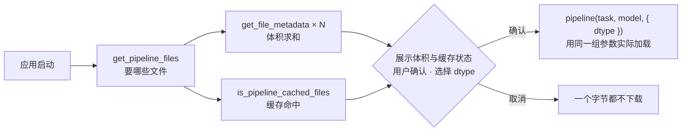

import { Canvas, Controls, Meta } from '@storybook/addon-docs/blocks';
import * as ModelRegistryCourse from './model-registry.stories';

<Meta of={ModelRegistryCourse} name="Docs" />

# ModelRegistry

`ModelRegistry` 是 v4.0 新增的静态工具类，把「加载前能知道的事」变成显式查询：这个任务加模型加 dtype 的组合会用到哪些文件、每个文件多大、是否已经在浏览器缓存里、仓库到底导出了哪些量化档位。它不下载权重、不创建模型实例，只做检查与缓存管理；真正的加载仍由 `pipeline()` / `from_pretrained()` 完成。生产工作流因此可以拆成两段：应用启动时先查询，把体积与缓存状态展示给用户（或据此自动决策），用户确认或选好 dtype 后，再用同样的参数实际加载。

读完本页你应该能预测实例的行为：切换「模型预设」与「dtype 档位」，画布逐行列出 registry 返回的文件清单、实测体积与缓存命中；distilbert 预设在本浏览器运行过 [1.2 第一个 pipeline](?path=/docs/first-pipeline--docs) 示例的前提下应显示全部命中，未用过的模型显示 0 命中——两次读数都是查询的真实结果。



| 核心方法 | 返回 | 回查要点 |
| --- | --- | --- |
| `ModelRegistry.get_pipeline_files(task, modelId, options)` | `Promise<string[]>` | 加载会用到哪些文件；`options.dtype` / `device` 改变 onnx 文件名 |
| `ModelRegistry.get_file_metadata(modelId, filename)` | `{ exists, size?, contentType?, fromCache? }` | 单文件体积（字节）与存在性；不下载文件本体 |
| `ModelRegistry.is_pipeline_cached(task, modelId, options)` | `Promise<boolean>` | 整组是否已缓存；纯本地检查，不发网络请求 |
| `ModelRegistry.is_pipeline_cached_files(task, modelId, options)` | `{ allCached, files }` | 逐文件缓存明细，`files[i] = { file, cached }` |
| `ModelRegistry.get_available_dtypes(modelId)` | `Promise<string[]>` | 仓库实际提供了哪些档位；空数组 = 没有任何完整 ONNX 组 |
| `ModelRegistry.clear_pipeline_cache(task, modelId, options)` | `{ filesDeleted, filesCached, files }` | 按任务清缓存并返回逐文件结果；全部方法均为静态调用 |

## registry 与 pipeline 的分工

`ModelRegistry` 的全部 13 个方法都是静态方法，直接 `ModelRegistry.xxx()` 调用，不能也不需要 new。它的定位是加载前的检查与缓存管理：查清单、查体积、查缓存、查档位、清缓存；下载权重和创建推理会话永远是 `pipeline()` / `AutoModel.from_pretrained()` 的事。

两者不是两套独立机制：v4 的 `pipeline()` 内部用的就是同一组函数——先调 `get_pipeline_files(task, model, { device, dtype })` 得到文件清单（这个清单同时决定 tokenizer / processor 是否并行加载），再在传入 `progress_callback` 时用 `get_file_metadata` 预取各文件体积，聚合出 1.2 课见过的 `progress_total` 事件（源码 `pipelines.js`）。所以在 registry 上用某组参数查到的清单与体积，就是随后用同样参数调用 `pipeline()` 时实际会下载的东西——这正是「先检查、后加载」能对得上的原因。

核心六个方法见开场参考表，其余七个只承担细分回查：

| 方法 | 用途 |
| --- | --- |
| `get_files(modelId, options)` | 全部文件的清单（不按任务筛选） |
| `get_model_files(modelId, options)` | 只列模型侧文件（config 与 onnx） |
| `get_tokenizer_files(modelId)` | 只列分词器文件 |
| `get_processor_files(modelId)` | 只列预处理器文件 |
| `is_cached(modelId, options)` / `is_cached_files(...)` | 不带任务的缓存检查（整模型视角） |
| `clear_cache(modelId, options)` | 清整个模型的缓存，多出 `include_tokenizer` / `include_processor` 开关 |

与 [2.3.2 env 配置](?path=/docs/env-config--docs)的分工：registry 读写的就是 env 指向的那个缓存（浏览器里是 Cache API 的 `transformers-cache`）；想改缓存行为、换缓存目录、自定义 fetch，去配置 `env`，registry 自动按当前配置生效。

## 文件清单与体积

检查的第一步是知道「会下载什么、有多大」。这组方法围绕一个三元组工作：`task` 决定带哪些组件、模型 ID 决定查哪个仓库、`dtype` 决定 onnx 文件名——三者任一变化，清单与体积都跟着变。`get_pipeline_files` 给出清单，`get_file_metadata` 给出清单里每个文件的体积与存在性，两者配合才能算出诚实的总下载量。

### get_pipeline_files：会下载哪些文件

```js
const files = await ModelRegistry.get_pipeline_files(
  'text-classification',
  'Xenova/distilbert-base-uncased-finetuned-sst-2-english',
  { dtype: 'q8' },
);
// ['config.json', 'onnx/model_quantized.onnx', 'tokenizer.json', 'tokenizer_config.json']
```

清单的构成规则（源码 `get_pipeline_files.js` / `get_files.js`）：

- `task` 先过别名表（`'sentiment-analysis'` 解析为 `'text-classification'`），不在支持列表直接抛 `Unsupported pipeline task`；
- 组件按任务类型决定：文本任务带 tokenizer，图像 / 音频任务带 processor，多模态两者都带；
- onnx 文件名由 `dtype` 决定（后缀映射见 [2.3.1 device 与 dtype](?path=/docs/device-dtype--docs)）：`q8` → `onnx/model_quantized.onnx`，换成 `fp32` 清单里就是 `onnx/model.onnx`；
- `text-generation` 会再按模型类型过滤出文本生成真正需要的会话文件（如 `decoder_model_merged`）；
- 大模型可能出现 external data 文件（如 `onnx/model_fp16.onnx_data`），它单独算一个文件、单独缓存。

### get_file_metadata：不下载的体积查询

```js
// 返回 { exists, size?, contentType?, fromCache? }，size 单位是字节
const meta = await ModelRegistry.get_file_metadata(MODEL_ID, 'onnx/model_quantized.onnx');
if (meta.exists) {
  console.log(`${(meta.size / 1e6).toFixed(1)} MB`);
}
```

实现上它不是 HEAD 请求：源码（`get_file_metadata.js`）发的是一个只取 1 字节的 Range GET（`Range: bytes=0-0`），从响应的 `content-range` 头读真实未压缩体积——绕开了 HEAD 响应的 Content-Length 在 gzip 压缩下不可靠的问题。[2.3.1 device 与 dtype](?path=/docs/device-dtype--docs) 用手工 HEAD 实测体积，生产代码应改用这个官方入口。

四段边界决定怎么处理返回值与异常：

- 404 / 416 → `exists: false`（含「仓库没有这个档位文件」），不抛错；
- 401 / 403 → 抛 `ModelFileNotFoundError`——Hub 对不存在的仓库返回 401，所以模型 ID 写错会以异常形式出现，调用处要 try/catch（该类也从主包导出）；
- 结果按参数 memoize，同一查询重复调用不再发网络请求；
- `local_files_only` 或 `env.allowRemoteModels = false` 时跳过远程检查。

对清单逐文件求和就是总下载量（Release notes 示例的做法）：

```js
const sizes = await Promise.all(
  files.map(async (file) => (await ModelRegistry.get_file_metadata(MODEL_ID, file)).size ?? 0),
);
const totalMB = (sizes.reduce((a, b) => a + b, 0) / 1e6).toFixed(1);
```

## 缓存状态与档位

检查的第二步是知道「哪些已经在本地、哪些选项真实存在」。缓存检查读取的是 env 指向的本地缓存（浏览器里是 Cache API），一个字节都不走网络，所以可以放在启动路径上直接展示；档位探测反过来要访问 Hub，但探测的也只是元数据而非权重。两组结果合起来，决定界面上显示「已缓存」还是「需下载 X MB」，以及 dtype 选项里哪些真正可选。

### is_pipeline_cached：缓存命中查询

```js
const cached = await ModelRegistry.is_pipeline_cached(
  'text-classification', MODEL_ID, { dtype: 'q8' },
); // true / false

const detail = await ModelRegistry.is_pipeline_cached_files(
  'text-classification', MODEL_ID, { dtype: 'q8' },
);
// { allCached: false, files: [{ file: 'config.json', cached: true }, ...] }
```

- 纯本地检查（浏览器 Cache API / Node 文件缓存的匹配），不发网络请求，适合启动时同步展示；
- boolean 版有快速短路：`config.json` 未缓存直接返回 `false`，不再逐个查；
- 缓存按文件 URL 键控，所以（模型, dtype, revision）每个组合独立计数——切档位后命中状态会变，与 [2.3.1 device 与 dtype](?path=/docs/device-dtype--docs) 的「切 dtype 重新下载」是同一件事的另一面；
- 只反映本 origin 的缓存：跨端口、跨域名的部署互不可见，Cache API 还要求 https 或 localhost 环境。

### get_available_dtypes：仓库提供哪些档位

```js
const dtypes = await ModelRegistry.get_available_dtypes('onnx-community/all-MiniLM-L6-v2-ONNX');
// ['fp32', 'fp16', 'int8', 'uint8', 'q8', 'q4']
```

- 某档位只有在它需要的全部会话文件都存在时才算可用（seq2seq 模型要 encoder 与 decoder 齐全）；
- 返回顺序固定，按档位映射表的键序排列（fp32、fp16、int8、uint8、q8、q4、q2、q1、q4f16、q2f16、q1f16、bnb4）；
- 空数组是合法结果：模型可达，但 `onnx/` 下没有任何一档完整的文件组；
- 成本来自探测方式：对每个（档位 × 会话文件）组合发一次 1 字节元数据请求，12 档并行、结果 memoize——秒级，但别放进渲染循环；
- 它把 2.3.1 课「档位是否提供取决于仓库导出，上线前实测」的叮嘱变成了官方方法：在渲染 dtype 下拉框之前先查一次，用户就选不到 404 的档位。

### clear_pipeline_cache：按任务清缓存

```js
const result = await ModelRegistry.clear_pipeline_cache(
  'text-classification', MODEL_ID, { dtype: 'q8' },
);
// { filesDeleted: 4, filesCached: 4, files: [{ file: '...', deleted: true, wasCached: true }, ...] }
```

- 返回删除统计：`filesDeleted` / `filesCached` 计数加逐文件 `{ file, deleted, wasCached }`；
- `clear_cache` 是不带任务的版本，多出 `include_tokenizer` / `include_processor` 两个开关（默认 `true`）；
- 浏览器删的是 Cache API 里以 URL 为键的条目，Node 删文件缓存里的本地路径；缓存对象不支持 delete 时抛 `Cache does not support delete operation`；
- 「设置页里放一个清除模型缓存按钮」就是它的用武之地，比让用户去 DevTools 删 Cache Storage 可靠。

## 生产工作流：检查 → 确认 → 加载

把前面的方法串成应用启动流程：

```js
// ① 检查：列文件、求总体积、查缓存命中——三步都不下载权重
const MODEL_ID = 'Xenova/distilbert-base-uncased-finetuned-sst-2-english';
const dtype = 'q8';
const files = await ModelRegistry.get_pipeline_files('text-classification', MODEL_ID, { dtype });
const sizes = await Promise.all(
  files.map(async (file) => (await ModelRegistry.get_file_metadata(MODEL_ID, file)).size ?? 0),
);
const totalMB = (sizes.reduce((a, b) => a + b, 0) / 1e6).toFixed(1);
const { allCached } = await ModelRegistry.is_pipeline_cached_files(
  'text-classification', MODEL_ID, { dtype },
);

// ② 展示与决策：已缓存直接加载；否则交给用户确认，或自动换更小的档位
if (!allCached && !confirm(`首次使用需下载约 ${totalMB} MB，继续？`)) {
  return;
}

// ③ 加载：参数必须与 ① 完全一致，清单、体积与命中状态才一一对应
const classifier = await pipeline('text-classification', MODEL_ID, { dtype });
```

两条纪律：给用户看的必须是「实际会发生的下载」，所以 ③ 的 `task`、模型 ID、`dtype`、`revision` 都要与 ① 完全一致，改了任何一个，清单、体积、缓存键全部跟着变；加载阶段的进度展示交给 `progress_callback` 的 `progress_total` 聚合事件（[1.2 第一个 pipeline](?path=/docs/first-pipeline--docs)），registry 预取的各文件体积正是它的数据来源。

下面的内嵌实例执行这个流程的前两段：用 `ModelRegistry` 完成检查并把结果铺在画布上，第三段的实际加载不执行——体积查询是 1 字节 Range 请求、缓存检查纯本地，整页秒级返回。实例沿用兄弟课的官方 CDN 动态导入，npm 项目写法见 Show code 顶部注释。

<Canvas of={ModelRegistryCourse.Interactive} />
<Controls of={ModelRegistryCourse.Interactive} />

| 读者操作 | 可观察证据 |
| --- | --- |
| 保持 distilbert 预设（q8 档） | 在运行过 1.2 课示例的浏览器里：四个文件全部 ✓，「缓存命中 4/4」「实际需下载 0 B」；没运行过则与下一行相同 |
| 切换「模型预设」到 MiniLM 句向量 | 未用过的模型显示「缓存命中 0/4」，「实际需下载」约等于合计体积 |
| 切换「dtype 档位」 | onnx 文件名与实测体积随之变化；缓存命中数按档位独立计数 |
| 选到 q2 | 权重行显示「未提供」（仓库没有该档位），合计体积只含查得到的文件 |
| 打开 Show code | 查看实例实际执行的 `model-registry-check.ts` |

## 最佳实践

- **启动时检查，别等加载报错。** 用 `is_pipeline_cached` 判断是否需要下载提示，用 `get_available_dtypes` 过滤档位选项；`ModelFileNotFoundError` 说明模型 ID 或权限有问题，在检查阶段就能发现，而不是让用户等了半天加载才失败。
- **检查与加载用同一组参数。** `task`、模型 ID、`dtype`、`revision` 任何一项不一致，展示的体积与缓存状态就和实际下载对不上；把检查时的 options 对象原样传给 `pipeline()`。
- **给用户看的数字要完整。** 体积求和时跳过 `exists: false` 的文件，同时标出「未提供」的档位；缓存命中的文件不算进需下载量——两者都变了，展示才是诚实的。
- **清缓存给明确入口。** `clear_pipeline_cache` 按任务清理并返回逐文件结果，适合放进设置页；换档位前先查体积，避免用户为试一个档位多下载几十 MB。

## 常见问题

- 一调用就抛 `ModelFileNotFoundError`，但模型明明存在
  该错误包装的是 Hub 的 401/403：仓库 ID 拼写错误（Hub 对不存在的仓库返回 401 而不是 404）、私有仓库或 gated 仓库未登录。检查模型 ID 与访问权限；`get_available_dtypes` / `get_file_metadata` 都可能抛它，调用处要 try/catch。
- `get_available_dtypes` 返回空数组
  模型可达，但 `onnx/` 目录下没有任何一档完整的 ONNX 文件组——通常是纯 PyTorch 权重或尚未转换的仓库。换 onnx-community 的转换版模型，或自行导出（见 [5.2 自定义模型转换](?path=/docs/model-conversion--docs)）。
- `is_pipeline_cached` 返回 false，但文件之前明明下载过
  缓存按（模型, dtype, revision）的文件 URL 键控，任何一个参数变了就是另一组键；跨 origin（端口或域名不同）缓存不共享；非 https / localhost 环境下 Cache API 不可用。先核对检查参数与当初加载参数是否一致。
- 检查时算的体积和实际下载量对不上
  最常见原因是检查与加载的 `dtype` 不一致：不传 dtype 时按环境取默认（浏览器 WASM 落 q8），显式传了另一档就会换文件。把 ① 的 options 原样传给 ③；进度对不上的部分还可能是 external data 文件，它也是清单的一员。
- Node.js 里行为一样吗
  方法签名与返回结构一致，缓存后端换成文件系统（删除的键是本地路径），`get_file_metadata` 会先查本地文件再走网络；离线模式与缓存目录的 env 配置见 [2.3.2 env 配置](?path=/docs/env-config--docs)与 [4.2 缓存与离线](?path=/docs/cache-offline--docs)。

## 总结回顾

摘要：`ModelRegistry`（v4.0 新增的静态类）把加载前的判断变成一组显式查询：`get_pipeline_files` 按任务、模型、dtype 列出将用到的文件清单，`get_file_metadata` 用 1 字节 Range 请求返回单文件体积与存在性、逐项求和即总下载量，`is_pipeline_cached` / `is_pipeline_cached_files` 纯本地地报告整组或逐文件的缓存命中，`get_available_dtypes` 探测仓库实际导出的档位，`clear_pipeline_cache` / `clear_cache` 负责反向的缓存清理。`pipeline()` 内部用的正是同一组函数，所以检查参数与加载参数一致时，清单、体积、命中状态与实际下载一一对应；生产工作流就是「启动检查 → 展示体积与缓存 → 用户确认或选档 → 用同一组参数加载」。

一句话：

> ModelRegistry 让「下载几十 MB」从加载时的意外，变成加载前可展示、可确认、可拒绝的决策。

知识要点：

- ModelRegistry 与 pipeline() 的分工是什么？为什么检查结果能与实际下载对上？
- get_pipeline_files 的清单由哪些输入决定？task 别名、组件选择与 dtype 改名规则是什么？
- get_file_metadata 为什么不用 HEAD？返回对象的四个字段各是什么含义？404 与 401 分别怎么表现？
- is_pipeline_cached 与 is_pipeline_cached_files 的返回结构差异是什么？为什么说缓存检查是纯本地的？
- get_available_dtypes 什么算「可用」？空数组意味着什么？探测成本来自哪里？
- clear_pipeline_cache 的返回结构是什么？与 clear_cache 的差异是什么？
- 完整的生产工作流分几步？哪些参数必须前后一致？

## 参考资料

- [v4.0.0 Release notes](https://github.com/huggingface/transformers.js/releases/tag/4.0.0)
  ModelRegistry 的引入说明与生产工作流示例（get_pipeline_files / get_file_metadata / is_pipeline_cached / clear_pipeline_cache / get_available_dtypes）。
- [ModelRegistry API · 官方文档](https://huggingface.co/docs/transformers.js/en/api/utils/model_registry)
  13 个静态方法的参数、返回类型与官方示例。
- [utils/model_registry/ModelRegistry.js（v4.3.0 源码）](https://github.com/huggingface/transformers.js/blob/4.3.0/packages/transformers/src/utils/model_registry/ModelRegistry.js)
  静态类定义与全部方法签名。
- [get_pipeline_files.js（v4.3.0 源码）](https://github.com/huggingface/transformers.js/blob/4.3.0/packages/transformers/src/utils/model_registry/get_pipeline_files.js)
  任务别名解析、组件选择与 text-generation 会话过滤。
- [get_file_metadata.js（v4.3.0 源码）](https://github.com/huggingface/transformers.js/blob/4.3.0/packages/transformers/src/utils/model_registry/get_file_metadata.js)
  Range 1 字节请求实现、404/416 与 401/403 的语义、memoize。
- [is_cached.js（v4.3.0 源码）](https://github.com/huggingface/transformers.js/blob/4.3.0/packages/transformers/src/utils/model_registry/is_cached.js)
  `CacheCheckResult`（allCached + files）结构与纯本地缓存检查实现。
- [get_available_dtypes.js（v4.3.0 源码）](https://github.com/huggingface/transformers.js/blob/4.3.0/packages/transformers/src/utils/model_registry/get_available_dtypes.js)
  档位探测机制与「全部会话文件都在才算可用」规则。
- [clear_cache.js（v4.3.0 源码）](https://github.com/huggingface/transformers.js/blob/4.3.0/packages/transformers/src/utils/model_registry/clear_cache.js)
  `CacheClearResult`（filesDeleted / filesCached / files）结构与浏览器、Node 的删除键差异。
- [pipelines.js（v4.3.0 源码）](https://github.com/huggingface/transformers.js/blob/4.3.0/packages/transformers/src/pipelines.js)
  `pipeline()` 内部调用 get_pipeline_files 与 get_file_metadata 的位置（progress_total 的数据来源）。
- [onnx-community/all-MiniLM-L6-v2-ONNX](https://huggingface.co/onnx-community/all-MiniLM-L6-v2-ONNX)
  实例第二预设模型；官方 ModelRegistry 文档示例所用的模型。
