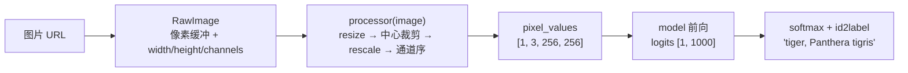

import { Canvas, Controls, Meta } from '@storybook/addon-docs/blocks';
import * as Processor from './processor.stories';

<Meta of={Processor} name="Docs" />

# processor 与多模态输入

tokenizer（[2.1.1](?path=/docs/tokenizer--docs)）只处理文本；图像、音频等非文本输入走的是另一条预处理层——processor。它读取模型仓库里的 `preprocessor_config.json`，把任意尺寸的图片变成固定形状的张量、把任意采样率的音频变成模型要的谱图，再交给 model 前向（[2.1.2](?path=/docs/model-inference--docs) 的同一套调用方式）。上一课的手工链路加上本课的 processor，就覆盖了 pipeline 封装的全部前置步骤；各视觉/音频任务的实战细节在 3.x，本课只讲机制并走通一条最小链路。

读完本页你应该能预测实例的行为：切换「示例图片」后，画布左侧换图、右侧 top-5 概率条与「top-1 预测」读数同步变化；打开「显示预处理输入」，左侧从原图切换成模型实际吃到的 256×256 输入——无论原图是 408×612 还是 256×256，预处理结果都是这个固定形状。



| 对象 / 调用 | 关键输入 | 返回与默认值 | 回查要点 |
| --- | --- | --- | --- |
| `AutoProcessor.from_pretrained(id)` | 模型 ID | `Processor`（捆绑 image_processor / feature_extractor / tokenizer 中模型需要的组件） | 预处理参数全部来自仓库 `preprocessor_config.json` |
| `processor(image)` | `RawImage` 或其数组 | `{ pixel_values, original_sizes, reshaped_input_sizes }` | `pixel_values` 形状 `[batch, 3, H, W]`；`original_sizes` 是 `[height, width]` |
| ImageProcessor 默认值 | — | `do_rescale: true`、`rescale_factor: 1/255`、`do_convert_rgb: true`、`resample: 2`（bilinear） | `do_resize` 默认跟随 `size` 是否配置；normalize / center_crop / pad / 通道序未配置即关闭 |
| `RawImage` 实例 | — | `data`（Uint8ClampedArray）、`width`、`height`、`channels`（1–4）、`size` = `[width, height]` | 浏览器里解码统一得到 4 通道 RGBA |
| `load_audio(url, rate)` | 音频 URL、目标采样率 | `Float32Array`（单声道 PCM） | `read_audio` 已标记废弃；Node 下不可用（无 AudioContext） |
| `RawAudio(data, rate)` | `Float32Array` + 采样率 | `.data`、`.toBlob()`（WAV）、`.save(path)` | TTS pipeline 的输出类型 |

## 快速上手

最小闭环是两次 `from_pretrained` 加四步调用（整个页面只做一次加载）：

```js
import { AutoProcessor, AutoModelForImageClassification, RawImage } from '@huggingface/transformers';

const MODEL_ID = 'Xenova/mobilevit-small';

// processor 与 model 分别加载；processor 只下载 preprocessor_config.json（本模型仅 403 B）
const processor = await AutoProcessor.from_pretrained(MODEL_ID);
const model = await AutoModelForImageClassification.from_pretrained(MODEL_ID);

// ① 读图：URL / Blob / canvas 都能进，统一变成 RawImage
const image = await RawImage.fromURL(
  'https://huggingface.co/datasets/Xenova/transformers.js-docs/resolve/main/tiger.jpg',
);

// ② 预处理：resize → 中心裁剪 → rescale → 通道序，参数全部来自 preprocessor_config.json
const { pixel_values } = await processor(image);
// pixel_values.dims → [1, 3, 256, 256]（batch × 通道 × 高 × 宽）

// ③ 前向：与 2.1.2 相同，模型实例可像函数一样调用
const { logits } = await model({ pixel_values });

// ④ 解读：1000 维 logits → softmax → 查 config.json 的 id2label（ImageNet 1000 类）
const probs = softmax([...logits.data]); // softmax 的数值稳定写法见 2.1.2 课
const top1 = probs.indexOf(Math.max(...probs));
// 'tiger, Panthera tigris'，约 72.8%
```

下面的内嵌实例执行的就是这条链路。**首次打开会下载约 7.5 MB（库本体约 1.1 MB + config 约 70 KB + q8 模型约 6.3 MB），需要数秒**，期间画布显示下载进度与用时；纯视觉模型不加载 tokenizer。实例为免安装依赖改用官方 CDN 版本加载库（模式与 [1.2 第一个 pipeline](?path=/docs/first-pipeline--docs) 相同），链路代码与本节一致。

<Canvas of={Processor.Interactive} />
<Controls of={Processor.Interactive} />

| 读者操作 | 可观察证据 |
| --- | --- |
| 等待首次加载 | 「状态」从 加载中 变为 就绪（附带加载用时），画布显示下载百分比 |
| 切换「示例图片」 | 左侧图片与右侧 top-5 概率条同步更新，「top-1 预测」变化；「预处理 / 前向」给出两步各耗时多少毫秒 |
| 打开「显示预处理输入」 | 左侧切换为 256×256 的模型输入；「蝴蝶」一张本就是 256×256 正方形，仍能看到先放大到最短边 288 再裁回 256 |
| 打开 Show code | 查看实例实际执行的 `image-classify-chain.ts` |

## AutoProcessor：非文本输入的预处理入口

三个 Auto 入口共用一套「读配置 → 实例化组件」的机制，区别只在打包哪些组件：

| 入口 | 适合 | 打包的组件 |
| --- | --- | --- |
| `AutoProcessor` | 多模态模型（Whisper、CLIP 等） | `image_processor` / `feature_extractor` / `tokenizer` 中仓库需要的组合 |
| `AutoImageProcessor` | 纯视觉模型 | 只有 `image_processor` |
| `AutoFeatureExtractor` | 纯音频模型 | 只有 `feature_extractor` |

v4 的加载行为（源码核实）：`AutoProcessor.from_pretrained` 先下载 `preprocessor_config.json`，按其中的 `image_processor_type` / `feature_extractor_type` 字段实例化组件；纯视觉仓库（本课模型）得到只含图像处理器的 `Processor`，调用行为与 `AutoImageProcessor` 完全一致。调用这个 `Processor` 时按 image_processor → feature_extractor → tokenizer 的顺序委托给第一个存在的组件——所以纯视觉模型 `processor(image)` 等价于 `processor.image_processor(image)`（实例已核对两者输出一致）。多模态生成模型（CLIP、VLM）的 processor 还转发 `decode` / `apply_chat_template` 给打包的 tokenizer，属于 3.4 课的内容。

### preprocessor_config.json：预处理参数的唯一来源

`from_pretrained` 下载的就是这个文件（本模型全部内容，403 B）：

```json
{
  "do_resize": true,
  "size": { "shortest_edge": 288 },
  "do_center_crop": true,
  "crop_size": { "height": 256, "width": 256 },
  "do_rescale": true,
  "rescale_factor": 0.00392156862745098,
  "do_flip_channel_order": true,
  "resample": 2,
  "image_processor_type": "MobileViTFeatureExtractor"
}
```

图像处理器的 `preprocess` 按固定顺序执行（源码顺序），每步开关与参数都来自这份配置：

1. 裁边（`do_crop_margin`，OCR 类模型去除灰边）。
2. 通道转换（`do_convert_rgb` 默认 `true`，把浏览器解码出的 RGBA 转成 RGB；`do_convert_grayscale` 走灰度）。
3. resize（`do_resize`；`size` 支持 `shortest_edge` / `longest_edge` 保纵横比，或固定 `width` / `height`）。
4. thumbnail（`do_thumbnail`，Donut 文档模型用）。
5. 中心裁剪（`do_center_crop` → `crop_size`）。
6. rescale（`do_rescale` × `rescale_factor`，默认 1/255，像素从 0–255 压到 0–1）。
7. 归一化（`do_normalize`：(x − `image_mean`) / `image_std`）。
8. pad（`do_pad`，补齐到 `pad_size` 或 `size_divisibility` 的倍数）。
9. 通道序翻转（`do_flip_channel_order`，RGB → BGR）。

最后把 HWC 的像素数据 permute 成 CHW、批量 stack 成 `pixel_values`。注意本模型的两个反直觉点：配置里**没有** `do_normalize` / `image_mean` / `image_std`——它不做均值方差归一化，只 ×1/255；且有 RGB→BGR 翻转。照搬「ImageNet 常识」的手写归一化（`[0.485, 0.456, 0.406]` 一类均值）在这里反而是错的。每个模型仓库一份配置，换模型结论就变——这是永远用配套 processor 的根本原因。

### pixel_values 与调用输出

`processor(image)` 的输出对象固定三个字段（张量均为 float32）：

```js
const { pixel_values, original_sizes, reshaped_input_sizes } = await processor(image);
pixel_values.dims;        // [1, 3, 256, 256] —— batch × 通道 × 高 × 宽（CHW）
original_sizes;           // [[408, 612]] —— 原图尺寸，[height, width] 顺序！
reshaped_input_sizes;     // [[256, 256]] —— 裁剪/补齐前的输入尺寸
```

- **`original_sizes` 是 `[height, width]` 元组**：tiger.jpg 是 612 宽 × 408 高，输出却是 `[408, 612]`——与 `RawImage.size`（`[width, height]`）顺序相反，检测/分割的后处理要用原图尺寸还原坐标时别搞反。
- **批量输入**传数组：`processor([imgA, imgB])` 输出 `pixel_values.dims` 为 `[2, 3, 256, 256]`，各图独立 resize/裁剪后 stack。
- **整个输出对象可以直接传给 model**：ONNX 会话只取计算图声明需要的输入（`pixel_values`），`original_sizes` 等多余键被忽略——与 tokenizer 课「多余输入键会被忽略」同一条规则。不过 pipeline 源码只传 `{ pixel_values }`，两种写法都安全。

在实例中核对：「pixel_values」读数恒为 `[1, 3, 256, 256]`；「尺寸变化」行展示原图（高×宽）到输入的转换；无论选哪张图、原图多大，模型输入形状不变。

## RawImage：图像的统一载体

模型不认识 ``、URL 或 canvas——一切图像先解码成 `RawImage`：一个原始像素缓冲（`data`，Uint8ClampedArray）加 `width` / `height` / `channels`（1–4）三个元数据。它是 processor 的输入类型，也是 pipeline 接受的图像输入在内部被转换的目标。

创建入口（静态方法）：

| 入口 | 接受 | 备注 |
| --- | --- | --- |
| `RawImage.read(input)` / `load_image` | RawImage、URL、Blob、canvas | `load_image` 是 `read` 的等价别名；pipeline 的图像参数内部就走它 |
| `RawImage.fromURL(url)` | URL | fetch 后解码；目标服务器需允许跨域 |
| `RawImage.fromBlob(blob)` | Blob | 文件选择、拖放上传场景 |
| `RawImage.fromCanvas(canvas)` | HTMLCanvasElement / OffscreenCanvas | 把页面画布读回像素（4 通道） |
| `RawImage.fromTensor(tensor, format)` | uint8 Tensor（默认 CHW） | 分割、抠图等输出转回图像 |

与 canvas / 文件的互转（实例方法）：`RawImage.read(canvas)` 把涂鸦、截图变成输入；`image.toCanvas()` 转回画布，可直接 `drawImage` 或插入页面；`image.toBlob(type)` 导出 PNG/JPEG；`image.save(path)` 在浏览器里触发下载（Web Worker 中不可用）。`data` 本身就是 `ImageData.data` 同款的 Uint8ClampedArray 像素缓冲，`fromCanvas` / `toCanvas` 内部正是靠 `getImageData` / `putImageData` 搬运——需要与页面已有的 `ImageData` 互转时直接用它构造即可。

常用实例方法：

| 方法 | 用途 | 边界 |
| --- | --- | --- |
| `resize(w, h, { resample })` | 缩放；`null` / `-1` 保纵横比 | 浏览器走 canvas 缩放，`resample` 参数被忽略（v4.3.0 源码标注 TODO）；Node 用 sharp 真实重采样 |
| `center_crop(w, h)` / `crop([x0, y0, x1, y1])` | 中心裁剪 / 区域裁剪 | 裁剪框自动收敛到图像内 |
| `grayscale()` / `rgb()` / `rgba()` | 通道转换 | 浏览器解码默认 4 通道，processor 的 `do_convert_rgb` 内部就调 `rgb()` |
| `toTensor('CHW' \| 'HWC')` | 转 uint8 张量 | 图像 → 张量的最底层路径 |
| `save(path)` | 导出文件 | 浏览器触发下载；Node 写入文件系统 |

processor 不是黑盒：`preprocess` 的每一步（`rgb()`、`resize()`、`center_crop()`）调用的都是这些公开方法。实例的「显示预处理输入」就是用同样的公开方法复刻了 resize + 中心裁剪，让你亲眼看到模型看到的图。

## RawAudio 与 load_audio：音频路径

音频与图像在形态上有两点不同：输入侧不是类封装，而是 `Float32Array`（PCM 采样值）加采样率；输出侧才有 `RawAudio` 包装。读取用 `load_audio`：

```js
import { AutoProcessor, load_audio } from '@huggingface/transformers';

// Whisper 的 processor 同时打包 tokenizer 与音频特征提取器（AutoProcessor 的多模态打包）
const processor = await AutoProcessor.from_pretrained('onnx-community/whisper-tiny.en');

// URL → 解码 + 重采样为 16 kHz 单声道 Float32Array；16000 是 Whisper 要求的采样率
const audio = await load_audio(
  'https://huggingface.co/datasets/Narsil/asr_dummy/resolve/main/mlk.flac',
  16000,
);

// processor(audio) 委托给 feature_extractor：波形 → log-mel 谱
const { input_features } = await processor(audio);
// input_features.dims → [1, 80, 3000]
```

要点（均为 v4.3.0 源码核实）：

- `load_audio(url, sampling_rate)` 在浏览器里用 AudioContext 解码并重采样；立体声先按 FFmpeg 同款 1/√2 比例衰减再混成单声道（防止满幅信号相加削波）。`sampling_rate` 传模型要求的值；不传则用环境默认采样率并打警告，谱图会失真。
- `read_audio` 是旧名，v4.3.0 已标记 `@deprecated`，行为与 `load_audio` 完全相同——官方新示例都用后者，旧代码里见到直接换名即可。
- Node 下没有 AudioContext，`load_audio` 会抛错并提示把音频数据直接传给 processor/pipeline（官方另有 node-audio-processing 指南）。
- Whisper 这类模型的 `processor(audio)` 输出 `input_features`（log-mel 谱，`[1, 80, 3000]`）——形状由 feature extractor 的配置决定，机制与图像的 `pixel_values` 同构。

输出侧的 `RawAudio` 把波形和采样率绑在一起（TTS pipeline 的返回值就是它）：

```js
import { RawAudio } from '@huggingface/transformers';

const audio = new RawAudio(samples, 16000); // samples: Float32Array，1 秒 16 kHz
audio.sampling_rate;   // 16000
audio.data;            // Float32Array；传入多段数组时自动拼接
const blob = audio.toBlob();  // WAV Blob，可交给 <audio> 播放或上传
await audio.save('out.wav');  // 浏览器里触发文件下载
```

音频的数据进出就这些：`load_audio` 进、`RawAudio` 出。语音识别与语音合成的完整任务实战在 3.3，本课不展开。

## 与 pipeline 的对应关系

`image-classification` pipeline 内部执行的就是本课这条链（v4 源码中的顺序）：

| pipeline 内部 | 本课对应 | 说明 |
| --- | --- | --- |
| `prepareImages(images)`（逐个 `RawImage.read`） | ① 读图 | URL / Blob / canvas 统一转 RawImage |
| `this.processor(preparedImages)` | ② 预处理 | 同一个 processor 调用 |
| `this.model({ pixel_values })` | ③ 前向 | 同一个模型调用 |
| `softmax` + `topk(top_k 默认 5)` + `id2label` | ④ 解读 | 默认返回前 5 条；`top_k: null` 返回全部 1000 类 |

所以 pipeline 返回的 `score` 就是手工 softmax 后的概率，默认给 5 条是 `top_k` 的默认值——与 2.1.2 文本链完全同构：tokenizer ↔ processor 各自承担文本/非文本的前置，model 前向一致，解读都在 JS 侧。什么时候值得绕过 pipeline：需要 `pixel_values` 或中间量（图像特征、注意力）、批量自定义解读、或输入本来就是 canvas / Tensor 而不想走 URL。

## 最佳实践

- **永远用配套 processor，不要手工复刻预处理。** 均值、方差、通道序、尺寸逐模型不同（本课模型就是「无归一化 + BGR」的反例）；配置只存在于仓库的 `preprocessor_config.json`，processor 是它唯一的忠实执行者。
- **processor 与 model 实例只加载一次，反复调用。** 换图只触发预处理 + 前向（本课示例即如此）；重建实例不会更快，反而丢掉已就绪的会话。
- **单模态模型用更精确的 Auto 类。** 纯视觉用 `AutoImageProcessor`、纯音频用 `AutoFeatureExtractor`；`AutoProcessor` 面向多模态打包，对纯视觉模型也能用，但加载纯文本模型会直接报「No `image_processor_type` or `feature_extractor_type` found」。

## 常见问题

- `processor(image)` 报 `No image_processor_type or feature_extractor_type found in the config.`
  模型仓库不是视觉/音频模型——纯文本仓库没有 `preprocessor_config.json`。文本输入请用 `AutoTokenizer`（[2.1.1](?path=/docs/tokenizer--docs)）。
- 换了模型后分类结果可疑，或分数和文档示例对不上
  多半是把别的模型的手写预处理搬了过来（均值/方差/通道序/尺寸逐模型不同）。删掉手写步骤，换成与新模型配套的 `AutoProcessor`；要确认它做了什么，读仓库的 `preprocessor_config.json` 或在控制台打印 `processor.image_processor`。
- 用 `original_sizes` 还原检测框时位置全歪
  `original_sizes` / `reshaped_input_sizes` 是 `[height, width]` 元组，与 `RawImage.size` 的 `[width, height]` 顺序相反。画边界框前先核对取的是哪一组。
- Node 里调用 `load_audio` 抛 AudioContext 错误
  该函数只能用于浏览器 / Web Worker。Node 直接把 `Float32Array` 音频数据传给 processor/pipeline，或参考官方 node-audio-processing 指南自行解码。
- `RawImage.fromURL` 拉图失败或跨域报错
  它内部走 fetch，目标服务器必须允许跨域（CORS）。Hugging Face 数据集图片（含本课三个 URL）返回 `Access-Control-Allow-Origin: *`；受限环境先下载图片再用 `fromBlob`。

## 总结回顾

摘要：

processor 是 tokenizer 的非文本对应层：`AutoProcessor.from_pretrained` 读取仓库的 `preprocessor_config.json`（本课模型仅 403 B），按其中开关把图像走完「通道转换 → resize → 中心裁剪 → rescale → 归一化 → 通道序翻转」的固定顺序，输出 `[batch, 3, H, W]` 的 `pixel_values` 与尺寸记录，交给 model 前向；本课的 MobileViT 配置没有均值方差归一化、还要 RGB→BGR 翻转，说明参数只能逐模型查配置、不能凭常识手写。`RawImage` 是图像的统一载体：`read` / `fromURL` / `fromBlob` / `fromCanvas` / `fromTensor` 五个入口进，`toCanvas` / `toBlob` / `save` 出，processor 内部调用的正是它的公开方法。音频路径输入用 `load_audio`（浏览器解码重采样为单声道 `Float32Array`，`read_audio` 已废弃），输出用 `RawAudio`（WAV 导出）。`image-classification` pipeline 内部就是「RawImage.read → processor → model → softmax + topk（默认 5）」，`score` 与手工 softmax 数值一致。

一句话：

> 图像和音频进模型前都要变成配置定死的形状——这份配置是仓库里的 preprocessor_config.json，processor 负责执行，RawImage 与 load_audio 负责把原始数据送到它手上。

知识要点：

- processor 与 tokenizer 怎么分工？`AutoProcessor` / `AutoImageProcessor` / `AutoFeatureExtractor` 各适合什么模型？
- `processor(image)` 返回哪三个字段？`pixel_values` 的形状各维是什么？`original_sizes` 的宽高顺序是什么？
- `preprocessor_config.json` 决定哪些步骤？本课模型配置里哪两项最容易按「常识」写错？
- `RawImage` 有哪些创建入口？怎样与 canvas 互转？浏览器里解码出的 `channels` 是多少？
- `load_audio` 输出什么形态？`read_audio` 与它什么关系？Node 下如何处理音频输入？
- `image-classification` pipeline 内部与本课手工链路如何对应？`top_k` 默认值是多少？

## 参考资料

- [Transformers.js 官方文档 · processors API](https://huggingface.co/docs/transformers.js/en/api/processors)
  `AutoProcessor` / `AutoImageProcessor` / `AutoFeatureExtractor` 入口与 `Processor` 的组件属性。
- [Transformers.js 官方文档 · utils/image API](https://huggingface.co/docs/transformers.js/en/api/utils/image)
  `RawImage` 的静态入口、实例方法与 `load_image` 别名。
- [Transformers.js 官方文档 · utils/audio API](https://huggingface.co/docs/transformers.js/en/api/utils/audio)
  `load_audio` / `read_audio` 与 `RawAudio` 的成员定义。
- [Transformers.js 官方文档 · pipelines API](https://huggingface.co/docs/transformers.js/en/api/pipelines)
  `image-classification` 的 `top_k` 默认值与输出结构。
- [processing_utils.js 源码（main，v4.3.0）](https://github.com/huggingface/transformers.js/blob/main/packages/transformers/src/processing_utils.js)
  `Processor` 组件模型、三入口委托顺序与「音频路径」一节 Whisper 示例的出处。
- [image_processors_utils.js 源码（main，v4.3.0）](https://github.com/huggingface/transformers.js/blob/main/packages/transformers/src/image_processors_utils.js)
  ImageProcessor 默认值、`preprocess` 执行顺序与 `original_sizes` 的 `[height, width]` 定义。
- [utils/image.js 源码（main，v4.3.0）](https://github.com/huggingface/transformers.js/blob/main/packages/transformers/src/utils/image.js)
  `RawImage` 全部成员；浏览器 canvas 实现与 Node sharp 实现的差异（含 `resample` 被忽略的标注）。
- [utils/audio.js 源码（main，v4.3.0）](https://github.com/huggingface/transformers.js/blob/main/packages/transformers/src/utils/audio.js)
  `load_audio` 的混音/重采样实现、`read_audio` 废弃标记与 `RawAudio` 的 WAV 编码。
- [image-classification pipeline 源码（main，v4.3.0）](https://github.com/huggingface/transformers.js/blob/main/packages/transformers/src/pipelines/image-classification.js)
  「与 pipeline 的对应关系」一节的依据：read → processor → model → softmax → topk。
- [Xenova/mobilevit-small](https://huggingface.co/Xenova/mobilevit-small)
  本课示例模型：`preprocessor_config.json`（403 B，无 `do_normalize`、`do_flip_channel_order: true`）、`config.json` 的 `id2label`（ImageNet 1000 类）、`onnx/model_quantized.onnx` 约 6.3 MB。
- [Xenova/transformers.js-docs 数据集](https://huggingface.co/datasets/Xenova/transformers.js-docs)
  本课示例图片的来源（官方文档示例所用图片，允许跨域访问）。
