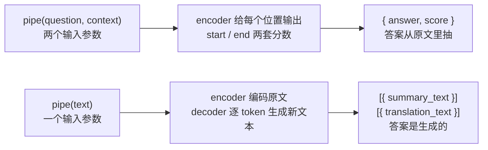

import { Canvas, Controls, Meta } from '@storybook/addon-docs/blocks';
import * as QaSummarization from './qa-summarization.stories';

<Meta of={QaSummarization} name="Docs" />

# 问答与摘要

文本任务还剩三种「向文本提问」的用法：抽取式问答从给定上下文里抽出答案片段，生成式摘要把长文压缩成短文，翻译把文本换成另一种语言。三条管线的调用形态差别不大——都是 `await pipe(输入)`——但**输入构造完全不同**：问答给两个参数（question 与 context），摘要与翻译只给一段文本，翻译还要把语言方向写进任务 ID。输入构造的差异直接决定输出形态：问答返回 `{ answer, score }` 单对象，摘要与翻译返回 `[{ summary_text }]` / `[{ translation_text }]` 数组，字段名各归各的任务（[1.3 任务全景](?path=/docs/task-overview--docs) 表中问答、摘要、翻译三行在本课展开）。

更本质的一条主线是**答案从哪来**：问答是抽取式——答案永远是 context 的子串，可溯源、忠实原文，但受上下文长度约束；摘要与翻译是生成式——答案由模型逐 token 写出，表达自由，但要防编造。读完本页你应该能预测两个实例的行为：切换「question」，画布高亮的原文片段与 answer、score 读数随之变化；把「top_k」切到 3，答案从单个对象变成按分数排序的三条候选；在摘要实例里调大 max_new_tokens，「摘要词数」的上限与生成用时随之增长。



| 管线 | 输入构造（单条） | 输出形态 | 默认模型（4.3.0） | q8 体积 |
| --- | --- | --- | --- | --- |
| `question-answering` | `pipe(question, context)` 两个参数 | `{ answer, score }` | `Xenova/distilbert-base-cased-distilled-squad` | 约 63 MB |
| `summarization` | `pipe(text)` 一段长文 | `[{ summary_text }]` | `Xenova/distilbart-cnn-6-6` | 约 271 MB |
| `translation`（可写 `translation_xx_to_yy`） | `pipe(text)` 一句话 | `[{ translation_text }]` | `Xenova/t5-small` | 约 75 MB |

## 快速上手

三个任务各一段最小代码，注意输入参数个数与输出字段的差异：

```js
import { pipeline } from '@huggingface/transformers';

// 抽取式问答：问题在前、上下文在后，两个独立参数
// （输出值取自官方文档示例；文档示例用 uncased 版本，v4.3.0 任务默认模型是 cased 版本）
const answerer = await pipeline(
  'question-answering',
  'Xenova/distilbert-base-uncased-distilled-squad',
);
const output = await answerer('Who was Jim Henson?', 'Jim Henson was a nice puppet.');
// { answer: 'a nice puppet', score: 0.5768911502526741 }
```

```js
// 生成式摘要：一段文本进、生成的摘要文本出；输出固定是数组
const summarizer = await pipeline('summarization', 'Xenova/t5-small');
const output = await summarizer(article, { max_new_tokens: 64 });
// [{ summary_text: '…生成的摘要…' }]
```

```js
// 翻译：语言方向写进任务 ID（两种写法的差异见下文）
const translator = await pipeline('translation_en_to_de', 'Xenova/t5-small');
const output = await translator('Hello, how are you?');
// [{ translation_text: '…德语译文…' }]
```

首次运行会下载所选模型的 q8 权重，下载与缓存行为见 [1.2 第一个 pipeline](?path=/docs/first-pipeline--docs)；摘要的 `max_new_tokens` 等生成参数的机制与默认值是 [2.2.1 生成参数](?path=/docs/generation-options--docs) 的主题，本课只讲各管线特有的部分。

## 抽取式问答：question-answering

这条管线用 `AutoModelForQuestionAnswering` 加载 SQuAD 式抽取模型：encoder 读入「问题 + 上下文」的拼接序列，给每个位置输出两套分数——作为答案**起点**的概率与作为**终点**的概率；管线再把候选限制在 context 一侧，把起点与终点的概率两两相乘，取乘积最大的连续片段作为答案。所以答案天然是 context 的子串，`score` 是这个片段「起点概率 × 终点概率」的乘积。

### 输入构造：question 与 context

推理调用固定两个参数，**顺序是问题在前、上下文在后**：

```js
const answerer = await pipeline('question-answering');

// 参数一：问题；参数二：供抽取的上下文
const output = await answerer('What does Transformers.js use to run models?', context);
```

两个参数都接受字符串；`question` 传字符串数组即为批量推理。两个边界值得记住：

- **参数传反不报错。** 管线内部把答案候选限制在编码序列的第二个参数一侧（`[CLS] 问题 [SEP] 上下文 [SEP]`，第一个 `[SEP]` 之前的位置被屏蔽），参数一被当作问题、参数二才是抽取来源——传反了只是从你的问题句子里抽答案，分数还可能不低。
- **`score` 的语义与分类任务不同。** 它是两个 softmax 概率的乘积，通常明显低于文本分类里 0.99 那种读数；判断答案可信度别套用分类的分数经验。

### 输出结构：answer 与 score

单条输入、`top_k` 默认 1 时，返回值是**单个对象**而不是数组（与摘要、翻译的数组形态不同）：

| 字段 | 有无 | 含义 |
| --- | --- | --- |
| `answer` | 有 | 从 context 抽出的答案片段——span 内 token 经 `tokenizer.decode` 拼回的**完整词形**，不是 3.1.2 课 none 模式那种 `##` 子词碎片 |
| `score` | 有 | 起点概率 × 终点概率（softmax 后相乘），0~1 |
| `start` / `end` | **无** | 官方类型定义把它们标成可选字段，但 v4.3.0 实现处写着 `TODO add start and end?`——实际输出只有 `answer` 与 `score`，官方文档示例输出同样只有这两个字段 |

**不要依赖 `start` / `end`**（v4.3.0 源码核实）：JS 端的偏移字段不能照搬 Python 文档，这与 3.1.2 课 token 分类的结论一致。好在抽取式问答的 `answer` 本身就是原文片段，`context.indexOf(answer)` 即可定位到原文区间——本课实例在原文上画高亮用的就是这个办法，比 token 分类按 `word` 游标查找可靠得多。

下面的内嵌实例执行的就是这套逻辑。**首次打开会下载约 63 MB 模型文件，需要数秒到数十秒**，期间画布显示下载进度；完成后进入浏览器缓存。实例为了免安装依赖，改用官方 CDN 版本加载库，推理代码与本节一致。

<Canvas of={QaSummarization.Interactive} />
<Controls of={QaSummarization.Interactive} />

| 读者操作 | 可观察证据 |
| --- | --- |
| 等待首次加载 | 「状态」从 加载中 变为 就绪，画布显示下载百分比与加载用时 |
| 切换「question」 | 原文高亮片段与「answer」「score」读数同步变化——三个问题的答案都是同一段短文里的连续片段 |
| 把「top_k」切到 3 | 答案从单条变成按分数降序的三条候选，画布逐条画出 score 条 |
| 打开 Show code | 查看实例实际执行的 `qa-pipeline.ts` |

### top_k：多候选与返回结构

`top_k` 是 QA 管线推理选项里的**唯一**参数（v4.3.0 源码核实）——Python transformers 的 `max_seq_len`、`doc_stride`、`max_answer_len` 一族都没有移植。三条规则：

- 默认 `top_k: 1`：单条输入返回单个对象；大于 1 时返回按 `score` 降序的**数组**。
- 候选来自全部合法 span：管线枚举每个起点与每个终点（start ≤ end）的概率乘积，全部排序后取前 k 个——没有 Python 版 `max_answer_len` 的答案长度上限，候选片段可以很长。
- 批量输入时返回数组：`top_k: 1` 时每个输入对应一条对象（扁平数组），`top_k > 1` 时每个输入对应一个候选数组（嵌套数组）。

在实例中把「top_k」切到 3 核对：第一名通常就是默认单条时的答案，后两名是与它重叠或相邻的片段——span 打分对候选**不去重**，重叠片段会同时上榜，消费多候选时要自己按需过滤。

### 长 context：整段截断，没有滑窗

context 的长度上限由 tokenizer 决定。管线内部固定以 `padding: true, truncation: true` 编码（与文本分类、token 分类同款），`max_length` 缺省取 tokenizer 配置的 `model_max_length`——本课默认模型是 512。超出部分**从序列尾部整段丢弃**：编码顺序是 `[CLS] 问题 [SEP] 上下文 [SEP]`，先被裁掉的是 context 的后半部分；问题本身超长时连问题也会被裁。三个推论：

- **v4.3.0 没有 `doc_stride`。** Python transformers 用 `doc_stride` 滑窗把长文切成多个窗口分别抽取再合并；JS 端没有这个机制，参数不存在。长文后半部分的问题会「答非所问」或拿到低分，应对办法见最佳实践（先分段再逐块问答）。
- **截断是静默的。** 传 2000 token 的 context 与传 400 token 的调用形式完全一样，不报错也不警告，超出部分直接消失。
- **摘要与翻译同样如此。** 这两个管线也固定 `truncation: true`，t5-small 的 `model_max_length` 同样是 512——长文进摘要管线也是先掉尾。

## 生成式摘要：summarization

摘要管线把「抽取」换成「生成」：输入只有一段文本，encoder 编码一次，decoder 逐 token 写出摘要，输出恒为数组 `[{ summary_text }]`——单条输入也包一层数组，与 QA 的单对象形态不同。生成质量由模型与生成参数共同决定；生成参数的机制与默认值见 [2.2.1 生成参数](?path=/docs/generation-options--docs)，本课只讲摘要特有的两个事实：管线的默认生成长度与任务前缀。

### 输入构造与生成长度

```js
const summarizer = await pipeline('summarization', 'Xenova/t5-small');

const output = await summarizer(article, { max_new_tokens: 64 });
// [{ summary_text: '…' }]
```

- **默认生成长度是 256 个新 token**：摘要与翻译所在的 Seq2Seq 管线在 pipeline 调用下默认补 `max_new_tokens: 256`（v4.3.0 源码核实，与 text-generation 管线的默认一致）。撞上结束符会提前停止，256 只是上限不是目标长度——摘要输出多长由模型自己决定，`min_new_tokens` 可以兜底压住提前结束（机制见 2.2.1 课）。
- **输入超 512 token 尾部丢弃**（上一节结论同样适用于这里），长文先切分再进管线。
- **批量**：文本传字符串数组，输出为对应的多条 `[{ summary_text }]`。

下面的内嵌实例可以直接操作这两个输入。**首次打开需下载 t5-small（q8 约 75 MB）**；画布滚入视口后才开始加载，避免与上方问答实例同时下载两个模型。

<Canvas of={QaSummarization.Summarization} />
<Controls of={QaSummarization.Summarization} />

| 读者操作 | 可观察证据 |
| --- | --- |
| 等待首次加载（滚入视口后开始） | 「状态」从 加载中 变为 就绪，画布显示下载进度 |
| 切换「示例文章」 | 「summary_text」读数与画布摘要同步更新 |
| 把「max_new_tokens」拖大 | 「摘要词数」读数的上限与生成用时随之增长（近似线性，机制见 2.2.1 课） |
| 打开 Show code | 查看实例实际执行的 `summarization-pipeline.ts`——调用代码里没有 `summarize:` 字样，前缀是管线加的 |

### 任务前缀：summarize: 从哪里来

t5-small 拿到一篇原文就会给出摘要，不是因为 t5 「认识」摘要这个动作，而是管线在调用前把输入改写成了 `summarize: <原文>`。改写来自**模型 config 的 `task_specific_params`**（v4.3.0 源码核实）：

```js
// text2text-generation.js（v4.3.0 源码节选）：管线构造输入时应用模型自带的前缀
const task_specific_params = this.model.config.task_specific_params;
if (task_specific_params && task_specific_params[this.task]) {
  if (task_specific_params[this.task].prefix) {
    texts = texts.map((x) => task_specific_params[this.task].prefix + x);
  }
}
```

三条规则：

- **匹配键是管线实例上的任务名**（`this.task`）：`pipeline('summarization', …)` 时是 `'summarization'`，恰好命中 t5-small config 里 `task_specific_params.summarization.prefix`（值为 `'summarize: '`）→ 前缀生效。下一节会看到，写成 `translation_en_to_de` 同样命中，写 `translation` 反而不命中。
- **只有 prefix 生效。** `task_specific_params` 里其余生成参数（`num_beams: 4`、`min_length: 30` 等）被忽略，源码处是 `TODO update generation config`——Python 端这些参数会生效，照抄 Python 的行为预期会踩坑。
- **没有任务前缀的模型拿到的就是原文本身。** 如任务默认的 distilbart 系，摘要能力在训练时定向于 CNN/DM 新闻数据，不需要文字提示。

### 模型选择

摘要模型是 Seq2Seq 架构，encoder 与 decoder 各一份权重，体积是两者之和。可核实的三档：

| 模型 | q8 体积（encoder + decoder） | 说明 |
| --- | --- | --- |
| `Xenova/distilbart-cnn-6-6`（任务默认） | 约 271 MB（122.9 + 147.9） | CNN/DM 新闻摘要专用，质量最好；浏览器示例下载偏重 |
| `Xenova/t5-small`（本课示例） | 约 75 MB（34.0 + 40.5） | 多用途：同模型也能翻译；config 自带 `summarize:` 前缀 |
| `Xenova/LaMini-Flan-T5-77M` | 约 91 MB（34.1 + 56.6） | 指令微调小模型，config 同样自带 `summarize:` 前缀 |

任务默认模型不是浏览器友好档：distilbart q8 约 271 MB，接近 1.2 课情感模型的四倍。轻量场景用 t5-small 或 LaMini 级别的小模型起步，质量不满足再上 distilbart 或更大的摘要模型。找更多候选照旧走[兼容模型目录](https://huggingface.co/models?library=transformers.js)，按 summarization 任务过滤。

## 翻译：translation

翻译管线与摘要共用同一套 Seq2Seq 实现（同一父类，只差输出字段名 `translation_text`），输入构造的特别之处只有一个：**语言方向的表达方式**。

```js
// 方式一：语言方向写进任务 ID——t5 系模型的 task_specific_params 前缀靠它命中
const translator = await pipeline('translation_en_to_de', 'Xenova/t5-small');
const output = await translator('Hello, how are you?');
// [{ translation_text: '…' }]

// 方式二：多语模型（M2M100 / NLLB / mBART）任务名固定 translation，语言用选项给
// （示例取自 v4.3.0 源码注释；m2m100_418M 体积很大，仅示意写法）
const m2m = await pipeline('translation', 'Xenova/m2m100_418M');
await m2m('生活就像一盒巧克力。', { src_lang: 'zh', tgt_lang: 'en' });
// [{ translation_text: 'Life is like a box of chocolate.' }]
```

三个边界（v4.3.0 源码核实）：

- **任务 ID 里的语言对不选模型、也不约束方向。** `translation_en_to_zh` 只是被 `split('_', 1)` 切成 `translation` 去查任务表，默认模型仍是 t5-small——而 t5-small 只训练过 en→de / en→fr / en→ro，想英译中要自己换模型（M2M100、NLLB，或方向固定在模型里的 Marian 系 `opus-mt-en-zh`）。
- **两种形式不可混用。** `src_lang` / `tgt_lang` 只在任务名恰为 `'translation'` 时被处理（源码条件 `this.task === 'translation'`）；t5 系的前缀只在 `translation_xx_to_yy` 形式下命中 config。写错形式不会报错，只会得到不着边际的输出。
- 输出 `[{ translation_text }]`、默认 `max_new_tokens: 256`、512 截断——与摘要完全一致。

## 最佳实践

- **按「答案在不在原文里」选任务。** 答案能在给定文本里找到（文档问答、客服知识库）选 `question-answering`：答案可溯源、忠实原文，score 给出可信度参考。要压缩、改写、跨语言则选摘要或翻译：生成自由但可能编造——生成文本与原文不符时没有 score 提醒，核对责任从模型转移到调用方。
- **长文先分段再问答。** v4.3.0 的 QA 没有 `doc_stride` 滑窗，超过 512 token 的尾部直接丢弃。把长文档按段落或语义切块，逐块问答后合并结果；想「只问相关段落」，先用 [3.1.4 embedding](?path=/docs/embeddings--docs) 做向量检索缩小范围，再把命中的段落交给 QA。
- **浏览器端先看默认模型体积。** 摘要默认模型 q8 约 271 MB，浏览器示例不友好；t5-small（约 75 MB）、LaMini-Flan-T5-77M（约 91 MB）这类小 Seq2Seq 是更好的起点。生产代码显式写全模型 ID 并固定 `revision`（与 1.2 课建议一致）。

## 常见问题

- 输出里没有 `start` / `end`，没法把答案高亮回原文
  v4.3.0 确实不返回（类型定义标了可选字段，实现处是 TODO）。抽取式问答的 `answer` 本身就是原文片段，直接 `context.indexOf(answer)` 定位——本课实例就是这么做的；标点或空格差异导致找不到时优雅降级为不高亮即可。需要字符级精确偏移时得自建对齐或用 Python 侧预处理。
- 问题在 context 里根本没有答案，管线仍返回一段话
  正常行为：管线把答案起点候选里的 `[CLS]`（Python SQuAD 2 模型用它表示「无答案」）屏蔽掉了，所以永远会选出一个片段。判断依据只剩 `score`——它是起点与终点两个概率的乘积，偏低（比如低于 0.1）就不要采信，先补全 context 而不是调阈值。
- t5-small 用 `pipeline('translation')` 直接调用，输出不是翻译
  t5 系模型靠输入前缀区分任务，前缀来自 config 的 `task_specific_params`，而它的键是 `translation_en_to_de` 这样的完整任务 ID 形式——`this.task` 为 `'translation'` 时不命中、不加前缀，模型就会自由发挥。改用 `pipeline('translation_en_to_de', 'Xenova/t5-small')` 或手动在输入前拼 `translate English to German: `。
- 摘要只有一句话甚至空串
  先检查 `max_new_tokens` 是否给得太小（不加时管线默认 256，实例里可调）；输出过短通常是模型很快生成结束符，给 `min_new_tokens` 兜底压住提前结束（机制见 [2.2.1 生成参数](?path=/docs/generation-options--docs)）；仍不理想属模型能力上限，换 distilbart 或更大的摘要模型。

## 总结回顾

摘要：

本课覆盖文本任务的三种「问文本」管线，主线是输入构造决定答案来源。`question-answering` 给 question 与 context 两个参数（顺序固定，问题在前），encoder 给每个位置输出起点 / 终点两套分数、管线把候选限制在 context 一侧，答案取概率乘积最大的原文片段，输出单对象 `{ answer, score }`——`answer` 是 decode 拼回的完整词形，`score` 是两个概率的乘积而非分类置信度；v4.3.0 不返回 `start` / `end`（实现处 TODO），高亮原文用 `indexOf` 定位；推理选项只有 `top_k`（默认 1，大于 1 返回降序数组且重叠片段同时上榜），长 context 以 `model_max_length`（512）从尾部静默截断，没有 Python 的 `doc_stride` 滑窗。`summarization` 与 `translation` 共用 Seq2Seq 实现：一段文本进、逐 token 生成，输出恒为数组 `[{ summary_text }]` / `[{ translation_text }]`，管线默认补 `max_new_tokens: 256`、512 截断；t5-small 的摘要能力来自管线自动拼接的 `summarize: ` 前缀（config `task_specific_params`，只有 prefix 生效），翻译的语言方向要么写进任务 ID（`translation_en_to_de`，命中 t5 前缀），要么用多语模型的 `src_lang` / `tgt_lang` 选项（任务名必须恰为 `translation`）。默认摘要模型 distilbart q8 约 271 MB，轻量场景用 t5-small（约 75 MB）或 LaMini-Flan-T5-77M（约 91 MB）。

一句话：

> 问答的答案从原文里抽（可溯源、受 512 截断），摘要与翻译的答案由模型生成（表达自由、要防编造）——输入构造的差异决定你去哪里核对答案。

知识要点：

- 三条管线各自怎么传输入？输出形态与字段名分别是什么？
- QA 的输出有哪些字段？`score` 怎么算出来的？为什么不能依赖 `start` / `end`？
- `top_k` 怎样改变 QA 的返回结构？参数传反了会发生什么？
- 长 context 进 QA 管线会发生什么？v4.3.0 有没有 `doc_stride`？截断从哪一端丢？
- 摘要输入前自动拼接的 `summarize: ` 前缀从哪里来？`task_specific_params` 里还有什么不会被应用？
- `translation_en_to_zh` 这样的任务 ID 决定什么、不决定什么？多语翻译模型怎么给语言方向？
- 三个任务的默认模型分别是什么、多大？浏览器示例为什么换 t5-small？

## 参考资料

- [pipelines API](https://huggingface.co/docs/transformers.js/en/api/pipelines)
  `question-answering` / `summarization` / `translation` 三个管线的调用示例与选项说明（QA 示例输出值出自这里）。
- [v4.3.0 源码 · src/pipelines/question-answering.js](https://cdn.jsdelivr.net/npm/@huggingface/transformers@4.3.0/src/pipelines/question-answering.js)
  本课 QA 结论的第一手依据：`{ answer, score }` 输出与 `TODO add start and end?` 注释、唯一选项 `top_k`、起点 × 终点的 span 打分与 CLS 屏蔽。
- [v4.3.0 源码 · src/pipelines/text2text-generation.js](https://cdn.jsdelivr.net/npm/@huggingface/transformers@4.3.0/src/pipelines/text2text-generation.js)
  摘要与翻译的共同父类：默认 `max_new_tokens: 256`、`task_specific_params` 前缀机制（含 `TODO update generation config`）、`src_lang` / `tgt_lang` 仅在 `this.task === 'translation'` 时处理。
- [v4.3.0 源码 · src/pipelines/summarization.js 与 translation.js](https://cdn.jsdelivr.net/npm/@huggingface/transformers@4.3.0/src/pipelines/summarization.js)
  两个管线对父类的继承关系与 `summary_text` / `translation_text` 字段名；translation.js 的 JSDoc 含 M2M100 / NLLB 官方示例。
- [v4.3.0 源码 · src/pipelines/index.js](https://cdn.jsdelivr.net/npm/@huggingface/transformers@4.3.0/src/pipelines/index.js)
  三个任务的默认模型注册与 `task.split('_', 1)[0]` 的任务解析（`translation_xx_to_yy` 形式的由来）。
- [v4.3.0 源码 · src/tokenization_utils.js](https://cdn.jsdelivr.net/npm/@huggingface/transformers@4.3.0/src/tokenization_utils.js)
  `model_max_length` 缺省与 `truncateHelper` 的尾部截断实现（长 context 静默丢尾的出处）。
- [Python transformers · QuestionAnsweringPipeline](https://huggingface.co/docs/transformers/en/main_classes/pipelines)
  对照参考：`doc_stride` / `max_seq_len` / `max_answer_len` 滑窗参数与 `start` / `end` 偏移输出（transformers.js v4.3.0 未实现的部分）。
- [Xenova/distilbert-base-cased-distilled-squad](https://huggingface.co/Xenova/distilbert-base-cased-distilled-squad)
  QA 任务默认模型；`onnx/` 目录可核对 q8 体积（`model_quantized.onnx` 约 62.8 MB），tokenizer 上限 512。
- [Xenova/t5-small](https://huggingface.co/Xenova/t5-small)
  本课摘要示例与翻译默认模型；q8 合计约 75 MB，config 含 `task_specific_params.summarization.prefix = "summarize: "`。
- [Xenova/distilbart-cnn-6-6](https://huggingface.co/Xenova/distilbart-cnn-6-6)
  摘要任务默认模型；q8 合计约 271 MB（encoder 122.9 + decoder 147.9）。
- [Xenova/LaMini-Flan-T5-77M](https://huggingface.co/Xenova/LaMini-Flan-T5-77M)
  摘要轻量替代；q8 合计约 91 MB，config 同样自带 `summarize:` 前缀。
- [兼容模型目录 · library=transformers.js](https://huggingface.co/models?library=transformers.js)
  按任务与语言挑选替代模型（摘要、翻译方向）的入口。
