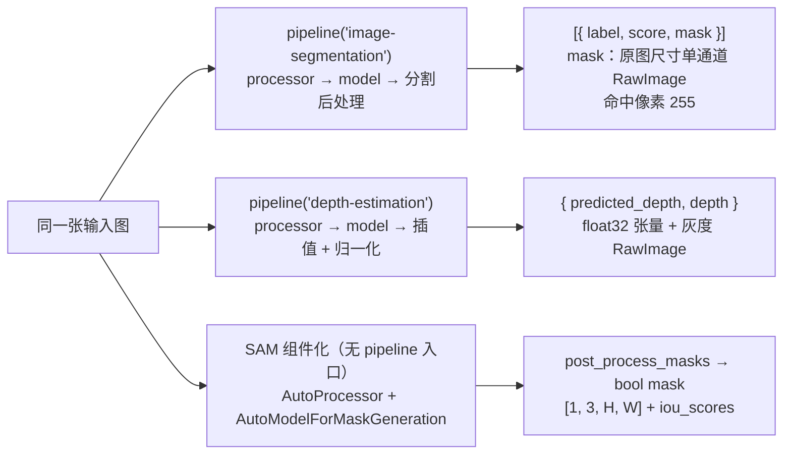

import { Canvas, Controls, Meta } from '@storybook/addon-docs/blocks';
import * as SegmentationDepth from './segmentation-depth.stories';

<Meta of={SegmentationDepth} name="Docs" />

# 分割与深度估计

上一课的输出停在「图」与「框」的粒度：整图一个标签、目标一个框。本课推进到**像素粒度**：`image-segmentation` 对图中出现的每个类别输出一张与原图同尺寸的 mask（语义分割一张图给一组 mask），`depth-estimation` 给整图输出深度图（预测每个像素离相机多远）。两条管线与 [3.2.1](?path=/docs/image-classification-detection--docs) 共用同一条调用形态，差别全在输出契约。SAM 提示分割则是第三种形态：它在 v4.3.0 没有 pipeline 入口（[1.3 任务全景](?path=/docs/task-overview--docs) 边界表），要用 `AutoProcessor` + `AutoModelForMaskGeneration` 组件化拼出来——组件化的通用机制在 [2.1.3 processor 与多模态输入](?path=/docs/processor--docs) 与 [2.1.2 model 前向推理](?path=/docs/model-inference--docs) 已建立，本课是它的任务实战实例。

读完本页你应该能预测三个实例的行为：分割实例里，切换「示例图片」左图右叠加同步更新，拖动「mask 不透明度」只改变叠加浓淡而不重新推理；深度实例右侧的灰度图近处亮、远处暗，「明暗反转」一键取反；SAM 实例就绪后点击左图中的目标，右图出现该点的半透明蓝色 mask，「iou_scores」读数给出三个候选的质量分数。



| 管线 / 入口 | 输出形态（单条输入） | 关键选项与默认值 | 本课示例模型（q8 体积） |
| --- | --- | --- | --- |
| `pipeline('image-segmentation')` | `[{ label, score, mask }]`，`mask` 是 `RawImage`；semantic 子任务 `score` 恒为 `null` | `subtask` 默认 `null`（自动判定，**不要显式传**）；`threshold` 默认 0.5（仅 panoptic/instance）；批量仅支持 1 张 | `Xenova/segformer-b0-finetuned-ade-512-512`（约 4.4 MB） |
| `pipeline('depth-estimation')` | `{ predicted_depth: Tensor, depth: RawImage }`，单条输入返回单对象 | 无调用选项（v4.3.0 源码） | `onnx-community/depth-anything-v2-small`（任务默认，约 27 MB） |
| `AutoProcessor` + `AutoModelForMaskGeneration`（SAM） | `iou_scores` + `pred_masks` → `post_process_masks` → `[1, 3, H, W]` bool mask | `input_points` 形状 `[batch, point_batch, num_points, 2]`；`mask_threshold` 默认 0 | `Xenova/slimsam-77-uniform`（约 13.8 MB，两个会话文件） |

## 快速上手

两个管线各一段最小代码，输出值取自官方文档示例：

```js
import { pipeline } from '@huggingface/transformers';

// 分割：官方示例用任务默认模型（panoptic 子任务，每段有 score）
const segmenter = await pipeline('image-segmentation', 'Xenova/detr-resnet-50-panoptic');
const output = await segmenter('https://huggingface.co/datasets/Xenova/transformers.js-docs/resolve/main/cats.jpg');
// [
//   { label: 'remote', score: 0.9984649419784546, mask: RawImage { … } },
//   { label: 'cat',    score: 0.9994316101074219, mask: RawImage { … } }
// ]
```

```js
// 深度：单条输入返回单对象，predicted_depth 是张量、depth 是灰度 RawImage
const depth_estimator = await pipeline('depth-estimation', 'onnx-community/depth-anything-v2-small');
const image = 'https://huggingface.co/datasets/Xenova/transformers.js-docs/resolve/main/cats.jpg';
const output = await depth_estimator(image);
// {
//   predicted_depth: Tensor { dims: [480, 640], type: 'float32', data: Float32Array(307200) […], size: 307200 },
//   depth: RawImage { data: Uint8Array(307200) […], width: 640, height: 480, channels: 1 },
// }
```

首次运行会下载所选模型的 q8 权重，下载与缓存行为见 [1.2 第一个 pipeline](?path=/docs/first-pipeline--docs)。下面的三个内嵌实例改用小体积组合（分割 4.4 MB + 深度 27 MB + SAM 13.8 MB，本页共享一次约 1.1 MB 的库本体）；后两个实例**滚入视口后才开始下载**，避免同页并发下载三个模型。

## image-segmentation：每个类别一张 mask

管线内部执行的还是 [2.1.3 课](?path=/docs/processor--docs)「与 pipeline 的对应关系」那条链（`prepareImages` → `processor` → `model`），差别只在上游模型输出的是逐像素 logits、下游换成分割后处理。拿到的每条记录是 `{ label, score, mask }`：`label` 来自模型 `config.json` 的 `id2label`，`score` 与 `mask` 的语义由 subtask 决定（见下）。下面的实例用 SegFormer-B0（ADE20K 150 类语义分割）演示完整闭环：管线自动判定为 semantic 子任务，输出的各类别 mask 按颜色合成后半透明叠回原图。

<Canvas of={SegmentationDepth.Interactive} />
<Controls of={SegmentationDepth.Interactive} />

| 读者操作 | 可观察证据 |
| --- | --- |
| 等待首次加载 | 「状态」从 加载中 变为 就绪（附带加载用时），画布显示下载百分比 |
| 切换「示例图片」 | 左侧原图与右侧彩色叠加同步更新，「输出条数」「覆盖最高类别」刷新 |
| 拖动「mask 不透明度」 | 叠加层变淡 / 变实；只影响渲染，不重新推理，「推理用时」不变 |
| 打开 Show code | 查看实例实际执行的 `segmentation-overlay.ts` |

### mask：与原图同尺寸的 RawImage

`mask` 是 [2.1.3 课](?path=/docs/processor--docs)讲过的 `RawImage`：`width` / `height` 与原图一致、`channels` 为 1，`data` 是长度等于 width × height 的 `Uint8ClampedArray`——命中该类别的像素为 255，其余为 0。读取与消费就是一层像素循环：

```js
const [{ label, mask }] = await segmenter(url);
for (let i = 0; i < mask.data.length; ++i) {
  if (mask.data[i] === 255) {
    // 像素 i 属于 label
  }
}
```

semantic 后处理把整图 logits 双线性插值回原图尺寸、再**逐像素取 argmax**：每个像素恰好命中一个类别，所以各类别 mask 互斥，按任意顺序叠加着色不会互相覆盖——实例的彩色合成正是利用这一点。`score` 恒为 `null`：argmax 之后只剩「归属」没有置信度，类别的重要程度要自己统计 mask 覆盖率（255 像素占比，实例读数「覆盖最高类别」就是这个值）。mask 与原图同尺寸，`toCanvas()` 后可以直接 `drawImage` 叠加；`RawImage` 的完整入口与 `size` 的 `[width, height]` 顺序见 [2.1.3 课](?path=/docs/processor--docs)。

### subtask：semantic、instance 与 panoptic

一个任务 ID 覆盖三种分割范式，共用同一输出壳、后处理函数不同（v4.3.0 源码中的 `SUBTASKS_MAPPING`）：

| subtask | 后处理 | 每条输出 | 典型模型 |
| --- | --- | --- | --- |
| `semantic` | logits 插值回原图 → 逐像素 argmax | `{ label, score: null, mask }`，各类别互斥 | SegFormer |
| `instance` | 按阈值筛出实例 mask | `{ label, score, mask }`，同类可多实例 | Mask2Former 系（见下：自动判定优先命中其 panoptic） |
| `panoptic` | 语义 + 实例统一分段 | `{ label, score, mask }`，含背景段 | DETR-panoptic（任务默认） |

省略 `subtask`（默认 `null`）时管线自动判定：按 image_processor 上带了哪个 `post_process_*` 方法，顺序 panoptic → instance → semantic（v4.3.0 源码）。本课的 SegFormer 自动走 semantic——它的 image processor 只包装了 `post_process_semantic_segmentation`；任务默认的 detr-panoptic 自动走全景分割。**不要显式传 `subtask`**：v4.3.0 在这条分支里只取了后处理函数的名字字符串就当函数调用，必然抛 `fn is not a function`（源码核实），选对模型仓库让自动判定命中即可。

其余选项都只作用于 panoptic / instance、semantic 忽略它们：`threshold`（默认 0.5，筛段的概率下限）、`mask_threshold`（默认 0.5，mask 二值化）、`overlap_mask_area_threshold`（默认 0.8，剔除小块）。与检测管线一样，分割只支持 batch size 1，数组超过一张直接抛错（v4.3.0 源码核实）。另一点与 [3.2.1](?path=/docs/image-classification-detection--docs) 检测课相反：**换分割模型 = 同时换标签集与子任务类型**——ADE20K 的 150 类是「场景解析」标签集（wall、sky、tree…），没有 cat / dog 这类动物细类，实例里动物区域的标签以实际渲染为准。

### 模型族：SegFormer 与 DETR

| 模型族 | 代表模型 | 子任务（自动判定） | 标签集 | q8 体积 |
| --- | --- | --- | --- | --- |
| SegFormer | `Xenova/segformer-b0-finetuned-ade-512-512`（本课示例） | semantic | ADE20K 150 类 | 约 4.4 MB |
| DETR | `Xenova/detr-resnet-50-panoptic`（任务默认） | panoptic | COCO 80 类 | 约 44.5 MB |
| MaskFormer / Mask2Former | Hub 按 `library=transformers.js` 过滤 | 同时包装 panoptic / instance 方法，自动判定命中 panoptic | 随仓库 | 逐仓库核对 |

选型主线是**体积换精度与范式**：浏览器示例从 44.5 MB 的任务默认换成 4.4 MB 的 SegFormer-B0，下载量降一个量级；语义、全景、实例三种范式决定输出里有没有 `score`、有没有背景段。找一个模型的实际体积，看它 `onnx/` 目录里 `model_quantized.onnx` 的文件大小。

## depth-estimation：单目深度图

单目深度估计给「每个像素离相机多远」一个相对排序。单条输入返回**单个对象**（不是数组），两个字段的来源（v4.3.0 源码）：

| 字段 | 类型 | 生成方式 | 用途 |
| --- | --- | --- | --- |
| `predicted_depth` | `Tensor`，float32，`dims` 为 `[height, width]` | 模型原始预测，双线性插值回原图尺寸 | 自定义映射（彩色化、伪 3D）时自己归一化 |
| `depth` | `RawImage`，单通道 uint8 | 同一预测做 min–max 归一化到 0–255 的灰度图 | 直接可视化：值大 → 亮 |

两个关键边界：

- **相对深度，没有米制尺度。** 输出是仿射不变的相对深度——只知道「谁比谁近」，不知道「近多少」。要绝对距离得用已知参照另行标定（或换米制深度模型）。
- **「近亮远暗」是模型的约定，不是管线的标准。** Depth Anything 沿 MiDaS 系的 inverse depth 约定输出「值 ≈ 1/距离」：近处值大、灰度亮。管线的 min–max 归一化只把数值拉满到 0–255，不规定方向——实例的「明暗反转」开关就是让读者亲手确认这只是个映射方向问题（要「远亮近暗」直接取 `255 - v`）。

调用侧没有选项可调（`_call` 只接受图像，v4.3.0 源码），模型就是全部变量：任务默认 `onnx-community/depth-anything-v2-small`，浏览器 wasm 环境默认下载 q8 约 27 MB，Node 等非 wasm 环境默认 fp32 约 99 MB——环境与 dtype 的取舍见 [2.3.1 device 与 dtype](?path=/docs/device-dtype--docs)；更大档位（base / large）体积递增，在 Hub 按 `library=transformers.js` 过滤核对。

<Canvas of={SegmentationDepth.DepthMap} />
<Controls of={SegmentationDepth.DepthMap} />

| 读者操作 | 可观察证据 |
| --- | --- |
| 等待首次加载（滚入视口后开始） | 「状态」从 加载中 变为 就绪（附带加载用时），画布显示下载百分比 |
| 切换「示例图片」 | 右侧灰度深度图与「predicted_depth」「depth」读数同步刷新 |
| 打开「明暗反转」 | 灰度整体取反（255 − v），只重绘不重新推理 |
| 打开 Show code | 查看实例实际执行的 `depth-map-render.ts` |

## SAM 提示分割：组件化运行

SAM（Segment Anything Model）回答的是另一个问题：不给类别清单，给一个**提示**（点或框），把「你指的这个目标」整个抠出来。`mask-generation` 任务在 v4.3.0 没有 pipeline 入口（[1.3 任务全景](?path=/docs/task-overview--docs) 边界表），但架构本身已导出为 ONNX，走 [2.1.2 课](?path=/docs/model-inference--docs) 的组件化通用路线——`AutoProcessor` + `AutoModelForMaskGeneration`，三步：

```js
import { AutoProcessor, AutoModelForMaskGeneration, RawImage } from '@huggingface/transformers';

const MODEL_ID = 'Xenova/slimsam-77-uniform';
const processor = await AutoProcessor.from_pretrained(MODEL_ID);
const model = await AutoModelForMaskGeneration.from_pretrained(MODEL_ID);
const image = await RawImage.fromURL(url);

// ① 提示编码：点用原图像素坐标，形状 [point_batch, num_points, 2]；
//    processor 内部缩放到模型输入坐标系（resize 到 1024 再 pad）
const inputs = await processor(image, { input_points: [[[450, 600]]] });

// ② 前向：每个提示给 3 个候选 mask，各带一个 iou 质量估计
const outputs = await model(inputs);
// iou_scores.dims → [1, 1, 3]（float32）；pred_masks.dims → [1, 1, 3, 256, 256]

// ③ 还原：上采样回原图并二值化（mask_threshold 默认 0）→ bool 张量 [1, 3, H, W]
const masks = await processor.post_process_masks(
  outputs.pred_masks,
  inputs.original_sizes,      // [height, width] 元组，坑见 2.1.3 课
  inputs.reshaped_input_sizes,
);
```

三个要点：

- **3 个候选按 iou 选。** SAM 对同一提示输出 3 个候选 mask（整目标 / 部分 / 细分，具体怎么分随点击位置变化），`iou_scores` 是模型对每个候选的质量估计——官方示例（`sam-vit-base`，car.png）拿到 0.889 / 0.931 / 0.983 三个分数。消费时取 argmax（实例如此）；更高质量的提示是框（`input_boxes`，源码注释「效果显著更好」）。
- **图像嵌入可以缓存。** 模型分两段：vision_encoder 只依赖图片（`get_image_embeddings({ pixel_values })`），prompt_encoder_mask_decoder 才吃提示。换提示点不换图时复用嵌入，后续每次点击只跑后半段——交互从秒级降到毫秒级。SlimSAM 的 13.8 MB 就是这两个会话的 q8 文件（vision_encoder 8.9 MB + prompt_encoder_mask_decoder 4.9 MB），下载也是这两个文件。
- **换架构不换流程。** `AutoModelForMaskGeneration` 在 v4.3.0 还映射 sam2、edgetam、sam3_tracker（注册表源码核实）：sam2 同样是「嵌入 + 提示解码」三步，输出多一个 `object_score_logits`、图像嵌入是多层级张量；SAM3 的完整提示分割模型尚未包含（只有 image processor 与 tracker 模型）。

下面的实例把三步接成交互：滚入视口后加载模型并预计算图像嵌入，点击左图中的目标即运行「提示编码 → 解码 → 还原」。

<Canvas of={SegmentationDepth.SamPrompt} />
<Controls of={SegmentationDepth.SamPrompt} />

| 读者操作 | 可观察证据 |
| --- | --- |
| 等待首次加载（滚入视口后开始） | 「状态」变为 就绪；就绪前会先读图并计算图像嵌入 |
| 在左图上点击目标 | 右图出现该目标的半透明蓝色 mask，「提示点」显示原图像素坐标，「选中候选」标出 iou 最高的序号 |
| 点击物体边缘或背景 | 「iou_scores」三个分数整体下降、mask 变差——分数低说明提示质量差 |
| 切换「示例图片」 | 重新读图并重算图像嵌入，已选的提示点清空 |
| 打开 Show code | 查看实例实际执行的 `sam-prompt-mask.ts` |

模型选择上，官方示例用 `Xenova/sam-vit-base`（q8 两个会话合计约 106 MB），浏览器演示换蒸馏版 SlimSAM-77（同架构同用法，约 13.8 MB）；mask 的消费（叠图、抠图、导出）与语义分割相同——它同样是 RawImage 同尺寸二值图，只是「类别」换成了「提示目标」。

## 最佳实践

- **按「输出粒度」选视觉任务。** 整图一个问题用分类、目标级用检测（[3.2.1](?path=/docs/image-classification-detection--docs)）；要像素归属用分割、要远近用深度、要「指定目标」用 SAM。mask 的消费成本最高（每条是 width × height 的像素缓冲，类别多时成倍增长），先确认真的需要像素级输出再上分割。
- **浏览器端换模型先核对三件事：体积、子任务、标签集。** 子任务决定 `score` 有无（semantic 恒 null），标签集决定输出里会出现什么（ADE20K 没有 cat / dog）——任务默认模型不一定适合浏览器（分割默认 44.5 MB，本课示例 4.4 MB）。体积看 `onnx/model_quantized.onnx` 的文件大小，dtype 与环境的默认行为见 [2.3.1](?path=/docs/device-dtype--docs)。
- **SAM 交互场景先算图像嵌入，再响应提示。** `prepare` 一次、点 N 次：把 `get_image_embeddings` 的结果缓存住，每次点击只跑 prompt_encoder_mask_decoder；每次点击都重跑完整前向会让交互延迟从毫秒级掉回秒级。

## 常见问题

- 给 `image-segmentation` 显式传 `subtask` 后报 `fn is not a function`
  v4.3.0 的缺陷（源码核实）：显式值分支只取了后处理函数的**名字字符串**就当函数调用。删掉 `subtask` 选项，选对模型仓库让管线自动判定——SegFormer 自动命中 semantic，DETR-panoptic 自动命中 panoptic。
- 想要「单个物体的 mask」而不是「每个类别一张」
  语义分割的 mask 按类别互斥，拆不出实例。抠任意指定目标用 SAM 点提示（本课组件化三步）；只抠主体、去背景用 `background-removal` 管线（[3.2.3 背景移除](?path=/docs/background-removal--docs)）。
- SAM 实例点击画布没反应
  按序核对三点：「状态」读数是否就绪（首次要下载 13.8 MB 并预计算图像嵌入）；点击是否落在左图图片区域内（图外点击被忽略）；上一次解码是否还在进行（实例在推理期间忽略新点击）。
- 深度图明暗方向和预期相反
  灰度是 min–max 归一化的相对深度，「近亮远暗」是 Depth Anything（MiDaS 系 inverse depth）的输出约定而非管线标准。要反向直接取 `255 - v`（实例的「明暗反转」开关）；要米制距离需另行标定，管线输出给不了。
- 分割 mask 边缘发糊、和物体轮廓对不齐
  semantic 后处理把模型输入分辨率（SegFormer-B0 为 512×512）上的 logits 双线性插值回原图尺寸，边缘精度受输入分辨率限制。要更锐利换更大输入分辨率的模型档位，或在下游做边缘平滑；这不是用法错误，是该管线的固有精度上界。

## 总结回顾

摘要：

本课把视觉任务的输出推进到像素粒度。`image-segmentation` 对每个出现的类别输出一条 `{ label, score, mask }`：mask 是与原图同尺寸的单通道 RawImage，命中像素 255；semantic 子任务经「logits 插值回原图 → 逐像素 argmax」产生互斥的各类别掩码，score 恒为 null，重要程度要自己按覆盖率统计。subtask 由 image_processor 自带的后处理方法自动判定（panoptic → instance → semantic 顺序），显式传参在 v4.3.0 有「函数名当函数调用」的缺陷；threshold 一族选项只作用于 panoptic / instance，批量仅支持 1 张。`depth-estimation` 返回 `{ predicted_depth, depth }`：插值回原图尺寸的 float32 张量与 min–max 归一化的灰度 RawImage，调用没有选项；输出是仿射不变的相对深度，没有米制尺度，「近亮远暗」是 Depth Anything（MiDaS 系）的输出约定。SAM 提示分割没有 pipeline 入口，用 `AutoProcessor` + `AutoModelForMaskGeneration` 三步组件化完成：点提示编码 → 前向拿 3 个候选与 iou_scores → `post_process_masks` 还原 `[1, 3, H, W]` bool mask；vision_encoder 的图像嵌入只依赖图片，缓存后点击交互只跑解码段。三个示例模型 q8 合计约 45 MB。

一句话：

> 分割回答「这个像素属于谁」，深度回答「这个像素有多远」，SAM 回答「你指的这个目标是谁」——像素级输出没有新调用形态，只有新的输出契约和一次组件化。

知识要点：

- `image-segmentation` 单条输出的结构是什么？semantic 子任务下 `score` 为什么恒为 `null`？类别重要程度怎么自己算？
- `mask.data` 怎么读？为什么各类别 mask 可以按颜色直接叠加而不互相覆盖？
- subtask 三种取值怎么自动判定？为什么 v4.3.0 不要显式传？`threshold` 作用于哪些子任务？
- `depth-estimation` 的两个字段各是什么、怎么来的？为什么说灰度图没有米制尺度、明暗方向由谁决定？
- SAM 组件化三步各做什么？`input_points` 的形状是什么？3 个候选按什么选？`get_image_embeddings` 缓存省掉的是什么？
- 本课示例模型各多大、换模型时标签集与子任务怎么变？

## 参考资料

- [Transformers.js 官方文档 · pipelines API](https://huggingface.co/docs/transformers.js/en/api/pipelines)
  `image-segmentation` / `depth-estimation` 的调用示例与官方输出值（快速上手两段代码的输出取自该页与管线源码 JSDoc）。
- [image-segmentation pipeline 源码（main，v4.3.0）](https://github.com/huggingface/transformers.js/blob/main/packages/transformers/src/pipelines/image-segmentation.js)
  subtask 自动判定顺序、semantic 输出 `score: null`、mask 的 255 填充、batch size 1 限制与显式 `subtask` 的缺陷。
- [depth-estimation pipeline 源码（main，v4.3.0）](https://github.com/huggingface/transformers.js/blob/main/packages/transformers/src/pipelines/depth-estimation.js)
  `predicted_depth` 插值与 `depth` 的 min–max 归一化实现，以及官方示例输出值（dims `[480, 640]` 等）。
- [image_processors_utils.js 源码（main，v4.3.0）](https://github.com/huggingface/transformers.js/blob/main/packages/transformers/src/image_processors_utils.js)
  `post_process_semantic_segmentation` 的插值与逐像素 argmax 实现。
- [sam/modeling_sam.js 源码（main，v4.3.0）](https://github.com/huggingface/transformers.js/blob/main/packages/transformers/src/models/sam/modeling_sam.js)
  SAM 官方示例（含 `iou_scores` 三个分数的输出值）、`pred_masks` 形状与 `get_image_embeddings` 定义。
- [sam/image_processing_sam.js 源码（main，v4.3.0）](https://github.com/huggingface/transformers.js/blob/main/packages/transformers/src/models/sam/image_processing_sam.js)
  `input_points` 的形状约定（3D / 4D）、缩放逻辑与 `post_process_masks` 的 `mask_threshold = 0` 二值化。
- [models/registry.js 源码（main，v4.3.0）](https://github.com/huggingface/transformers.js/blob/main/packages/transformers/src/models/registry.js)
  `AutoModelForMaskGeneration` 接受的架构清单（sam / sam2 / edgetam / sam3_tracker）。
- [Xenova/segformer-b0-finetuned-ade-512-512](https://huggingface.co/Xenova/segformer-b0-finetuned-ade-512-512)
  本课示例分割模型：ADE20K 150 类 `id2label`，`onnx/model_quantized.onnx` 约 4.4 MB，512×512 输入。
- [Xenova/detr-resnet-50-panoptic](https://huggingface.co/Xenova/detr-resnet-50-panoptic)
  `image-segmentation` 任务默认模型（COCO 标签集，q8 约 44.5 MB），官方文档分割示例所用模型。
- [onnx-community/depth-anything-v2-small](https://huggingface.co/onnx-community/depth-anything-v2-small)
  `depth-estimation` 任务默认模型：q8 约 27.3 MB（浏览器 wasm 默认档），fp32 约 99 MB。
- [Xenova/slimsam-77-uniform](https://huggingface.co/Xenova/slimsam-77-uniform)
  本课示例 SAM 模型（`AutoModelForMaskGeneration` 源码 JSDoc 的示例模型）：两个 q8 会话合计约 13.8 MB。
- [Xenova/sam-vit-base](https://huggingface.co/Xenova/sam-vit-base)
  SAM 官方文档示例模型：两个 q8 会话合计约 106 MB，`iou_scores` 官方输出值的出处。
- [Xenova/transformers.js-docs 数据集](https://huggingface.co/datasets/Xenova/transformers.js-docs)
  实例预置图片的来源（官方文档示例所用图片，允许跨域访问）。
- [Depth Anything V2（GitHub）](https://github.com/DepthAnything/Depth-Anything-V2)
  relative 模型输出「≈ 1/真实深度」的 inverse depth 约定（近处值大）——深度灰度图「近亮远暗」的依据。
