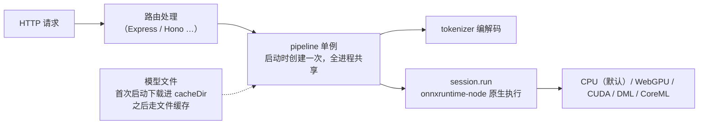

import { Meta } from '@storybook/addon-docs/blocks';

<Meta id="server-side" title="进阶/服务端运行" name="Docs" />

# 服务端运行

在服务器上跑 `@huggingface/transformers` 与浏览器是同一套 API：加载路径仍是 `pipeline` / `from_pretrained`，缓存、本地模型、env 配置的语义一个字都没变。变化的是三件事——**执行后端**从 WASM 换成 `onnxruntime-node` 原生绑定（Node、Bun、Deno 同路，v4 起还能开服务端 WebGPU）；**默认值**整体偏向服务端（本地模型、文件缓存、fp32 权重）；**部署形态**从"单页加载一次"变成"常驻进程服务多个请求"。本课给出服务端默认值速查表、Bun/Deno 的实操差异、服务端 WebGPU 的启用条件与前提，以及 API 服务里单例、流式、并发三个典型模式的可复制代码。安装命令与运行环境矩阵见[安装](?path=/docs/installation--docs)；本课是它的"实操差异"续篇，不重复环境对照。



服务端默认值速查表（「服务端」指 Node / Bun / Deno 本地运行时；v4.3.0 源码核实）：

| 配置点 | 浏览器默认 | 服务端默认 | 回查要点 |
| --- | --- | --- | --- |
| `device` | `'wasm'` | `'cpu'` | 服务端 EP 全集见下文表格 |
| `dtype` | `'q8'` | `'fp32'` | 规则按 device 走：只有 wasm 映射 q8，其余全落 fp32 |
| `allowLocalModels` | `false` | `true` | 每个文件缓存未命中时先探测本地目录 |
| 模型缓存 | Cache API（`useBrowserCache`） | 文件缓存 `useFSCache`，目录 `cacheDir` = 库安装位置旁 `.cache/` | 部署时必须处理，见「缓存与本地模型」 |
| 鉴权 | 需自定义 `env.fetch` 注入 | `HF_TOKEN` 环境变量自动注入 | gated 模型在服务端只设环境变量 |
| 推理调度 | 全局串行（所有会话共享一条链） | 不串行，但单次 `run` 同步占用事件循环 | 见「并发与任务队列」 |
| WebGPU 检测 | `navigator.gpu` | 不检测，直接视为可用 | 创建会话时才暴露失败，见「服务端 WebGPU」 |

## 快速上手

最小闭环：初始化项目 → 装依赖 → 起一个带 pipeline 单例的 HTTP 服务 → `curl` 验证。

```bash
mkdir ttsjs-server && cd ttsjs-server
npm init -y
npm i @huggingface/transformers express
```

新建 `server.mjs`（`.mjs` 后缀免改 `package.json`）：

```js
import express from 'express';
import { pipeline } from '@huggingface/transformers';

// 单例：模块顶层加载一次，之后所有请求共享这个实例
const classifier = await pipeline(
  'sentiment-analysis',
  'Xenova/distilbert-base-uncased-finetuned-sst-2-english',
  { dtype: 'q8' }, // 服务端默认 fp32（约 268 MB）；显式 q8 省 3/4 磁盘与内存
);

const app = express();
app.use(express.json());

app.post('/classify', async (req, res) => {
  const output = await classifier(req.body.text);
  res.json(output);
});

app.listen(3000, () => console.log('listening on http://localhost:3000'));
```

```bash
node server.mjs
```

```bash
curl -X POST http://localhost:3000/classify \
  -H 'Content-Type: application/json' \
  -d '{"text":"I love transformers!"}'
# [{"label":"POSITIVE","score":0.9998...}]
```

可观察结果：`curl` 返回与 [安装](?path=/docs/installation--docs) 课验证代码相同的分类输出。两个要点：`await pipeline` 写在模块顶层，所以**服务开始监听的那一刻模型必然已就绪**——不存在"接口先活、模型后到"的窗口；首次启动在 `await` 处等待的是模型下载（进 `cacheDir`），第二次启动走文件缓存直接就绪。

## Node 原生后端

Node（以及行为与它归为同一分支的 Bun / Deno 本地运行时——源码检测注释写明 "node, deno, bun"）不走 WASM：包按 `exports` 的 `node` 条件分发到 Node 构建（见[安装](?path=/docs/installation--docs)），后者经一个薄加载器引入 `onnxruntime-node` 原生绑定，加载前顺手关掉 ORT 遥测（源码 `onnx-node.js` 设 `ORT_DISABLE_TELEMETRY='1'`）。对代码的影响是零——写法与浏览器完全一致；影响的是执行与默认值：

- **性能**：原生绑定直接用机器 CPU 的多核与向量化指令，单次推理内 ORT 默认按物理核数开 intra-op 线程并行算子；浏览器 WASM 默认单线程，多线程还要页面先做跨源隔离（见 [env 配置](?path=/docs/env-config--docs)）。
- **默认 dtype 变了**。dtype 默认规则按 device 走（源码 `dtypes.js`：`'wasm' → 'q8'`，其余设备全落 `'fp32'`）——浏览器默认 `wasm + q8`，Node 默认 `cpu + fp32`。**同一模型在服务端不显式指定时下载的是 fp32 文件，磁盘与内存占用约是 q8 的 4 倍**。精度由 dtype 档位决定，与后端无关（device 不改变模型输出，见 [device 与 dtype](?path=/docs/device-dtype--docs)）。
- **模型文件走磁盘路径直读**。Node 下库把 `.onnx` 路径直接交给 ORT 由其读盘（源码 `hub.js`：跳过 buffer 读取，"ONNX runtime loads from disk directly"），不整份经过 JS 堆。
- **并发行为不同**。浏览器端所有会话的加载与推理共享一条全局串行链（否则撞 "Session already started"）；Node 不走这条链，直接调用 `session.run`——后果见「并发与任务队列」。

device 在服务端的可用全集（源码注释与 onnxruntime-node 1.30.0 README 的预编译二进制矩阵一致）：

| `device` | 平台 | 前提与说明 |
| --- | --- | --- |
| `'cpu'`（默认） | 全平台 | 原生多线程执行 |
| `'webgpu'` | Win x64/arm64、Linux x64、macOS x64/arm64（Linux arm64 无预编译） | experimental；见下节 |
| `'cuda'` | Linux x64 | NVIDIA 驱动 + CUDA 12；EP 二进制随 `npm install` 自动安装 |
| `'dml'` | Windows x64/arm64 | DirectML |
| `'coreml'` | macOS x64/arm64 | CoreML |

## Bun 与 Deno

两者都不需要换代码：都满足库的 Node-like 检测、都走 `onnxruntime-node` 原生后端。差异在包管理与运行时权限。官方示例仓库的 `bun` 与 `deno-embed` 示例即下列形态。

### Bun

代码与 Node 完全一致，官方示例没有任何特殊 flag：

```bash
bun add @huggingface/transformers
bun run server.ts   # Bun 原生跑 TS，无需转译
```

已知限制：`bun --compile` 打单文件二进制当前不可用——`onnxruntime-node` 与 `sharp` 的原生绑定无法打进二进制（`ERR_DLOPEN_FAILED`，社区 issue #1672 记录）。要发单文件部署，用 Node + 容器镜像，或放弃原生绑定走 WASM。

### Deno

用 `npm:` 引入同一个包，并让 Deno 生成 `node_modules`（原生绑定依赖它）：

```json
// deno.json
{
  "imports": { "@huggingface/transformers": "npm:@huggingface/transformers@^4.3.0" },
  "nodeModulesDir": "auto"
}
```

```bash
deno install --allow-scripts   # 原生依赖的安装脚本需要授权
deno run --allow-net --allow-ffi --allow-env --allow-read --allow-write server.ts
```

`--allow-ffi` 是加载 onnxruntime 原生绑定所需，`--allow-read` / `--allow-write` 是文件缓存所需，省略任何一项都会在运行时被权限系统拦下。另一个特例是无文件系统的 web 运行时（如 Deno Deploy，库检测为 "Deno web runtime"）：此时按 web 环境处理（WASM 后端 + Cache API），且 **`env.useWasmCache` 不许关**——关了直接抛错（WASM 工厂必须经库缓存以 blob URL 加载），保持默认 `true` 即可。

## 服务端 WebGPU

v4 的 headline 能力之一：release notes 原文 "you can now run WebGPU-accelerated models directly in Node, Bun, and Deno!"。实现基础是 onnxruntime-node 自带的 WebGPU EP（实验性质，C++ 重写的原生运行时），**用法与浏览器一字不差**：

```js
// 与官方 WebGPU 指南的示例同形：多出的只是服务器这个运行环境
const extractor = await pipeline(
  'feature-extraction',
  'mixedbread-ai/mxbai-embed-xsmall-v1',
  { device: 'webgpu' },
);
```

前提与边界（截至 v4.3.0 核实）：

- **平台**：预编译二进制覆盖 Windows x64/arm64、Linux x64、macOS x64/arm64；Linux arm64 没有 WebGPU 二进制。
- **硬件**：机器要有可用 GPU 与对应图形驱动。库在 Node 下不做浏览器那样的 `navigator.gpu` 检测（源码把 Node 直接视为 WebGPU 可用），失败不在加载前暴露，而在创建会话时报错——**没有静默回退**（[device 与 dtype](?path=/docs/device-dtype--docs) 课的硬校验规则在服务端同样成立）。
- **fp16 校验跳过**：浏览器上 webgpu + fp16 会硬校验 shader-f16；Node 侧跳过该校验（源码注释假定原生 WebGPU EP 总是支持 fp16），不支持的机器在推理阶段才暴露问题。
- **官方文档现状**：WebGPU 指南只写浏览器用法与 experimental 警告，服务端 WebGPU 的依据是 release notes 与源码，属于"能用但文档尚薄"的能力——生产采用前先在目标机器上小规模验证。

## 缓存与本地模型

字段语义（缓存选路、三步查找顺序）由 [env 配置](?path=/docs/env-config--docs) 课统一承载，本节只讲服务端部署里必须主动处理的两件事。

### 文件缓存：cacheDir

Node 默认开启文件缓存，默认目录是**库安装位置旁的 `.cache/`**（即 `node_modules/@huggingface/transformers/.cache/`）。这在服务器上是个部署陷阱：`npm ci`、重装依赖、容器镜像重建都会连缓存一起清掉，下一次启动全量重新下载。生产做法是把缓存指到持久化目录，并让首次加载发生在部署流程内而不是第一个用户请求里：

```js
import { env } from '@huggingface/transformers';

// 第一次加载之前设置（env 是全局单例，约定见 env 配置课）
env.cacheDir = process.env.CACHE_DIR ?? '/var/cache/transformers';
```

配合启动预热——快速上手的顶层 `await pipeline` 就是预热：模型下载/读盘发生在服务可监听之前，之后每个请求都命中文件缓存。容器场景把 `CACHE_DIR` 挂成卷，镜像升级也不重下。完整的离线与缓存治理见[缓存与离线](?path=/docs/cache-offline--docs)。

### 本地模型目录：localModelPath

服务端 `allowLocalModels` 默认 `true`，含义是每个文件在缓存未命中后、联网下载前，先探测本地模型目录；默认根是库安装位置旁的 `models/`，按 Hub 仓库结构镜像摆放：

```text
/var/models/
└── Xenova/
    └── distilbert-base-uncased-finetuned-sst-2-english/
        ├── config.json
        ├── tokenizer.json
        └── onnx/
            └── model_quantized.onnx
```

```js
env.localModelPath = '/var/models/';
env.allowRemoteModels = false; // 可选：内网/离线部署时彻底断掉 Hub 下载
```

自托管或预置模型进镜像时用这个布局；文件名要与 dtype 档位对应（`model_quantized.onnx` 等，映射表见 [device 与 dtype](?path=/docs/device-dtype--docs)）。生产级的缓存核对与文件检查工作流由 [ModelRegistry](?path=/docs/model-registry--docs) 承载。另一个服务端专属便利：访问 gated / 私有模型只需在环境变量里给 `HF_TOKEN`，库在 Node 下自动注入鉴权头（浏览器必须走自定义 `env.fetch`，见 [env 配置](?path=/docs/env-config--docs)）。

## 单例、流式与并发

三个模式回答同一个问题：常驻进程怎么承载多个请求。

### pipeline 单例

pipeline 的创建成本是模型下载（首次）+ 会话创建（每次），秒到分钟级；调用成本是毫秒级推理。所以铁律是**创建一次、复用到进程退出**，绝不把 `pipeline(...)` 写进请求处理器。两种初始化形态：

```js
// 形态一：启动即加载（快速上手的写法）
// 服务就绪 = 模型就绪；启动慢，但首个请求不背加载成本
const classifier = await pipeline('sentiment-analysis', 'Xenova/…', { dtype: 'q8' });

// 形态二：首请求懒加载
// 启动快；第一个请求触发加载（会明显变慢），之后共享
let pipePromise;
function getClassifier() {
  pipePromise ??= pipeline('sentiment-analysis', 'Xenova/…', { dtype: 'q8' });
  return pipePromise;
}
```

关键在缓存的是 **Promise 而不是结果**：并发请求拿到同一个 Promise，加载只发生一次。多模型服务同理——每个模型一个单例，不用的模型不加载（权重常驻内存，加载几个吃几个）。

### 流式响应接 TextStreamer

生成类任务在服务端走 SSE：`TextStreamer` 的回调里向响应流写事件，token 边生成边推送。回调与切片规则（英文按词、中文近逐字）由[流式输出](?path=/docs/streaming--docs)课承载，这里只看服务端接线（`generator` 是按上文方式创建的 text-generation 单例）：

```js
app.post('/chat', async (req, res) => {
  res.set({
    'Content-Type': 'text/event-stream',
    'Cache-Control': 'no-cache',
    Connection: 'keep-alive',
  });

  // 每个请求一个 streamer；tokenizer 从单例上取
  const streamer = new TextStreamer(generator.tokenizer, {
    skip_prompt: true, // 不回显提示
    callback_function: (piece) => {
      res.write(`data: ${JSON.stringify({ piece })}\n\n`); // 每段文本推送一次
    },
  });

  await generator(req.body.messages, { max_new_tokens: 256, streamer });
  res.write('data: [DONE]\n\n');
  res.end();
});
```

### 并发与任务队列

源码核实的两层事实，合起来决定服务端的并发形态：

- **正确性**：ONNX Runtime 的 `Run` 在同一 session 上并发调用是线程安全的（官方 issue #114 确认），transformers.js 在 Node 下又不像 web 环境那样全局串行——所以同一 pipeline 单例被并发调用**不会算错**。
- **吞吐**：onnxruntime-node 的 `run` 是同步原生调用（源码 `inference_session_wrap.cc` 核实）——单次推理期间 Node 事件循环被占用，**其他请求（包括健康检查）都在排队**。并发不并行：单例不会因为请求多而变快，也不会互相加速。

实际影响分两档：分类、embedding 这类毫秒级推理，阻塞无感，直接并发调用即可；LLM 逐 token 生成动辄数秒，一个长生成会卡住整个服务，需要主动组织：

```js
// 最小串行队列：长生成逐个执行，失败不阻断后续任务
let chain = Promise.resolve();
function enqueue(task) {
  const run = chain.then(task);
  chain = run.catch(() => {});
  return run;
}

app.post('/generate', async (req, res) => {
  // genOptions：该请求的生成参数（max_new_tokens、streamer 等，见流式小节）
  const output = await enqueue(() => generator(req.body.messages, genOptions));
  res.json(output);
});
```

更重的部署用 `worker_threads` 或多进程把推理挪出主事件循环（每个 worker 各自持有单例、各自吃一份内存），或按并发数横向扩容器副本。

## 最佳实践

- **device 与 dtype 在服务端显式写全。** 默认组合是 `cpu + fp32`，权重磁盘与内存占用是 q8 的 4 倍；CPU 服务传 `dtype: 'q8'`，GPU 服务按 [device 与 dtype](?path=/docs/device-dtype--docs) 的档位表选 fp16 / q4f16。
- **`device: 'auto'` 别在裸 Linux 服务器上赌。** Linux x64 的支持列表把 `cuda` 排在前面，机器没有 NVIDIA 环境时创建会话硬失败（`OrtSessionOptionsAppendExecutionProvider_Cuda: Failed to load shared library`，issue #1642）——显式写 `'cpu'` 或 `'webgpu'`。
- **缓存目录与模型目录都指向持久化路径。** 默认都在 `node_modules` 里，随依赖重装清空；`env.cacheDir` / `env.localModelPath` 指到挂载卷，首次加载放在部署流程内（启动预热）完成。
- **长生成必须有组织，短推理可以裸奔。** 毫秒级任务依赖单例直接并发；秒级 LLM 生成配串行队列或 worker 隔离，别让一个请求占死事件循环。
- **服务端 WebGPU 先验证后上产。** experimental + 平台矩阵 + 无静默回退，目标机器跑通再写进部署清单。

## 常见问题

- 服务"启动后卡住"或第一个请求超时
  首次调用 `pipeline` 在下载模型，耗时取决于网络与模型体积。把加载提到服务启动阶段（顶层 `await`）做预热，并用持久化 `env.cacheDir` 保证只有第一次启动下载。
- Docker / CI 里每次构建都重新下载几个 GB 的模型
  默认 `cacheDir` 在 `node_modules/@huggingface/transformers/.cache/`，`npm ci` 或镜像层重建即被清空。设置 `env.cacheDir` 指向挂载卷或预烤进镜像的目录，模型目录也可用 `env.localModelPath` 预置。
- Linux 服务器上报 `OrtSessionOptionsAppendExecutionProvider_Cuda: Failed to load shared library`
  `device: 'auto'`（或 `'cuda'`）在没有 NVIDIA 驱动 / CUDA 12 运行库的机器上硬失败。显式指定 `device: 'cpu'`；确需 CUDA 再装驱动与 CUDA 12。
- Node 里写 `device: 'webgpu'`，创建会话直接抛错
  服务端没有 WebGPU 可用性检测，失败只会在创建会话时暴露。确认机器有可用 GPU 与驱动（Linux arm64 无预编译二进制）；没有就回 `'cpu'`，或按上节先小规模验证。
- Deno 运行报权限类错误（ffi / scripts / read / write）
  原生绑定与文件缓存都需要显式授权：安装时 `deno install --allow-scripts`，运行时加 `--allow-ffi --allow-net --allow-env --allow-read --allow-write`。Deno Deploy 等 web 运行时则不要关 `useWasmCache`。
- `bun --compile` 打出的二进制一启动就崩
  已知限制：原生依赖（`onnxruntime-node`、`sharp`）无法打进单文件二进制。改用 Node + 容器镜像部署，或评估 WASM 后端方案。

## 总结回顾

摘要：

服务端运行与浏览器共用同一套 API 与加载语义，差异集中在环境替你选好的默认值与部署形态上。Node、Bun、Deno 本地运行时满足同一个 Node-like 检测，都走 `onnxruntime-node` 原生后端：多核原生执行通常快于浏览器 WASM，但默认 dtype 从 q8 变成 fp32（权重体积约 4 倍），模型文件以磁盘路径直读。服务端 WebGPU 是 v4 正式能力，写法与浏览器一致，前提是预编译矩阵覆盖的平台加可用 GPU 与驱动，且失败只在创建会话时暴露。缓存与本地模型在服务端默认开启，但默认目录都在 `node_modules` 里，生产必须用 `env.cacheDir` / `env.localModelPath` 指到持久化路径并做启动预热。部署形态上，pipeline 做成进程级单例（启动加载或缓存 Promise 的懒加载），生成任务用 TextStreamer 接 SSE 流式响应；同一单例并发调用结果正确（ORT Run 线程安全），但 onnxruntime-node 的 `run` 同步占用事件循环——短任务无感，长 LLM 生成需要串行队列或 worker 隔离。

一句话：

> 服务端与浏览器共用一套 API，差异都藏在默认值里——后端换原生、权重换 fp32、缓存换文件系统；生产要做的是显式指定、持久化缓存、单例化加载。

知识要点：

- Node、Bun、Deno 走哪个后端？由哪个环境检测决定？
- 服务端不指定 device 与 dtype 时下载哪份权重文件？与浏览器默认差多少倍？
- 服务端 device 的可用全集是什么？`device: 'auto'` 在裸 Linux 上会出什么问题？
- 服务端 WebGPU 怎么开启？平台矩阵与失败时机是什么？为什么说它"文档尚薄"？
- 默认 `cacheDir` 在哪、何时会被清空？生产怎么配？`localModelPath` 的目录布局怎样？
- 为什么 pipeline 必须是单例？启动加载与懒加载各背什么成本？缓存 Promise 的意义是什么？
- 同一 pipeline 并发调用安全吗？onnxruntime-node 的 `run` 对事件循环意味着什么？
- Deno 需要哪些权限 flag？Bun `--compile` 的已知问题是什么？

## 参考资料

- [v4.0.0 Release notes](https://github.com/huggingface/transformers.js/releases/tag/4.0.0)
  服务端 WebGPU 能力的官方声明（"run WebGPU-accelerated models directly in Node, Bun, and Deno"）与原生 WebGPU 运行时说明。
- [env.js（v4.3.0 源码）](https://github.com/huggingface/transformers.js/blob/4.3.0/packages/transformers/src/env.js)
  `IS_NODE_ENV`（node/deno/bun 同分支）、`IS_WEBGPU_AVAILABLE`（Node 恒可用）、`DEFAULT_CACHE_DIR` / `localModelPath` 默认值、`HF_TOKEN` 读取。
- [backends/onnx.js（v4.3.0 源码）](https://github.com/huggingface/transformers.js/blob/4.3.0/packages/transformers/src/backends/onnx.js)
  服务端 EP 支持矩阵注释、Node/web 分支的默认设备、web 环境全局串行链、Deno web runtime 的 `useWasmCache` 限制。
- [backends/onnx-node.js（v4.3.0 源码）](https://github.com/huggingface/transformers.js/blob/4.3.0/packages/transformers/src/backends/onnx-node.js)
  `onnxruntime-node` 薄加载器与 `ORT_DISABLE_TELEMETRY` 设置。
- [utils/dtypes.js（v4.3.0 源码）](https://github.com/huggingface/transformers.js/blob/4.3.0/packages/transformers/src/utils/dtypes.js)
  默认 dtype 规则（wasm → q8，其余设备 → fp32）。
- [models/session.js（v4.3.0 源码）](https://github.com/huggingface/transformers.js/blob/4.3.0/packages/transformers/src/models/session.js)
  webgpu + fp16 校验在 Node 下跳过的源码注释。
- [utils/hub.js（v4.3.0 源码）](https://github.com/huggingface/transformers.js/blob/4.3.0/packages/transformers/src/utils/hub.js)
  Node 下模型文件以路径直读（跳过 buffer 读取）的实现。
- [onnxruntime-node README（v1.30.0）](https://github.com/microsoft/onnxruntime/blob/v1.30.0/js/node/README.md)
  预编译二进制 EP 矩阵、CUDA 12 与 EP 二进制自动安装说明。
- [inference_session_wrap.cc（onnxruntime v1.30.0 源码）](https://github.com/microsoft/onnxruntime/blob/v1.30.0/js/node/src/inference_session_wrap.cc)
  `session.run` 同步原生调用的实现（模型加载走 libuv worker，run 不走）。
- [microsoft/onnxruntime#114](https://github.com/microsoft/onnxruntime/issues/114)
  同一 InferenceSession 并发 `Run` 的官方线程安全确认。
- [huggingface/transformers.js#1642](https://github.com/huggingface/transformers.js/issues/1642)
  `device: 'auto'` 在无 CUDA 库的 Linux x64 上硬失败的现象与报错原文。
- [huggingface/transformers.js#1672](https://github.com/huggingface/transformers.js/issues/1672)
  Bun `--compile` 单二进制打包失败的原因（原生绑定与路径/buffer 行为）。
- [transformers.js-examples · bun / deno-embed / whisper-node](https://github.com/huggingface/transformers.js-examples)
  Bun 免 flag 运行、Deno 权限 flag 与 `nodeModulesDir` 配置的官方示例出处。
- [Transformers.js 官方文档 · WebGPU 指南](https://huggingface.co/docs/transformers.js/en/guides/webgpu)
  WebGPU 的浏览器语境说明（服务端现状以此对照：官方文档未覆盖服务端用法）。
- [ONNX Runtime 线程调优文档](https://onnxruntime.ai/docs/performance/tune-performance/threading.html)
  intra-op 线程默认按物理核数并行的依据。
