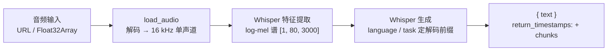

import { Canvas, Controls, Meta } from '@storybook/addon-docs/blocks';
import * as SpeechRecognition from './speech-recognition.stories';

<Meta of={SpeechRecognition} name="Docs" />

# 语音识别

`automatic-speech-recognition` 管线（别名 `asr`）把音频变成文字，默认走 Whisper 模型族。本课围绕四个问题展开：音频怎么进（`load_audio` 解码并重采样为 16 kHz）、换什么模型（多语模型与 `.en` 变体）、`language` / `task` 选项怎么用（`transcribe` 转写、`translate` 译成英语）、输出长什么样（`{ text }` 与 `chunks` 时间戳），外加长音频的分段处理。这条管线是生成式任务：模型逐 token 解码，音频输入必须先变成 16 kHz 单声道的 `Float32Array`——这两点决定了它的行为与 3.1 的文本任务明显不同。

读完本页你应该能预测实例的行为：切换音频后波形与「音频」读数更新；「任务」切到 `translate` 或指定语言时「模型」读数会从 `whisper-tiny.en` 换成多语的 `whisper-tiny`；开启时间戳后波形下方出现分段条；60 秒长音频关掉分段时文本停在约 30 秒处。



| 关键输入 / 输出 | 必填 | 默认值 | 回查要点 |
| --- | --- | --- | --- |
| `task`（创建管线） | 是 | — | `'automatic-speech-recognition'`，别名 `'asr'`；默认模型 `Xenova/whisper-tiny.en` |
| `model` | 否 | `Xenova/whisper-tiny.en` | 多语或翻译用 `Xenova/whisper-tiny`（99 种语言） |
| 推理输入 `pipe(audio)` | 是 | — | URL 字符串、`URL`、`Float32Array`、`Float64Array`；Whisper 要求 16 kHz 单声道 |
| `options.language` | 否 | `null` | 源语言提示，接受 `'zh'` / `'chinese'` / `'<|zh|>'` 等写法；仅多语模型；**不传不会自动检测，默认按英语处理** |
| `options.task` | 否 | `'transcribe'` | `'translate'` 固定译成英语；仅多语模型，`.en` 模型传了直接抛错 |
| `options.return_timestamps` | 否 | `false` | `true` → 段级 `chunks`；`'word'` → 词级（仓库需带 `alignment_heads`） |
| `options.chunk_length_s` | 否 | `0`（不分段） | `>0` 启用滑窗分段；**不分段时超过 30 秒的音频只转前 30 秒且不报错** |
| `options.stride_length_s` | 否 | `chunk_length_s / 6` | 相邻窗口重叠秒数，必须小于 `chunk_length_s` |
| 推理输出 | — | — | `{ text }`；开时间戳多出 `chunks: [{ timestamp: [起, 止], text }]` |

## 快速上手

最小闭环是三行 `await`：创建实例、传 URL、读 `text`。

```js
import { pipeline } from '@huggingface/transformers';

// 创建识别管线：默认模型 Xenova/whisper-tiny.en（仅英语，39M 参数）
const transcriber = await pipeline('automatic-speech-recognition', 'Xenova/whisper-tiny.en');

// 音频直接传 URL：管线内部自动解码并重采样为 16 kHz
const url = 'https://huggingface.co/datasets/Xenova/transformers.js-docs/resolve/main/jfk.wav';
const output = await transcriber(url);
// { text: " And so my fellow Americans ask not what your country can do for you, ask what you can do for your country." }
```

输出是 `{ text }` 对象（注意官方示例的转写文本以空格开头）。`whisper-tiny.en` 在 q8 档位下下载 `encoder_model_quantized.onnx`（约 10.1 MB）加 `decoder_model_merged_quantized.onnx`（约 30.7 MB），合计约 41 MB。

下面的内嵌实例执行的就是这条管线，并把音频输入、`language`/`task`、时间戳与长音频分段都接到 Controls 上。**首次打开会下载约 1.9 MB 音频与约 41 MB 模型**；把「任务」切到 `translate` 或指定语言时会再加载多语模型 `whisper-tiny`（另约 41 MB，之后命中浏览器缓存）。右下角的播放器播放原始文件，画布波形画的是模型实际吃到的 16 kHz 数据，可以对照听。

<Canvas of={SpeechRecognition.Interactive} />
<Controls of={SpeechRecognition.Interactive} />

| 读者操作 | 可观察证据 |
| --- | --- |
| 等待首次加载 | 「状态」变为 就绪；画布显示音频解码与模型下载进度 |
| 切换「示例音频」 | 「音频」读数更新时长与采样数，波形重绘、转写文本变化；播放器可对照听 |
| 「任务」切到 `translate` | 「模型」读数从 `whisper-tiny.en` 变为 `whisper-tiny`；法语短句输出英文翻译 |
| 法语音频 + 「语言」选 `french` | 转写出法文文本；对比「不指定」时被按英语处理的乱串输出 |
| 开启「返回时间戳」 | 「时间戳」读数给出 chunks 段数，波形下方出现按比例的分段条 |
| `ted_60.wav` 上开「长音频分段」 | 关闭时文本停在约 30 秒处；开启后 60 秒完整转写 |
| 打开 Show code | 查看实例实际执行的 `speech-recognition-pipeline.ts` |

## 音频输入：load_audio 与 16 kHz

Whisper 对输入音频只有一条硬要求：16 kHz 单声道。任意采样率、声道数的音频都由 `load_audio` 统一变成这个形态——URL 进，`Float32Array` 出：

```js
import { load_audio } from '@huggingface/transformers';

// URL → 解码 + 重采样为 16 kHz；16000 是 Whisper 唯一接受的采样率
const audio = await load_audio(
  'https://huggingface.co/datasets/Xenova/transformers.js-docs/resolve/main/jfk.wav',
  16000,
);
audio instanceof Float32Array; // true：单声道 PCM 采样值
audio.length / 16000;          // 音频时长（秒）
```

要点（v4.3.0 源码核实）：

- `load_audio(url, sampling_rate)` 在浏览器里用 `AudioContext` 解码并重采样；**不传采样率时按环境默认值处理并打警告**，送进模型的谱图会失真。
- 立体声按 FFmpeg 同款 1/√2 比例衰减后混成单声道，防止满幅信号相加削波。
- 传给管线可以偷懒：`pipe(url)` 内部走同一套解码重采样（v4.3.0 源码里调用的还是旧名 `read_audio`，行为与 `load_audio` 完全相同）。接受四类输入：URL 字符串、`URL` 对象、`Float32Array`、`Float64Array`。
- 文件上传场景（`<input type="file">`）拿到的是 `File`/`Blob`：先用 `URL.createObjectURL(file)` 包成 `blob:` URL 再传，解码后记得 `revokeObjectURL`。
- `load_audio` 依赖 `AudioContext`，只能在浏览器 / Web Worker 用；Node 下会抛错并提示直接把音频数据传给管线（详见 [2.1.3 processor 与多模态输入](?path=/docs/processor--docs)）。

在实例中核对：「音频」读数显示这段数据的形态——时长与采样数（1 秒恰好 16000 个采样），画布波形就是它本身；播放器里听到的则是原始采样率的文件。

## Whisper 模型族：tiny、base、small 与 .en 变体

Whisper 的每个规模都有两个变体：多语版（`whisper-tiny` 等）和英语专精版（`whisper-tiny.en` 等）。`.en` 不是更小的模型——两者架构、体积几乎相同，只是 `.en` 在英语数据上微调、解码前缀里去掉了语言与任务 token：

| 模型 | 参数量 | q8 下载（encoder + decoder_merged） | 多语 / 翻译 |
| --- | --- | --- | --- |
| `whisper-tiny` / `.en` | 39 M | 约 41 MB（10.1 + 30.7） | 仅多语版 |
| `whisper-base` / `.en` | 74 M | 约 77 MB（23.2 + 53.7） | 仅多语版 |
| `whisper-small` / `.en` | 244 M | 约 249 MB（92.3 + 156.8） | 仅多语版 |

选型规则（源码核实）：

- **只处理英语**：直接用 `.en` 变体——它就是 `automatic-speech-recognition` 任务的库默认模型（`Xenova/whisper-tiny.en`），少两个选项、行为更可预期。
- **任何其他语言或翻译**：必须选多语变体并显式传 `language` / `task`。多语模型的 `generation_config.json` 带 99 种语言的 `lang_to_id` 与 `task_to_id`。
- **给 `.en` 模型传 `language` 或 `task` 会直接抛错**（`Cannot specify task or language for an English-only model`）——不是忽略，是报错。
- fp32 档位体积约为 q8 的 3.7 倍（tiny 约 152 MB），dtype 与设备取舍见 [2.3.1 device 与 dtype](?path=/docs/device-dtype--docs)。

中文识别预期：中文在 Whisper 支持的 99 种语言之列，但 tiny 级模型对中文的识别错漏明显——训练语料以英语为主，多语数据占比有限，音节文字对模型容量也更敏感。对中文有认真需求，从 `base` 起步、优先 `small` 及以上，同时接受相应体积（small 的 q8 已约 249 MB，超出本手册浏览器演示的常用预算）。

在实例中核对：「模型」读数随选项切换——`transcribe` 且不指定语言时是 `whisper-tiny.en`；切到 `translate` 或指定任何语言后变成 `whisper-tiny`，此时会看到第二次模型下载。

## language 与 task：源语言与转写/翻译

这两个选项只在多语模型上生效，共同决定解码的第一个 token 前缀：`language` 提示「音频说的是什么语言」，`task` 决定「输出什么」。

- `task: 'transcribe'`（默认）：转写为音频所说的语言，文本语言跟随语音。
- `task: 'translate'`：**固定译成英语**——Whisper 的 X→en 单向翻译，不是任意互译；把英语转成中文要用翻译管线（见 [3.1.3 问答与摘要](?path=/docs/qa-summarization--docs)）。

`language` 接受三种写法（大小写不敏感，源码 `whisper_language_to_code` 核实）：

| 写法 | 示例 | 说明 |
| --- | --- | --- |
| 语言代码 | `'zh'`、`'en'`、`'fr'` | 二字母码，共 99 种 |
| 语言名 | `'chinese'`、`'french'` | 更可读，另有少量别名（如 `'castilian'` → es） |
| 特殊 token | `'<|zh|>'` | 与 Whisper 原生 token 对应 |

完整语言清单在模型仓库 `generation_config.json` 的 `lang_to_id`，或源码 `common_whisper.js` 的 `WHISPER_LANGUAGES` 表。

**最重要的坑：不传 `language` 不等于自动检测。** v4.3.0 没有实现语言检测（源码里是一条 TODO），多语模型不传 `language` 时打警告 `No language specified - defaulting to English (en)` 并按英语处理——法语音频会被「硬转」成不通顺的英文串。官方文档的类型注释写的 "auto-detected" 与实际行为不符，以源码为准。

官方示例的输出值（转法语短句，官方用 `whisper-small` 演示；tiny 输出可能略有出入）：

```js
const transcriber = await pipeline('automatic-speech-recognition', 'Xenova/whisper-small');
const url = 'https://huggingface.co/datasets/Xenova/transformers.js-docs/resolve/main/french-audio.mp3';

await transcriber(url, { language: 'french', task: 'transcribe' });
// { text: " J'adore, j'aime, je n'aime pas, je déteste." }

await transcriber(url, { language: 'french', task: 'translate' });
// { text: " I love, I like, I don't like, I hate." }
```

在实例中核对：法语音频在 `french` + `transcribe` 下输出法文；`french` + `translate` 下输出英文；「语言」选「不指定」时的输出则明显混乱——这就是默认按英语处理的结果。

## 输出结构：text 与时间戳 chunks

`return_timestamps` 有三档，输出结构随之变化：

```js
const output = await transcriber(url);
// { text: " And so my fellow Americans ask not what your country can do for you, ask what you can do for your country." }

const segmented = await transcriber(url, { return_timestamps: true });
// {
//   text: " And so my fellow Americans ask not what your country can do for you, ask what you can do for your country.",
//   chunks: [
//     { timestamp: [0, 8],  text: " And so my fellow Americans ask not what your country can do for you" },
//     { timestamp: [8, 11], text: " ask what you can do for your country." }
//   ]
// }

const words = await transcriber(url, { return_timestamps: 'word' });
// chunks: [{ text: " And", timestamp: [0, 0.78] }, { text: " so", timestamp: [0.78, 1.06] }, ...]
```

- **`false`（默认）**：只有 `{ text }`。文本以空格开头、标点由模型生成，展示前自行 `trim()`。
- **`true`**：多出 `chunks` 数组，每段是 `{ timestamp: [起, 止], text }`，秒为单位的段级时间戳。
- **`'word'`**：词级时间戳。内部走 `return_token_timestamps`，要求模型仓库的 `generation_config.json` 带 `alignment_heads`（`Xenova/whisper-*` 转换版都带）；`task: 'translate'` 时官方警告词级时间戳不可靠。

批量输入传数组时返回结果数组，形态判断与 3.1 各课相同（`Array.isArray(output[0])` 区分批量）。

在实例中核对：开启「返回时间戳」后，「时间戳」读数给出 chunks 段数，波形下方的分段条按真实秒数等比铺开——段的边界与语音停顿对齐。

## 长音频：chunk_length_s 分段

Whisper 的输入窗口固定 30 秒：特征提取器把音频做成 `[1, 80, 3000]` 的 log-mel 谱，3000 帧 = 30 秒。因此**不分段时，超过 30 秒的音频被静默截断**——特征提取源码直接 `slice` 前 30 秒并打警告，管线照常返回「成功」的结果，你只拿到开头 30 秒的文字；不足 30 秒的音频则补零对齐。

长音频必须显式分段：

```js
// 超过 30 秒的音频：不给 chunk_length_s 只转前 30 秒，且不报错
const output = await transcriber(longAudioUrl, {
  chunk_length_s: 30,   // 每窗 30 秒
  stride_length_s: 5,   // 相邻窗重叠 5 秒；不传默认 chunk_length_s / 6
});
```

机制与边界（v4.3.0 源码核实）：

- 分段把音频切成带重叠的滑窗（窗口 `chunk_length_s` 秒，重叠 `stride_length_s` 秒，必须小于窗口），逐窗识别后在解码侧用重叠区对齐拼接。
- 官方示例取 `30` / `5`。另有 `force_full_sequences`（默认 `false`）控制拼接时的补齐行为，一般不用动。
- 各窗口**顺序**生成（源码注释 `doing sequentially for now`），长音频推理耗时随时长线性增长；没有并行分块。
- 极长音频也可以自己先切成小于 30 秒的段逐段识别再拼接——`chunk_length_s` 是内置的省事方案，自切段便于挂进度与断点。

在实例中核对：选 `ted_60.wav`（60 秒），关闭「长音频分段」时文本在约 30 秒处戛然而止；开启后完整转写 60 秒——两条结果同时看到「截断」与「分段」的差异。

## 最佳实践

- **把模型选择写进代码，不要依赖运行时默认。** 英语场景显式用 `.en` 变体；涉及其他语言或翻译时显式换多语变体并传 `language` / `task`。默认模型可能随库版本调整，显式指定才能保证行为可复现。
- **多语识别永远显式传 `language`。** v4.3.0 没有自动检测，「不传」就是按英语处理——这是本课最容易静默出错的一个选项。
- **长音频永远加分段。** 截断无报错，是「看起来成功但结果残缺」的典型来源；`chunk_length_s: 30` 一行就能避免。
- **实例创建一次反复调用。** 换音频、换选项只触发新的推理；`.en` 与多语两个变体是两个仓库，各下载一次后走缓存，来回切换无需重新下载。

## 常见问题

- 转写结果在 30 秒处戛然而止，控制台却没有报错
  这是未分段的静默截断：Whisper 输入窗口固定 30 秒，超出部分被丢弃。给推理调用加 `chunk_length_s: 30`（需要更平滑的拼接再加 `stride_length_s`），或先自行切段逐段识别。
- 中文或法语音频转出了一串不通顺的英文
  多语模型在未指定 `language` 时默认按英语处理（v4.3.0 无自动检测，控制台有 `No language specified` 警告）。显式传 `language: 'chinese'` 或 `'french'`；tiny 级模型中文效果有限，认真场景换更大的多语模型。
- 报错 `Cannot specify task or language for an English-only model`
  给 `.en` 模型传了 `language` 或 `task`。这两项只在多语模型上有效：需要时把模型换成 `Xenova/whisper-tiny` 等多语变体。
- 把「任务」切到 `translate` 后，浏览器又下载了约 41 MB
  `translate` 只在多语模型可用，`whisper-tiny` 与 `whisper-tiny.en` 是两个独立仓库，首次使用各下载一次；之后命中浏览器缓存，来回切换不再下载。
- 语音识别比文本分类慢得多
  这是生成式任务：模型逐 token 自回归解码，且长音频分窗后按顺序生成。提速可选更小的模型（tiny）、更短的音频，或切到 WebGPU（兼容现状见 [2.3.1 device 与 dtype](?path=/docs/device-dtype--docs)）。

## 总结回顾

摘要：

`automatic-speech-recognition` 管线把音频交给 Whisper 模型族转成文字：音频以 URL、`Float32Array` 等形态传入，`load_audio` 统一解码并重采样为 16 kHz 单声道（不传采样率会警告失真）；`whisper-tiny.en` 是库默认模型（q8 约 41 MB），多语变体 `whisper-tiny` 才支持 99 种语言的 `language` 提示与 `transcribe` / `translate` 两种任务，`.en` 模型传这两项会直接抛错。输出默认是 `{ text }`，`return_timestamps` 的 `true` / `'word'` 两档分别给出段级与词级的 `chunks` 时间戳。Whisper 输入窗口固定 30 秒：不加 `chunk_length_s` 时长音频被静默截断，加上滑窗分段（官方取 30 秒窗、5 秒重叠）才能完整转写；中文识别在 tiny 级别效果有限，认真场景需要更大的多语模型。

一句话：

> Whisper 管线没有智能默认：`language` 不传就按英语处理、长音频不切段就静默截断——显式指定这两项，才能把「看似成功」变成「结果正确」。

知识要点：

- 音频输入有哪四种类型？`load_audio` 做了什么？16 kHz 是谁的要求？
- tiny、base、small 的 q8 体积各是多少？`.en` 与多语变体的差别是什么？
- 不传 `language` 时多语模型的行为是什么？`task` 的两个取值各做什么？
- `return_timestamps` 的三档取值分别返回什么结构？
- 超过 30 秒的音频不加分段会怎样？`chunk_length_s` 与 `stride_length_s` 如何配合？

## 参考资料

- [Transformers.js 官方文档 · pipelines API](https://huggingface.co/docs/transformers.js/en/api/pipelines)
  `automatic-speech-recognition` 的调用示例（URL 输入、`return_timestamps`、`language`/`task`、长音频分段）与输出结构。
- [Transformers.js 官方文档 · utils/audio API](https://huggingface.co/docs/transformers.js/en/api/utils/audio)
  `load_audio` / `read_audio` 的定义与废弃标注。
- [automatic-speech-recognition.js 源码（v4.3.0）](https://github.com/huggingface/transformers.js/blob/main/packages/transformers/src/pipelines/automatic-speech-recognition.js)
  本课全部推理选项的注释定义、官方示例输出值、chunk 滑窗与顺序生成的实现。
- [models/whisper/modeling_whisper.js 源码（v4.3.0）](https://github.com/huggingface/transformers.js/blob/main/packages/transformers/src/models/whisper/modeling_whisper.js)
  `_retrieve_init_tokens`：language/task 解码前缀、不传 language 默认英语（无自动检测的 TODO）、`.en` 模型抛错的出处。
- [models/whisper/feature_extraction_whisper.js 源码（v4.3.0）](https://github.com/huggingface/transformers.js/blob/main/packages/transformers/src/models/whisper/feature_extraction_whisper.js)
  30 秒截断（`slice` 前置警告）与不足 30 秒补零的实现。
- [models/whisper/common_whisper.js 源码（v4.3.0）](https://github.com/huggingface/transformers.js/blob/main/packages/transformers/src/models/whisper/common_whisper.js)
  99 种语言的 `WHISPER_LANGUAGES` 映射与 `whisper_language_to_code` 的三种写法。
- [models/whisper/generation_whisper.js 源码（v4.3.0）](https://github.com/huggingface/transformers.js/blob/main/packages/transformers/src/models/whisper/generation_whisper.js)
  `WhisperGenerationConfig`：`return_timestamps`、`task`、`language`、`alignment_heads` 等字段定义。
- [Xenova/whisper-tiny.en](https://huggingface.co/Xenova/whisper-tiny.en) 与 [Xenova/whisper-tiny](https://huggingface.co/Xenova/whisper-tiny)
  本课两个示例模型仓库：`onnx/` 目录核对 q8 体积（encoder 约 10.1 MB、decoder_model_merged 约 30.7 MB），`generation_config.json` 核对 `lang_to_id`（99 种）、`task_to_id` 与 `alignment_heads`。
- [OpenAI Whisper 开源仓库](https://github.com/openai/whisper)
  模型族参数量（tiny 39M / base 74M / small 244M）与多语、翻译任务能力的原始出处。
- [Xenova/transformers.js-docs 数据集](https://huggingface.co/datasets/Xenova/transformers.js-docs)
  本课三段示例音频（jfk.wav、french-audio.mp3、ted_60.wav）的来源，官方文档示例所用、允许跨域访问。
